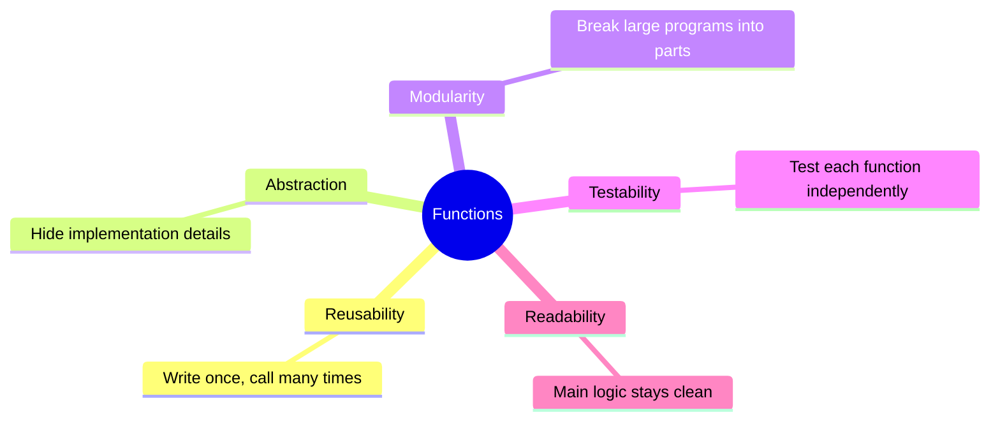
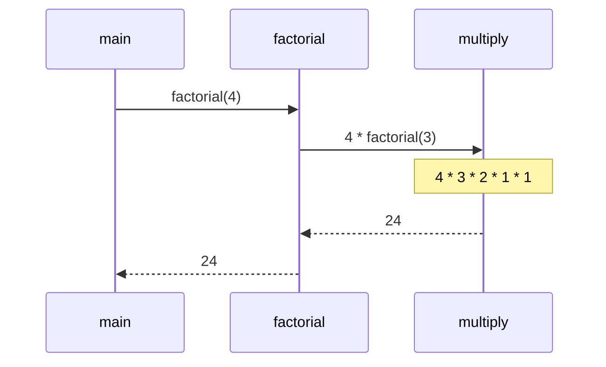
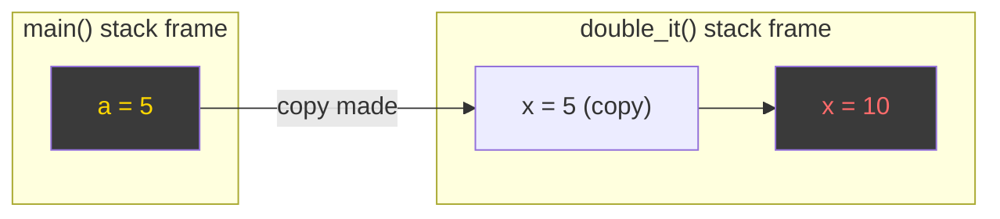
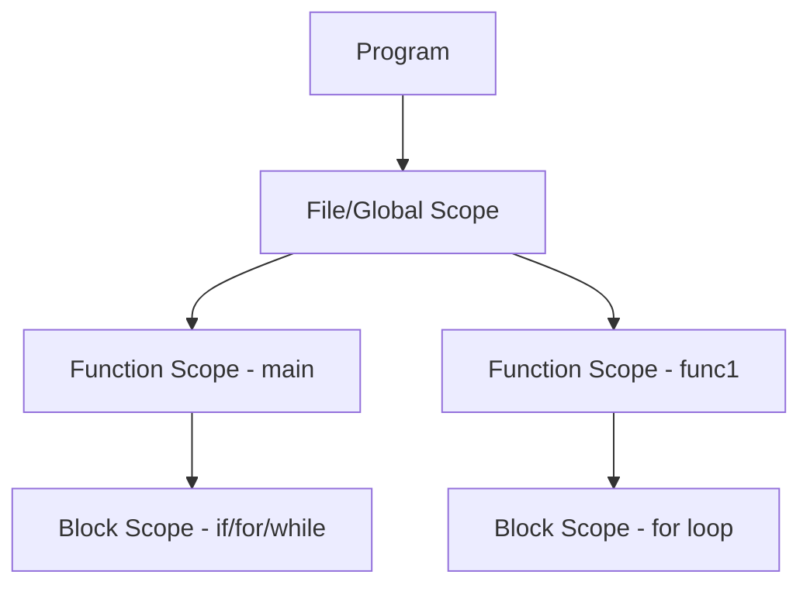
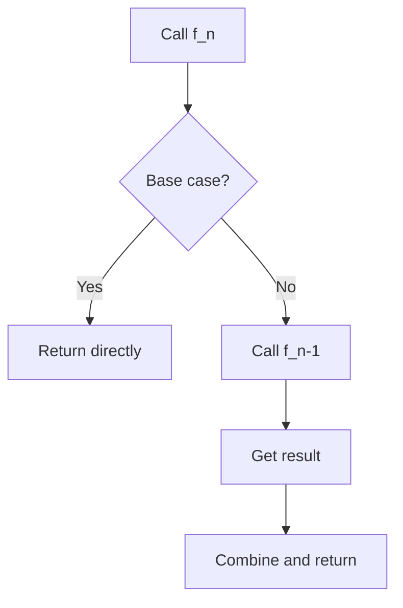

# 03 · Functions & Program Structure

> **Prerequisite:** [02 — C Overview](02_c_overview.md)

---

## Table of Contents

1. [Functions](#1-functions)
2. [Parameter Passing Conventions](#2-parameter-passing-conventions)
3. [Scope Rules](#3-scope-rules)
4. [Storage Classes](#4-storage-classes)
5. [Recursion](#5-recursion)
6. [Practice Problems](#6-practice-problems)
7. [References & Resources](#7-references--resources)

---

## 1. Functions

A **function** is a self-contained block of code that performs a specific task, can take inputs, and can return a result.

### 1.1 Why Functions?



### 1.2 Function Anatomy

```
return_type  function_name ( parameter_list )
{
    /* local variable declarations */
    /* statements */
    return expression;    /* optional for void */
}
```

**Full example:**

```c
#include <stdio.h>

/* ── DECLARATION (prototype) ─────────────────────── */
float power(float base, int exp);

/* ── DEFINITION ──────────────────────────────────── */
float power(float base, int exp) {
    float result = 1.0f;
    for (int i = 0; i < exp; i++)
        result *= base;
    return result;
}

/* ── CALL ────────────────────────────────────────── */
int main(void) {
    printf("2^10 = %.0f\n", power(2.0f, 10));  // 1024
    return 0;
}
```

### 1.3 Function Prototype (Forward Declaration)

Without a prototype, the compiler assumes an `int`-returning function — dangerous.

```c
// Prototype tells compiler: "this function exists, here is its signature"
double sqrt(double x);     // from <math.h>
void   print_stars(int n); // user-defined

int main(void) {
    print_stars(5);       // OK — prototype seen above
    return 0;
}

void print_stars(int n) {
    for (int i = 0; i < n; i++) putchar('*');
    putchar('\n');
}
```

### 1.4 `void` Functions

```c
void greet(const char *name) {
    printf("Hello, %s!\n", name);
    // no return statement needed (or return; with no value)
}
```

### 1.5 Function Call Stack



Each call creates a **stack frame** containing:
- Return address
- Parameters
- Local variables

---

## 2. Parameter Passing Conventions

### 2.1 Pass by Value (Default in C)

A **copy** of the argument is passed. The original variable is unchanged.

```c
void double_it(int x) {
    x = x * 2;      // modifies local copy only
    printf("Inside: %d\n", x);
}

int main(void) {
    int a = 5;
    double_it(a);
    printf("Outside: %d\n", a);   // still 5!
    return 0;
}
```

```
Inside:  10
Outside: 5     ← original unchanged
```



### 2.2 Pass by Pointer (Simulating Pass by Reference)

A **pointer to the variable** is passed. Dereferencing changes the original.

```c
void double_it(int *px) {
    *px = *px * 2;   // dereference and modify original
}

int main(void) {
    int a = 5;
    double_it(&a);              // pass address of a
    printf("a = %d\n", a);      // a = 10 ✓
    return 0;
}
```

**Swap using pointers:**

```c
void swap(int *p, int *q) {
    int temp = *p;
    *p = *q;
    *q = temp;
}

int main(void) {
    int x = 3, y = 7;
    swap(&x, &y);
    printf("x=%d y=%d\n", x, y);  // x=7 y=3
}
```

### 2.3 Pass by Value vs Pointer — Summary

| Aspect | Pass by Value | Pass by Pointer |
|:-------|:-------------|:----------------|
| What is copied | The value | The address (8 bytes on 64-bit) |
| Can modify original? | ❌ No | ✅ Yes (via dereference) |
| Safety | Safer | Risk of null/invalid pointer |
| Use when | Small data, no modification needed | Modification needed, large structs |
| Syntax | `func(a)` | `func(&a)` |

### 2.4 Passing Arrays

Arrays are **always passed by pointer** (array name decays to pointer to first element):

```c
void print_array(int arr[], int n) {   // arr[] is identical to int *arr
    for (int i = 0; i < n; i++)
        printf("%d ", arr[i]);
    printf("\n");
}

int main(void) {
    int nums[] = {1, 2, 3, 4, 5};
    print_array(nums, 5);   // nums decays to &nums[0]
}
```

---

## 3. Scope Rules

**Scope** defines where in a program a variable is visible and accessible.



### 3.1 Block (Local) Scope

```c
void example(void) {
    int x = 10;           // local to this function
    {
        int y = 20;       // local to this inner block
        printf("%d\n", x);  // OK — x is visible
        printf("%d\n", y);  // OK — y is visible
    }
    // printf("%d\n", y);  // ❌ ERROR — y is out of scope
}
// printf("%d\n", x);  // ❌ ERROR — x is out of scope
```

### 3.2 File (Global) Scope

```c
#include <stdio.h>

int global_count = 0;   // accessible everywhere in this file

void increment(void) {
    global_count++;         // can access global
}

int main(void) {
    increment();
    increment();
    printf("%d\n", global_count);   // 2
    return 0;
}
```

> **Best practice:** Minimize global variables — they create hidden dependencies and make testing hard.

### 3.3 Variable Shadowing

```c
int x = 100;           // global

void func(void) {
    int x = 200;       // local x shadows global x
    printf("%d\n", x); // prints 200, not 100
}
```

---

## 4. Storage Classes

A **storage class** defines the lifetime, visibility (scope), and storage location of a variable.

### 4.1 Overview

| Storage Class | Scope | Lifetime | Default Value | Storage Location |
|:-------------|:------|:---------|:-------------|:----------------|
| `auto` | Local (block) | Until block exits | Garbage | Stack |
| `register` | Local (block) | Until block exits | Garbage | CPU Register (hint) |
| `static` (local) | Local (block) | Entire program | `0` | Data segment |
| `static` (global) | File only | Entire program | `0` | Data segment |
| `extern` | Global (multi-file) | Entire program | `0` | Data segment |

### 4.2 `auto` (Default)

```c
void func(void) {
    auto int x = 5;   // "auto" is implicit — rarely written
    int y = 10;       // same as auto int y = 10
}
// x and y destroyed when func() returns
```

### 4.3 `register`

```c
void func(void) {
    register int i;   // hint: store in CPU register for speed
    for (i = 0; i < 1000000; i++) { /* tight loop */ }
}
// Compiler may ignore this hint on modern CPUs
// Cannot take address of a register variable (&i would be an error)
```

### 4.4 `static` Local Variable

```c
void counter(void) {
    static int count = 0;   // initialized ONCE; persists between calls
    count++;
    printf("Called %d times\n", count);
}

int main(void) {
    counter();  // Called 1 times
    counter();  // Called 2 times
    counter();  // Called 3 times
    return 0;
}
```

**Memory layout comparison:**

```
auto int x:    [STACK] — allocated each call, gone after return
static int x:  [DATA SEGMENT] — lives for entire program duration
```

### 4.5 `extern` — Multi-file Sharing

```c
// file1.c
int shared_data = 42;   // definition (memory allocated here)

// file2.c
extern int shared_data;  // declaration (tells compiler: exists elsewhere)
// Now file2.c can use shared_data
```

### 4.6 `static` Global — File-Private

```c
// module.c
static int private_counter = 0;  // ONLY visible within module.c
// other .c files cannot access it even with extern
```

---

## 5. Recursion

A function is **recursive** if it calls itself, directly or indirectly. Every recursive solution has:

1. **Base case** — condition that stops recursion
2. **Recursive case** — function calls itself with a smaller problem



### 5.1 Factorial

**Mathematical definition:**

$$
n! = \begin{cases} 1 & n = 0 \\ n \times (n-1)! & n > 0 \end{cases}
$$

```c
long long factorial(int n) {
    if (n == 0) return 1;          // base case
    return n * factorial(n - 1);   // recursive case
}
```

**Call stack trace for `factorial(4)`:**

```
factorial(4)
  = 4 * factorial(3)
  = 4 * 3 * factorial(2)
  = 4 * 3 * 2 * factorial(1)
  = 4 * 3 * 2 * 1 * factorial(0)
  = 4 * 3 * 2 * 1 * 1          ← base case hit
  = 24
```

**Mathematical proof — n! grows faster than any polynomial:**

$$
n! = \prod_{k=1}^{n} k \qquad \Rightarrow \qquad \ln(n!) = \sum_{k=1}^{n}\ln k \approx n\ln n - n \quad (\text{Stirling's approximation})
$$

### 5.2 Fibonacci Sequence

**Mathematical definition:**

$$
F(n) = \begin{cases} 0 & n = 0 \\ 1 & n = 1 \\ F(n-1) + F(n-2) & n \ge 2 \end{cases}
$$

```c
int fibonacci(int n) {
    if (n == 0) return 0;
    if (n == 1) return 1;
    return fibonacci(n - 1) + fibonacci(n - 2);
}
```

> **Warning:** Naive recursive Fibonacci has time complexity $O(2^n)$ due to repeated sub-problems.  
> *Use memoization or iterative approach for large `n`.*

**Recursive call tree for `fibonacci(5)`:**

```
                     fib(5)
                    /       \
               fib(4)       fib(3)
              /     \       /    \
           fib(3) fib(2) fib(2) fib(1)
           /   \
        fib(2) fib(1)
```

**Closed form (Binet's Formula):**

$$
F(n) = \frac{\phi^n - \psi^n}{\sqrt{5}} \quad \text{where} \quad \phi = \frac{1+\sqrt{5}}{2} \approx 1.618 \quad (\text{golden ratio})
$$

### 5.3 Tower of Hanoi

**Problem:** Move `n` disks from peg A to peg C using peg B as auxiliary. Rules:
- Only one disk at a time
- A larger disk can never sit on a smaller disk

**Algorithm:**

```c
void hanoi(int n, char from, char to, char aux) {
    if (n == 1) {
        printf("Move disk 1 from %c to %c\n", from, to);
        return;
    }
    hanoi(n - 1, from, aux, to);        // Step 1: move n-1 disks A→B
    printf("Move disk %d from %c to %c\n", n, from, to);  // Step 2
    hanoi(n - 1, aux, to, from);        // Step 3: move n-1 disks B→C
}
```

**Mathematical analysis:**

Let $T(n)$ = number of moves for $n$ disks.

$$
T(n) = \begin{cases} 1 & n=1 \\ 2T(n-1)+1 & n>1 \end{cases}
$$

**Solving the recurrence:**

$$
T(n) = 2^n - 1
$$

*Proof by induction:*

Base: $T(1) = 2^1 - 1 = 1$ ✓  
Step: $T(n) = 2T(n-1)+1 = 2(2^{n-1}-1)+1 = 2^n - 2 + 1 = 2^n - 1$ ✓

For $n=64$ disks: $2^{64} - 1 \approx 1.8 \times 10^{19}$ moves — at 1 move/second it would take **585 billion years**.

### 5.4 Sum of Array — Recursive

```c
int array_sum(int arr[], int n) {
    if (n == 0) return 0;                         // base case
    return arr[n-1] + array_sum(arr, n-1);        // recursive case
}
```

### 5.5 Binary Search — Recursive

```c
// arr must be SORTED; returns index of target or -1
int binary_search(int arr[], int low, int high, int target) {
    if (low > high) return -1;            // base case: not found

    int mid = low + (high - low) / 2;    // avoids overflow vs (low+high)/2

    if (arr[mid] == target) return mid;
    if (arr[mid] < target)
        return binary_search(arr, mid + 1, high, target);
    else
        return binary_search(arr, low, mid - 1, target);
}
```

**Time complexity:** $O(\log n)$ — each call halves the search space.

$$
T(n) = T(n/2) + O(1) \Rightarrow T(n) = O(\log_2 n)
$$

### 5.6 Recursion vs Iteration

| Aspect | Recursion | Iteration |
|:-------|:----------|:----------|
| Code clarity | Often cleaner | Can be verbose |
| Stack usage | $O(n)$ stack frames | $O(1)$ stack |
| Speed | Overhead per call | Generally faster |
| Risk | Stack overflow | Infinite loop |
| Best for | Trees, graphs, divide-and-conquer | Simple loops, performance-critical |

### 5.7 Tail Recursion Optimization

A **tail call** is a recursive call as the **last action** in a function. Compilers can optimize it to a loop.

```c
// NOT tail recursive (multiplication happens after recursive call returns)
long long factorial(int n) {
    if (n == 0) return 1;
    return n * factorial(n - 1);     // multiply is AFTER the call
}

// Tail recursive (accumulator pattern)
long long fact_tail(int n, long long acc) {
    if (n == 0) return acc;
    return fact_tail(n - 1, acc * n);   // recursive call IS the last action
}
// Call: fact_tail(5, 1)
```

---

## 6. Practice Problems

1. Write a recursive function to compute $\text{GCD}(a, b)$ using Euclid's algorithm:
   $$\gcd(a,b) = \begin{cases} a & b=0 \\ \gcd(b, a \bmod b) & b \neq 0 \end{cases}$$

2. Write a function that counts the number of vowels in a string, recursively.

3. Implement `static` to build a function that returns a running average of all values passed to it.

4. Write `int sum_digits(int n)` recursively (e.g., `sum_digits(1234) = 10`).

5. Explain using call stack what happens when `hanoi(3, 'A', 'C', 'B')` is called.

6. Write a recursive function for power: $x^n = x \cdot x^{n-1}$, with $x^0 = 1$.  
   Optimize it to $O(\log n)$ using: $x^n = (x^{n/2})^2$.

---

## 7. References & Resources

| Resource | URL | Topic |
|:---------|:----|:------|
| GeeksforGeeks — Recursion | https://www.geeksforgeeks.org/recursion/ | Recursion fundamentals |
| Visualizing Recursion | https://pythontutor.com/c.html | C execution visualizer |
| Khan Academy — Recursion | https://www.khanacademy.org/computing/computer-science/algorithms/recursive-algorithms/a/recursion | Visual recursion tutorial |
| Storage Classes — tutorialspoint | https://www.tutorialspoint.com/cprogramming/c_storage_classes.htm | Storage classes in C |
| C Scope — cppreference | https://en.cppreference.com/w/c/language/scope | Scope rules |
| Tower of Hanoi interactive | https://www.mathsisfun.com/games/towerofhanoi.html | Interactive visualization |
| CS50 — Functions lecture | https://cs50.harvard.edu/x/2024/weeks/3/ | Functions and algorithms |

---

<div align="center">

**[← 02 — C Overview](02_c_overview.md)** · **[04 — Preprocessor →](04_preprocessor.md)**

</div>
