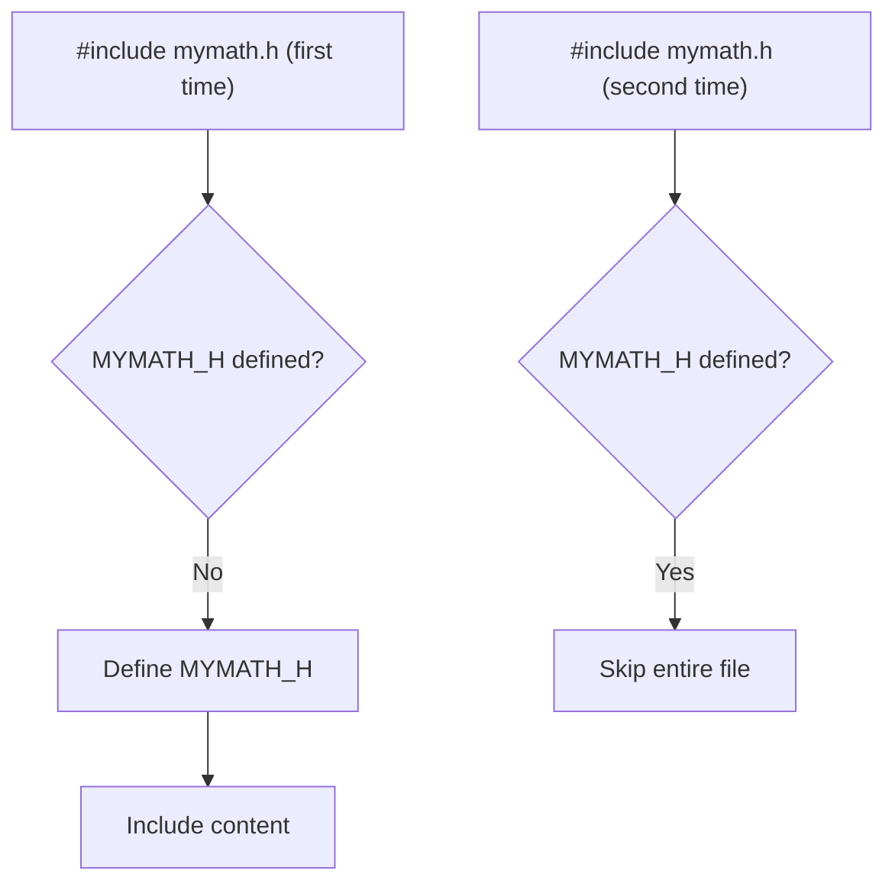

# 04 · Header Files & The C Preprocessor

> **Prerequisite:** [03 — Functions](03_functions.md)

---

## Table of Contents

1. [The Preprocessor](#1-the-preprocessor)
2. [Header Files](#2-header-files)
3. [`#include`](#3-include)
4. [`#define` — Object-like Macros](#4-define--object-like-macros)
5. [Function-like Macros](#5-function-like-macros)
6. [Conditional Compilation](#6-conditional-compilation)
7. [`#pragma` and Other Directives](#7-pragma-and-other-directives)
8. [Predefined Macros](#8-predefined-macros)
9. [Creating Your Own Header File](#9-creating-your-own-header-file)
10. [Practice Problems](#10-practice-problems)
11. [References & Resources](#11-references--resources)

---

## 1. The Preprocessor

The **C preprocessor** (`cpp`) is a text-substitution program that runs **before** the compiler. It:

- Strips comments
- Processes `#` directives
- Expands macros
- Handles conditional inclusion


**Inspect preprocessor output:**

```bash
gcc -E source.c -o source.i   # generate preprocessed file
# or
cpp source.c                   # print to stdout
```

All preprocessor directives start with `#` as the **first non-whitespace character** on a line.

---

## 2. Header Files

A **header file** (`.h`) contains declarations shared across multiple `.c` files:
- Function prototypes
- Macro definitions
- Type definitions (`typedef`, `struct`, `enum`)
- Constants (`#define`, `extern const`)

### 2.1 System vs User Header Files

| Type | Syntax | Search Path |
|:-----|:-------|:------------|
| System | `#include <stdio.h>` | Standard system directories (`/usr/include/`) |
| User | `#include "myfile.h"` | Current directory first, then system paths |

### 2.2 Standard C Library Headers (most important)

| Header | Contents |
|:-------|:---------|
| `<stdio.h>` | `printf`, `scanf`, `fopen`, `fclose`, `fgets` |
| `<stdlib.h>` | `malloc`, `free`, `exit`, `atoi`, `rand` |
| `<string.h>` | `strlen`, `strcpy`, `strcmp`, `strcat`, `memcpy` |
| `<math.h>` | `sqrt`, `pow`, `sin`, `cos`, `log`, `ceil`, `floor` |
| `<ctype.h>` | `isalpha`, `isdigit`, `toupper`, `tolower` |
| `<stdbool.h>` | `bool`, `true`, `false` (C99+) |
| `<stdint.h>` | Fixed-width types: `int32_t`, `uint64_t`, etc. |
| `<limits.h>` | `INT_MAX`, `INT_MIN`, `CHAR_MAX`, etc. |
| `<float.h>` | `FLT_MAX`, `DBL_EPSILON`, etc. |
| `<time.h>` | `time`, `clock`, `struct tm`, `strftime` |
| `<assert.h>` | `assert(condition)` for debugging |
| `<errno.h>` | `errno`, `ENOENT`, `EINVAL`, etc. |

---

## 3. `#include`

```c
#include <stdio.h>       // system header: <angle brackets>
#include "mymath.h"      // user header: "quotes"
#include "../utils/log.h" // relative path
```

**What actually happens:**

The preprocessor literally **copy-pastes** the entire content of the header file at the `#include` point before compilation.

```c
// Before preprocessing:
#include <stdio.h>
int main(void) { printf("Hi\n"); }

// After preprocessing (simplified):
// ... hundreds of lines from stdio.h (type defs, prototypes) ...
int main(void) { printf("Hi\n"); }
```

---

## 4. `#define` — Object-like Macros

```c
#define MACRO_NAME replacement_text
```

Every occurrence of `MACRO_NAME` in the code is **replaced by** `replacement_text` before compilation.

### 4.1 Numeric Constants

```c
#define PI          3.14159265358979
#define MAX_SIZE    1024
#define GRAVITY     9.81
#define SPEED_LIGHT 299792458   /* m/s */

double circumference = 2.0 * PI * radius;
int    buffer[MAX_SIZE];
```

### 4.2 String Replacement

```c
#define VERSION   "1.0.3"
#define AUTHOR    "Itachi"
#define GREETING  "Hello, World!"

printf("Version: %s by %s\n", VERSION, AUTHOR);
```

### 4.3 `#undef` — Undefine a Macro

```c
#define BUFFER_SIZE 512
// ... use BUFFER_SIZE ...

#undef BUFFER_SIZE
#define BUFFER_SIZE 1024   // redefine with new value
```

### 4.4 Macros vs `const`

| Feature | `#define` | `const` |
|:--------|:----------|:--------|
| Type checking | ❌ None | ✅ Type-safe |
| Debugger visibility | ❌ Invisible (substituted away) | ✅ Visible |
| Scope | No scope (file-wide) | Respects block scope |
| Can take address | ❌ | ✅ (`&PI`) |
| Preprocessor step | ✅ Before compilation | ❌ Compile-time |

> **Modern C best practice:** Prefer `const` for type safety; use `#define` for guards and complex macros.

---

## 5. Function-like Macros

```c
#define MACRO_NAME(param1, param2) replacement_expression
```

### 5.1 Basic Function Macros

```c
#define SQUARE(x)    ((x) * (x))
#define MAX(a, b)    ((a) > (b) ? (a) : (b))
#define MIN(a, b)    ((a) < (b) ? (a) : (b))
#define ABS(x)       ((x) >= 0 ? (x) : -(x))
#define SWAP(a, b)   do { typeof(a) _t = (a); (a) = (b); (b) = _t; } while(0)
```

**Usage:**

```c
int a = 3, b = 7;
printf("Square of 5: %d\n",  SQUARE(5));   // 25
printf("Max of a,b:  %d\n",  MAX(a, b));   // 7
printf("ABS(-9):     %d\n",  ABS(-9));     // 9
```

### 5.2 The Parenthesization Rule (Critical!)

**Bad macro — expansion bug:**

```c
#define BAD_SQUARE(x)  x * x
int result = BAD_SQUARE(2 + 3);
// Expands to: 2 + 3 * 2 + 3 = 11  ← WRONG, expected 25
```

**Good macro — always parenthesize everything:**

```c
#define GOOD_SQUARE(x)  ((x) * (x))
int result = GOOD_SQUARE(2 + 3);
// Expands to: ((2+3) * (2+3)) = 25  ✓
```

### 5.3 Multi-statement Macros with `do { } while(0)`

```c
// BAD — if/else breaks this
#define DEBUG_PRINT(x) printf("Value: %d\n", x); printf("Done\n")

// GOOD — wraps into a single statement safely
#define DEBUG_PRINT(x) do { \
    printf("Value: %d\n", (x)); \
    printf("Done\n"); \
} while(0)

// Now safe:
if (condition)
    DEBUG_PRINT(val);   // works correctly with semicolon
```

### 5.4 Stringification with `#`

```c
#define STRINGIFY(x)  #x

printf("%s\n", STRINGIFY(Hello World));  // prints: Hello World
printf("%s\n", STRINGIFY(2 + 2));        // prints: 2 + 2
```

### 5.5 Token Pasting with `##`

```c
#define MAKE_VAR(type, name)  type var_##name

MAKE_VAR(int, score);    // expands to:  int var_score;
MAKE_VAR(float, price);  // expands to:  float var_price;
```

---

## 6. Conditional Compilation

Allows selecting which code sections to compile based on conditions.

### 6.1 `#ifdef` / `#ifndef` / `#endif`

```c
#define DEBUG   // comment this out to disable debug mode

#ifdef DEBUG
    printf("DEBUG: x = %d\n", x);   // compiled only when DEBUG defined
#endif
```

```c
// Typical usage — compile different code per platform
#ifdef _WIN32
    #include <windows.h>
    void clear_screen(void) { system("cls"); }
#else
    #include <unistd.h>
    void clear_screen(void) { system("clear"); }
#endif
```

### 6.2 `#if` / `#elif` / `#else`

```c
#define PLATFORM 2

#if PLATFORM == 1
    #define OS_NAME "Linux"
#elif PLATFORM == 2
    #define OS_NAME "Windows"
#elif PLATFORM == 3
    #define OS_NAME "macOS"
#else
    #define OS_NAME "Unknown"
#endif

printf("Running on: %s\n", OS_NAME);
```

### 6.3 Include Guards (Header Guard Pattern)

Without guards, including the same header twice causes redefinition errors.

```c
// mymath.h — with include guard
#ifndef MYMATH_H        // if MYMATH_H not yet defined...
#define MYMATH_H        // ...define it (as empty) now

// Header content goes here — only included ONCE per translation unit
typedef struct {
    double x, y;
} Point;

double distance(Point a, Point b);

#endif  /* MYMATH_H */
```

**Modern alternative — `#pragma once`:**

```c
#pragma once   // equivalent to include guard, but simpler
// header content...
```



### 6.4 `defined()` Operator

```c
#if defined(DEBUG) && !defined(NDEBUG)
    #define LOG(msg)  fprintf(stderr, "[DEBUG] %s\n", (msg))
#else
    #define LOG(msg)  /* nothing */
#endif
```

---

## 7. `#pragma` and Other Directives

### 7.1 `#pragma`

Implementation-specific directives. Unrecognized pragmas are ignored (unlike unknown directives which are errors).

```c
#pragma once                     // include guard (GCC, Clang, MSVC)
#pragma GCC optimize("O3")       // optimize this translation unit at O3
#pragma pack(1)                  // pack structs without padding
#pragma warning(disable: 4996)   // MSVC: disable specific warning
```

### 7.2 `#error` and `#warning`

```c
#ifndef __STDC_VERSION__
#error "This code requires C99 or later. Use: gcc -std=c99"
#endif

#if INT_MAX < 65535
#error "int must be at least 16 bits"
#endif

#warning "This feature is deprecated and will be removed in v2.0"
```

### 7.3 `#line`

```c
#line 100 "virtual_source.c"   // resets line counter and filename for error messages
```

Used by code generators (e.g., yacc/bison, flex).

---

## 8. Predefined Macros

The compiler provides these automatically:

| Macro | Type | Example Value |
|:------|:-----|:-------------|
| `__FILE__` | `const char*` | `"main.c"` |
| `__LINE__` | `int` | `42` |
| `__DATE__` | `const char*` | `"Jun  3 2026"` |
| `__TIME__` | `const char*` | `"14:30:00"` |
| `__func__` | `const char*` | `"main"` (C99) |
| `__STDC_VERSION__` | `long` | `199901L` (C99) |
| `__GNUC__` | `int` | GCC major version |

**Practical use — debug logging:**

```c
#define ASSERT(cond) \
    do { \
        if (!(cond)) { \
            fprintf(stderr, "Assertion failed: %s\n" \
                            "  File: %s, Line: %d, Func: %s\n", \
                    #cond, __FILE__, __LINE__, __func__); \
            exit(EXIT_FAILURE); \
        } \
    } while(0)

int divide(int a, int b) {
    ASSERT(b != 0);
    return a / b;
}
```

---

## 9. Creating Your Own Header File

**Project layout:**

```
project/
├── main.c
├── mymath.c
└── mymath.h
```

**mymath.h:**

```c
#ifndef MYMATH_H
#define MYMATH_H

/* Constants */
#define E_CONST  2.71828182845904

/* Type definitions */
typedef struct {
    double real;
    double imag;
} Complex;

/* Function prototypes */
double  mymath_power(double base, int exp);
double  mymath_log2(double x);
Complex complex_add(Complex a, Complex b);

#endif /* MYMATH_H */
```

**mymath.c:**

```c
#include "mymath.h"
#include <math.h>

double mymath_power(double base, int exp) {
    double result = 1.0;
    while (exp-- > 0) result *= base;
    return result;
}

double mymath_log2(double x) {
    return log(x) / log(2.0);
}

Complex complex_add(Complex a, Complex b) {
    Complex sum = { a.real + b.real, a.imag + b.imag };
    return sum;
}
```

**main.c:**

```c
#include <stdio.h>
#include "mymath.h"

int main(void) {
    printf("2^8 = %.0f\n", mymath_power(2, 8));         // 256
    printf("log2(1024) = %.0f\n", mymath_log2(1024));   // 10

    Complex c1 = {3.0, 4.0};
    Complex c2 = {1.0, -2.0};
    Complex c3 = complex_add(c1, c2);
    printf("(3+4i) + (1-2i) = %.1f + %.1fi\n", c3.real, c3.imag); // 4 + 2i
    return 0;
}
```

**Build:**

```bash
gcc -Wall -Wextra main.c mymath.c -o program -lm
./program
```

---

## 10. Practice Problems

1. Write a macro `CLAMP(val, lo, hi)` that returns `val` clamped between `lo` and `hi`.

2. Create a header `geometry.h` with prototypes for `circle_area`, `rect_area`, `triangle_area` and implement them in `geometry.c`.

3. Write a multi-platform header that defines `SLEEP(ms)` using `Sleep(ms)` on Windows and `usleep(ms * 1000)` on Linux.

4. Debug: What is wrong with this macro, and what is the fix?
   ```c
   #define DOUBLE(x)  x + x
   int result = 4 * DOUBLE(3);   // Expected: 24, Got: ?
   ```

5. Use `__FILE__`, `__LINE__`, and `__func__` to write a logging macro `LOG_ERROR(msg)` that prints the file, line, function name, and message to `stderr`.

---

## 11. References & Resources

| Resource | URL | Topic |
|:---------|:----|:------|
| GCC Preprocessor Manual | https://gcc.gnu.org/onlinedocs/cpp/ | Comprehensive preprocessor reference |
| cppreference — Preprocessor | https://en.cppreference.com/w/c/preprocessor | C preprocessor spec |
| GeeksforGeeks — Macros | https://www.geeksforgeeks.org/macros-and-its-types-in-c-cpp/ | Macro types & pitfalls |
| C Standard Headers | https://en.cppreference.com/w/c/header | All standard headers listed |
| Include Guard Best Practice | https://isocpp.org/wiki/faq/coding-standards#include-guards | Why and how |
| TutorialsPoint — Preprocessor | https://www.tutorialspoint.com/cprogramming/c_preprocessors.htm | Tutorial with examples |

---

<div align="center">

**[← 03 — Functions](03_functions.md)** · **[05 — Pointers, Arrays & Strings →](05_pointers_arrays_strings.md)**

</div>
