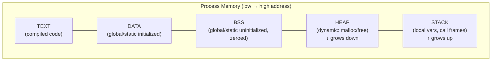
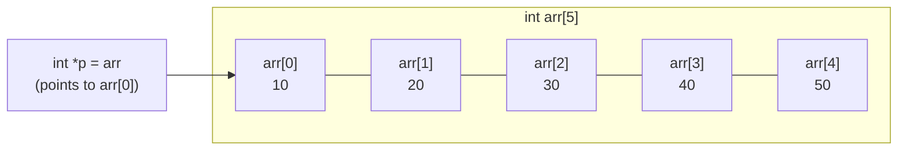

# 05 · Pointers, Arrays, Strings & Multidimensional Arrays

> **Prerequisite:** [03 — Functions](03_functions.md) · [04 — Preprocessor](04_preprocessor.md)

---

## Table of Contents

1. [Memory Model](#1-memory-model)
2. [Pointers](#2-pointers)
3. [Pointer Arithmetic](#3-pointer-arithmetic)
4. [Arrays](#4-arrays)
5. [Relationship: Arrays & Pointers](#5-relationship-arrays--pointers)
6. [Strings (Character Arrays)](#6-strings-character-arrays)
7. [Multidimensional Arrays](#7-multidimensional-arrays)
8. [Array of Pointers & Pointer to Array](#8-array-of-pointers--pointer-to-array)
9. [Dynamic Memory (Preview)](#9-dynamic-memory-preview)
10. [Practice Problems](#10-practice-problems)
11. [References & Resources](#11-references--resources)

---

## 1. Memory Model

Every variable occupies memory. Memory can be thought of as a long array of bytes, each with a unique **address**.

```
Address:  0x1000  0x1001  0x1002  0x1003  0x1004  ...
Content:  [  42 ] [  00 ] [  00 ] [  00 ] [  3F ] ...
           ↑ int x = 42 (4 bytes on 32/64-bit)
```

**C memory layout:**



---

## 2. Pointers

A **pointer** is a variable that stores the **memory address** of another variable.

### 2.1 Declaration & Initialization

```c
data_type *pointer_name;   // declaration
int  *p;                   // pointer to int
char *s;                   // pointer to char
float *fp;                 // pointer to float
void *vp;                  // generic pointer (no type)
```

### 2.2 Address-of (`&`) and Dereference (`*`)

```c
int x = 42;
int *p = &x;           // p stores the ADDRESS of x

printf("x    = %d\n",   x);    // 42
printf("&x   = %p\n",   &x);   // address, e.g. 0x7ffee4b2c
printf("p    = %p\n",   p);    // same address as &x
printf("*p   = %d\n",  *p);    // 42 — dereference: value at address
```

**Memory visualization:**

```
Variable x:
 Address: 0x1000
 Value:      42

Pointer p:
 Address: 0x2000
 Value:   0x1000  ──────► [42]  (value of x)
```

### 2.3 Modifying via Pointer

```c
int x = 10;
int *p = &x;
*p = 99;            // changes value at address p points to
printf("%d\n", x);  // prints 99 — x was modified!
```

### 2.4 NULL Pointer

```c
int *p = NULL;   // pointer to "nothing" — safe initial value

// Always check before dereferencing:
if (p != NULL) {
    *p = 5;   // safe
}

// Dereferencing NULL causes Segmentation Fault (crash)!
*p = 5;   // if p == NULL → SIGSEGV
```

### 2.5 Pointer to Pointer

```c
int   x  = 42;
int  *p  = &x;    // pointer to int
int **pp = &p;    // pointer to pointer to int

printf("%d\n", **pp);  // 42 — double dereference
**pp = 100;
printf("%d\n", x);     // 100
```

```
x    [42]  ← address 0x100
p  [0x100] ← address 0x200
pp [0x200] ← address 0x300
```

---

## 3. Pointer Arithmetic

Arithmetic on pointers moves by **the size of the pointed-to type**, not by 1 byte.

```c
int arr[] = {10, 20, 30, 40, 50};
int *p = arr;   // points to arr[0]

printf("%d\n", *p);       // 10
printf("%d\n", *(p+1));   // 20 — moves 4 bytes (sizeof int)
printf("%d\n", *(p+4));   // 50

p++;     // now points to arr[1]
p += 2;  // now points to arr[3]
```

**Mathematical model:**

$$
\text{address}(p + n) = \text{address}(p) + n \times \text{sizeof}(*p)
$$

**Pointer difference:**

```c
int *p = &arr[1];
int *q = &arr[4];
ptrdiff_t diff = q - p;   // 3 (not 12 bytes — gives number of elements)
```

$$
q - p = \frac{\text{address}(q) - \text{address}(p)}{\text{sizeof}(*p)}
$$

### 3.1 Pointer Comparison

```c
int arr[5] = {1, 2, 3, 4, 5};
int *p = arr;
int *end = arr + 5;    // one past last element

while (p < end) {
    printf("%d ", *p);
    p++;
}
// 1 2 3 4 5
```

### 3.2 Const Pointers

```c
int x = 10, y = 20;

const int *p1 = &x;    // pointer to const int: can't change value via p1
*p1 = 5;               // ❌ error
p1 = &y;               // ✅ can change what p1 points to

int * const p2 = &x;   // const pointer to int: can't change what p2 points to
*p2 = 5;               // ✅ can change value
p2 = &y;               // ❌ error

const int * const p3 = &x;  // both locked
```

---

## 4. Arrays

An **array** is a contiguous block of memory holding elements of the **same type**.

### 4.1 Declaration & Initialization

```c
int    marks[5];                        // uninitialized
int    scores[5] = {90, 85, 78, 92, 88}; // initialized
float  temps[]  = {36.5, 37.1, 38.2};  // size inferred (3)
char   vowels[] = {'a', 'e', 'i', 'o', 'u', '\0'};

// Partial initialization — rest set to 0
int arr[10] = {1, 2, 3};   // arr = {1,2,3,0,0,0,0,0,0,0}
int zeros[100] = {0};       // all zeros
```

### 4.2 Accessing Elements

```c
int scores[5] = {90, 85, 78, 92, 88};

printf("%d\n", scores[0]);   // 90 — zero-indexed!
printf("%d\n", scores[4]);   // 88 — last element
// scores[5]  →  UNDEFINED BEHAVIOR (out-of-bounds!)

for (int i = 0; i < 5; i++)
    printf("%d ", scores[i]);
```

**Memory layout of `int arr[5]`:**

```
Index:   [0]    [1]    [2]    [3]    [4]
Value:   [90]   [85]   [78]   [92]   [88]
Address: 0x100  0x104  0x108  0x10C  0x110
          ↑ each int = 4 bytes
```

### 4.3 Array Traversal Patterns

```c
int arr[6] = {5, 2, 8, 1, 9, 3};
int n = sizeof(arr) / sizeof(arr[0]);   // correct way to get length

// Find max
int max = arr[0];
for (int i = 1; i < n; i++)
    if (arr[i] > max) max = arr[i];

// Sum
int sum = 0;
for (int i = 0; i < n; i++) sum += arr[i];

// Reverse
for (int i = 0, j = n-1; i < j; i++, j--) {
    int tmp = arr[i]; arr[i] = arr[j]; arr[j] = tmp;
}
```

---

## 5. Relationship: Arrays & Pointers

In C, the name of an array is a **constant pointer** to its first element.

```c
int arr[5] = {10, 20, 30, 40, 50};

// These are equivalent:
arr[2]          // ← subscript notation
*(arr + 2)      // ← pointer notation

// Also equivalent:
&arr[2]
arr + 2

int *p = arr;   // p points to arr[0]
p[2]            // ← same as arr[2] and *(p+2)
```

**Key difference:** `arr` is a **constant** pointer — cannot be reassigned.

```c
int arr[5];
int *p = arr;

p = p + 1;   // ✅ OK — p is a regular pointer
arr = p;     // ❌ ERROR — arr is a constant pointer
```



---

## 6. Strings (Character Arrays)

In C, a **string** is a `char` array **terminated by null character `'\0'`**.

### 6.1 Declaration & Initialization

```c
char s1[] = "Hello";             // {'H','e','l','l','o','\0'} — length 6 in memory
char s2[10] = "World";           // 10 bytes, last 4 are '\0'
char s3[] = {'H','i','\0'};      // explicit null termination

char *s4 = "Literal";            // string literal — read-only memory (const preferred)
const char *s5 = "Safe";         // use const for string literals
```

**Memory of `"Hello"`:**

```
Index:  [0]  [1]  [2]  [3]  [4]  [5]
Char:   'H'  'e'  'l'  'l'  'o'  '\0'
ASCII:   72   101  108  108  111   0
```

### 6.2 String I/O

```c
char name[50];

// Input
scanf("%49s", name);           // reads until whitespace, max 49 chars
fgets(name, sizeof(name), stdin);  // reads entire line (safer)

// Output
printf("%s\n", name);
puts(name);                    // equivalent to printf("%s\n", name)
```

### 6.3 `<string.h>` Functions

```c
#include <string.h>

char s1[50] = "Hello";
char s2[] = "World";

strlen(s1)               // 5 — characters, NOT including '\0'
strcpy(s1, s2)           // copy s2 into s1 → s1 = "World"
strncpy(s1, s2, n)       // copy at most n characters (safer)
strcat(s1, s2)           // append s2 to end of s1
strncat(s1, s2, n)       // append at most n chars
strcmp(s1, s2)           // 0 if equal, <0 if s1<s2, >0 if s1>s2
strncmp(s1, s2, n)       // compare first n characters
strchr(s1, 'l')          // pointer to first 'l' in s1, or NULL
strstr(s1, "ell")        // pointer to first "ell" in s1, or NULL
strtok(s1, " ,")         // tokenize string by delimiter
```

**String length calculation:**

$$
\text{strlen}(s) = n \quad \text{where } s[n] = '\backslash 0' \text{ and } s[i] \neq '\backslash 0' \text{ for } 0 \le i < n
$$

### 6.4 Common String Programs

**Reverse a string:**

```c
void reverse_str(char *s) {
    int n = strlen(s);
    for (int i = 0, j = n - 1; i < j; i++, j--) {
        char tmp = s[i]; s[i] = s[j]; s[j] = tmp;
    }
}
```

**Count occurrences of a character:**

```c
int count_char(const char *s, char c) {
    int count = 0;
    while (*s) {
        if (*s == c) count++;
        s++;
    }
    return count;
}
```

**Check palindrome:**

```c
int is_palindrome(const char *s) {
    int l = 0, r = strlen(s) - 1;
    while (l < r)
        if (s[l++] != s[r--]) return 0;
    return 1;
}
```

---

## 7. Multidimensional Arrays

### 7.1 2D Arrays

```c
int matrix[3][4];                        // 3 rows, 4 columns
int m[2][3] = {{1,2,3},{4,5,6}};         // initialized
int identity[3][3] = {
    {1, 0, 0},
    {0, 1, 0},
    {0, 0, 1}
};
```

**Memory layout (row-major order):**

```
m[0][0]=1  m[0][1]=2  m[0][2]=3  m[1][0]=4  m[1][1]=5  m[1][2]=6
   0x100      0x104      0x108      0x10C      0x110      0x114
←────────── Row 0 ──────────────►←────────── Row 1 ──────────────►
```

**Access:**

$$
\text{address}(A[i][j]) = \text{base} + (i \times \text{cols} + j) \times \text{sizeof}(\text{type})
$$

### 7.2 Matrix Operations

**Matrix addition:**

```c
#define ROWS 3
#define COLS 3

void mat_add(int A[ROWS][COLS], int B[ROWS][COLS], int C[ROWS][COLS]) {
    for (int i = 0; i < ROWS; i++)
        for (int j = 0; j < COLS; j++)
            C[i][j] = A[i][j] + B[i][j];
}
```

**Matrix multiplication — $O(n^3)$ algorithm:**

For $A_{m \times n}$ and $B_{n \times p}$, result $C_{m \times p}$:

$$
C[i][j] = \sum_{k=0}^{n-1} A[i][k] \times B[k][j]
$$

```c
void mat_mul(int A[3][3], int B[3][3], int C[3][3]) {
    for (int i = 0; i < 3; i++)
        for (int j = 0; j < 3; j++) {
            C[i][j] = 0;
            for (int k = 0; k < 3; k++)
                C[i][j] += A[i][k] * B[k][j];
        }
}
```

**Matrix transpose:**

$$
A^T[j][i] = A[i][j]
$$

```c
void mat_transpose(int A[3][3], int T[3][3]) {
    for (int i = 0; i < 3; i++)
        for (int j = 0; j < 3; j++)
            T[j][i] = A[i][j];
}
```

### 7.3 Passing 2D Arrays to Functions

```c
// Must specify all dimensions except the first
void print_matrix(int rows, int cols, int A[rows][cols]) {
    for (int i = 0; i < rows; i++) {
        for (int j = 0; j < cols; j++)
            printf("%4d", A[i][j]);
        printf("\n");
    }
}

// Call:
int m[2][3] = {{1,2,3},{4,5,6}};
print_matrix(2, 3, m);
```

### 7.4 3D Arrays

```c
int cube[2][3][4];   // 2 layers × 3 rows × 4 columns

// Conceptually: 2 "pages" of a 3×4 matrix
cube[0][1][2] = 42;   // layer 0, row 1, col 2
```

---

## 8. Array of Pointers & Pointer to Array

### 8.1 Array of Pointers

```c
// Array of 3 int pointers
int a = 1, b = 2, c = 3;
int *arr[3] = {&a, &b, &c};

printf("%d\n", *arr[0]);   // 1
printf("%d\n", *arr[1]);   // 2

// Array of strings (most common use)
const char *days[] = {
    "Monday", "Tuesday", "Wednesday",
    "Thursday", "Friday", "Saturday", "Sunday"
};
printf("%s\n", days[0]);   // Monday
```

### 8.2 Pointer to Array

```c
int arr[5] = {1, 2, 3, 4, 5};
int (*p)[5] = &arr;    // pointer to an array of 5 ints

printf("%d\n", (*p)[2]);   // 3
printf("%d\n", p[0][2]);   // also 3
```

### 8.3 Function Pointer

```c
// Declare function pointer
int (*operation)(int, int);

int add(int a, int b) { return a + b; }
int mul(int a, int b) { return a * b; }

operation = add;
printf("%d\n", operation(3, 4));   // 7

operation = mul;
printf("%d\n", operation(3, 4));   // 12
```

---

## 9. Dynamic Memory (Preview)

```c
#include <stdlib.h>

// Allocate memory at runtime
int *p = (int *)malloc(n * sizeof(int));   // allocate n ints
if (p == NULL) { /* handle allocation failure */ }

// Use it like an array
for (int i = 0; i < n; i++) p[i] = i * i;

// MUST free when done — else memory leak!
free(p);
p = NULL;   // good practice: avoid dangling pointer

// calloc — allocates AND zeroes memory
int *q = (int *)calloc(n, sizeof(int));

// realloc — resize allocation
p = (int *)realloc(p, new_n * sizeof(int));
```

---

## 10. Practice Problems

1. Write a function `int *find_max_ptr(int *arr, int n)` that returns a **pointer** to the maximum element.

2. Implement `int my_strlen(const char *s)` without using `<string.h>`.

3. Write a function to multiply two 3×3 matrices and print the result.

4. Given `char *argv[]`, write code to print all command-line arguments.

5. Write a function that sorts an array of strings alphabetically using `strcmp`.

6. Analyze: what is the value of `p` after `int arr[5]; int *p = arr + 5;`? Is `p` valid to dereference? Why?

7. Prove (by tracing memory addresses) why `arr[i]` and `*(arr + i)` are equivalent.

---

## 11. References & Resources

| Resource | URL | Topic |
|:---------|:----|:------|
| Pointers tutorial — cprogramming.com | https://www.cprogramming.com/tutorial/c/lesson6.html | Pointer basics |
| C Arrays — GeeksforGeeks | https://www.geeksforgeeks.org/arrays-in-c-cpp/ | Arrays comprehensive |
| C Strings — TutorialsPoint | https://www.tutorialspoint.com/cprogramming/c_strings.htm | String operations |
| C Memory Layout | https://www.geeksforgeeks.org/memory-layout-of-c-program/ | Stack/heap/data segment |
| C Pointer Basics — cs.swarthmore.edu | https://www.cs.swarthmore.edu/~newhall/unixhelp/C_pointers.pdf | Visual pointer guide |
| Valgrind (memory debugging) | https://valgrind.org/docs/manual/quick-start.html | Detect memory errors |
| Matrix operations — Khan Academy | https://www.khanacademy.org/math/precalculus/x9e81a4f98389efdf:matrices | Matrix math background |

---

<div align="center">

**[← 04 — Preprocessor](04_preprocessor.md)** · **[06 — User-Defined Types →](06_user_defined_types.md)**

</div>
