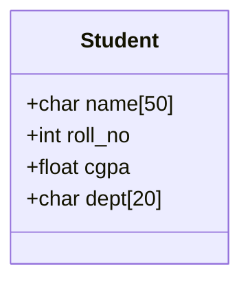

# 06 · User-Defined Data Types

> **Prerequisite:** [05 — Pointers, Arrays & Strings](05_pointers_arrays_strings.md)

---

## Table of Contents

1. [Structures (`struct`)](#1-structures-struct)
2. [Nested Structures](#2-nested-structures)
3. [Array of Structures](#3-array-of-structures)
4. [Pointers to Structures](#4-pointers-to-structures)
5. [Unions (`union`)](#5-unions-union)
6. [Enumerations (`enum`)](#6-enumerations-enum)
7. [`typedef`](#7-typedef)
8. [Bit Fields](#8-bit-fields)
9. [Practice Problems](#9-practice-problems)
10. [References & Resources](#10-references--resources)

---

## 1. Structures (`struct`)

A **structure** groups variables of **different types** under a single name.



### 1.1 Declaration & Definition

```c
/* Declaration — defines the template */
struct Student {
    char  name[50];
    int   roll_no;
    float cgpa;
    char  dept[20];
};

/* Variable definition */
struct Student s1;
struct Student s2 = {"Itachi", 42, 3.9, "FE"};  // initialization
```

### 1.2 Accessing Members

```c
struct Student s = {"Alice", 101, 3.7, "CSE"};

// Dot operator (direct access)
printf("Name: %s\n",    s.name);
printf("Roll: %d\n",    s.roll_no);
printf("CGPA: %.2f\n",  s.cgpa);

// Modifying
s.cgpa = 3.85;
strcpy(s.name, "Bob");
```

### 1.3 Memory Layout & Padding

The compiler may add **padding bytes** for alignment:

```c
struct Example {
    char  a;    // 1 byte  + 3 bytes padding (to align next int to 4-byte boundary)
    int   b;    // 4 bytes
    char  c;    // 1 byte  + 7 bytes padding (to align next double to 8-byte boundary)
    double d;   // 8 bytes
};
// sizeof(struct Example) = 24 (not 14!)
```

```
Byte layout:
[a][pad][pad][pad][ b ][ b ][ b ][ b ][c][pad×7      ][ d    ][ d    ]
 0   1    2    3   4    5    6    7   8   9-15          16-23
```

**Formula for struct size:**

$$
\text{sizeof(struct)} \ge \sum \text{sizeof(members)} \quad \text{(due to padding)}
$$

**To eliminate padding:**

```c
#pragma pack(1)
struct Packed {
    char a;   // 1 byte
    int  b;   // 4 bytes — no padding
};
// sizeof = 5 (but may be slower to access on some CPUs)
#pragma pack()  // restore default
```

### 1.4 Structures and Functions

```c
// Passing struct by value (copy)
void print_student(struct Student s) {
    printf("%s: %.2f\n", s.name, s.cgpa);
}

// Passing by pointer (efficient, can modify)
void update_cgpa(struct Student *s, float new_cgpa) {
    s->cgpa = new_cgpa;   // arrow operator for pointer access
}

// Returning struct
struct Point midpoint(struct Point a, struct Point b) {
    struct Point m = {(a.x + b.x) / 2.0, (a.y + b.y) / 2.0};
    return m;
}
```

---

## 2. Nested Structures

A structure can contain another structure as a member.

```c
struct Date {
    int day, month, year;
};

struct Employee {
    char        name[50];
    int         id;
    float       salary;
    struct Date joining_date;   // nested struct
    struct Date birth_date;
};

struct Employee emp = {
    "Kenji", 1001, 75000.0,
    {15, 3, 2020},   // joining_date
    {4,  7, 1995}    // birth_date
};

printf("Joined: %02d/%02d/%d\n",
       emp.joining_date.day,
       emp.joining_date.month,
       emp.joining_date.year);   // 15/03/2020
```

---

## 3. Array of Structures

```c
#define MAX_STUDENTS 100

struct Student class[MAX_STUDENTS];

// Input
for (int i = 0; i < 3; i++) {
    printf("Enter name, roll, CGPA: ");
    scanf("%s %d %f", class[i].name, &class[i].roll_no, &class[i].cgpa);
}

// Find highest CGPA
int top = 0;
for (int i = 1; i < 3; i++)
    if (class[i].cgpa > class[top].cgpa)
        top = i;

printf("Top student: %s (%.2f)\n", class[top].name, class[top].cgpa);
```

**Sort array of structs by CGPA (bubble sort):**

```c
void sort_by_cgpa(struct Student *arr, int n) {
    for (int i = 0; i < n - 1; i++)
        for (int j = 0; j < n - 1 - i; j++)
            if (arr[j].cgpa < arr[j+1].cgpa) {
                struct Student tmp = arr[j];
                arr[j]   = arr[j+1];
                arr[j+1] = tmp;
            }
}
```

---

## 4. Pointers to Structures

```c
struct Point {
    float x, y;
};

struct Point p = {3.0, 4.0};
struct Point *ptr = &p;

// Two equivalent notations:
printf("x = %.1f\n",   (*ptr).x);   // dereference then dot
printf("x = %.1f\n",    ptr->x);    // arrow operator (preferred)

ptr->x = 6.0;   // modifies original
```

**Dynamic allocation of struct:**

```c
#include <stdlib.h>

struct Student *s = malloc(sizeof(struct Student));
if (s == NULL) { perror("malloc"); exit(1); }

strcpy(s->name, "Alice");
s->roll_no = 101;
s->cgpa = 3.7;

printf("%s\n", s->name);
free(s);
```

**Linked list node (classic struct self-reference):**

```c
struct Node {
    int          data;
    struct Node *next;   // pointer to SAME type — allowed!
};

// Build: 1 → 2 → 3 → NULL
struct Node n3 = {3, NULL};
struct Node n2 = {2, &n3};
struct Node n1 = {1, &n2};

// Traverse
struct Node *curr = &n1;
while (curr != NULL) {
    printf("%d → ", curr->data);
    curr = curr->next;
}
printf("NULL\n");
// Output: 1 → 2 → 3 → NULL
```

---

## 5. Unions (`union`)

A **union** is like a struct, but **all members share the same memory location**. Only one member holds a valid value at a time.

### 5.1 Declaration

```c
union Data {
    int    i;
    float  f;
    char   str[20];
};

union Data d;
```

### 5.2 Memory Sharing Visualization

```
union Data:     ┌────────────────────┐
                │  i   (4 bytes)     │
                │  f   (4 bytes)     │  ALL at same address!
                │  str (20 bytes) ──►│  sizeof = 20 (largest member)
                └────────────────────┘
```

```c
union Data d;

d.i = 42;
printf("i = %d\n", d.i);    // 42

d.f = 3.14f;
printf("f = %f\n", d.f);    // 3.14
printf("i = %d\n", d.i);    // GARBAGE — f overwrote i's bytes!
```

$$
\text{sizeof(union)} = \max(\text{sizeof(members)}) + \text{alignment padding}
$$

### 5.3 Struct vs Union

| Feature | `struct` | `union` |
|:--------|:--------|:--------|
| Memory | Sum of all members (+padding) | Size of largest member |
| Access | All members valid simultaneously | Only last-written member valid |
| Use case | Record multiple attributes of one entity | Represent one value in multiple ways |
| Example | Employee (name, id, salary) | Network packet (IPv4 / IPv6 / ARP) |

### 5.4 Tagged Union (Type-safe Union Pattern)

```c
enum ValueType { INT_TYPE, FLOAT_TYPE, STRING_TYPE };

struct Value {
    enum ValueType type;
    union {
        int    i;
        float  f;
        char   s[50];
    } data;
};

void print_value(struct Value v) {
    switch (v.type) {
        case INT_TYPE:    printf("Int: %d\n",    v.data.i); break;
        case FLOAT_TYPE:  printf("Float: %.2f\n",v.data.f); break;
        case STRING_TYPE: printf("Str: %s\n",    v.data.s); break;
    }
}
```

### 5.5 Union for Type Punning

```c
// Inspect float bit pattern (IEEE 754)
union FloatBits {
    float    f;
    uint32_t bits;
};

union FloatBits fb;
fb.f = 3.14f;
printf("3.14f bits: 0x%08X\n", fb.bits);
// 0x4048F5C3
// Sign=0, Exp=10000000(128→127), Mantissa=1.0010001111010111000011
```

---

## 6. Enumerations (`enum`)

An **enum** defines a set of named integer constants, improving code readability.

### 6.1 Declaration

```c
enum Direction { NORTH, EAST, SOUTH, WEST };
// NORTH=0, EAST=1, SOUTH=2, WEST=3 (auto-assigned)

enum Direction d = NORTH;

enum Weekday {
    MON = 1,   // explicit value
    TUE,       // 2
    WED,       // 3
    THU,       // 4
    FRI,       // 5
    SAT,       // 6
    SUN        // 7
};
```

### 6.2 Custom Values

```c
enum HTTPStatus {
    HTTP_OK        = 200,
    HTTP_NOT_FOUND = 404,
    HTTP_ERROR     = 500,
    HTTP_REDIRECT  = 301
};

enum HTTPStatus code = HTTP_NOT_FOUND;
if (code == HTTP_NOT_FOUND)
    printf("404 Not Found\n");
```

### 6.3 Enum with Switch

```c
enum Season { SPRING, SUMMER, AUTUMN, WINTER };

void describe_season(enum Season s) {
    switch (s) {
        case SPRING: printf("Warm and rainy\n");  break;
        case SUMMER: printf("Hot and sunny\n");   break;
        case AUTUMN: printf("Cool and windy\n");  break;
        case WINTER: printf("Cold and snowy\n");  break;
    }
}
```

### 6.4 Enum Bitmask (Power-of-2 values)

```c
enum Permission {
    NONE    = 0,         // 000
    READ    = 1 << 0,   // 001
    WRITE   = 1 << 1,   // 010
    EXECUTE = 1 << 2    // 100
};

int perms = READ | WRITE;          // 011 = 3

if (perms & READ)    printf("Can read\n");
if (perms & EXECUTE) printf("Can execute\n");  // not set

// Add permission
perms |= EXECUTE;   // now 111 = 7

// Remove permission
perms &= ~WRITE;    // now 101 = 5
```

---

## 7. `typedef`

`typedef` creates an **alias** for an existing type, making code more readable.

```c
// Without typedef
struct Student s;
unsigned long long int big_num;

// With typedef
typedef struct Student Student;  // now: Student s; (no "struct" keyword)
typedef unsigned long long int u64;

Student s;
u64 counter = 0;
```

### 7.1 Typedef with Struct (Standard Pattern)

```c
typedef struct {
    float x;
    float y;
} Point;           // "struct" keyword never needed again

typedef struct {
    Point center;
    float radius;
} Circle;

Point p1 = {3.0, 4.0};
Circle c = {{0.0, 0.0}, 5.0};
```

### 7.2 Typedef with Function Pointer

```c
typedef int (*BinaryOp)(int, int);  // alias for function pointer type

int add(int a, int b) { return a + b; }
int sub(int a, int b) { return a - b; }

BinaryOp ops[] = {add, sub};
printf("%d\n", ops[0](10, 3));   // 13
printf("%d\n", ops[1](10, 3));   // 7
```

---

## 8. Bit Fields

Allow packing multiple small values into a single integer word.

```c
struct PackedFlags {
    unsigned int read    : 1;   // 1 bit
    unsigned int write   : 1;   // 1 bit
    unsigned int execute : 1;   // 1 bit
    unsigned int mode    : 4;   // 4 bits (values 0-15)
    unsigned int         : 3;   // 3 unused bits (padding)
    // total: 10 bits used, fits in 16 bits (short)
};

struct PackedFlags f = {1, 1, 0, 7, 0};
printf("Read: %d, Mode: %d\n", f.read, f.mode);
```

**Common use:** Networking headers, hardware registers, embedded systems.

---

## 9. Practice Problems

1. Define a `struct Complex` for complex numbers. Write functions:
   - `complex_add(a, b)` — returns $a + b$
   - `complex_mul(a, b)` — returns $a \times b$  
   *(Recall: $(a+bi)(c+di) = (ac-bd) + (ad+bc)i$)*

2. Create a `union` that can store an IPv4 address as either a `uint32_t` integer or a `uint8_t[4]` byte array. Demonstrate how you can set the integer and read individual octets.

3. Define an `enum ErrorCode` with at least 5 error types. Write a function `const char *error_message(enum ErrorCode)` that returns a human-readable description.

4. Implement a `struct Stack` (max 100 elements) with functions `push`, `pop`, `is_empty`, `is_full`.

5. Given the struct below, explain why `sizeof(s)` is likely 12, not 9:
   ```c
   struct S { char a; int b; char c; };
   ```
   Draw the memory layout with padding.

---

## 10. References & Resources

| Resource | URL | Topic |
|:---------|:----|:------|
| Structs — cppreference | https://en.cppreference.com/w/c/language/struct | Full struct specification |
| Union — GeeksforGeeks | https://www.geeksforgeeks.org/union-c/ | Union explained with examples |
| C enum — TutorialsPoint | https://www.tutorialspoint.com/cprogramming/c_enum.htm | Enum tutorial |
| Struct padding visualizer | https://godbolt.org/ | Use `pahole` or compiler output |
| IEEE 754 Explorer | https://float.exposed/ | Float bit inspection |
| Linked List (struct) | https://www.learn-c.org/en/Linked_lists | Practical struct application |

---

<div align="center">

**[← 05 — Pointers, Arrays & Strings](05_pointers_arrays_strings.md)** · **[07 — I/O →](07_io.md)**

</div>
