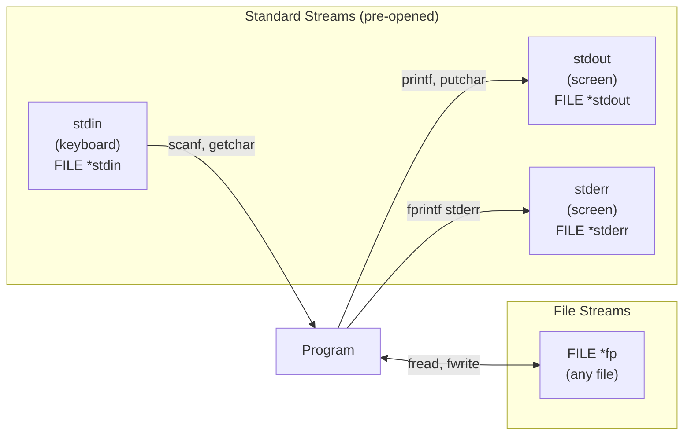
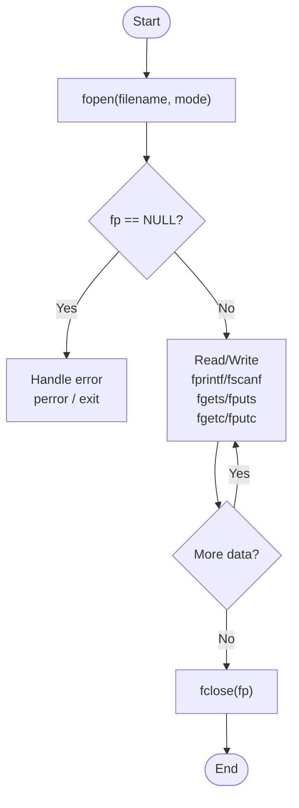

# 07 · Input & Output

> **Prerequisite:** [06 — User-Defined Types](06_user_defined_types.md)

---

## Table of Contents

1. [Streams in C](#1-streams-in-c)
2. [Standard I/O Functions](#2-standard-io-functions)
3. [Formatted I/O — `printf` & `scanf`](#3-formatted-io--printf--scanf)
4. [Character & Line I/O](#4-character--line-io)
5. [File I/O](#5-file-io)
6. [Binary File I/O](#6-binary-file-io)
7. [Random Access in Files](#7-random-access-in-files)
8. [Error Handling in I/O](#8-error-handling-in-io)
9. [Practice Problems](#9-practice-problems)
10. [References & Resources](#10-references--resources)

---

## 1. Streams in C

C I/O is based on **streams** — abstract sequences of bytes. Everything (file, keyboard, screen) is a stream.



**Three pre-opened streams:**

| Stream | Default Device | Direction | Buffered |
|:-------|:--------------|:----------|:---------|
| `stdin` | Keyboard | Input | Line-buffered |
| `stdout` | Screen | Output | Line-buffered |
| `stderr` | Screen | Output | Unbuffered |

---

## 2. Standard I/O Functions

### 2.1 Overview

```c
#include <stdio.h>

/* Formatted */
printf(format, ...)           // stdout
fprintf(stream, format, ...)  // any stream
sprintf(buffer, format, ...)  // write to string
snprintf(buf, n, fmt, ...)    // safe sprintf with size limit

scanf(format, ...)            // stdin
fscanf(stream, format, ...)   // any stream
sscanf(string, format, ...)   // read from string

/* Character */
int  getchar(void)            // read 1 char from stdin
int  fgetc(FILE *stream)      // read 1 char from stream
int  putchar(int c)           // write 1 char to stdout
int  fputc(int c, FILE *stream)

/* Line */
char *gets(char *s)           // UNSAFE — deprecated; buffer overflow risk
char *fgets(char *s, int n, FILE *stream)  // SAFE — preferred
int   puts(const char *s)     // write string + newline to stdout
int   fputs(const char *s, FILE *stream)
```

---

## 3. Formatted I/O — `printf` & `scanf`

### 3.1 `printf` Format Specifiers

```
%[flags][width][.precision][length modifier]type
```

| Specifier | Type | Example | Output |
|:---------:|:-----|:--------|:-------|
| `%d` / `%i` | `int` | `printf("%d", 42)` | `42` |
| `%u` | `unsigned int` | `printf("%u", 42u)` | `42` |
| `%ld` | `long int` | `printf("%ld", 42L)` | `42` |
| `%lld` | `long long` | `printf("%lld", 42LL)` | `42` |
| `%f` | `float`/`double` | `printf("%f", 3.14)` | `3.140000` |
| `%e` | scientific | `printf("%e", 314.0)` | `3.140000e+02` |
| `%g` | shorter of %f/%e | `printf("%g", 3.14)` | `3.14` |
| `%c` | `char` | `printf("%c", 'A')` | `A` |
| `%s` | `char *` | `printf("%s", "Hi")` | `Hi` |
| `%p` | pointer | `printf("%p", ptr)` | `0x7fff...` |
| `%x` | hex (lowercase) | `printf("%x", 255)` | `ff` |
| `%X` | hex (uppercase) | `printf("%X", 255)` | `FF` |
| `%o` | octal | `printf("%o", 8)` | `10` |
| `%zu` | `size_t` | `printf("%zu", sizeof(int))` | `4` |
| `%%` | literal `%` | `printf("100%%")` | `100%` |

### 3.2 Flags, Width, Precision

```c
printf("%10d\n",   42);      //         42  (right-aligned, width 10)
printf("%-10d|\n", 42);      // 42        | (left-aligned)
printf("%010d\n",  42);      // 0000000042  (zero-padded)
printf("%+d\n",    42);      // +42         (force sign)
printf("%.5f\n",   3.14);    // 3.14000     (5 decimal places)
printf("%8.3f\n",  3.14);    //    3.140    (width 8, 3 decimal)
printf("%e\n",     12345.6); // 1.234560e+04
printf("%-10s|\n", "Hi");    // Hi        | (left-aligned string)
printf("%.3s\n",   "Hello"); // Hel         (truncate string)
```

### 3.3 `scanf` — Formatted Input

```c
int a;
float b;
char name[50];

scanf("%d", &a);             // read int — NOTE: & (address-of)
scanf("%f", &b);             // read float
scanf("%s", name);           // read string (no &, array decays to pointer)
scanf("%d %f", &a, &b);      // read multiple values

// Read a line (handle newline in buffer)
scanf(" %[^\n]", name);      // read until newline (space before % skips whitespace)
```

> **Warning:** `scanf` with `%s` does NOT limit input — can overflow! Use `scanf("%49s", name)` to limit to 49 chars.

### 3.4 `sprintf` and `sscanf`

```c
char buffer[100];
int year = 2026;
float pi = 3.14159f;

// sprintf — format into string
sprintf(buffer, "Year=%d, Pi=%.2f", year, pi);
printf("%s\n", buffer);   // Year=2026, Pi=3.14

// sscanf — parse from string
char data[] = "42 3.14 Alice";
int n; float f; char name[20];
sscanf(data, "%d %f %s", &n, &f, name);
printf("n=%d f=%.2f name=%s\n", n, f, name);
```

---

## 4. Character & Line I/O

### 4.1 `getchar` / `putchar`

```c
// Copy stdin to stdout character by character
int c;
while ((c = getchar()) != EOF) {
    putchar(c);
}
```

> `getchar()` returns `int`, not `char` — because `EOF` is -1 and `char` may be unsigned.

### 4.2 `fgets` vs `gets` (NEVER use gets!)

```c
char line[100];

// UNSAFE — gets() never checks buffer size → buffer overflow!
gets(line);         // ← BANNED in C11, causes real security vulnerabilities

// SAFE — fgets() limits to n-1 characters + null terminator
fgets(line, sizeof(line), stdin);

// Note: fgets INCLUDES the '\n' if the line fits
// Strip it:
line[strcspn(line, "\n")] = '\0';
```

### 4.3 Reading Until EOF

```c
char line[256];
while (fgets(line, sizeof(line), stdin) != NULL) {
    // process each line
    printf("Line: %s", line);
}
```

---

## 5. File I/O

### 5.1 Opening & Closing Files

```c
#include <stdio.h>

FILE *fp = fopen("data.txt", "r");   // open for reading

if (fp == NULL) {
    perror("fopen");    // prints: "fopen: No such file or directory"
    return 1;
}

// ... use the file ...

fclose(fp);   // ALWAYS close — flushes buffer, releases handle
```

### 5.2 File Modes

| Mode | Meaning | File Exists | File Absent |
|:----:|:--------|:-----------:|:-----------:|
| `"r"` | Read text | Open at start | **Error** |
| `"w"` | Write text | **Truncate** (erase!) | Create |
| `"a"` | Append text | Open at end | Create |
| `"r+"` | Read+Write | Open at start | Error |
| `"w+"` | Read+Write | Truncate | Create |
| `"a+"` | Read+Append | Open at end | Create |
| `"rb"` | Read binary | Open at start | Error |
| `"wb"` | Write binary | Truncate | Create |

> **Danger:** `"w"` silently destroys existing file content!

### 5.3 `fprintf` / `fscanf`

```c
FILE *fp = fopen("students.txt", "w");

fprintf(fp, "%-20s %5d %.2f\n", "Alice", 101, 3.9);
fprintf(fp, "%-20s %5d %.2f\n", "Bob",   102, 3.7);

fclose(fp);
```

```c
FILE *fp = fopen("students.txt", "r");
char name[50]; int roll; float cgpa;

while (fscanf(fp, "%s %d %f", name, &roll, &cgpa) == 3) {
    printf("%-20s %5d %.2f\n", name, roll, cgpa);
}

fclose(fp);
```

### 5.4 Complete File I/O Flow



### 5.5 Copy a File

```c
#include <stdio.h>

int copy_file(const char *src, const char *dst) {
    FILE *in  = fopen(src, "rb");
    FILE *out = fopen(dst, "wb");

    if (!in || !out) {
        if (in)  fclose(in);
        if (out) fclose(out);
        return -1;
    }

    int c;
    while ((c = fgetc(in)) != EOF)
        fputc(c, out);

    fclose(in);
    fclose(out);
    return 0;
}
```

### 5.6 Line Count Program

```c
#include <stdio.h>

int main(int argc, char *argv[]) {
    if (argc < 2) {
        fprintf(stderr, "Usage: %s <filename>\n", argv[0]);
        return 1;
    }

    FILE *fp = fopen(argv[1], "r");
    if (!fp) { perror("fopen"); return 1; }

    int lines = 0;
    char buf[1024];
    while (fgets(buf, sizeof(buf), fp))
        lines++;

    fclose(fp);
    printf("%d %s\n", lines, argv[1]);
    return 0;
}
```

---

## 6. Binary File I/O

Binary files store data in raw memory format — no text conversion.

### 6.1 `fread` / `fwrite`

```c
size_t fwrite(const void *ptr, size_t size, size_t count, FILE *fp);
size_t fread(       void *ptr, size_t size, size_t count, FILE *fp);
// Returns: number of items successfully read/written
```

**Write a struct to file:**

```c
typedef struct {
    char  name[50];
    int   roll;
    float cgpa;
} Student;

Student s = {"Alice", 101, 3.9f};

FILE *fp = fopen("records.bin", "wb");
fwrite(&s, sizeof(Student), 1, fp);   // write 1 Student record
fclose(fp);
```

**Read back:**

```c
Student s;
FILE *fp = fopen("records.bin", "rb");
fread(&s, sizeof(Student), 1, fp);
printf("%s %.2f\n", s.name, s.cgpa);
fclose(fp);
```

**Write array of structs:**

```c
Student class[5] = { /* ... initialized ... */ };

FILE *fp = fopen("class.bin", "wb");
fwrite(class, sizeof(Student), 5, fp);   // write 5 records at once
fclose(fp);
```

---

## 7. Random Access in Files

### 7.1 File Position Functions

```c
// Get current position
long pos = ftell(fp);             // returns byte offset from start

// Move to position
fseek(fp, offset, whence);
// whence:
//   SEEK_SET — from beginning of file
//   SEEK_CUR — from current position
//   SEEK_END — from end of file

fseek(fp, 0, SEEK_SET);           // go to beginning
fseek(fp, 0, SEEK_END);           // go to end
fseek(fp, -10, SEEK_CUR);         // 10 bytes back from current

// Rewind to beginning
rewind(fp);   // equivalent to fseek(fp, 0, SEEK_SET)
```

### 7.2 Random Access Read/Write

```c
// Read the 3rd student (index 2) from binary file
Student s;
FILE *fp = fopen("class.bin", "r+b");

fseek(fp, 2 * sizeof(Student), SEEK_SET);
fread(&s, sizeof(Student), 1, fp);
printf("Third student: %s\n", s.name);

// Update the 3rd record
s.cgpa = 4.0f;
fseek(fp, 2 * sizeof(Student), SEEK_SET);
fwrite(&s, sizeof(Student), 1, fp);

fclose(fp);
```

**Access formula for n-th record:**

$$
\text{offset} = n \times \text{sizeof}(\text{record})
$$

### 7.3 Get File Size

```c
long get_file_size(FILE *fp) {
    long current = ftell(fp);
    fseek(fp, 0, SEEK_END);
    long size = ftell(fp);
    fseek(fp, current, SEEK_SET);   // restore position
    return size;
}
```

---

## 8. Error Handling in I/O

### 8.1 `feof` and `ferror`

```c
while (!feof(fp)) {             // feof: true after reading past end
    fscanf(fp, "%s", word);
}
// BUG: feof becomes true AFTER a failed read, so last read is processed twice!

// CORRECT pattern: check return value of read function
while (fgets(line, sizeof(line), fp) != NULL) {
    // process line
}

if (ferror(fp)) {
    perror("read error");
}
```

### 8.2 `perror` and `strerror`

```c
#include <errno.h>
#include <string.h>

FILE *fp = fopen("nonexistent.txt", "r");
if (fp == NULL) {
    // perror prints: "fopen: No such file or directory"
    perror("fopen");

    // strerror gives just the message string
    fprintf(stderr, "Error %d: %s\n", errno, strerror(errno));
}
```

### 8.3 `clearerr`

```c
clearerr(fp);   // clear EOF and error flags so stream is usable again
```

---

## 9. Practice Problems

1. Write a program to count words, lines, and characters in a text file (like `wc` on Linux).

2. Write a program that reads `n` student records from keyboard and saves them to a binary file, then reads them back and displays.

3. Implement a simple phone book: read contacts from `contacts.txt`, allow search by name, add new contacts, and save on exit.

4. Write `reverse_file(const char *filename)` that reads a file and prints lines in reverse order.

5. Using `fseek`/`ftell`, write a function to check if a file is empty.

6. Explain the difference in output between:
   ```c
   fprintf(stdout, "Hello");
   fprintf(stderr, "Error");
   ```
   What happens if you redirect stdout to a file?

---

## 10. References & Resources

| Resource | URL | Topic |
|:---------|:----|:------|
| stdio.h — cppreference | https://en.cppreference.com/w/c/io | Complete I/O reference |
| File I/O in C — GeeksforGeeks | https://www.geeksforgeeks.org/basics-file-handling-c/ | File handling tutorial |
| fopen modes explained | https://www.tutorialspoint.com/cprogramming/c_file_io.htm | All file modes |
| printf format strings | https://cplusplus.com/reference/cstdio/printf/ | Format specifier reference |
| Secure Coding — input | https://wiki.sei.cmu.edu/confluence/display/c/FIO | CERT C Secure I/O rules |
| Binary vs Text files | https://www.cs.bu.edu/teaching/c/file-io/intro/ | Comprehensive file I/O guide |

---

<div align="center">

**[← 06 — User-Defined Types](06_user_defined_types.md)** · **[08 — Advanced C →](08_advanced_c.md)**

</div>
