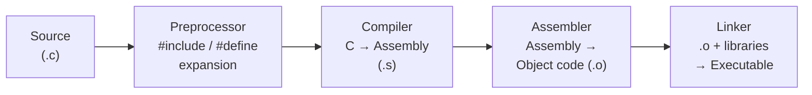

# Topic 1: Writing Simple C Programs

## Overview
C is a general-purpose, procedural language created by Dennis Ritchie at Bell Labs in 1972 and
standardised as ISO/IEC 9899. It provides direct memory access via pointers alongside structured
constructs, forming the foundation of operating systems, embedded firmware, and performance-critical
software. This topic covers the minimal skeleton of every C program—preprocessor directives, the
`main()` entry point, and basic I/O—and traces the four compilation stages that turn source text
into an executable binary.

---

## Definitions & Key Terms

1. **Source file (`.c`)** — A plain-text file containing C source code, fed to the compiler.  
   *Plain English:* the human-readable file you write in a text editor.

2. **Preprocessor directive** — A line beginning with `#` (e.g., `#include <stdio.h>`) processed
   *before* the main compilation step.  
   *Plain English:* instructions to the compiler's assistant that run first.

3. **`main()` function** — The mandatory entry point of every hosted C executable; execution starts
   here when the OS launches the program.  
   *Plain English:* where your program begins.

4. **`printf()`** — Standard library function (declared in `<stdio.h>`) that writes formatted text
   to standard output (the terminal).  
   *Plain English:* prints to the screen.

5. **`scanf()`** — Standard library function that reads formatted data from standard input (the
   keyboard).  
   *Plain English:* reads user input.

6. **Escape sequence** — A `\` followed by a character denoting a non-printable value:
   `\n` (newline), `\t` (tab), `\\` (literal backslash), `\"` (double-quote).  
   *Plain English:* shorthand for characters you can't type directly in a string literal.

7. **`return 0;`** — Returns exit status `0` to the OS from `main()`, signalling successful
   termination.  
   *Plain English:* the program's "finished without errors" signal.

---

## Core Results

### Minimum Valid C Program (ISO C99/C11/C17)

```c
#include <stdio.h>        /* 1. Include header that declares printf/scanf */

int main(void) {          /* 2. Entry point; int return required by C99+  */
    printf("Hello!\n");  /* 3. Write to stdout; \n = newline              */
    return 0;             /* 4. Signal success to the operating system     */
}
```

### The Four-Stage Compilation Pipeline



*Alt text: Four-stage pipeline transforming a .c source file through preprocessor, compiler,
assembler, and linker into a runnable executable.*

| Stage | GCC flag | Output | What happens |
|---|---|---|---|
| Preprocessing | `gcc -E` | `.i` | Macro/include expansion |
| Compilation | `gcc -S` | `.s` | C → assembly |
| Assembly | `gcc -c` | `.o` | Assembly → object code |
| Linking | *(default)* | `a.out` / executable | Combine objects, resolve library symbols |

**Correctness note:** Specified by ISO/IEC 9899:2018 §5.1.1 (eight translation phases). A
conforming compiler on a well-defined translation unit produces a deterministic executable for
a fixed target and compilation flags.

Recommended build command:
```
gcc -Wall -Wextra -std=c11 -o program program.c
```
`-Wall` and `-Wextra` surface most common bugs at compile time.

---

## Worked Examples

### Example 1 — Hello, World!

**Task:** Print `Hello, World!` followed by a newline.

```c
#include <stdio.h>

int main(void) {
    printf("Hello, World!\n");
    return 0;
}
```

Step-by-step:
1. `#include <stdio.h>` — brings `printf` into scope.
2. `int main(void)` — entry point; `void` means no command-line arguments accepted.
3. `printf("Hello, World!\n")` — prints the string; `\n` advances the cursor to the next line.
4. `return 0;` — normal exit; the shell receives exit code 0.

Compile and run:
```
gcc -Wall -o hello hello.c
./hello
```
Output: `Hello, World!`

---

### Example 2 — Formatted Information Block

**Task:** Print a student info table with aligned columns.

```c
#include <stdio.h>

int main(void) {
    printf("=== Student Info ===\n");
    printf("Name   : Alice\n");
    printf("ID     : 2024-001\n");
    printf("Course : MDM-102\n");
    return 0;
}
```

`printf` is called once per line; leading spaces produce the column alignment.

---

### Example 3 — Reading and Printing User Input

**Task:** Prompt for the user's name and greet them.

```c
#include <stdio.h>

int main(void) {
    char name[50];                      /* buffer: 49 chars + null terminator */
    printf("Enter your first name: ");
    scanf("%49s", name);                /* width limit prevents buffer overrun */
    printf("Hello, %s!\n", name);
    return 0;
}
```

Step-by-step:
1. `char name[50]` — stack-allocated array; C strings are null-terminated (`\0`).
2. `scanf("%49s", name)` — reads one whitespace-delimited token; array name decays to a
   pointer, so no `&` needed here.
3. `printf("Hello, %s!\n", name)` — `%s` substitutes the string.

*Note:* `scanf("%s", ...)` stops at whitespace. To read a full line with spaces,
use `fgets(name, sizeof(name), stdin)`.

---

## Applications

- **OS kernels:** Linux, Windows NT, FreeBSD are written primarily in C.
- **Embedded firmware:** AVR, ARM Cortex-M, and ESP32 microcontrollers are programmed in C.
- **Language runtimes:** CPython, Ruby MRI, and Lua are implemented in C.
- **Developer tools:** GCC, Bash, Git, and Vim are written in C.

---

## Practice Problems

**P1.** Write a program that prints your name and student ID on two separate lines.

<details>
<summary>Solution</summary>

```c
#include <stdio.h>
int main(void) {
    printf("Name : Your Name\n");
    printf("ID   : 2024001\n");
    return 0;
}
```
</details>

---

**P2.** Read two integers and print their sum.

<details>
<summary>Solution</summary>

```c
#include <stdio.h>
int main(void) {
    int a, b;
    printf("Enter two integers: ");
    scanf("%d %d", &a, &b);
    printf("Sum = %d\n", a + b);
    return 0;
}
```
`%d` is the format specifier for `int`; `&` gives `scanf` the address of each variable.
</details>

---

**P3.** A student writes `printf("%d\n", 85.5)`. The output is garbage. Why? Fix it.

<details>
<summary>Solution</summary>

`%d` expects an `int` but `85.5` is a `double`; the format specifier and argument type must
match or undefined behaviour results.

Fix:
```c
printf("%.1f\n", 85.5);   /* %f / %.1f for floating-point values */
```
</details>

---

**P4.** Read a character and print its ASCII numeric value.

<details>
<summary>Solution</summary>

```c
#include <stdio.h>
int main(void) {
    char ch;
    printf("Enter a character: ");
    scanf(" %c", &ch);          /* leading space skips whitespace */
    printf("'%c' = ASCII %d\n", ch, (int)ch);
    return 0;
}
```
`char` is an integer type; casting to `int` and printing with `%d` yields the ASCII code.
</details>

---

## References

1. **Kernighan & Ritchie — *The C Programming Language*, 2nd ed. (1988)** — Chapter 1 walks
   through Hello World, format strings, and the compilation model; the canonical primary text.
2. **cppreference.com** (<https://en.cppreference.com/w/c>) — Complete, up-to-date reference for
   all C standard library functions and language constructs.
3. **GNU GCC Manual** (<https://gcc.gnu.org/onlinedocs/gcc/>) — Documents `-Wall`, `-Wextra`,
   `-E`, `-S`, `-c` flags and the full build pipeline.
4. **Harvard CS50** (<https://cs50.harvard.edu/x/>) — Lecture 1 covers Hello World, compilation,
   and debugging with video walkthroughs.
5. **ISO/IEC 9899:2018 (C17)** — Normative specification; §5.1.1.2 defines the eight translation
   phases that correspond to the four-stage pipeline above.
