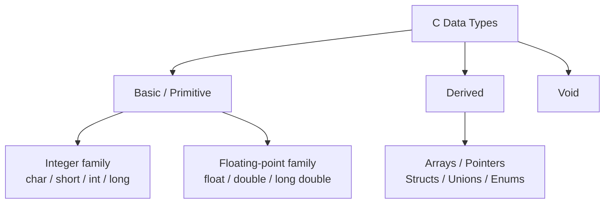

# Topic 2: C Variables, Data Types, and Constants

## Overview
Every value a C program manipulates must have a *type* that tells the compiler its size, range,
and the operations that are valid on it. Variables are named memory locations whose values can
change during execution; constants are fixed values that never change. Understanding the type
system is prerequisite knowledge for every subsequent topic: operators, control flow, functions,
and pointers all depend on knowing what type a value has.

---

## Definitions & Key Terms

1. **Data type** — A classification that specifies the kind of value a variable holds and the
   memory it occupies (e.g., `int`, `float`, `char`).  
   *Plain English:* the category of data — whole number, decimal, character, etc.

2. **Variable** — A named storage location in memory whose value can be read and modified during
   program execution.  
   *Plain English:* a labelled box that holds a value.

3. **Declaration** — A statement introducing a variable's name and type to the compiler:
   `int age;`  
   *Plain English:* telling the compiler "reserve a box called `age` big enough for an int."

4. **Initialisation** — Assigning a value to a variable at the point of declaration:
   `int age = 20;`  
   *Plain English:* putting a starting value in the box when you create it.

5. **Literal constant** — A fixed value written directly in source code: `42`, `3.14`, `'A'`,
   `"hello"`.  
   *Plain English:* a hard-coded value.

6. **Symbolic constant (`#define`)** — A preprocessor macro replacing a name with a value before
   compilation: `#define PI 3.14159`  
   *Plain English:* a named find-and-replace done before compiling.

7. **`const` qualifier** — A type qualifier making a variable read-only after initialisation:
   `const int MAX = 100;`  
   *Plain English:* a variable the compiler won't let you accidentally change.

8. **`sizeof` operator** — Returns the size in bytes of a type or variable: `sizeof(int)`.  
   *Plain English:* asks "how many bytes does this take in memory?"

---

## Core Results

### Fundamental Data Types



*Alt text: Tree diagram classifying C data types into basic (integer and floating-point families),
derived (arrays, pointers, structs, unions, enums), and void.*

| Type | Typical size | Format specifier | Typical range |
|---|---|---|---|
| `char` | 1 byte | `%c` / `%d` | −128 to 127 |
| `int` | 4 bytes | `%d` | −2 147 483 648 to 2 147 483 647 |
| `long` | 4 or 8 bytes | `%ld` | at least −2³¹ to 2³¹−1 |
| `float` | 4 bytes | `%f` | ~±3.4 × 10³⁸, ~7 significant digits |
| `double` | 8 bytes | `%lf` | ~±1.8 × 10³⁰⁸, ~15 significant digits |

> Sizes are *implementation-defined*. Use `sizeof` to query the actual size on your system.
> The `<limits.h>` and `<float.h>` headers define the exact ranges for each type.

**Type modifiers:**

| Modifier | Effect | Example |
|---|---|---|
| `unsigned` | No sign bit; doubles positive range | `unsigned int` (0 to ~4.3 × 10⁹) |
| `signed` | Explicitly signed (default for int/char) | `signed char` |
| `short` | At least 16 bits | `short int` |
| `long` | At least 32 bits | `long int`, `long double` |

**Three ways to define constants:**

```c
#define MAX_SIZE 100          /* preprocessor macro — no type, no scope */
const int MAX_SCORE = 100;   /* typed, scoped, preferred in modern C   */
enum { DAYS_IN_WEEK = 7 };   /* integer constant with enum trick        */
```

Prefer `const` over `#define` because it is type-safe and respects scope.

---

## Worked Examples

### Example 1 — Declaring and Printing Various Types

```c
#include <stdio.h>

int main(void) {
    int    age    = 20;
    float  gpa    = 3.75f;       /* 'f' suffix marks a float literal     */
    double pi     = 3.14159265;
    char   grade  = 'A';

    printf("Age   : %d\n",   age);
    printf("GPA   : %.2f\n", gpa);
    printf("Pi    : %.8f\n", pi);
    printf("Grade : %c\n",   grade);
    return 0;
}
```

---

### Example 2 — `sizeof` and Type Ranges

```c
#include <stdio.h>
#include <limits.h>

int main(void) {
    printf("sizeof(char)   = %zu byte(s)\n", sizeof(char));
    printf("sizeof(int)    = %zu byte(s)\n", sizeof(int));
    printf("sizeof(float)  = %zu byte(s)\n", sizeof(float));
    printf("sizeof(double) = %zu byte(s)\n", sizeof(double));
    printf("INT_MAX        = %d\n", INT_MAX);
    printf("INT_MIN        = %d\n", INT_MIN);
    return 0;
}
```

`%zu` is the correct format specifier for `size_t` (the return type of `sizeof`).

---

### Example 3 — Constants in Practice

```c
#include <stdio.h>

#define GRAVITY 9.8          /* preprocessor constant (no type) */

int main(void) {
    const double PI = 3.14159265358979;   /* typed constant */
    double radius = 5.0;

    printf("Area       = %.4f\n", PI * radius * radius);
    printf("Free-fall g = %.1f m/s^2\n", GRAVITY);
    return 0;
}
```

---

## Applications

- **Textile engineering software:** Temperature sensors return `float` readings; batch counts use
  `int`; machine identifiers use `char` arrays.
- **Embedded systems:** Choosing `uint8_t` vs `uint32_t` (from `<stdint.h>`) directly affects
  memory footprint on microcontrollers.
- **Financial calculations:** `double` is preferred over `float` for currency arithmetic to
  minimise rounding error.

---

## Practice Problems

**P1.** Declare variables for a student's roll number (integer), CGPA (floating-point), and
section (character). Assign values and print them.

<details>
<summary>Solution</summary>

```c
#include <stdio.h>
int main(void) {
    int    roll    = 42;
    double cgpa    = 3.85;
    char   section = 'B';
    printf("Roll: %d | CGPA: %.2f | Section: %c\n", roll, cgpa, section);
    return 0;
}
```
</details>

---

**P2.** Write a program that uses `sizeof` to print the size of every fundamental type on your
system, then record which types share the same size.

<details>
<summary>Solution</summary>

```c
#include <stdio.h>
int main(void) {
    printf("char      : %zu\n", sizeof(char));
    printf("short     : %zu\n", sizeof(short));
    printf("int       : %zu\n", sizeof(int));
    printf("long      : %zu\n", sizeof(long));
    printf("long long : %zu\n", sizeof(long long));
    printf("float     : %zu\n", sizeof(float));
    printf("double    : %zu\n", sizeof(double));
    printf("long dbl  : %zu\n", sizeof(long double));
    return 0;
}
```
On a typical 64-bit Linux system: `int` and `float` are both 4 bytes;
`double` and `long` are both 8 bytes; `long double` is 16 bytes.
</details>

---

**P3.** What is wrong with the following code? Fix it.
```c
#define LIMIT = 50;
int arr[LIMIT];
```

<details>
<summary>Solution</summary>

`#define` is a text substitution; the `=` and `;` become part of the substituted text, producing
`int arr[= 50;];` which is a syntax error.

Fix:
```c
#define LIMIT 50     /* no = and no ; in a #define */
int arr[LIMIT];
```
</details>

---

**P4.** Can you change the value of a `const` variable after declaration? Write code to demonstrate
what happens and explain the compiler's response.

<details>
<summary>Solution</summary>

No. The compiler emits an error (e.g., "assignment of read-only variable").

```c
#include <stdio.h>
int main(void) {
    const int MAX = 100;
    MAX = 200;          /* ERROR: assignment of read-only variable 'MAX' */
    return 0;
}
```
`const` instructs the compiler to treat the variable as read-only; any attempt to modify it
is a compile-time error.
</details>

---

## References

1. **Kernighan & Ritchie — *The C Programming Language*, 2nd ed.** — Chapter 2 covers data
   types, operators, and constants with concise, authoritative examples.
2. **cppreference — Fundamental types** (<https://en.cppreference.com/w/c/language/arithmetic_types>)
   — Exact definitions of type sizes and ranges per standard.
3. **`<limits.h>` and `<float.h>` headers** — Define `INT_MAX`, `DBL_MAX`, etc.; always include
   for portable range checking.
4. **Beej's Guide to C Programming** (<https://beej.us/guide/bgc/>) — Chapter 3 gives an
   accessible, well-illustrated walkthrough of variables and types.
5. **ISO/IEC 9899:2018 §6.2.5** — Normative definition of all C basic types and their
   minimum guaranteed sizes.
