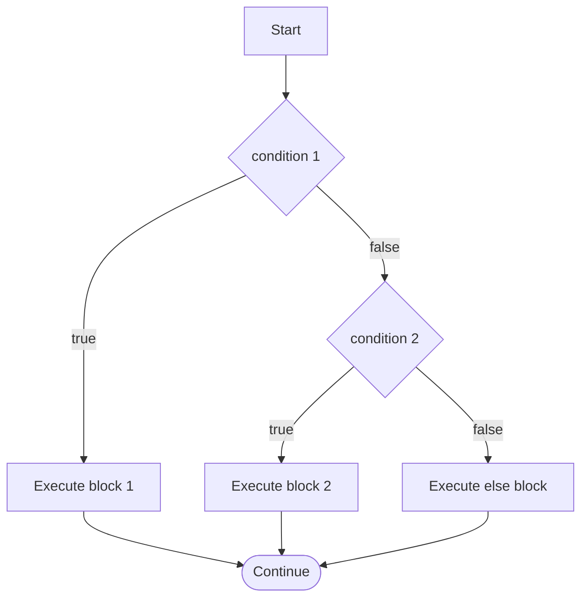
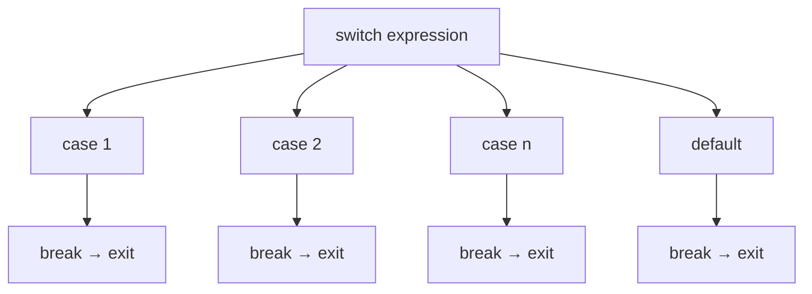

# Topic 4: C Decision Control Statements and Conditional Operators

## Overview
Real programs must make decisions based on data: grade a score, route a packet, check a sensor
threshold. C provides three primary decision-making constructs: the `if`/`else if`/`else` chain
for general conditions, the `switch` statement for discrete integer values, and the ternary
operator `?:` for concise inline choices. Choosing the right construct improves both readability
and performance.

---

## Definitions & Key Terms

1. **Conditional statement** — A statement that executes a block of code only when a specified
   boolean condition evaluates to true (non-zero in C).  
   *Plain English:* code that runs "only if" something is true.

2. **`if` statement** — Executes a block if its condition is non-zero.  
   *Plain English:* "if this is true, do this."

3. **`else` clause** — Optional block executed when the `if` condition is zero (false).  
   *Plain English:* "otherwise, do this instead."

4. **`else if` ladder** — A chain of `if-else if-else` tests evaluated in sequence; the first
   true branch executes and the rest are skipped.  
   *Plain English:* a ranked list of conditions — the first true one wins.

5. **`switch` statement** — Compares an integer expression against a list of `case` labels and
   jumps to the matching one; `break` exits the switch.  
   *Plain English:* a jump table for discrete integer/character values.

6. **Fall-through** — In `switch`, if a `case` has no `break`, execution continues into the next
   case label.  
   *Plain English:* the code "falls through" to the next case unintentionally (or intentionally).

7. **Ternary operator (`?:`)** — `condition ? expr_true : expr_false` — evaluates to one of two
   expressions depending on the condition.  
   *Plain English:* a one-line if-else that produces a value.

8. **Dangling else** — An ambiguity when `else` could pair with either of two `if` statements;
   C resolves it by pairing `else` with the nearest preceding `if`.  
   *Plain English:* an `else` that looks like it belongs to the outer `if` but actually belongs
   to the inner one.

---

## Core Results

### `if / else if / else` — Control Flow



*Alt text: Flowchart showing an if / else-if / else chain where the first true branch runs
and all others are skipped.*

**Syntax:**
```c
if (condition1) {
    /* block 1 */
} else if (condition2) {
    /* block 2 */
} else {
    /* default block */
}
```

### `switch` — Discrete Integer Dispatch



*Alt text: Switch statement dispatch tree showing the expression jumping to a matching case
label, each ending with break to exit.*

**Syntax:**
```c
switch (integer_expr) {
    case CONST1:
        /* ... */
        break;
    case CONST2:
        /* ... */
        break;
    default:
        /* no match */
        break;
}
```

`switch` works only with **integer** types (`int`, `char`, `enum`); it cannot test
floating-point values or strings.

**Ternary Operator:**
```c
int abs_val = (x >= 0) ? x : -x;   /* absolute value of x */
```
Equivalent `if-else`:
```c
int abs_val;
if (x >= 0) abs_val = x;
else        abs_val = -x;
```

---

## Worked Examples

### Example 1 — Grade Classification

**Task:** Read a percentage and print the corresponding letter grade.

```c
#include <stdio.h>

int main(void) {
    int marks;
    printf("Enter marks (0-100): ");
    scanf("%d", &marks);

    if (marks >= 80)
        printf("Grade: A\n");
    else if (marks >= 70)
        printf("Grade: B\n");
    else if (marks >= 60)
        printf("Grade: C\n");
    else if (marks >= 50)
        printf("Grade: D\n");
    else
        printf("Grade: F\n");

    return 0;
}
```

The conditions are evaluated top-down; only the first true branch executes.

---

### Example 2 — switch for Day of Week

**Task:** Read a day number (1–7) and print the day name.

```c
#include <stdio.h>

int main(void) {
    int day;
    printf("Enter day number (1-7): ");
    scanf("%d", &day);

    switch (day) {
        case 1:  printf("Monday\n");    break;
        case 2:  printf("Tuesday\n");   break;
        case 3:  printf("Wednesday\n"); break;
        case 4:  printf("Thursday\n");  break;
        case 5:  printf("Friday\n");    break;
        case 6:  printf("Saturday\n");  break;
        case 7:  printf("Sunday\n");    break;
        default: printf("Invalid day\n"); break;
    }
    return 0;
}
```

Without each `break`, execution would fall through into subsequent cases.

---

### Example 3 — Ternary and Dangling Else

**Task:** Find the maximum of three numbers using the ternary operator.

```c
#include <stdio.h>

int main(void) {
    int a = 15, b = 40, c = 25;
    int max = (a > b) ? ((a > c) ? a : c)
                      : ((b > c) ? b : c);
    printf("Maximum = %d\n", max);   /* 40 */
    return 0;
}
```

**Dangling else warning:**
```c
/* AMBIGUOUS — which if does else belong to? */
if (a > 0)
    if (a > 10)
        printf("big\n");
else          /* this binds to the INNER if (a>10), not the outer if */
    printf("small or negative\n");
```
Always use braces `{}` to eliminate ambiguity:
```c
if (a > 0) {
    if (a > 10)
        printf("big\n");
} else {
    printf("small or negative\n");   /* now clearly paired with outer if */
}
```

---

## Applications

- **Textile quality control:** An `if-else` chain classifies fabric tensile strength readings
  into pass/warning/fail tiers.
- **Menu-driven programs:** `switch` is the natural construct for handling menu option numbers.
- **Sensor thresholds (embedded):** Ternary operators set actuator states inline, saving stack
  frames in interrupt service routines.

---

## Practice Problems

**P1.** Write a program that reads three integers and prints the largest.

<details>
<summary>Solution</summary>

```c
#include <stdio.h>
int main(void) {
    int a, b, c;
    scanf("%d %d %d", &a, &b, &c);
    int max = a;
    if (b > max) max = b;
    if (c > max) max = c;
    printf("Largest = %d\n", max);
    return 0;
}
```
</details>

---

**P2.** Using `switch`, write a simple calculator that reads two numbers and an operator
(`+`, `-`, `*`, `/`) and prints the result.

<details>
<summary>Solution</summary>

```c
#include <stdio.h>
int main(void) {
    double a, b;
    char op;
    printf("Enter: num op num  (e.g. 3.5 + 2): ");
    scanf("%lf %c %lf", &a, &op, &b);

    switch (op) {
        case '+': printf("= %.2f\n", a + b); break;
        case '-': printf("= %.2f\n", a - b); break;
        case '*': printf("= %.2f\n", a * b); break;
        case '/':
            if (b != 0)
                printf("= %.2f\n", a / b);
            else
                printf("Error: division by zero\n");
            break;
        default:
            printf("Unknown operator '%c'\n", op);
    }
    return 0;
}
```
</details>

---

**P3.** Without running the code, state the output and explain the fall-through:
```c
int x = 2;
switch (x) {
    case 1: printf("one ");
    case 2: printf("two ");
    case 3: printf("three ");
    default: printf("done\n");
}
```

<details>
<summary>Solution</summary>

Output: `two three done`

`case 2` matches, so execution jumps there and prints `"two "`. Because there are no `break`
statements, it falls through to `case 3` (`"three "`), then to `default` (`"done\n"`).
</details>

---

**P4.** Rewrite the following as a single ternary expression:
```c
int fee;
if (age < 18) fee = 0;
else          fee = 500;
```

<details>
<summary>Solution</summary>

```c
int fee = (age < 18) ? 0 : 500;
```
</details>

---

## References

1. **Kernighan & Ritchie — *The C Programming Language*, 2nd ed.** — Chapter 3 covers if-else
   chains, switch, and discusses the dangling-else problem explicitly.
2. **cppreference — if statement** (<https://en.cppreference.com/w/c/language/if>) — Formal
   syntax definition and notes on implicit integer conversion in conditions.
3. **cppreference — switch statement** (<https://en.cppreference.com/w/c/language/switch>) —
   Documents fall-through behaviour and valid `case` expressions.
4. **Beej's Guide to C Programming** (<https://beej.us/guide/bgc/>) — Chapter 5 explains control
   flow with practical examples and common pitfall warnings.
5. **MISRA C:2012 Guidelines** — Industry standard for safety-critical C; mandates braces around
   every `if` body and `default:` in every `switch` — good practice for all C code.
