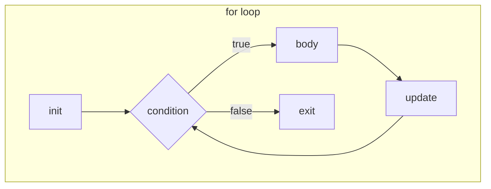
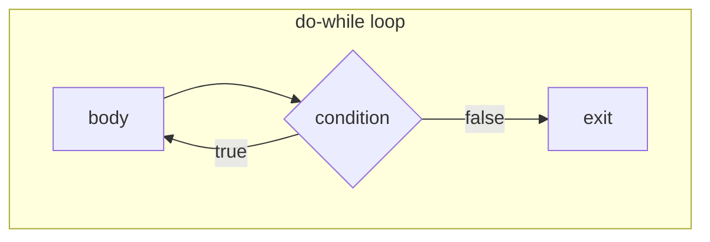

# Topic 5: C Loop Control Statements

## Overview
Loops allow a block of code to execute repeatedly until a condition is met, eliminating the need
to write the same statements multiple times. C provides three loop constructs — `for`, `while`,
and `do-while` — each suited to different usage patterns, as well as `break` and `continue` to
alter loop flow mid-iteration. Mastery of loops is prerequisite to virtually every non-trivial
program: sums, searches, sorting, and I/O processing all depend on repetition.

---

## Definitions & Key Terms

1. **Loop** — A control structure that repeatedly executes a body of code while a condition holds.  
   *Plain English:* keep doing something until told to stop.

2. **Loop variable / loop counter** — A variable that changes each iteration and typically drives
   the loop condition.  
   *Plain English:* the counter that tracks how many times you've gone around.

3. **Iteration** — One execution of the loop body.  
   *Plain English:* one "lap" of the loop.

4. **`for` loop** — A loop whose initialisation, condition, and update are all written in a single
   header line; ideal when the number of iterations is known beforehand.  
   *Plain English:* a count-controlled loop.

5. **`while` loop** — Tests its condition *before* each iteration; the body may never execute if
   the condition is false at the start.  
   *Plain English:* "keep going while this is true."

6. **`do-while` loop** — Tests its condition *after* each iteration; the body always executes at
   least once.  
   *Plain English:* "do this at least once, then keep going while this is true."

7. **`break` statement** — Immediately exits the innermost enclosing loop or `switch`.  
   *Plain English:* "stop the loop right now."

8. **`continue` statement** — Skips the rest of the current iteration and jumps to the next
   condition check (or update step in `for`).  
   *Plain English:* "skip the rest of this lap and start the next one."

9. **Infinite loop** — A loop whose condition never becomes false; used intentionally in
   event-driven/embedded programs (e.g., `while (1) { ... }`).  
   *Plain English:* a loop that runs forever (unless `break` is used).

---

## Core Results

### Loop Comparison

| Feature | `for` | `while` | `do-while` |
|---|---|---|---|
| Condition check | Before each iteration | Before each iteration | **After** each iteration |
| Minimum executions | 0 | 0 | **1** |
| Best use | Known count | Unknown count | Always-run-at-least-once |
| Update location | In header | Inside body | Inside body |

### Flow Diagrams





*Alt text: Left: for-loop flowchart with init, condition check, body, update, exit.
Right: do-while flowchart where body runs first, then condition is checked.*

### `break` and `continue` Semantics

```c
for (int i = 0; i < 10; i++) {
    if (i == 3) continue;   /* skip iteration where i == 3 */
    if (i == 7) break;      /* exit loop when i == 7       */
    printf("%d ", i);       /* prints: 0 1 2 4 5 6          */
}
```

---

## Worked Examples

### Example 1 — Sum of First N Integers (`for`)

**Task:** Read N and print the sum 1 + 2 + … + N.

```c
#include <stdio.h>

int main(void) {
    int n;
    printf("Enter N: ");
    scanf("%d", &n);

    int sum = 0;
    for (int i = 1; i <= n; i++) {
        sum += i;
    }
    printf("Sum = %d\n", sum);
    return 0;
}
```

Mathematical check: sum = N(N+1)/2. For N=10: 55.

---

### Example 2 — Input Validation with `do-while`

**Task:** Keep asking for a positive number until the user provides one.

```c
#include <stdio.h>

int main(void) {
    int n;
    do {
        printf("Enter a positive integer: ");
        scanf("%d", &n);
        if (n <= 0)
            printf("Invalid! Must be > 0.\n");
    } while (n <= 0);

    printf("You entered: %d\n", n);
    return 0;
}
```

`do-while` is ideal here because at least one prompt must always appear.

---

### Example 3 — Multiplication Table with Nested Loops

**Task:** Print a 5 × 5 multiplication table.

```c
#include <stdio.h>

int main(void) {
    printf("   ");
    for (int j = 1; j <= 5; j++) printf("%4d", j);
    printf("\n   +----+----+----+----+----\n");

    for (int i = 1; i <= 5; i++) {
        printf("%2d |", i);
        for (int j = 1; j <= 5; j++) {
            printf("%4d", i * j);
        }
        printf("\n");
    }
    return 0;
}
```

The outer loop iterates over rows; the inner loop over columns.
Time complexity: O(n²) for an n × n table.

---

## Applications

- **Textile manufacturing:** Loops scan sensor arrays along warp and weft threads to detect
  pattern mismatches.
- **Data processing:** `while` loops read lines from a file until EOF.
- **Embedded firmware:** `while (1) { read_sensor(); actuate(); }` is the main event loop of
  most microcontroller programs.

---

## Practice Problems

**P1.** Write a program that prints all even numbers from 2 to 20 using a `for` loop.

<details>
<summary>Solution</summary>

```c
#include <stdio.h>
int main(void) {
    for (int i = 2; i <= 20; i += 2)
        printf("%d ", i);
    printf("\n");
    return 0;
}
```
Output: `2 4 6 8 10 12 14 16 18 20`
</details>

---

**P2.** Compute the factorial of a number entered by the user using a `while` loop.

<details>
<summary>Solution</summary>

```c
#include <stdio.h>
int main(void) {
    int n;
    printf("Enter n: ");
    scanf("%d", &n);
    long long fact = 1;
    int i = 1;
    while (i <= n) {
        fact *= i;
        i++;
    }
    printf("%d! = %lld\n", n, fact);
    return 0;
}
```
Use `long long` to handle larger values; `12! = 479001600` fits in `int`, but `13!` does not.
</details>

---

**P3.** Write a program that uses `break` to find the first integer in 1–100 divisible by both
7 and 11.

<details>
<summary>Solution</summary>

```c
#include <stdio.h>
int main(void) {
    for (int i = 1; i <= 100; i++) {
        if (i % 7 == 0 && i % 11 == 0) {
            printf("First number divisible by 7 and 11: %d\n", i);
            break;
        }
    }
    return 0;
}
```
Output: `77`
</details>

---

**P4.** Print all integers from 1 to 20, skipping multiples of 3, using `continue`.

<details>
<summary>Solution</summary>

```c
#include <stdio.h>
int main(void) {
    for (int i = 1; i <= 20; i++) {
        if (i % 3 == 0) continue;
        printf("%d ", i);
    }
    printf("\n");
    return 0;
}
```
Output: `1 2 4 5 7 8 10 11 13 14 16 17 19 20`
</details>

---

## References

1. **Kernighan & Ritchie — *The C Programming Language*, 2nd ed.** — Chapter 3 covers all three
   loop constructs with canonical examples including character counting and word counting.
2. **cppreference — for loop** (<https://en.cppreference.com/w/c/language/for>) — Formal syntax
   and clarification of the optional init/condition/update expressions.
3. **cppreference — do-while** (<https://en.cppreference.com/w/c/language/do_while>) — Explains
   post-condition evaluation and typical use cases.
4. **Beej's Guide to C Programming** (<https://beej.us/guide/bgc/>) — Chapter 5 includes a clear
   comparison of when to choose each loop type.
5. **MIT OpenCourseWare 6.087** (<https://ocw.mit.edu/courses/6-087-practical-programming-in-c/>) 
   — Lecture notes on loops, break, continue with worked algorithm examples.
