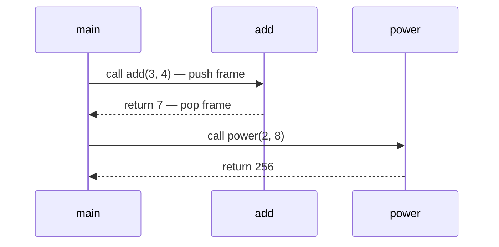

# Topic 6: Library Functions and User-Defined Functions

## Overview
A *function* is a named, reusable block of code that performs a specific task. Functions are the
primary unit of abstraction in C: they reduce code duplication, improve readability, enable
testing in isolation, and allow large programs to be decomposed into manageable pieces. C provides
a rich *standard library* of pre-written functions (I/O, math, string, memory) accessible through
header files. Beyond those, programmers write *user-defined functions* tailored to their problem.

---

## Definitions & Key Terms

1. **Function** — A named, parameterised block of statements that may receive inputs (parameters)
   and return an output (return value).  
   *Plain English:* a labelled recipe that can be called by name from anywhere in the program.

2. **Function prototype (declaration)** — A declaration of a function's name, return type, and
   parameter types, without the body; tells the compiler the function exists before its definition.  
   *Plain English:* a "coming soon" notice so the compiler knows what to expect.

3. **Function definition** — The complete implementation of a function including its body.  
   *Plain English:* the actual recipe with all the steps.

4. **Function call** — An expression that invokes a function by name and passes arguments.  
   *Plain English:* telling the function to run with specific inputs.

5. **Parameter** — A variable listed in the function definition that receives a value when the
   function is called (formal parameter).  
   *Plain English:* a placeholder in the recipe for an ingredient.

6. **Argument** — The actual value passed to a function at the call site.  
   *Plain English:* the actual ingredient used in a specific call.

7. **Return value** — The value a function sends back to its caller via `return`.  
   *Plain English:* the function's output / result.

8. **Pass-by-value** — C's default: the function receives a *copy* of the argument; modifying
   the parameter inside the function does not affect the original variable.  
   *Plain English:* the function gets a photocopy, not the original.

9. **Scope** — The region of source code where a variable name is visible and accessible.  
   *Plain English:* where a variable can be "seen" and used.

10. **Standard library** — A set of pre-compiled functions provided with every C implementation,
    accessible by including the appropriate header file.  
    *Plain English:* a built-in toolbox of ready-made functions.

---

## Core Results

### Function Anatomy

```c
/*  return_type  name  ( parameter_list )  */
    int          add   ( int a, int b    )
    {
        return a + b;     /* function body */
    }
```

### Call Stack Model



*Alt text: Sequence diagram showing main() calling add() and power(), each function pushing
a new stack frame and returning a value when done.*

### Key Standard Library Headers

| Header | Purpose | Example functions |
|---|---|---|
| `<stdio.h>` | Input/output | `printf`, `scanf`, `fgets`, `fprintf` |
| `<math.h>` | Mathematics | `sqrt`, `pow`, `fabs`, `sin`, `log` |
| `<string.h>` | String operations | `strlen`, `strcpy`, `strcmp`, `strcat` |
| `<stdlib.h>` | General utilities | `malloc`, `free`, `atoi`, `rand`, `exit` |
| `<ctype.h>` | Character classification | `isalpha`, `isdigit`, `toupper`, `tolower` |
| `<time.h>` | Time and date | `time`, `clock`, `difftime` |

> Link `<math.h>` with `-lm`: `gcc program.c -lm -o program`

### Scope Rules

```c
int global = 10;          /* file scope: visible in ALL functions */

void demo(void) {
    int local = 20;       /* block scope: only inside demo()      */
    {
        int inner = 30;   /* inner block scope: only inside {}    */
        /* global, local, and inner all visible here */
    }
    /* inner is NOT visible here */
}
/* local is NOT visible here; global IS visible */
```

---

## Worked Examples

### Example 1 — User-Defined Function with Return Value

**Task:** Write a function that returns the square of an integer.

```c
#include <stdio.h>

/* Prototype (declaration) */
int square(int n);

int main(void) {
    for (int i = 1; i <= 5; i++) {
        printf("%d^2 = %d\n", i, square(i));
    }
    return 0;
}

/* Definition */
int square(int n) {
    return n * n;
}
```

---

### Example 2 — `void` Function (No Return Value)

**Task:** Write a function that prints a separator line of given width.

```c
#include <stdio.h>

void print_line(int width) {
    for (int i = 0; i < width; i++) putchar('-');
    putchar('\n');
}

int main(void) {
    print_line(30);
    printf("   MDM-102 Report\n");
    print_line(30);
    return 0;
}
```

---

### Example 3 — Standard Library Functions in Practice

**Task:** Read a string, count its length, convert to uppercase, and find a substring.

```c
#include <stdio.h>
#include <string.h>
#include <ctype.h>

int main(void) {
    char s[100];
    fgets(s, sizeof(s), stdin);
    s[strcspn(s, "\n")] = '\0';   /* remove trailing newline */

    printf("Length    : %zu\n", strlen(s));

    for (int i = 0; s[i]; i++)
        s[i] = (char)toupper((unsigned char)s[i]);
    printf("Uppercase : %s\n", s);

    char *found = strstr(s, "MDM");
    if (found)
        printf("Found 'MDM' at position %td\n", found - s);
    else
        printf("'MDM' not found\n");

    return 0;
}
```

**Math library example:**
```c
#include <stdio.h>
#include <math.h>                  /* link with -lm */

int main(void) {
    printf("sqrt(2)   = %.6f\n", sqrt(2.0));
    printf("pow(2,10) = %.0f\n",  pow(2.0, 10.0));
    printf("log(e)    = %.6f\n",  log(M_E));       /* M_E ≈ 2.71828 */
    return 0;
}
```

---

## Applications

- **Textile testing:** Functions `calc_tensile()`, `average_elongation()` encapsulate domain
  formulae and can be unit-tested independently.
- **Large projects:** Functions allow teams to split work: one member writes the I/O layer,
  another the computation layer, using agreed-upon function prototypes.
- **Standard library:** `qsort()` (from `<stdlib.h>`) sorts any array without rewriting
  the sorting logic.

---

## Practice Problems

**P1.** Write a function `int is_prime(int n)` that returns 1 if `n` is prime, 0 otherwise.
Test it for integers 2–20.

<details>
<summary>Solution</summary>

```c
#include <stdio.h>
#include <math.h>

int is_prime(int n) {
    if (n < 2) return 0;
    for (int i = 2; i <= (int)sqrt((double)n); i++)
        if (n % i == 0) return 0;
    return 1;
}

int main(void) {
    for (int i = 2; i <= 20; i++)
        if (is_prime(i)) printf("%d ", i);
    printf("\n");
    return 0;
}
```
Output: `2 3 5 7 11 13 17 19`
</details>

---

**P2.** Write a function `double celsius_to_fahrenheit(double c)` and its inverse.
Print the conversion table for 0, 20, 40, 60, 80, 100 °C.

<details>
<summary>Solution</summary>

```c
#include <stdio.h>

double celsius_to_fahrenheit(double c) { return c * 9.0 / 5.0 + 32.0; }
double fahrenheit_to_celsius(double f) { return (f - 32.0) * 5.0 / 9.0; }

int main(void) {
    printf("%6s  %8s\n", "Celsius", "Fahrenheit");
    for (int c = 0; c <= 100; c += 20)
        printf("%6d  %8.2f\n", c, celsius_to_fahrenheit(c));
    return 0;
}
```
</details>

---

**P3.** Pass-by-value demonstration: write a function `void try_swap(int a, int b)` that tries
to swap two variables. Call it and print the values before and after. Explain the result.

<details>
<summary>Solution</summary>

```c
#include <stdio.h>

void try_swap(int a, int b) {
    int tmp = a; a = b; b = tmp;
    printf("Inside try_swap: a=%d b=%d\n", a, b);
}

int main(void) {
    int x = 5, y = 10;
    printf("Before: x=%d y=%d\n", x, y);
    try_swap(x, y);
    printf("After : x=%d y=%d\n", x, y);   /* unchanged! */
    return 0;
}
```

The function receives *copies* of `x` and `y`; modifying `a` and `b` inside does not affect
`x` and `y` in `main`. To swap originals, pass *pointers*: `void swap(int *a, int *b)`.
</details>

---

## References

1. **Kernighan & Ritchie — *The C Programming Language*, 2nd ed.** — Chapters 4 and 7 cover
   user-defined functions, scope, external variables, and the standard library.
2. **cppreference — Standard library** (<https://en.cppreference.com/w/c/header>) — Index of all
   standard headers and every function they declare.
3. **Beej's Guide to C Programming** (<https://beej.us/guide/bgc/>) — Chapter 9 explains
   function prototypes, definitions, and variable scope with worked examples.
4. **GNU C Library Manual** (<https://www.gnu.org/software/libc/manual/>) — Comprehensive
   reference for all glibc extensions beyond the ISO standard.
5. **MIT OCW 6.087** (<https://ocw.mit.edu/courses/6-087-practical-programming-in-c/>) — Lecture
   4 covers functions, scope, and storage classes with code exercises.
