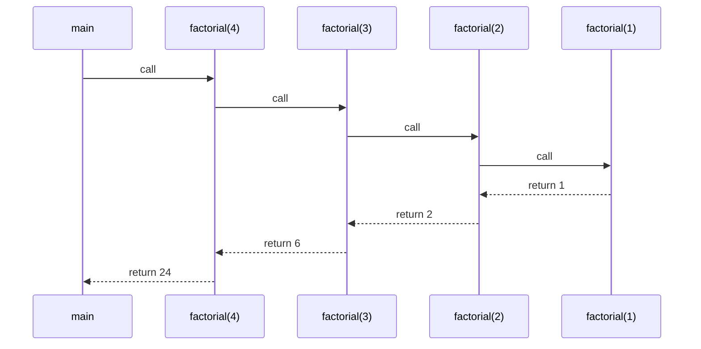

# Topic 7: Recursion

## Overview
*Recursion* is a technique where a function solves a problem by calling itself on progressively
simpler sub-problems until reaching a trivially solvable *base case*. Many problems that appear
complex when expressed iteratively have elegant, naturally recursive definitions — factorials,
tree traversals, and divide-and-conquer algorithms are canonical examples. Recursion relies on
the call stack to maintain state for each active invocation, and understanding stack depth is
essential for avoiding stack-overflow errors.

---

## Definitions & Key Terms

1. **Recursion** — A programming technique in which a function calls itself, directly or
   indirectly, to solve a sub-problem of the same kind.  
   *Plain English:* a function that uses itself to solve a smaller version of the same task.

2. **Base case** — The condition under which a recursive function stops calling itself and returns
   a direct result.  
   *Plain English:* the "stopping point" — without it, recursion never ends.

3. **Recursive case** — The branch in which the function calls itself with a simpler or smaller
   input, making progress toward the base case.  
   *Plain English:* the "do the next step" branch.

4. **Call stack** — The region of memory holding one *stack frame* per active function call;
   each frame stores local variables, parameters, and the return address.  
   *Plain English:* a stack of "bookmarks," one per in-progress function call.

5. **Stack frame** — The block of memory pushed onto the call stack when a function is called
   and popped when it returns.  
   *Plain English:* the scratch pad created for each function call.

6. **Stack overflow** — A runtime error caused by exhausting call stack memory, usually from
   uncontrolled recursion (missing or unreachable base case).  
   *Plain English:* too many function calls piled up — the stack runs out of space.

7. **Tail recursion** — A recursive call that is the *last* operation in the function; some
   compilers can optimise this into a loop (TCO). C does not guarantee TCO, but GCC may apply
   it with `-O2`.  
   *Plain English:* the call-back-to-self is the very last thing done before returning.

---

## Core Results

### Recursive Function Template

```c
return_type recurse(parameters) {
    if (BASE_CASE_CONDITION)
        return BASE_CASE_VALUE;        /* stop */
    return recurse(SIMPLER_INPUT);     /* go deeper */
}
```

**Two mandatory elements:** (1) a base case that always terminates, and (2) recursive calls
that strictly progress toward the base case. A missing or unreachable base case causes
infinite recursion and stack overflow.

### Call Stack Trace — factorial(4)



*Alt text: Sequence diagram showing factorial(4) recursively calling factorial(3), (2), (1),
then unwinding — each level multiplying before returning to the caller above.*

### Complexity

| Function | Time complexity | Space (stack depth) |
|---|---|---|
| `factorial(n)` | O(n) | O(n) |
| `fib(n)` (naive) | O(2ⁿ) | O(n) |
| `fib(n)` (memoised) | O(n) | O(n) |
| `power(b, n)` (fast) | O(log n) | O(log n) |

---

## Worked Examples

### Example 1 — Factorial

**Task:** Compute n! = n × (n−1) × … × 1, with 0! = 1.

```c
#include <stdio.h>

long long factorial(int n) {
    if (n <= 1) return 1;           /* base case */
    return n * factorial(n - 1);   /* recursive case */
}

int main(void) {
    for (int i = 0; i <= 10; i++)
        printf("%2d! = %lld\n", i, factorial(i));
    return 0;
}
```

**Trace for n = 4:**
```
factorial(4) = 4 × factorial(3)
             = 4 × 3 × factorial(2)
             = 4 × 3 × 2 × factorial(1)
             = 4 × 3 × 2 × 1 = 24
```

---

### Example 2 — Fibonacci Sequence

**Task:** Compute the nth Fibonacci number: F(0)=0, F(1)=1, F(n)=F(n-1)+F(n-2).

```c
#include <stdio.h>

int fib(int n) {
    if (n == 0) return 0;       /* base case 1 */
    if (n == 1) return 1;       /* base case 2 */
    return fib(n - 1) + fib(n - 2);   /* recursive case */
}

int main(void) {
    for (int i = 0; i <= 10; i++)
        printf("F(%2d) = %d\n", i, fib(i));
    return 0;
}
```

**Warning:** Naive Fibonacci has O(2ⁿ) time complexity; `fib(40)` makes ~2 billion calls.
Use an iterative loop or memoisation for large n.

---

### Example 3 — Tower of Hanoi

**Task:** Move n disks from peg A to peg C using peg B as auxiliary.
Rules: move one disk at a time; never place a larger disk on a smaller one.

```c
#include <stdio.h>

void hanoi(int n, char src, char aux, char dst) {
    if (n == 0) return;                          /* base case */
    hanoi(n - 1, src, dst, aux);                /* move n-1 to aux */
    printf("Move disk %d: %c → %c\n", n, src, dst);   /* move nth */
    hanoi(n - 1, aux, src, dst);                /* move n-1 from aux to dst */
}

int main(void) {
    hanoi(3, 'A', 'B', 'C');
    return 0;
}
```

For n disks, the minimum number of moves is 2ⁿ − 1 (7 moves for n = 3).

---

## Applications

- **Divide-and-conquer algorithms:** Merge sort and quicksort are naturally recursive and
  achieve O(n log n) time complexity.
- **Tree and graph traversal:** File system directory listing, XML/HTML parsing, and
  expression evaluation all use recursion.
- **Backtracking:** Sudoku solvers, maze pathfinders, and N-Queens use recursive search.
- **Compiler design:** Parsing arithmetic expressions with operator precedence (recursive
  descent parsers) relies directly on recursion.

---

## Practice Problems

**P1.** Write a recursive function to compute the sum of digits of a positive integer.
E.g., `digit_sum(1234)` → `10`.

<details>
<summary>Solution</summary>

```c
#include <stdio.h>

int digit_sum(int n) {
    if (n == 0) return 0;
    return (n % 10) + digit_sum(n / 10);
}

int main(void) {
    printf("digit_sum(1234) = %d\n", digit_sum(1234));   /* 10 */
    return 0;
}
```
</details>

---

**P2.** Write a recursive function `int power(int base, int exp)` that computes baseᵉˣᵖ.
Use the fast-exponentiation recurrence:
- power(b, 0) = 1
- power(b, e) = power(b×b, e/2) if e is even
- power(b, e) = b × power(b, e-1) if e is odd

<details>
<summary>Solution</summary>

```c
#include <stdio.h>

long long power(long long base, int exp) {
    if (exp == 0) return 1;
    if (exp % 2 == 0) return power(base * base, exp / 2);
    return base * power(base, exp - 1);
}

int main(void) {
    printf("2^10 = %lld\n", power(2, 10));   /* 1024 */
    return 0;
}
```
O(log n) recursive calls instead of O(n).
</details>

---

**P3.** Write a recursive function to reverse a string in-place (without a second buffer).

<details>
<summary>Solution</summary>

```c
#include <stdio.h>
#include <string.h>

void reverse(char *s, int lo, int hi) {
    if (lo >= hi) return;
    char tmp = s[lo]; s[lo] = s[hi]; s[hi] = tmp;
    reverse(s, lo + 1, hi - 1);
}

int main(void) {
    char str[] = "BUTEX";
    reverse(str, 0, (int)strlen(str) - 1);
    printf("%s\n", str);   /* XETUB */
    return 0;
}
```
</details>

---

**P4.** What is wrong with the following recursive function? Fix it.
```c
int bad(int n) {
    return n + bad(n - 1);
}
```

<details>
<summary>Solution</summary>

There is no base case — `bad()` calls itself infinitely until the stack overflows.

Fix (sum 1..n):
```c
int sum(int n) {
    if (n <= 0) return 0;          /* base case */
    return n + sum(n - 1);         /* recursive case */
}
```
</details>

---

## References

1. **Kernighan & Ritchie — *The C Programming Language*, 2nd ed.** — Section 4.10 introduces
   recursion with the `printd` digit-printing example.
2. **Cormen et al. — *Introduction to Algorithms* (CLRS), 4th ed.** — Chapter 2 (merge sort)
   and Chapter 4 (divide-and-conquer) ground recursion in rigorous complexity analysis.
3. **cppreference — C99 VLAs and stack** (<https://en.cppreference.com/w/c>) — Background on
   stack frame layout relevant to understanding recursion depth.
4. **Beej's Guide to C Programming** (<https://beej.us/guide/bgc/>) — Chapter 10 gives an
   accessible treatment of recursion with worked factorial and Fibonacci examples.
5. **HyperPhysics-style recurse visualiser — University of San Francisco CS** 
   (<https://www.cs.usfca.edu/~galles/visualization/RecursiveTree.html>) — Interactive tool
   for visualising recursion trees; invaluable for building intuition.
