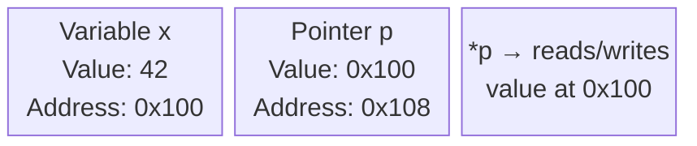

# Topic 8: Pointers and Arrays

## Overview
A *pointer* is a variable that stores the memory address of another variable. Pointers are what
make C powerful and distinctive: they enable direct memory manipulation, efficient parameter
passing (by reference), and dynamic memory allocation. *Arrays* are contiguous blocks of
same-type elements, and in C they are intimately related to pointers — an array name decays to
a pointer to its first element. Mastering pointers and arrays is the gateway to strings, dynamic
data structures, and ultimately to understanding how programs use memory.

---

## Definitions & Key Terms

1. **Pointer** — A variable whose value is the *memory address* of another variable.  
   *Plain English:* a variable that holds the "location" of another variable, not its value.

2. **Address-of operator (`&`)** — Produces the memory address of a variable: `&x`.  
   *Plain English:* "the address where `x` lives."

3. **Dereference operator (`*`)** — Accesses the value at the address stored in a pointer:
   `*p` (when `p` is a pointer).  
   *Plain English:* "go to the address in `p` and read/write the value there."

4. **NULL pointer** — A pointer set to `NULL` (defined as `(void*)0`), indicating it points
   to nothing; dereferencing NULL is undefined behaviour and typically crashes the program.  
   *Plain English:* a pointer that intentionally points nowhere — a safe "not set" sentinel.

5. **Pointer arithmetic** — Adding or subtracting an integer from a pointer advances it by that
   many *elements* (not bytes): `p + 1` points to the next element of `p`'s type.  
   *Plain English:* moving a pointer forward or backward through an array one element at a time.

6. **Array** — A contiguous, fixed-size sequence of elements all of the same type.  
   *Plain English:* a numbered row of boxes, all the same size.

7. **Array decay** — When an array name appears in an expression (other than as the operand of
   `sizeof` or `&`), it implicitly converts to a pointer to its first element.  
   *Plain English:* the array name automatically becomes the address of element 0.

8. **String (in C)** — A `char` array terminated by the null character `'\0'`.  
   *Plain English:* a sequence of characters ending with an invisible end-marker.

9. **Dangling pointer** — A pointer that refers to memory that has already been freed or gone
   out of scope; dereferencing it is undefined behaviour.  
   *Plain English:* a pointer that still has an address but that address no longer belongs to you.

---

## Core Results

### Pointer Mechanics

```c
int  x   = 42;
int *p   = &x;          /* p holds the address of x           */

printf("%d\n",  x);     /* 42  — value of x directly           */
printf("%p\n",  (void*)p);  /* memory address (e.g. 0x7ffc...)  */
printf("%d\n", *p);     /* 42  — value at the address in p     */

*p = 100;               /* modifies x through p               */
printf("%d\n",  x);     /* 100 — x changed                     */
```

### Memory Layout Diagram



*Alt text: Block diagram showing variable x at address 0x100 holding value 42, pointer p
at address 0x108 holding value 0x100, and the dereference *p accessing x's slot.*

### Arrays and Pointer Equivalence

```c
int arr[5] = {10, 20, 30, 40, 50};

/* These two are identical: */
printf("%d\n", arr[2]);     /* 30 — subscript notation       */
printf("%d\n", *(arr + 2)); /* 30 — pointer arithmetic       */

/* arr decays to &arr[0]: */
int *p = arr;               /* p points to arr[0]            */
printf("%d\n", p[3]);       /* 40 — pointer used as array    */
```

### 2D Arrays

```c
int matrix[3][4];
/* matrix[i][j] is equivalent to *(*(matrix + i) + j) */
```

### Passing Arrays to Functions

```c
/* Arrays are always passed as pointers; size must be passed separately */
void print_array(int *arr, int n) {
    for (int i = 0; i < n; i++) printf("%d ", arr[i]);
    printf("\n");
}
```

### Common String Functions (`<string.h>`)

| Function | Description |
|---|---|
| `strlen(s)` | Length of string (excluding `'\0'`) |
| `strcpy(dst, src)` | Copy src into dst |
| `strncpy(dst, src, n)` | Copy at most n chars (safer) |
| `strcmp(s1, s2)` | Compare strings; 0 if equal |
| `strcat(dst, src)` | Append src to dst |
| `strstr(haystack, needle)` | Find needle in haystack; returns pointer or NULL |

---

## Worked Examples

### Example 1 — Swap via Pointers (True Pass-by-Reference)

**Task:** Write a function that actually swaps two integers.

```c
#include <stdio.h>

void swap(int *a, int *b) {
    int tmp = *a;
    *a = *b;
    *b = tmp;
}

int main(void) {
    int x = 5, y = 10;
    printf("Before: x=%d y=%d\n", x, y);
    swap(&x, &y);                          /* pass addresses */
    printf("After : x=%d y=%d\n", x, y);  /* x=10 y=5 */
    return 0;
}
```

By passing `&x` and `&y`, the function receives the actual addresses and modifies the originals.

---

### Example 2 — Array Sum and Maximum

**Task:** Compute the sum and maximum of an integer array.

```c
#include <stdio.h>

int array_sum(int *arr, int n) {
    int s = 0;
    for (int i = 0; i < n; i++) s += arr[i];
    return s;
}

int array_max(int *arr, int n) {
    int m = arr[0];
    for (int i = 1; i < n; i++) if (arr[i] > m) m = arr[i];
    return m;
}

int main(void) {
    int data[] = {34, 7, 23, 32, 5, 62};
    int n = sizeof(data) / sizeof(data[0]);   /* number of elements */

    printf("Sum = %d\n", array_sum(data, n));  /* 163 */
    printf("Max = %d\n", array_max(data, n));  /* 62  */
    return 0;
}
```

`sizeof(data) / sizeof(data[0])` is the idiomatic C way to get the length of a stack array.

---

### Example 3 — Strings as Char Arrays

**Task:** Read a sentence, count vowels, and reverse it.

```c
#include <stdio.h>
#include <string.h>
#include <ctype.h>

int count_vowels(const char *s) {
    int count = 0;
    for (; *s; s++) {
        char c = (char)tolower((unsigned char)*s);
        if (c == 'a' || c == 'e' || c == 'i' || c == 'o' || c == 'u')
            count++;
    }
    return count;
}

void reverse_str(char *s) {
    int lo = 0, hi = (int)strlen(s) - 1;
    while (lo < hi) {
        char tmp = s[lo]; s[lo] = s[hi]; s[hi] = tmp;
        lo++; hi--;
    }
}

int main(void) {
    char buf[200];
    fgets(buf, sizeof(buf), stdin);
    buf[strcspn(buf, "\n")] = '\0';

    printf("Vowels : %d\n", count_vowels(buf));
    reverse_str(buf);
    printf("Reversed: %s\n", buf);
    return 0;
}
```

---

## Applications

- **Operating systems:** Device drivers use pointers to map hardware registers into addressable
  memory.
- **String processing:** All text manipulation in C (parsing, tokenising, searching) relies on
  pointer arithmetic over `char` arrays.
- **Dynamic data structures:** Linked lists, trees, and graphs are built from structs connected
  via pointers.
- **Image processing:** A 2D array of `unsigned char` represents a greyscale image; pointer
  arithmetic traverses pixels efficiently.

---

## Practice Problems

**P1.** Write a function `void fill(int *arr, int n, int val)` that fills every element of
`arr` with `val`. Test it by printing the array before and after.

<details>
<summary>Solution</summary>

```c
#include <stdio.h>

void fill(int *arr, int n, int val) {
    for (int i = 0; i < n; i++) arr[i] = val;
}

int main(void) {
    int a[5];
    fill(a, 5, 7);
    for (int i = 0; i < 5; i++) printf("%d ", a[i]);
    printf("\n");   /* 7 7 7 7 7 */
    return 0;
}
```
</details>

---

**P2.** Write a function that finds the index of the minimum element of an integer array.

<details>
<summary>Solution</summary>

```c
int min_index(int *arr, int n) {
    int mi = 0;
    for (int i = 1; i < n; i++)
        if (arr[i] < arr[mi]) mi = i;
    return mi;
}
```
</details>

---

**P3.** Declare a `char` array for the string `"BUTEX"` and print each character and its
address using a pointer.

<details>
<summary>Solution</summary>

```c
#include <stdio.h>

int main(void) {
    char s[] = "BUTEX";
    for (char *p = s; *p != '\0'; p++)
        printf("Char: %c  Address: %p\n", *p, (void*)p);
    return 0;
}
```
Each address should differ by exactly 1 byte (size of `char`).
</details>

---

**P4.** What is the danger of the following code? How do you fix it?
```c
int *p;
*p = 42;
```

<details>
<summary>Solution</summary>

`p` is an uninitialised pointer; it contains a garbage address. Writing `*p = 42` attempts to
write to an unknown memory location — this is **undefined behaviour** and typically causes a
segmentation fault.

Fix: always initialise pointers before dereferencing them:
```c
int x;
int *p = &x;    /* point to a valid variable, or */
*p = 42;

/* or allocate on heap: */
#include <stdlib.h>
int *q = malloc(sizeof(int));
if (q) { *q = 42; free(q); }
```
</details>

---

## References

1. **Kernighan & Ritchie — *The C Programming Language*, 2nd ed.** — Chapter 5 is the
   definitive treatment of pointers and arrays; Chapter 6 covers strings.
2. **cppreference — Pointer declaration** (<https://en.cppreference.com/w/c/language/pointer>) —
   Formal specification of pointer types, arithmetic, and conversions.
3. **Beej's Guide to C Programming** (<https://beej.us/guide/bgc/>) — Chapters 11–12 give an
   unusually clear explanation of pointers with memory diagrams.
4. **Stanford CS106B Pointer Fundamentals** (<https://web.stanford.edu/class/cs106b/>) —
   Lecture slides illustrating heap vs stack pointer layouts.
5. **Valgrind** (<https://valgrind.org/>) — Dynamic analysis tool that detects dangling pointers,
   uninitialised reads, and memory leaks; essential for pointer-heavy C development.
