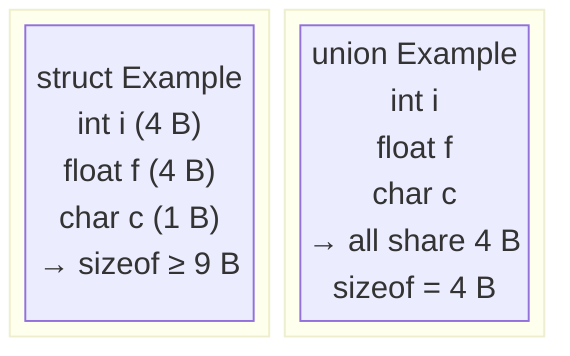

# Topic 9: User-Defined Data Types

## Overview
The primitive types (`int`, `float`, `char`) can represent individual values, but real-world
objects have multiple attributes. C provides *user-defined types* — `struct`, `union`, `enum`,
and `typedef` — for grouping heterogeneous data and creating domain-specific type names. A
`struct` groups related fields under one name; a `union` overlaps them in memory; `enum` assigns
meaningful names to integer constants; and `typedef` creates aliases for any type. Together they
enable clean, self-documenting data models.

---

## Definitions & Key Terms

1. **`struct`** — A composite data type that groups variables (called *members* or *fields*) of
   potentially different types under one name; each member has its own storage.  
   *Plain English:* a record/row in a database — a named collection of related fields.

2. **Member access operator (`.`)** — Accesses a struct member through a *variable*: `s.name`.  
   *Plain English:* "go into `s` and get the field called `name`."

3. **Arrow operator (`->`)** — Accesses a struct member through a *pointer*:
   `p->name` ≡ `(*p).name`.  
   *Plain English:* "follow the pointer `p` and get the field called `name`."

4. **`union`** — Like a struct, but all members **share the same memory**; only one member holds
   a valid value at any given time. `sizeof(union)` = size of the largest member.  
   *Plain English:* a single memory cell that can be interpreted as different types.

5. **`enum`** — A user-defined integer type where each value is given a symbolic name.  
   *Plain English:* a named set of whole-number constants.

6. **`typedef`** — Creates an alias (alternative name) for an existing type.  
   *Plain English:* a shorthand nickname for a type.

7. **Structure padding** — Extra bytes the compiler inserts between struct members to satisfy
   alignment requirements; `sizeof(struct)` may be larger than the sum of member sizes.  
   *Plain English:* invisible filler bytes added for hardware alignment.

---

## Core Results

### `struct` Declaration, Definition, and Access

```c
/* Declaration */
struct Student {
    int    id;
    char   name[50];
    float  gpa;
};

/* Variable definition */
struct Student s1;
s1.id  = 2024001;
strcpy(s1.name, "Alice");
s1.gpa = 3.85f;

/* Initialise at declaration */
struct Student s2 = {2024002, "Bob", 3.60f};

/* Pointer access */
struct Student *ptr = &s2;
printf("%s: %.2f\n", ptr->name, ptr->gpa);   /* Bob: 3.60 */
```

### `union` vs `struct` Memory



*Alt text: Side-by-side comparison showing struct members at separate offsets vs union
members all starting at offset 0, sharing the same 4-byte region.*

### `enum` Example

```c
enum Day { MON=1, TUE, WED, THU, FRI, SAT, SUN };
enum Day today = WED;
printf("Day number: %d\n", today);   /* 3 */
```

Default: first enumerator = 0, each subsequent = previous + 1. Explicit values override.

### `typedef` Examples

```c
typedef unsigned int uint;
typedef struct Student Student;    /* avoid writing 'struct' each time */
typedef struct Node {
    int data;
    struct Node *next;
} Node;                            /* self-referential struct for linked list */

uint count = 0;
Student alice;
Node *head = NULL;
```

---

## Worked Examples

### Example 1 — Student Record with Array of Structs

**Task:** Store and print records for 3 students.

```c
#include <stdio.h>
#include <string.h>

typedef struct {
    int   id;
    char  name[50];
    float gpa;
} Student;

void print_student(const Student *s) {
    printf("ID: %d | Name: %-20s | GPA: %.2f\n", s->id, s->name, s->gpa);
}

int main(void) {
    Student class[3] = {
        {2024001, "Alice",   3.85f},
        {2024002, "Bob",     3.60f},
        {2024003, "Charlie", 3.72f}
    };

    for (int i = 0; i < 3; i++) print_student(&class[i]);
    return 0;
}
```

---

### Example 2 — `union` for Type-Punning

**Task:** Use a `union` to inspect the bytes of a `float`.

```c
#include <stdio.h>

union FloatBytes {
    float    f;
    unsigned int bits;
};

int main(void) {
    union FloatBytes fb;
    fb.f = 1.0f;
    printf("float 1.0 in IEEE 754: 0x%08X\n", fb.bits);   /* 0x3F800000 */
    return 0;
}
```

Only the last-written member should be read for well-defined behaviour; type-punning via unions
is a common C idiom for inspecting binary representation.

---

### Example 3 — Enum for Finite State Machine

**Task:** Model a traffic light controller using `enum` for states.

```c
#include <stdio.h>

typedef enum { RED, YELLOW, GREEN } TrafficLight;

const char *light_name[] = {"RED", "YELLOW", "GREEN"};

TrafficLight next_state(TrafficLight current) {
    return (TrafficLight)((current + 1) % 3);
}

int main(void) {
    TrafficLight light = RED;
    for (int cycle = 0; cycle < 6; cycle++) {
        printf("Light: %s\n", light_name[light]);
        light = next_state(light);
    }
    return 0;
}
```

---

## Applications

- **Textile industry data models:** A `struct Fabric` might contain `char material[30]`,
  `float weight_gsm`, `int thread_count`, `enum Weave weave_type`.
- **Embedded systems:** `union` registers overlay hardware register bits and full-word access
  for memory-mapped I/O.
- **Database records:** Arrays of structs represent query result sets; `typedef` keeps field
  access readable.
- **Protocol headers:** Network packet headers (IP, TCP) are often parsed using packed structs.

---

## Practice Problems

**P1.** Define a `struct Point` with `double x` and `double y` fields. Write a function
`double distance(Point a, Point b)` that returns the Euclidean distance.

<details>
<summary>Solution</summary>

```c
#include <stdio.h>
#include <math.h>

typedef struct { double x, y; } Point;

double distance(Point a, Point b) {
    double dx = a.x - b.x, dy = a.y - b.y;
    return sqrt(dx*dx + dy*dy);
}

int main(void) {
    Point p1 = {0, 0}, p2 = {3, 4};
    printf("Distance = %.2f\n", distance(p1, p2));   /* 5.00 */
    return 0;
}
```
</details>

---

**P2.** Define `enum Semester { FIRST=1, SECOND, THIRD, FOURTH, FIFTH, SIXTH, SEVENTH, EIGHTH }`.
Read a semester number and print the semester name.

<details>
<summary>Solution</summary>

```c
#include <stdio.h>
typedef enum { FIRST=1,SECOND,THIRD,FOURTH,FIFTH,SIXTH,SEVENTH,EIGHTH } Semester;
const char *sem_name[] = {"","1st","2nd","3rd","4th","5th","6th","7th","8th"};
int main(void) {
    int s; scanf("%d", &s);
    if (s >= 1 && s <= 8)
        printf("Semester: %s\n", sem_name[s]);
    else
        printf("Invalid semester\n");
    return 0;
}
```
</details>

---

**P3.** What is structure padding? Write code using `sizeof` to demonstrate it.

<details>
<summary>Solution</summary>

The compiler inserts padding bytes between struct members to ensure each member is aligned to
its natural alignment boundary (e.g., `int` aligned to 4 bytes). This means `sizeof(struct)`
can exceed the sum of member sizes.

```c
#include <stdio.h>
struct Padded   { char a; int b; char c; };  /* likely 12 bytes, not 6 */
struct Packed   { char a; char c; int b; };  /* likely 8 bytes — fields reordered */

int main(void) {
    printf("Padded : %zu bytes\n", sizeof(struct Padded));
    printf("Packed : %zu bytes\n", sizeof(struct Packed));
    return 0;
}
```
Reordering fields from largest to smallest minimises padding.
</details>

---

## References

1. **Kernighan & Ritchie — *The C Programming Language*, 2nd ed.** — Chapter 6 covers structs,
   unions, enums, and typedef with practical examples including symbol-table implementation.
2. **cppreference — struct** (<https://en.cppreference.com/w/c/language/struct>) — Normative
   definition including padding rules and designated initialisers.
3. **cppreference — union** (<https://en.cppreference.com/w/c/language/union>) — Clarifies which
   members may be validly read and type-punning rules.
4. **Beej's Guide to C Programming** (<https://beej.us/guide/bgc/>) — Chapter 13 gives
   accessible struct and union coverage; Chapter 14 covers typedef.
5. **N. Lindquist — *C Struct Alignment and Padding*** 
   (<https://www.catb.org/esr/structure-packing/>) — Detailed visual guide to structure padding
   with worked examples and memory-layout diagrams.
