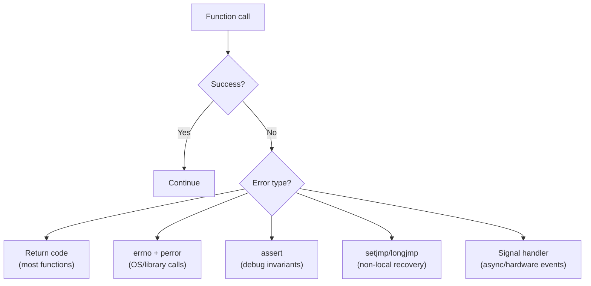

# Topic 10: Exception Handling of C Programs

## Overview
Unlike C++ or Java, **C has no built-in exception handling mechanism** (no `try`, `catch`, or
`throw`). Errors in C programs are instead managed through a family of portable idioms: return
codes, the `errno` error variable, `assert()` for invariant checking, `setjmp()`/`longjmp()` for
non-local control transfer, and signal handling. Understanding these patterns is essential for
writing robust programs that fail gracefully rather than silently producing wrong results or
crashing unexpectedly.

---

## Definitions & Key Terms

1. **Error handling** — Detecting, reporting, and recovering from conditions that prevent a
   program from completing its intended operation normally.  
   *Plain English:* dealing with things that go wrong.

2. **Return code** — An integer value returned by a function to indicate success or a specific
   error; by convention, 0 means success and non-zero means error.  
   *Plain English:* a function's way of saying "here's how it went."

3. **`errno`** — A global integer variable (from `<errno.h>`) set by system calls and library
   functions to a nonzero error code when they fail.  
   *Plain English:* a global "last error number" stamp left by the OS/library after a failure.

4. **`perror(msg)`** — Prints `msg: <system error description>` to stderr, reading the error
   description from `errno`.  
   *Plain English:* automatically prints a human-readable description of the last error.

5. **`strerror(errnum)`** — Returns a pointer to a string describing the error number `errnum`.  
   *Plain English:* converts an error number into a human-readable message string.

6. **`assert(expr)`** — Macro (from `<assert.h>`) that aborts the program with a diagnostic if
   `expr` evaluates to 0 (false). Disabled when `NDEBUG` is defined.  
   *Plain English:* a built-in sanity check that crashes loudly if a condition you believe is
   always true turns out to be false — invaluable during development.

7. **`setjmp()` / `longjmp()`** — Non-local jump mechanism: `setjmp` saves the current
   execution context into a `jmp_buf`; `longjmp` restores it from anywhere in the call chain,
   approximating exception-like behaviour.  
   *Plain English:* `setjmp` places a bookmark; `longjmp` jumps back to it from deep inside
   a call stack — C's closest equivalent to a `try/catch`.

8. **Signal** — An asynchronous notification sent to a process to report an event (e.g.,
   `SIGSEGV` for segfault, `SIGFPE` for floating-point error, `SIGINT` for Ctrl+C).  
   *Plain English:* an interrupt from the OS telling your program something happened.

---

## Core Results

### C Error-Handling Strategies at a Glance



*Alt text: Decision flowchart showing the five C error-handling strategies chosen based on
error type: return codes, errno, assert, setjmp/longjmp, and signal handlers.*

### 1 — Return Codes (Most Common Pattern)

```c
#include <stdio.h>

/* Convention: return 0 on success, -1 (or an error code) on failure */
int divide(int a, int b, int *result) {
    if (b == 0) return -1;    /* error: division by zero */
    *result = a / b;
    return 0;                 /* success */
}

int main(void) {
    int result;
    if (divide(10, 0, &result) != 0)
        fprintf(stderr, "Error: division by zero\n");
    else
        printf("Result: %d\n", result);
    return 0;
}
```

### 2 — `errno` and `perror()`

```c
#include <stdio.h>
#include <errno.h>
#include <string.h>

int main(void) {
    FILE *fp = fopen("nonexistent.txt", "r");
    if (fp == NULL) {
        perror("fopen");                          /* prints: fopen: No such file or directory */
        fprintf(stderr, "errno = %d: %s\n", errno, strerror(errno));
        return 1;
    }
    fclose(fp);
    return 0;
}
```

**Rule:** Always check return values of I/O and memory functions. Reset `errno = 0` before a
call if you intend to check it afterward (some functions set it even on success).

### 3 — `assert()` for Debug Invariants

```c
#include <assert.h>
#include <stdio.h>

int array_get(int *arr, int n, int index) {
    assert(arr != NULL);        /* programmer error if NULL */
    assert(index >= 0 && index < n);  /* bounds check */
    return arr[index];
}
```

`assert` aborts with a message like:
```
Assertion failed: (index >= 0 && index < n), function array_get, file main.c, line 6
```
Define `NDEBUG` before `#include <assert.h>` (or pass `-DNDEBUG` to GCC) to disable all
assertions in release builds without changing the code.

### 4 — `setjmp()` / `longjmp()` (Non-Local Jump)

```c
#include <stdio.h>
#include <setjmp.h>

jmp_buf recovery_point;

void risky_operation(int x) {
    if (x < 0)
        longjmp(recovery_point, 1);   /* jump back to setjmp, returning 1 */
    printf("Processing %d\n", x);
}

int main(void) {
    int code = setjmp(recovery_point);
    if (code == 0) {
        /* Normal execution path */
        risky_operation(5);
        risky_operation(-1);   /* triggers longjmp */
        risky_operation(3);    /* never reached */
    } else {
        /* Error recovery path */
        fprintf(stderr, "Recovered from error (code %d)\n", code);
    }
    return 0;
}
```

**Caution:** `longjmp` bypasses destructors and intermediate `return` statements; local
variables in bypassed frames may be in inconsistent state. Use sparingly.

---

## Worked Examples

### Example 1 — Safe Division with Return Codes

Already shown in Core Results §1.

### Example 2 — File I/O with `errno`

**Task:** Open a file for writing; report failure details via errno.

```c
#include <stdio.h>
#include <errno.h>
#include <string.h>

int save_data(const char *filename, const char *data) {
    FILE *fp = fopen(filename, "w");
    if (!fp) return -errno;       /* return negative errno as error code */
    fprintf(fp, "%s\n", data);
    fclose(fp);
    return 0;
}

int main(void) {
    int rc = save_data("/root/secret.txt", "hello");   /* likely permission denied */
    if (rc < 0) {
        fprintf(stderr, "Save failed: %s\n", strerror(-rc));
        return 1;
    }
    printf("Saved successfully.\n");
    return 0;
}
```

### Example 3 — Assertion for Precondition Checking

**Task:** Write a safe `sqrt` wrapper that asserts non-negative input.

```c
#include <stdio.h>
#include <math.h>
#include <assert.h>

double safe_sqrt(double x) {
    assert(x >= 0.0);    /* precondition: input must be non-negative */
    return sqrt(x);
}

int main(void) {
    printf("%.4f\n", safe_sqrt(2.0));    /* 1.4142 */
    printf("%.4f\n", safe_sqrt(-1.0));   /* assertion failure → abort */
    return 0;
}
```

---

## Applications

- **Textile machine control:** A sensor reading function returns an error code if the sensor
  is out of range rather than returning a garbage measurement.
- **File format parsers:** `errno`-based checks detect unreadable or malformed data files
  immediately and report them rather than producing silent corruption.
- **Embedded firmware:** `assert()` during development catches logic errors early; disabled
  with `NDEBUG` in production builds to save code space.
- **Library design:** Well-designed C libraries (e.g., `libpng`, `zlib`) use `longjmp`-based
  error recovery to unwind deeply nested parsing state on format errors.

---

## Practice Problems

**P1.** Write a function `int read_positive(int *out)` that reads an integer from the user
and returns `0` on success, `-1` if the input is not positive.

<details>
<summary>Solution</summary>

```c
#include <stdio.h>

int read_positive(int *out) {
    int n;
    if (scanf("%d", &n) != 1) return -1;   /* scanf failed */
    if (n <= 0)               return -1;   /* not positive  */
    *out = n;
    return 0;
}

int main(void) {
    int val;
    printf("Enter a positive integer: ");
    if (read_positive(&val) != 0)
        fprintf(stderr, "Error: input must be a positive integer\n");
    else
        printf("Got: %d\n", val);
    return 0;
}
```
</details>

---

**P2.** Use `perror` to display a meaningful message when `malloc` fails.

<details>
<summary>Solution</summary>

```c
#include <stdio.h>
#include <stdlib.h>
#include <errno.h>

int main(void) {
    /* Attempt to allocate an absurdly large block to force failure */
    size_t huge = (size_t)-1;          /* SIZE_MAX — will fail */
    int *p = malloc(huge);
    if (p == NULL) {
        perror("malloc");              /* prints: malloc: Cannot allocate memory */
        return 1;
    }
    free(p);
    return 0;
}
```
</details>

---

**P3.** Write a program that uses `setjmp`/`longjmp` to implement a simple "try/catch" that
catches a division-by-zero condition in a helper function.

<details>
<summary>Solution</summary>

```c
#include <stdio.h>
#include <setjmp.h>

jmp_buf err_jmp;

int safe_div(int a, int b) {
    if (b == 0) longjmp(err_jmp, 1);   /* "throw" */
    return a / b;
}

int main(void) {
    if (setjmp(err_jmp) == 0) {
        /* try */
        printf("10 / 2 = %d\n", safe_div(10, 2));
        printf("10 / 0 = %d\n", safe_div(10, 0));   /* longjmp fires here */
        printf("This line is never reached\n");
    } else {
        /* catch */
        fprintf(stderr, "Caught: division by zero\n");
    }
    return 0;
}
```
</details>

---

## References

1. **Kernighan & Ritchie — *The C Programming Language*, 2nd ed.** — Section 7.7 covers error
   handling with `errno` and `perror`; §7.10 covers `setjmp`/`longjmp`.
2. **cppreference — `errno`** (<https://en.cppreference.com/w/c/error/errno>) — Lists all
   standard error codes and which functions set them.
3. **cppreference — `assert`** (<https://en.cppreference.com/w/c/error/assert>) — Documents
   `NDEBUG` interaction and the macro expansion.
4. **cppreference — `setjmp` / `longjmp`** (<https://en.cppreference.com/w/c/program/setjmp>) —
   Explains valid uses, caveats about local variable volatility, and undefined-behaviour traps.
5. **SEI CERT C Coding Standard** (<https://wiki.sei.cmu.edu/confluence/display/c>) — Industry
   rules ERR00–ERR54 covering all aspects of C error detection, reporting, and recovery.
