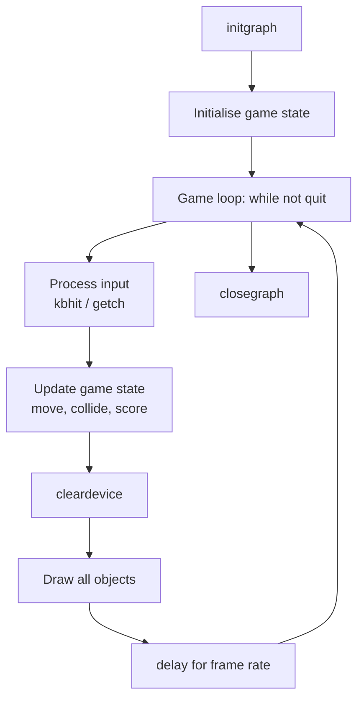

# Topic 11: C Graphics and Game Development

## Overview
C graphics in academic curricula — particularly in South Asian institutions — traditionally refers
to the **Borland Graphics Interface (BGI)** library, accessed via `graphics.h` with Turbo C++ or
the WinBGIm port for Dev-C++/MinGW. BGI provides simple functions for drawing shapes, setting
colours, and displaying text on a graphics window, making it accessible for introductory game
projects. This topic covers the BGI API for initialisation, drawing, colour, text, animation, and
a basic game loop, and notes modern cross-platform alternatives (SDL2, raylib) for context.

> **Environment note:** Code in this topic targets Dev-C++ 5.x + WinBGIm on Windows, or
> Turbo C++ 3.0. On Linux/modern systems, use SDL2 or raylib instead (linked in References).

---

## Definitions & Key Terms

1. **Graphics mode** — A screen mode in which the display is controlled pixel-by-pixel rather
   than as text characters; initiated with `initgraph()` in BGI.  
   *Plain English:* the mode where you draw pixels and shapes, not print text.

2. **`initgraph(gd, gm, path)`** — Initialises the BGI graphics system, setting the graphics
   driver (`gd`) and mode (`gm`). Typically called as:
   `initgraph(&gd, &gm, "C:\\TC\\BGI")` in Turbo C.  
   *Plain English:* opens the graphics window.

3. **`closegraph()`** — Closes the graphics window and returns to text mode.  
   *Plain English:* closes the graphics window.

4. **Pixel** — The smallest addressable element on the screen; position (0,0) is the top-left
   corner in BGI (y increases downward).  
   *Plain English:* one dot on the screen; coordinates (x, y) from top-left.

5. **`setcolor(color)`** — Sets the foreground drawing colour for subsequent drawing operations.  
   *Plain English:* choose the pen colour.

6. **`setbkcolor(color)`** — Sets the background colour of the graphics window.  
   *Plain English:* choose the background colour.

7. **`cleardevice()`** — Clears the graphics screen to the current background colour.  
   *Plain English:* erase everything on screen.

8. **`delay(ms)`** — Pauses execution for `ms` milliseconds (from `<dos.h>` / WinBGIm).  
   *Plain English:* wait for a number of milliseconds — used to control animation speed.

9. **Game loop** — A `while` loop that repeatedly: processes input, updates game state, draws
   the frame, and waits. The foundational structure of every game.  
   *Plain English:* the infinite loop that keeps the game running and redrawing the screen.

10. **Sprite** — A small image or shape representing a game object (player, enemy, bullet).  
    *Plain English:* a character or object drawn on screen.

---

## Core Results

### BGI Colour Constants

| Constant | Value | Colour |
|---|---|---|
| `BLACK` | 0 | Black |
| `BLUE` | 1 | Blue |
| `GREEN` | 2 | Green |
| `CYAN` | 3 | Cyan |
| `RED` | 4 | Red |
| `MAGENTA` | 5 | Magenta |
| `BROWN` | 6 | Brown |
| `LIGHTGRAY` | 7 | Light gray |
| `WHITE` | 15 | White |
| `YELLOW` | 14 | Yellow |

### Key Drawing Functions

| Function | What it draws |
|---|---|
| `putpixel(x, y, color)` | Single pixel |
| `line(x1, y1, x2, y2)` | Straight line |
| `circle(x, y, r)` | Circle outline |
| `rectangle(x1, y1, x2, y2)` | Rectangle outline |
| `ellipse(x, y, sa, ea, rx, ry)` | Ellipse arc |
| `bar(x1, y1, x2, y2)` | Filled rectangle |
| `floodfill(x, y, border_color)` | Flood-fill enclosed area |
| `outtextxy(x, y, str)` | Draw text string at (x,y) |
| `settextstyle(font, dir, size)` | Set text font and size |

### Basic Game Loop Structure



*Alt text: Flowchart of a BGI game loop: initgraph → init state → loop of input/update/clear/
draw/delay → closegraph.*

---

## Worked Examples

### Example 1 — Opening a Graphics Window and Drawing Shapes

```c
#include <graphics.h>
#include <stdio.h>

int main(void) {
    int gd = DETECT, gm;
    initgraph(&gd, &gm, "C:\\TC\\BGI");   /* Turbo C path; use "" for WinBGIm */

    /* Background */
    setbkcolor(BLACK);
    cleardevice();

    /* Draw shapes */
    setcolor(WHITE);
    rectangle(50, 50, 590, 430);          /* border */

    setcolor(YELLOW);
    circle(320, 240, 80);                  /* circle at centre */

    setcolor(RED);
    bar(200, 300, 440, 380);              /* filled rectangle */

    setcolor(CYAN);
    line(50, 240, 590, 240);              /* horizontal line */

    outtextxy(270, 20, "MDM-102 Graphics");

    getch();                               /* wait for key press */
    closegraph();
    return 0;
}
```

---

### Example 2 — Moving Ball Animation

**Task:** Animate a ball bouncing horizontally across the screen.

```c
#include <graphics.h>
#include <dos.h>     /* delay() — use winbgim.h equivalent for Dev-C++ */

int main(void) {
    int gd = DETECT, gm;
    initgraph(&gd, &gm, "");

    int x = 50, y = 240, r = 20, dx = 5;
    int width = getmaxx();

    while (!kbhit()) {              /* loop until a key is pressed */
        /* Erase old ball */
        setcolor(BLACK);
        setfillstyle(SOLID_FILL, BLACK);
        fillellipse(x, y, r, r);

        /* Update position */
        x += dx;
        if (x - r < 0 || x + r > width) dx = -dx;   /* bounce */

        /* Draw new ball */
        setcolor(YELLOW);
        setfillstyle(SOLID_FILL, YELLOW);
        fillellipse(x, y, r, r);

        delay(20);                  /* ~50 fps */
    }

    closegraph();
    return 0;
}
```

The erase-update-draw cycle (double-step erase) prevents ghosting. True double-buffering
requires advanced BGI extensions or a modern library.

---

### Example 3 — Simple Keyboard-Controlled Game (Catch the Dot)

**Task:** A player-controlled paddle catches a falling ball; score increments on catch.

```c
#include <graphics.h>
#include <conio.h>

#define WIDTH  640
#define HEIGHT 480
#define PADDLE_W 60
#define PADDLE_H 12
#define BALL_R   10

int main(void) {
    int gd = DETECT, gm;
    initgraph(&gd, &gm, "");

    int px = WIDTH/2, py = HEIGHT - 30;  /* paddle position */
    int bx = WIDTH/2, by = 30, bdy = 4; /* ball position & speed */
    int score = 0;
    char msg[32];

    while (1) {
        /* Input */
        if (kbhit()) {
            int key = getch();
            if (key == 75 && px - PADDLE_W/2 > 0)       px -= 20;  /* left arrow  */
            if (key == 77 && px + PADDLE_W/2 < WIDTH)    px += 20;  /* right arrow */
            if (key == 27) break;                                    /* Esc to quit */
        }

        /* Update */
        by += bdy;
        if (by - BALL_R < 0) bdy = 4;   /* bounce off top */

        /* Collision: ball hits paddle */
        if (by + BALL_R >= py && by + BALL_R <= py + PADDLE_H &&
            bx >= px - PADDLE_W/2 && bx <= px + PADDLE_W/2) {
            bdy = -4;
            score++;
        }

        /* Ball missed — reset */
        if (by - BALL_R > HEIGHT) {
            bx = WIDTH / 2; by = 30; bdy = 4;
        }

        /* Draw */
        cleardevice();

        setcolor(WHITE);
        sprintf(msg, "Score: %d", score);
        outtextxy(10, 10, msg);

        setcolor(GREEN);
        bar(px - PADDLE_W/2, py, px + PADDLE_W/2, py + PADDLE_H);

        setcolor(RED);
        setfillstyle(SOLID_FILL, RED);
        fillellipse(bx, by, BALL_R, BALL_R);

        delay(16);   /* ~60 fps */
    }

    closegraph();
    return 0;
}
```

---

## Applications

- **Academic projects:** BGI is widely used for introductory game projects (Tic-Tac-Toe,
  Snake, Breakout) and computer graphics demonstrations at undergraduate level.
- **Industrial HMI prototypes:** Simple BGI-style drawing code can be ported to embedded
  LCD controllers with minor API changes.
- **Modern game development (post-course):** Concepts here — game loop, sprite drawing,
  collision detection, state management — transfer directly to SDL2, raylib, and Unity/C#.

---

## Practice Problems

**P1.** Write a BGI program that draws the national flag of Bangladesh (green rectangle
with a red circle offset slightly left of centre).

<details>
<summary>Solution</summary>

```c
#include <graphics.h>
int main(void) {
    int gd = DETECT, gm;
    initgraph(&gd, &gm, "");

    setbkcolor(GREEN);
    cleardevice();

    /* Red disc slightly left of centre */
    setcolor(RED);
    setfillstyle(SOLID_FILL, RED);
    fillellipse(290, 240, 100, 100);

    getch();
    closegraph();
    return 0;
}
```
</details>

---

**P2.** Modify Example 2 (bouncing ball) so the ball also bounces off the top and bottom walls
and moves diagonally.

<details>
<summary>Solution</summary>

```c
#include <graphics.h>
#include <dos.h>
int main(void) {
    int gd = DETECT, gm;
    initgraph(&gd, &gm, "");
    int x=100, y=100, r=20, dx=4, dy=3;
    int W = getmaxx(), H = getmaxy();
    while (!kbhit()) {
        setcolor(BLACK); setfillstyle(SOLID_FILL, BLACK); fillellipse(x,y,r,r);
        x += dx; y += dy;
        if (x-r<0 || x+r>W) dx=-dx;
        if (y-r<0 || y+r>H) dy=-dy;
        setcolor(CYAN); setfillstyle(SOLID_FILL, CYAN); fillellipse(x,y,r,r);
        delay(16);
    }
    closegraph(); return 0;
}
```
</details>

---

**P3.** What are the key differences between `graphics.h` (BGI) and modern libraries like SDL2
or raylib? List at least three differences.

<details>
<summary>Solution</summary>

| Aspect | BGI (`graphics.h`) | SDL2 / raylib |
|---|---|---|
| Platform | Windows/DOS only (Turbo C / WinBGIm) | Cross-platform (Windows, Linux, macOS, Android, Web) |
| Performance | Software rendering; no hardware acceleration | Hardware-accelerated via GPU |
| Input | `kbhit()`/`getch()` (polling, limited) | Full event system (mouse, gamepad, touch) |
| Maintenance | Abandoned (Borland, ~1994) | Actively maintained open-source |
| Scope | Basic 2D shapes and text only | 2D/3D, audio, networking, image loading |

For production or modern coursework, raylib (<https://www.raylib.com/>) is the recommended
beginner-friendly alternative.
</details>

---

## References

1. **WinBGIm Documentation** (<https://winbgim.codecutter.org/>) — API reference and setup
   guide for using `graphics.h` with Dev-C++ on Windows.
2. **Turbo C++ 3.0 BGI Reference** — The original Borland documentation listing all graphics
   functions, constants, and error codes (included with the Turbo C++ IDE).
3. **cppreference — `<setjmp.h>`** — Background on structured program flow, relevant when
   handling BGI initialisation failures.
4. **raylib** (<https://www.raylib.com/>) — Modern, cross-platform C graphics library; a clean
   upgrade path from BGI with similar simplicity but full hardware acceleration and active
   maintenance.
5. **SDL2 Getting Started** (<https://wiki.libsdl.org/SDL2/FrontPage>) — Industry-standard
   cross-platform multimedia library used in commercial games; more powerful than BGI but with
   a steeper learning curve.
