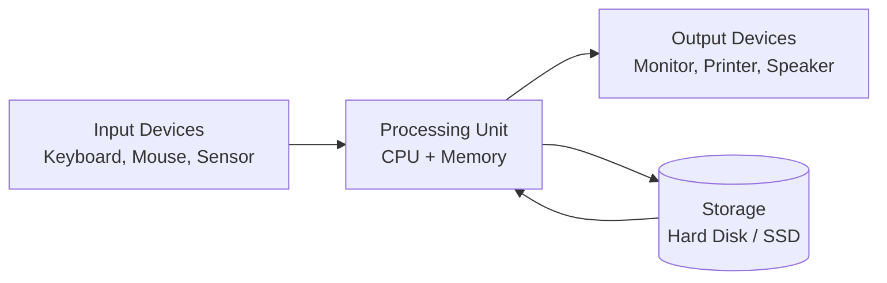
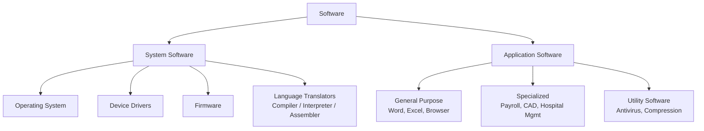
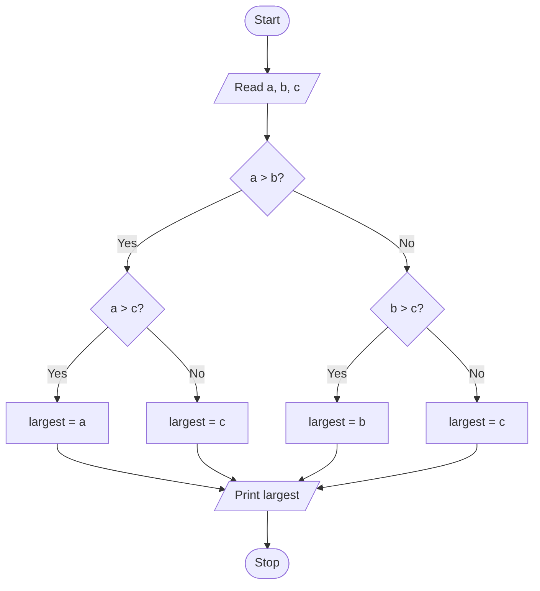
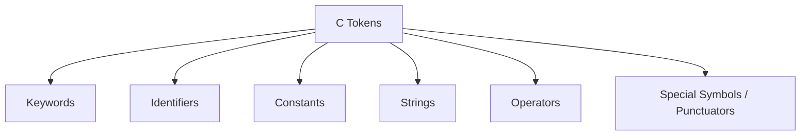
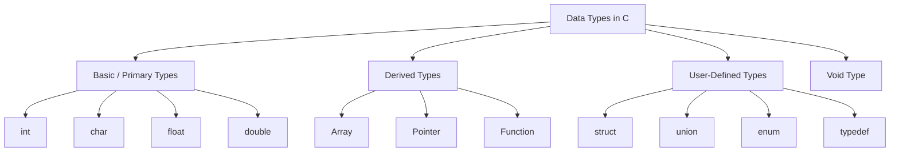

[c_programming_sug.md](https://github.com/user-attachments/files/30097456/c_programming_sug.md)
# Computer Fundamentals & C Programming — Complete Study Guide

> A university-level, exam-ready reference covering computer systems, software, algorithms, flowcharts, C tokens, data types, operators, and full revision material. Written for first-year C programming students, self-study, and GitHub publication.

---

## Introduction

This guide builds C programming from the absolute ground up: what a computer system is, how we describe solutions before writing code (algorithms, pseudocode, flowcharts), and then the smallest building blocks of the C language itself — tokens, identifiers, keywords, data types, constants, variables, and operators. Every topic includes a plain-language definition, a formal textbook definition, worked examples, diagrams, and comparison tables so it can be used for both written exams and viva-voce (oral exam) preparation.

Code examples target **modern ANSI C (C99/C11)** conventions unless a topic is explicitly historical (e.g., Turbo C on DOS), in which case that is noted. All code compiles under a standard C compiler such as GCC.

---

## Table of Contents

1. [Learning Objectives](#learning-objectives)
2. [Question 1 — Computer System & Software](#question-1--computer-system--software)
3. [Question 2 — Algorithm & Pseudocode](#question-2--algorithm--pseudocode)
4. [Question 3 — Largest of Three Numbers](#question-3--largest-of-three-numbers)
5. [Question 4 — C Tokens & Identifiers](#question-4--c-tokens--identifiers)
6. [Question 5 — Keywords, Data Types, Constants & Variables](#question-5--keywords-data-types-constants--variables)
7. [Question 6 — Operators](#question-6--operators)
8. [Additional Questions — Types](#additional-questions--types)
9. [Revision Notes](#revision-notes)
10. [C Keywords Table](#c-keywords-table)
11. [Data Types Cheat Sheet](#data-types-cheat-sheet)
12. [Format Specifiers](#format-specifiers)
13. [ASCII Conversion Table](#ascii-conversion-table)
14. [Escape Sequences](#escape-sequences)
15. [Operator Precedence Table](#operator-precedence-table)
16. [Identifier Rules Cheat Sheet](#identifier-rules-cheat-sheet)
17. [Variable Naming Guide](#variable-naming-guide)
18. [Constants Cheat Sheet](#constants-cheat-sheet)
19. [Algorithm Writing Template](#algorithm-writing-template)
20. [Pseudocode Template](#pseudocode-template)
21. [Flowchart Symbols](#flowchart-symbols)
22. [Common Exam Mistakes](#common-exam-mistakes)
23. [Viva Questions](#viva-questions)
24. [Memory Tricks](#memory-tricks)
25. [Quick Revision Sheet](#quick-revision-sheet)
26. [Glossary](#glossary)
27. [Common Mistakes (Programming)](#common-mistakes-programming)
28. [Exam Tips](#exam-tips)
29. [Summary](#summary)
30. [References](#references)

---

## Learning Objectives

By the end of this chapter, a student should be able to:

- Define a computer system and explain the role of hardware and software.
- Classify software into system software and application software with examples.
- Define an algorithm and pseudocode, and list the properties of a good algorithm.
- Write an algorithm and draw a flowchart (both Mermaid and ASCII) to find the largest of three numbers.
- Identify and classify C tokens, and correctly form valid identifiers.
- List C keywords and explain the basic data types, constants, and variables.
- Explain operators in C, including logical operators, increment/decrement operators, and the ternary operator.
- Classify data types and explain the differences between them.

---

## Question 1 — Computer System & Software

### 1a. What is a computer system?

#### Definition
A computer system is an electronic device, along with its supporting hardware and software, that accepts data as input, processes it according to a set of instructions, and produces meaningful output.

#### Technical Definition
A computer system is an integrated combination of **hardware** (physical components), **software** (programs and instructions), and **data**, organized around the fundamental **Input–Process–Output (IPO)** model, capable of accepting input, storing data and instructions, executing instructions to process the data, and producing and communicating results.

#### Explanation
A computer by itself — the metal, plastic, and silicon — cannot do anything useful. It becomes a *system* only when hardware (CPU, memory, input/output devices, storage) works together with software (operating system, applications) under a common purpose: taking raw data, transforming it, and producing information. This is why computer systems are usually described using the **IPO cycle**:

- **Input** — data or instructions are fed into the system (keyboard, mouse, sensor, file).
- **Process** — the CPU executes instructions on the data (calculations, comparisons, logic).
- **Output** — processed data (information) is presented to the user (screen, printer, file, speaker).

Modern descriptions extend this to **IPOS**: Input → Process → Output → **Storage**, since most systems also save data for later use.

#### Key Points
- A computer system = Hardware + Software + Data + (often) People/Procedures.
- Works on the Input–Process–Output–Storage (IPOS) cycle.
- Hardware without software is inert; software cannot run without hardware.
- Can be general-purpose (PCs, laptops) or special-purpose (ATMs, embedded controllers).

#### Real-life Example
A calculator app on a laptop is a computer system in miniature: you **input** two numbers and an operator (via keyboard), the CPU **processes** the arithmetic, and the **output** (result) is displayed on the screen. An ATM machine is a larger real-world example: it takes your card and PIN as input, processes the transaction against your bank account, and outputs cash and a receipt.

#### Diagram



```text
+----------------+       +------------------+       +-----------------+
|  INPUT DEVICES | ----> |   PROCESSING     | ----> |  OUTPUT DEVICES |
| Keyboard/Mouse |       |  CPU + Memory     |       | Monitor/Printer |
+----------------+       +------------------+       +-----------------+
                                 |    ^
                                 v    |
                          +----------------+
                          |    STORAGE      |
                          | Hard Disk / SSD |
                          +----------------+
```

---

### 1b. What is software?

#### Definition
Software is a collection of instructions, programs, and data that tells computer hardware what to do and how to do it.

#### Technical Definition
Software is a set of instructions, procedures, and associated documentation, expressed in a programming or machine-readable language, that when executed by a computer's hardware, provides the required functions, features, and performance as designed.

#### Explanation
Hardware is the physical, tangible part of a computer — you can touch a CPU or a hard disk. Software is intangible; it is *logic* stored as bits, but it is what actually directs the hardware to perform useful work. Without software, hardware is just electronic circuitry with no purpose. Software is typically written by programmers in a high-level language (like C), then translated (compiled or interpreted) into machine code that the CPU can execute directly.

#### Key Points
- Software is intangible (cannot be physically touched, unlike hardware).
- Software controls and coordinates hardware to perform tasks.
- Broadly divided into **System Software** and **Application Software**.
- Stored on storage devices (disks, SSDs) and loaded into RAM for execution.

#### Real-life Example
Microsoft Word (application software) lets you type and format a letter, while behind the scenes Windows or Linux (system software) manages memory, files, and hardware access so Word can run at all.

---

### 1c. Classify software.

#### Definition
Software is broadly classified into two main categories: **System Software** and **Application Software**, with some classifications adding a third category, **Programming/Utility Software**.

#### Technical Definition
Software classification is a taxonomy that groups programs by their primary function and relationship to hardware: software that manages and controls hardware resources for other programs (**system software**), and software that performs specific tasks directly for end users (**application software**).

#### Explanation

**1. System Software**
Manages and controls the computer's hardware so that application software can run. It acts as an interface between hardware and the user/application.

- **Operating System (OS)** — e.g., Windows, Linux, macOS, Android. Manages memory, processes, files, and devices.
- **Device Drivers** — software that lets the OS communicate with specific hardware (printer driver, graphics driver).
- **Firmware** — low-level software embedded in hardware (BIOS/UEFI).
- **Language Translators** — Compilers, Interpreters, Assemblers that convert source code into machine code.

**2. Application Software**
Designed to help the user perform specific tasks; it runs *on top of* system software.

- **General-purpose applications** — Word processors, spreadsheets, web browsers.
- **Specialized applications** — Payroll systems, hospital management systems, CAD software.
- **Utility software** (sometimes classified separately) — Antivirus, disk cleanup, file compression tools that maintain and optimize the system.

#### Key Points
- System software runs the computer; application software runs *on* the computer for the user.
- Compilers/interpreters (system software) are essential for turning C source code into an executable program.
- Utility software is sometimes treated as a sub-category of system software, sometimes as its own category.

#### Real-life Example
When you write a C program and compile it with GCC, GCC (a language translator, i.e., system software) converts your `.c` file into an executable, which Windows/Linux (the OS, system software) then loads and runs. If your final program is, say, a student result-management program, that program itself is **application software**.

#### Diagram



```text
                         +-------------+
                         |   Software  |
                         +-------------+
                          /            \
                +----------------+  +----------------------+
                | System Software|  | Application Software  |
                +----------------+  +----------------------+
                 |   |    |    |         |         |
                 OS  DD   FW   LT       GP        SP / Utility
```

---

## Question 2 — Algorithm & Pseudocode

### 2a. What is an algorithm?

#### Definition
An algorithm is a finite, step-by-step set of instructions written to solve a specific problem.

#### Technical Definition
An algorithm is a well-defined, finite sequence of unambiguous, computationally realizable steps that takes a set of input values and produces a set of output values, terminating in a finite amount of time, used to solve a specific class of problems.

#### Explanation
Before writing any code, a programmer needs a plan — a logical sequence of steps to reach the solution. That plan is the algorithm. It is language-independent: the same algorithm to find the largest of three numbers could be implemented in C, Python, or Java without changing its logic. Algorithms are typically expressed using **plain language, pseudocode, or flowcharts** before being translated into actual program code.

#### Key Points
- Independent of any particular programming language.
- Must be finite (must terminate) and unambiguous.
- Forms the blueprint for writing a program.
- Can be analyzed for efficiency using time and space complexity.

#### Real-life Example
A cooking recipe is a real-life algorithm: "1. Boil water. 2. Add rice. 3. Cook for 15 minutes. 4. Drain and serve." Each step is precise, ordered, and leads to a definite outcome (cooked rice).

---

### 2b. What is pseudocode?

#### Definition
Pseudocode is a plain-language, informal way of writing an algorithm using programming-like structure, without following the strict syntax of any real programming language.

#### Technical Definition
Pseudocode is a high-level, artificial, and informal notation independent of any specific programming language, used to represent the logic of an algorithm using structured English combined with programming constructs (such as `IF`, `ELSE`, `WHILE`, `FOR`) for the purpose of human readability and design communication.

#### Explanation
Pseudocode sits between an algorithm written in plain English and actual source code. It uses control-structure keywords (`IF/ELSE`, `WHILE`, `FOR`) to show logic flow clearly, but ignores strict syntax rules like semicolons or data type declarations, making it easy to read for anyone regardless of which language they know.

#### Key Points
- Not compilable — it is only a design/planning tool.
- Uses structured keywords: `START`, `END`, `IF`, `ELSE`, `WHILE`, `FOR`, `READ`, `PRINT`.
- Bridges the gap between an algorithm (idea) and source code (implementation).
- Helps catch logical errors before actual coding begins.

#### Real-life Example

```text
START
  READ a, b, c
  IF a > b AND a > c THEN
     PRINT "a is the largest"
  ELSE IF b > c THEN
     PRINT "b is the largest"
  ELSE
     PRINT "c is the largest"
  END IF
END
```

---

### 2c. Describe the properties of an algorithm.

#### Definition
An algorithm must satisfy certain properties to be considered valid and useful: finiteness, definiteness, input, output, and effectiveness.

#### Technical Definition
The classical properties of an algorithm, as formalized by Donald Knuth, are: **Finiteness**, **Definiteness**, **Input**, **Output**, and **Effectiveness** (feasibility).

#### Explanation

| Property | Meaning |
|----------|---------|
| **Finiteness** | The algorithm must terminate after a finite number of steps; it cannot run forever. |
| **Definiteness** | Every step must be precisely and unambiguously defined — no room for interpretation. |
| **Input** | An algorithm has zero or more well-defined inputs, supplied before or during execution. |
| **Output** | An algorithm produces one or more well-defined outputs, related to the desired result. |
| **Effectiveness (Feasibility)** | Every step must be basic enough to be carried out, in principle, by a person using pencil and paper in finite time — i.e., it must be practically executable. |

Additional desirable qualities often mentioned in exams: **Correctness** (produces the right output for all valid inputs) and **Efficiency** (uses reasonable time and memory).

#### Key Points
- Remember using the mnemonic **"FIDOE"** — Finiteness, Input, Definiteness, Output, Effectiveness.
- Finiteness ≠ short; it just means it must eventually stop.
- Effectiveness means each operation must be simple/basic enough to actually perform.

#### Real-life Example
A washing machine's wash cycle is finite (it stops after a set time), definite (each step — fill, wash, rinse, spin — is precisely timed), takes input (dirty clothes, water, detergent), produces output (clean clothes), and is effective (each step is physically achievable by the machine).

---

## Question 3 — Largest of Three Numbers

### Algorithm

**Algorithm Name:** `FindLargestOfThree`

**Objective:** To determine and display the largest among three given numbers.

**Input:** Three numbers `a`, `b`, `c`.

**Output:** The largest of the three numbers.

**Step-by-step algorithm:**

```text
Step 1: Start
Step 2: Read three numbers a, b, and c
Step 3: If a > b then
            If a > c then
                largest = a
            Else
                largest = c
        Else
            If b > c then
                largest = b
            Else
                largest = c
Step 4: Print largest
Step 5: Stop
```

**Time Complexity:** O(1) — a fixed number of comparisons (at most 2) regardless of input size, so it runs in constant time.

**Example execution:**

Input: `a = 12`, `b = 45`, `c = 7`

1. Is `a > b`? → `12 > 45` → False.
2. Is `b > c`? → `45 > 7` → True → `largest = b = 45`.
3. Output: **45**

### Flowchart



```text
                     +-----------+
                     |   Start   |
                     +-----------+
                           |
                           v
                   +----------------+
                   | Read a, b, c    |
                   +----------------+
                           |
                           v
                     +-----------+
                     | a > b ?   |
                     +-----------+
                     Yes /    \ No
                        v      v
               +-----------+ +-----------+
               | a > c ?   | | b > c ?   |
               +-----------+ +-----------+
               Yes/  \No     Yes/  \No
                 v     v       v     v
           +--------+ +------+ +--------+ +------+
           |largest=a| |large=c| |largest=b| |large=c|
           +--------+ +------+ +--------+ +------+
                 \      |         |       /
                  \     |         |      /
                   v    v         v     v
                  +---------------------+
                  |   Print largest      |
                  +---------------------+
                           |
                           v
                     +-----------+
                     |   Stop    |
                     +-----------+
```

### C Implementation

```c
#include <stdio.h>

int main(void) {
    int a, b, c, largest;

    printf("Enter three numbers: ");
    scanf("%d %d %d", &a, &b, &c);

    if (a > b) {
        if (a > c) {
            largest = a;
        } else {
            largest = c;
        }
    } else {
        if (b > c) {
            largest = b;
        } else {
            largest = c;
        }
    }

    printf("The largest number is: %d\n", largest);

    return 0;
}
```

**Line-by-line explanation:**
- `#include <stdio.h>` — includes the Standard Input/Output header, needed for `printf` and `scanf`.
- `int main(void)` — the program's entry point; execution always starts here.
- `int a, b, c, largest;` — declares four integer variables.
- `printf("Enter three numbers: ");` — displays a prompt to the user.
- `scanf("%d %d %d", &a, &b, &c);` — reads three integers from the keyboard into `a`, `b`, `c` (the `&` gives the *address* of each variable so `scanf` can store values there).
- The nested `if...else` block compares the numbers exactly as in the algorithm above.
- `printf("The largest number is: %d\n", largest);` — prints the result; `%d` is the format specifier for an `int`.
- `return 0;` — tells the operating system the program finished successfully.

> **Note:** This can also be written more concisely using nested ternary operators: `largest = (a > b) ? ((a > c) ? a : c) : ((b > c) ? b : c);` — see [Question 6](#question-6--operators) for the ternary operator.

---

## Question 4 — C Tokens & Identifiers

### 4a. What are C tokens?

#### Definition
A token is the smallest individual unit in a C program that the compiler can recognize and understand.

#### Technical Definition
A token is the smallest lexical element of a C program — an atomic unit of the language's grammar identified by the lexical analyzer (scanner) phase of the compiler, which cannot be broken down further while still retaining meaning.

#### Explanation
When a C compiler processes source code, its first step (**lexical analysis**) breaks the raw text into tokens, much like a sentence is broken into words. Every C program, no matter how complex, is ultimately just a sequence of tokens arranged according to the language's grammar (syntax).

#### Key Points — Types of C Tokens

| Token Type | Description | Example |
|------------|-------------|---------|
| **Keywords** | Reserved words with predefined meaning | `int`, `if`, `while`, `return` |
| **Identifiers** | Names given to variables, functions, arrays, etc. | `total`, `sum1`, `calcArea` |
| **Constants** | Fixed values that do not change during execution | `10`, `3.14`, `'A'`, `"Hi"` |
| **Strings** | Sequence of characters enclosed in double quotes | `"Hello, World!"` |
| **Operators** | Symbols that perform operations on operands | `+`, `-`, `*`, `=`, `&&` |
| **Special Symbols / Punctuators** | Symbols with special syntactic meaning | `{ }`, `( )`, `;`, `,`, `[ ]` |

#### Real-life Example
Consider the statement: `int age = 20;`
This line is broken into 5 tokens by the compiler:
`int` (keyword) → `age` (identifier) → `=` (operator) → `20` (constant) → `;` (punctuator).

#### Diagram



---

### 4b. What are identifiers?

#### Definition
An identifier is a name given by the programmer to a variable, function, array, or any other user-defined item in a C program.

#### Technical Definition
An identifier is a sequence of characters — letters, digits, and underscores, beginning with a letter or underscore — used within a C program to uniquely name a variable, function, label, or other user-defined entity, distinct from the language's reserved keywords.

#### Explanation
Identifiers are how programmers refer to the data and functions they create. Good identifier names make code self-explanatory (`totalMarks` is clearer than `x`), while poor names make debugging and maintenance harder.

#### Key Points
- Case-sensitive: `Sum`, `sum`, and `SUM` are three different identifiers.
- Cannot be a reserved keyword (`int`, `for`, `return`, etc.).
- No length limit in the standard, though older compilers may limit significant characters (traditionally 31 for internal identifiers in C99).

---

### 4c. Mention the rules for identifiers.

#### Rules

1. Must begin with a **letter (A–Z, a–z)** or an **underscore (`_`)** — never with a digit.
2. Can be followed by any combination of **letters, digits (0–9), and underscores**.
3. **No special characters** allowed (`@`, `#`, `%`, `-`, space, etc.).
4. Cannot be a **C keyword** (e.g., `int`, `float`, `return`).
5. **Case-sensitive** — `Value` and `value` are different identifiers.
6. **No spaces** are allowed within an identifier.
7. Identifiers should ideally be **meaningful** (best practice, not a compiler rule).

#### Valid vs Invalid Examples

| Identifier | Valid? | Reason |
|------------|--------|--------|
| `total` | ✅ Valid | Starts with a letter |
| `_count` | ✅ Valid | Starts with underscore |
| `sum1` | ✅ Valid | Letter followed by digit |
| `Marks_2024` | ✅ Valid | Letters, digits, underscore |
| `2ndValue` | ❌ Invalid | Begins with a digit |
| `total-marks` | ❌ Invalid | Contains a hyphen (not allowed) |
| `float` | ❌ Invalid | Reserved keyword |
| `my value` | ❌ Invalid | Contains a space |
| `@grade` | ❌ Invalid | Contains special character `@` |

---

## Question 5 — Keywords, Data Types, Constants & Variables

### 5a. What is a keyword?

#### Definition
A keyword is a word that has a special, predefined meaning in the C language and is reserved by the compiler for a specific purpose.

#### Technical Definition
A keyword (reserved word) is a token whose meaning is fixed by the C language specification, cannot be redefined or used as an identifier by the programmer, and instructs the compiler to perform a predefined action or interpretation.

#### Explanation
C (ANSI C89/C90) defines **32 standard keywords**. Later standards (C99, C11) added more (e.g., `inline`, `restrict`, `_Bool`, `_Complex`). Keywords are always written in lowercase and cannot be used as variable, function, or any other identifier name.

#### Key Points
- All 32 classic C keywords are lowercase.
- Keywords are part of the C compiler's grammar — cannot be redefined.
- See the full [C Keywords Table](#c-keywords-table) in the revision section.

---

### 5b. What are data types?

#### Definition
A data type specifies what kind of value a variable can hold and how much memory it occupies.

#### Technical Definition
A data type is a classification that specifies the range of values, the internal representation, and the set of operations applicable to a variable or expression, and determines the amount of memory allocated to store it.

#### Explanation
The compiler needs to know, in advance, what kind of data a variable will hold (a whole number, a decimal number, a single character) so it can allocate the correct amount of memory and interpret the stored bits correctly.

---

### 5c. Describe the basic data types.

C has four fundamental (basic) data types:

| Data Type | Description | Typical Size (64-bit systems) | Format Specifier |
|-----------|-------------|-------------------------------|-------------------|
| `int` | Stores whole numbers (integers) | 4 bytes | `%d` |
| `char` | Stores a single character | 1 byte | `%c` |
| `float` | Stores single-precision decimal numbers | 4 bytes | `%f` |
| `double` | Stores double-precision decimal numbers | 8 bytes | `%lf` |

> Sizes are **implementation-defined** (they can vary by compiler/platform). The values above are the common modern (GCC, 64-bit) values. See the full [Data Types Cheat Sheet](#data-types-cheat-sheet) for ranges and qualifiers (`short`, `long`, `unsigned`, etc.).

#### Key Points
- `int`, `char`, `float`, `double` are the four fundamental types.
- Modifiers (`short`, `long`, `signed`, `unsigned`) can be applied to `int` and `char`/`double`.
- `void` represents the *absence* of a type (used for functions returning nothing, or generic pointers).

---

### 5d. What are constants and variables?

#### Definition
- A **constant** is a value that does not change during the execution of a program.
- A **variable** is a named memory location whose value *can* change during program execution.

#### Technical Definition
- A **constant** is a literal or symbolically named quantity in a program whose value is fixed at compile-time and remains immutable throughout program execution.
- A **variable** is a named, typed storage location in memory whose contents may be read and modified during the execution of a program.

#### Explanation
Think of a variable as a labeled box that can hold different values over time, while a constant is a sealed box — once set, its value never changes. In C, `int age = 20;` makes `age` a variable (you could later write `age = 21;`), while `const int MAX = 100;` makes `MAX` a constant.

#### Real-life Example
In a program calculating the area of a circle, `PI = 3.14159` is a constant (its value never changes), while `radius` is a variable (the user can input a different radius each time the program runs).

---

### 5e. Describe the ways of defining constants in C.

There are **two primary ways** to define constants in C:

**1. Using the `#define` preprocessor directive**

```c
#define PI 3.14159
#define MAX_STUDENTS 60
```
- Handled by the **preprocessor** before compilation (simple text substitution).
- No data type and no semicolon.
- Cannot be changed anywhere in the program.

**2. Using the `const` keyword**

```c
const float PI = 3.14159;
const int MAX_STUDENTS = 60;
```
- Handled by the **compiler**, not the preprocessor.
- Has a proper data type and follows normal variable declaration syntax (ends with `;`).
- The compiler enforces that its value cannot be modified after initialization.

**Other ways constants appear in C:**

- **Literal constants** — values written directly in code: `10`, `3.14`, `'A'`, `"Hello"`.
- **Enumerated constants (`enum`)** — a way to define a set of named integer constants:
```c
enum Weekday { SUNDAY, MONDAY, TUESDAY, WEDNESDAY, THURSDAY, FRIDAY, SATURDAY };
```

See the full [Constants Cheat Sheet](#constants-cheat-sheet) for a side-by-side comparison.

---

## Question 6 — Operators

### 6a. What is an operator?

#### Definition
An operator is a symbol that tells the compiler to perform a specific mathematical, logical, or relational operation on one or more values (operands).

#### Technical Definition
An operator is a lexical token that denotes an operation to be performed on one, two, or three operands, producing a resultant value, and is classified by the number of operands it takes (unary, binary, ternary) and by its function (arithmetic, relational, logical, bitwise, assignment, etc.).

#### Explanation
Operators are the "verbs" of a programming language — they act on data (operands) to produce results. For example, in `a + b`, `+` is the operator and `a`, `b` are the operands.

#### Key Points — Categories of C Operators

| Category | Examples | Purpose |
|----------|----------|---------|
| Arithmetic | `+  -  *  /  %` | Mathematical calculations |
| Relational | `==  !=  >  <  >=  <=` | Compare two values |
| Logical | `&&  \|\|  !` | Combine/invert boolean conditions |
| Assignment | `=  +=  -=  *=  /=  %=` | Assign/update values |
| Increment/Decrement | `++  --` | Increase/decrease a value by 1 |
| Bitwise | `&  \|  ^  ~  <<  >>` | Operate on individual bits |
| Conditional (Ternary) | `?:` | Shorthand for if-else |
| Special | `sizeof, &, *, comma (,)` | Size, address, pointer, sequencing |

---

### 6b. Explain logical operators.

#### Definition
Logical operators are used to combine or invert two or more relational/boolean expressions, returning a single true (1) or false (0) result.

#### Technical Definition
Logical operators in C — `&&` (logical AND), `||` (logical OR), and `!` (logical NOT) — operate on boolean-valued expressions (any nonzero value is treated as true, and zero as false), applying short-circuit evaluation for the binary operators and returning `1` for true or `0` for false.

#### Explanation & Truth Tables

**Logical AND (`&&`)** — true only if *both* operands are true.

| A | B | A && B |
|---|---|--------|
| 0 | 0 | 0 |
| 0 | 1 | 0 |
| 1 | 0 | 0 |
| 1 | 1 | 1 |

**Logical OR (`||`)** — true if *at least one* operand is true.

| A | B | A \|\| B |
|---|---|----------|
| 0 | 0 | 0 |
| 0 | 1 | 1 |
| 1 | 0 | 1 |
| 1 | 1 | 1 |

**Logical NOT (`!`)** — inverts the operand's boolean value.

| A | !A |
|---|----|
| 0 | 1 |
| 1 | 0 |

> **Short-circuit evaluation:** In `A && B`, if `A` is false, `B` is *never evaluated* (the result is already false). In `A || B`, if `A` is true, `B` is never evaluated. This matters when the second operand has side effects (like a function call).

#### Key Points
- Result of a logical expression is always `0` or `1` (type `int`).
- Any nonzero value is treated as "true"; only `0` is "false".
- Commonly used in `if`, `while`, and `for` conditions.

#### Example

```c
#include <stdio.h>

int main(void) {
    int age = 20;
    int hasID = 1; // 1 = true, 0 = false

    if (age >= 18 && hasID) {
        printf("Entry allowed.\n");
    } else {
        printf("Entry denied.\n");
    }

    return 0;
}
```
**Output:** `Entry allowed.`
**Explanation:** Since `age >= 18` is true (`1`) and `hasID` is true (`1`), `age >= 18 && hasID` evaluates to `1`, so the `if` branch executes.

---

### 6c. Difference between `++i` and `i++`.

#### Definition
`++i` (pre-increment) increases the value of `i` **before** it is used in the expression; `i++` (post-increment) uses the **current** value of `i` in the expression first, and increases it **afterward**.

#### Comparison Table

| Feature | `++i` (Pre-increment) | `i++` (Post-increment) |
|---------|------------------------|--------------------------|
| Returns | The **updated** (new) value of `i` | The **original** (old) value of `i` |
| Increment | Happens **before** the value is used in the expression | Happens **after** the value is used in the expression |
| Use Case | When you need the incremented value immediately in the same expression | When you need to use the old value first, and increment for the *next* use |
| Example (`i = 5`) | `x = ++i;` → `x = 6, i = 6` | `x = i++;` → `x = 5, i = 6` |

#### Explanation

```c
#include <stdio.h>

int main(void) {
    int i = 5, x;

    x = ++i;               // Pre-increment: i becomes 6 first, then x = 6
    printf("Pre:  i = %d, x = %d\n", i, x);

    i = 5;                  // reset
    x = i++;                // Post-increment: x = 5 (old value), then i becomes 6
    printf("Post: i = %d, x = %d\n", i, x);

    return 0;
}
```

**Output:**
```
Pre:  i = 6, x = 6
Post: i = 6, x = 5
```

**Explanation:** In the pre-increment case, `i` is incremented *first* to `6`, and that new value `6` is assigned to `x`. In the post-increment case, the *original* value of `i` (`5`) is assigned to `x` first, and only afterward is `i` incremented to `6`. In both cases, `i` ends up as `6` — the only difference is what gets assigned to `x`.

> **Important:** When used alone as a statement (`i++;` or `++i;` with no assignment), both have the *exact same effect* — they simply increase `i` by 1. The difference only matters when the result is used in a larger expression.

---

### 6d. Explain the conditional (ternary) operator.

#### Definition
The conditional (ternary) operator `?:` is a shorthand way of writing a simple `if-else` statement in a single expression.

#### Technical Definition
The conditional operator is C's only **ternary** operator (it takes three operands), with the syntax `condition ? expression_if_true : expression_if_false`, which evaluates `condition`; if nonzero (true), the result of the entire expression is `expression_if_true`, otherwise it is `expression_if_false`. Only one of the two expressions is ever evaluated.

#### Syntax

```c
result = (condition) ? value_if_true : value_if_false;
```

#### Explanation
The ternary operator is useful for short, simple conditional assignments, replacing a 4–6 line `if-else` block with a single line. It should be avoided for complex logic, as nesting too many ternary operators reduces readability.

#### Example — Easy

```c
int a = 10, b = 20, max;
max = (a > b) ? a : b;
printf("Max = %d\n", max);   // Output: Max = 20
```

#### Example — Intermediate (Odd/Even check)

```c
int n = 7;
printf("%d is %s\n", n, (n % 2 == 0) ? "Even" : "Odd");
// Output: 7 is Odd
```

#### Example — Practical (Largest of three, using nested ternary)

```c
#include <stdio.h>

int main(void) {
    int a = 12, b = 45, c = 7, largest;

    largest = (a > b) ? ((a > c) ? a : c) : ((b > c) ? b : c);

    printf("The largest number is: %d\n", largest);   // Output: 45
    return 0;
}
```
**Explanation:** The outer ternary checks `a > b`. If true, it nests another ternary comparing `a` and `c`. If false, it nests a ternary comparing `b` and `c`. This is functionally identical to the nested `if-else` from Question 3, just written more compactly.

> **Exam Tip:** The ternary operator is an **expression**, not a statement — it always produces a value, which is why it can be used directly inside `printf()` or an assignment.

---

## Additional Questions — Types

### What is a type?

#### Definition
A type defines the nature of a value: what kind of data it represents, how it is stored in memory, and what operations can be validly performed on it.

#### Technical Definition
A type is a classification, enforced by the language and compiler, that determines the set of possible values a variable or expression can take, its internal binary representation and memory footprint, and the operations that are semantically valid on it.

---

### Classify types.

In C, types are broadly classified as follows:



| Category | Examples | Description |
|----------|----------|--------------|
| **Basic (Primary/Fundamental) Types** | `int`, `char`, `float`, `double` | Built directly into the language |
| **Derived Types** | Arrays, Pointers, Functions | Built *from* basic types |
| **User-Defined Types** | `struct`, `union`, `enum`, `typedef` | Created by the programmer to group/rename types |
| **Void Type** | `void` | Represents "no type" / absence of a value |

---

### Difference between different data types.

| Data Type | Category | Size (typical) | Holds | Example |
|-----------|----------|------------------|-------|---------|
| `int` | Basic | 4 bytes | Whole numbers | `int a = 10;` |
| `char` | Basic | 1 byte | Single character | `char g = 'A';` |
| `float` | Basic | 4 bytes | Decimal (single precision) | `float pi = 3.14f;` |
| `double` | Basic | 8 bytes | Decimal (double precision) | `double d = 3.14159265;` |
| Array | Derived | size of type × count | Collection of same-type elements | `int marks[5];` |
| Pointer | Derived | 8 bytes (64-bit) | Memory address of another variable | `int *p = &a;` |
| `struct` | User-defined | sum of members (+padding) | Group of different data types | `struct Student { char name[20]; int roll; };` |
| `enum` | User-defined | 4 bytes (usually, like `int`) | Named integer constants | `enum Day { MON, TUE };` |

**Key differences to remember for exams:**
- `int` vs `float`: `int` has **no fractional part**; `float` can store decimals but with limited precision.
- `float` vs `double`: `double` has roughly **double the precision** (more significant digits) and typically twice the memory (8 bytes vs 4 bytes).
- `char` vs `int`: `char` is technically stored as a small integer (its ASCII code) but is *displayed* as a character with `%c`.
- Basic types hold a single value; derived/user-defined types can hold multiple values or references to other values.

---

## Revision Notes

- Every C program's execution begins at `main()`.
- The four pillars of Question 1–6 form the **absolute foundation** of C: know *what a computer/software is* → *how to plan a solution (algorithm/pseudocode/flowchart)* → *how C represents data (tokens, identifiers, types)* → *how C acts on data (operators)*.
- Compilation pipeline: **Preprocessing → Compilation → Assembly → Linking** → executable.
- Remember: `#define` constants are substituted by the **preprocessor**; `const` variables are enforced by the **compiler**.
- Pre/post increment only differ when their **result is used** in an expression.
- The ternary operator `?:` is the only operator in C that takes **three** operands.

---

## C Keywords Table

All 32 standard ANSI C (C89/C90) keywords:

| Keyword | Description |
|---------|--------------|
| `auto` | Declares a variable with automatic (local) storage duration (default for local variables) |
| `break` | Exits the nearest enclosing loop or `switch` statement |
| `case` | Defines a branch label inside a `switch` statement |
| `char` | Declares a character data type |
| `const` | Declares a variable as read-only/unmodifiable |
| `continue` | Skips to the next iteration of the nearest enclosing loop |
| `default` | Defines the default branch of a `switch` statement |
| `do` | Begins a `do-while` post-tested loop |
| `double` | Declares a double-precision floating-point data type |
| `else` | Defines the alternate branch of an `if` statement |
| `enum` | Declares an enumerated (named integer constant) type |
| `extern` | Declares a variable/function defined in another file/scope |
| `float` | Declares a single-precision floating-point data type |
| `for` | Begins a `for` counting loop |
| `goto` | Transfers control unconditionally to a labeled statement |
| `if` | Begins a conditional branch |
| `int` | Declares an integer data type |
| `long` | Modifier for extended-range integer/double types |
| `register` | Suggests storing a variable in a CPU register for faster access |
| `return` | Returns a value (and control) from a function |
| `short` | Modifier for reduced-range integer types |
| `signed` | Specifies that a type can hold negative and positive values (default for `int`) |
| `sizeof` | Compile-time operator returning the size (in bytes) of a type or variable |
| `static` | Preserves a variable's value between function calls / restricts linkage to a file |
| `struct` | Declares a user-defined structure (grouping of variables) |
| `switch` | Begins a multi-way branch statement |
| `typedef` | Creates an alias (new name) for an existing type |
| `union` | Declares a user-defined type where all members share the same memory |
| `unsigned` | Specifies that a type can hold only non-negative values |
| `void` | Represents "no type"/absence of value; also used for generic pointers |
| `volatile` | Tells the compiler a variable may change unexpectedly (e.g., hardware register) |
| `while` | Begins a pre-tested loop |

> **C99/C11 additions** (often asked as bonus/viva questions): `inline`, `restrict`, `_Bool`, `_Complex`, `_Imaginary` (C99); `_Alignas`, `_Alignof`, `_Atomic`, `_Generic`, `_Noreturn`, `_Static_assert`, `_Thread_local` (C11).

---

## Data Types Cheat Sheet

> Sizes/ranges are the common values on a modern 64-bit GCC/Linux system. The C Standard only guarantees **minimum ranges** — exact sizes are implementation-defined and can vary by compiler/platform (this is especially true for Turbo C on old 16-bit DOS systems, where `int` was 2 bytes).

| Type | Typical Size | Typical Range | Format Specifier | Notes |
|------|--------------|-----------------|--------------------|-------|
| `char` | 1 byte | -128 to 127 (signed) / 0 to 255 (unsigned) | `%c` | Stores a single character (via ASCII code) |
| `unsigned char` | 1 byte | 0 to 255 | `%c` | Only non-negative |
| `short int` | 2 bytes | -32,768 to 32,767 | `%hd` | Reduced range integer |
| `unsigned short` | 2 bytes | 0 to 65,535 | `%hu` | |
| `int` | 4 bytes | -2,147,483,648 to 2,147,483,647 | `%d` | Default integer type |
| `unsigned int` | 4 bytes | 0 to 4,294,967,295 | `%u` | |
| `long int` | 8 bytes (Linux 64-bit) / 4 bytes (Windows) | Very large range | `%ld` | Platform-dependent size |
| `unsigned long` | 8 bytes | 0 to ~1.8 × 10¹⁹ | `%lu` | |
| `long long int` | 8 bytes | ±9.2 × 10¹⁸ | `%lld` | C99+ |
| `float` | 4 bytes | ~1.2 × 10⁻³⁸ to 3.4 × 10³⁸ | `%f` | ~6-7 significant digits |
| `double` | 8 bytes | ~2.3 × 10⁻³⁰⁸ to 1.7 × 10³⁰⁸ | `%lf` | ~15-16 significant digits |
| `long double` | 16 bytes (varies) | Larger than `double` | `%Lf` | Extended precision |
| `void` | 0 bytes (no storage) | N/A | N/A | No value / no type |
| `_Bool` (`bool` via `<stdbool.h>`) | 1 byte | `0` or `1` | `%d` | C99; `true`/`false` via `stdbool.h` |

---

## Format Specifiers

| Type | Specifier | Example |
|------|-----------|---------|
| `int` | `%d` or `%i` | `printf("%d", 10);` |
| `unsigned int` | `%u` | `printf("%u", 10u);` |
| `char` | `%c` | `printf("%c", 'A');` |
| `float` | `%f` | `printf("%f", 3.14f);` |
| `double` | `%lf` (input) / `%f` (output) | `printf("%f", 3.14);` |
| `long int` | `%ld` | `printf("%ld", 100000L);` |
| `long long int` | `%lld` | `printf("%lld", 10000000000LL);` |
| `short int` | `%hd` | `printf("%hd", (short)10);` |
| `unsigned long` | `%lu` | `printf("%lu", 100UL);` |
| `string (char array)` | `%s` | `printf("%s", "Hello");` |
| `pointer (address)` | `%p` | `printf("%p", (void*)&a);` |
| `hexadecimal int` | `%x` / `%X` | `printf("%x", 255);` → `ff` |
| `octal int` | `%o` | `printf("%o", 8);` → `10` |
| `percent literal` | `%%` | `printf("100%%");` → `100%` |

---

## ASCII Conversion Table

> ASCII (American Standard Code for Information Interchange) assigns each character a numeric code from 0–127.

### Digits (0–9)

| Character | Decimal | Hex | Binary |
|-----------|---------|-----|---------|
| `0` | 48 | 0x30 | 00110000 |
| `1` | 49 | 0x31 | 00110001 |
| `2` | 50 | 0x32 | 00110010 |
| `3` | 51 | 0x33 | 00110011 |
| `4` | 52 | 0x34 | 00110100 |
| `5` | 53 | 0x35 | 00110101 |
| `6` | 54 | 0x36 | 00110110 |
| `7` | 55 | 0x37 | 00110111 |
| `8` | 56 | 0x38 | 00111000 |
| `9` | 57 | 0x39 | 00111001 |

### Uppercase Letters (A–Z) — Selected Reference

| Character | Decimal | Hex | Binary |
|-----------|---------|-----|---------|
| `A` | 65 | 0x41 | 01000001 |
| `B` | 66 | 0x42 | 01000010 |
| `C` | 67 | 0x43 | 01000011 |
| `M` | 77 | 0x4D | 01001101 |
| `Z` | 90 | 0x5A | 01011010 |

### Lowercase Letters (a–z) — Selected Reference

| Character | Decimal | Hex | Binary |
|-----------|---------|-----|---------|
| `a` | 97 | 0x61 | 01100001 |
| `b` | 98 | 0x62 | 01100010 |
| `c` | 99 | 0x63 | 01100011 |
| `m` | 109 | 0x6D | 01101101 |
| `z` | 122 | 0x7A | 01111010 |

### Special Characters — Selected Reference

| Character | Decimal | Hex | Binary |
|-----------|---------|-----|---------|
| `(space)` | 32 | 0x20 | 00100000 |
| `!` | 33 | 0x21 | 00100001 |
| `"` | 34 | 0x22 | 00100010 |
| `#` | 35 | 0x23 | 00100011 |
| `%` | 37 | 0x25 | 00100101 |
| `&` | 38 | 0x26 | 00100110 |
| `(` | 40 | 0x28 | 00101000 |
| `)` | 41 | 0x29 | 00101001 |
| `*` | 42 | 0x2A | 00101010 |
| `+` | 43 | 0x2B | 00101011 |
| `,` | 44 | 0x2C | 00101100 |
| `-` | 45 | 0x2D | 00101101 |
| `.` | 46 | 0x2E | 00101110 |
| `/` | 47 | 0x2F | 00101111 |
| `:` | 58 | 0x3A | 00111010 |
| `;` | 59 | 0x3B | 00111011 |
| `<` | 60 | 0x3C | 00111100 |
| `=` | 61 | 0x3D | 00111101 |
| `>` | 62 | 0x3E | 00111110 |
| `?` | 63 | 0x3F | 00111111 |
| `@` | 64 | 0x40 | 01000000 |
| `[` | 91 | 0x5B | 01011011 |
| `\` | 92 | 0x5C | 01011100 |
| `]` | 93 | 0x5D | 01011101 |
| `_` | 95 | 0x5F | 01011111 |
| `{` | 123 | 0x7B | 01111011 |
| `\|` | 124 | 0x7C | 01111100 |
| `}` | 125 | 0x7D | 01111101 |
| `~` | 126 | 0x7E | 01111110 |

### Control Characters — Selected Reference

| Name | Decimal | Hex | Meaning |
|------|---------|-----|---------|
| `NUL` | 0 | 0x00 | Null character |
| `BEL` | 7 | 0x07 | Bell/alert (`\a`) |
| `BS` | 8 | 0x08 | Backspace (`\b`) |
| `TAB` | 9 | 0x09 | Horizontal tab (`\t`) |
| `LF` | 10 | 0x0A | Line feed / newline (`\n`) |
| `VT` | 11 | 0x0B | Vertical tab (`\v`) |
| `FF` | 12 | 0x0C | Form feed (`\f`) |
| `CR` | 13 | 0x0D | Carriage return (`\r`) |
| `ESC` | 27 | 0x1B | Escape |
| `DEL` | 127 | 0x7F | Delete |

### Useful Conversions
- **Uppercase → Lowercase:** add `32` to the decimal ASCII value (e.g., `'A'` (65) + 32 = `'a'` (97)).
- **Lowercase → Uppercase:** subtract `32`.
- **Digit character → numeric value:** subtract `'0'` (48); e.g., `'7' - '0' = 7`.
- **Numeric value → digit character:** add `'0'`; e.g., `7 + '0' = '7'`.

---

## Escape Sequences

| Escape Sequence | Meaning | Example |
|-------------------|---------|---------|
| `\n` | Newline — moves cursor to the next line | `printf("Hi\n");` |
| `\t` | Horizontal tab | `printf("A\tB");` → `A    B` |
| `\\` | Backslash literal | `printf("C:\\Users");` → `C:\Users` |
| `\"` | Double-quote literal (inside a string) | `printf("She said \"Hi\"");` |
| `\'` | Single-quote literal (inside a char) | `char c = '\'';` |
| `\r` | Carriage return — moves cursor to line start | `printf("Hello\rWorld");` |
| `\b` | Backspace — moves cursor back one position | `printf("AB\bC");` → `AC` |
| `\a` | Alert/bell — triggers system beep sound | `printf("\a");` |
| `\v` | Vertical tab | `printf("A\vB");` |
| `\f` | Form feed (page break, mostly for printers) | `printf("A\fB");` |
| `\0` | Null character — marks end of a C string | `char s[] = "Hi\0";` |

---

## Operator Precedence Table

> Higher rows bind **tighter** (evaluated first). Within the same row, follow the listed associativity.

| Precedence | Operator(s) | Description | Associativity |
|------------|-------------|--------------|-----------------|
| 1 (highest) | `()` `[]` `.` `->` `++` `--` (postfix) | Function call, array subscript, member access, postfix inc/dec | Left to Right |
| 2 | `++` `--` (prefix) `+` `-` (unary) `!` `~` `(type)` `*` (deref) `&` (address) `sizeof` | Unary operators | Right to Left |
| 3 | `*` `/` `%` | Multiplication, division, modulus | Left to Right |
| 4 | `+` `-` | Addition, subtraction | Left to Right |
| 5 | `<<` `>>` | Bitwise shift | Left to Right |
| 6 | `<` `<=` `>` `>=` | Relational | Left to Right |
| 7 | `==` `!=` | Equality | Left to Right |
| 8 | `&` | Bitwise AND | Left to Right |
| 9 | `^` | Bitwise XOR | Left to Right |
| 10 | `\|` | Bitwise OR | Left to Right |
| 11 | `&&` | Logical AND | Left to Right |
| 12 | `\|\|` | Logical OR | Left to Right |
| 13 | `?:` | Ternary conditional | Right to Left |
| 14 | `=` `+=` `-=` `*=` `/=` `%=` `&=` `^=` `\|=` `<<=` `>>=` | Assignment | Right to Left |
| 15 (lowest) | `,` | Comma operator | Left to Right |

---

## Identifier Rules Cheat Sheet

**Allowed:**
- Letters (`A-Z`, `a-z`), digits (`0-9`), underscore (`_`)
- Must start with a letter or underscore

**Not allowed:**
- Starting with a digit
- Special characters (`@ # $ % - space`, etc.)
- Reserved keywords as full identifier names
- Same name declared twice in the same scope

**Examples:**

| Identifier | Valid? |
|------------|--------|
| `_temp` | ✅ |
| `Roll_No1` | ✅ |
| `1Roll` | ❌ |
| `int` | ❌ |
| `roll no` | ❌ |

**Common mistakes:**
- Forgetting identifiers are **case-sensitive** (treating `Sum` and `sum` as the same variable).
- Using a keyword like `class` or `int` by accident as a variable name.
- Starting a name with a number (`3rdValue`).

---

## Variable Naming Guide

**Good names (descriptive, follow convention):**
- `totalMarks`, `studentCount`, `isValid`, `max_value`

**Bad names (unclear or risky):**
- `x1`, `temp2`, `data`, `a`, `flag1` (too generic, hard to maintain)

**Naming conventions:**
- **camelCase** — `totalMarks` (common in C for local variables/functions).
- **snake_case** — `total_marks` (common in C standard library style, Linux kernel).
- **UPPER_CASE** — `MAX_SIZE` (conventionally reserved for constants/macros, e.g., via `#define`).
- Prefix boolean-like variables with `is`/`has` (`isValid`, `hasError`) for readability.

---

## Constants Cheat Sheet

| Method | Syntax | Processed By | Type-checked? | Memory | Can be changed? |
|--------|--------|----------------|-----------------|---------|--------------------|
| `#define` | `#define PI 3.14` | Preprocessor (text substitution) | No | No storage (inlined as text) | No |
| `const` | `const float PI = 3.14;` | Compiler | Yes | Allocated like a variable | No (compiler-enforced) |
| `enum` | `enum Flag { ON, OFF };` | Compiler | Yes (as `int`) | Allocated like `int` | No |
| Literal constant | `10`, `'A'`, `3.14`, `"Hi"` | Compiler | Yes | Embedded in code/data segment | N/A (not a variable) |

**Symbolic constants** = given a name (`PI`, `MAX_SIZE`) via `#define` or `const`.
**Literal constants** = the raw value itself written directly in code (`3.14`, `'A'`).

---

## Algorithm Writing Template

```text
Algorithm Name: <Descriptive name of the task>

Objective: <One-line statement of what the algorithm achieves>

Input: <List of inputs with data types/description>

Output: <List of outputs produced>

Step 1: Start
Step 2: <Read/initialize inputs>
Step 3: <Processing steps — calculations, comparisons, loops>
Step 4: <More steps as needed>
Step N: <Print/display result>
Step N+1: Stop
```

---

## Pseudocode Template

```text
START
  DECLARE variables
  READ input(s)
  IF condition THEN
      <statements>
  ELSE
      <statements>
  END IF
  [Optional: WHILE / FOR loop constructs]
  PRINT output
END
```

---

## Flowchart Symbols

| Symbol | Meaning | Usage | ASCII Representation | Mermaid Equivalent |
|--------|---------|-------|-------------------------|------------------------|
| Oval / Rounded rectangle | Start / End (Terminator) | Marks the beginning or end of the flowchart | `( Start )` | `Start([Start])` |
| Parallelogram | Input / Output | Represents reading input or displaying output | `/ Read x /` | `Read[/Read x/]` |
| Rectangle | Process | Represents a processing step or calculation | `[ x = x + 1 ]` | `P[x = x + 1]` |
| Diamond | Decision | Represents a condition/branch point | `< x > 0 ? >` | `C{x > 0?}` |
| Arrow | Flow line | Shows the direction/order of execution | `--->` | `A --> B` |
| Circle | Connector | Links flowchart parts across a page | `( A )` | `A((A))` |
| Rectangle with double-struck sides | Predefined process / Subroutine | Represents a call to a separate defined procedure | `[[ subFunc ]]` | `S[[subFunc]]` |

---

## Common Exam Mistakes

1. Confusing an **algorithm** (language-independent plan) with actual **source code**.
2. Forgetting that **pseudocode is not compilable** — writing real C syntax by mistake in pseudocode answers.
3. Missing one of the five properties of an algorithm (especially forgetting **Effectiveness**/Feasibility).
4. Drawing a flowchart with the wrong symbol (e.g., using a rectangle for a decision instead of a diamond).
5. Forgetting to close every `if` branch with a matching `else` where the logic requires it (e.g., in Question 3's nested comparisons).
6. Writing `if (a = b)` (assignment) instead of `if (a == b)` (comparison) — a classic C bug.
7. Confusing **tokens** with **identifiers** — identifiers are only *one type* of token.
8. Starting an identifier with a digit (`2ndVal`) — always invalid.
9. Treating identifiers as case-insensitive — C identifiers are **case-sensitive**.
10. Using a **keyword** as a variable name (e.g., `int float = 5;`).
11. Forgetting `#define` constants have **no semicolon**, while `const` declarations **do**.
12. Mixing up `float` and `double` format specifiers in `scanf` (must use `%f` for `float`, `%lf` for `double` in `scanf`, though both print with `%f` in `printf`).
13. Believing `int` is always 4 bytes on every system — sizes are **implementation-defined**.
14. Confusing `=` (assignment operator) with `==` (equality/relational operator).
15. Forgetting that `&&` and `||` use **short-circuit evaluation**.
16. Misunderstanding `++i` vs `i++` when used *inside* larger expressions (they behave identically when used alone as a statement).
17. Forgetting the ternary operator requires **all three** parts: `condition ? true_expr : false_expr`.
18. Nesting too many ternary operators, making code unreadable (bad practice, though not a syntax error).
19. Forgetting to include `<stdio.h>` before using `printf`/`scanf`, causing implicit-declaration warnings/errors.
20. Forgetting `return 0;` at the end of `main()` (not always a hard error, but bad practice and can cause warnings).
21. Confusing **basic**, **derived**, and **user-defined** types when asked to "classify types" in exams.
22. Writing flowcharts without arrows showing clear direction of flow.

---

## Viva Questions

1. **Q: What is a computer system?**
   A: An integrated combination of hardware, software, and data that accepts input, processes it, and produces output.
2. **Q: What is the IPO cycle?**
   A: Input–Process–Output — the fundamental model of how a computer works.
3. **Q: What is the difference between hardware and software?**
   A: Hardware is tangible/physical; software is an intangible set of instructions.
4. **Q: Name the two main classifications of software.**
   A: System software and application software.
5. **Q: Give one example each of system and application software.**
   A: Operating System (system software); MS Word (application software).
6. **Q: What is firmware?**
   A: Low-level software embedded directly into hardware, e.g., BIOS/UEFI.
7. **Q: What is a compiler?**
   A: A language translator that converts entire high-level source code into machine code before execution.
8. **Q: What is an interpreter?**
   A: A translator that executes source code line-by-line without producing a separate machine-code file first.
9. **Q: What is an algorithm?**
   A: A finite, step-by-step procedure to solve a specific problem.
10. **Q: Name the five properties of an algorithm.**
    A: Finiteness, Definiteness, Input, Output, Effectiveness.
11. **Q: What does "finiteness" mean in an algorithm?**
    A: The algorithm must terminate after a finite number of steps.
12. **Q: What is pseudocode?**
    A: An informal, language-independent way of expressing an algorithm using structured, English-like syntax.
13. **Q: Is pseudocode compiled or executed by a computer?**
    A: No, it is only a design tool for humans.
14. **Q: What is a flowchart?**
    A: A diagrammatic representation of an algorithm using standardized symbols.
15. **Q: What symbol represents a decision in a flowchart?**
    A: A diamond (rhombus).
16. **Q: What symbol represents input/output in a flowchart?**
    A: A parallelogram.
17. **Q: What is the time complexity of finding the largest of three numbers?**
    A: O(1) — constant time, since it always takes a fixed number of comparisons.
18. **Q: What is a token in C?**
    A: The smallest individual unit recognized by the C compiler.
19. **Q: Name the six types of C tokens.**
    A: Keywords, Identifiers, Constants, Strings, Operators, Special Symbols.
20. **Q: What is an identifier?**
    A: A programmer-defined name for a variable, function, or other entity.
21. **Q: Can an identifier start with a digit?**
    A: No, it must start with a letter or underscore.
22. **Q: Are C identifiers case-sensitive?**
    A: Yes, `Sum` and `sum` are different identifiers.
23. **Q: Can a keyword be used as an identifier?**
    A: No, keywords are reserved and cannot be redefined.
24. **Q: How many keywords are in ANSI C?**
    A: 32 standard keywords.
25. **Q: What is a data type?**
    A: A classification specifying the kind of value a variable can hold and how it's stored.
26. **Q: Name the four basic data types in C.**
    A: `int`, `char`, `float`, `double`.
27. **Q: What is the typical size of an `int` on a modern 64-bit system?**
    A: 4 bytes.
28. **Q: What is the format specifier for `float`?**
    A: `%f`.
29. **Q: What is the format specifier for `double` in `scanf`?**
    A: `%lf`.
30. **Q: What is a constant?**
    A: A value that does not change during program execution.
31. **Q: What is a variable?**
    A: A named memory location whose value can change during execution.
32. **Q: Name two ways to define a constant in C.**
    A: `#define` preprocessor directive and the `const` keyword.
33. **Q: What is the key difference between `#define` and `const`?**
    A: `#define` is handled by the preprocessor (no type, no memory); `const` is handled by the compiler (typed, allocated in memory).
34. **Q: What is an operator?**
    A: A symbol that performs an operation on one or more operands.
35. **Q: Name the logical operators in C.**
    A: `&&` (AND), `||` (OR), `!` (NOT).
36. **Q: What does short-circuit evaluation mean?**
    A: The second operand of `&&`/`||` is not evaluated if the result is already determined by the first operand.
37. **Q: What is the difference between `++i` and `i++`?**
    A: `++i` increments before use (pre-increment); `i++` increments after use (post-increment).
38. **Q: Do `i++;` and `++i;` behave differently as standalone statements?**
    A: No, they have the same effect when not part of a larger expression.
39. **Q: What is the ternary operator's syntax?**
    A: `condition ? expr_if_true : expr_if_false`.
40. **Q: How many operands does the ternary operator take?**
    A: Three — it is C's only ternary operator.
41. **Q: What is `sizeof` used for?**
    A: To determine the size, in bytes, of a data type or variable at compile time.
42. **Q: What is the difference between `=` and `==`?**
    A: `=` is the assignment operator; `==` is the equality (relational) operator.
43. **Q: What does `%d` represent in `printf`?**
    A: The format specifier for printing an `int`.
44. **Q: What escape sequence produces a newline?**
    A: `\n`.
45. **Q: What escape sequence produces a tab space?**
    A: `\t`.
46. **Q: What is the ASCII value of the character `'A'`?**
    A: 65.
47. **Q: How do you convert an uppercase letter to lowercase using ASCII?**
    A: Add 32 to its decimal ASCII value.
48. **Q: Classify data types in C.**
    A: Basic (primary), Derived, User-defined, and Void.
49. **Q: Give two examples of derived types.**
    A: Arrays and pointers.
50. **Q: Give two examples of user-defined types.**
    A: `struct` and `union`.
51. **Q: What is the `void` type used for?**
    A: To represent the absence of a value, e.g., a function that returns nothing.
52. **Q: What header file is required for `printf` and `scanf`?**
    A: `<stdio.h>`.
53. **Q: What does `main()` represent in a C program?**
    A: The entry point where program execution begins.

---

## Memory Tricks

**Keywords — Mnemonic:** Group them by function instead of memorizing all 32 alphabetically:
- *Data types:* `int, char, float, double, void, short, long, signed, unsigned`
- *Control flow:* `if, else, switch, case, default, while, for, do, break, continue, goto`
- *Storage class:* `auto, register, static, extern`
- *Structures:* `struct, union, enum, typedef`
- *Others:* `const, volatile, sizeof, return`

**Operators — Mnemonic "Please Excuse My Dear Aunt Sally, Really Loving Apples" (extended for C):**
Precedence roughly flows: **P**arentheses → **E**xponent-like unary → **M**ultiply/**D**ivide → **A**dd/**S**ubtract → **R**elational → **L**ogical → **A**ssignment.

**Data Types — Mnemonic "I Can't Function Daily":**
`I`nt, `C`har, `F`loat, `D`ouble — the four basic types, in order of how they're usually taught.

**ASCII — Memory Trick:**
- Digits `0-9` start at **48**.
- Uppercase `A-Z` start at **65**.
- Lowercase `a-z` start at **97**.
- Trick: `'a' - 'A' = 32`, and this gap of 32 is the *single number* to remember for all upper/lowercase conversions.

**Operator Precedence — Memory Trick:**
Remember **"Unary before Binary, Multiply before Add, Relational before Logical, Logical before Assignment, Comma is last."**

**Algorithm Properties — Mnemonic "FIDOE":**
**F**initeness, **I**nput, **D**efiniteness, **O**utput, **E**ffectiveness.

---

## Quick Revision Sheet

- **Computer System** = Hardware + Software + Data, working on Input → Process → Output (→ Storage).
- **Software** = System Software (runs the machine) + Application Software (runs for the user).
- **Algorithm** = finite, step-by-step, language-independent solution plan. Properties: FIDOE.
- **Pseudocode** = structured-English draft of an algorithm; not compilable.
- **Flowchart** = diagrammatic version of an algorithm using standard symbols (Oval=Start/End, Parallelogram=I/O, Rectangle=Process, Diamond=Decision).
- **Token** = smallest unit the compiler recognizes: Keywords, Identifiers, Constants, Strings, Operators, Special symbols.
- **Identifier rules**: start with letter/underscore, only letters/digits/underscore afterward, case-sensitive, not a keyword.
- **Keyword** = reserved word with fixed compiler meaning (32 in ANSI C).
- **Basic data types**: `int` (%d), `char` (%c), `float` (%f), `double` (%lf).
- **Constant vs Variable**: constant's value is fixed; variable's value can change.
- **Defining constants**: `#define` (preprocessor, untyped) vs `const` (compiler, typed).
- **Operator** = symbol performing an operation on operand(s): Arithmetic, Relational, Logical, Assignment, Increment/Decrement, Bitwise, Ternary.
- **Logical operators**: `&&` (AND), `||` (OR), `!` (NOT) — short-circuit evaluated.
- **`++i` vs `i++`**: pre-increment updates first, then uses; post-increment uses first, then updates.
- **Ternary operator**: `condition ? true_val : false_val` — C's only 3-operand operator.
- **Type classification**: Basic, Derived (array/pointer/function), User-defined (struct/union/enum/typedef), Void.

---

## Glossary

- **Algorithm** — A finite, step-by-step procedure for solving a problem.
- **ASCII** — American Standard Code for Information Interchange; a character-to-number encoding scheme.
- **Assignment Operator (`=`)** — Assigns the value on the right to the variable on the left.
- **Compiler** — Software that translates an entire high-level program into machine code before execution.
- **Constant** — A value that does not change during program execution.
- **Data Type** — A classification defining the kind of value a variable can store.
- **Derived Type** — A type built from basic types (array, pointer, function).
- **Effectiveness** — The algorithm property requiring each step to be practically executable.
- **Enum (`enum`)** — A user-defined type representing a set of named integer constants.
- **Firmware** — Low-level software embedded directly in hardware.
- **Flowchart** — A diagrammatic representation of an algorithm.
- **Identifier** — A programmer-given name for a variable, function, or other entity.
- **IPO Cycle** — Input–Process–Output, the fundamental model of computing.
- **Keyword** — A reserved word with a predefined meaning in C.
- **Logical Operator** — An operator (`&&`, `||`, `!`) used to combine/invert boolean conditions.
- **Operator** — A symbol that performs an operation on operand(s).
- **Operator Precedence** — The order in which operators are evaluated in an expression.
- **Pseudocode** — An informal, structured-English draft of an algorithm.
- **Short-circuit Evaluation** — Skipping evaluation of the second operand of `&&`/`||` when the result is already determined.
- **Struct (`struct`)** — A user-defined type grouping variables of different data types.
- **Ternary Operator (`?:`)** — C's only three-operand operator, shorthand for `if-else`.
- **Token** — The smallest lexical unit recognized by the C compiler.
- **Type** — A classification of data determining its representation, storage, and valid operations.
- **Variable** — A named memory location whose value can change during execution.

---

## Common Mistakes (Programming)

- Missing semicolons at the end of C statements.
- Mismatched braces `{ }` in nested `if` or loop blocks.
- Using `=` instead of `==` inside a condition.
- Forgetting the `&` address-of operator when using `scanf` for basic types (e.g., writing `scanf("%d", age);` instead of `scanf("%d", &age);`).
- Not initializing variables before use, leading to garbage/undefined values.
- Mismatched format specifiers (`%d` for a `float` variable, or vice versa).
- Off-by-one logic errors in decision structures.
- Forgetting `break;` in a `switch` statement, causing unintended fall-through.

---

## Exam Tips

- Always **define → explain → example → diagram** in that order for full marks on theory questions.
- For flowchart questions, draw **both** the diamond (decision) and parallelogram (I/O) shapes correctly — examiners specifically check for correct symbol usage.
- For "difference between" questions, **always answer using a table** — it is faster to grade and score higher.
- Memorize the **five properties of an algorithm (FIDOE)** — this is one of the most frequently repeated exam questions.
- For identifier-rule questions, give **both valid and invalid examples** — most mark schemes award points for examples.
- When asked about `#define` vs `const`, explicitly state **who processes them** (preprocessor vs compiler) — this is the key distinguishing fact examiners look for.
- Practice tracing through `++i` vs `i++` with actual sample values (not just definitions) — numeric traces earn more marks in numerical/output-based questions.

---

## Summary

This guide covered the foundational layer of computer science and C programming: what a computer system and software are (and how software is classified); how problems are planned before coding, using algorithms, pseudocode, and flowcharts (illustrated with the classic "largest of three numbers" problem); how the C language represents building blocks through tokens and identifiers; how it represents data through keywords, basic data types, constants, and variables; and how it acts on data through operators — arithmetic, logical, increment/decrement, and the ternary conditional operator. Comprehensive revision material, including cheat sheets, an ASCII table, an operator precedence chart, 50+ viva questions, and common mistakes, is provided to support both written and oral examination preparation.

---

## References

- Kernighan, B. W., & Ritchie, D. M. — *The C Programming Language* (2nd Edition), Prentice Hall.
- ISO/IEC 9899 — *Programming Languages — C* (C11 Standard).
- Balagurusamy, E. — *Programming in ANSI C*, McGraw Hill Education.
- Deitel, P. & Deitel, H. — *C: How to Program*, Pearson.
- Cormen, T. H., Leiserson, C. E., Rivest, R. L., & Stein, C. — *Introduction to Algorithms*, MIT Press. (for algorithm properties and complexity)
- cppreference.com — C Language Reference (keywords, operators, data types).
- GitHub Docs — *Creating diagrams* (Mermaid support in Markdown).

