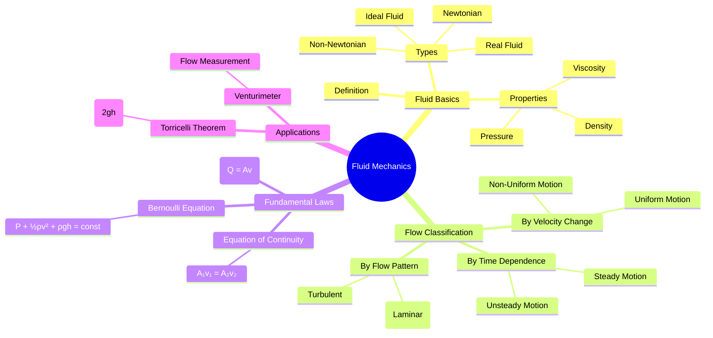

# 🌊 Fluid Mechanics — Complete University Notes

> **Course:** Physics / Engineering — Fluid Mechanics
> **Level:** University / Undergraduate
> **Last Updated:** April 10, 2026
> **Author:** GitHub Repository Notes

---

## 📚 Table of Contents

| # | Topic | File | Status |
|---|-------|------|--------|
| 01 | [Fluid — Definition, Properties & Classification](./01_fluid.md) | `01_fluid.md` | ✅ |
| 02 | [Rate of Flow (Discharge)](./02_rate_of_flow.md) | `02_rate_of_flow.md` | ✅ |
| 03 | [Uniform Motion](./03_uniform_motion.md) | `03_uniform_motion.md` | ✅ |
| 04 | [Non-Uniform Motion](./04_non_uniform_motion.md) | `04_non_uniform_motion.md` | ✅ |
| 05 | [Steady Motion](./05_steady_motion.md) | `05_steady_motion.md` | ✅ |
| 06 | [Unsteady Motion](./06_unsteady_motion.md) | `06_unsteady_motion.md` | ✅ |
| 07 | [Streamline Motion (Laminar Flow)](./07_streamline_motion.md) | `07_streamline_motion.md` | ✅ |
| 08 | [Turbulent Motion](./08_turbulent_motion.md) | `08_turbulent_motion.md` | ✅ |
| 09 | [Equation of Continuity](./09_equation_of_continuity.md) | `09_equation_of_continuity.md` | ✅ |
| 10 | [Bernoulli's Equation](./10_bernoullis_equation.md) | `10_bernoullis_equation.md` | ✅ |
| 11 | [Speed of Efflux — Torricelli's Theorem](./11_torricellis_theorem.md) | `11_torricellis_theorem.md` | ✅ |
| 12 | [Venturimeter](./12_venturimeter.md) | `12_venturimeter.md` | ✅ |

---

## 🗺️ Concept Map

---

## 📐 Key Equations at a Glance

| Equation | Formula | Description |
|----------|---------|-------------|
| **Rate of Flow** | $Q = A \cdot v$ | Volume per unit time |
| **Continuity** | $A_1 v_1 = A_2 v_2$ | Mass conservation |
| **Bernoulli's** | $P + \frac{1}{2}\rho v^2 + \rho g h = \text{const}$ | Energy conservation |
| **Torricelli** | $v = \sqrt{2gh}$ | Speed of efflux |
| **Reynolds Number** | $Re = \frac{\rho v L}{\mu}$ | Laminar vs Turbulent |
| **Venturimeter Flow** | $Q = A_1 A_2 \sqrt{\dfrac{2gh}{A_1^2 - A_2^2}}$ | Flow measurement |

---

## 📖 Recommended Textbooks

1. **Halliday, Resnick & Krane** — *Physics*, Vol. 1 (Fluid Mechanics chapter)
2. **Irodov** — *Problems in General Physics*
3. **Massey B.S.** — *Mechanics of Fluids*, Van Nostrand Reinhold
4. **Frank M. White** — *Fluid Mechanics*, McGraw-Hill
5. **Munson, Young & Okiishi** — *Fundamentals of Fluid Mechanics*, Wiley
6. **Streeter & Wylie** — *Fluid Mechanics*, McGraw-Hill

## 🌐 Online Resources

- 🔗 [MIT OpenCourseWare — Fluid Mechanics](https://ocw.mit.edu/courses/2-20-marine-hydrodynamics-13-021-spring-2005/)
- 🔗 [Physics LibreTexts — Fluid Mechanics](https://phys.libretexts.org/Bookshelves/University_Physics/University_Physics_(OpenStax)/Book:_University_Physics_I_-_Mechanics_Sound_Oscillations_and_Waves_(OpenStax)/14:_Fluid_Mechanics)
- 🔗 [Khan Academy — Fluids](https://www.khanacademy.org/science/physics/fluids)
- 🔗 [HyperPhysics — Fluids](http://hyperphysics.phy-astr.gsu.edu/hbase/fluids.html)
- 🔗 [Princeton Fluids Notes (PDF)](https://fluids.princeton.edu/pubs/LectureNotes/ByersFluidsNotes.pdf)
- 🔗 [NPTEL Fluid Mechanics](https://nptel.ac.in/courses/112/105/112105171/)

---

*These notes are intended for university-level study. Each file contains detailed explanations, mathematical derivations, worked examples, diagrams, and references.*
