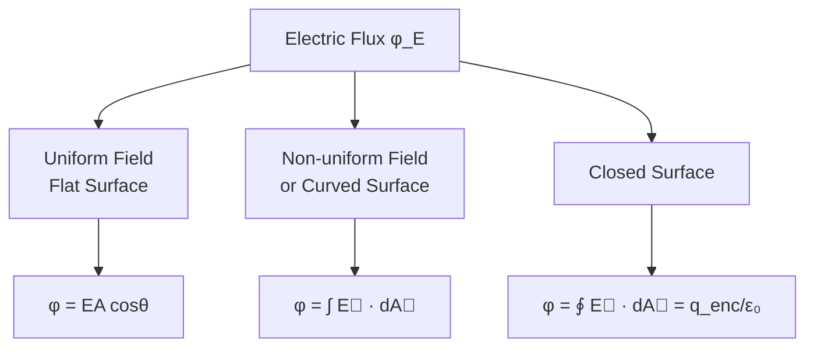

# Electric Flux

## 1. Introduction

Before understanding Gauss's law (one of the most powerful tools in electrostatics), we must first understand **electric flux** — a measure of how much electric field passes through a given surface.

> **Analogy:** Think of electric flux like water flowing through a net. The amount of water passing through the net depends on: (1) the speed of flow, (2) the area of the net, and (3) the angle between the flow and the net surface.

---

## 2. Concept of Flux

### 2.1 General Definition

**Flux** (Latin: *flow*) is the number of field vectors (field lines) that pass through a certain frame (surface) at a given time.

```
     ──→  ──→  ──→
     ──→  ┌────┐ ──→  ──→
     ──→  │    │ ──→  ──→
     ──→  └────┘ ──→  ──→
     ──→  ──→  ──→
         (Frame/Surface)
```

For a **uniform field** passing through a **flat surface** at angle $\theta$ to the field:

$$\varphi = \vec{V} \cdot \vec{A} = VA\cos\theta$$

where $\vec{A}$ is the area vector (magnitude = area, direction = outward normal).

### 2.2 Inclined Surface

```
         ↑ A (normal)
          \
           \ θ
     ─────── ─────── →  E (field lines)
         (tilted surface)
```

When the surface is tilted at angle $\theta$ to the field:

$$\varphi = EA\cos\theta$$

- $\theta = 0°$: Maximum flux ($\varphi = EA$) — field is perpendicular to surface
- $\theta = 90°$: Zero flux — field is parallel to surface (no lines pass through)

---

## 3. Electric Flux — Formal Definition

### 3.1 For a Uniform Field Through a Flat Surface

$$\boxed{\varphi_E = \vec{E} \cdot \vec{A} = EA\cos\theta}$$

where:
- $E$ = magnitude of electric field (N/C)
- $A$ = area of surface (m²)
- $\theta$ = angle between $\vec{E}$ and the outward normal $\hat{n}$

**SI Unit:** N·m²/C (equivalently: V·m)

### 3.2 For a Non-Uniform Field or Curved Surface

The surface is divided into infinitesimal area elements $d\vec{A}$. The flux through each element is $d\varphi_E = \vec{E} \cdot d\vec{A}$, and the total flux is:

$$\boxed{\varphi_E = \int \vec{E} \cdot d\vec{A}}$$

### 3.3 For a Closed Surface

For a **closed** (Gaussian) surface, we use the closed surface integral:

$$\boxed{\varphi_E = \oint \vec{E} \cdot d\vec{A}}$$

> **Sign Convention:**
> - Flux **out** of a closed surface: **positive** ($+\varphi$)
> - Flux **into** a closed surface: **negative** ($-\varphi$)

---

## 4. The Flux of a Vector (Electric) Field

### 4.1 Visual Representation

```
           →  →  →  →
          →   ╔══╗   →
         →    ║  ║ E  →
          →   ╚══╝   →
           →  →  →  →

   dA̅ = area element vector (outward normal)
   E̅ = uniform electric field
   
   φ = Σ E⃗ · dA⃗ = ∫ E⃗ dA⃗
```

For a closed surface, the electric flux is:

$$\varphi_E = \oint \vec{E} \cdot d\vec{A}$$

---

## 5. Flux Through Common Surfaces

### 5.1 Flat Surface Perpendicular to Field

$$\varphi = EA\cos 0° = EA$$

### 5.2 Flat Surface Parallel to Field

$$\varphi = EA\cos 90° = 0$$

### 5.3 Sphere Surrounding Point Charge $q$

At radius $r$, $E = \dfrac{q}{4\pi\varepsilon_0 r^2}$ (uniform over sphere):

$$\varphi = E \cdot 4\pi r^2 = \frac{q}{4\pi\varepsilon_0 r^2} \cdot 4\pi r^2 = \frac{q}{\varepsilon_0}$$

> This result is the basis of **Gauss's Law**!

---

## 6. Worked Example: Hollow Cylinder in Uniform Field

**Problem (From Class Notes):**
A hypothetical closed hollow cylinder of radius $R$ is immersed in a uniform electric field $\vec{E}$, with the cylinder axis parallel to $\vec{E}$. What is $\varphi_E$ for this closed surface?

**Diagram:**

```
         ↑θ
    dA→  ──────────────
    ←    (a)  E→  (b)  (c)   dA→
         ──────────────
         
    * Hollow Cylinder, chargeless
    
    Left cap (a): dA points LEFT, E points RIGHT → cos 180° = -1
    Curved surface (b): dA ⊥ E everywhere → cos 90° = 0
    Right cap (c): dA points RIGHT, E points RIGHT → cos 0° = +1
```

**Calculation:**

$$\varphi = \oint \vec{E} \cdot d\vec{A} = \underbrace{\int_a \vec{E} \cdot d\vec{A}}_{\text{left cap}} + \underbrace{\int_b \vec{E} \cdot d\vec{A}}_{\text{curved side}} + \underbrace{\int_c \vec{E} \cdot d\vec{A}}_{\text{right cap}}$$

$$= \int E \, dA\cos 180° + \int E \, dA\cos 90° + \int E \, dA\cos 0°$$

$$= -E\pi R^2 + 0 + E\pi R^2 = 0$$

$$\boxed{\varphi_E = 0}$$

> **Conclusion:** For a hollow cylinder with **no enclosed charge** in a uniform field, the net electric flux is **zero** — consistent with Gauss's Law ($\varphi_E = q_{enc}/\varepsilon_0 = 0$).

---

## 7. Flux and Electric Field Lines

The electric flux through a surface is proportional to the **number of field lines** passing through that surface.

```
Few field lines through surface   →   Small flux
Many field lines through surface  →   Large flux
Lines parallel to surface         →   Zero flux
```

**Mermaid Diagram — Flux Summary:**



---

## 8. Key Relationships

$$\varphi_E = EA\cos\theta = \vec{E}\cdot\vec{A} \qquad \text{(flat, uniform)}$$

$$\varphi_E = \int \vec{E} \cdot d\vec{A} \qquad \text{(curved or non-uniform)}$$

$$\varphi_E = \oint \vec{E} \cdot d\vec{A} = \frac{q_{\text{enc}}}{\varepsilon_0} \qquad \text{(closed surface — Gauss's Law)}$$

---

## 9. Practice Problems

1. A uniform electric field $E = 300$ N/C makes an angle of 40° with the normal to a flat surface of area 0.05 m². Find the electric flux.

2. A uniform field $E = 500$ N/C is directed along the +x axis. Find the flux through a square of side 0.20 m in the y-z plane.

3. A point charge $q = +3.0 \, \mu\text{C}$ is enclosed in a sphere of radius 0.50 m. Find the total flux through the sphere.

4. A closed rectangular box (dimensions $a \times b \times c$) is placed in a uniform field $\vec{E} = E_0\hat{x}$. Find the total flux through the box.

---

## 10. References

- Halliday, Resnick & Walker — *Fundamentals of Physics*, 10th Ed., Chapter 23
- Young & Freedman — *University Physics*, 14th Ed., Chapter 22
- HyperPhysics — [Electric Flux](http://hyperphysics.phy-astr.gsu.edu/hbase/electric/gaulaw.html)
- Khan Academy — [Electric Flux](https://www.khanacademy.org/science/ap-physics-2/ap-electric-force-electric-field-and-potential/electric-flux-and-gausss-law-ap/a/what-is-electric-flux)
- MIT OCW 8.02 — [Lecture Notes on Flux](https://ocw.mit.edu/courses/8-02-physics-ii-electricity-and-magnetism-spring-2007/pages/readings/)
