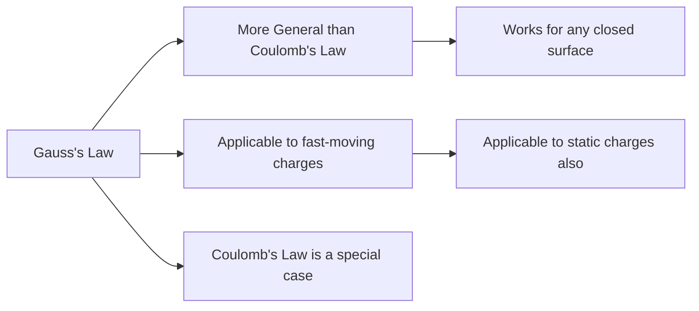

# Gauss's Law and Its Applications

## 1. Introduction

**Gauss's Law**, formulated by Carl Friedrich Gauss (1777–1855), is one of **Maxwell's four equations** of electromagnetism. It provides a powerful method to calculate electric fields for highly symmetric charge distributions — often far more efficiently than direct integration.

> **Key Insight:** Gauss's Law relates the total electric flux through any closed surface to the total charge enclosed within that surface.

---

## 2. Statement of Gauss's Law

### 2.1 Mathematical Statement

$$\boxed{\varepsilon_0 \oint \vec{E} \cdot d\vec{A} = q_{\text{enc}}}$$

Equivalently:

$$\oint \vec{E} \cdot d\vec{A} = \frac{q_{\text{enc}}}{\varepsilon_0}$$

Where:
- $\oint \vec{E} \cdot d\vec{A}$ = total electric flux through the **Gaussian surface**
- $q_{\text{enc}}$ = net charge **enclosed** within the surface
- $\varepsilon_0 = 8.854 \times 10^{-12}$ C²/N·m² = permittivity of free space

### 2.2 Key Properties



> **Important Notes:**
> - Gauss's Law applies to **both static and moving** charges
> - Coulomb's Law is a **special case** of Gauss's Law (for point charges at rest)
> - The Gaussian surface is a mathematical construct, not a physical surface

---

## 3. The Gaussian Surface

A **Gaussian surface** is an imaginary closed surface chosen strategically to exploit symmetry:

```
                    →  →  →
                  ╔═══════════╗  ← Gaussian Surface (sphere)
                → ║    ⊕      ║ →    (chosen by us)
                  ║   (q)     ║
                → ║           ║ →
                  ╚═══════════╝
                    →  →  →
                    
   E̅ is parallel to dA̅ at all points → simplification!
```

**Strategy for choosing Gaussian surfaces:**
1. Choose a surface where $\vec{E}$ is **constant** in magnitude
2. Choose a surface where $\vec{E}$ is either **parallel** or **perpendicular** to $d\vec{A}$
3. Exploit the symmetry of the charge distribution

---

## 4. Proof: Gauss's Law Derives Coulomb's Law

**Goal:** Show $E = \dfrac{q}{4\pi\varepsilon_0 r^2}$ from Gauss's Law.

**Setup:** Place charge $q$ at origin. Choose a Gaussian sphere of radius $r$ centered at $q$.

By symmetry:
- $\vec{E}$ is radially outward (parallel to $d\vec{A}$ everywhere)
- $|\vec{E}|$ is constant over the sphere

Apply Gauss's Law:

$$\oint \vec{E} \cdot d\vec{A} = \oint E \, dA = E \oint dA = E(4\pi r^2) = \frac{q}{\varepsilon_0}$$

$$\therefore E = \frac{q}{4\pi\varepsilon_0 r^2} \qquad \checkmark$$

This is exactly Coulomb's result — **Gauss's Law is consistent with Coulomb's Law**.

---

## 5. Applications of Gauss's Law

### 5.1 Application 1: Derive Coulomb's Law (Point Charge)

As shown above:

$$\boxed{E = \frac{1}{4\pi\varepsilon_0} \cdot \frac{q}{r^2}} \qquad \text{(exterior of point charge)}$$

Using Gauss's Law with a spherical Gaussian surface, $\varepsilon_0 E(4\pi r^2) = q$:

If we place test charge $q_0$ at surface $r$:

$$F = q_0 E = \frac{1}{4\pi\varepsilon_0} \cdot \frac{qq_0}{r^2} \qquad \checkmark$$

---

### 5.2 Application 2: Field due to Infinite Line Charge

**Setup:** Infinite wire with linear charge density $\lambda$ (C/m).

Choose a **cylindrical Gaussian surface** of radius $r$ and height $h$:

```
        ↑ E (radially outward)
        |
   ─────┼──────── wire (+++)
        |    h
   ╔════╪═══╗  ← Gaussian cylinder (radius r)
   ║    ↕   ║
   ╚═════════╝
```

The flux has three parts:
- Two flat circular ends: $\vec{E} \perp d\vec{A}$ → zero contribution
- Curved side: $\vec{E} \parallel d\vec{A}$ everywhere

Applying Gauss's Law:

$$\oint \vec{E} \cdot d\vec{A} = E\cos 0° \cdot (2\pi rh) = \frac{q_{\text{enc}}}{\varepsilon_0} = \frac{\lambda h}{\varepsilon_0}$$

$$E \cdot 2\pi rh = \frac{\lambda h}{\varepsilon_0}$$

$$\boxed{E = \frac{\lambda}{2\pi\varepsilon_0 r}}$$

> This matches the result derived by integration in the previous chapter — much faster with Gauss's Law!

---

### 5.3 Application 3: Field due to Spherical Shell of Charge

**Setup:** Thin spherical shell of radius $R$ with total charge $q$.

```
       S₁ (r > R)         S₂ (r < R)
         ╭─ ─ ─╮           ╭─ ─ ─╮
        (  ╭───╮  )       (  ╭ ─ ╮  )
        (  │ q │  )       (  │   │  )
        (  ╰───╯  )       (  ╰ ─ ╯  )
         ╰─ ─ ─╯           ╰─ ─ ─╯
       Gaussian Surface   Gaussian Surface
       (outside shell)    (inside shell)
```

**Case 1: $r > R$ (outside)**

$$\oint \vec{E} \cdot d\vec{A} = E(4\pi r^2) = \frac{q}{\varepsilon_0}$$

$$\boxed{E = \frac{1}{4\pi\varepsilon_0} \cdot \frac{q}{r^2}} \qquad (r > R)$$

The shell behaves like a **point charge** at the center!

**Case 2: $r < R$ (inside)**

No charge is enclosed: $q' = 0$

$$E(4\pi r^2) = \frac{q'}{\varepsilon_0} = 0$$

$$\boxed{E = 0} \qquad (r < R)$$

> **Key Result:** The electric field **inside a uniformly charged spherical shell is zero**.

---

### 5.4 Application 4: Field due to Infinite Plane Sheet of Charge

**Setup:** Infinite plane with surface charge density $\sigma$ (C/m²).

Choose a **cylindrical Gaussian pillbox** of cross-section area $A$:

```
         + + + + + + + + + + +
  ↑E     ┌─────────────────┐
  │      │    (pillbox)    │  h/2
  │      │─ ─ ─ ─ ─ ─ ─ ─ │  ← plane
  │      │                 │  h/2
  ↑E     └─────────────────┘
         + + + + + + + + + + +
```

Only the two flat faces contribute to flux:

$$2EA = \frac{q_{\text{enc}}}{\varepsilon_0} = \frac{\sigma A}{\varepsilon_0}$$

$$\boxed{E = \frac{\sigma}{2\varepsilon_0}} \qquad \text{(single infinite plane)}$$

---

## 6. Summary of Applications

| Charge Distribution | Gaussian Surface | Result |
|:--------------------|:----------------|:-------|
| Point charge | Sphere (radius $r$) | $E = \dfrac{q}{4\pi\varepsilon_0 r^2}$ |
| Infinite line ($\lambda$) | Cylinder (radius $r$) | $E = \dfrac{\lambda}{2\pi\varepsilon_0 r}$ |
| Infinite plane ($\sigma$) | Pillbox | $E = \dfrac{\sigma}{2\varepsilon_0}$ |
| Spherical shell (outside) | Sphere $r > R$ | $E = \dfrac{q}{4\pi\varepsilon_0 r^2}$ |
| Spherical shell (inside) | Sphere $r < R$ | $E = 0$ |
| Solid sphere (inside) | Sphere $r < R$ | $E = \dfrac{qr}{4\pi\varepsilon_0 R^3}$ |

---

## 7. Worked Example: Gauss's Law Applied to a Cylinder

**Problem (From Class Notes):** A hypothetical cylinder of radius $R$ is immersed in uniform field $\vec{E}$ with axis parallel to $\vec{E}$. Find $\varphi_E$.

**Solution:** Already shown that $\varphi_E = 0$ for a hollow cylinder.

Now apply Gauss's Law:

$$\varepsilon_0 \varphi_E = q_{\text{enc}} = 0 \implies \varphi_E = 0 \qquad \checkmark$$

---

## 8. Gauss's Law in Differential Form

For advanced study, Gauss's Law in differential (point) form is:

$$\nabla \cdot \vec{E} = \frac{\rho}{\varepsilon_0}$$

where $\rho$ is the volume charge density. This is one of **Maxwell's equations**.

---

## 9. Practice Problems

1. A long straight wire carries $\lambda = 2.0 \, \mu\text{C/m}$. Find $E$ at $r = 5.0$ cm.

2. A spherical shell of radius 10 cm carries charge $q = +6.0 \, \mu\text{C}$. Find $E$ at:
   - (a) $r = 15$ cm
   - (b) $r = 5$ cm

3. An infinite plane carries surface charge density $\sigma = 3.0 \, \mu\text{C/m}^2$. Find $E$ just above the surface.

4. A point charge $+2 \, \mu\text{C}$ is placed at the center of a spherical shell of radius 20 cm carrying $-2 \, \mu\text{C}$. Find $E$ at: (a) $r = 10$ cm, (b) $r = 25$ cm.

---

## 10. References

- Halliday, Resnick & Walker — *Fundamentals of Physics*, 10th Ed., Chapter 23
- Young & Freedman — *University Physics*, 14th Ed., Chapter 22
- HyperPhysics — [Gauss's Law](http://hyperphysics.phy-astr.gsu.edu/hbase/electric/gaulaw.html)
- Khan Academy — [Gauss's Law](https://www.khanacademy.org/science/ap-physics-2/ap-electric-force-electric-field-and-potential/electric-flux-and-gausss-law-ap/a/using-gausss-law)
- MIT OCW — [Lecture 4: Gauss's Law](https://ocw.mit.edu/courses/8-02-physics-ii-electricity-and-magnetism-spring-2007/)
- Physics LibreTexts — [Gauss's Law](https://phys.libretexts.org/Bookshelves/University_Physics/University_Physics_(OpenStax)/University_Physics_II_-_Thermodynamics_Electricity_and_Magnetism_(OpenStax)/06:_Gauss's_Law)
