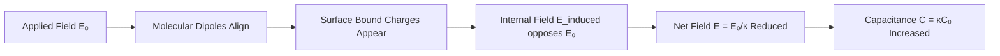

# Capacitors with Dielectrics

## 1. What is a Dielectric?

A **dielectric** is an **electrical insulator** that can be **polarized** by an applied electric field. When placed between capacitor plates, it increases the capacitance.

> **Definition:** A dielectric is an electrical insulator that can be polarized by an applied electric field.

### 1.1 Common Dielectric Materials

| Material | Dielectric Constant $\kappa$ |
|:---------|:-----------------------------|
| Vacuum | 1.000 (exact) |
| Air | 1.00059 |
| Paper | 3.5 |
| Rubber | 7 |
| Glass | 5–10 |
| Water | 80 |
| Barium titanate | 1200 |

---

## 2. Dielectric Constant

### 2.1 Definition

The **dielectric constant** $\kappa$ (also called relative permittivity $\varepsilon_r$) is the ratio of the capacitance with the dielectric to the capacitance without it:

$$\boxed{\kappa = \frac{C}{C_0}}$$

Where:
- $C$ = capacitance with dielectric
- $C_0$ = capacitance without dielectric (vacuum)

Equivalently, $\kappa$ is the ratio of the permittivity of the material to the permittivity of free space:

$$\kappa = \frac{\varepsilon}{\varepsilon_0}$$

> **High dielectric constant → High capacitance** — so high-$\kappa$ materials are used in capacitors requiring large capacitance in small volumes.

---

## 3. Effect of a Dielectric on the Electric Field

### 3.1 Mechanism — Atomic View

When a dielectric is inserted between charged plates:

```
   Without dielectric:                With dielectric:
   
   +  +  +  +  +  +                  +  +  +  +  +  +
   ─────────────────                  ─────────────────
                                      ⊕⊖ ⊕⊖ ⊕⊖ ⊕⊖ ⊕⊖
   E₀ → → → → →                      ─────────────────
                                      E₀→     ←E_induced
   ─────────────────                  ─────────────────
   −  −  −  −  −  −                  −  −  −  −  −  −
   
   Charge: q                          Induced charge: q' = κ_e · q
   E₀ = q/(ε₀A)                       E' = E₀/κ_e
```

**Process:**
1. External field $\vec{E}_0$ causes molecules to align (polarization)
2. Alignment creates induced surface charges
3. Induced charges create opposing field $\vec{E}_1$
4. Net field: $\vec{E}' = \vec{E}_0 - \vec{E}_1 = \vec{E}_0/\kappa$

### 3.2 Electric Field with Dielectric

Without dielectric:

$$E_0 = \frac{q}{\varepsilon_0 A} = \frac{\sigma}{\varepsilon_0}$$

With dielectric:

$$E' = \frac{E_0}{\kappa_e} = \frac{q}{\kappa_e \varepsilon_0 A}$$

The field **decreases** by a factor of $\kappa_e$ (kappa).

Also, the induced charge $q' = \kappa_e q$ (more charge stored for same voltage):

$$E' = \frac{q'}{\kappa_e \varepsilon_0 A} = \frac{q}{\varepsilon_0 A}$$

So the dielectric doesn't change $E$ if the charge is kept constant — but if the **voltage** is kept constant (battery connected), more charge flows in.

---

## 4. Capacitance with Dielectric

### 4.1 Derivation

For a parallel-plate capacitor with dielectric of constant $\kappa_e$:

The potential difference with dielectric (compared to $V_0 = E_0 d$ without):

$$\Delta V' = E' \cdot d = \frac{E_0 d}{\kappa_e} = \frac{V_0}{\kappa_e}$$

So capacitance:

$$C' = \frac{q}{\Delta V'} = \frac{q}{V_0/\kappa_e} = \kappa_e \cdot \frac{q}{V_0} = \kappa_e C_0$$

$$\boxed{C' = \kappa_e C_0 = \frac{\kappa_e \varepsilon_0 A}{d}}$$

Using general permittivity $\varepsilon = \kappa_e \varepsilon_0$:

$$\boxed{C' = \frac{\varepsilon A}{d}}$$

---

## 5. Polarization — An Atomic View

```
   Without field:             With field:
   
   ⊕ ⊖  ⊕ ⊖  ⊕ ⊖           ⊕→ ⊖  ⊕→ ⊖  ⊕→ ⊖
   ⊕ ⊖  ⊕ ⊖  ⊕ ⊖           ⊕→ ⊖  ⊕→ ⊖  ⊕→ ⊖
   ⊕ ⊖  ⊕ ⊖  ⊕ ⊖           ⊕→ ⊖  ⊕→ ⊖  ⊕→ ⊖
   (random orientation)       (aligned — resultant dipole moment ≠ 0)
```

The alignment of molecular dipoles creates a **bulk polarization** $\vec{P}$:

$$\vec{P} = \varepsilon_0(\kappa - 1)\vec{E}$$

This is the **electric polarization** of the material (C/m²).



---

## 6. Energy in Capacitor with Dielectric

The energy density in a dielectric:

$$u = \frac{1}{2}\varepsilon E^2 = \frac{1}{2}\kappa\varepsilon_0 E^2$$

When a dielectric is inserted into a **charged isolated** capacitor (no battery):
- Charge $Q$ remains constant
- $E$ decreases → $V$ decreases
- $C$ increases → Energy **decreases** (energy is released, e.g., as heat)

When inserted with battery **connected**:
- $V$ remains constant
- $Q$ increases ($q' = \kappa q$)
- Energy **increases** (battery does extra work)

---

## 7. Types of Dielectrics

### 7.1 Non-Polar Dielectrics

Molecules have no permanent dipole moment (e.g., $\text{N}_2$, $\text{CO}_2$, benzene). When field applied, **induced** dipoles form through charge displacement.

### 7.2 Polar Dielectrics

Molecules have permanent dipole moment (e.g., $\text{H}_2\text{O}$, HCl). Without field, dipoles are randomly oriented. Field causes **alignment** of existing dipoles.

```
   Non-polar (no field):     Non-polar (with field):
   ─ ─ ─ ─ ─ ─               ─ ─ ─ ─ ─ ─
   (symmetric)               (asymmetric - induced dipole)

   Polar (no field):         Polar (with field):
   ↑↓ →← ↗↙ ←→               → → → → → →
   (random)                  (aligned)
```

---

## 8. Gauss's Law in Dielectrics

Inside a dielectric, Gauss's Law is modified:

$$\oint \kappa \vec{E} \cdot d\vec{A} = \frac{q_{\text{free}}}{\varepsilon_0}$$

Or equivalently, using displacement field $\vec{D} = \kappa\varepsilon_0\vec{E} = \varepsilon\vec{E}$:

$$\oint \vec{D} \cdot d\vec{A} = q_{\text{free}}$$

---

## 9. Worked Example

**Problem:** A parallel-plate capacitor with area $A = 100$ cm² and separation $d = 3.0$ mm is filled with a dielectric of $\kappa = 4.5$. Find:
(a) Capacitance
(b) Maximum charge if the dielectric can withstand $E_{max} = 2.0 \times 10^7$ V/m

**Solution:**

(a) $C = \dfrac{\kappa \varepsilon_0 A}{d} = \dfrac{4.5 \times (8.854\times10^{-12}) \times (100\times10^{-4})}{3.0\times10^{-3}}$

$$C = \frac{4.5 \times 8.854 \times 10^{-12} \times 10^{-2}}{3\times10^{-3}} = \frac{3.98\times10^{-13}}{3\times10^{-3}} = 1.33 \times 10^{-10} \text{ F} = 133 \text{ pF}$$

(b) Maximum voltage: $V_{max} = E_{max} \cdot d = (2.0\times10^7)(3.0\times10^{-3}) = 6.0\times10^4$ V

Maximum charge: $Q_{max} = CV_{max} = (1.33\times10^{-10})(6.0\times10^4) = 7.98 \, \mu\text{C}$

---

## 10. Summary

$$C = \kappa C_0 \qquad C_0 = \frac{\varepsilon_0 A}{d} \qquad C = \frac{\kappa\varepsilon_0 A}{d} = \frac{\varepsilon A}{d}$$

$$\kappa = \frac{C}{C_0} = \frac{\varepsilon}{\varepsilon_0} \qquad E' = \frac{E_0}{\kappa} \qquad u = \frac{1}{2}\kappa\varepsilon_0 E^2$$

---

## 11. Practice Problems

1. A capacitor has $C_0 = 20$ pF without dielectric. A dielectric with $\kappa = 5$ is inserted. Find the new capacitance.

2. A parallel-plate capacitor ($A = 0.02$ m², $d = 0.5$ mm) is filled with glass ($\kappa = 7$). Find $C$.

3. The capacitor in problem 2 is connected to 12 V. Find: charge, energy stored, and electric field between plates.

4. A dielectric is inserted into a charged isolated capacitor. If the voltage drops from 100 V to 25 V, find $\kappa$.

---

## 12. References

- Halliday, Resnick & Walker — *Fundamentals of Physics*, 10th Ed., Chapter 25
- Young & Freedman — *University Physics*, 14th Ed., Chapter 24
- HyperPhysics — [Dielectrics](http://hyperphysics.phy-astr.gsu.edu/hbase/electric/dielec.html)
- Khan Academy — [Dielectric in a Capacitor](https://www.khanacademy.org/science/ap-physics-2/ap-circuits-topic/capacitors-and-capacitance-ap/a/dielectrics)
- LibreTexts — [Dielectrics in Capacitors](https://phys.libretexts.org/Bookshelves/University_Physics/University_Physics_(OpenStax)/University_Physics_II_-_Thermodynamics_Electricity_and_Magnetism_(OpenStax)/08:_Capacitance/8.04:_Dielectrics_in_Capacitors)
