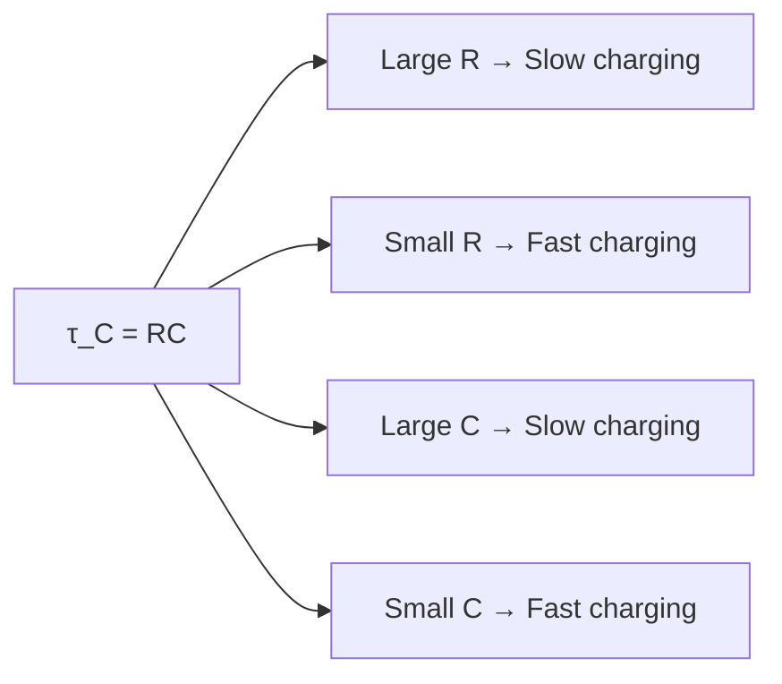

# Charging and Discharging of a Capacitor

## 1. The RC Circuit

An **RC circuit** is an electronic circuit consisting of a **resistor R** and a **capacitor C**. Through this circuit, one can obtain **time-varying current** — crucial for timing, filtering, and signal processing applications.

### 1.1 Circuit Diagram

```
          a           V_R=iR
    ──o──────o──┬──[R]──────┬────
    |         S |           |   |
    ε           |           C  V_C = q/C
    |           |           |   |
    ──────────────────────────────
                V
                
   ε = EMF (battery)
   S = Switch
   R_C = Charging resistor
   R_D = Discharging resistor
   C = Capacitor
```

### 1.2 Charging and Discharging Depends On

1. The **capacitance** of the capacitor
2. The **resistance** of the circuit

---

## 2. Charging a Capacitor

### 2.1 Physical Description

When the switch S is closed (position a):
1. Battery is connected across the capacitor
2. Current flows and potential difference across capacitor rises
3. As more charge builds up, current slows (back-EMF increases)
4. Finally, no further current flows when $V_C = \mathcal{E}$ (capacitor fully charged)

### 2.2 Mathematical Analysis

At any instant, the conservation of energy (or Kirchhoff's voltage law):

$$\mathcal{E} \, dq = i^2 R \, dt + d\left(\frac{q^2}{2C}\right)$$

Dividing by $dt$ (since $i = dq/dt$):

$$\mathcal{E} \frac{dq}{dt} = i^2 R + \frac{q}{C}\frac{dq}{dt}$$

$$\mathcal{E} = iR + \frac{q}{C} \qquad \cdots (1) \quad \text{(Kirchhoff's Voltage Law)}$$

Substituting $i = dq/dt$:

$$\mathcal{E} = R\frac{dq}{dt} + \frac{q}{C}$$

$$R\frac{dq}{dt} = \mathcal{E} - \frac{q}{C} = \frac{C\mathcal{E} - q}{C}$$

$$\frac{dq}{C\mathcal{E} - q} = \frac{dt}{RC}$$

### 2.3 Solving the Differential Equation

Integrating both sides:

$$\int \frac{dq}{C\mathcal{E} - q} = \int \frac{dt}{RC}$$

$$-\ln(C\mathcal{E} - q) + A = \frac{t}{RC}$$

**Boundary condition:** At $t = 0$, $q = 0$:

$$-\ln(C\mathcal{E}) + A = 0 \implies A = \ln(C\mathcal{E})$$

Substituting back:

$$\ln(C\mathcal{E} - q) - \ln(C\mathcal{E}) = -\frac{t}{RC}$$

$$\ln\frac{C\mathcal{E} - q}{C\mathcal{E}} = -\frac{t}{RC}$$

$$\frac{C\mathcal{E} - q}{C\mathcal{E}} = e^{-t/RC}$$

$$C\mathcal{E} - q = C\mathcal{E} \, e^{-t/RC}$$

$$\boxed{q(t) = q_0\left(1 - e^{-t/RC}\right)}$$

Where $q_0 = C\mathcal{E}$ is the **maximum (final) charge**.

### 2.4 Voltage Across Capacitor

$$V_C = \frac{q}{C} = \frac{q_0}{C}\left(1 - e^{-t/RC}\right) = \mathcal{E}\left(1 - e^{-t/RC}\right)$$

$$\boxed{V_C(t) = \mathcal{E}\left(1 - e^{-t/\tau_C}\right)}$$

### 2.5 Current During Charging

$$i = \frac{dq}{dt} = \frac{d}{dt}\left[q_0\left(1 - e^{-t/RC}\right)\right] = \frac{q_0}{RC}e^{-t/RC} = \frac{\mathcal{E}}{R}e^{-t/RC}$$

$$\boxed{i(t) = i_0 \, e^{-t/\tau_C}}$$

Where $i_0 = \mathcal{E}/R$ is the **maximum (initial) current**.

### 2.6 Charging Graphs

```
   V_C (Volts)                        V_R (Volts)
   ε ---─────────────                 ε ─┐
      /                                  │\
     /                                   │ \
    /                                    │  \
   /                                     │   ─────
  ──────────────── t (ms)           ─────────────── t (ms)
        Charging                         Discharging
```

---

## 3. Discharging a Capacitor

### 3.1 Physical Description

When the capacitor (initially charged to $q_0$) is disconnected from the battery and connected to resistor $R_D$:

```
          a      V_R=iR
    o──────o──┬──[R_D]──────┬────
    |         S             |   |
    ε_0 (disconnected)      C  V_C = q/C
    |                       |   |
    ────────────────────────────
```

### 3.2 Mathematical Analysis

With no EMF source: $iR + q/C = 0$

$$R\frac{dq}{dt} + \frac{q}{C} = 0 \implies \frac{dq}{dt} = -\frac{q}{RC}$$

Separating variables:

$$\frac{dq}{q} = -\frac{dt}{RC}$$

Integrating:

$$\int \frac{dq}{q} = -\int \frac{dt}{RC}$$

$$\ln q = -\frac{t}{RC} + K$$

**Boundary condition:** At $t = 0$, $q = q_0$ → $K = \ln q_0$

$$\ln\frac{q}{q_0} = -\frac{t}{RC}$$

$$\boxed{q(t) = q_0 \, e^{-t/RC}}$$

### 3.3 Voltage During Discharging

$$\boxed{V_C(t) = \frac{q}{C} = \frac{q_0}{C}e^{-t/RC} = \mathcal{E} \, e^{-t/RC}}$$

### 3.4 Current During Discharging

$$i = \frac{dq}{dt} = \frac{d}{dt}(q_0 e^{-t/RC}) = -\frac{q_0}{RC}e^{-t/RC} = -\frac{\mathcal{E}}{R}e^{-t/RC}$$

$$\boxed{i(t) = -i_0 \, e^{-t/RC}}$$

The negative sign indicates the current flows in the **opposite direction** compared to charging.

---

## 4. The Time Constant

The quantity $RC$ is called the **capacitive time constant** $\tau_C$:

$$\boxed{\tau_C = RC}$$

**Physical interpretation:**
- At $t = \tau_C$: $q = q_0(1 - e^{-1}) = 0.632 \, q_0$ (charging reaches 63.2% of max)
- At $t = \tau_C$: $q = q_0 e^{-1} = 0.368 \, q_0$ (discharging falls to 36.8% of initial)

| Time | Charging ($q/q_0$) | Discharging ($q/q_0$) |
|:-----|:------------------:|:---------------------:|
| $0$ | 0 | 1.000 |
| $\tau_C$ | 0.632 | 0.368 |
| $2\tau_C$ | 0.865 | 0.135 |
| $3\tau_C$ | 0.950 | 0.050 |
| $5\tau_C$ | 0.993 | 0.007 |
| $\infty$ | 1.000 | 0.000 |

**As $t \to \infty$** (charging): $q = q_0(1 - 1/e^\infty) = q_0(1 - 0) = q_0$ ✓



---

## 5. Charging/Discharging Waveforms

```
   Charging:                        Discharging:
   
   ΔV_C (V)                         ΔV_R (V)
   ε ─────────────                  ε─┐
      ╱                               │ ╲
     ╱                                │  ╲
    ╱                                 │   ───────
   ─────────────── t (ms)         ────────────── t (ms)
   
   ΔV_C (V) [discharging]          ΔV_R (V) [charging]
   ε─┐                             0──────────────
     │╲                               ╲
     │ ╲                              -ε╲
     │  ╲                                ╲───────
     │   ─────────── t (ms)          ────────────── t (ms)
```

---

## 6. Worked Example (From Class Notes)

**Problem:** A capacitor $C$ discharges through a resistor $R$.

**(a)** After how many time constants does its charge fall to one-half of its initial value?

$$q = q_0 e^{-t/\tau_C} = \frac{1}{2}q_0$$

$$e^{-t/\tau_C} = \frac{1}{2} \implies -\frac{t}{\tau_C} = -\ln 2$$

$$\boxed{t = \tau_C \ln 2 \approx 0.693\,\tau_C}$$

**(b)** After how many time constants does the stored energy drop to half?

$$U = \frac{q^2}{2C} = \frac{q_0^2}{2C}e^{-2t/\tau_C} = U_0 e^{-2t/\tau_C}$$

Setting $U = U_0/2$:

$$e^{-2t/\tau_C} = \frac{1}{2} \implies -\frac{2t}{\tau_C} = -\ln 2$$

$$\boxed{t = \frac{\tau_C}{2}\ln 2 \approx 0.347\,\tau_C}$$

---

## 7. Worked Problem (From Class Notes)

**Problem:** A resistor $R = 0.62 \, \text{M}\Omega$ and a capacitor $C = 2.4 \, \mu\text{F}$ are connected in series with a 12 V battery of negligible internal resistance.

**(a) What is the capacitance time constant?**

$$\tau_C = RC = (0.62 \times 10^6)(2.4 \times 10^{-6}) = 1.488 \approx 1.49 \text{ s}$$

**(b) At what time after battery is connected does $V_C = 5.6$ V?**

$$V_C = \mathcal{E}(1 - e^{-t/\tau_C})$$

$$5.6 = 12(1 - e^{-t/1.49})$$

$$e^{-t/1.49} = 1 - \frac{5.6}{12} = 1 - 0.467 = 0.533$$

$$-\frac{t}{1.49} = \ln(0.533) = -0.629$$

$$t = 0.629 \times 1.49 \approx 0.94 \text{ s}$$

---

## 8. Energy Considerations During Charging

Starting from empty capacitor:

| Energy Source | Energy |
|:-------------|:-------|
| Battery provides | $Q\mathcal{E} = C\mathcal{E}^2$ |
| Stored in capacitor | $\frac{1}{2}C\mathcal{E}^2$ |
| Dissipated in resistor | $\frac{1}{2}C\mathcal{E}^2$ |

**Interesting fact:** Exactly **half** the energy from the battery is always dissipated as heat, regardless of resistance!

---

## 9. Applications of RC Circuits

| Application | Principle |
|:------------|:---------|
| Camera flash | Capacitor charges slowly, discharges quickly through lamp |
| Heart defibrillator | High energy capacitor discharge |
| Oscilloscopes | RC timing for time-base generation |
| Filters | Frequency-dependent impedance of capacitor |
| Signal smoothing | Capacitor averages fluctuating voltages |

---

## 10. Summary

**Charging:**

$$q(t) = q_0(1-e^{-t/\tau_C}) \quad V_C = \mathcal{E}(1-e^{-t/\tau_C}) \quad i = i_0 e^{-t/\tau_C}$$

**Discharging:**

$$q(t) = q_0 e^{-t/\tau_C} \quad V_C = \mathcal{E}\,e^{-t/\tau_C} \quad i = -i_0 e^{-t/\tau_C}$$

$$\tau_C = RC \qquad i_0 = \frac{\mathcal{E}}{R} \qquad q_0 = C\mathcal{E}$$

---

## 11. Practice Problems

1. An RC circuit has $R = 10 \, \text{k}\Omega$, $C = 100 \, \mu\text{F}$, $\mathcal{E} = 12$ V. Find: (a) $\tau_C$, (b) initial current, (c) charge at $t = \tau_C$.

2. A capacitor charged to $Q_0 = 500 \, \mu\text{C}$ discharges through $R = 2 \, \text{k}\Omega$. Find $q$, $V_C$, and $i$ at $t = 0.5$ s if $C = 250 \, \mu\text{F}$.

3. How long does it take to charge a capacitor to 99% of its final charge?

4. A camera flash uses a $100 \, \mu\text{F}$ capacitor charged to 300 V. If the flash lamp has resistance 5 Ω, find the peak current and time to discharge to 10% of initial voltage.

---

## 12. References

- Halliday, Resnick & Walker — *Fundamentals of Physics*, 10th Ed., Chapter 27
- Young & Freedman — *University Physics*, 14th Ed., Chapter 26
- HyperPhysics — [RC Circuits](http://hyperphysics.phy-astr.gsu.edu/hbase/electric/rccap.html)
- Khan Academy — [RC Circuits](https://www.khanacademy.org/science/ap-physics-2/ap-circuits-topic/dc-circuit-ap/a/rc-circuits-article)
- PhET Simulation — [Circuit Construction Kit](https://phet.colorado.edu/en/simulations/circuit-construction-kit-dc)
- Paul's Online Notes — [First Order Differential Equations](https://tutorial.math.lamar.edu/Classes/DE/FirstOrderDE.aspx)
