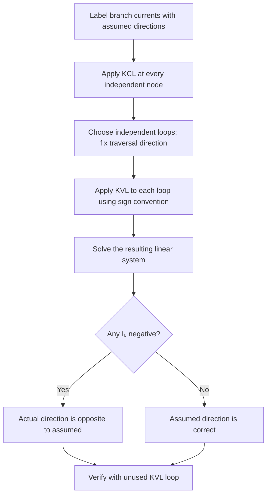

# Kirchhoff's Laws

## 1. Introduction

In 1845, German physicist Gustav Robert Kirchhoff formulated two fundamental laws governing the behaviour of electric circuits. These laws are direct consequences of two conservation principles — conservation of electric charge (KCL) and conservation of energy (KVL) — and are indispensable for analysing multi-loop circuits that cannot be simplified by series or parallel reduction alone.

Any circuit with $b$ branches, $n$ nodes, and $l$ independent loops yields:
- $(n - 1)$ independent KCL equations
- $b - (n - 1)$ independent KVL equations

Together these provide exactly $b$ equations to solve for $b$ unknown branch currents.

## 2. Kirchhoff's Current Law (KCL) — Junction Rule

**Statement:** *The algebraic sum of all currents at any junction (node) in an electric circuit is zero.*

$$\boxed{\sum_{k} I_k = 0 \qquad \text{at any node}}$$

Equivalently, total current flowing **into** a node equals total current flowing **out**:

$$\sum I_{\text{in}} = \sum I_{\text{out}}$$

**Physical basis:** KCL is a statement of conservation of charge. No charge can accumulate at an ideal junction; every coulomb that arrives must immediately depart via one or more branches.

**Sign convention:** Adopt a consistent rule (e.g., currents *entering* a node are positive, currents *leaving* are negative) and apply it uniformly throughout the problem.

**Example junction:**
```
           I₁ = 6 A
              ↓
   I₂ = 4 A  ●──────→ I₃ = ?
              ↑
           I₄ = 2 A

KCL: I₁ + I₄ = I₂ + I₃
     6  + 2  = 4  + I₃
     I₃ = 4 A (flowing right)
```

## 3. Kirchhoff's Voltage Law (KVL) — Loop Rule

**Statement:** *The algebraic sum of all potential differences around any closed loop in a circuit is zero.*

$$\boxed{\sum_{k} V_k = 0 \qquad \text{around any closed loop}}$$

**Physical basis:** KVL follows from conservation of energy. The electric potential is a path-independent state function, so the net work done per unit charge around any closed path is zero.

**Sign convention for traversal:**

| Element | Traversal direction | Contribution |
|:--------|:--------------------|:-------------|
| Resistor $R$ | Along assumed current $I$ | $-IR$ (voltage drop) |
| Resistor $R$ | Against assumed current $I$ | $+IR$ (voltage rise) |
| EMF source $\varepsilon$ | $-$ terminal → $+$ terminal | $+\varepsilon$ (gain) |
| EMF source $\varepsilon$ | $+$ terminal → $-$ terminal | $-\varepsilon$ (loss) |

> **Notation note:** Halliday/Resnick/Walker state KVL as "the sum of EMFs equals the sum of $IR$ drops" around a loop; Serway & Jewett write $\sum \Delta V = 0$ with explicit signs at each element. The two formulations are algebraically identical — choose whichever is more natural for each problem.

**Simple loop illustration:**
```
  ┌────── R₁ ──────┬────── R₂ ──────┐
  │                │                 │
 [ε]              [r]               (open)
  │                │                 │
  └────────────────┴─────────────────┘
            I →

  KVL (clockwise): ε − I·r − I·R₁ − I·R₂ = 0
```

## 4. Systematic Procedure



## 5. Worked Example 1 — Single-Loop Circuit (Simple)

**Problem:** A battery ($\varepsilon = 12\,\text{V}$, internal resistance $r = 1\,\Omega$) is connected to two external resistors $R_1 = 3\,\Omega$ and $R_2 = 2\,\Omega$ in series. Find (a) the current $I$, (b) the terminal voltage of the battery, and (c) the power dissipated in $R_2$.

**Circuit:**
```
  ┌──[r=1Ω]──[R₁=3Ω]──[R₂=2Ω]──┐
  │                               │
[ε=12V]                          │
  │                               │
  └───────────────────────────────┘
               I →  (clockwise)
```

**Solution:**

**(a) Current:** Apply KVL clockwise:

$$\varepsilon - Ir - IR_1 - IR_2 = 0$$

$$12 - I(1) - I(3) - I(2) = 0 \implies 12 = 6I$$

$$\boxed{I = 2\,\text{A}}$$

**(b) Terminal voltage:**

$$V_T = \varepsilon - Ir = 12 - (2)(1) = \boxed{10\,\text{V}}$$

**(c) Power in $R_2$:**

$$P_{R_2} = I^2 R_2 = (2)^2(2) = \boxed{8\,\text{W}}$$

## 6. Worked Example 2 — Two-Loop Circuit (Intermediate)

**Problem:** In the circuit below, $\varepsilon_1 = 10\,\text{V}$, $\varepsilon_2 = 4\,\text{V}$, $R_1 = 2\,\Omega$, $R_2 = 3\,\Omega$, $R_3 = 1\,\Omega$. Find the branch currents $I_1$, $I_2$, and $I_3$.

**Circuit (with node labels):**
```
  A ──[R₁=2Ω]── B ──[R₂=3Ω]── C
  │             │               │
[ε₁=10V]    [R₃=1Ω]         [ε₂=4V]
  │             │               │
  D ────────── E ────────────── F

  I₁ → (AD branch, upper left)
  I₂ → (CF branch, upper right)
  I₃ ↓ (BE branch, centre)
```

**Solution:**

*Step 1 — KCL at node B:*

$$I_1 = I_2 + I_3 \tag{1}$$

*Step 2 — KVL, left loop ABED (clockwise):*

$$\varepsilon_1 - I_1 R_1 - I_3 R_3 = 0 \implies 10 - 2I_1 - I_3 = 0 \tag{2}$$

*Step 3 — KVL, right loop BCFE (clockwise, with $\varepsilon_2$ opposing traversal):*

$$-\varepsilon_2 - I_2 R_2 + I_3 R_3 = 0 \implies -4 - 3I_2 + I_3 = 0 \tag{3}$$

*Step 4 — Solve.* From (3): $I_3 = 4 + 3I_2$. Substitute (1) into (2):

$$10 - 2(I_2 + I_3) - I_3 = 0 \implies 10 = 2I_2 + 3I_3$$

Replace $I_3$:

$$10 = 2I_2 + 3(4 + 3I_2) = 12 + 11I_2 \implies I_2 = -\frac{2}{11} \approx -0.18\,\text{A}$$

(Negative: $I_2$ actually flows opposite to the assumed direction.)

$$I_3 = 4 + 3\!\left(-\tfrac{2}{11}\right) = \frac{38}{11} \approx 3.45\,\text{A}$$

$$I_1 = I_2 + I_3 = -\frac{2}{11} + \frac{38}{11} = \frac{36}{11} \approx 3.27\,\text{A}$$

*Verification (outer loop ABCFED):*

$$\varepsilon_1 - I_1 R_1 - I_2 R_2 - \varepsilon_2 = 10 - \tfrac{72}{11} + \tfrac{6}{11} - 4 = 6 - \tfrac{66}{11} = 0\;\checkmark$$

## 7. Worked Example 3 — Mesh Analysis, Three Independent Loops (Advanced)

**Problem:** In a T-network, a 20 V battery drives current through $R_1 = 4\,\Omega$ (top-left arm), $R_2 = 6\,\Omega$ (top-right arm), and $R_3 = 3\,\Omega$ (bottom shunt, connecting the junction to ground). Find all branch currents.

**Circuit:**
```
  ┌───[R₁=4Ω]───A───[R₂=6Ω]───┐
  │             │               │
[ε=20V]      [R₃=3Ω]         (load, open here)
  │             │               │
  └─────────────┴───────────────┘

  Assign: I₁ through R₁ (left to right)
          I₂ through R₂ (left to right)
          I₃ through R₃ (top to bottom)
```

**Solution:**

*KCL at node A:*

$$I_1 = I_2 + I_3 \tag{1}$$

*KVL, left loop (source + R₁ + R₃), clockwise:*

$$20 - 4I_1 - 3I_3 = 0 \tag{2}$$

*KVL, right loop (R₃ + R₂, noting no source and open right terminal):*

With the right terminal open, $I_2 = 0$. (No current can flow in the open branch.)

From (1): $I_1 = I_3$.  
Substitute into (2): $20 - 4I_3 - 3I_3 = 0 \implies 7I_3 = 20$

$$\boxed{I_1 = I_3 = \frac{20}{7} \approx 2.86\,\text{A}, \quad I_2 = 0\,\text{A}}$$

Voltage at node A: $V_A = I_3 R_3 = \tfrac{20}{7} \times 3 = \tfrac{60}{7} \approx 8.57\,\text{V}$

This voltage would also appear across any load connected at the output terminals, illustrating how KCL + KVL directly yield Thevenin open-circuit voltages.

## 8. Comparison: KCL vs KVL

| Feature | KCL — Junction Rule | KVL — Loop Rule |
|:--------|:--------------------|:----------------|
| Conservation principle | Charge | Energy |
| Applied at | Nodes / junctions | Closed loops |
| Equation form | $\sum I = 0$ | $\sum V = 0$ |
| Independent equations | $(n - 1)$ for $n$ nodes | $b - (n-1)$ for $b$ branches |
| Encodes | No charge storage at nodes | No energy gain around a loop |
| Typical use | Node-voltage method | Mesh-current method |

## 9. Practice Problems

1. A node in a circuit has five branches. Four currents are known: $I_1 = 8\,\text{A}$ (in), $I_2 = 3\,\text{A}$ (in), $I_3 = 6\,\text{A}$ (out), $I_4 = 2\,\text{A}$ (out). Find $I_5$ and state its direction.

2. A single-loop circuit contains a 9 V battery (internal resistance $0.5\,\Omega$) in series with $R_1 = 2\,\Omega$ and $R_2 = 4\,\Omega$. Find the current and the power delivered by the battery.

3. Two batteries ($\varepsilon_1 = 12\,\text{V}$, $r_1 = 1\,\Omega$; $\varepsilon_2 = 8\,\text{V}$, $r_2 = 1\,\Omega$) are connected in opposing polarity with an external $R = 5\,\Omega$. Use KVL to find the current magnitude and determine which battery is charging.

4. A two-loop circuit has $\varepsilon_1 = 16\,\text{V}$, $\varepsilon_2 = 4\,\text{V}$, $R_1 = 2\,\Omega$, $R_2 = 4\,\Omega$, $R_3 = 3\,\Omega$ with $R_3$ as the common branch. Apply KCL and KVL to find all three branch currents.

5. Using the node-voltage method (KCL applied at a floating node), find the voltage at the midpoint of a circuit where $R_1 = 2\,\Omega$ connects the node to $V_A = 10\,\text{V}$, $R_2 = 4\,\Omega$ connects the node to $V_B = 6\,\text{V}$, and $R_3 = 6\,\Omega$ connects the node to ground.

## 10. References

1. Halliday, D., Resnick, R., & Walker, J. *Fundamentals of Physics*, 10th ed. Wiley, 2014 — Chapter 27 (Circuits), §27-3 to §27-5.
2. Serway, R. A., & Jewett, J. W. *Physics for Scientists and Engineers*, 9th ed. Cengage, 2014 — Chapter 28 (Direct-Current Circuits), §28-3.
3. Young, H. D., & Freedman, R. A. *University Physics*, 14th ed. Pearson, 2016 — Chapter 26 (Direct-Current Circuits), §26-2 to §26-3.
4. HyperPhysics — Kirchhoff's Laws: <http://hyperphysics.phy-astr.gsu.edu/hbase/electric/kirchhof.html>
5. MIT OpenCourseWare 8.02 — Lecture 13: DC Circuits and Kirchhoff's Laws: <https://ocw.mit.edu/courses/8-02-physics-ii-electricity-and-magnetism-spring-2007/>
6. Khan Academy — Kirchhoff's Current Law: <https://www.khanacademy.org/science/electrical-engineering/ee-circuit-analysis-topic/ee-dc-circuit-analysis/a/ee-kirchhoffs-current-law>
7. Khan Academy — Kirchhoff's Voltage Law: <https://www.khanacademy.org/science/electrical-engineering/ee-circuit-analysis-topic/ee-dc-circuit-analysis/a/ee-kirchhoffs-voltage-law>
