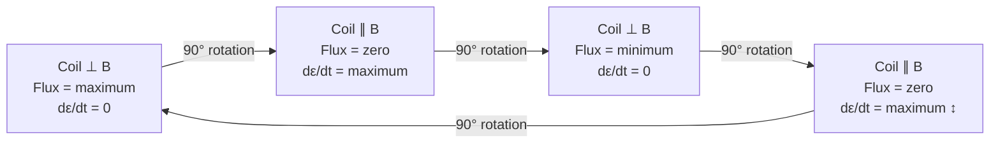

# Alternating Current (A.C.) Fundamentals

## 1. Introduction

A **direct current (DC)** flows steadily in one direction. An **alternating current (AC)** periodically reverses direction, typically in a sinusoidal pattern. Virtually all electrical power distributed commercially — in households, factories, and institutions worldwide — is AC, because it can be efficiently stepped up or down in voltage using transformers, a feat impossible with DC at the same cost. Understanding AC fundamentals is prerequisite to analysing RLC circuits and resonance phenomena.

## 2. Generation of Alternating EMF

An AC generator (alternator) consists of a rectangular coil of $N$ turns rotating with constant angular velocity $\omega$ in a uniform magnetic field $\mathbf{B}$. By Faraday's law, the induced EMF is:

$$\varepsilon(t) = NBA\omega \sin(\omega t) = \varepsilon_m \sin(\omega t) \tag{1}$$

where $\varepsilon_m = NBA\omega$ is the **peak (maximum) EMF**, $A$ is the coil area, and $t = 0$ is chosen when the coil plane is perpendicular to $\mathbf{B}$ (plane of coil parallel to field lines, flux = 0, rate of change of flux maximum).



## 3. Representation of AC Quantities

### 3.1 Instantaneous Values

The instantaneous voltage and current are:

$$v(t) = V_m \sin(\omega t + \phi_v), \qquad i(t) = I_m \sin(\omega t + \phi_i) \tag{2}$$

where:
- $V_m$, $I_m$ — peak (amplitude) values
- $\omega = 2\pi f = 2\pi/T$ — angular frequency (rad s⁻¹)
- $f$ — frequency (Hz); $T$ — time period (s)
- $\phi_v$, $\phi_i$ — initial phase angles (rad)
- **Phase difference:** $\phi = \phi_v - \phi_i$

### 3.2 Phasor Representation

A sinusoidal quantity $A\sin(\omega t + \phi)$ is represented as a **phasor** — a rotating vector of length $A$ making angle $\phi$ with the reference direction at $t = 0$. Phasors rotate counter-clockwise at $\omega$ rad s⁻¹; only their projections onto the vertical (or horizontal) axis give the instantaneous values.

**Phasor diagram convention used here:** horizontal axis = reference ($0°$); phasors drawn at their $t = 0$ angles.

```
       VL
        ↑
        │      (VL leads VR by 90°)
        │
─VC ────┼──── VR  (reference)
        │
        │      (VC lags VR by 90°)
        ↓
       VC

Each arrow represents a phasor (rotating vector).
Only magnitude and relative angle matter.
```

> **Notation note:** HRW and Young & Freedman use $\mathcal{E}_m$ for peak EMF and represent phasors as scalars rotating in a two-dimensional diagram; Serway & Jewett use the same diagram but sometimes define the phase angle $\phi$ as the angle by which voltage *leads* current (so a positive $\phi$ means inductive circuit). All three conventions are equivalent — the key quantity is the *relative* phase between $v$ and $i$.

## 4. RMS (Root Mean Square) Values

For a sinusoidal signal, the power delivered to a resistor is proportional to $i^2$, which oscillates at twice the frequency of $i$. The **RMS value** is the DC equivalent that delivers the same average power:

$$I_{\text{rms}} = \sqrt{\overline{i^2}} = \sqrt{\frac{1}{T}\int_0^T I_m^2 \sin^2(\omega t)\,dt} = \frac{I_m}{\sqrt{2}} \tag{3}$$

$$\boxed{I_{\text{rms}} = \frac{I_m}{\sqrt{2}} \approx 0.707\,I_m} \qquad \boxed{V_{\text{rms}} = \frac{V_m}{\sqrt{2}} \approx 0.707\,V_m}$$

> Household supply quoted as "230 V AC" in Bangladesh (and most of South/Southeast Asia) refers to the RMS voltage; the peak voltage is $V_m = 230\sqrt{2} \approx 325\,\text{V}$.

**Average value** (over a half-cycle, used for rectifier calculations):

$$V_{\text{avg}} = \frac{2V_m}{\pi} \approx 0.637\,V_m \tag{4}$$

## 5. AC Through Pure Resistance

For a pure resistor $R$, Ohm's law applies instantaneously: $v_R = iR$.

- Current: $i = \dfrac{V_m}{R}\sin(\omega t) = I_m\sin(\omega t)$
- **$v_R$ and $i$ are in phase** ($\phi = 0$)
- Average power: $P = V_{\text{rms}} I_{\text{rms}} = \dfrac{V_m^2}{2R} = I_{\text{rms}}^2 R$

## 6. AC Through Pure Inductance

For a pure inductor $L$: $v_L = L\,di/dt$

If $i = I_m\sin(\omega t)$, then:

$$v_L = L \cdot I_m\omega\cos(\omega t) = \underbrace{I_m\omega L}_{V_m}\sin\!\left(\omega t + 90°\right)$$

- **Voltage leads current by 90°** (or current lags voltage by 90°).
- **Inductive reactance:** $X_L = \omega L = 2\pi f L$ (unit: $\Omega$)
- Peak relation: $V_m = I_m X_L \implies I_{\text{rms}} = V_{\text{rms}}/X_L$
- Average power: $P = 0$ (inductor stores and releases energy; net dissipation is zero)
- $X_L$ increases with frequency — inductor blocks high-frequency AC.

## 7. AC Through Pure Capacitance

For a pure capacitor $C$: $i = C\,dv/dt$

If $v = V_m\sin(\omega t)$, then:

$$i = CV_m\omega\cos(\omega t) = \underbrace{CV_m\omega}_{I_m}\sin\!\left(\omega t + 90°\right)$$

- **Current leads voltage by 90°** (or voltage lags current by 90°).
- **Capacitive reactance:** $X_C = \dfrac{1}{\omega C} = \dfrac{1}{2\pi f C}$ (unit: $\Omega$)
- Peak relation: $V_m = I_m X_C \implies I_{\text{rms}} = V_{\text{rms}}/X_C$
- Average power: $P = 0$ (capacitor stores and releases energy; net dissipation is zero)
- $X_C$ decreases with frequency — capacitor passes high-frequency AC.

**Reactance summary:**

| Element | Reactance | Frequency dependence | Phase ($v$ vs $i$) |
|:--------|:----------|:--------------------|:-------------------|
| Resistor $R$ | $R$ (constant) | None | In phase |
| Inductor $L$ | $X_L = \omega L$ | Increases with $f$ | $v$ leads $i$ by 90° |
| Capacitor $C$ | $X_C = 1/(\omega C)$ | Decreases with $f$ | $i$ leads $v$ by 90° |

## 8. Power in AC Circuits

**Instantaneous power:**

$$p(t) = v(t)\cdot i(t) = V_m\sin(\omega t)\cdot I_m\sin(\omega t - \phi) \tag{5}$$

**Average (real) power:**

$$\boxed{P = V_{\text{rms}}\,I_{\text{rms}}\cos\phi} \tag{6}$$

where $\phi$ is the phase angle by which voltage leads current.

- $\cos\phi$ is called the **power factor**
- $\phi = 0$ (pure R): $P = V_{\text{rms}} I_{\text{rms}}$ (maximum)
- $\phi = 90°$ (pure L or C): $P = 0$ (reactive power only)

**Reactive power** $Q_r = V_{\text{rms}} I_{\text{rms}}\sin\phi$ (unit: VAR — volt-ampere reactive)

**Apparent power** $S = V_{\text{rms}} I_{\text{rms}}$ (unit: VA — volt-ampere)

Power triangle: $S^2 = P^2 + Q_r^2$

## 9. Worked Example 1 — AC Through a Resistor (Simple)

**Problem:** A 230 V (rms), 50 Hz AC supply is connected to a $46\,\Omega$ resistor. Find (a) the peak voltage, (b) the rms current, (c) the peak current, and (d) the average power dissipated.

**Solution:**

**(a)** $V_m = V_{\text{rms}}\sqrt{2} = 230\sqrt{2} \approx \boxed{325.3\,\text{V}}$

**(b)** $I_{\text{rms}} = V_{\text{rms}}/R = 230/46 = \boxed{5\,\text{A}}$

**(c)** $I_m = I_{\text{rms}}\sqrt{2} = 5\sqrt{2} \approx \boxed{7.07\,\text{A}}$

**(d)** $P = I_{\text{rms}}^2 R = 25 \times 46 = \boxed{1150\,\text{W}}$

or equivalently $P = V_{\text{rms}} I_{\text{rms}} = 230 \times 5 = 1150\,\text{W}$

## 10. Worked Example 2 — Inductive and Capacitive Reactance (Intermediate)

**Problem:** A 100 V (rms), 50 Hz source is connected separately to (a) a $0.5\,\text{H}$ inductor and (b) a $100\,\mu\text{F}$ capacitor. For each, find the reactance and the rms current. Also find the frequencies at which $X_L = X_C = 50\,\Omega$.

**Solution:**

**(a) Inductor:**

$$X_L = 2\pi f L = 2\pi(50)(0.5) = 50\pi \approx 157.1\,\Omega$$

$$I_{\text{rms}} = \frac{V_{\text{rms}}}{X_L} = \frac{100}{157.1} \approx \boxed{0.637\,\text{A}}$$

**(b) Capacitor:**

$$X_C = \frac{1}{2\pi f C} = \frac{1}{2\pi(50)(100 \times 10^{-6})} = \frac{1}{0.03142} \approx 31.83\,\Omega$$

$$I_{\text{rms}} = \frac{100}{31.83} \approx \boxed{3.14\,\text{A}}$$

**Frequency for $X_L = 50\,\Omega$:**

$$f = \frac{X_L}{2\pi L} = \frac{50}{2\pi \times 0.5} = \frac{50}{\pi} \approx \boxed{15.9\,\text{Hz}}$$

**Frequency for $X_C = 50\,\Omega$:**

$$f = \frac{1}{2\pi C X_C} = \frac{1}{2\pi(100\times10^{-6})(50)} = \frac{1}{0.03142} \approx \boxed{31.8\,\text{Hz}}$$

## 11. Worked Example 3 — Power Factor and Average Power (Advanced)

**Problem:** An AC circuit operates at 240 V (rms), 50 Hz. The load draws a current of 10 A (rms) at a lagging power factor of 0.6. Find (a) the phase angle, (b) the average power consumed, (c) the reactive power, (d) the apparent power, and (e) the value of a series capacitor needed to correct the power factor to unity at 50 Hz, given that the load has resistance $R = 14.4\,\Omega$ and inductance $L$ in series.

**Solution:**

**(a)** $\cos\phi = 0.6 \implies \phi = \cos^{-1}(0.6) = \boxed{53.13°}$ (lagging: $\phi > 0$ means inductive)

**(b)** $P = V_{\text{rms}} I_{\text{rms}}\cos\phi = 240 \times 10 \times 0.6 = \boxed{1440\,\text{W}}$

**(c)** $Q_r = V_{\text{rms}} I_{\text{rms}}\sin\phi = 240 \times 10 \times 0.8 = \boxed{1920\,\text{VAR}}$

**(d)** $S = V_{\text{rms}} I_{\text{rms}} = 240 \times 10 = \boxed{2400\,\text{VA}}$

Check: $S^2 = P^2 + Q_r^2 = 1440^2 + 1920^2 = 2073600 + 3686400 = 5760000 = 2400^2\;\checkmark$

**(e)** Impedance: $Z = V/I = 240/10 = 24\,\Omega$. With $R = 14.4\,\Omega$:

$$X_{\text{net}} = \sqrt{Z^2 - R^2} = \sqrt{576 - 207.36} = \sqrt{368.64} = 19.2\,\Omega \quad (X_L \text{ component})$$

To achieve unity power factor (net reactance = 0), add series capacitor with $X_C = X_L = 19.2\,\Omega$:

$$C = \frac{1}{2\pi f X_C} = \frac{1}{2\pi(50)(19.2)} = \frac{1}{6031.9} \approx \boxed{165.8\,\mu\text{F}}$$

## 12. AC vs DC Comparison

| Feature | Direct Current (DC) | Alternating Current (AC) |
|:--------|:--------------------|:------------------------|
| Direction | Constant | Reverses periodically |
| Waveform | Flat (constant value) | Sinusoidal (typically) |
| Voltage transformation | Not easily changed | Easily stepped up/down via transformer |
| Instantaneous power | $P = VI$ (constant) | $p = V_m I_m \sin(\omega t)\sin(\omega t - \phi)$ |
| Average power | $P = VI = I^2R$ | $P = V_{\text{rms}} I_{\text{rms}}\cos\phi$ |
| Energy storage elements | Capacitor only (steady state) | L and C both active |
| Transmission efficiency | Low (resistive losses over long distance) | High (step-up transmission) |
| Example use | Battery, electronic circuits | Power grid, motors, lighting |

## 13. Practice Problems

1. An AC voltage is described by $v(t) = 311\sin(100\pi t)\,\text{V}$. Find the peak voltage, rms voltage, frequency, and time period.

2. A 60 W, 230 V light bulb operates on 50 Hz AC. Find the peak current through the bulb and its resistance.

3. A $200\,\mu\text{F}$ capacitor is connected to a 120 V (rms), 60 Hz supply. Find the capacitive reactance, the rms current, and state the phase relationship between $v$ and $i$.

4. An inductor of $L = 100\,\text{mH}$ and resistance $R = 10\,\Omega$ (coil resistance) is connected to a 50 V (rms), 200 Hz source. Find the impedance, current, and power factor.

5. A motor draws 8 A at a lagging power factor of 0.75 from a 230 V (rms), 50 Hz supply. Calculate the real power, reactive power, and apparent power. What capacitance connected in parallel would raise the power factor to 0.95 lagging?

## 14. References

1. Halliday, D., Resnick, R., & Walker, J. *Fundamentals of Physics*, 10th ed. Wiley, 2014 — Chapter 31 (Electromagnetic Oscillations and Alternating Current), §31-1 to §31-4.
2. Serway, R. A., & Jewett, J. W. *Physics for Scientists and Engineers*, 9th ed. Cengage, 2014 — Chapter 33 (Alternating-Current Circuits), §33-1 to §33-3.
3. Young, H. D., & Freedman, R. A. *University Physics*, 14th ed. Pearson, 2016 — Chapter 31 (Alternating Current), §31-1 to §31-3.
4. HyperPhysics — AC Circuits: <http://hyperphysics.phy-astr.gsu.edu/hbase/electric/ac.html>
5. MIT OpenCourseWare 8.02 — Lecture 18: AC Circuits: <https://ocw.mit.edu/courses/8-02-physics-ii-electricity-and-magnetism-spring-2007/>
6. Khan Academy — Alternating Current: <https://www.khanacademy.org/science/physics/circuits-topic/circuits-with-capacitors/a/ee-ac-analysis-intro>
7. HyperPhysics — RMS Voltage and Current: <http://hyperphysics.phy-astr.gsu.edu/hbase/electric/rms.html>
