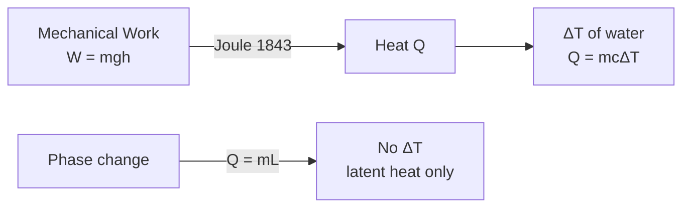

# 01 — Heat

## 1. Overview

Heat is the foundational concept of thermal physics: it is **energy in transit** driven
purely by a temperature difference. This topic establishes the quantitative measure of
heat transfer (calorimetry) and the empirical link between mechanical work and heat
(Joule's experiment). It precedes [→ Temperature](02_temperature.md), which defines the
quantity that drives heat flow, and underpins every process in this unit from Newton's
cooling to the Van der Waals equation.

---

## 2. Definitions & Key Terms

**1. Heat ($Q$)** — *Energy transferred across a system boundary solely as a result of a
temperature difference between the system and its surroundings.*
> Plain-English: Heat is what flows from hot to cold; it is not stored as "heat" inside an
> object — that stored energy is internal energy.

**2. Internal Energy ($U$)** — *The total kinetic and potential energy of all microscopic
constituents of a system.*
> Plain-English: What the molecules actually possess. Heat and work are the two ways to
> change it.

**3. Specific Heat Capacity ($c$)** — *The amount of heat required to raise the
temperature of 1 kg of a substance by 1 K.*
> Plain-English: Water has a large $c$ (4 186 J kg⁻¹ K⁻¹) — it resists temperature change.

**4. Latent Heat ($L$)** — *The heat absorbed or released per unit mass during a phase
transition at constant temperature and pressure.*
> Plain-English: Melting ice absorbs heat without warming up; that "hidden" energy is the
> latent heat.

**5. Mechanical Equivalent of Heat ($J$)** — *The amount of mechanical work equivalent to
one unit of heat; experimentally determined by Joule: $J = 4.186$ J cal⁻¹.*
> Plain-English: Stirring water with a paddle does exactly the same job as adding the
> equivalent amount of heat.

**6. Calorie (cal)** — *Non-SI unit of heat: 1 cal = 4.186 J (International Table calorie).*
> Plain-English: The "Calorie" on food labels is actually 1 kcal = 4 186 J.

---

## 3. Core Content

### 3.1 Heat as Energy Transfer

From the First Law of Thermodynamics:

$$\Delta U = Q - W$$

- $Q > 0$: heat added **to** the system.
- $W > 0$: work done **by** the system.
- For a process with no work done ($W = 0$): $\Delta U = Q$.

> ⚠️ **Sign convention:** Halliday & Resnick (10th ed.) define $W$ as work done **by**
> the system. Some engineering texts define $W$ as work done **on** the system, giving
> $\Delta U = Q + W$. This file follows the physics convention.

### 3.2 Joule's Mechanical Equivalent of Heat

**Experiment (1843):** Joule used a falling weight to rotate a paddle wheel inside an
insulated water container. He measured:

- Mechanical work done by falling weight: $W = mgh$ [J]
- Temperature rise of water: $\Delta T$ [K]
- Calculated heat gained: $Q = mc\Delta T$ [cal]

**Result:**

$$J = \frac{W}{Q} = 4.186 \;\text{J cal}^{-1}$$

This confirmed energy conservation across mechanical and thermal domains.

### 3.3 Calorimetry

For a substance of mass $m$ [kg], specific heat capacity $c$ [J kg⁻¹ K⁻¹], undergoing
temperature change $\Delta T$ [K]:

$$\boxed{Q = mc\Delta T}$$

For a **phase transition** (e.g., melting, boiling) at constant $T$:

$$\boxed{Q = mL}$$

where $L$ is the latent heat [J kg⁻¹].

**Principle of Calorimetry** (closed, thermally isolated system):

$$Q_{\text{lost}} = Q_{\text{gained}}$$

$$\sum m_i c_i \Delta T_i = 0$$

Every term carries its own sign via $\Delta T = T_f - T_i$.

### 3.4 Selected Specific Heat Capacities (at 25 °C, 1 atm)

| Substance | $c$ (J kg⁻¹ K⁻¹) |
|-----------|------------------|
| Water (liquid) | 4 186 |
| Ice | 2 090 |
| Steam | 2 010 |
| Copper | 385 |
| Aluminium | 900 |
| Iron | 450 |

*(Source: Halliday, Resnick & Walker, 10th ed., Table 18-3)*

---

## 4. Worked Examples

### Example 1 — 🟢 Foundational

**Problem:** How much heat is required to raise the temperature of 2.0 kg of water from
20 °C to 80 °C?

**Given:** $m = 2.0$ kg, $c = 4186$ J kg⁻¹ K⁻¹, $\Delta T = 80 - 20 = 60$ K

**Solution**

Step 1: Apply $Q = mc\Delta T$

$$Q = 2.0 \times 4186 \times 60$$

Step 2: Compute

$$Q = 2.0 \times 4186 \times 60 = 502\,320 \;\text{J}$$

**Answer: $Q \approx 5.02 \times 10^5$ J (502 kJ)**

---

### Example 2 — 🟡 Intermediate

**Problem:** A 0.50 kg copper calorimeter (specific heat 385 J kg⁻¹ K⁻¹) contains 0.20
kg of water at 20 °C. A 0.10 kg piece of iron (specific heat 450 J kg⁻¹ K⁻¹) at 200 °C
is placed into the water. Find the final equilibrium temperature. (Ignore heat loss.)

**Given:** $m_{\text{Cu}} = 0.50$ kg, $c_{\text{Cu}} = 385$ J kg⁻¹ K⁻¹; $m_w = 0.20$ kg, $c_w = 4186$ J kg⁻¹ K⁻¹; $m_{\text{Fe}} = 0.10$ kg, $c_{\text{Fe}} = 450$ J kg⁻¹ K⁻¹; $T_{\text{Fe}} = 200$ °C, $T_0 = 20$ °C.

**Solution**

Step 1: Energy balance (heat gained = heat lost)

$$m_w c_w (T_f - 20) + m_{\text{Cu}} c_{\text{Cu}} (T_f - 20) = m_{\text{Fe}} c_{\text{Fe}} (200 - T_f)$$

Step 2: Compute coefficients

Left: $(0.20 \times 4186 + 0.50 \times 385)(T_f - 20) = (837.2 + 192.5)(T_f - 20) = 1029.7(T_f - 20)$

Right: $0.10 \times 450 \times (200 - T_f) = 45(200 - T_f)$

Step 3: Solve

$$1029.7\,T_f - 20\,594 = 9000 - 45\,T_f$$

$$1074.7\,T_f = 29\,594$$

$$\boxed{T_f \approx 27.5\;^\circ\text{C}}$$

---

### Example 3 — 🔴 Advanced / Exam-Level

**Problem:** In Joule's paddle-wheel experiment, a 5.0 kg mass falls through a height of
8.0 m and all the work is converted to heat, raising the temperature of 0.20 kg of water.
(a) Calculate the heat generated. (b) Find the temperature rise. (c) If 20% of the
work is lost to friction in the pulley, how does the answer change? ($g = 9.8$ m s⁻²,
$c_w = 4186$ J kg⁻¹ K⁻¹)

**Solution**

**Part (a):** Total work done

$$W = mgh = 5.0 \times 9.8 \times 8.0 = 392 \;\text{J}$$

**Part (b):** Temperature rise (100% conversion)

$$Q = W = 392 \;\text{J}$$
$$\Delta T = \frac{Q}{m_w c_w} = \frac{392}{0.20 \times 4186} = \frac{392}{837.2}$$

$$\boxed{\Delta T \approx 0.468 \;\text{K}}$$

**Part (c):** Only 80% of work heats water

$$Q' = 0.80 \times 392 = 313.6 \;\text{J}$$
$$\Delta T' = \frac{313.6}{837.2} \approx \boxed{0.375 \;\text{K}}$$

*Unit check:* $\text{J} / (\text{kg} \cdot \text{J\,kg}^{-1}\text{K}^{-1}) = \text{K}$ ✓

---

## 5. Applications

**Textile Dye-Bath Temperature Control** — Industrial dyeing requires precise temperature
ramps (e.g., heating a 500 L dye bath from 20 °C to 98 °C). Engineers apply $Q = mc\Delta T$
to size the steam heater, accounting for the specific heat of the water-dye solution.

**Calorimetric Analysis of Fibres** — Differential Scanning Calorimetry (DSC) uses the
principle of calorimetry to measure the latent heat of crystallisation of polymer fibres
(e.g., PET), giving data on degree of crystallinity — a direct quality indicator in yarn
and fabric manufacturing.

---

## 6. Diagram / Visual

*Figure 1: Energy pathways — Joule's experiment links mechanical work to heat;
calorimetry links heat to temperature change or phase change.*

---

## 7. Common Mistakes

- ❌ **Mistake:** Treating heat as a substance stored inside an object.
  ✅ **Correct:** Heat is a process (energy in transit). Objects possess internal energy, not heat.

- ❌ **Mistake:** Using $\Delta T$ in °C where absolute temperature is needed (e.g., gas law problems).
  ✅ **Correct:** In $Q = mc\Delta T$, intervals in °C and K are numerically equal, so either works. But always use K when $T$ appears without a difference (e.g., $PV = nRT$).

- ❌ **Mistake:** Forgetting the sign of $Q$ in calorimetry and getting energy balance backwards.
  ✅ **Correct:** Define $\sum Q_i = 0$ for all bodies in an isolated system; the signs come automatically from $\Delta T = T_f - T_i$.

- ❌ **Mistake:** Using $Q = mL$ for non-phase-change heating.
  ✅ **Correct:** $Q = mL$ applies only when phase transition is occurring at constant temperature. For heating/cooling, use $Q = mc\Delta T$.

---

## 8. Practice Problems

**Problem 1:** 3.0 kg of iron at 150 °C is dropped into 2.0 kg of water at 25 °C. Find the
equilibrium temperature. ($c_{\text{Fe}} = 450$ J kg⁻¹ K⁻¹, $c_w = 4186$ J kg⁻¹ K⁻¹)

Solution

Heat lost by iron = Heat gained by water:
$m_{\text{Fe}} c_{\text{Fe}} (150 - T_f) = m_w c_w (T_f - 25)$

$3.0 \times 450 \times (150 - T_f) = 2.0 \times 4186 \times (T_f - 25)$

$1350(150 - T_f) = 8372(T_f - 25)$

$202\,500 - 1350\,T_f = 8372\,T_f - 209\,300$

$411\,800 = 9722\,T_f$

$$\boxed{T_f \approx 42.4\;^\circ\text{C}}$$

---

**Problem 2:** How much heat is needed to convert 0.50 kg of ice at −10 °C to steam at
120 °C? ($c_{\text{ice}} = 2090$ J kg⁻¹ K⁻¹, $L_f = 334\,000$ J kg⁻¹, $c_w = 4186$ J kg⁻¹ K⁻¹, $L_v = 2\,260\,000$ J kg⁻¹, $c_{\text{steam}} = 2010$ J kg⁻¹ K⁻¹)

Solution

Five stages:

1. Ice −10 → 0 °C: $Q_1 = 0.50 \times 2090 \times 10 = 10\,450$ J
2. Melt ice at 0 °C: $Q_2 = 0.50 \times 334\,000 = 167\,000$ J
3. Water 0 → 100 °C: $Q_3 = 0.50 \times 4186 \times 100 = 209\,300$ J
4. Boil at 100 °C: $Q_4 = 0.50 \times 2\,260\,000 = 1\,130\,000$ J
5. Steam 100 → 120 °C: $Q_5 = 0.50 \times 2010 \times 20 = 20\,100$ J

$$Q_{\text{total}} = 10\,450 + 167\,000 + 209\,300 + 1\,130\,000 + 20\,100$$

$$\boxed{Q_{\text{total}} = 1\,536\,850 \approx 1.54 \times 10^6 \;\text{J}}$$

---

**Problem 3 (Exam-level):** A thermally insulated flask contains 200 g of water at 80 °C and
100 g of ice at 0 °C. Find the final temperature and mass of ice remaining (if any). ($L_f = 334\,000$ J kg⁻¹, $c_w = 4186$ J kg⁻¹ K⁻¹)

Solution

Maximum heat ice can absorb (melt all ice): $Q_{\text{melt}} = 0.100 \times 334\,000 = 33\,400$ J

Maximum heat water can release (cool to 0 °C): $Q_{\text{water}} = 0.200 \times 4186 \times 80 = 66\,976$ J

Since $Q_{\text{water}} > Q_{\text{melt}}$, all ice melts. Remaining heat after melting all ice:
$Q_r = 66\,976 - 33\,400 = 33\,576$ J

This heats the total 300 g water from 0 °C:
$\Delta T = \dfrac{33\,576}{0.300 \times 4186} = \dfrac{33\,576}{1255.8} \approx 26.7$ K

$$\boxed{T_f \approx 26.7\;^\circ\text{C},\quad m_{\text{ice remaining}} = 0}$$

---

## 9. Summary

| Concept | Result | Condition / Limit |
|---------|--------|------------------|
| Sensible heat | $Q = mc\Delta T$ | No phase change |
| Latent heat | $Q = mL$ | Phase change at const. $T$ |
| First Law | $\Delta U = Q - W$ | Any process |
| Mechanical equivalent | $1\;\text{cal} = 4.186\;\text{J}$ | Empirical (Joule) |
| Calorimetry | $\sum Q_i = 0$ | Isolated system |

Next: [→ Temperature](02_temperature.md) — the thermodynamic quantity that determines the *direction* of heat flow.

---

## 10. References

1. **Halliday, D., Resnick, R. & Walker, J. — *Fundamentals of Physics*, 10th ed., Chapter 18.**
   Establishes heat, internal energy, and calorimetry with clear sign conventions.
   [Wiley]

2. **Serway, R.A. & Jewett, J.W. — *Physics for Scientists and Engineers*, 9th ed., Chapter 20.**
   Alternative derivations and worked calorimetry examples.

3. **HyperPhysics — Heat and Thermodynamics.**
   Concise concept maps with interactive formulae.
   [http://hyperphysics.phy-astr.gsu.edu/hbase/thermo/heat.html](http://hyperphysics.phy-astr.gsu.edu/hbase/thermo/heat.html)

4. **NIST Chemistry WebBook — Thermophysical Properties.**
   Authoritative tables of specific heats and latent heats.
   [https://webbook.nist.gov](https://webbook.nist.gov)
