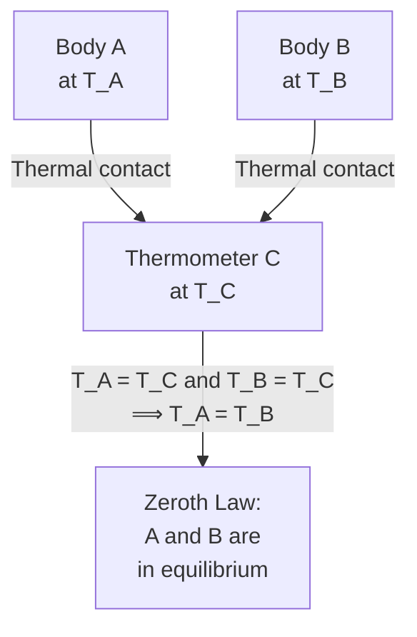

# 02 — Temperature

## 1. Overview

Temperature is the quantity that determines whether two bodies in thermal contact are in
equilibrium. This topic formalises the Zeroth Law, establishes common temperature scales,
and introduces the thermodynamic (Kelvin) scale — the scale that appears in all gas-law
formulae later in this unit. Builds on [→ Heat](01_heat.md); enables
[→ Types of Thermometer](03_different_types_of_thermometer.md).

---

## 2. Definitions & Key Terms

**1. Temperature** — *A scalar property of a body that determines the direction of heat
flow between it and another body in thermal contact.*
> Plain-English: The "hotness" property — heat always flows from high $T$ to low $T$.

**2. Zeroth Law of Thermodynamics** — *If body A is in thermal equilibrium with body C,
and body B is also in thermal equilibrium with body C, then A and B are in thermal
equilibrium with each other.*
> Plain-English: A thermometer (C) can mediate temperature comparison between two bodies.
> This law justifies the concept of temperature measurement.

**3. Thermometric Property** — *Any physical property that changes reproducibly and
measurably with temperature (e.g., length, resistance, EMF, pressure).*

**4. Absolute Zero (0 K)** — *The theoretical lower bound of temperature at which the
entropy of a perfect crystal is zero and all classical molecular motion ceases.*
$0\;\text{K} = -273.15\;^\circ\text{C}$

**5. Triple Point of Water** — *The unique temperature (273.16 K, 611.73 Pa) at which
liquid water, ice, and water vapour coexist in thermodynamic equilibrium.* Used to define
the Kelvin scale.

---

## 3. Core Content

### 3.1 Zeroth Law and Temperature as a Concept

Without the Zeroth Law, there is no logical basis for assigning a single number "temperature"
to a body. The law establishes **thermal equilibrium** as an equivalence relation, allowing
bodies to be sorted onto a temperature axis.

### 3.2 Temperature Scales

| Scale | Freezing point of water | Boiling point of water | Absolute zero |
|-------|------------------------|----------------------|---------------|
| Celsius (°C) | 0 °C | 100 °C | −273.15 °C |
| Fahrenheit (°F) | 32 °F | 212 °F | −459.67 °F |
| Kelvin (K) | 273.15 K | 373.15 K | 0 K |

**Conversion formulae:**

$$T(\text{K}) = T(^\circ\text{C}) + 273.15$$

$$T(^\circ\text{F}) = \frac{9}{5}\,T(^\circ\text{C}) + 32$$

$$T(^\circ\text{C}) = \frac{5}{9}\bigl[T(^\circ\text{F}) - 32\bigr]$$

### 3.3 The Thermodynamic (Kelvin) Scale

The Kelvin scale is defined independently of any thermometric substance using the
efficiency of a Carnot engine:

$$\frac{T_{\text{cold}}}{T_{\text{hot}}} = 1 - \eta_{\text{Carnot}}$$

In practice it is anchored by **one fixed point**: the triple point of water = 273.16 K
(exactly). The scale is absolute — it does not depend on the properties of any particular
material.

### 3.4 Temperature and Molecular Kinetic Energy

From kinetic theory (Topic 08), the mean translational kinetic energy of a molecule:

$$\langle KE_{\text{trans}}\rangle = \frac{3}{2}k_B T$$

where $k_B = 1.380 \times 10^{-23}$ J K⁻¹. This gives temperature a **microscopic
interpretation**: it is proportional to mean translational KE. This is why the Kelvin
scale, not Celsius, appears in gas-law equations.

### 3.5 Limits of Validity

- The classical relation $\langle KE\rangle \propto T$ breaks down near absolute zero
  (quantum effects dominate).
- Temperatures measured by different thermometric properties agree only when the
  properties themselves are linear in $T$. The gas thermometer is the fundamental standard
  because it approaches this limit.

---

## 4. Worked Examples

### Example 1 — 🟢 Foundational

**Problem:** Convert 37 °C (normal body temperature) to Kelvin and Fahrenheit.

**Solution**

Kelvin:
$$T = 37 + 273.15 = \boxed{310.15\;\text{K}}$$

Fahrenheit:
$$T = \frac{9}{5} \times 37 + 32 = 66.6 + 32 = \boxed{98.6\;^\circ\text{F}}$$

---

### Example 2 — 🟡 Intermediate

**Problem:** At what temperature do the Celsius and Fahrenheit scales give the same
numerical reading?

**Solution**

Set $T(^\circ\text{C}) = T(^\circ\text{F}) = x$:

$$x = \frac{9}{5}x + 32$$

$$x - \frac{9}{5}x = 32 \implies -\frac{4}{5}x = 32 \implies x = -40$$

$$\boxed{T = -40\;^\circ\text{C} = -40\;^\circ\text{F}}$$

---

### Example 3 — 🔴 Advanced / Exam-Level

**Problem:** A constant-volume gas thermometer records a pressure of $1.500 \times 10^4$ Pa
at the triple point of water. At an unknown temperature, the pressure is $2.050 \times 10^4$ Pa.
Find the unknown temperature in Kelvin and Celsius. Also state why this thermometer
defines the temperature scale more reliably than a mercury thermometer.

**Solution**

The constant-volume gas thermometer defines temperature by:

$$T = 273.16\;\text{K} \times \frac{P}{P_{\text{triple}}}$$

Step 1: Substitute values

$$T = 273.16 \times \frac{2.050 \times 10^4}{1.500 \times 10^4} = 273.16 \times 1.3\overline{6}$$

Step 2: Compute

$$T = 273.16 \times 1.3667 = \boxed{373.4\;\text{K} \approx 100.2\;^\circ\text{C}}$$

*Why more reliable:* All ideal gases converge to the same $T$-versus-$P$ relationship
as pressure → 0. Mercury expands non-linearly, so readings depend on mercury's specific
expansion properties. The gas thermometer's readings are independent of the working gas
in the ideal-gas limit.

---

## 5. Applications

**Textile Processing Control** — Wet processing (dyeing, bleaching, finishing) requires
precise temperature in Celsius, but the physics (reaction rate, Arrhenius equation) uses
absolute temperature in Kelvin. Engineers must convert correctly to model rate constants.

**Fibre Identification by DSC** — Differential Scanning Calorimetry reports endothermic/
exothermic transitions in K (or °C), enabling identification of fibres (e.g., nylon melts
at ~493 K, polyester at ~530 K). The Kelvin scale is essential for thermodynamic
calculations.

---

## 6. Diagram / Visual

*Figure 1: The Zeroth Law of Thermodynamics — the logical basis for thermometry.*

---

## 7. Common Mistakes

- ❌ **Mistake:** Using °C in gas-law calculations ($PV = nRT$).
  ✅ **Correct:** Always convert to Kelvin before substituting into any gas law. Only temperature *differences* are numerically equal in K and °C.

- ❌ **Mistake:** Confusing the triple point (273.16 K) with the ice point (273.15 K).
  ✅ **Correct:** The Kelvin scale is defined at the triple point (273.16 K). The ice point is 273.15 K — a difference of 0.01 K.

- ❌ **Mistake:** Applying Celsius-to-Fahrenheit formula as $T_F = (9/5)T_C - 32$.
  ✅ **Correct:** $T(^\circ\text{F}) = (9/5)\,T(^\circ\text{C}) + 32$. The $+32$ accounts for the offset of the Fahrenheit scale.

- ❌ **Mistake:** Thinking absolute zero can be reached experimentally.
  ✅ **Correct:** The Third Law of Thermodynamics states that absolute zero can be approached but never reached in a finite number of steps.

---

## 8. Practice Problems

**Problem 1:** The surface temperature of the Sun is approximately 5778 K. Convert to °C and °F.

Solution

°C: $5778 - 273.15 = 5504.85 \approx \boxed{5505\;^\circ\text{C}}$

°F: $\frac{9}{5} \times 5505 + 32 = 9909 + 32 = \boxed{9941\;^\circ\text{F}}$

---

**Problem 2:** A constant-volume gas thermometer has pressure 1.33 × 10⁴ Pa at the
triple point. Find the temperature at which the pressure is 1.80 × 10⁴ Pa.

Solution

$$T = 273.16 \times \frac{1.80 \times 10^4}{1.33 \times 10^4} = 273.16 \times 1.353$$

$$\boxed{T \approx 369.6\;\text{K} = 96.4\;^\circ\text{C}}$$

---

**Problem 3 (Exam-level):** Two temperature scales X and Y are defined such that: on
scale X, the ice point is 20 X and boiling point is 120 X; on scale Y, the ice point is
−10 Y and boiling point is 130 Y. If a body reads 60 X, find its temperature in Y and
in °C.

Solution

Fraction of interval from ice to boiling on scale X:
$$\frac{60 - 20}{120 - 20} = \frac{40}{100} = 0.40$$

Scale Y at the same fraction:
$$T_Y = -10 + 0.40 \times (130 - (-10)) = -10 + 0.40 \times 140 = -10 + 56 = \boxed{46\;\text{Y}}$$

Celsius (same fraction, 0 to 100 °C):
$$T = 0 + 0.40 \times 100 = \boxed{40\;^\circ\text{C}}$$

---

## 9. Summary

| Concept | Result | Condition / Limit |
|---------|--------|------------------|
| Zeroth Law | Basis of thermometry | Two bodies in equilibrium with a third are in equilibrium with each other |
| K ↔ °C | $T(\text{K}) = T(^\circ\text{C}) + 273.15$ | Exact by definition |
| °C ↔ °F | $T_F = (9/5)T_C + 32$ | — |
| Kelvin anchor | Triple point = 273.16 K | Fixed by SI definition |
| Microscopic meaning | $\langle KE\rangle = \frac{3}{2}k_BT$ | Ideal gas, translational only |

Next: [→ Different Types of Thermometer](03_different_types_of_thermometer.md) — devices
that exploit thermometric properties to measure temperature.

---

## 10. References

1. **Halliday, Resnick & Walker — *Fundamentals of Physics*, 10th ed., Chapter 18.** Temperature scales, zeroth law, and constant-volume gas thermometer.

2. **Serway & Jewett — *Physics for Scientists and Engineers*, 9th ed., Chapter 19.** Triple-point definition and Kelvin scale.

3. **HyperPhysics — Temperature Scales.** [http://hyperphysics.phy-astr.gsu.edu/hbase/thermo/temscal.html](http://hyperphysics.phy-astr.gsu.edu/hbase/thermo/temscal.html)

4. **BIPM — SI Brochure (9th ed., 2019).** Formal definition of the kelvin via Boltzmann constant.
   [https://www.bipm.org/en/publications/si-brochure](https://www.bipm.org/en/publications/si-brochure)
