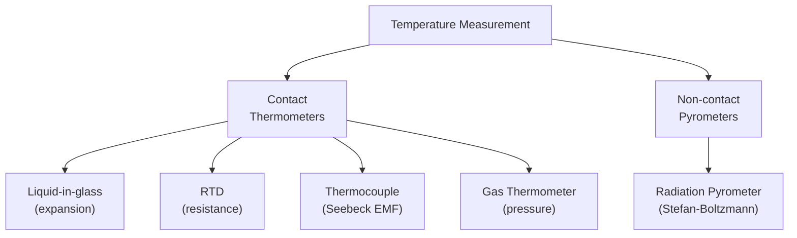

# 03 — Different Types of Thermometer

## 1. Overview

A thermometer converts temperature into a measurable physical signal. This topic surveys
the main types used in science and industry, the thermometric properties each exploits,
their working ranges, and their advantages/limitations. Directly follows
[→ Temperature](02_temperature.md) and provides experimental context for
[→ Newton's Law of Cooling](04_newtons_law_of_cooling.md).

---

## 2. Definitions & Key Terms

**1. Thermometric Property** — *A physical quantity that varies continuously and
reproducibly with temperature.*

**2. Fixed Points** — *Well-defined, reproducible temperature references (e.g., triple
point of water) used to calibrate thermometers.*

**3. Range** — *The interval of temperatures over which a thermometer gives reliable,
accurate readings.*

**4. Sensitivity** — *The change in thermometric property per unit change in temperature.*

**5. Seebeck Effect** — *An EMF that develops at the junction of two dissimilar metals when
the junction is at a different temperature from the reference.*

---

## 3. Core Content

### 3.1 Principle of Thermometry

All thermometers require:
1. A **thermometric substance** (mercury, platinum, gas, …).
2. A **thermometric property** ($\ell$, $R$, EMF, $P$, …) that varies with $T$.
3. **Calibration** at fixed points.

The relationship assumed between property $X$ and temperature:

$$T = \frac{X - X_{\text{lower}}}{X_{\text{upper}} - X_{\text{lower}}} \times 100\;^\circ\text{C}$$

(linear interpolation between ice point and steam point — valid only if the property is
truly linear in $T$).

---

### 3.2 Liquid-in-Glass Thermometer

**Thermometric property:** Thermal expansion of liquid ($\ell \propto T$).

**Types:**
- **Mercury:** Range −39 °C to 357 °C (limited by mercury's freezing and boiling points). Accurate, reads in isolation.
- **Alcohol (ethanol):** Range −115 °C to 78 °C. Used for low-temperature work.

**Advantages:** Simple, cheap, direct reading, self-contained.

**Disadvantages:** Mercury is toxic; glass can break; slow response; cannot record or transmit readings; parallax error.

---

### 3.3 Resistance Thermometer (RTD)

**Thermometric property:** Electrical resistance of a metal increases with temperature.

For platinum (Pt-100):

$$R(T) = R_0\bigl(1 + \alpha T + \beta T^2\bigr)$$

where $R_0 = 100\;\Omega$ at 0 °C, $\alpha = 3.9083 \times 10^{-3}\;^\circ\text{C}^{-1}$,
$\beta = -5.775 \times 10^{-7}\;^\circ\text{C}^{-2}$.

**Range:** −200 °C to 850 °C (platinum). High precision ($\pm 0.01$ °C).

**Advantages:** High accuracy, stable, suitable for remote and continuous measurement.

**Disadvantages:** Requires external circuit; expensive platinum element.

---

### 3.4 Thermocouple

**Thermometric property:** Seebeck EMF at a bimetal junction.

$$\mathcal{E} = a\Delta T + b(\Delta T)^2 \quad [\mu\text{V}]$$

(coefficients $a$, $b$ depend on the metal pair)

**Common types:**

| Type | Metals | Range |
|------|--------|-------|
| K | Chromel / Alumel | −200 °C to 1260 °C |
| J | Iron / Constantan | −40 °C to 750 °C |
| S | Pt / Pt-10%Rh | 0 °C to 1600 °C |

**Advantages:** Wide range, fast response, rugged, inexpensive, point measurement.

**Disadvantages:** Low output (µV range); requires reference junction compensation; less accurate than RTD at moderate temperatures.

---

### 3.5 Constant-Volume Gas Thermometer

**Thermometric property:** Pressure of a fixed amount of gas at fixed volume:
$P \propto T$ (ideal gas).

$$T = 273.16\;\text{K} \times \lim_{P_{\text{tp}} \to 0} \frac{P}{P_{\text{tp}}}$$

**Range:** 1 K to ~1000 K (hydrogen); 14 K to ~500 K (nitrogen).

**Advantages:** Defines the thermodynamic temperature scale; most accurate primary thermometer.

**Disadvantages:** Large and complex; not portable; requires long time to reach equilibrium; gas correction needed at high pressures.

---

### 3.6 Radiation Pyrometer (Non-contact)

**Thermometric property:** Thermal radiation intensity (Stefan-Boltzmann law):
$P = \sigma A T^4$.

**Types:**
- **Total-radiation pyrometer:** Collects all wavelengths.
- **Optical pyrometer:** Matches target brightness to standard filament at a specific wavelength.

**Range:** ~700 °C to >3000 °C.

**Advantages:** Non-contact; measures very high temperatures (molten metal, stars).

**Disadvantages:** Requires knowledge of emissivity; reflects ambient radiation; less accurate for low temperatures.

---

### 3.7 Comparison Table

| Type | Property | Range | Accuracy | Advantages |
|------|----------|-------|----------|------------|
| Mercury-in-glass | Liquid expansion | −39 to 357 °C | ±0.1 °C | Simple, direct |
| Alcohol-in-glass | Liquid expansion | −115 to 78 °C | ±1 °C | Low-temp use |
| RTD (Platinum) | Electrical resistance | −200 to 850 °C | ±0.01 °C | High accuracy |
| Thermocouple | Seebeck EMF | −200 to 1600 °C | ±0.5–2 °C | Wide range, fast |
| Gas thermometer | Gas pressure | 1 to ~1000 K | ±0.001 K | Defines scale |
| Radiation pyrometer | Thermal radiation | 700 to >3000 °C | ±5–10 °C | Non-contact |

---

## 4. Worked Examples

### Example 1 — 🟢 Foundational

**Problem:** A Pt-100 RTD has resistance 100.00 Ω at 0 °C and 138.51 Ω at 100 °C (linear
model). Find the temperature when the resistance is 119.40 Ω.

**Solution**

Using linear interpolation:

$$T = \frac{R - R_0}{R_{100} - R_0} \times 100 = \frac{119.40 - 100.00}{138.51 - 100.00} \times 100$$

$$T = \frac{19.40}{38.51} \times 100 = 0.504 \times 100 = \boxed{50.4\;^\circ\text{C}}$$

---

### Example 2 — 🟡 Intermediate

**Problem:** A type-K thermocouple has EMF described by $\mathcal{E} = 40.4\,\mu\text{V}\,^\circ\text{C}^{-1} \times \Delta T$ (linear approximation). The reference junction is at 0 °C and the output EMF is 8.08 mV. Find the measurement temperature.

**Solution**

Step 1: Convert EMF to µV: $\mathcal{E} = 8080\;\mu\text{V}$

Step 2: Solve for $\Delta T$:

$$\Delta T = \frac{\mathcal{E}}{40.4} = \frac{8080}{40.4} = 200\;^\circ\text{C}$$

Step 3: Since reference = 0 °C:

$$\boxed{T_{\text{measurement}} = 200\;^\circ\text{C}}$$

---

### Example 3 — 🔴 Advanced / Exam-Level

**Problem:** A platinum RTD obeys $R(T) = R_0(1 + \alpha T + \beta T^2)$ with
$R_0 = 100\;\Omega$, $\alpha = 3.908 \times 10^{-3}\;^\circ\text{C}^{-1}$,
$\beta = -5.80 \times 10^{-7}\;^\circ\text{C}^{-2}$.

(a) Calculate $R$ at 400 °C.
(b) If a linear model using only $\alpha$ is used for the same 400 °C, find the % error.

**Solution**

**Part (a):** Full quadratic

$$R = 100 \bigl(1 + 3.908 \times 10^{-3} \times 400 + (-5.80 \times 10^{-7}) \times 400^2\bigr)$$

$$= 100\bigl(1 + 1.5632 - 0.09280\bigr) = 100 \times 2.4704$$

$$\boxed{R_{\text{quad}} = 247.04\;\Omega}$$

**Part (b):** Linear model

$$R_{\text{lin}} = 100(1 + 3.908 \times 10^{-3} \times 400) = 100 \times 2.5632 = 256.32\;\Omega$$

% error:

$$\epsilon = \frac{256.32 - 247.04}{247.04} \times 100 = \frac{9.28}{247.04} \times 100 = \boxed{3.76\%}$$

*This illustrates why the $\beta T^2$ correction cannot be ignored at high temperatures.*

---

## 5. Applications

**Autoclave Temperature Monitoring (Textile)** — Industrial autoclaves used for polyester dyeing at 130 °C use RTDs because the high pressure and temperature exceed the range of glass thermometers; RTDs provide continuous electronic recording for process control.

**Steel Furnace Temperature (Pyrometer)** — Liquid steel at ~1600 °C cannot be measured by contact thermometers; radiation pyrometers using the Stefan-Boltzmann law provide real-time non-contact readings essential for quality control.

---

## 6. Diagram / Visual

*Figure 1: Classification of thermometers by measurement principle.*

---

## 7. Common Mistakes

- ❌ **Mistake:** Assuming all thermometers agree at every temperature.
  ✅ **Correct:** Thermometers calibrated at two fixed points only agree perfectly at those points; between them, readings differ depending on the linearity of the thermometric property. The gas thermometer is the primary standard.

- ❌ **Mistake:** Ignoring emissivity when using a radiation pyrometer.
  ✅ **Correct:** Real objects emit less than a blackbody. Uncorrected readings overestimate $T$ for $\varepsilon < 1$.

- ❌ **Mistake:** Confusing the reference junction and measuring junction in a thermocouple.
  ✅ **Correct:** Only the temperature *difference* between junctions matters; the reference junction must be held at a known temperature (usually 0 °C ice bath or electronically compensated).

---

## 8. Practice Problems

**Problem 1:** Convert the Pt-100 resistance formula to find the temperature when
$R = 157.33\;\Omega$, using a linear model with $\alpha = 3.908 \times 10^{-3}\;^\circ\text{C}^{-1}$.

Solution

$R = R_0(1 + \alpha T) \implies T = \dfrac{R/R_0 - 1}{\alpha} = \dfrac{157.33/100 - 1}{3.908 \times 10^{-3}}$

$T = \dfrac{0.5733}{3.908 \times 10^{-3}} = \boxed{146.7\;^\circ\text{C}}$

---

**Problem 2:** A mercury thermometer reads 30 °C and an alcohol thermometer reads 30.5 °C
at the same location. Identify two reasons for the discrepancy.

Solution

1. The expansion of mercury and alcohol are not perfectly linear in the same ratio across the entire temperature range — readings agree only at the calibration fixed points.
2. Parallax error or different capillary bore sizes may introduce systematic reading differences.

---

## 9. Summary

| Thermometer | Property | Typical Range | Best Use |
|-------------|----------|---------------|----------|
| Mercury glass | Liquid expansion | −39 to 357 °C | Lab, medical |
| RTD (Pt) | Resistance | −200 to 850 °C | High-accuracy industry |
| Thermocouple | Seebeck EMF | −200 to 1600 °C | High-temp, remote |
| Gas thermometer | Gas pressure | 1 to ~1000 K | Primary standard |
| Pyrometer | Radiation | >700 °C | Non-contact, extreme T |

Next: [→ Newton's Law of Cooling](04_newtons_law_of_cooling.md) — quantitative law for
how temperature evolves with time as a body cools to its surroundings.

---

## 10. References

1. **Halliday, Resnick & Walker — *Fundamentals of Physics*, 10th ed., Ch. 18.** Fixed points, thermometric properties, and the gas thermometer.
2. **Serway & Jewett — *Physics for Scientists & Engineers*, 9th ed., Ch. 19.** Types of thermometers and temperature scales.
3. **HyperPhysics — Thermometry.** [http://hyperphysics.phy-astr.gsu.edu/hbase/thermo/thermo.html](http://hyperphysics.phy-astr.gsu.edu/hbase/thermo/thermo.html)
4. **IEC 60751:2022 — Industrial Platinum Resistance Thermometers.** Defines Pt-100 standard coefficients. [https://www.iec.ch](https://www.iec.ch)
