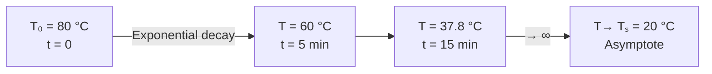

# 04 — Newton's Law of Cooling

## 1. Overview

Newton's Law of Cooling is an empirical rule relating the rate of temperature change of a
body to its excess temperature above the surroundings. It connects the macroscopic
thermometry of [→ Temperature](02_temperature.md) to a differential equation whose
solution describes real cooling behaviour. It is the foundational law for
[→ Isothermal and Adiabatic Processes](05_isothermal_and_adiabatic_process.md) and
provides direct exam-style calculation practice.

---

## 2. Definitions & Key Terms

**1. Newton's Law of Cooling** — *The rate of heat loss of a body is directly proportional
to the difference in temperature between the body and its surroundings, provided the
temperature difference is small.*

**2. Cooling Constant ($k$)** — *A positive proportionality constant [s⁻¹] that depends
on the surface area, surface emissivity, and the nature of the medium surrounding the body.*

**3. Excess Temperature ($\theta$)** — *$\theta = T - T_s$, where $T$ is the body
temperature and $T_s$ is the ambient (surroundings) temperature [K or °C — difference is the same].*

**4. Exponential Decay** — *A function of the form $e^{-kt}$, which describes how the
excess temperature approaches zero asymptotically.*

---

## 3. Core Content

### 3.1 Statement of the Law

$$\boxed{-\frac{dT}{dt} = k(T - T_s)}$$

- $T$ = temperature of body [K or °C] at time $t$ [s]
- $T_s$ = surrounding temperature (constant) [K or °C]
- $k$ = cooling constant [s⁻¹], $k > 0$
- The minus sign on the left confirms: temperature **falls** when $T > T_s$.

Equivalently, using $\theta = T - T_s$:

$$\frac{d\theta}{dt} = -k\theta$$

### 3.2 Derivation of the Differential Equation

Newton's law is an approximation of **Newton's radiation law** (which itself approximates
the Stefan-Boltzmann radiation law for small excess temperatures). The Stefan-Boltzmann
power radiated by a body:

$$P_{\text{rad}} = \varepsilon \sigma A T^4$$

Net power lost to surroundings:

$$P_{\text{net}} = \varepsilon \sigma A (T^4 - T_s^4)$$

For small excess temperature $\delta = T - T_s \ll T_s$:

$$T^4 - T_s^4 = (T_s + \delta)^4 - T_s^4 \approx 4T_s^3\,\delta$$

$$P_{\text{net}} \approx 4\varepsilon \sigma A T_s^3 (T - T_s) = k'(T - T_s)$$

Since $P = -mc\,dT/dt$:

$$\frac{dT}{dt} = -\frac{k'}{mc}(T - T_s) = -k(T - T_s)$$

where $k = 4\varepsilon\sigma A T_s^3/(mc)$.

> **Limit of validity:** Newton's Law is accurate only for **small** temperature
> differences (typically $T - T_s < 20$ K). For larger differences, the full
> Stefan-Boltzmann formula must be used.

### 3.3 Solution of the Differential Equation

$$\frac{d\theta}{\theta} = -k\,dt$$

Integrate both sides:

$$\int_{\theta_0}^{\theta} \frac{d\theta'}{\theta'} = -k \int_0^t dt'$$

$$\ln\theta - \ln\theta_0 = -kt$$

$$\ln\frac{\theta}{\theta_0} = -kt$$

$$\theta(t) = \theta_0\,e^{-kt}$$

Substituting back $\theta = T - T_s$:

$$\boxed{T(t) = T_s + (T_0 - T_s)\,e^{-kt}}$$

where $T_0 = T(0)$ is the initial temperature.

**Key features:**
- As $t \to \infty$: $T \to T_s$ (body reaches surroundings temperature).
- At $t = 1/k$: $T - T_s = (T_0 - T_s)/e \approx 0.368(T_0 - T_s)$. This is the **time constant** $\tau = 1/k$.
- The decay is **exponential** — half the excess temperature is lost in time $t_{1/2} = \ln 2 / k$.

### 3.4 Experimental Verification

Plot $\ln(T - T_s)$ versus $t$. If Newton's law holds, the graph is a straight line with slope $-k$.

$$\ln(T - T_s) = \ln(T_0 - T_s) - kt$$

---

## 4. Worked Examples

### Example 1 — 🟢 Foundational

**Problem:** A body cools from 80 °C to 60 °C in 5 minutes in surroundings at 20 °C.
Find the cooling constant $k$.

**Solution**

Step 1: Apply $T(t) = T_s + (T_0 - T_s)e^{-kt}$

$$60 = 20 + (80 - 20)e^{-5k}$$

Step 2: Isolate exponential

$$\frac{40}{60} = e^{-5k} \implies \frac{2}{3} = e^{-5k}$$

Step 3: Take natural log

$$-5k = \ln(2/3) = -0.4055$$

$$\boxed{k = \frac{0.4055}{5} = 0.0811\;\text{min}^{-1} = 1.35 \times 10^{-3}\;\text{s}^{-1}}$$

---

### Example 2 — 🟡 Intermediate

**Problem:** Using the cooling constant found in Example 1, find the temperature of the
body after a total of 15 minutes from the start.

**Solution**

Step 1: Use $k = 0.0811$ min⁻¹, $T_s = 20$ °C, $T_0 = 80$ °C, $t = 15$ min

$$T(15) = 20 + 60\,e^{-0.0811 \times 15}$$

Step 2: Exponent

$$e^{-1.2165} = 0.2963$$

Step 3: Compute

$$T = 20 + 60 \times 0.2963 = 20 + 17.78$$

$$\boxed{T(15) \approx 37.8\;^\circ\text{C}}$$

---

### Example 3 — 🔴 Advanced / Exam-Level

**Problem:** A copper calorimeter of mass 100 g (specific heat 385 J kg⁻¹ K⁻¹) contains
200 g of water. The system cools from 75 °C in surroundings at 25 °C. Given
$k = 0.020$ min⁻¹:

(a) Write the cooling equation.
(b) Find the time for the system to reach 50 °C.
(c) A student uses Newton's law to predict the temperature at 120 min. State whether
    this prediction is reliable and why.

**Solution**

**Part (a):** $T(t) = 25 + 50\,e^{-0.020t}$ (°C, $t$ in minutes)

**Part (b):** Set $T = 50$:

$$50 = 25 + 50\,e^{-0.020t}$$
$$e^{-0.020t} = \frac{25}{50} = 0.5$$
$$-0.020t = \ln 0.5 = -0.6931$$
$$\boxed{t = 34.7\;\text{min}}$$

**Part (c):** At $t = 120$ min: $T - T_s = 50e^{-2.4} = 50 \times 0.0907 = 4.53$ °C.
This is only 4.53 K above ambient — still small. Newton's law should still be reasonable.
However, at very long times, environmental fluctuations, humidity absorption by water, and
evaporation losses make the exponential model increasingly inaccurate.

---

## 5. Applications

**Forensic Science — Time of Death Estimation:** The body temperature of a deceased
person follows Newton's law. By measuring temperature at two times and knowing
$T_s$ and normal body temperature (37 °C), investigators estimate the elapsed time since
death.

**Textile Dye-Bath Cooldown Scheduling:** After high-temperature dyeing, the bath must
cool before fabric can be safely removed. Using $T(t) = T_s + (T_0 - T_s)e^{-kt}$,
engineers calculate cooldown time for scheduling and energy planning.

---

## 6. Diagram / Visual

*Figure 1: Temperature decay following Newton's Law of Cooling. The body asymptotically
approaches the ambient temperature $T_s$.*

---

## 7. Common Mistakes

- ❌ **Mistake:** Applying Newton's law when $T - T_s$ is large (> 50 K).
  ✅ **Correct:** For large differences, the full Stefan-Boltzmann radiation law is needed. Newton's law is a small-$\Delta T$ linearisation.

- ❌ **Mistake:** Confusing $k$ (s⁻¹) with heat transfer coefficient $h$ (W m⁻² K⁻¹).
  ✅ **Correct:** $k = hA/(mc)$. Newton's law in this file uses $k$ [s⁻¹]; some textbooks write $h$ for the surface conductance. Always check which form of the equation is being used.

- ❌ **Mistake:** Forgetting that $k$ depends on unit of time (min vs. s).
  ✅ **Correct:** If $k = 0.081$ min⁻¹, then in SI units $k = 0.081/60 = 0.00135$ s⁻¹. Always state the time unit when giving $k$.

- ❌ **Mistake:** Using $T_s$ in °C and $T_0$ in K, or mixing scales.
  ✅ **Correct:** Because the law involves $(T - T_s)$, °C and K give the same numerical result for differences. But be consistent: use the same scale throughout.

---

## 8. Practice Problems

**Problem 1:** A body cools from 90 °C to 70 °C in 4 minutes. Surroundings are at 30 °C.
Find the time to cool from 70 °C to 50 °C.

Solution

Step 1: Find $k$ from first interval.

$70 = 30 + 60e^{-4k} \implies e^{-4k} = 40/60 = 2/3 \implies k = \ln(3/2)/4 = 0.4055/4 = 0.1014$ min⁻¹

Step 2: Find time from 70 → 50 °C (new $T_0 = 70$, $T_s = 30$):

$50 = 30 + 40e^{-0.1014 t} \implies e^{-0.1014t} = 20/40 = 0.5$

$t = \ln 2 / 0.1014 = 0.6931/0.1014 = \boxed{6.83\;\text{min}}$

*(Note: the time increases because the driving temperature difference is smaller.)*

---

**Problem 2:** In an experiment, $\ln(T - T_s)$ vs $t$ (minutes) yields a straight line with
slope $-0.050$ min⁻¹ and y-intercept 3.91. Find $k$, $T_0$, and $T_s = 25$ °C.

Solution

From $\ln(T-T_s) = \ln(T_0 - T_s) - kt$:

$k = 0.050$ min⁻¹

$\ln(T_0 - T_s) = 3.91 \implies T_0 - T_s = e^{3.91} = 49.9$

$T_0 = 25 + 49.9 \approx \boxed{74.9\;^\circ\text{C}}$

---

**Problem 3 (Exam-level):** A thermometer at 15 °C is placed in a room at 25 °C.
After 2 minutes it reads 22 °C. How long will it take to read 24.9 °C?

Solution

Here the body is **heating** ($T_0 < T_s$). Newton's law still applies:

$T(t) = T_s + (T_0 - T_s)e^{-kt} = 25 + (15-25)e^{-kt} = 25 - 10e^{-kt}$

At $t = 2$: $22 = 25 - 10e^{-2k} \implies e^{-2k} = 0.3 \implies k = \ln(10/3)/2 = 0.602$ min⁻¹

At $T = 24.9$: $24.9 = 25 - 10e^{-0.602t} \implies e^{-0.602t} = 0.010$

$t = \ln(100)/0.602 = 4.605/0.602 = \boxed{7.65\;\text{min}}$

---

## 9. Summary

| Concept | Result | Condition / Limit |
|---------|--------|------------------|
| Rate equation | $dT/dt = -k(T - T_s)$ | Small excess temperature |
| Solution | $T(t) = T_s + (T_0-T_s)e^{-kt}$ | Constant $k$, constant $T_s$ |
| Time constant | $\tau = 1/k$ | Time for excess $T$ to fall to $1/e$ |
| Half-life | $t_{1/2} = \ln 2/k$ | Time for excess $T$ to halve |
| Verification | Plot $\ln(T-T_s)$ vs $t$ — straight line | Slope = $-k$ |

Next: [→ Isothermal and Adiabatic Process](05_isothermal_and_adiabatic_process.md).

---

## 10. References

1. **Halliday, Resnick & Walker — *Fundamentals of Physics*, 10th ed., Ch. 18.** Newton's law of cooling, Stefan-Boltzmann approximation.
2. **Serway & Jewett — *Physics for Scientists and Engineers*, 9th ed., Ch. 20.** Energy-transfer mechanisms and cooling.
3. **HyperPhysics — Newton's Law of Cooling.** [http://hyperphysics.phy-astr.gsu.edu/hbase/thermo/coocur.html](http://hyperphysics.phy-astr.gsu.edu/hbase/thermo/coocur.html)
4. **Kreyszig, E. — *Advanced Engineering Mathematics*, 10th ed., §1.3.** Separable ODEs and Newton's cooling as a standard application.
