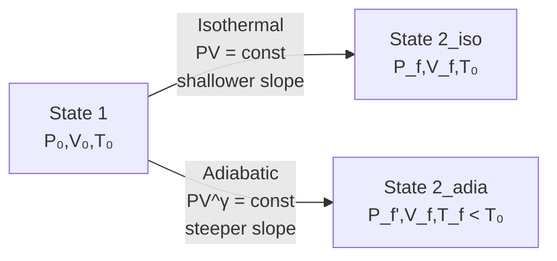

# 05 — Isothermal and Adiabatic Process

## 1. Overview

This topic contrasts two idealised gas processes that bookend real processes:
**isothermal** (constant temperature, slow, maximum heat exchange) and
**adiabatic** (zero heat exchange, fast, steeper P-V curve). Both processes are governed
by the ideal gas law with additional constraints. Builds on
[→ Heat](01_heat.md) and [→ Temperature](02_temperature.md); leads directly to
[→ Adiabatic Relation](06_adiabatic_relation.md) where $PV^\gamma = \text{const}$ is
derived.

---

## 2. Definitions & Key Terms

**1. Isothermal Process** — *A thermodynamic process in which the temperature of the
system remains constant throughout ($\Delta T = 0$, hence $dT = 0$).*

**2. Adiabatic Process** — *A thermodynamic process in which no heat is exchanged between
the system and the surroundings ($Q = 0$, $\delta Q = 0$).*

**3. Quasi-static Process** — *A process carried out so slowly that the system remains in
thermodynamic equilibrium at every instant.*

**4. Heat Capacity Ratio ($\gamma$)** — *$\gamma = C_p/C_v$, the ratio of specific heat
at constant pressure to specific heat at constant volume. Dimensionless; $\gamma > 1$ always.*

**5. Internal Energy ($U$)** — *For an ideal gas, $U$ depends only on temperature:
$U = nC_v T$.*

---

## 3. Core Content

### 3.1 First Law Review

For any process on $n$ moles of ideal gas:

$$\Delta U = Q - W \quad \text{(Halliday sign convention)}$$

- $Q > 0$: heat added to gas.
- $W > 0$: work done by gas.
- $\Delta U = nC_v \Delta T$ (ideal gas, always).

---

### 3.2 Isothermal Process

**Constraint:** $T = \text{const}$

**Ideal gas at constant $T$:**

$$PV = nRT = \text{const} \implies P = \frac{nRT}{V}$$

This is **Boyle's Law**: $P_1V_1 = P_2V_2$.

**Internal energy change:**

$$\Delta U = nC_v \Delta T = 0 \quad (\Delta T = 0)$$

**First Law:**

$$Q = W \quad (\text{all heat added becomes work})$$

**Work done by gas:**

$$W = \int_{V_i}^{V_f} P\,dV = \int_{V_i}^{V_f} \frac{nRT}{V}\,dV = nRT\ln\!\left(\frac{V_f}{V_i}\right)$$

$$\boxed{W_{\text{iso}} = nRT\ln\!\left(\frac{V_f}{V_i}\right) = P_i V_i \ln\!\left(\frac{V_f}{V_i}\right)}$$

**P-V curve:** Rectangular hyperbola $P = nRT/V$ (steepness decreases with increasing $T$).

---

### 3.3 Adiabatic Process

**Constraint:** $Q = 0$

**First Law:**

$$\Delta U = -W \quad (\text{work done at expense of internal energy})$$

$$nC_v\Delta T = -W$$

**Consequence:** When a gas expands adiabatically ($W > 0$), $\Delta T < 0$ — it cools.
When compressed adiabatically ($W < 0$), it warms.

**P-V relation** (derived fully in [Topic 06](06_adiabatic_relation.md)):

$$PV^\gamma = \text{const} \quad \gamma = \frac{C_p}{C_v}$$

**Work done in adiabatic expansion:**

$$W_{\text{adia}} = -\Delta U = -nC_v(T_f - T_i) = \frac{P_i V_i - P_f V_f}{\gamma - 1}$$

---

### 3.4 Comparison of Slopes on P-V Diagram

At any point $(P, V)$:

$$\left(\frac{dP}{dV}\right)_{\text{iso}} = -\frac{P}{V}$$

$$\left(\frac{dP}{dV}\right)_{\text{adia}} = -\gamma\frac{P}{V}$$

Since $\gamma > 1$, **the adiabatic curve is always steeper** than the isothermal through
the same point. A gas cools during adiabatic expansion so it can support less pressure
than the isotherm predicts.

---

### 3.5 Summary Comparison

| Feature | Isothermal | Adiabatic |
|---------|-----------|-----------|
| Constraint | $T = \text{const}$ | $Q = 0$ |
| $\Delta U$ | 0 | $-W$ |
| $Q$ | $= W$ | 0 |
| $P$–$V$ law | $PV = \text{const}$ | $PV^\gamma = \text{const}$ |
| P-V slope | $-P/V$ | $-\gamma P/V$ (steeper) |
| Work | $nRT\ln(V_f/V_i)$ | $(P_iV_i - P_fV_f)/(\gamma-1)$ |
| Temp change | 0 | $\Delta T \neq 0$ |
| Heat exchange | Required | None |

---

## 4. Worked Examples

### Example 1 — 🟢 Foundational

**Problem:** 2.0 mol of an ideal gas expand isothermally at 300 K from 10.0 L to 25.0 L.
Find $W$, $Q$, and $\Delta U$. ($R = 8.314$ J mol⁻¹ K⁻¹)

**Solution**

Step 1: Work

$$W = nRT\ln\!\left(\frac{V_f}{V_i}\right) = 2.0 \times 8.314 \times 300 \times \ln\!\left(\frac{25.0}{10.0}\right)$$

$$= 4988.4 \times \ln 2.5 = 4988.4 \times 0.9163$$

$$\boxed{W = 4571\;\text{J} \approx 4.57\;\text{kJ}}$$

Step 2: Internal energy (isothermal, ideal gas):

$$\boxed{\Delta U = 0}$$

Step 3: Heat (First Law):

$$\boxed{Q = W = 4571\;\text{J}}$$

---

### Example 2 — 🟡 Intermediate

**Problem:** 1.0 mol of a diatomic ideal gas ($\gamma = 1.40$) undergoes adiabatic
compression from $V_i = 8.0\;\text{L}$, $T_i = 300\;\text{K}$ to $V_f = 2.0\;\text{L}$.
Find $T_f$, $P_f$, and the work done on the gas.

**Solution**

Step 1: Find $T_f$ from adiabatic relation $TV^{\gamma-1} = \text{const}$
(derived in [Topic 06](06_adiabatic_relation.md)):

$$T_f = T_i \left(\frac{V_i}{V_f}\right)^{\gamma - 1} = 300 \times \left(\frac{8.0}{2.0}\right)^{0.40} = 300 \times 4^{0.40}$$

$4^{0.40} = e^{0.40 \ln 4} = e^{0.40 \times 1.386} = e^{0.5545} = 1.741$

$$\boxed{T_f = 300 \times 1.741 = 522.3\;\text{K}}$$

Step 2: Find $P_f$ from ideal gas:

$$P_f = \frac{nRT_f}{V_f} = \frac{1.0 \times 8.314 \times 522.3}{2.0 \times 10^{-3}} = \frac{4342}{2 \times 10^{-3}}$$

$$\boxed{P_f = 2.17 \times 10^6\;\text{Pa} = 2.17\;\text{MPa}}$$

Step 3: Work done **on** gas = $-W_{\text{by gas}} = \Delta U = nC_v(T_f - T_i)$

For diatomic: $C_v = \frac{5}{2}R = 20.79\;\text{J mol}^{-1}\text{K}^{-1}$

$$W_{\text{on}} = 1.0 \times 20.79 \times (522.3 - 300) = 20.79 \times 222.3$$

$$\boxed{W_{\text{on}} = 4622\;\text{J} \approx 4.62\;\text{kJ}}$$

---

### Example 3 — 🔴 Advanced / Exam-Level

**Problem:** Two processes start from the same state ($P_0 = 2.0 \times 10^5$ Pa,
$V_0 = 5.0\;\text{L}$, $T_0 = 300\;\text{K}$, $n = 0.40$ mol, $\gamma = 5/3$):

(a) Isothermal expansion to $V_f = 15.0\;\text{L}$: find $P_f$, $W$, $Q$.
(b) Adiabatic expansion to the same $V_f = 15.0\;\text{L}$: find $P_f$, $T_f$, $W$.
(c) Comment on why the isothermal final pressure is higher.

**Solution**

**Part (a) — Isothermal:**

$P_f = P_0 V_0/V_f = (2.0 \times 10^5 \times 5.0)/(15.0) = \mathbf{6.67 \times 10^4\;\text{Pa}}$

$W = nRT_0\ln(V_f/V_i) = 0.40 \times 8.314 \times 300 \times \ln 3 = 997.7 \times 1.099 = \mathbf{1096\;\text{J}}$

$Q = W = \mathbf{1096\;\text{J}}$

**Part (b) — Adiabatic ($\gamma = 5/3$):**

$P_f = P_0(V_0/V_f)^\gamma = 2.0 \times 10^5 \times (1/3)^{5/3} = 2.0 \times 10^5 \times (3)^{-5/3}$

$3^{5/3} = e^{(5/3)\ln 3} = e^{1.831} = 6.241$

$\boxed{P_f = 2.0 \times 10^5 / 6.241 = 3.21 \times 10^4\;\text{Pa}}$

$T_f = T_0(V_0/V_f)^{\gamma-1} = 300 \times (1/3)^{2/3} = 300/3^{2/3} = 300/2.080 = \mathbf{144\;\text{K}}$

$W = nC_v(T_i - T_f) = 0.40 \times \frac{3}{2} \times 8.314 \times (300-144) = 0.40 \times 12.47 \times 156 = \mathbf{778\;\text{J}}$

**Part (c):** In isothermal expansion, heat $Q$ flows in to maintain $T$, so the gas
retains its pressure-supporting ability ($P \propto T/V$). In adiabatic expansion, $T$
falls (no heat input), reducing pressure further. Hence $P_{\text{iso}} > P_{\text{adia}}$
at the same final volume.

---

## 5. Applications

**Air Compression in Diesel Engines** — Diesel engines rely on adiabatic compression to
raise air temperature above diesel's ignition point (~250 °C) without any spark. The
compression ratio determines $T_f$ via $TV^{\gamma-1} = \text{const}$.

**Refrigerators and Heat Pumps** — Refrigerant vapour undergoes approximately adiabatic
compression in the compressor (temperature rises), then isothermal condensation
(heat released), isothermal evaporation (heat absorbed), and adiabatic expansion (temperature
drops). Understanding both process types is essential for thermodynamic cycle analysis.

---

## 6. Diagram / Visual

*Figure 1: Both processes expand from the same initial state to the same final volume.
The adiabatic reaches a lower final pressure and temperature because no heat is supplied.*

---

## 7. Common Mistakes

- ❌ **Mistake:** Assuming $\Delta U = 0$ for any slow process.
  ✅ **Correct:** $\Delta U = 0$ only for isothermal processes on ideal gases. Adiabatic processes can have large $\Delta U$.

- ❌ **Mistake:** Using $W = nRT\ln(V_f/V_i)$ for an adiabatic process.
  ✅ **Correct:** This formula is for isothermal only. Adiabatic work is $W = (P_iV_i - P_fV_f)/(\gamma-1)$.

- ❌ **Mistake:** Confusing "adiabatic" with "isothermal" — both can be slow and quasi-static.
  ✅ **Correct:** The distinction is about heat exchange, not speed. An isothermal process requires heat exchange; an adiabatic process forbids it. Practical adiabatic processes are fast (no time for heat exchange), but the thermodynamic definition is $Q = 0$.

---

## 8. Practice Problems

**Problem 1:** 3.0 mol of ideal gas ($\gamma = 1.4$) expand isothermally at 400 K from 5.0 L to 20.0 L. Find $W$, $\Delta U$, $Q$.

Solution

$W = nRT\ln(V_f/V_i) = 3.0 \times 8.314 \times 400 \times \ln 4 = 9976.8 \times 1.386 = \boxed{13\,829\;\text{J} \approx 13.8\;\text{kJ}}$

$\Delta U = 0$ (isothermal, ideal gas)

$Q = W = \boxed{13.8\;\text{kJ}}$

---

**Problem 2 (Exam-level):** An ideal monoatomic gas ($\gamma = 5/3$, $n = 0.50$ mol)
starts at $P_i = 3.0 \times 10^5$ Pa, $V_i = 2.0$ L. It undergoes adiabatic expansion to $P_f = 0.80 \times 10^5$ Pa. Find $V_f$ and the work done by the gas.

Solution

From $P_i V_i^\gamma = P_f V_f^\gamma$:

$V_f = V_i \left(\frac{P_i}{P_f}\right)^{1/\gamma} = 2.0 \times \left(\frac{3.0}{0.80}\right)^{3/5} = 2.0 \times (3.75)^{0.6}$

$(3.75)^{0.6} = e^{0.6 \ln 3.75} = e^{0.6 \times 1.3217} = e^{0.793} = 2.21$

$V_f = 2.0 \times 2.21 = \boxed{4.42\;\text{L}}$

$W = \dfrac{P_i V_i - P_f V_f}{\gamma - 1} = \dfrac{3.0 \times 10^5 \times 2.0 \times 10^{-3} - 0.80 \times 10^5 \times 4.42 \times 10^{-3}}{5/3 - 1}$

$= \dfrac{600 - 353.6}{2/3} = \dfrac{246.4}{0.6667} = \boxed{369.6\;\text{J} \approx 370\;\text{J}}$

---

## 9. Summary

| | Isothermal | Adiabatic |
|---|---|---|
| $Q$ | $= W \neq 0$ | $0$ |
| $\Delta U$ | $0$ | $= -W$ |
| Gas law | $PV = \text{const}$ | $PV^\gamma = \text{const}$ |
| $W$ | $nRT\ln(V_f/V_i)$ | $(P_iV_i-P_fV_f)/(\gamma-1)$ |
| P-V slope | $-P/V$ | $-\gamma P/V$ |

Next: [→ Adiabatic Relation](06_adiabatic_relation.md) — complete derivation of $PV^\gamma = \text{const}$ and its sibling forms.

---

## 10. References

1. **Halliday, Resnick & Walker — *Fundamentals of Physics*, 10th ed., Ch. 19.** Detailed treatment of isothermal and adiabatic work integrals.
2. **Serway & Jewett — *Physics for Scientists and Engineers*, 9th ed., Ch. 21.** P-V diagrams and Carnot cycle comparisons.
3. **Atkins, P. & de Paula, J. — *Physical Chemistry*, 10th ed., §2C.** Thermodynamic processes from a chemistry viewpoint.
4. **MIT OCW 8.01 — Thermodynamics Notes.** [https://ocw.mit.edu](https://ocw.mit.edu)
