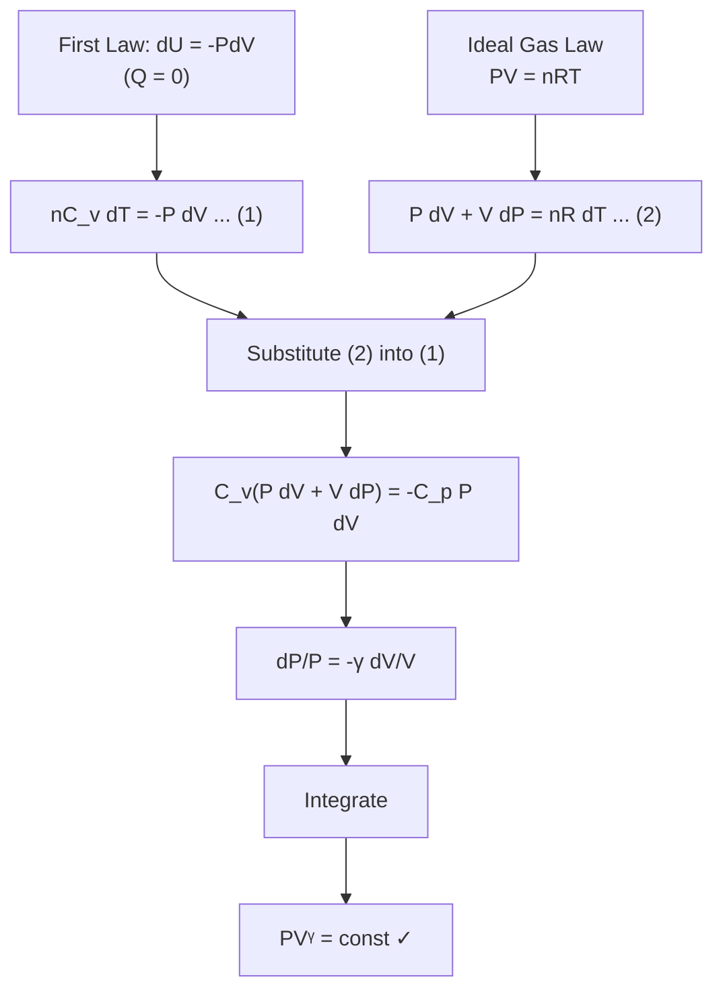

# 06 — Adiabatic Relation

## 1. Overview

This topic derives all forms of the adiabatic constraint from first principles — the
result used (but not derived) in [→ Isothermal and Adiabatic Process](05_isothermal_and_adiabatic_process.md).
Understanding this derivation is essential for kinetic theory (where $\gamma$ links to degrees
of freedom, Topic 09) and for real-gas behaviour (Topics 11-13).

---

## 2. Definitions & Key Terms

**1. Adiabatic Relation** — *The equation $PV^\gamma = \text{const}$, valid for a
quasi-static adiabatic process on an ideal gas.*

**2. $\gamma$ (gamma, heat capacity ratio)** — *$\gamma = C_p/C_v > 1$. For monoatomic
ideal gas: $\gamma = 5/3$; diatomic: $\gamma = 7/5 = 1.4$.*

**3. Mayer's Relation** — *$C_p - C_v = R$ for an ideal gas (1 mole). Derived from the
ideal gas equation.*

**4. Poisson's Equations** — *Three equivalent adiabatic relations:
(i) $PV^\gamma = K_1$,
(ii) $TV^{\gamma-1} = K_2$,
(iii) $T^\gamma P^{1-\gamma} = K_3$.*

---

## 3. Core Content

### 3.1 Mayer's Relation: $C_p - C_v = R$

Starting from the first law for 1 mole at constant pressure:

$$Q_p = \Delta U + P\Delta V$$
$$C_p \Delta T = C_v \Delta T + P\Delta V$$

For an ideal gas: $PV = RT \implies P\Delta V = R\Delta T$

$$C_p \Delta T = C_v \Delta T + R\Delta T$$

$$\boxed{C_p - C_v = R}$$

Therefore: $\gamma = C_p / C_v = (C_v + R)/C_v = 1 + R/C_v$

---

### 3.2 Derivation of $PV^\gamma = \text{const}$

**Starting point:** First Law with $Q = 0$:

$$dU = -\delta W \implies nC_v\,dT = -P\,dV \quad \cdots (1)$$

**Ideal gas law:** Differentiate $PV = nRT$:

$$P\,dV + V\,dP = nR\,dT \implies dT = \frac{P\,dV + V\,dP}{nR} \quad \cdots (2)$$

**Substitute (2) into (1):**

$$nC_v \cdot \frac{P\,dV + V\,dP}{nR} = -P\,dV$$

$$\frac{C_v}{R}(P\,dV + V\,dP) = -P\,dV$$

$$\frac{C_v}{R} P\,dV + \frac{C_v}{R} V\,dP = -P\,dV$$

**Collect $P\,dV$ terms:**

$$\frac{C_v}{R} V\,dP = -P\,dV - \frac{C_v}{R} P\,dV = -P\,dV\!\left(1 + \frac{C_v}{R}\right) = -P\,dV \cdot \frac{R + C_v}{R} = -P\,dV \cdot \frac{C_p}{R}$$

$$\frac{C_v}{R} V\,dP = -\frac{C_p}{R} P\,dV$$

**Divide both sides by $\frac{C_v}{R}PV$:**

$$\frac{dP}{P} = -\frac{C_p}{C_v} \cdot \frac{dV}{V} = -\gamma\,\frac{dV}{V}$$

**Integrate:**

$$\int \frac{dP}{P} = -\gamma \int \frac{dV}{V}$$

$$\ln P = -\gamma \ln V + \text{const}$$

$$\ln P + \gamma \ln V = \text{const}$$

$$\boxed{PV^\gamma = \text{const}}$$

---

### 3.3 Deriving $TV^{\gamma-1} = \text{const}$

From $PV^\gamma = K_1$ and $PV = nRT \implies P = nRT/V$:

$$\frac{nRT}{V} \cdot V^\gamma = K_1$$

$$nRT \cdot V^{\gamma - 1} = K_1$$

$$\boxed{TV^{\gamma-1} = \text{const}} \quad (n,R \text{ absorbed into const})$$

---

### 3.4 Deriving $T^\gamma P^{1-\gamma} = \text{const}$

From $PV^\gamma = K_1$ and $V = nRT/P$:

$$P \left(\frac{nRT}{P}\right)^\gamma = K_1$$

$$P \cdot \frac{(nRT)^\gamma}{P^\gamma} = K_1$$

$$T^\gamma \cdot P^{1-\gamma} = \text{const}$$

$$\boxed{T^\gamma P^{1-\gamma} = \text{const}} \quad \text{(Poisson's 3rd relation)}$$

---

### 3.5 Work Done in Adiabatic Process (Two Forms)

**Form 1 (from internal energy):**

$$W = -\Delta U = -nC_v(T_f - T_i) = nC_v(T_i - T_f)$$

**Form 2 (from P-V quantities, using $PV^\gamma = K$):**

$$W = \int_{V_i}^{V_f} P\,dV = \int_{V_i}^{V_f} \frac{K}{V^\gamma}\,dV = K \cdot \frac{V^{1-\gamma}}{1-\gamma}\Bigg|_{V_i}^{V_f}$$

$$= \frac{K(V_f^{1-\gamma} - V_i^{1-\gamma})}{1-\gamma} = \frac{P_fV_f^\gamma \cdot V_f^{1-\gamma} - P_iV_i^\gamma \cdot V_i^{1-\gamma}}{1-\gamma}$$

$$\boxed{W = \frac{P_i V_i - P_f V_f}{\gamma - 1}}$$

---

### 3.6 Physical Interpretation

| Quantity | Meaning |
|----------|---------|
| $PV^\gamma = K$ | At constant entropy (adiabatic), pressure drops faster with volume than at constant $T$ |
| $TV^{\gamma-1} = K$ | Gas cools as it expands adiabatically ($T \downarrow$ as $V \uparrow$) |
| $T^\gamma P^{1-\gamma} = K$ | Temperature change linked to pressure change (used in meteorology: dry adiabatic lapse rate) |

---

## 4. Worked Examples

### Example 1 — 🟢 Foundational

**Problem:** A monoatomic ideal gas ($\gamma = 5/3$) starts at $P_i = 1.5 \times 10^5$ Pa,
$V_i = 4.0$ L. It is compressed adiabatically to $V_f = 1.0$ L. Find $P_f$.

**Solution**

$$P_f = P_i \left(\frac{V_i}{V_f}\right)^\gamma = 1.5 \times 10^5 \times \left(\frac{4.0}{1.0}\right)^{5/3}$$

$4^{5/3} = (4^5)^{1/3} = (1024)^{1/3} = 10.08$

$$P_f = 1.5 \times 10^5 \times 10.08 = \boxed{1.51 \times 10^6\;\text{Pa}}$$

---

### Example 2 — 🟡 Intermediate

**Problem:** A diatomic gas ($\gamma = 1.4$) at 27 °C, 1.0 atm expands adiabatically until
the volume triples. Find the final temperature and pressure.

**Solution**

$T_i = 300$ K, $V_f = 3V_i$

**Final temperature:**

$$T_f = T_i\left(\frac{V_i}{V_f}\right)^{\gamma-1} = 300 \times \left(\frac{1}{3}\right)^{0.4} = 300 \times 3^{-0.4}$$

$3^{0.4} = e^{0.4\ln 3} = e^{0.4396} = 1.552$

$$\boxed{T_f = 300/1.552 = 193.3\;\text{K} \approx -79.9\;^\circ\text{C}}$$

**Final pressure:**

$$P_f = P_i\left(\frac{V_i}{V_f}\right)^\gamma = 1.0 \times \left(\frac{1}{3}\right)^{1.4} = 3^{-1.4}$$

$3^{1.4} = e^{1.4 \times 1.099} = e^{1.538} = 4.655$

$$\boxed{P_f = 1/4.655 = 0.215\;\text{atm}}$$

---

### Example 3 — 🔴 Advanced / Exam-Level

**Problem:** Show from $PV^\gamma = \text{const}$ and $PV = nRT$ that the slope of the
adiabat on a $\ln P$–$\ln V$ graph is $-\gamma$, and use this to determine $\gamma$
experimentally from two adiabatic states:
State A: $P = 2.0 \times 10^5$ Pa, $V = 10.0$ L;
State B: $P = 0.50 \times 10^5$ Pa, $V = 32.0$ L.

**Solution**

**Part 1 — Slope derivation:**

$PV^\gamma = K \implies \ln P + \gamma \ln V = \ln K$

Differentiating: $d(\ln P) = -\gamma\,d(\ln V)$, so slope $= -\gamma$. ∎

**Part 2 — Determine $\gamma$:**

From $PV^\gamma = \text{const}$:

$$P_A V_A^\gamma = P_B V_B^\gamma$$

$$\frac{P_A}{P_B} = \left(\frac{V_B}{V_A}\right)^\gamma$$

$$\frac{2.0}{0.50} = \left(\frac{32.0}{10.0}\right)^\gamma$$

$$4 = 3.2^\gamma$$

$$\gamma = \frac{\ln 4}{\ln 3.2} = \frac{1.386}{1.163}$$

$$\boxed{\gamma = 1.192}$$

*(Note: $\gamma \approx 1.2$ is not a standard value — in a real experiment, errors from
non-ideal gas behaviour or non-adiabaticity would shift the result. This value suggests a
polyatomic gas or experimental error.)*

---

## 5. Applications

**Dry Adiabatic Lapse Rate (Meteorology):** Rising air expands adiabatically, cooling at
$\approx 10$ °C/km. The form $TV^{\gamma-1} = \text{const}$ is the thermodynamic basis.

**Diesel Engine Compression:** In the compression stroke, air is compressed adiabatically
from $V_i \approx 700$ mL to $V_f \approx 40$ mL (ratio ≈ 17.5). Using $TV^{\gamma-1} =
\text{const}$ with $\gamma = 1.4$, $T_i = 300$ K: $T_f = 300 \times 17.5^{0.4} \approx 1028$ K.
This exceeds diesel's auto-ignition temperature.

---

## 6. Diagram / Visual

*Figure 1: Logical flow of the adiabatic relation derivation.*

---

## 7. Common Mistakes

- ❌ **Mistake:** Using $PV^\gamma = \text{const}$ for an ideal gas at constant temperature (isothermal).
  ✅ **Correct:** The isothermal relation is $PV = \text{const}$ (Boyle's Law). The $PV^\gamma$ relation requires $Q = 0$, not $T = \text{const}$.

- ❌ **Mistake:** Forgetting that Mayer's relation $C_p - C_v = R$ is per mole.
  ✅ **Correct:** For $n$ moles: $n(C_p - C_v) = nR$. Always check whether $C$ values are molar or specific (per kg).

- ❌ **Mistake:** Taking $\gamma = C_p/C_v$ but then using $C_p$ and $C_v$ in different units.
  ✅ **Correct:** $\gamma$ is dimensionless and equals $C_p/C_v$ in any consistent unit system (J/mol/K, J/kg/K, etc.).

- ❌ **Mistake:** Applying Poisson's relations to real gases without correction.
  ✅ **Correct:** $PV^\gamma = \text{const}$ assumes an ideal gas. Real gases require corrections, especially near the critical point.

---

## 8. Practice Problems

**Problem 1:** Show that $W_{\text{adia}} = nC_v(T_i - T_f)$ and $W_{\text{adia}} = (P_iV_i - P_fV_f)/(\gamma-1)$ are equivalent.

Solution

From the first law for adiabatic process: $W = -\Delta U = -nC_v(T_f - T_i) = nC_v(T_i - T_f)$.

Also, $nC_v = nR/(\gamma-1)$ (from $C_p - C_v = R$ and $\gamma = C_p/C_v$).

So $W = \frac{nR(T_i - T_f)}{\gamma - 1} = \frac{nRT_i - nRT_f}{\gamma - 1} = \frac{P_iV_i - P_fV_f}{\gamma - 1}$ ∎

---

**Problem 2 (Exam-level):** Air ($\gamma = 1.4$) at 100 kPa, 300 K is compressed
adiabatically to 1/5 of its original volume. Find: (a) final pressure, (b) final
temperature, (c) work done per mole.

Solution

(a) $P_f = P_i(V_i/V_f)^\gamma = 100 \times 5^{1.4} = 100 \times 9.518 = \boxed{951.8\;\text{kPa}}$

(b) $T_f = T_i(V_i/V_f)^{\gamma-1} = 300 \times 5^{0.4} = 300 \times 1.904 = \boxed{571.2\;\text{K}}$

(c) $W = C_v(T_i - T_f) = \frac{R}{\gamma-1}(T_i - T_f) = \frac{8.314}{0.4}(300 - 571.2)$

$= 20.785 \times (-271.2) = \boxed{-5636\;\text{J mol}^{-1}}$ (work done on gas)

---

## 9. Summary

| Relation | Form | Derived from |
|----------|------|--------------|
| Primary | $PV^\gamma = \text{const}$ | 1st Law + ideal gas + $Q = 0$ |
| Form 2 | $TV^{\gamma-1} = \text{const}$ | PV form + ideal gas law |
| Form 3 | $T^\gamma P^{1-\gamma} = \text{const}$ | PV form + $V = nRT/P$ |
| Work | $W = (P_iV_i - P_fV_f)/(\gamma-1)$ | Integration of $P\,dV$ |
| Mayer | $C_p - C_v = R$ | Prerequisite |

Next: [→ Fundamental Postulates of Kinetic Theory](07_fundamental_postulates_of_kinetic_theory.md) —
the microscopic model from which $\gamma$ values and gas behaviour emerge.

---

## 10. References

1. **Halliday, Resnick & Walker — *Fundamentals of Physics*, 10th ed., §19-8.** Derivation of $PV^\gamma$ for ideal gas.
2. **Zemansky, M.W. & Dittman, R.H. — *Heat and Thermodynamics*, 7th ed., Ch. 6.** Rigorous adiabatic expansion analysis.
3. **HyperPhysics — Adiabatic Processes.** [http://hyperphysics.phy-astr.gsu.edu/hbase/thermo/adiab.html](http://hyperphysics.phy-astr.gsu.edu/hbase/thermo/adiab.html)
4. **MIT OCW 8.044 — Statistical Physics, Lecture Notes.** Background on $\gamma$ from statistical mechanics.
