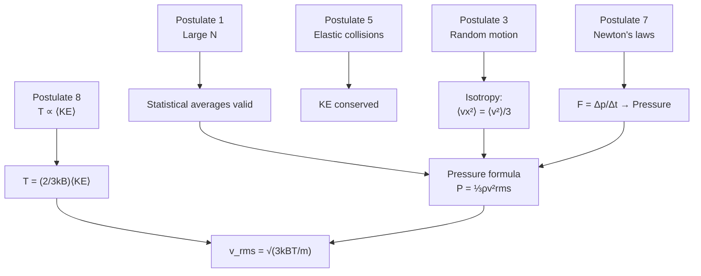

# 07 — Fundamental Postulates of Kinetic Theory of Gases

## 1. Overview

The kinetic theory of gases (KTG) provides a microscopic mechanical explanation for all
macroscopic gas properties. Its postulates are the axioms from which the pressure formula
(Topic 08), the equipartition theorem (Topic 09), and the mean free path (Topic 10) are
all derived. This topic bridges macroscopic thermodynamics (Topics 01-06) to the
microscopic molecular model.

---

## 2. Definitions & Key Terms

**1. Kinetic Theory of Gases** — *A model that describes gas behaviour in terms of the
mechanical motions of a large number of molecules.*

**2. Elastic Collision** — *A collision in which kinetic energy is conserved, with no
conversion to heat, sound, or deformation energy.*

**3. Root Mean Square Speed ($v_{\text{rms}}$)** — *$v_{\text{rms}} = \sqrt{\langle v^2\rangle}$,
the square root of the mean of the squared speeds of all molecules.*

**4. Mean Kinetic Energy** — *The average translational kinetic energy per molecule:
$\langle KE\rangle = \frac{1}{2}m v_{\text{rms}}^2$.*

**5. Thermodynamic Equilibrium** — *A state in which macroscopic properties (P, T, V)
are constant in time and no net macroscopic flows occur.*

---

## 3. Core Content

### 3.1 The Eight Postulates

**Postulate 1 — Large number of molecules:**
A gas consists of an extremely large number $N$ of identical molecules, so that
statistical averages are meaningful and fluctuations are negligible.
> *Why necessary:* Thermodynamic quantities like pressure are averages. With $N \sim 10^{23}$
> (Avogadro's number), the statistical law of large numbers ensures that average values
> equal macroscopic measured values.

**Postulate 2 — Molecules are rigid spheres:**
Each molecule is a perfectly rigid, elastic sphere of diameter $d$ and mass $m$. The
total volume of all molecules ($\sim Nd^3$) is negligibly small compared to the container
volume $V$.
> *Why necessary:* Allows the simplification that molecules travel in straight lines
> between collisions and that the container's free volume is simply $V$.

**Postulate 3 — Continuous random motion:**
Molecules are in ceaseless random motion, moving in all directions with all speeds.
There is no preferred direction.
> *Why necessary:* Isotropy ensures that $\langle v_x^2\rangle = \langle v_y^2\rangle = \langle v_z^2\rangle = \langle v^2\rangle/3$,
> used in the pressure derivation.

**Postulate 4 — Negligible intermolecular forces:**
Except during very brief collisions, molecules exert no forces on each other. Between
collisions, molecules travel in straight lines at constant velocity (Newton's 1st Law).
> *Why necessary:* This gives the ideal gas approximation. Real forces are accounted for
> by the Van der Waals equation (Topic 11).

**Postulate 5 — Perfectly elastic collisions:**
All collisions between molecules and between molecules and container walls are perfectly
elastic: kinetic energy and momentum are both conserved.
> *Why necessary:* If collisions were inelastic, kinetic energy would be lost to internal
> vibrations and the gas would cool without an external cause.

**Postulate 6 — Negligible collision duration:**
The time of each collision is much shorter than the mean time between collisions.
Molecules are essentially point masses during travel.
> *Why necessary:* Ensures that the interaction volume is negligible and that the
> translational motion model is valid.

**Postulate 7 — Newton's laws apply:**
The motion of each molecule obeys classical (Newtonian) mechanics.
> *Why necessary:* Allows momentum and force calculations that lead to the pressure formula.

**Postulate 8 — Temperature ∝ mean kinetic energy:**
The absolute temperature $T$ of a gas is directly proportional to the mean translational
kinetic energy of its molecules:

$$\langle KE_{\text{trans}}\rangle = \frac{3}{2}k_B T$$

where $k_B = 1.380 \times 10^{-23}$ J K⁻¹.
> *Why necessary:* This postulate connects the microscopic model to the macroscopic
> quantity temperature, and is confirmed by the derivation in Topic 08.

---

### 3.2 Implications and Deductions

| Postulate | Key implication |
|-----------|----------------|
| 1 | Statistical descriptions valid; no fluctuation effects |
| 2 | Mean free path is finite (Topic 10) |
| 3 | Velocity distribution is isotropic; Maxwell-Boltzmann |
| 4 | PV = nRT (ideal gas law) |
| 5 | Kinetic energy is conserved; temperature constant in equilibrium |
| 6 | Molecular motion is mostly free travel |
| 7 | Pressure derivable from Newton's 2nd law |
| 8 | $v_{\text{rms}} = \sqrt{3k_BT/m}$ |

---

### 3.3 Historical Development

| Scientist | Contribution |
|-----------|-------------|
| Daniel Bernoulli (1738) | First kinetic theory: pressure from molecular bombardment |
| James Clerk Maxwell (1860) | Speed distribution law ($f(v)$) |
| Ludwig Boltzmann (1872) | Statistical mechanics; $H$-theorem; $k_B$ |
| Rudolf Clausius (1857) | Mean free path concept |

---

## 4. Worked Examples

### Example 1 — 🟢 Foundational

**Problem:** Nitrogen gas (molar mass $M = 28 \times 10^{-3}$ kg mol⁻¹) is at 300 K.
Calculate the rms speed. ($R = 8.314$ J mol⁻¹ K⁻¹)

**Solution**

From Postulate 8 and the pressure derivation (Topic 08):

$$v_{\text{rms}} = \sqrt{\frac{3RT}{M}} = \sqrt{\frac{3 \times 8.314 \times 300}{28 \times 10^{-3}}}$$

$$= \sqrt{\frac{7482.6}{0.028}} = \sqrt{267\,236} = \boxed{517\;\text{m s}^{-1}}$$

---

### Example 2 — 🟡 Intermediate

**Problem:** At what temperature does oxygen ($M = 32 \times 10^{-3}$ kg mol⁻¹) have
the same $v_{\text{rms}}$ as nitrogen at 300 K (517 m s⁻¹)?

**Solution**

$$v_{\text{rms}} = \sqrt{\frac{3RT}{M}} \implies T = \frac{M v_{\text{rms}}^2}{3R}$$

$$T_{\text{O}_2} = \frac{32 \times 10^{-3} \times (517)^2}{3 \times 8.314} = \frac{32 \times 10^{-3} \times 267\,289}{24.942}$$

$$= \frac{8553.2}{24.942} = \boxed{343\;\text{K} \approx 70\;^\circ\text{C}}$$

*Physical sense:* Heavier O₂ needs higher temperature to reach the same speed as lighter N₂.

---

### Example 3 — 🔴 Advanced / Exam-Level

**Problem:** (a) Show that the average kinetic energy of a molecule is independent of
the type of molecule at a given temperature. (b) At 500 K, find the mean KE per molecule
and per mole. (c) Hydrogen has molar mass 2 g/mol; find $v_{\text{rms}}$ at 500 K and
comment on why hydrogen escapes Earth's atmosphere.

**Solution**

**Part (a):** From Postulate 8:
$\langle KE\rangle = \frac{3}{2}k_BT$ — depends only on $T$, not on $m$ or molecule type. ∎

**Part (b):**
Per molecule: $\langle KE\rangle = \frac{3}{2} \times 1.380 \times 10^{-23} \times 500 = \frac{3}{2} \times 6.9 \times 10^{-21} = \boxed{1.035 \times 10^{-20}\;\text{J}}$

Per mole: $N_A \langle KE\rangle = \frac{3}{2}RT = \frac{3}{2} \times 8.314 \times 500 = \boxed{6236\;\text{J mol}^{-1} \approx 6.24\;\text{kJ mol}^{-1}}$

**Part (c):** $v_{\text{rms}}(\text{H}_2) = \sqrt{3RT/M} = \sqrt{3 \times 8.314 \times 500/(2 \times 10^{-3})}$

$= \sqrt{6\,235\,500} = \boxed{2497\;\text{m s}^{-1} \approx 2.50\;\text{km s}^{-1}}$

Earth's escape velocity is $\approx 11.2$ km s⁻¹. However, the Maxwell-Boltzmann
distribution has a high-speed tail: molecules with $v > 3v_{\text{rms}}$ can escape.
Because H₂ is so light, a significant fraction of molecules reach escape velocity,
causing gradual atmospheric loss over geological time.

---

## 5. Applications

**Design of Vacuum Systems** — Postulates 3 and 4 (random motion, no intermolecular
forces) underpin the kinetic theory of effusion (Graham's Law): lighter molecules effuse
faster. This principle is used in uranium isotope separation (gaseous diffusion of UF₆).

**Semiconductor Fabrication** — Chemical Vapour Deposition (CVD) in semiconductor
manufacturing relies on the kinetic theory (molecular mean free path vs chamber size)
to control whether gas flow is molecular (free-molecular regime) or viscous.

---

## 6. Diagram / Visual

*Figure 1: How the postulates combine to yield the pressure formula and rms speed.*

---

## 7. Common Mistakes

- ❌ **Mistake:** Thinking KTG applies exactly to all real gases.
  ✅ **Correct:** KTG postulates (Postulates 2 and 4) are idealizations. Real gases have finite molecular volumes and intermolecular attractions — hence the Van der Waals correction (Topic 11).

- ❌ **Mistake:** Saying that temperature is proportional to average speed $\langle v\rangle$.
  ✅ **Correct:** Temperature is proportional to $\langle v^2\rangle$ (mean of squared speeds), not $\langle v\rangle$. These are related by the Maxwell speed distribution: $v_{\text{rms}} > \bar{v} > v_{\text{mp}}$.

- ❌ **Mistake:** Assuming that all molecules move at $v_{\text{rms}}$.
  ✅ **Correct:** $v_{\text{rms}}$ is a statistical average. Actual molecular speeds are distributed according to the Maxwell-Boltzmann distribution over a wide range.

---

## 8. Practice Problems

**Problem 1:** Helium (M = 4 g/mol) at 27 °C. Find (a) $v_{\text{rms}}$, (b) mean KE per molecule.

Solution

$T = 300$ K, $M = 4 \times 10^{-3}$ kg/mol

(a) $v_{\text{rms}} = \sqrt{3RT/M} = \sqrt{3 \times 8.314 \times 300/(4 \times 10^{-3})} = \sqrt{1\,870\,650} = \boxed{1368\;\text{m s}^{-1}}$

(b) $\langle KE\rangle = \frac{3}{2}k_BT = 1.5 \times 1.38 \times 10^{-23} \times 300 = \boxed{6.21 \times 10^{-21}\;\text{J}}$

---

**Problem 2:** At what temperature will $v_{\text{rms}}$ of argon (M = 40 g/mol) equal 500 m/s?

Solution

$T = Mv_{\text{rms}}^2/(3R) = (40 \times 10^{-3} \times 500^2)/(3 \times 8.314) = (40 \times 10^{-3} \times 250\,000)/24.942 = 10\,000/24.942 = \boxed{401\;\text{K} \approx 128\;^\circ\text{C}}$

---

## 9. Summary

| Postulate | Physical Content | Key Result |
|-----------|-----------------|------------|
| Large $N$ | Statistical validity | Averages = macroscopic |
| Rigid spheres | Point masses, elastic | Free travel between collisions |
| Random motion | Isotropic, all speeds | $\langle v_x^2\rangle = \langle v^2\rangle/3$ |
| No intermolecular forces | Ideal gas | $PV = nRT$ |
| Elastic collisions | KE conserved | Constant $T$ in equilibrium |
| Newton's laws apply | Classical mechanics | Pressure derivable |
| $T \propto \langle KE\rangle$ | Microscopic temperature | $v_{\text{rms}} = \sqrt{3k_BT/m}$ |

Next: [→ Expression of Pressure from KTG](08_expression_of_pressure_from_kinetic_theory.md).

---

## 10. References

1. **Halliday, Resnick & Walker — *Fundamentals of Physics*, 10th ed., §19-1 to §19-4.** Postulates, pressure, and molecular speeds.
2. **Serway & Jewett — *Physics for Scientists & Engineers*, 9th ed., Ch. 21.** Kinetic theory derivation and Maxwell distribution.
3. **Reif, F. — *Fundamentals of Statistical and Thermal Physics* (McGraw-Hill).** Rigorous statistical foundation.
4. **HyperPhysics — Kinetic Theory.** [http://hyperphysics.phy-astr.gsu.edu/hbase/kinetic/ktcon.html](http://hyperphysics.phy-astr.gsu.edu/hbase/kinetic/ktcon.html)
