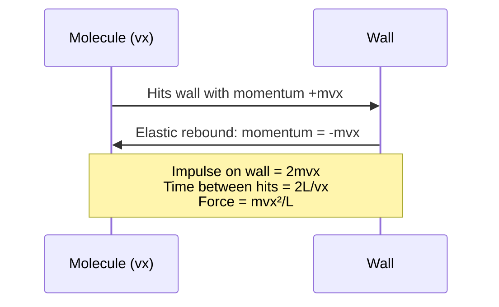

# 08 — Expression of Pressure from Kinetic Theory of Gases

## 1. Overview

This is the central calculation of the kinetic theory: deriving the macroscopic gas
pressure $P$ from the microscopic momentum exchanges of individual molecules. The result
$P = \frac{1}{3}\rho v_{\text{rms}}^2$ connects the macroscopic equation of state
($PV = nRT$) to the molecular picture, and yields the microscopic definition of
temperature ($\frac{1}{2}mv_{\text{rms}}^2 = \frac{3}{2}k_BT$). Builds directly on
[→ Fundamental Postulates](07_fundamental_postulates_of_kinetic_theory.md).

> **Notation in this file:** $n$ denotes **number density** (m⁻³) = $N/V$.
> $N$ = total number of molecules; $m$ = mass of one molecule; $M = N_Am$ = molar mass.

---

## 2. Definitions & Key Terms

**1. Gas Pressure** — *The force per unit area exerted by a gas on the walls of its
container, arising from the impulse of molecular collisions.*

**2. Root Mean Square Speed ($v_{\text{rms}}$)** — *$v_{\text{rms}} = \sqrt{\langle v^2\rangle} = \sqrt{(\sum_i v_i^2)/N}$.*

**3. Mean Square Speed ($\langle v^2\rangle$)** — *The average of the squares of all
molecular speeds. Related to rms: $\langle v^2\rangle = v_{\text{rms}}^2$.*

**4. Impulse** — *Change in momentum delivered to the wall per collision: $\Delta p = 2mv_x$.*

**5. Number Density ($n$, m⁻³)** — *Number of molecules per unit volume: $n = N/V$.*

---

## 3. Core Content

### 3.1 Setup

Consider $N$ molecules of mass $m$ each in a **cubical container of side $L$**
(volume $V = L^3$).

Molecule $i$ has velocity components $(v_{xi},\, v_{yi},\, v_{zi})$.

We derive the force on one wall (the wall perpendicular to the $x$-axis).

---

### 3.2 Step-by-Step Derivation

**Step 1 — Momentum change at wall collision**

A single molecule with $x$-velocity component $v_x > 0$ hits the right wall elastically.
By conservation of momentum and elastic collision (wall >> molecule mass):

$$\Delta p_x = -mv_x - (+mv_x) = -2mv_x$$

Impulse on wall (by Newton's 3rd Law): $+2mv_x$.

**Step 2 — Time between successive collisions with the same wall**

After bouncing, the molecule travels to the left wall (distance $L$) and back:

$$\Delta t = \frac{2L}{v_x}$$

**Step 3 — Average force from one molecule**

$$F_1 = \frac{\Delta p_x}{\Delta t} = \frac{2mv_x}{2L/v_x} = \frac{mv_x^2}{L}$$

**Step 4 — Total force from all $N$ molecules**

$$F_{\text{total}} = \sum_{i=1}^{N} \frac{mv_{xi}^2}{L} = \frac{m}{L}\sum_{i=1}^{N} v_{xi}^2$$

Define the **mean square x-velocity**:

$$\langle v_x^2\rangle = \frac{1}{N}\sum_{i=1}^{N} v_{xi}^2$$

$$F_{\text{total}} = \frac{Nm}{L}\langle v_x^2\rangle$$

**Step 5 — Isotropy condition (Postulate 3)**

Since molecular motion is random and isotropic, no direction is preferred:

$$\langle v_x^2\rangle = \langle v_y^2\rangle = \langle v_z^2\rangle$$

Since $v^2 = v_x^2 + v_y^2 + v_z^2$:

$$\langle v^2\rangle = \langle v_x^2\rangle + \langle v_y^2\rangle + \langle v_z^2\rangle = 3\langle v_x^2\rangle$$

$$\therefore \langle v_x^2\rangle = \frac{1}{3}\langle v^2\rangle = \frac{1}{3}v_{\text{rms}}^2$$

**Step 6 — Pressure**

$$P = \frac{F_{\text{total}}}{A} = \frac{F_{\text{total}}}{L^2} = \frac{Nm\langle v_x^2\rangle}{L^3} = \frac{Nm}{V} \cdot \frac{1}{3}v_{\text{rms}}^2$$

Since $\rho = Nm/V$ (mass density):

$$\boxed{P = \frac{1}{3}\rho\, v_{\text{rms}}^2}$$

Or equivalently:

$$\boxed{P = \frac{1}{3}\frac{N}{V}m\,v_{\text{rms}}^2}$$

---

### 3.3 Connecting to Temperature

From above: $PV = \frac{1}{3}Nm\,v_{\text{rms}}^2 = \frac{2}{3}N \cdot \frac{1}{2}mv_{\text{rms}}^2 = \frac{2}{3}N\langle KE\rangle$

From the ideal gas law: $PV = Nk_BT$

Equating:

$$\frac{2}{3}N\langle KE\rangle = Nk_BT$$

$$\boxed{\langle KE\rangle = \frac{1}{2}mv_{\text{rms}}^2 = \frac{3}{2}k_BT}$$

Therefore:

$$\boxed{v_{\text{rms}} = \sqrt{\frac{3k_BT}{m}} = \sqrt{\frac{3RT}{M}}}$$

where $M = N_Am$ is the molar mass [kg mol⁻¹].

---

### 3.4 Three Characteristic Speeds

From the Maxwell-Boltzmann distribution:

| Speed | Formula | Relation |
|-------|---------|----------|
| Most probable $v_{mp}$ | $\sqrt{2RT/M}$ | Smallest |
| Mean $\bar{v}$ | $\sqrt{8RT/\pi M}$ | Middle |
| rms $v_{\text{rms}}$ | $\sqrt{3RT/M}$ | Largest |

$$v_{mp} : \bar{v} : v_{\text{rms}} = \sqrt{2} : \sqrt{8/\pi} : \sqrt{3} \approx 1 : 1.128 : 1.225$$

---

## 4. Worked Examples

### Example 1 — 🟢 Foundational

**Problem:** The density of nitrogen gas at 27 °C and 1 atm ($= 1.013 \times 10^5$ Pa)
is $\rho = 1.14$ kg m⁻³. Find $v_{\text{rms}}$ using the pressure formula.

**Solution**

From $P = \frac{1}{3}\rho\, v_{\text{rms}}^2$:

$$v_{\text{rms}} = \sqrt{\frac{3P}{\rho}} = \sqrt{\frac{3 \times 1.013 \times 10^5}{1.14}}$$

$$= \sqrt{\frac{3.039 \times 10^5}{1.14}} = \sqrt{2.666 \times 10^5} = \boxed{516\;\text{m s}^{-1}}$$

---

### Example 2 — 🟡 Intermediate

**Problem:** Verify that the ideal gas law $PV = nRT$ follows from $P = \frac{1}{3}\rho\,v_{\text{rms}}^2$
combined with $\langle KE\rangle = \frac{3}{2}k_BT$.

**Solution**

Step 1: Rewrite the pressure formula in terms of total kinetic energy.

$$P = \frac{1}{3}\frac{Nm}{V}v_{\text{rms}}^2 = \frac{2}{3V}\cdot N \cdot \frac{1}{2}mv_{\text{rms}}^2 = \frac{2}{3V} \cdot N\langle KE\rangle$$

Step 2: Substitute $\langle KE\rangle = \frac{3}{2}k_BT$:

$$P = \frac{2}{3V} \cdot N \cdot \frac{3}{2}k_BT = \frac{Nk_BT}{V}$$

$$PV = Nk_BT$$

Since $N = nN_A$ and $R = N_Ak_B$:

$$\boxed{PV = nRT} \quad \checkmark$$

---

### Example 3 — 🔴 Advanced / Exam-Level

**Problem:** A gas container of volume 2.0 L holds $3.0 \times 10^{22}$ molecules of
oxygen (mass per molecule $m = 5.31 \times 10^{-26}$ kg) at 400 K.

(a) Find the pressure using the kinetic theory formula.
(b) Verify using the ideal gas law ($k_B = 1.38 \times 10^{-23}$ J K⁻¹).
(c) Find $v_{\text{rms}}$, $\bar{v}$, and $v_{mp}$.

**Solution**

**Part (a):** KTG formula. First find $v_{\text{rms}}$:

$$v_{\text{rms}} = \sqrt{\frac{3k_BT}{m}} = \sqrt{\frac{3 \times 1.38 \times 10^{-23} \times 400}{5.31 \times 10^{-26}}} = \sqrt{\frac{1.656 \times 10^{-20}}{5.31 \times 10^{-26}}} = \sqrt{3.12 \times 10^5}$$

$$v_{\text{rms}} = 558.6\;\text{m s}^{-1}$$

Now density: $\rho = Nm/V = (3.0 \times 10^{22} \times 5.31 \times 10^{-26})/(2.0 \times 10^{-3})$
$= 1.593 \times 10^{-3}/2.0 \times 10^{-3} = 0.7965\;\text{kg m}^{-3}$

$$P = \frac{1}{3}\rho v_{\text{rms}}^2 = \frac{1}{3} \times 0.7965 \times (558.6)^2 = \frac{1}{3} \times 0.7965 \times 312\,034$$

$$\boxed{P = 82\,806\;\text{Pa} \approx 0.817\;\text{atm}}$$

**Part (b):** Ideal gas: $P = Nk_BT/V = (3.0 \times 10^{22} \times 1.38 \times 10^{-23} \times 400)/(2.0 \times 10^{-3})$

$= (1.656 \times 10^{-1} \times 10^{0})/2.0 \times 10^{-3} = 0.1656/0.002 = \boxed{82\,800\;\text{Pa}}$ ✓ (agrees within rounding)

**Part (c):**

$v_{\text{rms}} = \boxed{558.6\;\text{m s}^{-1}}$

$\bar{v} = \sqrt{8RT/\pi M}$; $M = N_Am = 6.022 \times 10^{23} \times 5.31 \times 10^{-26} = 0.03198\;\text{kg mol}^{-1}$

$\bar{v} = \sqrt{8 \times 8.314 \times 400/(\pi \times 0.03198)} = \sqrt{26\,605/0.10045} = \sqrt{264\,846} = \boxed{514.6\;\text{m s}^{-1}}$

$v_{mp} = \sqrt{2RT/M} = \sqrt{2 \times 8.314 \times 400/0.03198} = \sqrt{207\,817} = \boxed{455.9\;\text{m s}^{-1}}$

Check ratio: $455.9 : 514.6 : 558.6 \approx 1 : 1.129 : 1.225$ ✓

---

## 5. Applications

**Pressure in Industrial Gas Cylinders** — Cylinder manufacturers use $P = \frac{1}{3}\rho v_{\text{rms}}^2$
(equivalently $P = nk_BT$) to specify safe operating pressures at elevated temperatures (e.g., an
oxygen cylinder at 50 °C stores gas at higher pressure than at 20 °C).

**Neutron Star Degeneracy Pressure** — While classical KTG does not apply to quantum
fluids, the conceptual framework (pressure from momentum exchange) extends to explain
quantum degeneracy pressure in white dwarfs and neutron stars via the Fermi-Dirac
distribution.

---

## 6. Diagram / Visual

*Figure 1: Single-molecule contribution to wall pressure. Summing over all N molecules
and using isotropy yields $P = \frac{1}{3}\rho v_{\text{rms}}^2$.*

---

## 7. Common Mistakes

- ❌ **Mistake:** Including only half the molecules (those moving toward a wall) without the factor-of-2 correction from reflection.
  ✅ **Correct:** Consider that in time $\Delta t = 2L/v_x$, the molecule makes one round trip. The impulse is $2mv_x$ (outgoing + incoming), averaged over the round-trip time — giving $F = mv_x^2/L$.

- ❌ **Mistake:** Omitting the isotropy step and writing $P = Nm\langle v^2\rangle/V$ without the factor $1/3$.
  ✅ **Correct:** Only the $x$-component contributes to the force on the $x$-wall. Isotropy gives $\langle v_x^2\rangle = \langle v^2\rangle/3$, introducing the $1/3$.

- ❌ **Mistake:** Confusing $v_{\text{rms}}$ with mean speed $\bar{v}$.
  ✅ **Correct:** $v_{\text{rms}} = \sqrt{\langle v^2\rangle} \neq \langle v \rangle = \bar{v}$. The pressure formula uses $v_{\text{rms}}$ (via $\langle v^2\rangle$).

---

## 8. Practice Problems

**Problem 1:** The rms speed of a gas is 400 m/s and its density is 0.90 kg/m³. Find the pressure.

Solution

$P = \frac{1}{3}\rho v_{\text{rms}}^2 = \frac{1}{3} \times 0.90 \times (400)^2 = \frac{1}{3} \times 0.90 \times 160\,000 = \boxed{48\,000\;\text{Pa} = 48\;\text{kPa}}$

---

**Problem 2 (Exam-level):** The pressure of an ideal gas is halved while its temperature
is doubled. By what factor does $v_{\text{rms}}$ change? By what factor does the number
density $n = N/V$ change?

Solution

$v_{\text{rms}} = \sqrt{3k_BT/m}$: only depends on $T$. Doubling $T$ increases $v_{\text{rms}}$ by $\sqrt{2}$. **Factor: $\sqrt{2}$.**

From $P = nk_BT$: $n = P/(k_BT)$. New $P' = P/2$, $T' = 2T$:

$n' = (P/2)/(k_B \cdot 2T) = n/4$. **Factor: $1/4$** (number density decreases to one quarter).

---

## 9. Summary

| Result | Expression | Notes |
|--------|-----------|-------|
| Pressure | $P = \frac{1}{3}\rho v_{\text{rms}}^2 = \frac{1}{3}\frac{Nm}{V}v_{\text{rms}}^2$ | From momentum exchange |
| Mean KE | $\langle KE\rangle = \frac{3}{2}k_BT$ | Connects $T$ to microscopic energy |
| rms speed | $v_{\text{rms}} = \sqrt{3RT/M}$ | Molar mass $M$ [kg mol⁻¹] |
| Ideal gas law | $PV = Nk_BT = nRT$ | Recovered from KTG |

Next: [→ Degrees of Freedom](09_degrees_of_freedom.md) — how energy distributes among
the internal motions of molecules.

---

## 10. References

1. **Halliday, Resnick & Walker — *Fundamentals of Physics*, 10th ed., §19-3.** Full pressure derivation with diagram.
2. **Serway & Jewett — *Physics for Scientists & Engineers*, 9th ed., §21-1.** Molecular model and pressure.
3. **HyperPhysics — Kinetic Theory Pressure.** [http://hyperphysics.phy-astr.gsu.edu/hbase/kinetic/kinthe.html](http://hyperphysics.phy-astr.gsu.edu/hbase/kinetic/kinthe.html)
4. **Reif, F. — *Fundamentals of Statistical and Thermal Physics*.** Rigorous derivation including Maxwell distribution.
