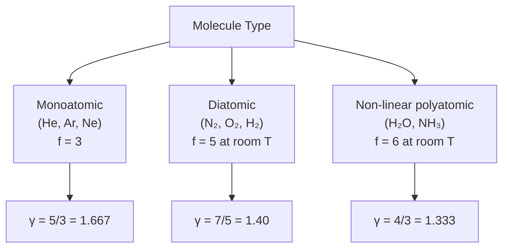

# 09 — Degrees of Freedom

## 1. Overview

While Topic 08 treated molecules as point masses (3 translational degrees), real molecules
can also rotate and vibrate. This topic introduces the concept of **degrees of freedom**
and the **Law of Equipartition of Energy**, which distributes $\frac{1}{2}k_BT$ of energy
equally among all active degrees. This gives the heat capacity ratios $\gamma$ used in
[→ Adiabatic Relation](06_adiabatic_relation.md) their microscopic justification.

---

## 2. Definitions & Key Terms

**1. Degree of Freedom ($f$)** — *The number of independent coordinates required to
completely specify the position and orientation of a molecule, or equivalently, the number
of independent quadratic terms in the molecule's energy expression.*

**2. Translational Degree of Freedom** — *Motion of the centre of mass along one
coordinate axis: energy $= \frac{1}{2}mv_i^2$ ($i = x, y, z$).*

**3. Rotational Degree of Freedom** — *Rotation about one axis: energy $= \frac{1}{2}I\omega_i^2$.*

**4. Vibrational Degree of Freedom** — *One mode of vibration counts as 2 degrees (1 KE + 1 PE):
energy $= \frac{1}{2}\mu\dot{x}^2 + \frac{1}{2}k x^2$.*

**5. Law of Equipartition of Energy** — *At thermal equilibrium at temperature $T$, each
independent quadratic energy term in the Hamiltonian has mean energy $\frac{1}{2}k_BT$.*

---

## 3. Core Content

### 3.1 Types of Degrees of Freedom

**Translational (all molecules):** 3 DOF — motion along $x$, $y$, $z$.

**Rotational:**
- Monoatomic (e.g., He, Ar): 0 rotational DOF (point mass; no moment of inertia about any axis).
- Diatomic (e.g., N₂, O₂, HCl): 2 rotational DOF (rotation about 2 axes perpendicular to the bond; rotation about the bond axis has negligible moment of inertia — *frozen out* classically).
- Non-linear polyatomic (e.g., H₂O, NH₃): 3 rotational DOF (rotation about all 3 principal axes).
- Linear polyatomic (e.g., CO₂): 2 rotational DOF (same as diatomic, bond axis frozen).

**Vibrational:**
- Each vibrational mode: 2 DOF (1 kinetic + 1 potential).
- For a molecule of $n$ atoms: total DOF = $3n$; $f_{\text{vib}} = 3n - f_{\text{trans}} - f_{\text{rot}}$.
- At room temperature, vibrational modes are **frozen out** for most diatomic molecules.

---

### 3.2 Summary of Degrees of Freedom

| Molecule type | $f_{\text{trans}}$ | $f_{\text{rot}}$ | $f_{\text{vib}}$ | $f_{\text{active at room T}}$ |
|---------------|----|----|----|----|
| Monoatomic (He) | 3 | 0 | 0 | 3 |
| Diatomic (N₂) | 3 | 2 | 2 (frozen) | 5 |
| Linear polyatomic (CO₂) | 3 | 2 | 4 (mostly frozen) | 5 |
| Non-linear polyatomic (H₂O) | 3 | 3 | 3 (mostly frozen) | 6 |

---

### 3.3 Law of Equipartition of Energy

For a system at temperature $T$, the **mean energy per degree of freedom** is:

$$\langle \epsilon\rangle = \frac{1}{2}k_BT$$

For a molecule with $f$ active degrees of freedom:

$$\langle E_{\text{molecule}}\rangle = \frac{f}{2}k_BT$$

For $N$ molecules (or $n$ moles):

$$U = N \cdot \frac{f}{2}k_BT = n \cdot \frac{f}{2}RT$$

---

### 3.4 Heat Capacities from Equipartition

$$\boxed{C_v = \frac{f}{2}R} \quad \text{(molar, constant volume)}$$

$$\boxed{C_p = C_v + R = \left(\frac{f}{2} + 1\right)R} \quad \text{(Mayer's relation)}$$

$$\boxed{\gamma = \frac{C_p}{C_v} = \frac{f+2}{f}}$$

| Molecule | $f$ | $C_v$ | $C_p$ | $\gamma$ |
|----------|-----|-------|-------|---------|
| Monoatomic | 3 | $\frac{3}{2}R$ | $\frac{5}{2}R$ | $5/3 \approx 1.667$ |
| Diatomic (rigid) | 5 | $\frac{5}{2}R$ | $\frac{7}{2}R$ | $7/5 = 1.4$ |
| Non-linear polyatomic | 6 | $3R$ | $4R$ | $4/3 \approx 1.333$ |

---

### 3.5 Experimental Verification and Limitations

**Agreement:** Noble gases (He, Ar, Ne) confirm $\gamma = 5/3$ precisely.
Diatomic gases (N₂, O₂) at room temperature give $\gamma \approx 1.40$, consistent with $f = 5$.

**Failure at low temperatures:** Rotational modes freeze out at low $T$ (quantum effects),
so $\gamma$ rises toward 5/3 for diatomics at very low $T$.

**Failure at high temperatures:** Vibrational modes activate at high $T$, increasing $C_v$
and reducing $\gamma$ below 1.40 for diatomics.

> ⚠️ **Convention note:** The number of *active* degrees of freedom depends on temperature.
> Room-temperature values are used unless otherwise stated. This is classical equipartition;
> quantum corrections (Planck) are needed for full accuracy.

---

## 4. Worked Examples

### Example 1 — 🟢 Foundational

**Problem:** Calculate $C_v$, $C_p$, and $\gamma$ for argon (monoatomic).

**Solution**

$f = 3$ (translational only, monoatomic)

$$C_v = \frac{3}{2}R = \frac{3}{2} \times 8.314 = \boxed{12.47\;\text{J mol}^{-1}\text{K}^{-1}}$$

$$C_p = C_v + R = 12.47 + 8.314 = \boxed{20.79\;\text{J mol}^{-1}\text{K}^{-1}}$$

$$\gamma = C_p/C_v = 20.79/12.47 = \boxed{5/3 \approx 1.667}$$

---

### Example 2 — 🟡 Intermediate

**Problem:** At 300 K, calculate the total internal energy of 2.0 moles of N₂ (diatomic,
$f = 5$ at room temperature). How much does $U$ increase if $T$ rises by 50 K?

**Solution**

At $T = 300$ K:

$$U = n\frac{f}{2}RT = 2.0 \times \frac{5}{2} \times 8.314 \times 300 = 2.0 \times 2.5 \times 8.314 \times 300$$

$$= 2.0 \times 6235.5 = \boxed{12\,471\;\text{J} \approx 12.5\;\text{kJ}}$$

For $\Delta T = 50$ K:

$$\Delta U = nC_v\Delta T = 2.0 \times \frac{5}{2} \times 8.314 \times 50 = 2.0 \times 20.785 \times 50$$

$$= \boxed{2078.5\;\text{J} \approx 2.08\;\text{kJ}}$$

---

### Example 3 — 🔴 Advanced / Exam-Level

**Problem:** A mixture contains 1.0 mol of He ($f = 3$) and 1.0 mol of N₂ ($f = 5$).

(a) Find the total internal energy at 400 K.
(b) If the mixture is heated at constant volume, find the effective $C_v^{\text{mix}}$.
(c) Find $\gamma_{\text{mix}}$ for the mixture.

**Solution**

**Part (a):**

$U_{\text{He}} = 1.0 \times \frac{3}{2} \times 8.314 \times 400 = 4988\;\text{J}$

$U_{\text{N}_2} = 1.0 \times \frac{5}{2} \times 8.314 \times 400 = 8314\;\text{J}$

$$\boxed{U_{\text{mix}} = 4988 + 8314 = 13\,302\;\text{J} \approx 13.3\;\text{kJ}}$$

**Part (b):**

$C_v^{\text{mix}} = \frac{dU/dT}{n_{\text{total}}} = \frac{n_{\text{He}}C_{v,\text{He}} + n_{\text{N}_2}C_{v,\text{N}_2}}{n_{\text{total}}}$

$= \frac{1.0 \times \frac{3}{2}R + 1.0 \times \frac{5}{2}R}{2.0} = \frac{\frac{3}{2}R + \frac{5}{2}R}{2} = \frac{4R}{2} = 2R$

$$\boxed{C_v^{\text{mix}} = 2R = 16.63\;\text{J mol}^{-1}\text{K}^{-1}}$$

**Part (c):**

$C_p^{\text{mix}} = C_v^{\text{mix}} + R = 3R$

$$\gamma_{\text{mix}} = \frac{C_p}{C_v} = \frac{3R}{2R} = \boxed{1.50}$$

*(Between monoatomic $\gamma = 1.667$ and diatomic $\gamma = 1.4$, as expected.)*

---

## 5. Applications

**Specific Heat of Textiles at High Temperature** — Understanding how molecular degrees of
freedom activate at higher temperatures informs process designers about the heat capacity
change of polymer fibres during heat-setting. Vibrational modes in polymer chains absorb
significant heat at processing temperatures.

**Sound Speed in Gases** — The speed of sound $v_s = \sqrt{\gamma P/\rho} = \sqrt{\gamma RT/M}$.
Knowing $\gamma$ (hence $f$) allows prediction of sound speed: monoatomic gases have
higher $\gamma$ and thus higher sound speed than diatomic gases at the same temperature.

---

## 6. Diagram / Visual

*Figure 1: Degrees of freedom and resulting $\gamma$ values for different molecule types.*

---

## 7. Common Mistakes

- ❌ **Mistake:** Counting vibrational modes for diatomic gases at room temperature.
  ✅ **Correct:** Vibrational modes are quantum-mechanically "frozen" at room temperature for most diatomics (N₂, O₂, H₂). Use $f = 5$ (3 translational + 2 rotational) unless stated otherwise.

- ❌ **Mistake:** Including rotation about the bond axis for diatomic molecules.
  ✅ **Correct:** This rotation has negligible moment of inertia (atoms treated as points along the axis) so it is not counted classically.

- ❌ **Mistake:** Applying $\gamma = (f+2)/f$ with the wrong $f$.
  ✅ **Correct:** Always identify the molecule type and specify whether vibrational modes are active.

- ❌ **Mistake:** Assuming $C_v$ of a mixture is just the average of individual $C_v$ values.
  ✅ **Correct:** The effective $C_v^{\text{mix}} = \sum_i x_i C_{v,i}$ where $x_i = n_i/n_{\text{total}}$ is the mole fraction.

---

## 8. Practice Problems

**Problem 1:** Calculate $\gamma$ for CO₂ (linear molecule, $f = 5$ at room temperature).

Solution

$f = 5$: $\gamma = (f+2)/f = 7/5 = \boxed{1.40}$

*(CO₂ linear: 3 translational + 2 rotational = 5 active DOF at room temperature)*

---

**Problem 2 (Exam-level):** A diatomic gas ($f = 5$) is heated from 300 K to 1500 K,
at which temperature vibrational modes activate ($f = 7$). Calculate the total energy per
mole if (a) the transition happened instantaneously at 900 K, and (b) compare to a
hypothetical gas with constant $f = 5$ throughout.

Solution

**Part (a):** Two stages:

Stage 1 (300→900 K, $f = 5$): $\Delta U_1 = \frac{5}{2}R(900-300) = 2.5 \times 8.314 \times 600 = 12\,471\;\text{J}$

Stage 2 (900→1500 K, $f = 7$): $\Delta U_2 = \frac{7}{2}R(1500-900) = 3.5 \times 8.314 \times 600 = 17\,459\;\text{J}$

$U_{\text{total}} = U(300) + \Delta U_1 + \Delta U_2 = \frac{5}{2}R \times 300 + 12\,471 + 17\,459$

$= 6236 + 12\,471 + 17\,459 = \boxed{36\,166\;\text{J}}$

**Part (b):** Constant $f = 5$: $U = \frac{5}{2}R \times 1500 = 31\,178\;\text{J}$

Difference = $36\,166 - 31\,178 = \boxed{4988\;\text{J}}$ more energy absorbed due to vibrational activation.

---

## 9. Summary

| Molecule | $f$ | $C_v$ | $\gamma$ |
|----------|-----|-------|---------|
| Monoatomic | 3 | $\frac{3}{2}R$ | 1.667 |
| Diatomic (rigid) | 5 | $\frac{5}{2}R$ | 1.40 |
| Non-linear polyatomic | 6 | $3R$ | 1.333 |

$$\langle E\rangle = \frac{f}{2}k_BT \quad \text{(equipartition)} \quad C_v = \frac{f}{2}R \quad \gamma = \frac{f+2}{f}$$

Next: [→ Mean Free Path](10_mean_free_path.md) — the average distance between molecular
collisions, and its role in transport phenomena.

---

## 10. References

1. **Halliday, Resnick & Walker — *Fundamentals of Physics*, 10th ed., §19-7, §19-8.** Equipartition and heat capacity.
2. **Serway & Jewett — *Physics for Scientists & Engineers*, 9th ed., §21-4.** Degrees of freedom with temperature dependence.
3. **HyperPhysics — Equipartition of Energy.** [http://hyperphysics.phy-astr.gsu.edu/hbase/kinetic/eqpar.html](http://hyperphysics.phy-astr.gsu.edu/hbase/kinetic/eqpar.html)
4. **Reif, F. — *Fundamentals of Statistical and Thermal Physics*.** Quantum correction to classical equipartition.
