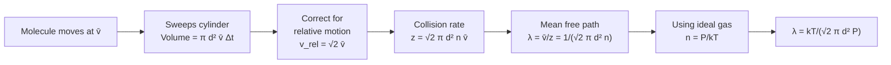

# 10 — Mean Free Path

## 1. Overview

The mean free path $\lambda$ is the average distance a molecule travels between successive
collisions. It quantifies how "crowded" a gas is and directly determines transport
properties (viscosity, thermal conductivity, diffusion). This topic builds on the pressure
derivation of [→ Topic 08](08_expression_of_pressure_from_kinetic_theory.md) and
introduces the collision model that separates ideal gas behaviour (Topics 07-09) from the
real-gas corrections of [→ Van der Waals' Equation](11_van_der_waals_equation_of_state.md).

> **Notation:** $n$ = number density [m⁻³] ($= N/V$); $d$ = molecular diameter [m];
> $\bar{v}$ = mean molecular speed [m s⁻¹].

---

## 2. Definitions & Key Terms

**1. Mean Free Path ($\lambda$)** — *The average distance travelled by a molecule between
two successive collisions.*

**2. Collision Frequency ($z$)** — *The average number of collisions a single molecule
makes per unit time [s⁻¹].*

**3. Collision Cross-Section ($\sigma$)** — *The effective cross-sectional area $\sigma = \pi d^2$
that a moving molecule sweeps, within which another molecule's centre must lie for a
collision to occur.*

**4. Number Density ($n$)** — *$n = N/V$ = number of molecules per unit volume [m⁻³].*

---

## 3. Core Content

### 3.1 Collision Model

Consider one molecule of diameter $d$ moving through a gas of identical molecules at rest
(simplified first; corrected below). In time $\Delta t$, the moving molecule sweeps out a
cylinder of:

- Cross-sectional area: $\sigma = \pi d^2$ (two spheres collide when centres are within $d$)
- Length: $\bar{v}\,\Delta t$
- Volume swept: $\pi d^2 \bar{v}\,\Delta t$

Number of collisions in $\Delta t$:

$$z_{\text{approx}} = n\pi d^2 \bar{v}\,\Delta t$$

But the target molecules are also moving. The correct relative speed between two identical
molecules (from the Maxwell-Boltzmann distribution) is:

$$v_{\text{rel}} = \sqrt{2}\,\bar{v}$$

### 3.2 Derivation of Mean Free Path

Corrected collision frequency (per unit time):

$$z = \sqrt{2}\,\pi d^2\,n\,\bar{v} \quad \text{[s}^{-1}\text{]}$$

Mean free path = (mean speed) / (collision frequency):

$$\lambda = \frac{\bar{v}}{z} = \frac{\bar{v}}{\sqrt{2}\,\pi d^2 n\,\bar{v}}$$

$$\boxed{\lambda = \frac{1}{\sqrt{2}\,\pi d^2 n}}$$

Using the ideal gas law $n = P/(k_BT)$:

$$\boxed{\lambda = \frac{k_BT}{\sqrt{2}\,\pi d^2 P}}$$

**Key observations:**
- $\lambda \propto T/P$: increasing temperature (at constant $P$) → lower density → longer $\lambda$.
- $\lambda \propto 1/d^2$: smaller molecules have longer mean free path.
- $\lambda$ is independent of molecular speed (it cancels in the ratio $\bar{v}/z$).

---

### 3.3 Typical Values

| Gas | $d$ (nm) | At STP (0 °C, 1 atm) $\lambda$ (nm) |
|-----|---------|-------------------------------------|
| N₂ | 0.37 | ~66 |
| O₂ | 0.35 | ~73 |
| H₂ | 0.25 | ~126 |
| He | 0.26 | ~174 |

*(Source: Halliday & Resnick, various editions; values vary slightly with choice of $d$.)*

At STP, $\lambda \approx 10^{-7}$ m, which is ~200 molecular diameters.

---

### 3.4 Collision Frequency and Mean Free Time

Collision frequency: $z = \bar{v}/\lambda = \sqrt{2}\,\pi d^2 n\,\bar{v}$

Mean free time (between collisions): $\tau = 1/z = \lambda/\bar{v}$

---

### 3.5 Knudsen Number and Relevance

The **Knudsen number** $\text{Kn} = \lambda / L$ (where $L$ is a characteristic dimension):
- $\text{Kn} \ll 1$: Continuum flow (viscous regime) — $\lambda \ll$ device size.
- $\text{Kn} \gg 1$: Free-molecular flow — $\lambda \gg$ device size (e.g., vacuum systems, MEMS).

---

## 4. Worked Examples

### Example 1 — 🟢 Foundational

**Problem:** Nitrogen molecules have diameter $d = 3.7 \times 10^{-10}$ m. At STP
($T = 273\;\text{K}$, $P = 1.013 \times 10^5\;\text{Pa}$), find $\lambda$.

**Solution**

$$n = \frac{P}{k_BT} = \frac{1.013 \times 10^5}{1.38 \times 10^{-23} \times 273} = \frac{1.013 \times 10^5}{3.767 \times 10^{-21}} = 2.69 \times 10^{25}\;\text{m}^{-3}$$

$$\lambda = \frac{1}{\sqrt{2}\,\pi d^2 n} = \frac{1}{\sqrt{2}\,\pi \times (3.7 \times 10^{-10})^2 \times 2.69 \times 10^{25}}$$

$$= \frac{1}{1.414 \times \pi \times 1.369 \times 10^{-19} \times 2.69 \times 10^{25}}$$

$$= \frac{1}{1.414 \times 3.14159 \times 3.682 \times 10^{6}} = \frac{1}{1.635 \times 10^7}$$

$$\boxed{\lambda = 6.12 \times 10^{-8}\;\text{m} \approx 61\;\text{nm}}$$

---

### Example 2 — 🟡 Intermediate

**Problem:** For the N₂ gas in Example 1, find (a) the collision frequency $z$, and
(b) the mean free time $\tau$. Use $\bar{v} = 454\;\text{m s}^{-1}$ at 273 K.

**Solution**

**Part (a):**

$$z = \frac{\bar{v}}{\lambda} = \frac{454}{6.12 \times 10^{-8}} = \boxed{7.41 \times 10^{9}\;\text{s}^{-1}}$$

(≈ 7.4 billion collisions per second per molecule!)

**Part (b):**

$$\tau = \frac{1}{z} = \frac{1}{7.41 \times 10^9} = \boxed{1.35 \times 10^{-10}\;\text{s} \approx 0.135\;\text{ns}}$$

---

### Example 3 — 🔴 Advanced / Exam-Level

**Problem:** (a) If nitrogen is heated from 300 K to 900 K at constant pressure, by what
factor does $\lambda$ change? (b) If instead the pressure is tripled at constant
temperature, by what factor does $\lambda$ change? (c) In a semiconductor fabrication
chamber (length $L = 30$ cm), determine which regime applies at 300 K and 0.1 Pa.
($d_{\text{N}_2} = 3.7 \times 10^{-10}$ m, $k_B = 1.38 \times 10^{-23}$ J K⁻¹)

**Solution**

**Part (a):** $\lambda = k_BT/(\sqrt{2}\pi d^2 P)$. At constant $P$: $\lambda \propto T$.

$$\frac{\lambda_{900}}{\lambda_{300}} = \frac{900}{300} = \boxed{3}$$

$\lambda$ triples.

**Part (b):** At constant $T$: $\lambda \propto 1/P$.

$$\frac{\lambda_{\text{new}}}{\lambda_{\text{old}}} = \frac{1}{3}$$

$\lambda$ reduces to one third.

**Part (c):** At $T = 300$ K, $P = 0.1$ Pa:

$$\lambda = \frac{k_BT}{\sqrt{2}\pi d^2 P} = \frac{1.38 \times 10^{-23} \times 300}{\sqrt{2}\pi \times (3.7 \times 10^{-10})^2 \times 0.1}$$

Numerator: $4.14 \times 10^{-21}$

Denominator: $1.414 \times 3.14159 \times 1.369 \times 10^{-19} \times 0.1 = 6.085 \times 10^{-20}$

$$\lambda = \frac{4.14 \times 10^{-21}}{6.085 \times 10^{-20}} = 0.068\;\text{m} = 6.8\;\text{cm}$$

Knudsen number: $\text{Kn} = \lambda/L = 0.068/0.30 = 0.227$

Since $\text{Kn} \approx 0.23$ (transitional, between 0.01 and 10), this is the **transition regime** — neither pure viscous nor free-molecular flow. A more careful treatment is needed for process design at this pressure.

---

## 5. Applications

**Thermal Insulation (Vacuum Panels)** — By reducing gas pressure inside insulation panels
so that $\lambda > $ panel thickness (free-molecular regime), conduction through the gas
is eliminated. This principle underlies Dewar flasks and modern vacuum insulation panels.

**Vapour Deposition in Textile Coatings** — Physical vapour deposition (PVD) of metal
coatings onto fibres (e.g., for conductive textiles or EMI shielding) requires a vacuum
($\lambda >$ source-to-substrate distance) so molecules travel in straight lines without
scattering.

---

## 6. Diagram / Visual

*Figure 1: Logical derivation chain from the molecular collision model to the mean free path formula.*

---

## 7. Common Mistakes

- ❌ **Mistake:** Using $v_{\text{rms}}$ instead of $\bar{v}$ in collision frequency.
  ✅ **Correct:** The Maxwell-Boltzmann result for relative speed uses $\bar{v}$:
  $v_{\text{rel}} = \sqrt{2}\,\bar{v}$. The $\lambda$ result is the same regardless since $\bar{v}$ cancels, but the intermediate step must be consistent.

- ❌ **Mistake:** Forgetting the $\sqrt{2}$ correction factor.
  ✅ **Correct:** Treating target molecules as stationary gives $z = n\pi d^2\bar{v}$, which overestimates $\lambda$ by $\sqrt{2}$. The correct result has $\sqrt{2}$ in the denominator.

- ❌ **Mistake:** Writing $\sigma = \pi(d/2)^2 = \pi r^2$ (geometric cross-section of one sphere).
  ✅ **Correct:** The collision cross-section is $\sigma = \pi d^2$ (sum of radii = $d$, so area = $\pi d^2$).

- ❌ **Mistake:** Applying $\lambda = 1/(\sqrt{2}\pi d^2 n)$ without converting $n$ to m⁻³.
  ✅ **Correct:** Use $n = P/(k_BT)$ consistently in SI units. A common error is to use $P$ in atm and $k_B$ in J K⁻¹ without converting.

---

## 8. Practice Problems

**Problem 1:** Find $\lambda$ for hydrogen ($d = 2.5 \times 10^{-10}$ m) at 300 K and 1 atm.

Solution

$n = P/(k_BT) = (1.013 \times 10^5)/(1.38 \times 10^{-23} \times 300) = 2.446 \times 10^{25}$ m⁻³

$\lambda = 1/(\sqrt{2}\pi d^2 n) = 1/(1.414 \times \pi \times 6.25 \times 10^{-20} \times 2.446 \times 10^{25})$

$= 1/(1.414 \times \pi \times 1.529 \times 10^{6}) = 1/(6.792 \times 10^{6}) = \boxed{1.47 \times 10^{-7}\;\text{m} = 147\;\text{nm}}$

---

**Problem 2 (Exam-level):** At what pressure must nitrogen ($d = 3.7 \times 10^{-10}$ m)
be maintained at 300 K so that $\lambda = 1.0$ mm? (This relates to a rough vacuum gauge.)

Solution

$\lambda = k_BT/(\sqrt{2}\pi d^2 P) \implies P = k_BT/(\sqrt{2}\pi d^2 \lambda)$

$= (1.38 \times 10^{-23} \times 300)/(\sqrt{2}\pi \times (3.7 \times 10^{-10})^2 \times 1.0 \times 10^{-3})$

$= (4.14 \times 10^{-21})/(1.414 \times 3.14159 \times 1.369 \times 10^{-19} \times 10^{-3})$

$= (4.14 \times 10^{-21})/(6.085 \times 10^{-22})$

$= \boxed{6.80\;\text{Pa}}$

*(This corresponds to a rough vacuum, achievable with a rotary pump.)*

---

## 9. Summary

| Quantity | Formula | Notes |
|----------|---------|-------|
| Mean free path | $\lambda = \dfrac{1}{\sqrt{2}\pi d^2 n}$ | $n$ = number density |
| Alternative | $\lambda = \dfrac{k_BT}{\sqrt{2}\pi d^2 P}$ | $\lambda \propto T/P$ |
| Collision frequency | $z = \sqrt{2}\pi d^2 n \bar{v}$ | Collisions per second |
| Mean free time | $\tau = 1/z = \lambda/\bar{v}$ | — |
| Knudsen number | $\text{Kn} = \lambda/L$ | Continuum vs free-molecular |

Next: [→ Van der Waals' Equation of State](11_van_der_waals_equation_of_state.md) —
correcting the ideal gas law for finite molecular volume and intermolecular forces.

---

## 10. References

1. **Halliday, Resnick & Walker — *Fundamentals of Physics*, 10th ed., §19-5.** Mean free path derivation and numerical examples.
2. **Clausius, R. (1857) — "Über die Art der Bewegung, welche wir Wärme nennen."** Original mean free path concept.
3. **HyperPhysics — Mean Free Path.** [http://hyperphysics.phy-astr.gsu.edu/hbase/kinetic/mfp.html](http://hyperphysics.phy-astr.gsu.edu/hbase/kinetic/mfp.html)
4. **Bird, G.A. — *Molecular Gas Dynamics and the Direct Simulation of Gas Flows*.** Advanced treatment including Knudsen regime.
