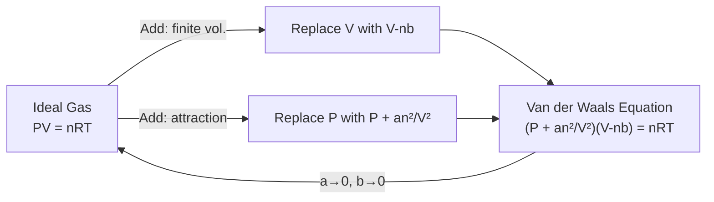

# 11 — Van der Waals' Equation of State

## 1. Overview

The ideal gas law $PV = nRT$ fails at high pressures and low temperatures where
intermolecular forces and molecular volumes matter. Johannes Diderik van der Waals (1873)
introduced two semi-empirical corrections to obtain a model that describes liquefaction
and critical phenomena. This topic builds on the postulates of KTG
([→ Topic 07](07_fundamental_postulates_of_kinetic_theory.md)) and the mean free path
model ([→ Topic 10](10_mean_free_path.md)), and is extended to critical constants in
[→ Topic 12](12_van_der_waals_constants_and_critical_constants.md).

> **Notation:** Throughout this file, $V_m$ = molar volume [m³ mol⁻¹] and $n$ = number of
> moles. $a$ [Pa m⁶ mol⁻²] and $b$ [m³ mol⁻¹] are the Van der Waals constants.

---

## 2. Definitions & Key Terms

**1. Van der Waals Equation** — *A modified equation of state for real gases that
corrects the ideal gas law for (i) finite molecular volume and (ii) intermolecular
attractions.*

**2. Van der Waals Constant $a$** — *Measures the strength of intermolecular attraction.
SI unit: Pa m⁶ mol⁻² = J m³ mol⁻².*
> Larger $a$ → stronger attraction → gas more easily liquefied.

**3. Van der Waals Constant $b$** — *The volume excluded per mole of gas due to finite
molecular size (co-volume). SI unit: m³ mol⁻¹.*
> $b \approx 4 \times N_A \times \frac{4}{3}\pi(d/2)^3$ = 4× molar volume of molecules.

**4. Real Gas** — *A gas that deviates from ideal behaviour, exhibiting intermolecular
forces and finite molecular volume.*

**5. Compressibility Factor ($Z$)** — *$Z = PV_m/(RT)$; measures deviation from ideal gas.
For ideal gas: $Z = 1$. For real gases, $Z$ varies with $P$ and $T$.*

---

## 3. Core Content

### 3.1 Failures of the Ideal Gas Law

**Failure 1 — Finite molecular volume:**

Ideal gas assumes molecules are point masses. Real molecules occupy volume; the free
volume available for motion is less than $V$. Correction: replace $V_m$ with
$(V_m - b)$, where $b$ is the excluded molar volume.

**Failure 2 — Intermolecular attractions:**

Molecules near a wall experience a net inward pull from their neighbours (more molecules
behind them than in front, where the wall is). This reduces the force with which they
hit the wall, so the measured pressure $P$ is less than the ideal pressure $P_{\text{ideal}}$.

The pressure correction is proportional to the square of the number density $\propto n^2/V^2 = (n/V)^2$. Per mole: $P_{\text{ideal}} = P + a/V_m^2$.

---

### 3.2 The Van der Waals Equation

**Per mole ($n = 1$):**

$$\boxed{\left(P + \frac{a}{V_m^2}\right)(V_m - b) = RT}$$

**For $n$ moles ($V = nV_m$):**

$$\boxed{\left(P + \frac{an^2}{V^2}\right)(V - nb) = nRT}$$

**Pressure-explicit form (per mole):**

$$P = \frac{RT}{V_m - b} - \frac{a}{V_m^2}$$

---

### 3.3 Physical Interpretation of Each Term

| Term | Meaning |
|------|---------|
| $P + a/V_m^2$ | "Corrected" (ideal) pressure — adds back the attraction-reduced pressure |
| $V_m - b$ | Free volume — subtracts the excluded volume |
| $a/V_m^2$ | Internal pressure correction — stronger at high density (small $V_m$) |
| $b$ | Co-volume — significant at high density |

---

### 3.4 Van der Waals Constants for Selected Gases

| Gas | $a$ (Pa m⁶ mol⁻²) | $b$ (m³ mol⁻¹ × 10⁻⁵) |
|-----|-------------------|-----------------------|
| He | 0.003457 | 2.370 |
| H₂ | 0.02476 | 2.661 |
| N₂ | 0.1370 | 3.870 |
| O₂ | 0.1382 | 3.186 |
| CO₂ | 0.3658 | 4.286 |
| H₂O | 0.5536 | 3.049 |

*(Source: Atkins & de Paula, *Physical Chemistry*, 10th ed., Table 1C.1)*

---

### 3.5 Reduction to Ideal Gas Law

For an ideal gas: $a \to 0$ (no attraction), $b \to 0$ (point masses):

$$\left(P + 0\right)(V_m - 0) = RT \implies PV_m = RT \quad \checkmark$$

The Van der Waals equation reduces exactly to the ideal gas law in this limit.

---

### 3.6 Behaviour at Low and High Density

**Low pressure / high volume ($V_m \to \infty$):**

$a/V_m^2 \to 0$ and $b/V_m \to 0$: equation → ideal gas.

**High pressure / low volume:**

Both corrections are significant; the equation predicts an S-shaped isotherm
(van der Waals loop) below the critical temperature — this loop represents the
liquid-gas phase transition region.

---

## 4. Worked Examples

### Example 1 — 🟢 Foundational

**Problem:** Calculate the pressure of 1.0 mol of N₂ ($a = 0.1370$ Pa m⁶ mol⁻²,
$b = 3.870 \times 10^{-5}$ m³ mol⁻¹) in a 1.0 L container at 300 K, using:
(a) the ideal gas law, (b) the Van der Waals equation.

**Solution**

**Part (a):** Ideal gas: $P = RT/V_m = 8.314 \times 300 / (1.0 \times 10^{-3})$

$$P_{\text{ideal}} = 2\,494\,200\;\text{Pa} \approx \boxed{24.94\;\text{atm}}$$

**Part (b):** VdW: $P = RT/(V_m - b) - a/V_m^2$

$V_m - b = 1.0 \times 10^{-3} - 3.870 \times 10^{-5} = 9.613 \times 10^{-4}$ m³ mol⁻¹

$RT/(V_m - b) = 8.314 \times 300 / (9.613 \times 10^{-4}) = 2493/9.613 \times 10^{-4} = 2\,593\,800\;\text{Pa}$

$a/V_m^2 = 0.1370 / (10^{-3})^2 = 0.1370/10^{-6} = 137\,000\;\text{Pa}$

$$P_{\text{VdW}} = 2\,593\,800 - 137\,000 = \boxed{2\,456\,800\;\text{Pa} \approx 24.23\;\text{atm}}$$

*Difference: ~3% — significant at this density.*

---

### Example 2 — 🟡 Intermediate

**Problem:** For CO₂ ($a = 0.3658\;\text{Pa m}^6\text{mol}^{-2}$,
$b = 4.286 \times 10^{-5}\;\text{m}^3\text{mol}^{-1}$) at 500 K and $V_m = 0.500\;\text{L mol}^{-1}$,
find the pressure using the VdW equation. Compare with ideal gas.

**Solution**

$V_m = 5.00 \times 10^{-4}$ m³ mol⁻¹

$P_{\text{VdW}} = \frac{RT}{V_m - b} - \frac{a}{V_m^2}$

$= \frac{8.314 \times 500}{5.00 \times 10^{-4} - 4.286 \times 10^{-5}} - \frac{0.3658}{(5.00 \times 10^{-4})^2}$

$= \frac{4157}{4.571 \times 10^{-4}} - \frac{0.3658}{2.5 \times 10^{-7}}$

$= 9\,096\,260 - 1\,463\,200$

$= \boxed{7\,633\,060\;\text{Pa} \approx 75.3\;\text{atm}}$

Ideal: $P_{\text{ideal}} = RT/V_m = 4157/(5 \times 10^{-4}) = 8\,314\,000\;\text{Pa} \approx 82.0\;\text{atm}$

*VdW gives lower pressure — attractions dominate at this density.*

---

### Example 3 — 🔴 Advanced / Exam-Level

**Problem:** Show that at low pressures (large $V_m$), the Van der Waals equation can
be written as:

$$Z = \frac{PV_m}{RT} = 1 + \left(b - \frac{a}{RT}\right)\frac{1}{V_m} + O(1/V_m^2)$$

This is the **virial expansion** (to second order). Identify the condition under which
$Z < 1$ (attractions dominate) and $Z > 1$ (repulsions dominate).

**Solution**

Starting from:

$$P = \frac{RT}{V_m - b} - \frac{a}{V_m^2}$$

$$\frac{PV_m}{RT} = \frac{V_m}{V_m - b} - \frac{a}{RTV_m}$$

For the first term, since $b \ll V_m$ at low pressure:

$$\frac{V_m}{V_m - b} = \frac{1}{1 - b/V_m} = 1 + \frac{b}{V_m} + \left(\frac{b}{V_m}\right)^2 + \cdots$$

Therefore:

$$Z = \frac{PV_m}{RT} = 1 + \frac{b}{V_m} - \frac{a}{RTV_m} + O(1/V_m^2)$$

$$\boxed{Z = 1 + \frac{1}{V_m}\!\left(b - \frac{a}{RT}\right) + O(1/V_m^2)}$$

**Condition for $Z < 1$** (attractions dominate): $b < a/(RT) \implies T < a/(bR)$

At low $T$: the $a/RT$ term dominates, $Z < 1$.

**Condition for $Z > 1$** (repulsions dominate): $b > a/(RT) \implies T > a/(bR) = 27T_c/8$ (from Topic 12).

At high $T$: molecular repulsions (excluded volume $b$) dominate, $Z > 1$.

---

## 5. Applications

**Natural Gas Pipelines** — High-pressure methane in pipelines deviates significantly from
ideal gas. Engineers use the VdW (or more accurate equations like Peng-Robinson) to
calculate actual volumes and compression work. Using the ideal gas law would
underestimate compressor power.

**Liquefaction of Gases** — Linde's process for liquefying air exploits the Joule-Thomson
effect, which is non-zero only for real gases (ideal gas: no temperature change on
expansion). The $a$ constant governs the magnitude of Joule-Thomson cooling.

---

## 6. Diagram / Visual

*Figure 1: The Van der Waals equation as a systematic correction to the ideal gas law.*

---

## 7. Common Mistakes

- ❌ **Mistake:** Writing $a/V^2$ instead of $a/V_m^2$ (total volume vs molar volume).
  ✅ **Correct:** For $n$ moles: $(P + an^2/V^2)(V - nb) = nRT$. For per-mole form: $(P + a/V_m^2)(V_m - b) = RT$.

- ❌ **Mistake:** Thinking $b$ = molecular volume per mole.
  ✅ **Correct:** $b \approx 4N_A \times V_{\text{molecule}}$ (4× the actual molecular volume), because the excluded volume per pair of molecules is the volume of a sphere of radius $d$.

- ❌ **Mistake:** Applying the VdW equation far below the critical temperature without noting the unphysical loop.
  ✅ **Correct:** The VdW S-shaped loop ($dP/dV > 0$ region) is thermodynamically unstable; it is replaced by the Maxwell equal-area construction (horizontal tie line) representing the phase transition.

---

## 8. Practice Problems

**Problem 1:** 2.0 mol of CO₂ at 300 K occupies 2.0 L. Find $P$ using (a) ideal gas, (b) VdW. ($a_{\text{CO}_2} = 0.3658\;\text{Pa m}^6\text{mol}^{-2}$, $b = 4.286 \times 10^{-5}\;\text{m}^3\text{mol}^{-1}$)

Solution

$V_m = V/n = 2.0 \times 10^{-3}/2.0 = 1.0 \times 10^{-3}$ m³ mol⁻¹

(a) $P_{\text{ideal}} = RT/V_m = 8.314 \times 300/10^{-3} = 2\,494\,200$ Pa ≈ **24.6 atm**

(b) $P_{\text{VdW}} = RT/(V_m-b) - a/V_m^2$

$= 8.314\times300/(10^{-3}-4.286\times10^{-5}) - 0.3658/(10^{-3})^2$

$= 2494.2/(9.571\times10^{-4}) - 365800$

$= 2\,606\,400 - 365\,800 = \boxed{2\,240\,600\;\text{Pa} \approx 22.1\;\text{atm}}$

---

**Problem 2 (Exam-level):** Calculate the compressibility factor $Z$ for N₂ at 300 K
and $P = 100\;\text{atm} = 1.013 \times 10^7$ Pa. Use VdW equation iteratively or
analytically.

Solution

Zero-order estimate: $V_m^{(0)} = RT/P = 8.314\times300/(1.013\times10^7) = 2.463\times10^{-4}$ m³/mol

First iteration (VdW, explicit form):

$V_m^{(1)} = b + RT/(P + a/V_m^{(0)2}) = 3.87\times10^{-5} + 2494.2/(1.013\times10^7 + 0.137/(2.463\times10^{-4})^2)$

$a/V_m^{0,2} = 0.137/(6.066\times10^{-8}) = 2.259\times10^6$

$V_m^{(1)} = 3.87\times10^{-5} + 2494.2/(1.013\times10^7 + 2.259\times10^6) = 3.87\times10^{-5} + 2494.2/(1.239\times10^7)$

$= 3.87\times10^{-5} + 2.013\times10^{-4} = 2.40\times10^{-4}$ m³/mol

$Z = PV_m/RT = 1.013\times10^7 \times 2.40\times10^{-4}/(8.314\times300) = 2431.2/2494.2 = \boxed{0.975}$

*(Z < 1 → attractions slightly dominate at 300 K, 100 atm for N₂)*

---

## 9. Summary

| Concept | Expression | Limit |
|---------|-----------|-------|
| VdW equation (per mol) | $(P + a/V_m^2)(V_m - b) = RT$ | Real gas |
| Ideal gas limit | $a = 0$, $b = 0$ | Point masses, no forces |
| $a$ correction | Reduces pressure (attraction) | Significant at high density |
| $b$ correction | Increases effective pressure (volume exclusion) | Significant at very high density |
| Compressibility | $Z = PV_m/RT = 1 + (b - a/RT)/V_m + \cdots$ | Low-pressure virial |

Next: [→ VdW Constants and Critical Constants](12_van_der_waals_constants_and_critical_constants.md) — deriving the critical point from the VdW equation.

---

## 10. References

1. **Atkins, P. & de Paula, J. — *Physical Chemistry*, 10th ed., §1C.** Complete treatment of VdW equation, virial expansion, and constants table.
2. **Halliday, Resnick & Walker — *Fundamentals of Physics*, 10th ed., §19-9.** Introductory treatment of real gases.
3. **van der Waals, J.D. (1873) — *Over de continuiteit van den gas- en vloeistoftoestand.* (PhD thesis, Leiden).** Original derivation (historical).
4. **HyperPhysics — Van der Waals Equation.** [http://hyperphysics.phy-astr.gsu.edu/hbase/kinetic/waal.html](http://hyperphysics.phy-astr.gsu.edu/hbase/kinetic/waal.html)
