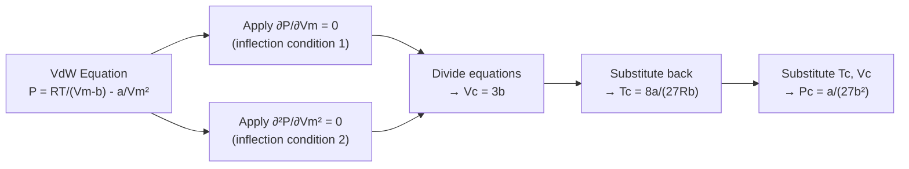

# 12 — Inter-relations between Van der Waals' Constants and Critical Constants

## 1. Overview

The critical point is the end of the liquid-vapour coexistence curve. At the critical
point, the VdW isotherm has a horizontal inflection point, which imposes two conditions
whose solution yields exact expressions for the critical temperature $T_c$, pressure $P_c$,
and volume $V_c$ in terms of $a$ and $b$ (and vice versa). This topic is the analytical
foundation for [→ Critical Coefficient](13_critical_coefficient.md). Builds on
[→ Van der Waals' Equation](11_van_der_waals_equation_of_state.md).

> **Notation:** All equations are per mole ($n = 1$). $V_m$ is molar volume [m³ mol⁻¹].

---

## 2. Definitions & Key Terms

**1. Critical Temperature ($T_c$)** — *The temperature above which a gas cannot be
liquefied regardless of pressure.*
> Plain-English: Beyond $T_c$, no amount of squeezing turns the gas into a liquid.

**2. Critical Pressure ($P_c$)** — *The pressure required to liquefy a gas at the
critical temperature.*
> Plain-English: The minimum pressure that still produces liquefaction right at $T_c$.

**3. Critical Volume ($V_c$)** — *The molar volume of a gas at the critical point.*
> Plain-English: How much space one mole of the substance occupies exactly at the
> critical state.

**4. Critical Point** — *The state $(P_c, V_c, T_c)$ at which the densities of liquid and
vapour become equal and the meniscus between phases disappears.*
> Plain-English: The point where "liquid" and "gas" stop being distinguishable.

**5. Inflection Point Condition** — *At the critical isotherm:
$\left(\partial P/\partial V_m\right)_{T_c} = 0$ and
$\left(\partial^2 P/\partial V_m^2\right)_{T_c} = 0$.*
> Plain-English: The P–V curve is momentarily flat and has zero curvature — a saddle-like
> flattening rather than a simple minimum or maximum.

---

## 3. Core Content

### 3.1 The Two Conditions at the Critical Point

The VdW equation (pressure-explicit form, per mole):

$$P = \frac{RT}{V_m - b} - \frac{a}{V_m^2} \quad \cdots (*)$$

At the critical point, the $P$–$V_m$ isotherm has a **horizontal inflection point**:

**Condition 1:** $\left(\dfrac{\partial P}{\partial V_m}\right)_{T_c} = 0$

**Condition 2:** $\left(\dfrac{\partial^2 P}{\partial V_m^2}\right)_{T_c} = 0$

These two simultaneous equations, together with $(*)$ itself, are solved for the three
unknowns $T_c$, $V_c$, $P_c$.

---

### 3.2 Applying Condition 1

$$\frac{\partial P}{\partial V_m} = -\frac{RT}{(V_m - b)^2} + \frac{2a}{V_m^3} = 0$$

At the critical point ($V_m = V_c$, $T = T_c$):

$$\frac{RT_c}{(V_c - b)^2} = \frac{2a}{V_c^3} \quad \cdots \text{(I)}$$

---

### 3.3 Applying Condition 2

$$\frac{\partial^2 P}{\partial V_m^2} = \frac{2RT}{(V_m - b)^3} - \frac{6a}{V_m^4} = 0$$

At the critical point:

$$\frac{2RT_c}{(V_c - b)^3} = \frac{6a}{V_c^4} \quad \cdots \text{(II)}$$

---

### 3.4 Solving for $V_c$

Divide equation (II) by equation (I):

$$\frac{2RT_c/(V_c-b)^3}{RT_c/(V_c-b)^2} = \frac{6a/V_c^4}{2a/V_c^3}$$

$$\frac{2}{V_c - b} = \frac{3}{V_c}$$

$$2V_c = 3(V_c - b) = 3V_c - 3b$$

$$3b = 3V_c - 2V_c = V_c$$

$$\boxed{V_c = 3b}$$

---

### 3.5 Solving for $T_c$

Substitute $V_c = 3b$ into equation (I):

$$\frac{RT_c}{(3b - b)^2} = \frac{2a}{(3b)^3}$$

$$\frac{RT_c}{4b^2} = \frac{2a}{27b^3}$$

Multiply both sides by $4b^2$:

$$RT_c = \frac{2a}{27b^3} \times 4b^2 = \frac{8a}{27b}$$

$$\boxed{T_c = \frac{8a}{27Rb}}$$

---

### 3.6 Solving for $P_c$

Substitute $V_c = 3b$ and $T_c = 8a/(27Rb)$ into $(*)$:

$$P_c = \frac{RT_c}{V_c - b} - \frac{a}{V_c^2}$$

$$= \frac{R \cdot \dfrac{8a}{27Rb}}{3b - b} - \frac{a}{(3b)^2}$$

$$= \frac{\dfrac{8a}{27b}}{2b} - \frac{a}{9b^2}$$

$$= \frac{8a}{54b^2} - \frac{a}{9b^2} = \frac{4a}{27b^2} - \frac{3a}{27b^2}$$

$$\boxed{P_c = \frac{a}{27b^2}}$$

---

### 3.7 Summary: Forward Relations ($a, b \to$ critical constants)

$$\boxed{V_c = 3b} \qquad \boxed{T_c = \frac{8a}{27Rb}} \qquad \boxed{P_c = \frac{a}{27b^2}}$$

---

### 3.8 Inverse Relations (critical constants $\to a, b$)

From the forward relations:

$$b = \frac{V_c}{3}$$

$$b = \frac{RT_c}{8P_c} \quad \text{(equivalent form, derived in Example 3 below)}$$

$$a = 3P_c V_c^2 = \frac{27R^2T_c^2}{64P_c}$$

$$R = \frac{8P_cV_c}{3T_c}$$

These allow determination of $a$ and $b$ from experimentally measured $P_c$, $T_c$,
and $V_c$ — the standard route used in physical chemistry data tables, since critical
constants are directly measurable while $a$ and $b$ are not.

---

### 3.9 Selected Critical Constants and VdW Coefficients

| Gas | $T_c$ (K) | $P_c$ (atm) | $V_c$ (L mol⁻¹) | $a$ (L² atm mol⁻²) | $b$ (L mol⁻¹) |
|-----|-----------|------------|-----------------|---------------------|--------------|
| He | 5.2 | 2.24 | 0.0578 | 0.0341 | 0.02370 |
| H₂ | 33.2 | 12.8 | 0.0650 | 0.2444 | 0.02661 |
| N₂ | 126.2 | 33.5 | 0.0899 | 1.352 | 0.03870 |
| O₂ | 154.8 | 50.1 | 0.0780 | 1.364 | 0.03186 |
| CO₂ | 304.2 | 72.8 | 0.0941 | 3.658 | 0.04286 |
| H₂O | 647.4 | 218.3 | 0.0566 | 5.464 | 0.03049 |

*(Source: Atkins & de Paula, Physical Chemistry, 10th ed., Table 1C.2)*

---

## 4. Worked Examples

### Example 1 — 🟢 Foundational

**Problem:** Using $a = 1.352\;\text{L}^2\text{atm mol}^{-2}$ and $b = 0.03870\;\text{L mol}^{-1}$
for N₂, calculate $T_c$, $P_c$, and $V_c$. ($R = 0.08206\;\text{L atm mol}^{-1}\text{K}^{-1}$)

**Solution**

Step 1: Critical volume

$$V_c = 3b = 3 \times 0.03870 = \boxed{0.1161\;\text{L mol}^{-1}}$$

Step 2: Critical temperature

$$T_c = \frac{8a}{27Rb} = \frac{8 \times 1.352}{27 \times 0.08206 \times 0.03870} = \frac{10.816}{0.08573}$$

$$\boxed{T_c = 126.2\;\text{K}}$$

Step 3: Critical pressure

$$P_c = \frac{a}{27b^2} = \frac{1.352}{27 \times (0.03870)^2} = \frac{1.352}{0.04044}$$

$$\boxed{P_c = 33.4\;\text{atm}}$$

*These match the experimental values in the table above. ✓*

---

### Example 2 — 🟡 Intermediate

**Problem:** The critical temperature and pressure of CO₂ are $T_c = 304.2$ K and
$P_c = 72.8$ atm. Find $a$ and $b$ for CO₂.

**Solution**

Step 1: Apply $a = 27R^2T_c^2/(64P_c)$

$$a = \frac{27 \times (0.08206)^2 \times (304.2)^2}{64 \times 72.8}$$

Numerator: $27 \times 0.006734 \times 92\,537.6 = 27 \times 623.2 = 16\,826$

Denominator: $64 \times 72.8 = 4659.2$

$$a = \frac{16\,826}{4659.2} = \boxed{3.611\;\text{L}^2\text{atm mol}^{-2}}$$

*(Tabulated: 3.658 — small deviation from rounding in intermediate steps)*

Step 2: Apply $b = RT_c/(8P_c)$

$$b = \frac{0.08206 \times 304.2}{8 \times 72.8} = \frac{24.96}{582.4}$$

$$\boxed{b = 0.04287\;\text{L mol}^{-1}}$$

*(Tabulated: 0.04286 ✓)*

---

### Example 3 — 🔴 Advanced / Exam-Level

**Problem:** Starting from $V_c = 3b$, $T_c = 8a/(27Rb)$, $P_c = a/(27b^2)$:

(a) Derive $b$ in terms of $R$, $T_c$, $P_c$.
(b) Derive $a$ in terms of $R$, $T_c$, $P_c$.
(c) For He ($T_c = 5.2$ K, $P_c = 2.24$ atm), find $a$ and $b$ using these formulae.

**Solution**

**Part (a):** Divide $T_c$ by $P_c$:

$$\frac{T_c}{P_c} = \frac{8a/(27Rb)}{a/(27b^2)} = \frac{8a}{27Rb} \times \frac{27b^2}{a} = \frac{8b}{R}$$

$$\boxed{b = \frac{RT_c}{8P_c}}$$

**Part (b):** Substitute the result for $b$ into $P_c = a/(27b^2)$:

$$a = 27P_c b^2 = 27P_c \left(\frac{RT_c}{8P_c}\right)^2 = 27P_c \times \frac{R^2T_c^2}{64P_c^2}$$

$$\boxed{a = \frac{27R^2T_c^2}{64P_c}}$$

**Part (c):** For He, $T_c = 5.2$ K, $P_c = 2.24$ atm, $R = 0.08206$ L atm mol⁻¹ K⁻¹

$$b = \frac{0.08206 \times 5.2}{8 \times 2.24} = \frac{0.4267}{17.92} = \boxed{0.0238\;\text{L mol}^{-1}}$$

$$a = \frac{27 \times (0.08206)^2 \times (5.2)^2}{64 \times 2.24} = \frac{27 \times 0.006734 \times 27.04}{143.36} = \frac{4.913}{143.36}$$

$$\boxed{a = 0.0343\;\text{L}^2\text{atm mol}^{-2}}$$

*Compare with table: $a = 0.0341$, $b = 0.02370$ — close agreement, residual difference
from rounding at intermediate steps. ✓*

---

## 5. Applications

**Industrial Gas Liquefaction** — $T_c$ defines the temperature below which a gas can
be liquefied at all. Knowing $T_c$ from VdW constants guides the operating conditions of
Linde-cycle compressors used to liquefy N₂, O₂, and He for cryogenic SEM fibre analysis
and superconducting-magnet applications in research laboratories.

**Supercritical Fluid Extraction in Textile Dyeing** — Supercritical CO₂ ($T > T_c =
304.2$ K, $P > P_c = 72.8$ atm) is used for waterless dyeing of polyester, since the
fluid penetrates fibres like a gas while carrying dye like a liquid. Process engineers
size equipment using the exact $T_c$ and $P_c$ derived here.

---

## 6. Diagram / Visual

*Figure 1: Derivation chain from the VdW equation to the three critical constants.*

---

## 7. Common Mistakes

- ❌ **Mistake:** Setting only one partial derivative to zero.
  ✅ **Correct:** Both the first AND second partial derivatives must vanish at the inflection point. Setting only $\partial P/\partial V_m = 0$ would also be satisfied by ordinary maxima or minima — it is the *combination* with $\partial^2 P/\partial V_m^2 = 0$ that picks out the unique inflection.

- ❌ **Mistake:** Using $V_c = b$ (the excluded volume itself) instead of $V_c = 3b$.
  ✅ **Correct:** The critical volume is three times the co-volume: $V_c = 3b$.

- ❌ **Mistake:** Mixing unit systems for $a$ (Pa m⁶ mol⁻² vs L² atm mol⁻²) within the same calculation.
  ✅ **Correct:** Choose one consistent unit system throughout a problem. Conversion: $1\;\text{L}^2\text{atm mol}^{-2} = 0.101325\;\text{Pa m}^6\text{mol}^{-2}$.

- ❌ **Mistake:** Forgetting that the inverse relations ($a$, $b$ from $T_c$, $P_c$) require both critical constants — $T_c$ alone, or $P_c$ alone, is insufficient.
  ✅ **Correct:** Always use the paired formulae $b = RT_c/(8P_c)$ and $a = 27R^2T_c^2/(64P_c)$ together.

---

## 8. Practice Problems

**Problem 1:** For O₂, $a = 1.364\;\text{L}^2\text{atm mol}^{-2}$, $b = 0.03186\;\text{L mol}^{-1}$.
Calculate $T_c$, $P_c$, $V_c$.

Solution

$$V_c = 3 \times 0.03186 = \boxed{0.09558\;\text{L mol}^{-1}}$$

$$T_c = \frac{8 \times 1.364}{27 \times 0.08206 \times 0.03186} = \frac{10.912}{0.07063} = \boxed{154.5\;\text{K}}$$

$$P_c = \frac{1.364}{27 \times (0.03186)^2} = \frac{1.364}{0.02740} = \boxed{49.8\;\text{atm}}$$

*(Experimental: $T_c = 154.8$ K, $P_c = 50.1$ atm — close agreement ✓)*

---

**Problem 2:** Derive $b = RT_c/(8P_c)$ directly from the critical-point conditions
(not from $V_c = 3b$ and $T_c = 8a/27Rb$) and verify numerically for CO₂.

Solution

From the ratio $T_c/P_c$ found in §3.8 / Example 3:

$$\frac{T_c}{P_c} = \frac{8b}{R} \implies b = \frac{RT_c}{8P_c}$$

Numerical check for CO₂ ($T_c = 304.2$ K, $P_c = 72.8$ atm):

$$b = \frac{0.08206 \times 304.2}{8 \times 72.8} = \frac{24.96}{582.4} = \boxed{0.04287\;\text{L mol}^{-1}}$$

Tabulated: $b = 0.04286$ ✓

---

**Problem 3 (Exam-level):** Two hypothetical gases X and Y have the same $T_c$ but
gas Y has twice the $P_c$ of gas X. Find the ratio $V_{c,X}/V_{c,Y}$ and $b_X/b_Y$.

Solution

From $b = RT_c/(8P_c)$, at the same $T_c$: $b \propto 1/P_c$.

$$\frac{b_X}{b_Y} = \frac{P_{c,Y}}{P_{c,X}} = \frac{2P_{c,X}}{P_{c,X}} = \boxed{2}$$

Since $V_c = 3b$, the same proportionality applies:

$$\frac{V_{c,X}}{V_{c,Y}} = \frac{b_X}{b_Y} = \boxed{2}$$

*(Gas X, with the lower critical pressure, has the larger molecular co-volume and
critical volume.)*

---

## 9. Summary

| Critical constant | In terms of $a$, $b$ |
|------|------|
| $V_c$ | $3b$ |
| $T_c$ | $8a/(27Rb)$ |
| $P_c$ | $a/(27b^2)$ |

| VdW constant | In terms of critical constants |
|------|------|
| $a$ | $27R^2T_c^2/(64P_c)$ |
| $b$ | $RT_c/(8P_c)$ |

Next: [→ Critical Coefficient](13_critical_coefficient.md) — the universal dimensionless
ratio $Z_c = P_cV_c/(RT_c)$ obtained by combining all three relations above.

---

## 10. References

1. **Atkins, P. & de Paula, J. — *Physical Chemistry*, 10th ed., §1C.2–§1C.3.** Full derivation of critical constants from the VdW equation, including the inflection-point argument.
2. **Halliday, Resnick & Walker — *Fundamentals of Physics*, 10th ed., §19-9.** Introductory coverage of the critical point on the P-V diagram.
3. **van der Waals, J.D. (1873) — *Over de continuiteit van den gas- en vloeistoftoestand* (PhD thesis, Leiden University).** Original derivation of the critical conditions (historical).
4. **HyperPhysics — Van der Waals Gas.** [http://hyperphysics.phy-astr.gsu.edu/hbase/kinetic/waal.html](http://hyperphysics.phy-astr.gsu.edu/hbase/kinetic/waal.html)
