# PHY-103 — Physics – II

> **Department:** Physics | **Credit:** 3 | **Hours/Week:** 3 | **Total Hours:** 45
> **Level:** 1st Year | **Term:** 2nd Term | **Type:** Theory

---

## Course Overview

Physics – II is a first-year, first-term theory course that develops the thermal and
molecular foundation of physical science. It moves systematically from macroscopic
thermal phenomena (heat, temperature, thermometry) through classical kinetic theory
(molecular model, pressure, degrees of freedom, mean free path) to the behaviour of
real gases (Van der Waals equation, critical constants). The course equips students
with both qualitative physical insight and quantitative problem-solving skills that
underpin all subsequent engineering thermodynamics and materials courses.

---

## Units

| # | Unit | Topics | Folder |
|---|------|--------|--------|
| 1 | [Kinetic Theory of Gases](kinetic_theory_of_gases/README.md) | 13 | [`kinetic_theory_of_gases/`](kinetic_theory_of_gases/) |

---

## Unit 1 — Kinetic Theory of Gases

| # | File | Topic |
|---|------|-------|
| 01 | [01_heat.md](kinetic_theory_of_gases/01_heat.md) | Heat |
| 02 | [02_temperature.md](kinetic_theory_of_gases/02_temperature.md) | Temperature |
| 03 | [03_different_types_of_thermometer.md](kinetic_theory_of_gases/03_different_types_of_thermometer.md) | Different Types of Thermometer |
| 04 | [04_newtons_law_of_cooling.md](kinetic_theory_of_gases/04_newtons_law_of_cooling.md) | Newton's Law of Cooling |
| 05 | [05_isothermal_and_adiabatic_process.md](kinetic_theory_of_gases/05_isothermal_and_adiabatic_process.md) | Isothermal and Adiabatic Process |
| 06 | [06_adiabatic_relation.md](kinetic_theory_of_gases/06_adiabatic_relation.md) | Adiabatic Relation |
| 07 | [07_fundamental_postulates_of_kinetic_theory.md](kinetic_theory_of_gases/07_fundamental_postulates_of_kinetic_theory.md) | Fundamental Postulates of KTG |
| 08 | [08_expression_of_pressure_from_kinetic_theory.md](kinetic_theory_of_gases/08_expression_of_pressure_from_kinetic_theory.md) | Expression of Pressure from KTG |
| 09 | [09_degrees_of_freedom.md](kinetic_theory_of_gases/09_degrees_of_freedom.md) | Degrees of Freedom |
| 10 | [10_mean_free_path.md](kinetic_theory_of_gases/10_mean_free_path.md) | Mean Free Path |
| 11 | [11_van_der_waals_equation_of_state.md](kinetic_theory_of_gases/11_van_der_waals_equation_of_state.md) | Van der Waals' Equation of State |
| 12 | [12_van_der_waals_constants_and_critical_constants.md](kinetic_theory_of_gases/12_van_der_waals_constants_and_critical_constants.md) | VdW Constants & Critical Constants |
| 13 | [13_critical_coefficient.md](kinetic_theory_of_gases/13_critical_coefficient.md) | Critical Coefficient |

---

## Course Flow

```mermaid
graph LR
  subgraph "Macroscopic Thermodynamics"
    A["Heat<br>01"] --> B["Temperature<br>02"]
    B --> C["Thermometers<br>03"]
    C --> D["Newton's Cooling<br>04"]
    D --> E["Isothermal Process<br>05"]
    E --> F["Adiabatic Relation<br>06"]
  end
  subgraph "Kinetic Molecular Theory"
    F --> G["KTG Postulates<br>07"]
    G --> H["Pressure (KTG)<br>08"]
    H --> I["Degrees of Freedom<br>09"]
    I --> J["Mean Free Path<br>10"]
  end
  subgraph "Real Gas Behaviour"
    J --> K["Van der Waals Eq.<br>11"]
    K --> L["Critical Constants<br>12"]
    L --> M["Critical Coefficient<br>13"]
  end
```

---

## Key Formula Summary

| Topic | Formula | Significance |
|-------|---------|-------------|
| Heat | $Q = mc\Delta T$ | Sensible heat; $Q = mL$ for phase change |
| Temperature | $T(\text{K}) = T(°\text{C}) + 273.15$ | Absolute scale |
| Newton's Cooling | $T(t) = T_s + (T_0-T_s)e^{-kt}$ | Exponential decay |
| Isothermal work | $W = nRT\ln(V_f/V_i)$ | Ideal gas, const. $T$ |
| Adiabatic | $PV^\gamma = \text{const}$; $\gamma = C_p/C_v$ | No heat exchange |
| KTG pressure | $P = \frac{1}{3}\rho v_{\text{rms}}^2$ | Molecular bombardment |
| Equipartition | $\langle E\rangle = \frac{f}{2}k_BT$; $\gamma = \frac{f+2}{f}$ | Per DOF |
| Mean free path | $\lambda = \frac{k_BT}{\sqrt{2}\pi d^2 P}$ | Between collisions |
| Van der Waals | $(P + a/V_m^2)(V_m - b) = RT$ | Real gas |
| Critical constants | $V_c = 3b$, $T_c = 8a/27Rb$, $P_c = a/27b^2$ | From VdW |
| Critical coefficient | $Z_c = P_cV_c/RT_c = 3/8$ | Universal (VdW) |

---

## Support Files

| File | Purpose |
|------|---------|
| [qna/README.md](qna/README.md) | Past paper questions index — fill in as papers become available |
| [quick_rev/01_kinetic_theory_of_gases.md](quick_rev/01_kinetic_theory_of_gases.md) | One-page exam cram sheet — definitions, formulae, exam question types |

---

## Repository

Part of [`itachi-re/butex-notes`](https://github.com/itachi-re/butex-notes) — open academic notes for BUTEX-affiliated institutions.

Assets (SVG diagrams) are stored at the repository root under `assets/PHY-103_*.svg`.

---

## Notation Conventions

All notation follows the unit-level definitions in
[`kinetic_theory_of_gases/README.md`](kinetic_theory_of_gases/README.md#notation-conventions-defined-here-referenced-in-every-topic-file).
Key points:

- Temperatures always in **Kelvin** in equations; convert before substituting.
- $n$ = moles (gas law context); $n$ = number density m⁻³ (KTG context) — declared in each file.
- Halliday sign convention: $\Delta U = Q - W$, where $W$ is work done **by** the system.
- Vectors bold: $\mathbf{v}$; molar volume: $V_m$ [m³ mol⁻¹].

---

## References (Course Level)

1. **Halliday, D., Resnick, R. & Walker, J. — *Fundamentals of Physics*, 10th ed.** Primary text for Topics 01–10.
2. **Serway, R.A. & Jewett, J.W. — *Physics for Scientists and Engineers*, 9th ed.** Supplementary; strong on worked examples.
3. **Atkins, P. & de Paula, J. — *Physical Chemistry*, 10th ed.** Primary text for Topics 11–13 (VdW and critical phenomena).
4. **HyperPhysics — Thermodynamics.** Free online reference with concept maps.
   [http://hyperphysics.phy-astr.gsu.edu/hbase/thermo/thermo.html](http://hyperphysics.phy-astr.gsu.edu/hbase/thermo/thermo.html)
5. **MIT OpenCourseWare — 8.044 Statistical Physics I.**
   [https://ocw.mit.edu](https://ocw.mit.edu) — lecture notes for kinetic theory topics.
