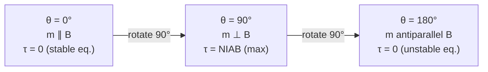

# 🔄 Topic 03 — Torque on a Current-Carrying Loop

> **Course:** PHY-103 · Physics II | **Dept:** Textile Engineering, BUTEX
> **Topics:** Magnetic Dipole Moment · Torque Derivation · Potential Energy · Galvanometer
> **Date:** 2026-06-04

---

## Table of Contents

1. [Introduction](#1-introduction)
2. [Magnetic Dipole Moment](#2-magnetic-dipole-moment)
3. [Torque on a Rectangular Current Loop](#3-torque-on-a-rectangular-current-loop)
4. [General Formula: τ = m × B](#4-general-formula-τ--m--b)
5. [Potential Energy of a Magnetic Dipole](#5-potential-energy-of-a-magnetic-dipole)
6. [Moving Coil Galvanometer](#6-moving-coil-galvanometer)
7. [Worked Examples](#7-worked-examples)
8. [Summary of Formulas](#8-summary-of-formulas)
9. [References](#9-references)

---

## 1. Introduction

A current-carrying loop in a magnetic field experiences no **net force** (if the field is uniform), but it does experience a **net torque** that tends to align the loop's plane perpendicular to the field. This principle is fundamental to the operation of electric motors, galvanometers, and any rotating electrical machine.

The current loop behaves exactly like a **magnetic dipole** — analogous to an electric dipole in an electric field.

---

## 2. Magnetic Dipole Moment

### 2.1 Definition

The **magnetic dipole moment** (or **magnetic moment**) $\vec{m}$ of a current loop is:

$$\boxed{\vec{m} = NIA\hat{n}}$$

where:
| Symbol | Meaning |
|:-------|:--------|
| $N$ | Number of turns in the coil |
| $I$ | Current flowing through the coil (A) |
| $A$ | Area of each loop (m²) |
| $\hat{n}$ | Unit normal vector to the plane of the loop |

**Direction of $\hat{n}$:** Right-hand rule — curl fingers in direction of current flow; thumb points in the direction of $\hat{n}$.

### 2.2 SI Unit

$$[\vec{m}] = \text{A} \cdot \text{m}^2 = \text{J/T}$$

### 2.3 Examples of Magnetic Moments

| System | Typical $m$ |
|:-------|:------------|
| Current loop in lab | $10^{-3}$ to $1$ A·m² |
| Electron spin | $9.274 \times 10^{-24}$ J/T (Bohr magneton $\mu_B$) |
| Bar magnet | $\sim 1$ A·m² |
| Earth (as magnet) | $\sim 8 \times 10^{22}$ A·m² |

---

## 3. Torque on a Rectangular Current Loop

### 3.1 Setup

Consider a rectangular loop of sides $a$ (width) and $b$ (height), with $N$ turns, carrying current $I$, placed in a uniform magnetic field $\vec{B}$ directed along the x-axis. The loop can rotate about a vertical axis.

Let $\theta$ = angle between $\vec{B}$ and the normal $\hat{n}$ to the loop (equivalently, the angle between $\vec{B}$ and $\vec{m}$).

```
  Top View of Rectangular Loop at Angle θ:

         B →→→→→→→
              /
        ab  /  cd
           /  θ
          /
  (a,b = side lengths; ab, cd = sides perpendicular to axis)
```

### 3.2 Forces on Each Side

With loop oriented at angle $\theta$ to $\vec{B}$:

- **Sides ab and cd** (parallel to rotation axis, length $b$):
  These sides are parallel to the axis of rotation. Forces on them are equal and opposite → contribute **zero torque** (they cancel along the axis).

- **Sides bc and da** (perpendicular to axis, length $a$):
  Force on each: $F = NIbB$ (using $F = BIL$ with $L = b$)
  These two forces form a **couple** (equal, opposite, and separated).

### 3.3 Derivation of Torque

The two forces $F = NIbB$ act on sides bc and da, separated by perpendicular distance $a\sin\theta$:

$$\tau = F \times \text{moment arm} = (NIbB) \times (a\sin\theta)$$

$$\boxed{\tau = NIAB\sin\theta}$$

where $A = ab$ is the area of the loop.

In vector form using the magnetic moment $\vec{m} = NIA\hat{n}$:

$$\boxed{\vec{\tau} = \vec{m} \times \vec{B}}$$

### 3.4 Physical Interpretation

| Angle $\theta$ | Torque | Position |
|:---------------|:-------|:---------|
| $\theta = 0°$ (m ∥ B) | $\tau = 0$ | **Stable equilibrium** |
| $\theta = 90°$ (m ⊥ B) | $\tau = mB = NIAB$ | **Maximum torque** |
| $\theta = 180°$ (m antiparallel to B) | $\tau = 0$ | **Unstable equilibrium** |



---

## 4. General Formula: τ = m × B

The torque formula $\vec{\tau} = \vec{m} \times \vec{B}$ is general — it applies to:
- Any shape of current loop (circular, rectangular, irregular)
- Any number of turns $N$
- Any orientation relative to $\vec{B}$

This makes the current loop entirely analogous to an **electric dipole** in an electric field:

| Quantity | Electric Dipole | Magnetic Dipole |
|:---------|:----------------|:----------------|
| Dipole moment | $\vec{p} = q\vec{d}$ | $\vec{m} = NIA\hat{n}$ |
| Torque | $\vec{\tau} = \vec{p} \times \vec{E}$ | $\vec{\tau} = \vec{m} \times \vec{B}$ |
| Potential Energy | $U = -\vec{p} \cdot \vec{E}$ | $U = -\vec{m} \cdot \vec{B}$ |
| Alignment | Along $\vec{E}$ | Along $\vec{B}$ |

---

## 5. Potential Energy of a Magnetic Dipole

### 5.1 Derivation

The work done by the torque as the loop rotates from angle $\theta_1$ to $\theta_2$:

$$W = \int_{\theta_1}^{\theta_2} \tau \, d\theta = \int_{\theta_1}^{\theta_2} mB\sin\theta \, d\theta = mB[-\cos\theta]_{\theta_1}^{\theta_2}$$

Taking the zero of potential energy at $\theta = 90°$ (where $U = 0$ by convention):

$$\boxed{U = -\vec{m} \cdot \vec{B} = -mB\cos\theta}$$

### 5.2 Energy at Special Positions

| Angle $\theta$ | Energy $U = -mB\cos\theta$ | State |
|:---------------|:---------------------------|:------|
| $0°$ | $U = -mB$ (minimum) | Stable equilibrium |
| $90°$ | $U = 0$ | Reference |
| $180°$ | $U = +mB$ (maximum) | Unstable equilibrium |

The loop is like a compass needle — it naturally aligns with the field ($\theta \to 0°$) to minimize energy.

---

## 6. Moving Coil Galvanometer

### 6.1 Principle

A **moving coil galvanometer** (D'Arsonval galvanometer) detects small electric currents using the torque on a current loop in a magnetic field.

**Working principle:** $\tau_{\text{magnetic}} = \tau_{\text{spring}}$

$$NIAB = k\phi$$

$$\boxed{I = \frac{k}{NAB}\phi}$$

where:
- $k$ = torsional constant of the spring
- $\phi$ = angle of deflection
- $N$ = number of turns
- $A$ = area of coil
- $B$ = radial magnetic field (kept uniform by curved pole pieces)

**The deflection is proportional to the current:** $\phi \propto I$ — this makes the scale linear.

### 6.2 Components

```
  Schematic of Moving Coil Galvanometer:

    ┌─────────────────────────────────┐
    │  N          S                   │
    │  |  ┌─────┐  |                  │
    │  |  │coil │  |    ← Pointer     │
    │  |  │ ↕   │  |    attached      │
    │  |  └──┬──┘  |    to coil       │
    │      Soft-iron                  │
    │      cylinder (radial B)        │
    └─────────────────────────────────┘
              ╪ (spring)
              Scale
```

### 6.3 Radial Magnetic Field

The pole pieces are curved and a soft-iron cylinder is placed inside the coil. This makes the magnetic field always **radial** (always perpendicular to the coil plane at every position), ensuring:
- $\sin\theta = 1$ always → $\tau = NIAB$ at all deflections
- **Linear scale** (uniform graduation)

### 6.4 Current Sensitivity

$$S_I = \frac{\phi}{I} = \frac{NAB}{k}$$

To increase sensitivity: increase $N$, $A$, $B$; decrease $k$ (softer spring).

### 6.5 Conversion to Ammeter and Voltmeter

| Instrument | Modification | Formula |
|:-----------|:-------------|:--------|
| Ammeter | Connect low resistance (shunt) in **parallel** | $I_s = \frac{I \cdot G}{S}$ |
| Voltmeter | Connect high resistance in **series** | $R_{series} = V/I_g - G$ |

---

## 7. Worked Examples

### Example 1 — Torque on a Rectangular Loop

**Problem:** A rectangular coil of 200 turns, area $12 \text{ cm}^2 = 12 \times 10^{-4}$ m², carries a current of 0.3 A. It is placed with its plane at 30° to a uniform magnetic field of 0.5 T. Find the torque on the coil.

**Note:** Plane at 30° to B means the **normal** is at $90° - 30° = 60°$ to B.

**Solution:**

$N = 200$, $A = 12 \times 10^{-4}$ m², $I = 0.3$ A, $B = 0.5$ T, $\theta = 60°$

$$\tau = NIAB\sin\theta = (200)(0.3)(12 \times 10^{-4})(0.5)\sin 60°$$

$$\tau = 200 \times 0.3 \times 12 \times 10^{-4} \times 0.5 \times \frac{\sqrt{3}}{2}$$

$$\tau = 200 \times 0.3 \times 6 \times 10^{-4} \times 0.866$$

$$\boxed{\tau \approx 3.12 \times 10^{-2} \text{ N·m} = 31.2 \text{ mN·m}}$$

---

### Example 2 — Magnetic Moment and Potential Energy

**Problem:** A circular coil of radius 5 cm with 100 turns carries a current of 2 A. It is placed in a uniform field of $B = 0.4$ T. Find:
(a) The magnetic moment
(b) Maximum torque
(c) Potential energy at $\theta = 60°$ and $\theta = 180°$

**Solution:**

$R = 0.05$ m, $N = 100$, $I = 2$ A, $B = 0.4$ T

$A = \pi R^2 = \pi (0.05)^2 = 7.854 \times 10^{-3}$ m²

**(a)** $m = NIA = (100)(2)(7.854 \times 10^{-3})$

$$\boxed{m = 1.571 \text{ A·m}^2}$$

**(b)** Maximum torque (at $\theta = 90°$):

$$\tau_{\max} = mB = (1.571)(0.4) = \boxed{0.628 \text{ N·m}}$$

**(c)** Potential energies:

$$U_{60°} = -mB\cos 60° = -(1.571)(0.4)(0.5) = \boxed{-0.314 \text{ J}}$$

$$U_{180°} = -mB\cos 180° = -(1.571)(0.4)(-1) = \boxed{+0.628 \text{ J}}$$

---

### Example 3 — Galvanometer Current Sensitivity

**Problem:** A galvanometer has a coil of 100 turns, area $1 \text{ cm}^2$, in a radial field $B = 0.1$ T. The torsional constant of the spring is $k = 10^{-5}$ N·m/rad. Find the current sensitivity.

**Solution:**

$$S_I = \frac{NAB}{k} = \frac{(100)(10^{-4})(0.1)}{10^{-5}} = \frac{10^{-3}}{10^{-5}}$$

$$\boxed{S_I = 100 \text{ rad/A} = 100 \text{ divisions/A (at full scale)}}$$

---

## 8. Summary of Formulas

| Formula | Meaning |
|:--------|:--------|
| $\vec{m} = NIA\hat{n}$ | Magnetic dipole moment |
| $\vec{\tau} = \vec{m} \times \vec{B}$ | Torque on a magnetic dipole (vector) |
| $\tau = NIAB\sin\theta$ | Torque magnitude |
| $\tau_{\max} = NIAB$ | Maximum torque (at $\theta = 90°$) |
| $U = -\vec{m} \cdot \vec{B} = -mB\cos\theta$ | Potential energy |
| $U_{\min} = -mB$ (stable eq.) | Minimum energy position |
| $U_{\max} = +mB$ (unstable eq.) | Maximum energy position |
| $I = (k/NAB)\phi$ | Galvanometer deflection |
| $S_I = NAB/k$ | Current sensitivity of galvanometer |

---

## 9. References

1. Halliday, Resnick & Krane — *Physics*, Vol. 2, Chapter 29
2. Griffiths, D.J. — *Introduction to Electrodynamics*, 4th Ed., §6.1
3. **HyperPhysics** — [Magnetic Torque](http://hyperphysics.phy-astr.gsu.edu/hbase/magnetic/magtor.html)
4. **HyperPhysics** — [Galvanometer](http://hyperphysics.phy-astr.gsu.edu/hbase/magnetic/galvan.html)
5. **Khan Academy** — [Magnetic torque on a loop](https://www.khanacademy.org/science/physics/magnetic-forces-and-magnetic-fields/magnets-and-magnetic-fields/v/magnetic-torque)
6. **LibreTexts Physics** — [Torque on Current Loop](https://phys.libretexts.org/Bookshelves/University_Physics/University_Physics_(OpenStax)/University_Physics_II/11%3A_Magnetic_Forces_and_Fields/11.06%3A_Torques_on_a_Dipole_in_a_Uniform_Field)
7. **Wikipedia** — [Magnetic moment](https://en.wikipedia.org/wiki/Magnetic_moment) · [Galvanometer](https://en.wikipedia.org/wiki/Galvanometer)
8. **MIT OCW 8.02** — [Magnetic Dipoles](https://ocw.mit.edu/courses/8-02-physics-ii-electricity-and-magnetism-spring-2019/)

---

*← [Previous: Magnetic Force on Conductor](02_magnetic_force_conductor.md) · [Back to Magnetism README](README.md) · [Next: Hall Effect →](04_hall_effect.md)*
