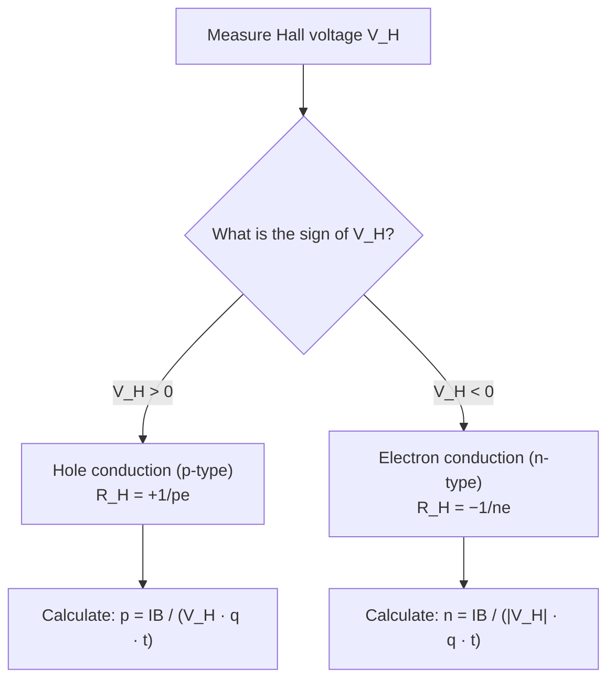
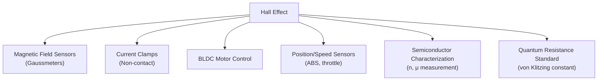

# 🔬 Topic 04 — Hall Effect

> **Course:** PHY-103 · Physics II | **Dept:** Textile Engineering, BUTEX
> **Topics:** Hall Voltage · Hall Coefficient · Carrier Type Determination · Applications
> **Date:** 2026-06-04

---

## Table of Contents

1. [Introduction and Discovery](#1-introduction-and-discovery)
2. [Physical Mechanism](#2-physical-mechanism)
3. [Derivation of Hall Voltage](#3-derivation-of-hall-voltage)
4. [Hall Coefficient](#4-hall-coefficient)
5. [Sign of Hall Coefficient — Carrier Type](#5-sign-of-hall-coefficient--carrier-type)
6. [Hall Angle](#6-hall-angle)
7. [Quantum Hall Effect (Overview)](#7-quantum-hall-effect-overview)
8. [Applications of Hall Effect](#8-applications-of-hall-effect)
9. [Worked Examples](#9-worked-examples)
10. [Summary of Formulas](#10-summary-of-formulas)
11. [References](#11-references)

---

## 1. Introduction and Discovery

The **Hall Effect** was discovered by **Edwin Herbert Hall** in 1879 while working on his doctoral thesis at Johns Hopkins University. He placed a thin gold strip carrying a current in a magnetic field and observed a small voltage perpendicular to both the current and the magnetic field.

This effect provides a unique method to:
- Determine the **sign** (type: n or p) of charge carriers in a material
- Measure **carrier concentration** $n$
- Measure **magnetic field strength** $B$

> 🏛️ **Edwin Hall (1855–1938):** American physicist who discovered the effect at age 24. The practical applications of his discovery only became widespread a century later with semiconductor technology.

---

## 2. Physical Mechanism

### 2.1 Setup

Consider a thin rectangular conductor (or semiconductor) of:
- Width $w$ (in the y-direction)
- Thickness $t$ (in the z-direction)
- Carrying current $I$ in the **+x direction**
- Placed in a magnetic field $\vec{B}$ in the **+z direction**

```
  Hall Effect Setup — 3D View:

           B ↑ (z-direction)
           |
    ←←←←←←|←←←←←←   ← width w
    ·  ·  ·|·  ·  ·
    → → → →|→ → → →   → current I (+x)
    ·  ·  ·|·  ·  ·
    ←←←←←←|←←←←←←
           |
           t (thickness in z)

    Hall voltage V_H builds up in y-direction
    (+ face: bottom for electrons, top for holes)
```

### 2.2 Force on Charge Carriers

**For electrons** (moving in **−x direction** since conventional current is +x):

The magnetic force on electrons:
$$\vec{F} = q_e\vec{v}_e \times \vec{B} = (-e)(-v_d\hat{x}) \times (B\hat{z}) = ev_d B(\hat{x} \times \hat{z}) = ev_d B(-\hat{y}) = -ev_dB\hat{y}$$

This means electrons are deflected in the **−y direction** (downward), accumulating at the bottom face. This creates a **Hall electric field** $\vec{E}_H$ pointing in the **−y direction** (from bottom to top, since electrons are negative and they pile up at bottom).

**Convention check:**

```
  n-type (electrons):                p-type (holes):
  
   V_H = − (top is −)               V_H = + (top is +)
    ── ── ──                          ++ ++ ++
    → → → → → I                      → → → → → I
    ++ ++ ++                          ── ── ──
   (electrons go down)               (holes go down)
   B out of page (⊙)                 B out of page (⊙)
```

---

## 3. Derivation of Hall Voltage

### 3.1 Equilibrium Condition

Initially, charge carriers are deflected sideways, building up charge on one face. This charge buildup creates a **Hall electric field** $E_H$ opposing further deflection.

**Equilibrium** is reached when the Hall electric force exactly balances the magnetic force:

$$\text{Electric force} = \text{Magnetic force}$$

$$qE_H = qv_d B$$

$$\boxed{E_H = v_d B}$$

### 3.2 Current–Velocity Relation

The drift current:
$$I = nqv_d A_{\text{cross}} = nqv_d(wt)$$

where $n$ is the carrier number density (carriers/m³), $w$ = width, $t$ = thickness.

Solving for drift velocity:
$$v_d = \frac{I}{nqwt}$$

### 3.3 Hall Voltage

The Hall voltage $V_H$ across the width $w$:

$$V_H = E_H \cdot w = v_d B \cdot w = \frac{I}{nqwt} \cdot B \cdot w$$

$$\boxed{V_H = \frac{IB}{nqt}}$$

where:
| Symbol | Meaning | Unit |
|:-------|:--------|:-----|
| $V_H$ | Hall voltage | V |
| $I$ | Current | A |
| $B$ | Magnetic flux density | T |
| $n$ | Carrier concentration | m⁻³ |
| $q$ | Carrier charge ($e = 1.6 \times 10^{-19}$ C) | C |
| $t$ | Thickness of sample | m |

> **Key insight:** Measuring $V_H$, $I$, $B$, and $t$ allows calculating $n$ — carrier concentration!

---

## 4. Hall Coefficient

### 4.1 Definition

The **Hall coefficient** $R_H$ is defined as:

$$\boxed{R_H = \frac{E_H}{J \cdot B} = \frac{V_H \cdot t}{I \cdot B}}$$

where $J = I/(wt)$ is the current density.

Substituting $E_H = v_d B$ and $J = nqv_d$:

$$R_H = \frac{v_d B}{(nqv_d)B} = \frac{1}{nq}$$

$$\boxed{R_H = \frac{1}{nq}}$$

> **Important:** This is for a simple model. For real materials, a factor $r$ (scattering factor, ≈ $\pi/4$ for acoustic phonon scattering) appears: $R_H = r/(nq)$.

### 4.2 Hall Resistance and Hall Resistivity

- **Hall resistance:** $R_{xy} = V_H/I = B/(nqt)$
- **Hall resistivity:** $\rho_{xy} = R_H \cdot B = B/(nq)$

---

## 5. Sign of Hall Coefficient — Carrier Type

The **sign** of $R_H$ (or $V_H$) tells us the type of charge carriers:

| Carrier Type | Sign of $R_H$ | Sign of $V_H$ |
|:-------------|:--------------|:--------------|
| **Electrons** (n-type) | Negative ($-$) | $V_H < 0$ |
| **Holes** (p-type) | Positive ($+$) | $V_H > 0$ |

### 5.1 Physical Explanation

**For n-type:** Electrons (negative charge carriers) are pushed downward by magnetic force. Negative charges accumulate at the bottom → top face becomes positive → Hall field points **upward** (+y). Using $R_H = E_H/(J \cdot B)$, with $J$ in +x, $B$ in +z, and $E_H$ in +y:

Actually for a more careful analysis: the Hall coefficient for electrons is $R_H = -1/(ne)$ (negative), and for holes $R_H = +1/(pe)$ (positive).

### 5.2 Summary Table for Semiconductors

| Parameter | n-type Si | p-type Si | Units |
|:----------|:----------|:----------|:------|
| Carriers | Electrons | Holes | — |
| $R_H$ | $-1/(ne)$ | $+1/(pe)$ | m³/C |
| Typical $n$ or $p$ | $10^{16}$–$10^{20}$ | $10^{16}$–$10^{20}$ | cm⁻³ |



---

## 6. Hall Angle

The **Hall angle** $\theta_H$ is the angle between the total electric field in the conductor and the applied current direction:

$$\tan\theta_H = \frac{E_H}{E_x} = \frac{v_d B}{\rho J} = \mu B$$

$$\boxed{\tan\theta_H = \mu B = R_H \sigma B}$$

where:
- $\mu = |R_H| \sigma$ is the **Hall mobility**
- $\sigma$ is the electrical conductivity
- $\rho$ is the resistivity

> **Hall mobility** is a direct measure of how fast carriers move in the material under a given field — critical for semiconductor device design.

---

## 7. Quantum Hall Effect (Overview)

Discovered by **Klaus von Klitzing** in 1980 (Nobel Prize 1985), the **Integer Quantum Hall Effect (IQHE)** occurs in 2D electron systems at low temperatures and high magnetic fields.

Key feature: Hall resistivity is **quantized**:

$$\rho_{xy} = \frac{h}{ne^2}, \quad n = 1, 2, 3, \ldots$$

where $h = 6.626 \times 10^{-34}$ J·s (Planck's constant) and $e$ is electron charge.

The resistance quantum $R_K = h/e^2 \approx 25812.8$ Ω (von Klitzing constant) is now used as a **resistance standard**.

> **Fractional Quantum Hall Effect (FQHE):** Discovered by Tsui, Störmer, Laughlin (1982, Nobel 1998). Here $n = 1/3, 2/5, \ldots$ — fractional values indicating correlated electron states.

---

## 8. Applications of Hall Effect

### 8.1 Hall Probes (Magnetic Field Measurement)

A calibrated Hall sensor measures unknown magnetic fields:
$$B = \frac{V_H \cdot nqt}{I} = \frac{V_H}{S_H \cdot I}$$
where $S_H = 1/(nqt)$ is the sensitivity.

Applications: Gaussmeters, MRI field mapping, particle accelerators.

### 8.2 Hall-Effect Current Sensors (Clamp Meters)

Non-contact current sensing: A conductor passes through a ferromagnetic ring (which concentrates the flux), and a Hall probe in the gap measures $B \propto I$. Used in power electronics, industrial monitoring.

### 8.3 Brushless DC (BLDC) Motor Commutation

Hall sensors detect rotor position magnetically → electronic commutation replaces mechanical brushes. Used in hard drives, electric vehicles, fans.

### 8.4 Semiconductor Characterization

Measuring $R_H$ with the **van der Pauw method** gives carrier concentration and mobility — standard in semiconductor device fabrication quality control.

### 8.5 Position and Speed Sensors

Hall sensors detect passing magnets → used in:
- Wheel speed sensors (ABS brakes)
- Smartphone compass apps
- Throttle position sensors



---

## 9. Worked Examples

### Example 1 — Hall Voltage and Carrier Concentration

**Problem:** A strip of copper (thickness $t = 0.1$ mm) carries a current of 20 A in a magnetic field $B = 1.5$ T perpendicular to the strip. The measured Hall voltage is $V_H = 0.7$ µV. Find:
(a) The carrier concentration $n$
(b) The Hall coefficient $R_H$

**Solution:**

$t = 1 \times 10^{-4}$ m, $I = 20$ A, $B = 1.5$ T, $V_H = 0.7 \times 10^{-6}$ V, $q = e = 1.6 \times 10^{-19}$ C

**(a)** From $V_H = IB/(nqt)$:

$$n = \frac{IB}{V_H q t} = \frac{(20)(1.5)}{(0.7 \times 10^{-6})(1.6 \times 10^{-19})(1 \times 10^{-4})}$$

$$n = \frac{30}{1.12 \times 10^{-28}} = \boxed{2.68 \times 10^{29} \text{ m}^{-3}}$$

*(This is consistent with free electron density in copper ≈ $8.5 \times 10^{28}$ m⁻³, within order of magnitude)*

**(b)** $R_H = 1/(nq) = 1/(2.68 \times 10^{29} \times 1.6 \times 10^{-19})$

$$\boxed{R_H = \frac{1}{4.29 \times 10^{10}} \approx 2.33 \times 10^{-11} \text{ m}^3/\text{C}}$$

---

### Example 2 — Semiconductor Hall Measurement

**Problem:** A p-type germanium sample of thickness $t = 1$ mm carries current $I = 3$ mA. A magnetic field $B = 0.5$ T is applied. The measured Hall voltage is $V_H = +50$ mV (positive, confirming p-type). Find the hole concentration.

**Solution:**

$t = 10^{-3}$ m, $I = 3 \times 10^{-3}$ A, $B = 0.5$ T, $V_H = 0.05$ V

$$p = \frac{IB}{V_H q t} = \frac{(3 \times 10^{-3})(0.5)}{(0.05)(1.6 \times 10^{-19})(10^{-3})}$$

$$p = \frac{1.5 \times 10^{-3}}{8 \times 10^{-24}} = \boxed{1.875 \times 10^{20} \text{ m}^{-3} = 1.875 \times 10^{14} \text{ cm}^{-3}}$$

---

### Example 3 — Hall Angle

**Problem:** An n-type semiconductor has resistivity $\rho = 0.1$ Ω·m and $R_H = 0.05$ m³/C. Find the Hall angle when $B = 0.3$ T.

**Solution:**

Conductivity: $\sigma = 1/\rho = 10$ (Ω·m)⁻¹

$$\tan\theta_H = |R_H|\sigma B = (0.05)(10)(0.3) = 0.15$$

$$\theta_H = \arctan(0.15) = \boxed{8.53°}$$

---

## 10. Summary of Formulas

| Formula | Meaning |
|:--------|:--------|
| $V_H = IB/(nqt)$ | Hall voltage |
| $R_H = 1/(nq)$ | Hall coefficient (for single carrier type) |
| $R_H = E_H/(J \cdot B)$ | Hall coefficient (from fields) |
| $E_H = v_d B$ | Hall field at equilibrium |
| $\tan\theta_H = \mu B$ | Hall angle |
| $\mu = \|R_H\|\sigma$ | Hall mobility |

---

## 11. References

1. Halliday, Resnick & Krane — *Physics*, Vol. 2, Chapter 29
2. Kittel, C. — *Introduction to Solid State Physics*, 8th Ed., Chapter 6
3. **HyperPhysics** — [Hall Effect](http://hyperphysics.phy-astr.gsu.edu/hbase/magnetic/Hall.html)
4. **LibreTexts Physics** — [Hall Effect](https://phys.libretexts.org/Bookshelves/University_Physics/University_Physics_(OpenStax)/University_Physics_II/11%3A_Magnetic_Forces_and_Fields/11.07%3A_The_Hall_Effect)
5. **Khan Academy** — [Hall effect](https://www.khanacademy.org/science/physics/magnetic-forces-and-magnetic-fields/electric-motors/v/the-hall-effect)
6. **Wikipedia** — [Hall effect](https://en.wikipedia.org/wiki/Hall_effect) · [Quantum Hall effect](https://en.wikipedia.org/wiki/Quantum_Hall_effect)
7. **Wikimedia Commons** — [Hall Effect Setup](https://commons.wikimedia.org/wiki/File:Hall_Effect_Measurement_Setup_for_Electrons.png)
8. **MIT OCW** — [Semiconductor Hall Measurements](https://ocw.mit.edu/courses/6-012-microelectronic-devices-and-circuits-fall-2005/)
9. **NIST** — [von Klitzing Constant](https://physics.nist.gov/cgi-bin/cuu/Value?rk)

---

*← [Previous: Torque on Current Loop](03_torque_current_loop.md) · [Back to Magnetism README](README.md) · [Next: Faraday's Law →](05_faradays_law.md)*
