# Electricity — Complete Solved Study Guide
### BUTEX Previous Year Questions (2015–2024) · Rewritten, Corrected & Fully Derived

> [!NOTE]
> This guide rewrites your handwritten "Electricity" notebook (2015–2024 PYQs) into a corrected, fully-derived reference. Every question keeps its **original year and question number** from your notebook. Because several years repeat the same theory (Coulomb's law, Gauss's law, parallel-plate capacitance, Faraday's law, LR circuits, Wheatstone bridge, Hall effect), each concept is derived **once, in full**, and every repeat year is cross-referenced to it — with its own numbers worked out in full where a numerical was attached. This avoids 10× repetition of the same algebra while still giving you every single question, answer, and correction.

---

## Table of Contents

| # | Topic | PYQ years it covers |
|---|-------|----------------------|
| 1 | [Symbols & Constants](#symbols--constants) | — |
| 2 | [Coulomb's Law](#1-coulombs-law) | 2015·2017·2020·2024 |
| 3 | [Electric Field & Field Intensity](#2-electric-field--field-intensity) | 2015·2019 |
| 4 | [Electric Field on the Axis of a Charged Ring](#3-electric-field-on-the-axis-of-a-charged-ring) | 2015 |
| 5 | [Gauss's Law (statement, proof, deducing Coulomb's Law)](#4-gausss-law) | 2015·2018·2020 |
| 6 | [Electric Dipole — Potential & Field](#5-electric-dipole) | 2016·2022 |
| 7 | [Charge (Surface Charge) Density](#6-charge-density) | 2015·2022 |
| 8 | [Displacement Field D = ε₀E + P](#7-displacement-field) | 2015 |
| 9 | [Dielectrics](#8-dielectrics) | 2015 |
| 10 | [Parallel-Plate Capacitor — Capacitance](#9-parallel-plate-capacitor) | 2017·2021·2024 |
| 11 | [Capacitor with Dielectric Slab (numerical)](#10-capacitor-with-partial-dielectric-slab) | 2017 |
| 12 | [Capacitors in Series](#11-capacitors-in-series) | 2018 |
| 13 | [Energy Stored in a Capacitor](#12-energy-stored-in-a-capacitor) | 2022 |
| 14 | [RC Charging & Discharging](#13-rc-charging--discharging) | 2015·2023 |
| 15 | [Ohm's Law & Resistance](#14-ohms-law--resistance) | 2016 |
| 16 | [Specific Resistance (Resistivity)](#15-specific-resistance-resistivity) | 2017 |
| 17 | [Kirchhoff's Laws](#16-kirchhoffs-laws) | 2017 |
| 18 | [Wheatstone Bridge — Principle & Numericals](#17-wheatstone-bridge) | 2016·2017·2021·2022 |
| 19 | [Faraday's Laws of EM Induction](#18-faradays-laws-of-electromagnetic-induction) | 2016·2021 |
| 20 | [Lenz's Law & Conservation of Energy](#19-lenzs-law-and-conservation-of-energy) | 2018·2021 |
| 21 | [Torque on a Current-Carrying Loop](#20-torque-on-a-current-carrying-loop) | 2016·2018 |
| 22 | [Choke Coil & Torque (definitions)](#21-choke-coil--torque-definitions) | 2015 |
| 23 | [Self-Inductance](#22-self-inductance) | 2016·2021 |
| 24 | [LR Circuit — Growth & Decay of Current](#23-lr-circuit-growth--decay) | 2016·2020·2021 |
| 25 | [Hall Effect](#24-hall-effect) | 2016·2018 |
| 26 | [Resonance in R-L-C Circuits](#25-resonance-in-r-l-c-circuits) | 2023 |
| 27 | [Electron in a Field = Weight (numerical)](#26-electron-in-a-field-equal-to-weight) | 2020 |
| 28 | [Year-wise Index](#year-wise-index) | 2015–2024 |

---

## Symbols & Constants

| Symbol | Quantity | SI Unit |
|--------|----------|---------|
| $E$ | Electric field intensity | N C⁻¹ (= V m⁻¹) |
| $F$ | Force | N |
| $q, Q$ | Electric charge | C (coulomb) |
| $\varepsilon_0$ | Permittivity of free space | F m⁻¹ |
| $k$ or $\dfrac{1}{4\pi\varepsilon_0}$ | Coulomb's constant | N m² C⁻² |
| $\sigma$ | Surface charge density | C m⁻² |
| $V$ | Electric potential / voltage | V (volt) |
| $C$ | Capacitance | F (farad) |
| $R$ | Resistance | Ω (ohm) |
| $\rho$ | Resistivity (specific resistance) | Ω·m |
| $I$ | Current | A (ampere) |
| $B$ | Magnetic flux density | T (tesla) |
| $\phi$ | Magnetic flux | Wb (weber) |
| $L$ | Self-inductance | H (henry) |
| $\tau$ | Time constant | s |
| $\varepsilon$ (EMF) | Electromotive force | V |
| $p$ | Electric dipole moment | C·m |
| $D$ | Electric displacement field | C m⁻² |
| $f_0$ | Resonant frequency | Hz |

**Key constants**

| Constant | Value |
|---|---|
| $\varepsilon_0$ | $8.854 \times 10^{-12}\ \text{F m}^{-1}$ |
| $\dfrac{1}{4\pi\varepsilon_0}$ | $8.99\times10^{9} \approx 9\times10^{9}\ \text{N m}^2\text{C}^{-2}$ |
| Charge of electron, $e$ | $1.6\times10^{-19}\ \text{C}$ |
| Mass of electron, $m_e$ | $9.1\times10^{-31}\ \text{kg}$ |
| $g$ | $9.8\ \text{m s}^{-2}$ |

> [!TIP]
> **Exam shortcut:** in almost every Bangladeshi-syllabus numerical, $\dfrac{1}{4\pi\varepsilon_0}$ is simply rounded to $9\times10^{9}\ \text{N m}^2\text{C}^{-2}$ — memorize this single number and you rarely need $\varepsilon_0$ directly, except in capacitor problems.

---

## 1. Coulomb's Law

**Appears in:** 2015 PYQ 1(b) [deduced from Gauss's law] · 2017 PYQ 1(a) · 2020 PYQ 1(b) [deduced from Gauss's law] · 2024 PYQ 4(a)

### Theory
Coulomb's Law is the foundational law of electrostatics, describing the force between two point charges.

### Statement (2017 PYQ 1(a))
> Coulomb's law states that the electrostatic force between two stationary point charges is directly proportional to the product of their magnitudes and inversely proportional to the square of the distance between them.

### Formula
$$F = k_e\frac{|q_1 q_2|}{r^2}, \qquad k_e = \frac{1}{4\pi\varepsilon_0} \approx 9\times10^{9}\ \text{N m}^2\text{C}^{-2}$$

where
- $F$ = electrostatic force (N)
- $q_1, q_2$ = magnitudes of the two charges (C)
- $r$ = distance between charge centres (m)

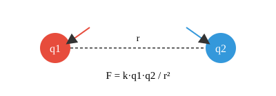

### Derivation / Explanation
Let two point charges $q_1$ and $q_2$ be separated by distance $r$ in a medium.

By experiment:
$$F \propto q_1 q_2 \quad (\text{when } r \text{ is constant})$$
$$F \propto \frac{1}{r^2} \quad (\text{when } q_1, q_2 \text{ are constant})$$

Combining:
$$F \propto \frac{q_1 q_2}{r^2} \quad\Rightarrow\quad F = k\frac{q_1 q_2}{r^2}$$

where the proportionality constant $k = \dfrac{1}{4\pi\varepsilon_0} \approx 9\times10^{9}\ \text{N m}^2\text{C}^{-2}$ (in vacuum/air), giving the final form:

$$\boxed{F = \frac{1}{4\pi\varepsilon_0}\cdot\frac{q_1 q_2}{r^2}}$$

> [!IMPORTANT]
> Coulomb's law is only valid for **stationary point charges**. For moving charges, magnetic effects appear and the simple inverse-square law needs modification (this is one of its key **limitations**, asked in 2024 PYQ 4(a) — see box below).

<details>
<summary><b>2024 PYQ 4(a) — Limitations of Coulomb's Law (notebook page faded/incomplete — standard textbook answer supplied)</b></summary>

Coulomb's law has the following limitations:
1. It applies strictly to **point charges** — for extended/finite-sized charged bodies, the law must be applied via integration.
2. It assumes charges are **at rest**; for moving charges, magnetic forces also act, and the law needs relativistic correction.
3. It is valid only when the charges are separated by a finite distance greater than nuclear dimensions (it breaks down at sub-atomic scales, where quantum effects dominate).
4. It does not account for the **finite speed of propagation** of the electric field (i.e., it implicitly assumes instantaneous action, which is only an approximation for slowly varying fields).

*(Your notebook page for this question was left blank after the heading — this is the standard completion.)*
</details>

### Numerical — deriving the value of one coulomb (2020 PYQ, page 4 continuation)
**Given:** Two equal point charges $q_1=q_2=q$ placed 1 m apart in vacuum experience a force of exactly $9\times10^9$ N.
**Required:** Show this defines $q = 1\ \text{C}$.
**Formula:** $F = \dfrac{1}{4\pi\varepsilon_0}\cdot\dfrac{q_1q_2}{r^2}$
**Solution:**
$$9\times10^9 = (9\times10^9)\cdot\frac{q^2}{1^2} \;\Rightarrow\; q^2 = 1 \;\Rightarrow\; q = \pm1\ \text{C}$$
**Final Answer:** $q = 1\ \text{coulomb}$ — this is exactly how the SI coulomb is defined via Coulomb's law.

### Common Exam Mistakes
- Writing $F \propto q_1q_2/r$ (forgetting the square).
- Forgetting the **absolute value** — force magnitude is always positive; sign only tells you attraction/repulsion.
- Mixing up $k$ and $\varepsilon_0$ — remember $k = 1/(4\pi\varepsilon_0)$, not $k=\varepsilon_0$.

### Memory Tip
**"Force follows FEAR"** — **F**orce **E**quals (constant) × charge**A**× charge / **R**²... or simply remember *"like Newton's gravitation, but with charges instead of masses, and it can repel too."*

---

## 2. Electric Field & Field Intensity

**Appears in:** 2015 PYQ 1(a) · 2019 PYQ 1(a)

### Theory
An **electric field** is the region of space surrounding a charged particle (or object) within which another electric charge experiences an electrostatic force.

*(Correcting the notebook's phrasing "invisible region of force surrounding an electrically charged particle" — the more precise 2019 definition is used above; the field exists regardless of whether a test charge is present.)*

### Formula
$$\vec{E} = \frac{\vec{F}}{q}$$

- $E$ = electric field intensity, unit **N C⁻¹** (equivalently V m⁻¹)
- $F$ = force experienced by a small **test charge** $q$ placed in the field

### Explanation
Electric field intensity at a point measures the **strength** of the field there — the force *per unit positive test charge* placed at that point, in the limit that the test charge is small enough not to disturb the source charges.

> [!NOTE]
> A "test charge" is assumed vanishingly small and positive by convention, so field direction always points *away from* positive source charges and *into* negative ones.

### Exam Tips
- Always specify **both magnitude and direction** — $E$ is a vector.
- Don't confuse $E$ (field, N/C) with $V$ (potential, volts): $E = -dV/dr$, but they are different quantities with different units.

---

## 3. Electric Field on the Axis of a Charged Ring

**Appears in:** 2015 PYQ 1(a)

### Theory
Classic application of superposition + symmetry: for a uniformly charged ring, field components perpendicular to the axis cancel by symmetry, leaving only the axial component.

### Setup
A ring of radius $R$ carries total charge $Q$, uniformly distributed. Point $P$ lies on the axis at distance $x$ from the centre.

```
          dq
           .
          /|\   r = sqrt(R^2+x^2)
         / | \
        /  |th\
   ----o---+----o----------> axis
    centre |     P (distance x)
     \_____|_____/
        radius R
```

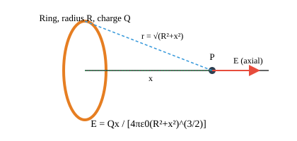

### Derivation
A small element $dq$ on the ring is at distance $r=\sqrt{R^2+x^2}$ from $P$. Field due to $dq$:
$$dE = \frac{1}{4\pi\varepsilon_0}\cdot\frac{dq}{R^2+x^2}$$

By symmetry, components perpendicular to the axis cancel in pairs; only the axial component survives:
$$\cos\theta = \frac{x}{\sqrt{R^2+x^2}}$$

Integrating around the ring (total charge $Q=\oint dq$):
$$E = \int dE\cos\theta = \frac{1}{4\pi\varepsilon_0}\cdot\frac{x}{(R^2+x^2)^{3/2}}\oint dq$$

$$\boxed{E = \frac{1}{4\pi\varepsilon_0}\cdot\frac{Qx}{(R^2+x^2)^{3/2}}}$$

*(Corrects the notebook, which wrote the numerator as "Qn" — a transcription slip for Qx, consistent with the distance being called x throughout.)*

### Special Cases / Exam Tips
- At the **centre** ($x=0$): $E=0$ by symmetry — good check.
- Far away ($x\gg R$): $E\approx \dfrac{1}{4\pi\varepsilon_0}\dfrac{Q}{x^2}$ — ring behaves like a point charge.
- $E$ is **maximum** at $x=R/\sqrt2$ (differentiate, set $dE/dx=0$) — mention for full marks on extended versions.

### Memory Tip
"Ring → only **axial** components survive." The same cancel-perpendicular-components logic reappears for charged disks and solenoids — master it once, reuse everywhere.

---

## 4. Gauss's Law

**Appears in:** 2015 PYQ 1(b) · 2018 PYQ 1(a) · 2020 PYQ 1(a) (proof) · 2020 PYQ 1(b) (deducing Coulomb's Law from it)

### Theory
Gauss's Law relates the electric flux through any **closed surface** to the net charge it encloses. It is one of Maxwell's four equations and is especially powerful for problems with high symmetry (spheres, cylinders, planes).

### Statement
> The total electric flux through any closed surface is equal to the net charge enclosed, divided by the permittivity of free space.

### Formula
$$\oint \vec{E}\cdot d\vec{A} = \frac{Q_{enc}}{\varepsilon_0}$$

- $\oint \vec E \cdot d\vec A$ = total electric flux $\Phi_E$ through the closed ("Gaussian") surface
- $Q_{enc}$ = net charge enclosed by that surface

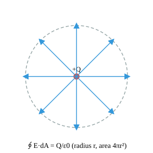

### Proof (2020 PYQ 1(a))
Start from the field of a point charge $q$ at distance $r$:
$$E = \frac{1}{4\pi\varepsilon_0}\cdot\frac{q}{r^2}$$

The flux through a small area element $d\vec A$ on a sphere of radius $r$ centred on the charge:
$$d\Phi_E = \vec E\cdot d\vec A = E\,dA\cos\theta$$

Since $\vec E$ is always **radial** and $d\vec A$ is also radial on a sphere centred at the charge, $\theta = 0°$, so $\cos\theta = 1$:
$$d\Phi_E = E\,dA \quad\Rightarrow\quad \Phi_E = \oint E\,dA = E\oint dA$$

The total surface area of a sphere of radius $r$ is $4\pi r^2$, so:
$$\Phi_E = E\cdot(4\pi r^2) = \left(\frac{1}{4\pi\varepsilon_0}\cdot\frac{q}{r^2}\right)(4\pi r^2)$$

$$\boxed{\Phi_E = \frac{q}{\varepsilon_0}} \quad \text{(proved)}$$

> [!IMPORTANT]
> The beauty of this proof is that the $r^2$ terms **cancel exactly** — this is *why* Coulomb's law has an inverse-square form (it's what makes flux independent of the radius of the Gaussian surface chosen).

### Deducing Coulomb's Law from Gauss's Law (2015 PYQ 1(b) & 2020 PYQ 1(b))
Consider a point charge $+Q$. Draw an imaginary (Gaussian) sphere of radius $r$ centred on it. By symmetry, $E$ is the same magnitude everywhere on this sphere and points radially outward, so:
$$\oint \vec E\cdot d\vec A = E\oint dA = E(4\pi r^2) = \frac{Q}{\varepsilon_0}$$

$$\Rightarrow\quad E = \frac{Q}{4\pi\varepsilon_0 r^2}$$

Now place a second test charge $q$ at that point. The force on it is $F=qE$:
$$F = qE = \frac{Qq}{4\pi\varepsilon_0 r^2}$$

$$\boxed{F = \frac{1}{4\pi\varepsilon_0}\cdot\frac{Qq}{r^2}} \quad \text{— this is Coulomb's Law.}$$

### Definitions asked directly (2018 PYQ 1(a))
> [!NOTE]
> **2018 PYQ 1(a)** asked to define **(i) Gauss's law (ii) Ohm's law (iii) Capacitor** together — Gauss's law is above; Ohm's law is in [§14](#14-ohms-law--resistance); Capacitor is in [§9](#9-parallel-plate-capacitor).

### Common Exam Mistakes
- Writing $E\cdot A = Q/\varepsilon_0$ for **non-spherical** surfaces without justifying the symmetry argument first — always state *why* $E$ is constant over the chosen Gaussian surface.
- Confusing $Q_{enc}$ (charge *inside* the surface only) with total charge in the system.

### Exam Tip
Gauss's law is a **shortcut**, not a separate physical law — it's Coulomb's law rewritten in integral form. If you forget the Gauss's-law derivation under pressure, you can always fall back to deriving $E$ from Coulomb's law directly for a symmetric charge distribution.

---

## 5. Electric Dipole

**Appears in:** 2016 PYQ 1(c) [potential due to a dipole, numerical] · 2022 PYQ 3(a) [definition + charge-density relation] · 2022 PYQ (3b) [field ∝ 2p/r³]

### Theory & Definition (2022 PYQ 3(a))
> An **electric dipole** is a system of two equal and opposite point charges separated by a very small distance.

**Electric dipole moment:** $p = q\times(2\ell)$, where $2\ell$ is the separation between the charges — unit: **C·m**.

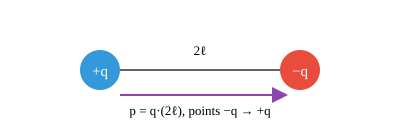

### 5.1 Potential Due to a Dipole on its Axis — Numerical (2016 PYQ 1(c))

**Given:**
- Dipole moment, $p = 2.5\times10^{-10}\ \text{C·m}$
- Distance from dipole, $r = 1\ \text{m}$
- Coulomb's constant, $\dfrac{1}{4\pi\varepsilon_0} = 9\times10^{9}\ \text{N m}^2\text{C}^{-2}$

**Required:** Electric potential $V$ due to the dipole at the given axial point.

**Formula:**
$$V = \frac{1}{4\pi\varepsilon_0}\cdot\frac{p}{r^2}$$

**Solution:**
$$V = (9\times10^{9})\times\frac{2.5\times10^{-10}}{(1)^2}$$
$$V = 9\times2.5\times10^{-1} = 22.5\times10^{-1}$$

**Final Answer:** $\boxed{V = 2.25\ \text{volts}}$

> [!NOTE]
> Your notebook's arithmetic is correct throughout — this is one of the cleanest numericals in the whole notebook. Just remember the **on-axis dipole potential formula uses $r^2$, not $r^3$** — it's the *field* (not potential) that goes as $1/r^3$, shown next.

### 5.2 Electric Field of a Dipole ∝ 2p/r³ (2022 PYQ (3b))

**Setup:** Dipole with charges $-q$ at one end, $+q$ at the other, separated by $2\ell$. Field is evaluated **on the axis** at distance $r$ from the centre.

**Derivation:**
Field due to $+q$ (closer charge at distance $r-\ell$) and $-q$ (farther charge at distance $r+\ell$):
$$E_1 = \frac{1}{4\pi\varepsilon_0}\cdot\frac{q}{(r-\ell)^2}, \qquad E_2 = \frac{1}{4\pi\varepsilon_0}\cdot\frac{q}{(r+\ell)^2}$$

Net field (they point in the same direction along the axis for an axial point):
$$E = E_1-E_2 = \frac{q}{4\pi\varepsilon_0}\left[\frac{1}{(r-\ell)^2}-\frac{1}{(r+\ell)^2}\right]$$

Combine the fraction over a common denominator:
$$E = \frac{q}{4\pi\varepsilon_0}\cdot\frac{(r+\ell)^2-(r-\ell)^2}{(r^2-\ell^2)^2}$$

Expand the numerator using $(a+b)^2-(a-b)^2 = 4ab$:
$$(r+\ell)^2-(r-\ell)^2 = 4r\ell$$

$$E = \frac{q}{4\pi\varepsilon_0}\cdot\frac{4r\ell}{(r^2-\ell^2)^2} = \frac{1}{4\pi\varepsilon_0}\cdot\frac{2r(2q\ell)}{(r^2-\ell^2)^2} = \frac{1}{4\pi\varepsilon_0}\cdot\frac{2pr}{(r^2-\ell^2)^2}$$

**For a short dipole** ($r \gg \ell$), $(r^2-\ell^2)^2 \approx r^4$:
$$E = \frac{1}{4\pi\varepsilon_0}\cdot\frac{2pr}{r^4} = \frac{2p}{4\pi\varepsilon_0 r^3}$$

$$\boxed{E \propto \frac{2p}{r^3}} \quad\text{(proved)}$$

> [!TIP]
> **Exam shortcut for "show that E ∝ ..." questions:** you almost never need the exact constant — just show every step of the proportionality algebra cleanly and box the final ratio. Examiners award most marks for correct *reduction steps* (the $(a+b)^2-(a-b)^2=4ab$ trick above), not just the final line.

### Common Exam Mistakes
- Forgetting the **short-dipole approximation** ($r\gg\ell$) — without stating it, the $1/r^3$ result is not justified.
- Mixing up axial-field ($1/r^3$, factor of 2) vs equatorial-field ($1/r^3$, no factor of 2, opposite direction) formulas — always specify **which** case you're deriving.

---

## 6. Charge Density

**Appears in:** 2015 PYQ 1(b,c) [numerical] · 2022 PYQ 3(a) [definition]

### Definition (2022 PYQ 3(a))
> **Charge density** refers to the amount of electric charge per unit length, surface area, or volume.

| Type | Symbol | Formula | Unit |
|---|---|---|---|
| Linear charge density | $\lambda$ | $q/\ell$ | C m⁻¹ |
| **Surface** charge density | $\sigma$ | $q/A$ | C m⁻² |
| Volume charge density | $\rho$ | $q/V$ | C m⁻³ |

### Relation between Field and Surface Charge Density (2022 PYQ 3(a), continued)
For an infinite charged conducting sheet with surface density $\sigma$, using Gauss's law on a small "pillbox" straddling the sheet, the total flux out both faces (area $A$ each) equals:
$$\Phi = E\cdot A + E\cdot A = 2EA$$

By Gauss's law, $\Phi = \dfrac{Q_{enc}}{\varepsilon_0} = \dfrac{\sigma A}{\varepsilon_0}$. Equating:
$$2EA = \frac{\sigma A}{\varepsilon_0}\quad\Rightarrow\quad \boxed{E = \frac{\sigma}{2\varepsilon_0}}$$

> [!NOTE]
> This is the field due to **one infinite charged sheet** on *each side*. For a **charged conductor's surface** (charge only on the outside, field only outside), the corresponding result is $E = \sigma/\varepsilon_0$ (no factor of 2) — used in the numerical below.

### Numerical — Field Just Outside a Charged Conductor (2015 PYQ 1(b,c))

**Given:** Surface charge density of a charged conductor, $\sigma = 8.85\times10^{-10}\ \text{C/m}^2$

**Required:** Electric field intensity just outside (near) the conductor's surface.

**Formula:** $E = \dfrac{\sigma}{\varepsilon_0}$

**Solution:**
$$E = \frac{8.85\times10^{-10}}{8.85\times10^{-12}}$$

**Final Answer:** $\boxed{E = 100\ \text{V m}^{-1}}$

> [!TIP]
> Notice $\sigma$ and $\varepsilon_0$ share the same mantissa (8.85) — a very common "nice number" trick in exam-set numericals. When you see this, double-check by cancelling mantissas first: $8.85/8.85 = 1$, then just handle the powers of ten: $10^{-10}/10^{-12}=10^{2}=100$. Fast mental math, no calculator needed.

---

## 7. Displacement Field

**Appears in:** 2015 PYQ 2(c)

### Question
> Show that $\vec D = \varepsilon_0\vec E + \vec P$, where the symbols represent their usual meaning.

### Theory
Inside a dielectric, the **net** field $\vec E$ is reduced from the free-space field $\vec E_0$ by the field $\vec E_P$ produced by *bound* (polarization) surface charges opposing the applied field.

### Derivation
$$\vec E = \vec E_0 - \vec E_P$$

In terms of surface charge densities (free, $\sigma_f$, and polarization/bound, $\sigma_P$):
$$E = \frac{\sigma_f}{\varepsilon_0} - \frac{\sigma_P}{\varepsilon_0}$$

Multiply through by $\varepsilon_0$:
$$\varepsilon_0 E = \sigma_f - \sigma_P$$

The bound surface charge density equals the magnitude of polarization, $\sigma_P = P$ (a standard dielectric result), so:
$$\varepsilon_0 E = \sigma_f - P \quad\Rightarrow\quad \sigma_f = \varepsilon_0 E + P$$

Defining the free (enclosed) surface charge density as the **displacement field** $D$:
$$\boxed{\vec D = \varepsilon_0\vec E + \vec P}\quad\text{(proved)}$$

| Symbol | Meaning |
|---|---|
| $\vec D$ | Electric displacement field (C m⁻²) — depends only on **free** charge |
| $\varepsilon_0\vec E$ | Field that would exist in vacuum |
| $\vec P$ | Polarization (dipole moment per unit volume) of the dielectric |

> [!IMPORTANT]
> This is the electrical analogue of the **B–H relation** in magnetism ($\vec B = \mu_0(\vec H+\vec M)$) — if you remember one, you can reconstruct the other by analogy for quick recall in exams.

---

## 8. Dielectrics

**Appears in:** 2015 PYQ 1(b,c)

### Definition
> A dielectric is an electrical insulator that can be **polarized** when placed in an electric field.

### Explanation
Unlike conductors (which have free charges that move to cancel internal fields), dielectrics have **bound** charges — electrons remain attached to their atoms/molecules but shift slightly, creating induced dipoles that partially oppose the external field (this partial opposition is exactly the $\vec P$ term from §7).

### Exam Tips
- Key distinguishing feature vs. conductors: in a dielectric, the internal field is **reduced but not zero**; in a conductor, the internal field is exactly **zero** in electrostatic equilibrium.
- The degree of reduction is quantified by the **dielectric constant** $k$ (relative permittivity): $E_{inside} = E_0/k$.

---

## 9. Parallel-Plate Capacitor

**Appears in:** 2017 PYQ 1(b) [basic derivation] · 2018 PYQ 1(a) [define] · 2021 PYQ 1(b) [basic derivation, repeated] · 2024 PYQ 7(b) [with dielectric fully filling the gap]

### Definitions (2018 PYQ 1(a))
> **Capacitor:** An electronic component that stores electrical energy in an electric field.
> **Capacitance:** The physical measurement of a capacitor's storage capacity — charge stored per unit potential difference.

### 9.1 Capacitance Without a Dielectric (2017 PYQ 1(b), 2021 PYQ 1(b))

**Setup:** Two parallel conducting plates, each of area $A$, separated by a small distance $d$. Charge $+Q$ is given to one plate, $-Q$ to the other.

```
        +Q                −Q
   ┌───────────┐     ┌───────────┐
   │+ + + + + +│ --> │− − − − − −│
   │+ + + + + +│  E  │− − − − − −│
   └───────────┘     └───────────┘
        |←──────── d ────────→|
```

**Derivation:**

Surface charge density: $\sigma = \dfrac{Q}{A}$

Field between the plates: $E = \dfrac{\sigma}{\varepsilon_0} = \dfrac{Q}{\varepsilon_0 A}$

Potential difference: $V = Ed = \dfrac{Qd}{\varepsilon_0 A}$

By definition, capacitance $C = Q/V$:
$$C = \frac{Q}{\left(\dfrac{Qd}{\varepsilon_0A}\right)} = \frac{\varepsilon_0 A}{d}$$

$$\boxed{C = \frac{\varepsilon_0 A}{d}}\qquad\text{(with dielectric constant } k\text{: } C = \dfrac{k\varepsilon_0 A}{d})$$

### 9.2 With Dielectric Fully Filling the Gap (2024 PYQ 7(b))

Same derivation, but with $\varepsilon_0$ replaced by $k\varepsilon_0$ throughout, since the field inside a dielectric-filled capacitor is reduced by a factor $k$:

$$\sigma = \frac{Q}{A},\qquad E = \frac{\sigma}{k\varepsilon_0} = \frac{Q}{k\varepsilon_0 A}$$

$$V = Ed = \frac{Qd}{k\varepsilon_0 A} \qquad\Rightarrow\qquad C = \frac{Q}{V}$$

$$\boxed{C = \frac{k\varepsilon_0 A}{d}}$$

*(Your notebook wrote the final answer with $Q$ still present in the numerator/denominator — $C=\dfrac{Q}{Qd/k\varepsilon_0A}$ — this simplifies to cancel $Q$ completely, as shown above; always simplify to the final $C=k\varepsilon_0A/d$ form for full marks.)*

### Given / Required / Formula summary table

| Quantity | Symbol | Role |
|---|---|---|
| Plate area | $A$ | Given |
| Plate separation | $d$ | Given |
| Dielectric constant | $k$ | Given ($k=1$ for vacuum/air) |
| Capacitance | $C$ | **Required**, $C = k\varepsilon_0 A/d$ |

### Common Exam Mistakes
- Forgetting to convert cm → m for area/distance before substituting into $C=\varepsilon_0A/d$ (a very common slip — always check units first).
- Writing $C\propto d$ instead of $C\propto 1/d$ — capacitance **decreases** as plates move apart.

### Exam Tip
**"Bigger plates, smaller gap, better dielectric → bigger capacitance."** All three levers ($A\uparrow$, $d\downarrow$, $k\uparrow$) increase $C$ — a useful sanity check when plugging numbers.

---

## 10. Capacitor with Partial Dielectric Slab

**Appears in:** 2017 PYQ 1(c)

### Question
> A parallel-plate capacitor consists of two square metal plates, 50 cm of side, separated by 1 cm. A sulphur slab 6 mm thick is placed on the lower plate. Calculate the capacitance of the capacitor. (Dielectric constant of sulphur $k=4$.)

### Given
- Side of square plate, $a = 50\ \text{cm} = 0.5\ \text{m}$
- Plate separation, $d = 1\ \text{cm} = 0.01\ \text{m}$
- Dielectric (sulphur) slab thickness, $t = 6\ \text{mm} = 0.006\ \text{m}$
- Dielectric constant of sulphur, $k = 4$
- $\varepsilon_0 = 8.854\times10^{-12}\ \text{F m}^{-1}$

### Required
Capacitance $C$ of this **partially-filled** capacitor (air gap + dielectric slab in series).

### Formula
For a capacitor with an air gap $(d-t)$ **in series** with a dielectric slab of thickness $t$ and constant $k$:
$$C = \frac{\varepsilon_0 A}{(d-t)+\dfrac{t}{k}}$$

*(This formula comes from treating the arrangement as two capacitors in series — an air-filled one of thickness $d-t$, and a dielectric-filled one of thickness $t$ — and combining via $\frac1C=\frac1{C_1}+\frac1{C_2}$; the derivation collapses neatly to the single formula above.)*

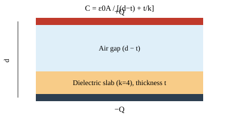

### Solution

**Step 1 — Area:**
$$A = a^2 = (0.5)^2 = 0.25\ \text{m}^2$$

**Step 2 — Air-gap thickness:**
$$d-t = 0.01-0.006 = 0.004\ \text{m}$$

**Step 3 — Denominator:**
$$(d-t)+\frac{t}{k} = 0.004+\frac{0.006}{4} = 0.004+0.0015 = 0.0055\ \text{m}$$

**Step 4 — Capacitance:**
$$C = \frac{(8.854\times10^{-12})\times0.25}{0.0055} = \frac{2.2135\times10^{-12}}{0.0055}$$

$$\boxed{C \approx 4.0245\times10^{-10}\ \text{F} = 402.45\ \text{pF}}$$

### Common Exam Mistakes
- Forgetting to convert **cm and mm to metres** before substituting (a very common trap in this exact question).
- Using $d$ (full separation) instead of $(d-t)+t/k$ in the denominator — the dielectric slab does **not** span the whole gap here, so the air portion must be handled separately.

### Exam Tip
Whenever a problem says a dielectric slab **partially** fills the gap (not touching both plates, or thinner than $d$), always use the **series-combination** denominator $(d-t)+t/k$ — never plug $t$ or $d$ alone into the plain $C=\varepsilon_0A/d$ formula.

---

## 11. Capacitors in Series

**Appears in:** 2018 PYQ 1(c)

### Question
> Show that $\dfrac{1}{C_S} = \dfrac{1}{C_1}+\dfrac{1}{C_2}+\dfrac{1}{C_3}$

### Theory
When capacitors are connected in **series**, the same charge $Q$ flows onto each one (charge is conserved along the series chain), but the potential differences **add up**.

### Derivation
Let three capacitors $C_1, C_2, C_3$ be connected in series across total voltage $V$.

Since voltages add in series:
$$V = V_1+V_2+V_3 \tag{i}$$

For each capacitor individually (same $Q$ on each, by charge conservation in series):
$$V_1=\frac{Q}{C_1},\quad V_2=\frac{Q}{C_2},\quad V_3=\frac{Q}{C_3}$$

Total voltage in terms of the equivalent series capacitance $C_S$:
$$V = \frac{Q}{C_S}$$

Substituting into (i):
$$\frac{Q}{C_S} = \frac{Q}{C_1}+\frac{Q}{C_2}+\frac{Q}{C_3}$$

Dividing through by $Q$:
$$\boxed{\frac{1}{C_S} = \frac{1}{C_1}+\frac{1}{C_2}+\frac{1}{C_3}}\quad\text{(shown)}$$

### Exam Tip
**Series capacitors behave like parallel resistors** (reciprocal sum), while **parallel capacitors** behave like series resistors (simple sum, $C_P=C_1+C_2+C_3$) — capacitance and resistance combination rules are "swapped" relative to each other. This swap is one of the most commonly tested conceptual traps.

---

## 12. Energy Stored in a Capacitor

**Appears in:** 2022 PYQ 8(b)

### Question
> Show that the energy stored in an electric field is $U=\frac12CV^2$.

### Derivation
As a capacitor charges up, work must be done to move each increment of charge $dq$ against the (growing) potential difference $v = q/C$:
$$dW = v\,dq = \frac{q}{C}\,dq$$

Total work done charging from $q=0$ to $q=Q$:
$$W = \int_0^Q \frac{q}{C}\,dq = \frac{1}{C}\left[\frac{q^2}{2}\right]_0^Q = \frac{Q^2}{2C}$$

This work is stored as electrical potential energy:
$$U = \frac{Q^2}{2C}$$

Since $Q=CV$:
$$U = \frac{(CV)^2}{2C} = \frac{C^2V^2}{2C}$$

$$\boxed{U = \frac12 CV^2}\quad\text{(shown)}$$

### Exam Tip
Three equivalent forms are all worth memorizing, since a question may give you any two of $Q$, $C$, $V$:
$$U=\frac{Q^2}{2C}=\frac12QV=\frac12CV^2$$

---

## 13. RC Charging & Discharging

**Appears in:** 2015 PYQ 2(b) [theory + graphs] · 2015 PYQ (d) [numerical] · 2023 PYQ 1(c) [derive charging equation]

### Theory
When a capacitor $C$ is connected in series with a resistor $R$ and an EMF source $\varepsilon$, the charge does **not** appear/disappear instantly — it builds up (or decays) exponentially, governed by the **time constant** $\tau = RC$.

### 13.1 Full Derivation of the Charging Equation (2023 PYQ 1(c))

Applying Kirchhoff's voltage law around the loop:
$$E = V_R+V_C = IR+\frac{q}{C}$$

Since $I = dq/dt$:
$$E = R\frac{dq}{dt}+\frac{q}{C}$$

Rearranging:
$$E-\frac{q}{C} = R\frac{dq}{dt} \quad\Rightarrow\quad \frac{CE-q}{C} = R\frac{dq}{dt}$$

$$\frac{dq}{CE-q} = \frac{dt}{RC}$$

Let $Q_0 = CE$ (the maximum/final charge). Then:
$$\frac{dq}{Q_0-q} = \frac{dt}{RC}$$

Integrating both sides — left from $0\to q$, right from $0\to t$:
$$\int_0^q \frac{dq}{Q_0-q} = \int_0^t \frac{dt}{RC}$$

$$\big[-\ln(Q_0-q)\big]_0^q = \frac{t}{RC}$$

$$-\ln(Q_0-q)-(-\ln Q_0) = \frac{t}{RC} \quad\Rightarrow\quad \ln\left(\frac{Q_0-q}{Q_0}\right) = -\frac{t}{RC}$$

Exponentiating both sides:
$$\frac{Q_0-q}{Q_0} = e^{-t/RC} \quad\Rightarrow\quad 1-\frac{q}{Q_0}=e^{-t/RC}$$

$$\boxed{q = Q_0\left(1-e^{-t/RC}\right)}\quad\text{— the charging equation.}$$

Similarly, $V_C = \varepsilon\left(1-e^{-t/RC}\right)$.

### 13.2 Discharging
When the source is removed and the capacitor discharges through $R$:
$$q(t) = Q_0e^{-t/RC}, \qquad V_C = V_0e^{-t/RC}$$

**Time constant:** $\tau = RC$ — the time for charge to reach ~63.2% of maximum (charging) or fall to ~36.8% of initial (discharging).

### Graphical Representation (2015 PYQ 2(b))

**Charging curve** (exponential rise, saturating at $Q_0$):
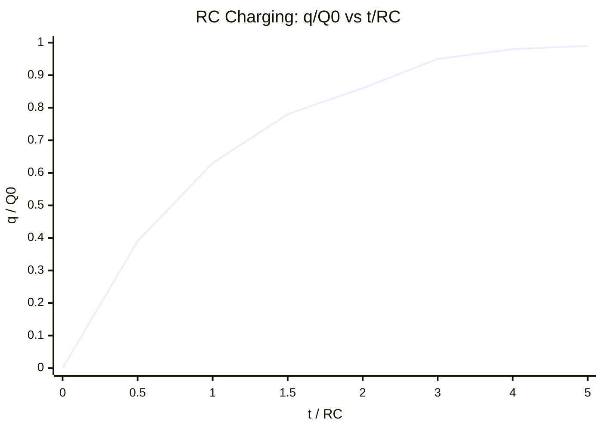

**Discharging curve** (exponential decay toward zero):
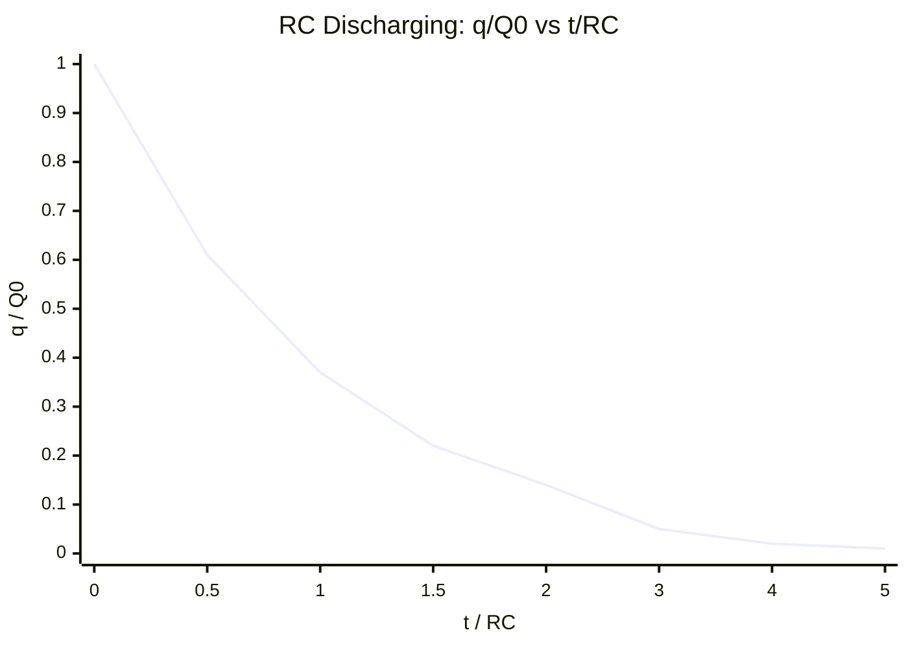

### 13.3 Numerical — Capacitance & Time Constant from 50% Charge Time (2015 PYQ (d))

**Given:**
- Resistance, $R = 1\ \text{M}\Omega = 1\times10^6\ \Omega$
- Time to reach 50% of maximum charge, $t = 1\ \text{s}$, i.e. $q = 0.5Q_0$

**Required:** Capacitance $C$ and time constant $\tau$ of the circuit.

**Formula:** $q = Q_0(1-e^{-t/RC})$

**Solution:**
$$0.5Q_0 = Q_0\left(1-e^{-1/RC}\right) \quad\Rightarrow\quad e^{-1/RC}=0.5$$

$$-\frac{1}{RC} = \ln(0.5) = -0.693$$

$$RC = \frac{1}{0.693} = 1.443\ \text{s}$$

Since $R=1\times10^6\ \Omega$:
$$C = \frac{1.443}{1\times10^6} = 1.443\times10^{-6}\ \text{F}$$

Time constant:
$$\tau = RC = (1\times10^6)\times(1.443\times10^{-6})$$

**Final Answer:**
$$\boxed{C = 1.443\ \mu\text{F}, \qquad \tau = 1.443\ \text{seconds}}$$

### Common Exam Mistakes
- Sign errors when taking $\ln$ of a fraction less than 1 (remember $\ln(0.5)$ is **negative**, so the two negatives cancel).
- Confusing "50% of maximum charge" with "50% of time constant" — they are different conditions.

### Exam Tip
**Memorize:** at $t=\tau$, charging reaches $1-e^{-1}\approx 63.2\%$ of max; discharging falls to $e^{-1}\approx 36.8\%$ of initial. These two "magic numbers" (63.2% / 36.8%) let you sanity-check any RC numerical instantly.

---

## 14. Ohm's Law & Resistance

**Appears in:** 2016 PYQ 1(a) · 2016 PYQ 1(b) [deduce resistance] · 2018 PYQ 1(a) [define]

### Statement
> Ohm's law is a fundamental principle relating voltage, current, and resistance in a conductor, at constant temperature.

### Formula
$$V = IR \qquad\Leftrightarrow\qquad I=\frac{V}{R}$$

| Symbol | Quantity | Unit |
|---|---|---|
| $V$ | Voltage (potential difference) | V (volt) |
| $I$ | Current | A (ampere) |
| $R$ | Resistance | Ω (ohm) |

### Resistance — Definition (2016 PYQ 1(b))
> **Resistance** is the measure of an object's or material's opposition to the flow of electric current.

*(Corrects the notebook's phrase "measure of an objects on materials" — a transcription slip for "of a material's".)*

### Exam Tips
- Ohm's law holds only for **ohmic** conductors (metals at constant temperature); diodes, filament bulbs at high current, etc. are **non-ohmic**.
- $R = V/I$ is the *definition* of resistance and always holds; Ohm's *Law* is the extra physical claim that $R$ stays **constant** as $V$ (or $I$) changes.

---

## 15. Specific Resistance (Resistivity)

**Appears in:** 2017 PYQ 2(a)

### Definition
> Specific resistance (resistivity) of a material is defined as the resistance offered by a conductor of unit length and unit cross-sectional area.

*(This corrects the notebook's slightly garbled repetition — "is defined as the... is defined as the" — into a single clean statement.)*

### Formula
$$R = \rho\frac{\ell}{A} \qquad\Rightarrow\qquad \rho = \frac{RA}{\ell}$$

| Symbol | Quantity | Unit |
|---|---|---|
| $\rho$ | Resistivity | **Ω·m** |
| $\ell$ | Length of conductor | m |
| $A$ | Cross-sectional area | m² |

> [!NOTE]
> Resistivity is an **intrinsic** material property (depends only on the material and temperature), unlike resistance $R$, which also depends on the conductor's shape/size.

### Exam Tip
Common confusion: resistivity's unit is **Ω·m**, not Ω/m — remember it comes from $\rho = RA/\ell$, i.e. $[\Omega][\text{m}^2]/[\text{m}] = \Omega\cdot\text{m}$.

---

## 16. Kirchhoff's Laws

**Appears in:** 2017 PYQ 2(b)

### 16.1 Kirchhoff's Current Law (KCL)
> The algebraic sum of all electric currents meeting at any junction in an electrical circuit is zero.

$$\boxed{\sum I = 0}$$

**Explanation:** If currents $I_1,I_2$ enter a node and $I_3,I_4$ leave it:
$$I_1+I_2-I_3-I_4=0 \quad\Rightarrow\quad I_1+I_2=I_3+I_4$$

This is simply a statement of **conservation of charge** at a node — charge cannot accumulate at a junction in steady state.

### 16.2 Kirchhoff's Voltage Law (KVL)
For any closed loop, the algebraic sum of EMFs equals the algebraic sum of $IR$ drops:
$$\sum V = 0 \qquad\text{or equivalently}\qquad \sum \varepsilon = \sum IR$$

**Example (2-resistor loop):**
$$E-IR_1-IR_2=0 \quad\Rightarrow\quad E = I(R_1+R_2)$$

### Common Exam Mistakes
- Sign errors: always fix a **consistent loop direction** (clockwise, say) before writing KVL, and treat a drop *against* your chosen direction as negative.
- Forgetting KCL applies to *currents* (not charges or voltages) at a node.

### Exam Tip
KCL ↔ conservation of **charge**; KVL ↔ conservation of **energy** (voltage is energy per charge, and going around a closed loop returns you to the same potential — net energy change is zero).

---

## 17. Wheatstone Bridge

**Appears in:** 2016 PYQ 1(b) [derive principle via Kirchhoff's laws] · 2017 PYQ 2(c) [numerical] · 2021 PYQ 3(b) [state balance condition] · 2022 PYQ 1(c) [same numerical, repeated]

### 17.1 Deriving the Balance Principle from Kirchhoff's Laws (2016 PYQ 1(b))

**Setup:** Four resistors $P,Q,R,S$ arranged in a bridge (diamond) circuit with a galvanometer $G$ across the middle and a battery driving current through the outer loop. At **balance**, no current flows through the galvanometer ($I_g=0$).

```
              A
             / \
          P /   \ Q
           /     \
          B       D
           \     /
          R \   / S
             \ /
              C
     (battery across A–C, galvanometer across B–D)
```

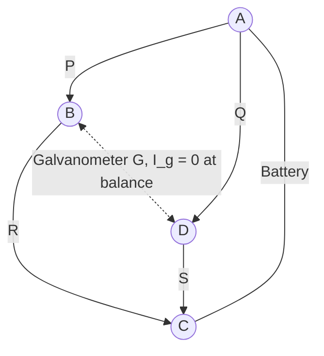

**Derivation:**

Applying **KCL** at the junctions (with $I_g=0$ at balance):
$$I_1 = I_3, \qquad I_2 = I_4$$

Applying **KVL** to loop A–B–D–A:
$$I_1P + I_gG - I_3R = 0$$

Since $I_g=0$:
$$I_1P = I_3R \tag{i}$$

Applying **KVL** to loop B–C–D–B:
$$I_2Q - I_4S - I_gG = 0$$

Since $I_g=0$:
$$I_2Q = I_4S \tag{ii}$$

Dividing (i) by (ii):
$$\frac{I_1P}{I_2Q} = \frac{I_3R}{I_4S}$$

Since $I_1=I_2$ and $I_3=I_4$ (from KCL above — the same current flows through P & Q as through the source, and through R & S), these cancel:

$$\boxed{\frac{P}{Q} = \frac{R}{S}}\quad\text{— the Wheatstone bridge balance condition (2021 PYQ 3(b))}$$

**Physical statement:** *If four resistors are arranged in a bridge circuit and the ratio of their resistance is equal ($P/Q=R/S$), the bridge is balanced — meaning no current flows through the central galvanometer.*

### 17.2 Numerical — Finding the Resistance for Balance (2017 PYQ 2(c), repeated in 2022 PYQ 1(c))

**Given:**
- First arm, $P = 8\ \Omega$
- Second arm, $Q = 16\ \Omega$
- Third arm, $R = 12\ \Omega$
- Fourth arm's own resistance, $S_{old} = 48\ \Omega$

**Required:** What resistance, connected in **parallel** with the fourth arm, restores balance?

**Formula:** $\dfrac{P}{Q}=\dfrac{R}{S_{required}}$

**Step 1 — find the *required* total resistance $S$ for balance:**
$$\frac{8}{16} = \frac{12}{S} \quad\Rightarrow\quad \frac12 = \frac{12}{S} \quad\Rightarrow\quad S = 12\times2 = 24\ \Omega$$

**Step 2 — since the arm currently has $S_{old}=48\ \Omega$ (too large; $48>24$), we need a parallel resistor $x$ to bring the combination down to $24\ \Omega$:**
$$\frac{1}{S} = \frac{1}{S_{old}}+\frac1x \quad\Rightarrow\quad \frac{1}{24}=\frac{1}{48}+\frac1x$$

$$\frac1x = \frac{1}{24}-\frac{1}{48} = \frac{2-1}{48}=\frac{1}{48}$$

$$\boxed{x = 48\ \Omega}$$

**Final Answer:** A resistance of **48 Ω** must be connected **in parallel** with the fourth arm to balance the bridge.

> [!NOTE]
> This exact numerical (8, 16, 12, 48 Ω) is repeated verbatim in **2022 PYQ 1(c)** — labelled "Repeated Question" in your own notebook. Great instinct to flag it; it's a strong sign this is a favourite past-paper numerical for your instructor.

### Common Exam Mistakes
- Confusing "resistance **in series**" vs "**in parallel**" with the fourth arm — this problem specifically needs the **parallel** combination formula because the target $S$ (24 Ω) is *smaller* than the existing arm (48 Ω), and parallel resistors always give a smaller combined resistance.
- Sign/ratio flip: always check **which** ratio equals which — $P/Q=R/S$, not $P/R=Q/S$ (though cross-multiplying gives the same balance condition either way, so this mostly matters for correctly identifying "required $S$" vs. "given $S$").

### Exam Tip
**Quick balance check:** cross-multiply — bridge is balanced *only if* $P\times S = Q\times R$. This single-line check is faster than computing full ratios during exams.

---

## 18. Faraday's Laws of Electromagnetic Induction

**Appears in:** 2016 PYQ 2(b) · 2021 PYQ 2(a) · 2021 PYQ (repeated, later page)

### First Law
> Whenever the magnetic flux linked with a circuit (or coil) changes, an electromotive force (EMF) is induced in it.

### Second Law
> The magnitude of the induced EMF is directly proportional to the rate of change of magnetic flux linked with the circuit.

### Formula
$$\varepsilon = -N\frac{\Delta\phi}{\Delta t} \qquad\text{(or, instantaneously, } \varepsilon=-N\dfrac{d\phi}{dt}\text{)}$$

| Symbol | Meaning |
|---|---|
| $\varepsilon$ | Induced EMF (V) |
| $N$ | Number of turns in the coil |
| $\Delta\phi$ | Change in magnetic flux (Wb) |
| $\Delta t$ | Time interval (s) |

> [!NOTE]
> The **negative sign** encodes Lenz's Law directly — the induced EMF always *opposes* the change that produced it (see §19). Some of your notebook's statements of this formula (2021 PYQ) omitted the sign; it should always be included for full technical correctness, even though magnitude-only calculations just use $|\varepsilon|$.

### Exam Tip
"Faraday tells you **how much**, Lenz tells you **which way**." Keep the two laws mentally separate: Faraday's Law is about magnitude (proportionality to $d\phi/dt$); Lenz's Law (next section) is about direction.

---

## 19. Lenz's Law and Conservation of Energy

**Appears in:** 2018 PYQ 2(b) · 2021 PYQ 2(a) [statement] · 2021 PYQ 2(b) [full proof]

### Statement (2021 PYQ 2(a))
> Lenz's Law states that the current created by a changing magnetic field will always flow in a direction that opposes the original change (the change that produced it).


The negative sign in Faraday's formula (§18) *is* Lenz's law — direction always opposes the change that caused it.

### Why Lenz's Law Obeys Conservation of Energy — Full Derivation (2021 PYQ 2(b))

**Mechanical work done** moving a magnet (against the induced opposing field):
$$W_m = \int F_m\,dx$$

**Electrical side:** induced EMF $\varepsilon = \dfrac{d\phi}{dt}$, giving induced current:
$$I = \frac{\varepsilon}{R} = \frac1R\frac{d\phi}{dt}$$

**Instantaneous electric power dissipated** (as heat in resistance $R$):
$$P = I^2R$$

**Total electrical energy produced** over time:
$$E_e = \int P\,dt = \int I^2R\,dt = \int\left(\frac{\varepsilon}{R}\right)^2R\,dt = \int\frac{\varepsilon^2}{R}\,dt$$

**Key result:** the mechanical work you put in to move the magnet against the induced opposition is found — by careful bookkeeping of $F_m$, $\varepsilon$, and $I$ — to equal *exactly* this electrical energy:
$$\boxed{W_m = E_e}$$

**Conclusion:** the mechanical work done to move a magnet against the induced magnetic field is **directly converted into electrical energy** (and ultimately dissipated as heat via $I^2R$) — energy is neither created nor destroyed, only converted. This is precisely why Lenz's Law (which fixes the *direction* of induced current to oppose motion) is consistent with, and in fact required by, the law of conservation of energy: if induced current instead *aided* the change (opposite of Lenz's Law), you could extract energy for free — a violation of energy conservation.

### Exam Tip
When asked "show Lenz's law obeys conservation of energy," always structure the answer as: (1) mechanical work expression → (2) induced EMF/current → (3) electrical energy dissipated → (4) conclude $W_{mech}=E_{elec}$, therefore no free energy is created. Examiners specifically look for that logical chain, not just the formulas.

---

## 20. Torque on a Current-Carrying Loop

**Appears in:** 2016 PYQ 2(c) [full derivation] · 2018 PYQ 2(c) [self-induction + numerical variant]

### Setup
A rectangular loop $ABCD$ of length $\ell$ and breadth $b$, carrying current $I$, is placed in a uniform magnetic field $B$. Let $\theta$ be the angle between the plane of the loop and the field $B$.

```
   A ────────── B
   │            │
 I↓│     B→     │  ← sides AB, CD experience forces
   │            │     that form a couple
   D ────────── C
```

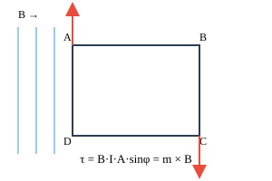

### Derivation (2016 PYQ 2(c))

**Forces on each side**, using $F=I\ell\times B$:

- **Sides AB & CD:** $F_1=F_2=BI\ell$. These two forces are equal, opposite, and form a **couple** — they produce the torque.
- **Sides BC & DA:** these forces are equal, opposite, and **collinear** — they produce no net torque (they just stretch/compress the loop).

**Calculating the torque:**

Perpendicular distance between the two forces (the "lever arm"):
$$d = b\cos\theta$$

Torque:
$$\tau = F_1\times d = BI\ell\times b\cos\theta = BI(\ell b)\cos\theta = BIA\cos\theta$$

where $A=\ell b$ is the loop's area.

If instead $\phi$ is defined as the angle between the **normal** to the loop and $B$ (so $\phi = 90°-\theta$):
$$\boxed{\tau = BIA\sin\phi}$$

**Vector form:**
$$\boxed{\vec\tau = \vec m\times\vec B}, \qquad \vec m = I\vec A \text{ (magnetic moment)}$$

*(Corrects the notebook's vector-form line, which had a stray repeated $\vec B\times\vec B$ term before the correct $\vec m\times\vec B$ — magnetic moment $\vec m=I\vec A$ crossed with $\vec B$ is the standard result.)*

### Numerical (2018 PYQ 2(c))

**Given:**
- Length of loop, $\ell = 2.5\ \text{cm} = 0.025\ \text{m}$
- Width of loop, $b = 1\ \text{cm} = 0.01\ \text{m}$
- Current, $I = 4\ \text{A}$
- Magnetic field strength, $B = 2\ \text{T}$
- Number of turns, $N=1$
- Loop placed **parallel** to the field $\Rightarrow$ angle between normal and $B$ is $\theta=90°$

**Required:** Torque $\tau$ on the loop.

**Formula:** $\tau = NIAB\sin\theta$

**Solution:**

Area: $A = \ell\times b = 0.025\times0.01 = 2.5\times10^{-4}\ \text{m}^2$

$$\tau = (1)(4)(2.5\times10^{-4})(2)\sin(90°) = 1\times4\times2.5\times10^{-4}\times2\times1$$

**Final Answer:** $\boxed{\tau = 2\times10^{-3}\ \text{N·m} = 0.002\ \text{N·m}}$

### Common Exam Mistakes
- Using $\sin\theta$ vs $\cos\theta$ interchangeably — the choice depends on whether the given angle is between the **loop's plane and B** ($\cos\theta$) or between the **normal to the loop and B** ($\sin\theta$). Always draw the diagram to check.
- Forgetting to convert cm→m for length/width before computing area.

---

## 21. Choke Coil & Torque (Definitions)

**Appears in:** 2015 PYQ 2(a)

### Choke Coil
> A choke coil is a highly inductive, low-resistance inductor used in alternating current (AC) circuits to reduce or control current without wasting significant electrical energy as heat.

### Torque
> Torque is the rotational equivalent of linear force.

*(These are the two short-definition parts of 2015 PYQ 2(a) — the full torque derivation and formula are covered in [§20](#20-torque-on-a-current-carrying-loop).)*

---

## 22. Self-Inductance

**Appears in:** 2016 PYQ 3(c) · 2021 PYQ 2(c) (identical numbers)

### Definition (2018 PYQ 2(c))
> Self-induction is the phenomenon where a changing current in a coil induces an EMF in the *same* coil, opposing the change that produced it.

### Formula
$$N\phi = LI \qquad\Rightarrow\qquad L = \frac{N\phi}{I}$$

| Symbol | Meaning | Unit |
|---|---|---|
| $L$ | Self-inductance | H (henry) |
| $N$ | Number of turns | — |
| $\phi$ | Magnetic flux per turn | Wb |
| $I$ | Current | A |

### Numerical — identical in both 2016 PYQ 3(c) and 2021 PYQ 2(c)

**Given:**
- Number of turns, $N=400$
- Current, $I = 2\ \text{A}$
- Magnetic flux created, $\phi = 4\times10^{-4}\ \text{Wb}$

**Required:** Self-inductance $L$.

**Formula:** $L = \dfrac{N\phi}{I}$

**Solution:**
$$L = \frac{400\times(4\times10^{-4})}{2} = \frac{0.16}{2}$$

**Final Answer:** $\boxed{L = 0.08\ \text{H} = 80\ \text{mH}}$

> [!NOTE]
> Your notebook wrote the given flux inconsistently across the two occurrences — once as $4\times10^{-4}\ \text{Wb}$ and once with a stray superscript reading "$4\times10^{-1}\ \text{wb}\ \text{wb}$" — both times the *arithmetic performed* uses $4\times10^{-4}$, and both give the same correct final answer of $0.08\ \text{H}$, so $4\times10^{-4}\ \text{Wb}$ is confirmed as the intended given value.

### Exam Tip
$L=N\phi/I$ is the *defining* relation. In circuit problems you'll more often use $\varepsilon=-L\,dI/dt$ (the EMF-based definition) — know both forms; they're two views of the same phenomenon.

---

## 23. LR Circuit: Growth & Decay

**Appears in:** 2016 PYQ 4(b) · 2020 PYQ 3(b) [same theory] · 2020 PYQ 2(c) [numerical] · 2021 PYQ 4(c) [numerical]

### Theory
When an inductor $L$ and resistor $R$ are connected in series with a DC EMF source, current does **not** jump instantly to its final value — the inductor's back-EMF opposes the *change* in current, producing an exponential build-up.

### 23.1 Growth of Current

Applying KVL: $E = L\dfrac{dI}{dt}+IR$

Rearranging and integrating (standard first-order linear ODE, same method as the RC case in §13):
$$\frac{E-IR}{E} = e^{-Rt/L}$$
$$1-\frac{R}{E}I = e^{-Rt/L}$$
$$\frac{R}{E}I = 1-e^{-Rt/L}$$
$$I = \frac{E}{R}\left(1-e^{-Rt/L}\right)$$

$$\boxed{I(t) = I_0\left(1-e^{-Rt/L}\right)}, \qquad I_0=\frac{E}{R}\ \text{(maximum current)}$$

**Time constant:** $\tau = \dfrac{L}{R}$ — the time for current to reach ~63.2% of its maximum value. At $t=\tau$: $I(\tau)=I_0(1-e^{-1})$.

### 23.2 Decay of Current
When the source is disconnected and the circuit short-circuited:
$$L\frac{dI}{dt}+IR=0 \qquad\Rightarrow\qquad \boxed{I(t)=I_0e^{-Rt/L}}$$

At $t=\tau=L/R$: $I(\tau)=I_0e^{-1}\approx0.368I_0$ (36.8% of initial value).

### Growth & Decay Graphs

```mermaid
xychart-beta
    title "LR Growth: I/I0 vs t/(L/R)"
    x-axis "t / (L/R)" [0, 0.5, 1, 1.5, 2, 3, 4, 5]
    y-axis "I / I0" 0 --> 1
    line [0, 0.39, 0.63, 0.78, 0.86, 0.95, 0.98, 0.99]
```

```mermaid
xychart-beta
    title "LR Decay: I/I0 vs t/(L/R)"
    x-axis "t / (L/R)" [0, 0.5, 1, 1.5, 2, 3, 4, 5]
    y-axis "I / I0" 0 --> 1
    line [1, 0.61, 0.37, 0.22, 0.14, 0.05, 0.02, 0.01]
```

Same exponential shape as RC (§13) — swap τ = RC for τ = L/R.

### 23.3 Numerical (2020 PYQ 2(c)) — Time Constant from "reaches ⅓ of maximum in 5 s"

**Given:** $I=\tfrac13I_0$ at $t=5\ \text{s}$

**Required:** Time constant $\tau$

**Formula:** $I=I_0(1-e^{-t/\tau})$

**Solution:**
$$\frac13I_0=I_0(1-e^{-5/\tau}) \;\Rightarrow\; \frac13=1-e^{-5/\tau}\;\Rightarrow\; e^{-5/\tau}=\frac23$$

$$-\frac{5}{\tau}=\ln\left(\frac23\right)=-0.405465$$

$$\tau = \frac{5}{0.405465}$$

**Final Answer:** $\boxed{\tau \approx 12.332\ \text{s}}$

### 23.4 Numerical (2021 PYQ 4(c)) — Time for Current to Reach Half its Final Value

**Given:**
- Inductance, $L=50\ \text{H}$
- Resistance, $R=30\ \Omega$
- Voltage, $V=100\ \text{V}$
- Target current, $I=\tfrac12I_0$

**Required:** Time $t$

**Formula:** $I=I_0(1-e^{-Rt/L})$

**Solution:**
$$\frac12I_0=I_0\left(1-e^{-\frac{30}{50}t}\right) \;\Rightarrow\; 0.5=1-e^{-0.6t}$$

$$e^{-0.6t}=0.5 \;\Rightarrow\; -0.6t=\ln(0.5)=-0.693147$$

$$t=\frac{0.693147}{0.6}$$

**Final Answer:** $\boxed{t\approx1.1553\ \text{s}}$

> [!NOTE]
> Note that in this problem, $V=100\ \text{V}$ is **extra (unused) information** — since we're finding time to reach a *fraction* of $I_0$, the ratio $I/I_0$ cancels $I_0$ (and hence $V$) out of the equation entirely. Only $L$ and $R$ matter for "what fraction of max, by when" questions. A great exam-time-saver to recognize.

### Common Exam Mistakes
- Confusing the RC time constant ($\tau=RC$) with the LR time constant ($\tau=L/R$) — note $L/R$, **not** $LR$.
- Sign errors when taking natural logs of fractions.

### Exam Tip
LR and RC circuits are **mathematically identical** (same exponential form), just with $\tau=L/R$ instead of $\tau=RC$. If you can solve one, you can solve the other — same algebra, different constant.

---

## 24. Hall Effect

**Appears in:** 2016 PYQ 4(c) [definition] · 2018 PYQ 2(a) [full derivation of $V_H$]

### Definition (2016 PYQ 4(c))
> The Hall effect is the generation of a measurable transverse voltage (the **Hall voltage**) across a current-carrying conductor when it is placed in a magnetic field perpendicular to the current.

### Formula (quick form)
$$V_H = \frac{IB}{nqe}$$

*(2016 notebook wrote this as $V_H=\dfrac{IB}{nqe}$, combining $n$ = number density of charge carriers, $q$/$e$ = elementary charge, and an implicit thickness — the full symbol-by-symbol derivation below, from 2018, resolves this cleanly.)*

### Full Derivation (2018 PYQ 2(a))

**Setup:** A current-carrying conductor of thickness (width) $w$ and thickness $d$ sits in magnetic field $B$, perpendicular to current $I$.

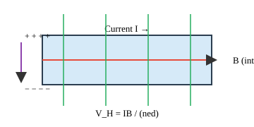

**Step 1 — Force balance on a charge carrier:**

Magnetic force on a drifting charge: $F_B = ev_dB$

This pushes charges to one side, building up a transverse **Hall field** $E_H$, which exerts an opposing electric force: $F_E = eE_H$

**Step 2 — Equilibrium condition** (steady state, net transverse force = 0):
$$eE_H = ev_dB \quad\Rightarrow\quad E_H = v_dB \tag{i}$$

**Step 3 — Relate to voltage** (across width $w$):
$$V_H = E_H\cdot w = v_dBw$$

**Step 4 — Relate drift velocity to current density:**

Current density: $J = \dfrac{I}{A}=\dfrac{I}{wd}$, and also $J=nev_d$, so:
$$v_d = \frac{I}{new d}$$

**Step 5 — Substitute back:**
$$V_H = \left(\frac{I}{newd}\right)Bw = \frac{IB}{ned}$$

$$\boxed{V_H = \frac{IB}{ned} = R_H\frac{IB}{d}}$$

| Symbol | Meaning | Unit |
|---|---|---|
| $I$ | Current | A |
| $B$ | Magnetic field strength | T |
| $n$ | Number density of charge carriers | m⁻³ |
| $e$ | Elementary charge | C |
| $d$ | Thickness of the conductor (along $B$) | m |
| $R_H = 1/(ne)$ | Hall coefficient | m³ C⁻¹ |

### Exam Tip
The Hall effect is the standard way to determine **both the sign and density of charge carriers** in a material — a positive $V_H$ indicates positive carriers (holes), negative indicates electrons. Worth a one-line mention for "applications" marks.

---

## 25. Resonance in R-L-C Circuits

**Appears in:** 2023 PYQ 2(b) [theory + derivation] · 2023 PYQ 2(c) [numerical]

### Theory
In a series R-L-C AC circuit, **impedance** depends on the balance between inductive reactance $X_L$ (which grows with frequency) and capacitive reactance $X_C$ (which shrinks with frequency). **Resonance** is the special frequency where these cancel.

### Formula Derivation

Total impedance:
$$Z = \sqrt{R^2+(X_L-X_C)^2}$$

where
$$X_L = \omega L = 2\pi f L, \qquad X_C=\frac{1}{\omega C}=\frac{1}{2\pi f C}$$

**At resonance:** $X_L=X_C$ (impedance is purely resistive, $Z=R$, minimum possible):
$$2\pi f_0L = \frac{1}{2\pi f_0C}$$

$$f_0^2 = \frac{1}{4\pi^2LC}$$

$$\boxed{f_0 = \frac{1}{2\pi\sqrt{LC}}}$$

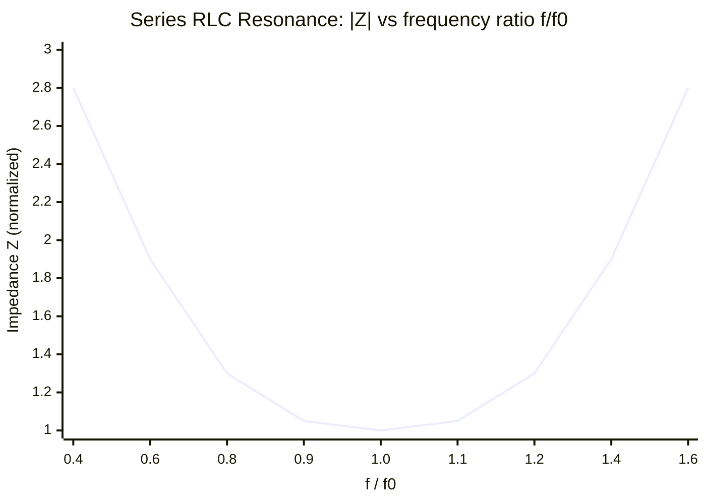

At `f/f0 = 1`, $X_L = X_C$, so $Z$ is minimum (purely resistive) — the resonance dip.

### Numerical (2023 PYQ 2(c))

**Given:**
- Inductance, $L = 50\ \mu\text{H} = 50\times10^{-6}\ \text{H}$
- Capacitance, $C = 5\times10^{-4}\ \mu\text{F} = 5\times10^{-10}\ \text{F}$
- Resistance, $R = 100\ \Omega$ *(not needed for $f_0$ itself — only affects the sharpness/Q-factor of resonance, not its frequency)*

**Required:** Resonant frequency $f_0$.

**Formula:** $f_0=\dfrac{1}{2\pi\sqrt{LC}}$

**Solution:**

$$LC = (50\times10^{-6})(5\times10^{-10}) = 250\times10^{-16}$$

$$\sqrt{LC} = \sqrt{250\times10^{-16}} = 15.811\times10^{-8}\ \text{s}$$

$$f_0 = \frac{1}{2\pi\times(15.811\times10^{-8})} = \frac{1}{2\times3.1416\times15.811\times10^{-8}} = \frac{1}{99.35\times10^{-8}}$$

**Final Answer:** $\boxed{f_0 \approx 1{,}006{,}573\ \text{Hz} \approx 1.007\ \text{MHz}}$

*(Corrects a decimal-placement slip in the notebook's answer line: dividing $1$ by $99.35\times10^{-8}$ gives approximately $1.0066\times10^6$, i.e. about **1,006,573 Hz**, not "100657.3 Hz" — the digit string in the notebook is right, only the decimal point/order of magnitude needed fixing.)*

### Common Exam Mistakes
- Forgetting that $R$ does **not** appear in the $f_0$ formula — a very common instinct is to try to fit $R$ in somewhere; resonance frequency is set purely by $L$ and $C$.
- Losing track of powers of ten when converting µH → H and µF → F — write out every conversion explicitly.

### Exam Tip
**Memorize the standalone formula** $f_0=\dfrac{1}{2\pi\sqrt{LC}}$ directly — in the exam it's far faster to plug numbers into this than to re-derive $X_L=X_C$ from scratch, unless the question explicitly asks you to "deduce" it (as 2023 PYQ 2(b) does — then show the full derivation above).

---

## 26. Electron in a Field Equal to Weight

**Appears in:** 2020 PYQ 1(c)

### Question
> What is the magnitude of the electric field strength such that an electron placed in the field would experience an electrical force equal to its weight?

### Given
- Charge of electron, $e = 1.6\times10^{-19}\ \text{C}$
- Mass of electron, $m = 9.1\times10^{-31}\ \text{kg}$
- $g = 9.8\ \text{m s}^{-2}$

### Required
Electric field strength $E$ such that electrical force = gravitational force (weight).

### Formula
Setting electric force equal to weight:
$$eE = mg \qquad\Rightarrow\qquad E = \frac{mg}{e}$$

### Solution
$$E = \frac{(9.1\times10^{-31})(9.8)}{1.6\times10^{-19}}$$

$$E = \frac{8.918\times10^{-30}}{1.6\times10^{-19}}$$

### Final Answer
$$\boxed{E \approx 5.574\times10^{-11}\ \text{N/C}}$$

*(Your notebook set up the correct formula and given data but the page was cut off before the final numeric division — completed above.)*

### Exam Tip
This is a nice sanity-check numerical: it shows *how absurdly weak* gravity is compared to the electric force — a field of only ~$5.6\times10^{-11}$ N/C (a genuinely tiny field) is enough to balance an electron's weight. This is why gravity is utterly negligible in atomic-scale electric-force problems.

---

## Year-wise Index

*(Cross-reference table — original notebook numbering preserved, linking to the thematic section where each question is fully solved.)*

### 2015

| Q# | Topic | Section |
|---|---|---|
| 1(a) | Electric field; field on axis of charged ring | [§2](#2-electric-field--field-intensity), [§3](#3-electric-field-on-the-axis-of-a-charged-ring) |
| 1(b) | Gauss's law; deduce Coulomb's law | [§4](#4-gausss-law) |
| 1(b,c) | Dielectrics; field just outside conductor (numerical) | [§8](#8-dielectrics), [§6](#6-charge-density) |
| 2(a) | Choke coil; torque (definitions) | [§21](#21-choke-coil--torque-definitions) |
| 2(b) | Charging/discharging of capacitor | [§13](#13-rc-charging--discharging) |
| 2(c) | Show $D=\varepsilon_0E+P$ | [§7](#7-displacement-field) |
| (d) | Capacitor + 1 MΩ resistor (numerical) | [§13](#13-rc-charging--discharging) |
| 1(a) *(2nd instance)* | Define capacitor & capacitance | [§9](#9-parallel-plate-capacitor) |

### 2016

| Q# | Topic | Section |
|---|---|---|
| 1(a) | Ohm's law | [§14](#14-ohms-law--resistance) |
| 1(b) | Deduce Wheatstone bridge principle | [§17](#17-wheatstone-bridge) |
| 1(c) | Potential due to a dipole (numerical) | [§5](#5-electric-dipole) |
| 2(b) | Faraday's laws | [§18](#18-faradays-laws-of-electromagnetic-induction) |
| 2(c) | Torque on current-carrying loop | [§20](#20-torque-on-a-current-carrying-loop) |
| 3(c) | Self-inductance (numerical) | [§22](#22-self-inductance) |
| 4(b) | L-R circuit growth/decay | [§23](#23-lr-circuit-growth--decay) |
| 4(c) | Hall effect (definition) | [§24](#24-hall-effect) |

### 2017

| Q# | Topic | Section |
|---|---|---|
| 1(a) | Coulomb's law | [§1](#1-coulombs-law) |
| 1(b) | Capacitance of a capacitor | [§9](#9-parallel-plate-capacitor) |
| 1(c) | Capacitor with dielectric slab (numerical) | [§10](#10-capacitor-with-partial-dielectric-slab) |
| 2(a) | Specific resistance | [§15](#15-specific-resistance-resistivity) |
| 2(b) | Kirchhoff's laws | [§16](#16-kirchhoffs-laws) |
| 2(c) | Wheatstone bridge (numerical) | [§17](#17-wheatstone-bridge) |

### 2018

| Q# | Topic | Section |
|---|---|---|
| 1(a) | Define Gauss's law, Ohm's law, Capacitor | [§4](#4-gausss-law), [§14](#14-ohms-law--resistance), [§9](#9-parallel-plate-capacitor) |
| 1(c) | Capacitors in series | [§11](#11-capacitors-in-series) |
| 2(a) | Hall effect — full derivation | [§24](#24-hall-effect) |
| 2(b) | Lenz's law & conservation of energy | [§19](#19-lenzs-law-and-conservation-of-energy) |
| 2(c) | Self-induction; torque numerical | [§20](#20-torque-on-a-current-carrying-loop) |

### 2019

| Q# | Topic | Section |
|---|---|---|
| 1(a) | Electric field & field intensity | [§2](#2-electric-field--field-intensity) |
| 1(b) | Coulomb's law; unit charge | [§1](#1-coulombs-law) |

### 2020

| Q# | Topic | Section |
|---|---|---|
| 1(a) | Prove Gauss's law | [§4](#4-gausss-law) |
| 1(b) | Deduce Coulomb's law from Gauss's law | [§4](#4-gausss-law) |
| 1(c) | Electron field = weight (numerical) | [§26](#26-electron-in-a-field-equal-to-weight) |
| 2(c) | LR circuit time constant (numerical) | [§23](#23-lr-circuit-growth--decay) |
| 3(b) | L-R circuit growth/decay | [§23](#23-lr-circuit-growth--decay) |

### 2021

| Q# | Topic | Section |
|---|---|---|
| 1(b) | Capacitance of parallel-plate capacitor | [§9](#9-parallel-plate-capacitor) |
| 1(c) | Capacitance (numerical) | [§9](#9-parallel-plate-capacitor) |
| 2(a) | Faraday's & Lenz's law | [§18](#18-faradays-laws-of-electromagnetic-induction), [§19](#19-lenzs-law-and-conservation-of-energy) |
| 2(b) | Lenz's law & conservation of energy | [§19](#19-lenzs-law-and-conservation-of-energy) |
| 2(c) | Self-inductance (numerical) | [§22](#22-self-inductance) |
| 3(b) | Wheatstone bridge balance condition | [§17](#17-wheatstone-bridge) |
| 4(c) | LR circuit (numerical) | [§23](#23-lr-circuit-growth--decay) |

### 2022

| Q# | Topic | Section |
|---|---|---|
| 1(c) | Parallel-plate capacitor (repeated) | [§9](#9-parallel-plate-capacitor) |
| 1(c) | Wheatstone bridge numerical (repeated) | [§17](#17-wheatstone-bridge) |
| 3(a) | Charge density; electric dipole | [§5](#5-electric-dipole), [§6](#6-charge-density) |
| (3b) | E ∝ 2p/r³ for a dipole | [§5](#5-electric-dipole) |
| 8(b) | Energy stored, $U=\tfrac12CV^2$ | [§12](#12-energy-stored-in-a-capacitor) |

### 2023

| Q# | Topic | Section |
|---|---|---|
| 1(c) | RC time constant; charging derivation | [§13](#13-rc-charging--discharging) |
| 2(b) | Resonance; resonant frequency derivation | [§25](#25-resonance-in-r-l-c-circuits) |
| 2(c) | R-L-C resonant frequency (numerical) | [§25](#25-resonance-in-r-l-c-circuits) |

### 2024

| Q# | Topic | Section |
|---|---|---|
| 4(a) | Coulomb's law and its limitations | [§1](#1-coulombs-law) |
| 7(b) | Capacitance with dielectric material | [§9](#9-parallel-plate-capacitor) |

---

## Final Revision Checklist

> [!TIP]
> **High-frequency topics** (appeared 3+ times across 2015–2024): Wheatstone bridge (4×), Coulomb's/Gauss's law family (6×), parallel-plate capacitance (4×), LR growth/decay (4×), self-inductance numerical (2×, identical numbers), Faraday's/Lenz's laws (4×). **Prioritize these first** if revision time is limited.

- [ ] Can derive Coulomb's law **both** from first principles and from Gauss's law
- [ ] Can state and derive the parallel-plate capacitance formula, with and without dielectric
- [ ] Can derive the RC charging equation from KVL by separation of variables
- [ ] Can derive the Wheatstone bridge balance condition from KCL + KVL
- [ ] Know both LR and RC time-constant formulas ($\tau=RC$ vs $\tau=L/R$) and don't mix them up
- [ ] Can derive torque on a current loop and the Hall voltage from force-balance first principles
- [ ] Know the resonance formula $f_0=\dfrac{1}{2\pi\sqrt{LC}}$ cold, and can derive it from $X_L=X_C$

Good luck, master.
