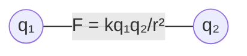
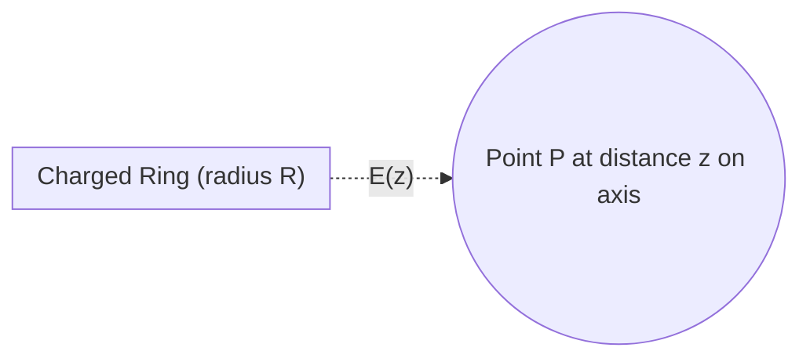
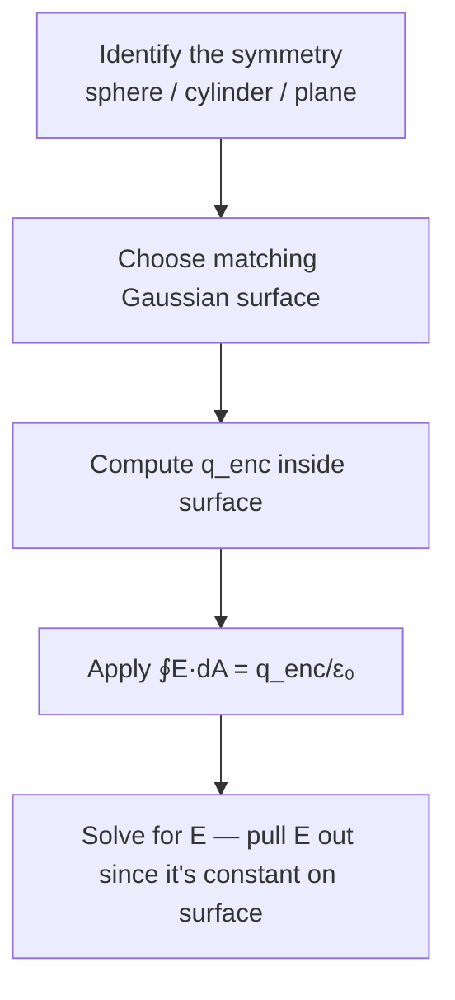
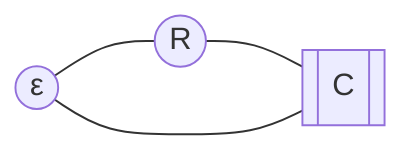
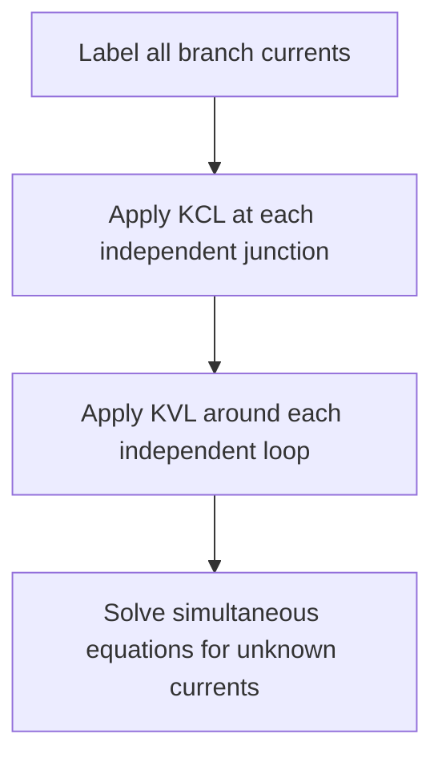
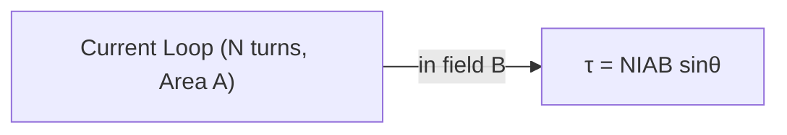
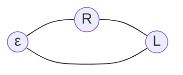
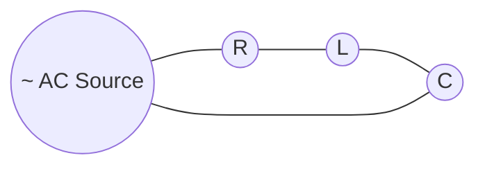

# ⚡ Electricity — Enhanced Quick Revision (Night-Before-Exam Edition)

> [!IMPORTANT]
> Built from your `butex-notes/PHY-103/electricity` repo (14 topic files + PYQ guide). Read top → bottom once, then jump straight to **§16 High-Yield PYQ Map** and **§17 Rapid-Fire Flashcards** for the final pass.

---

## 🗺️ 0. The Whole Chapter in One Map

```mermaid
flowchart TD
    A[ELECTRICITY] --> B[Electrostatics]
    A --> C[Capacitors]
    A --> D[Current Electricity]
    A --> E[Electromagnetic Induction]
    A --> F[AC Circuits]

    B --> B1[Coulomb's Law]
    B --> B2[Electric Field / Ring Axis]
    B --> B3[Gauss's Law]
    B --> B4[Electric Dipole]

    C --> C1[Parallel-Plate Capacitance]
    C --> C2[Dielectrics]
    C --> C3[RC Charging / Discharging]

    D --> D1[Ohm's Law & Resistivity]
    D --> D2[Kirchhoff's Laws KCL/KVL]
    D --> D3[Wheatstone Bridge]

    E --> E1[LR Growth & Decay]
    E --> E2[Faraday's + Lenz's Law]
    E --> E3[Torque on Current Loop]
    E --> E4[Hall Effect]
    E --> E5[Self-Inductance]

    F --> F1[AC Fundamentals: rms, reactance]
    F --> F2[Series RLC + Resonance]
    F --> F3[Parallel Resonance / Tank Circuit]
```



---

## 📐 1. Master Formula Sheet (memorize this table cold)

| # | Concept | Formula | Notes |
|---|---|---|---|
| 1 | Coulomb's Law | $F = \dfrac{1}{4\pi\varepsilon_0}\dfrac{q_1q_2}{r^2}$ | $\frac{1}{4\pi\varepsilon_0}\approx 9\times10^9\ \text{Nm}^2\text{C}^{-2}$ |
| 2 | Electric field | $E = F/q_0 = \dfrac{1}{4\pi\varepsilon_0}\dfrac{q}{r^2}$ | vector, points away from +q |
| 3 | Field on axis of charged ring | $E = \dfrac{1}{4\pi\varepsilon_0}\dfrac{qz}{(z^2+R^2)^{3/2}}$ | max at $z=R/\sqrt2$ |
| 4 | Gauss's Law | $\oint \vec E\cdot d\vec A = \dfrac{q_{enc}}{\varepsilon_0}$ | pick symmetric Gaussian surface |
| 5 | Dipole field (axial, far) | $E \approx \dfrac{1}{4\pi\varepsilon_0}\dfrac{2p}{r^3}$ | $p = q\cdot d$ |
| 6 | Dipole potential | $V = \dfrac{1}{4\pi\varepsilon_0}\dfrac{p\cos\theta}{r^2}$ | — |
| 7 | Displacement field | $D = \varepsilon_0E + P$ | $P$ = polarization |
| 8 | Parallel-plate capacitance | $C = \dfrac{\varepsilon_0 A}{d}$ | with dielectric: $C'=\dfrac{k\varepsilon_0A}{d}=kC$ |
| 9 | Spherical capacitor | $C = 4\pi\varepsilon_0\dfrac{ab}{b-a}$ | — |
| 10 | Capacitors in series | $\dfrac1{C_{eq}} = \dfrac1{C_1}+\dfrac1{C_2}+\dots$ | charge same, V splits |
| 11 | Capacitors in parallel | $C_{eq}=C_1+C_2+\dots$ | V same, charge splits |
| 12 | Energy in capacitor | $U = \tfrac12 CV^2 = \tfrac{q^2}{2C}$ | energy density $u=\tfrac12\varepsilon_0E^2$ |
| 13 | RC charging | $q(t)=q_0(1-e^{-t/RC})$ | $\tau = RC$ |
| 14 | RC discharging | $q(t)=q_0e^{-t/RC}$ | 63% charged / 37% left at $t=\tau$ |
| 15 | Ohm's Law | $V = IR$ | $\rho$: $R=\rho L/A$ |
| 16 | KCL | $\sum I_{in} = \sum I_{out}$ | charge conservation |
| 17 | KVL | $\sum \Delta V = 0$ around loop | energy conservation |
| 18 | Wheatstone balance | $\dfrac{P}{Q}=\dfrac{R}{S}$ | zero galvanometer current |
| 19 | Faraday's Law | $\varepsilon = -N\dfrac{d\phi}{dt}$ | induced EMF |
| 20 | Lenz's Law | induced current opposes the change | energy conservation |
| 21 | Torque on current loop | $\tau = NIAB\sin\theta = \vec m\times\vec B$ | $m = NIA$ |
| 22 | Hall Effect | $V_H = \dfrac{IB}{nqt}$ | gives carrier density $n$ |
| 23 | Self-inductance (emf) | $\varepsilon_L = -L\dfrac{dI}{dt}$ | unit: Henry |
| 24 | LR growth | $I(t)=I_0(1-e^{-Rt/L})$ | $\tau = L/R$ |
| 25 | LR decay | $I(t)=I_0e^{-Rt/L}$ | — |
| 26 | RMS value | $I_{rms}=I_m/\sqrt2$ | avg value $=2I_m/\pi$ |
| 27 | Reactances | $X_L=\omega L$, $X_C=\dfrac{1}{\omega C}$ | $\omega=2\pi f$ |
| 28 | Series RLC impedance | $Z=\sqrt{R^2+(X_L-X_C)^2}$ | $\tan\phi=(X_L-X_C)/R$ |
| 29 | Resonant frequency | $f_0=\dfrac{1}{2\pi\sqrt{LC}}$ | $X_L=X_C$ at resonance |
| 30 | Quality factor | $Q=\dfrac{\omega_0 L}{R}=\dfrac1R\sqrt{L/C}$ | sharper peak = higher Q |
| 31 | Avg AC power | $P=V_{rms}I_{rms}\cos\phi$ | $\cos\phi$ = power factor |
| 32 | Electron balance (special numerical) | $eE = mg \Rightarrow E=mg/e$ | $\approx5.57\times10^{-11}$ N/C |

> [!TIP]
> **Constants to have memorized:** $\varepsilon_0 = 8.854\times10^{-12}\,\text{F/m}$, $\frac{1}{4\pi\varepsilon_0}\approx9\times10^9$, $e=1.6\times10^{-19}$ C, $m_e = 9.1\times10^{-31}$ kg.

---

## 1. Coulomb's Law

**Statement:** Force between two stationary point charges is directly proportional to the product of their magnitudes and inversely proportional to the square of the distance between them.

$$\boxed{F = \frac{1}{4\pi\varepsilon_0}\cdot\frac{q_1 q_2}{r^2}}$$



**Limitations:** only point charges · only static charges · breaks down at nuclear scale · ignores finite propagation speed of field.

⚠️ **Common mistake:** writing $F\propto q_1q_2/r$ (forgetting the square), or confusing $k$ with $\varepsilon_0$ ($k=1/4\pi\varepsilon_0$).

---

## 2. Electric Field, Field Intensity & Ring Axis

**Electric field** $\vec E$ = force per unit test charge: $E = F/q_0$.

**On the axis of a uniformly charged ring** (radius $R$, charge $q$, distance $z$ from centre):

$$E(z) = \frac{1}{4\pi\varepsilon_0}\cdot\frac{qz}{(z^2+R^2)^{3/2}}$$



- $E=0$ at the centre ($z=0$) and at $z\to\infty$.
- $E$ is **maximum** at $z = R/\sqrt2$.

---

## 3. Gauss's Law

$$\boxed{\oint \vec E\cdot d\vec A = \frac{q_{enc}}{\varepsilon_0}}$$

**Deducing Coulomb's law from Gauss's law:** enclose a point charge $q$ in a spherical Gaussian surface of radius $r$. By symmetry $E$ is constant over the surface and normal to it:

$$E(4\pi r^2) = \frac{q}{\varepsilon_0} \;\Rightarrow\; E=\frac{1}{4\pi\varepsilon_0}\frac{q}{r^2} \;\Rightarrow\; F=qE=\frac{1}{4\pi\varepsilon_0}\frac{qq_0}{r^2}$$

**Recipe for any Gauss's Law problem:**



---

## 4. Electric Dipole

Two equal & opposite charges $\pm q$ separated by distance $d$; dipole moment $p = qd$ (points from $-q$ to $+q$).

- **Axial (end-on) field, far away:** $E \approx \dfrac{1}{4\pi\varepsilon_0}\dfrac{2p}{r^3}$
- **Equatorial (broadside) field:** $E \approx \dfrac{1}{4\pi\varepsilon_0}\dfrac{p}{r^3}$ (half of axial, opposite direction)
- **Potential at angle $\theta$:** $V = \dfrac{1}{4\pi\varepsilon_0}\dfrac{p\cos\theta}{r^2}$
- **Torque on dipole in uniform field:** $\tau = pE\sin\theta = \vec p\times\vec E$

> [!NOTE]
> Dipole field falls off as $1/r^3$ (faster than a point charge's $1/r^2$) because the two charges' fields nearly cancel at large distance.

---

## 5. Displacement Field & Dielectrics (concept)

$$D = \varepsilon_0 E + P$$

Where $P$ = polarization (dipole moment per unit volume induced in the dielectric). Inside a dielectric of dielectric constant $k$: $D = k\varepsilon_0 E$.

A **dielectric** is an insulator that gets **polarized** under an external field — bound surface charges appear that **reduce** the net field inside, which is *why* inserting a dielectric between capacitor plates **increases capacitance**.

```
  No dielectric:  E₀ (full field)
  With dielectric: E = E₀ / k   (field reduced by factor k)
  Capacitance:     C' = kC       (increased by factor k)
```

---

## 6. Capacitors & Capacitance

**Definition:** $C = q/V$ — charge stored per unit potential difference. Unit: Farad (F).

**Parallel plate (via Gauss's Law):**

$$E = \frac{\sigma}{\varepsilon_0} = \frac{q}{\varepsilon_0 A} \;\Rightarrow\; V=Ed \;\Rightarrow\; \boxed{C = \frac{\varepsilon_0 A}{d}}$$

**Spherical capacitor:** $C = 4\pi\varepsilon_0\dfrac{ab}{b-a}$ (a = inner radius, b = outer radius)

**With dielectric slab (fully filling gap):** $C' = kC = \dfrac{k\varepsilon_0 A}{d}$

**Series vs Parallel:**

| | Series | Parallel |
|---|---|---|
| Charge $q$ | same on each | splits |
| Voltage $V$ | splits | same across each |
| Formula | $\dfrac1{C_{eq}}=\sum\dfrac1{C_i}$ | $C_{eq}=\sum C_i$ |
| Net effect | **decreases** total C | **increases** total C |
| Memory trick | like **resistors in parallel** | like **resistors in series** (inverted!) |

**Energy stored:** $U = \tfrac12 CV^2 = \tfrac{q^2}{2C} = \tfrac12 qV$; energy density in field $u=\tfrac12\varepsilon_0E^2$.

---

## 7. RC Charging & Discharging (Capacitor Transients)



**Charging** (KVL: $\varepsilon = iR + q/C$, solve the DE):

$$q(t) = q_0\left(1-e^{-t/RC}\right), \qquad i(t)=\frac{\varepsilon}{R}e^{-t/RC}$$

**Discharging:**

$$q(t) = q_0\,e^{-t/RC}$$

**Time constant** $\tau = RC$ — time to reach **63%** charged (charging) or fall to **37%** (discharging).

```
Charging q(t)                Discharging q(t)
   q₀ ┤        ____----          q₀┤\
      │    ___/                    │ \___
      │  _/                        │     \____
    0 ┤_/______________          0 ┤___________\________
      0   τ   2τ   3τ  t           0   τ   2τ   3τ   t
```

⚠️ **Don't confuse** $\tau_{RC}=RC$ with $\tau_{LR}=L/R$ — they look similar but come from different circuits (see §12).

---

## 8. Ohm's Law & Resistivity

$$V = IR, \qquad R = \rho\frac{L}{A}$$

- $\rho$ (resistivity) is a **material property** (independent of shape); $R$ depends on geometry too.
- Ohmic materials: $V$–$I$ graph is a straight line through origin at constant temperature.

---

## 9. Kirchhoff's Laws (KCL & KVL)

| Law | Statement | Based on |
|---|---|---|
| **KCL** (junction rule) | $\sum I_{in} = \sum I_{out}$ at any node | Conservation of **charge** |
| **KVL** (loop rule) | $\sum \Delta V = 0$ around any closed loop | Conservation of **energy** |



**Sign convention for KVL:** moving through a battery from − to + is a **rise** (+ε); moving through a resistor **in the direction of assumed current** is a **drop** (−IR).

---

## 10. Wheatstone Bridge

```
              A
            /   \
          P/     \Q
          /       \
         B----G----D
          \       /
          R\     /S
            \   /
              C
        (battery across A–C, galvanometer across B–D)
```

**Balance condition** (galvanometer current = 0):

$$\boxed{\frac{P}{Q} = \frac{R}{S}}$$

**Derivation logic:** at balance, no current through G ⟹ same current flows through P→R and Q→S ⟹ by KVL, $IP = I'R$ and $IQ=I'S$ ⟹ divide the two equations ⟹ $P/Q = R/S$.

Used to find an **unknown resistance** $S$ precisely by adjusting $R$ (or the P/Q ratio) until the galvanometer reads zero. Sensitivity is best when $P\approx Q\approx R\approx S$.

---

## 11. Faraday's & Lenz's Laws + Torque + Hall Effect + Self-Inductance

**Faraday's Law:** $\varepsilon = -N\dfrac{d\phi}{dt}$ — a changing magnetic flux through a circuit induces an EMF.

**Lenz's Law:** the induced current flows in the direction that **opposes** the change in flux that produced it (⟹ consequence of conservation of energy — the minus sign in Faraday's law).

**Torque on a current-carrying loop in field $B$:**

$$\tau = NIAB\sin\theta = \vec m \times \vec B, \qquad m = NIA \text{ (magnetic moment)}$$



**Hall Effect:** when a current-carrying conductor is placed in a perpendicular magnetic field, a transverse voltage $V_H$ develops (used to find charge carrier density $n$ and sign of carriers):

$$V_H = \frac{IB}{nqt}$$

where $t$ = thickness of the conductor slab, $n$ = carrier density, $q$ = carrier charge.

**Self-Inductance:** opposition a coil offers to a change in its own current:

$$\varepsilon_L = -L\frac{dI}{dt}, \qquad \Phi = LI$$

---

## 12. LR Circuit — Growth & Decay of Current



**Growth** (switch closed): $I(t) = I_0\left(1-e^{-Rt/L}\right)$, where $I_0=\varepsilon/R$ (steady-state).

**Decay** (EMF removed): $I(t) = I_0\,e^{-Rt/L}$

**Time constant:** $\boxed{\tau = L/R}$ — time to reach 63% of steady state (growth) or fall to 37% (decay).

| | RC circuit | LR circuit |
|---|---|---|
| Time constant | $\tau=RC$ | $\tau=L/R$ |
| Stores energy in | Electric field ($U=\tfrac12CV^2$) | Magnetic field ($U=\tfrac12LI^2$) |
| Opposes change in | Voltage | Current |

⚠️ These two are the **#1 mix-up** in exams — RC and LR time-constant formulas are structurally different ($RC$ vs $L/R$), don't swap them.

---

## 13. AC Fundamentals

$$v(t) = V_m\sin(\omega t), \qquad i(t) = I_m\sin(\omega t \pm \phi), \qquad \omega = 2\pi f$$

**RMS values:** $I_{rms} = I_m/\sqrt2 \approx 0.707I_m$ (this is what "230 V AC" means — RMS, not peak!)

**Reactance summary:**

| Element | Opposition | Formula | Phase (v vs i) | Frequency behaviour |
|---|---|---|---|---|
| Resistor R | Resistance | $R$ | in phase | independent of $f$ |
| Inductor L | Inductive reactance | $X_L = \omega L$ | **v leads i** by 90° | ↑ with $f$ (blocks high f) |
| Capacitor C | Capacitive reactance | $X_C = 1/\omega C$ | **i leads v** by 90° | ↓ with $f$ (passes high f) |

**Mnemonic — "ELI the ICE man":** in an inductor (**L**), **E** (emf/voltage) leads **I** (current); in a capacitor (**C**), **I** leads **E**.

**Average power:** $P = V_{rms}I_{rms}\cos\phi$, where $\cos\phi$ = power factor. Pure R: $\phi=0$ (max power). Pure L or C: $\phi=90°$ (zero average power — purely reactive).

---

## 14. Series RLC Circuit & Resonance



**Impedance:** $Z = \sqrt{R^2+(X_L-X_C)^2}$, phase $\tan\phi = \dfrac{X_L-X_C}{R}$

**At resonance** ($X_L=X_C$): $Z=Z_{min}=R$ ⟹ **current is maximum**, circuit is purely resistive, $\phi=0$.

$$\boxed{f_0 = \frac{1}{2\pi\sqrt{LC}}}$$

**Quality factor:** $Q = \dfrac{\omega_0 L}{R} = \dfrac1R\sqrt{L/C}$ — measures sharpness of the resonance peak; higher $Q$ = narrower bandwidth = more selective circuit.

---

## 15. Parallel Resonance (Tank / Rejector Circuit)

Inductor (with coil resistance $r$) and capacitor in **parallel** — opposite behaviour to series resonance:

| | Series RLC | Parallel LC (tank) |
|---|---|---|
| At resonance | **Impedance minimum**, current **maximum** | **Impedance maximum**, current from source **minimum** |
| Also known as | Acceptor circuit | Rejector circuit |
| Used in | Tuning (radio selects a frequency) | Notch/bandstop filters, oscillator tank circuits |

**Dynamic (resonant) impedance:** $Z_0 = \dfrac{L}{rC}$ (for high-Q coil)

---

## 16. High-Yield PYQ Map (from 2015–2024, most-repeated first)

> [!TIP]
> If your time is short tonight, master these **in this order** — they're the most frequently repeated across ten years of papers.

| Rank | Topic | Times seen (2015–24) |
|---|---|---|
| 🥇 | Coulomb's / Gauss's Law family | 6× |
| 🥈 | Wheatstone bridge | 4× |
| 🥈 | Parallel-plate capacitance (± dielectric) | 4× |
| 🥈 | LR growth/decay | 4× |
| 🥈 | Faraday's / Lenz's laws | 4× |
| 🥉 | Self-inductance numerical (same numbers repeat!) | 2× |
| 🥉 | RC charging/discharging | 2× |
| 🥉 | Torque on current loop | 2× |
| 🥉 | Hall effect | 2× |

**Definitely-be-able-to-do checklist:**
- [ ] Derive Coulomb's law **from** Gauss's law (both directions)
- [ ] Derive parallel-plate capacitance with and without dielectric
- [ ] Derive Wheatstone balance condition ($P/Q=R/S$) from KCL+KVL
- [ ] Derive the RC charging equation by solving the KVL differential equation
- [ ] State both time constants correctly: $\tau_{RC}=RC$ vs $\tau_{LR}=L/R$ — never swap
- [ ] Derive torque on a current loop and the Hall voltage from force balance
- [ ] Recall $f_0=\frac{1}{2\pi\sqrt{LC}}$ cold, and derive it by setting $X_L=X_C$

---

## 17. Rapid-Fire Flashcards (cover the right column and self-test)

| Q | A |
|---|---|
| Unit of capacitance? | Farad (F) |
| Unit of self-inductance? | Henry (H) |
| $\tau$ for RC circuit? | $RC$ |
| $\tau$ for LR circuit? | $L/R$ |
| Effect of dielectric on capacitance? | Increases it by factor $k$ |
| Effect of series capacitors on total C? | Decreases (like parallel resistors) |
| Effect of parallel capacitors on total C? | Increases (like series resistors) |
| Wheatstone balance condition? | $P/Q = R/S$ |
| Which law is charge conservation? | KCL |
| Which law is energy conservation? | KVL |
| Phase of v vs i in pure inductor? | v leads i by 90° |
| Phase of v vs i in pure capacitor? | i leads v by 90° |
| Resonant frequency formula? | $f_0 = 1/(2\pi\sqrt{LC})$ |
| At series resonance, Z = ? | $Z=R$ (minimum) |
| At parallel resonance, current from source = ? | Minimum |
| Hall voltage formula? | $V_H = IB/(nqt)$ |
| RMS of peak value $I_m$? | $I_m/\sqrt2$ |
| Dipole field falls as? | $1/r^3$ |
| Point charge field falls as? | $1/r^2$ |

---

## ✅ Final Night-Before Checklist

- [ ] Master formula sheet (§1) — can write every formula without looking
- [ ] Can derive: Coulomb's law from Gauss, parallel-plate capacitance, Wheatstone balance, RC charging, torque/Hall
- [ ] Know both time constants and don't mix them up
- [ ] Can distinguish series vs parallel resonance behaviour
- [ ] Ran through Rapid-Fire Flashcards (§17) at least once, out loud

**Good luck tomorrow — you've got this.** 🍀
