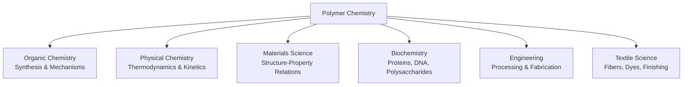
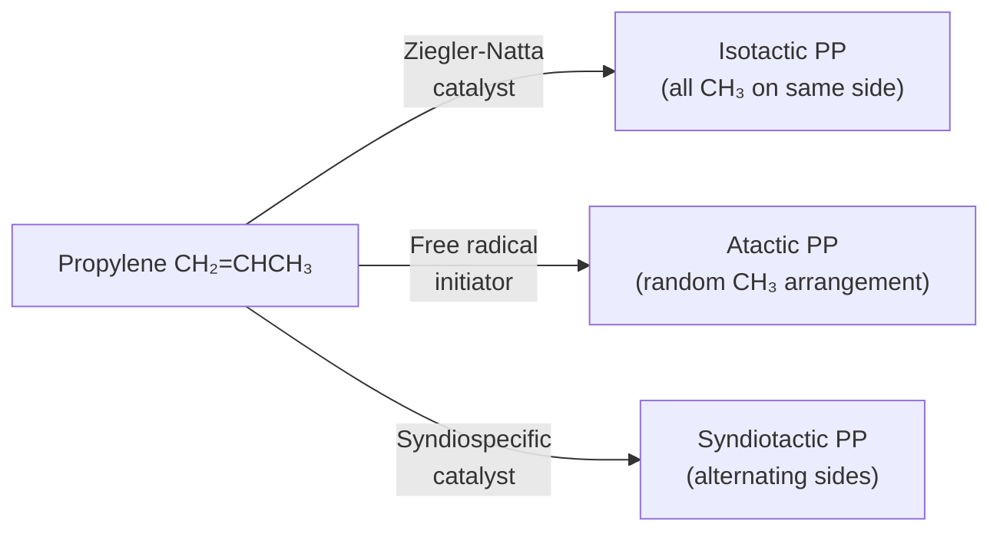
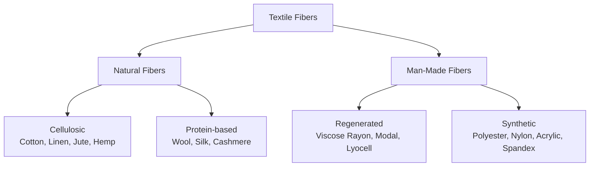

# 01. Introduction and Historical Development of Polymer Chemistry

> **Course:** Polymer and Textile Chemistry
> **Topic:** 01 — Introduction & Historical Development
> **Date:** June 04, 2026
> **Repository:** [butex-notes](https://github.com/itachi-re/butex-notes)

---

## Table of Contents

1. [What is Polymer Chemistry?](#1-what-is-polymer-chemistry)
2. [Scope and Importance](#2-scope-and-importance)
3. [Pre-Modern Era — Natural Polymers in History](#3-pre-modern-era--natural-polymers-in-history)
4. [19th Century Developments](#4-19th-century-developments)
   - [4.1 Vulcanization of Rubber](#41-vulcanization-of-rubber-1839)
   - [4.2 Nitrocellulose and Celluloid](#42-nitrocellulose-and-celluloid-18451869)
   - [4.3 Bakelite — The First Fully Synthetic Plastic](#43-bakelite--the-first-fully-synthetic-plastic-1907)
5. [Staudinger's Macromolecular Theory — The Turning Point](#5-staudingers-macromolecular-theory--the-turning-point)
   - [5.1 The Association Theory (Pre-1920 Error)](#51-the-association-theory-pre-1920-error)
   - [5.2 Staudinger's Hypothesis (1920)](#52-staudingers-hypothesis-1920)
   - [5.3 Viscosity Evidence and the Mark-Houwink Equation](#53-viscosity-evidence-and-the-mark-houwink-equation)
6. [The Golden Age (1930s–1970s)](#6-the-golden-age-1930s1970s)
7. [Modern Developments](#7-modern-developments)
8. [Polymer Chemistry in Textile Science](#8-polymer-chemistry-in-textile-science)
9. [Historical Timeline Summary](#9-historical-timeline-summary)
10. [Practice Problems](#10-practice-problems)
11. [References](#11-references)

---

## 1. What is Polymer Chemistry?

**Polymer chemistry** is the branch of chemistry concerned with the synthesis, structure, characterization, and properties of **polymers** — giant molecules (macromolecules) built by covalently bonding many small repeating units called **monomers**.

The term *polymer* is derived from Greek:

| Root | Greek | Meaning |
|------|-------|---------|
| `poly-` | πολύς | many |
| `-mer` | μέρος | part / unit |

> 📌 **Definition (IUPAC):** A *polymer* is "a substance composed of macromolecules," where a *macromolecule* is "a molecule of high relative molecular mass, the structure of which essentially comprises the multiple repetition of units derived from molecules of low relative molecular mass." — *IUPAC Gold Book*

Polymer chemistry is inherently interdisciplinary:



---

## 2. Scope and Importance

Polymer chemistry governs virtually every aspect of modern life:

| Application Area | Polymer Examples |
|------------------|-----------------|
| **Packaging** | PE, PP, PET, PVC |
| **Textiles & Fibers** | Nylon, Polyester, Acrylic, Spandex |
| **Medical** | PTFE (vascular grafts), PMMA (bone cement), PLA (absorbable sutures) |
| **Electronics** | PDMS (flexible circuits), conducting polymers (OLEDs) |
| **Construction** | Epoxy adhesives, polyurethane foams, PVC pipes |
| **Automotive** | ABS (bumpers), rubber (tires), Kevlar (composites) |
| **Biomedical** | DNA, proteins (natural), PEG (drug delivery), hydrogels |

Global polymer production (2024): **~460 million metric tonnes/year** — exceeding steel and aluminium combined by mass.

---

## 3. Pre-Modern Era — Natural Polymers in History

Long before polymer chemistry was formalized, civilizations exploited natural polymers:

| Natural Polymer | Chemical Identity | Source | Historical Use |
|----------------|-------------------|--------|----------------|
| **Cellulose** | $(C_6H_{10}O_5)_n$ | Plant cell walls | Paper (Egypt ~3000 BCE), textiles (linen, cotton) |
| **Natural Rubber** | *cis*-polyisoprene | *Hevea brasiliensis* latex | Mayan rubber balls (~1600 BCE), waterproofing |
| **Shellac** | Polyester from lac insects | *Kerria lacca* | Varnishes, wood finishing |
| **Silk** | Fibroin protein | Silkworm (*Bombyx mori*) | Textiles (China ~2700 BCE) |
| **Wool/Keratin** | α-helical protein | Sheep fleece | Textiles, insulation |
| **Starch** | Amylose + Amylopectin | Cereals, tubers | Food, adhesives |
| **Gutta-percha** | *trans*-polyisoprene | *Palaquium gutta* | Submarine telegraph cable insulation (1850s) |
| **Amber** | Fossilized polyterpenoid resin | Ancient conifer trees | Jewelry, trade (≥10,000 BCE) |
| **Lignin** | Phenylpropanoid polymer | Wood | Structural support in plants |

> 💡 **Textile Note:** Cotton fibers are ≈90% cellulose. Wool fibers are proteins (keratin). Both are natural polymers that textile engineers process into fabrics — understanding their polymer structure is essential for dyeing, finishing, and performance modification.

In 1736, French explorer **Charles Marie de La Condamine** brought samples of *caoutchouc* (natural rubber) from South America to Europe, sparking the first systematic scientific investigation of a natural polymer.

---

## 4. 19th Century Developments

The 19th century was characterized by empirical *modification* of natural polymers, even before the concept of a macromolecule was established.

### 4.1 Vulcanization of Rubber (1839)

**Discoverer:** Charles Goodyear (USA, 1839); independently Thomas Hancock (UK, 1843)

**The Problem:** Natural rubber (*cis*-1,4-polyisoprene) was temperature-sensitive — sticky and plastic in summer, brittle in winter.

**The Discovery:** Goodyear accidentally found that heating natural rubber with sulfur produced a durable, elastic material. This process is called **vulcanization**.

**Chemical Mechanism:**

Sulfur forms **polysulfide cross-links** (bridges) between polyisoprene chains at the allylic carbon positions:

```
Polyisoprene chain:
              CH₃
              |
  -CH₂- C = CH - CH₂-       (cis-1,4-polyisoprene; n ≈ 5000–20000)

After vulcanization (sulfur cross-linking):

  -CH₂-C(CH₃)-CH-CH₂-
                |
               Sₓ   (x = 1–8 sulfur atoms)
                |
  -CH₂-C(CH₃)-CH-CH₂-
```

**Effect of Sulfur Content:**

| Sulfur Content | Cross-link Density | Product | Use |
|---------------|-------------------|---------|-----|
| 1–3% | Low | Soft rubber | Gloves, balloons |
| 10–20% | Medium | Semi-hard rubber | Tire treads |
| 25–50% | Very High | Hard rubber (ebonite) | Bowling balls, electrical insulators |

**Significance:** Vulcanization was the **first deliberate chemical modification of a natural polymer** to improve its properties — the birth of polymer processing.


*Fig. 1: Hevea brasiliensis — the natural rubber tree. (Wikimedia Commons, Public Domain)*

### 4.2 Nitrocellulose and Celluloid (1845–1869)

**Timeline of semi-synthetic polymers:**

| Year | Discoverer | Material | Significance |
|------|-----------|----------|-------------|
| 1838 | Anselme Payen | Isolated cellulose | First isolation of a natural polymer |
| 1845 | Christian Schönbein | Nitrocellulose (guncotton) | Cellulose treated with HNO₃/H₂SO₄ |
| 1855 | Alexander Parkes | Parkesine | Nitrocellulose + camphor; first man-made plastic |
| 1869 | John Wesley Hyatt | Celluloid | Improved Parkesine; first commercially successful plastic |
| 1884 | Hilaire de Chardonnet | Rayon (Chardonnet silk) | First man-made textile fiber |

**Celluloid Chemistry:**

Cellulose hydroxyl groups ($-OH$) are nitrated:

$$\text{Cell}-OH + HNO_3 \xrightarrow{H_2SO_4} \text{Cell}-O-NO_2 + H_2O$$

Camphor acts as a plasticizer — it inserts between the nitrocellulose chains, reducing intermolecular forces and making the material workable.

**Legacy:** Celluloid was used for:
- Photographic film (by Kodak from 1889)
- Ping-pong balls (still used today!)
- Collar stays, false teeth, hair combs

### 4.3 Bakelite — The First Fully Synthetic Plastic (1907)

**Discoverer:** Leo Hendrik Baekeland (Belgian-American chemist, 1907–1909)

**Reaction:** Phenol + Formaldehyde → Cross-linked Phenol-Formaldehyde Resin

$$n\text{ C}_6\text{H}_5\text{OH} + n\text{ HCHO} \xrightarrow{\Delta, \text{acid/base}} [\text{Phenol-CH}_2\text{-Formaldehyde}]_n + n\text{ H}_2\text{O}$$

**Two-stage process:**

1. **Novolac** (acid-catalyzed, HCHO:phenol < 1): Linear, fusible prepolymer
2. **Resol** (base-catalyzed, HCHO:phenol > 1): Cross-linkable; cures into infusible Bakelite

Bakelite is a **thermoset** — once cured, it cannot be remelted or remolded.

**Properties:** Electrical insulator, heat-resistant, chemically resistant, dimensionally stable.

**Impact:** Called *"the material of a thousand uses"* — telephone handsets, radio casings, electrical insulators, automobile parts. Initiated the age of entirely synthetic materials.

---

## 5. Staudinger's Macromolecular Theory — The Turning Point

### 5.1 The Association Theory (Pre-1920 Error)

Before 1920, the prevailing scientific view held that large-molecular-weight natural products (rubber, cellulose, starch, proteins) were **aggregates** of small organic molecules held together by **secondary forces** — van der Waals, hydrogen bonds, or coordination bonds — similar to colloidal micelles.

Proponents: H. Wieland, K. Freudenberg, C. Harries, R. Pringsheim, H. Karrer

The "small molecule" belief: Rubber was supposedly an aggregate of C₅H₈ (isoprene) units; starch an aggregate of simple sugars.

This view was *completely wrong*, but it was the chemical mainstream for two decades.

### 5.2 Staudinger's Hypothesis (1920)

**Hermann Staudinger** (1881–1965), then Professor at ETH Zürich, published a revolutionary paper in 1920:

> **"Über Polymerisation"** (*On Polymerization*), *Berichte der Deutschen Chemischen Gesellschaft*, 53, 1073 (1920)

His central claim:

> *"High-molecular-weight compounds (rubber, cellulose, proteins) consist of very large molecules in which the atoms are linked by ordinary valence bonds — they are true chemical compounds, not associations."*

In 1922, Staudinger introduced the term **"Makromolekül"** (macromolecule) to describe these long-chain, covalently bonded giant molecules.

**Evidence Staudinger Presented:**

| Evidence | Observation | Implication |
|----------|-------------|-------------|
| Rubber ozonolysis | Produced isoprene units repeatedly | Repeating covalent structure |
| Hydrogenation of rubber | High-MW saturated product (no dissociation) | Covalent bonds, not association |
| Viscosity of polymer solutions | Viscosity increases proportionally with chain length | Large covalent molecules |
| Chemical derivatization | Reactions occur at every repeat unit | Individual covalent molecules |

**Opposition:** Wieland, Pringsheim, and others fiercely challenged Staudinger at conferences throughout the 1920s, calling his macromolecules "foolish" (*albern*). The controversy lasted nearly a decade.

**Resolution:** By the 1930s, evidence from multiple independent methods (ultracentrifuge — Theodor Svedberg; X-ray crystallography — Herman Mark; Carothers' synthetic polymers) confirmed Staudinger's hypothesis.

<details>
<summary>📌 ACS Historic Chemical Landmark</summary>

In 1999, the American Chemical Society designated Staudinger's discovery as an *International Historic Chemical Landmark* at the Hermann Staudinger House, Institute of Macromolecular Chemistry, Freiburg, Germany.
</details>

**Nobel Prize in Chemistry, 1953** — Hermann Staudinger

> *"For his discoveries in the field of macromolecular chemistry."*

### 5.3 Viscosity Evidence and the Mark-Houwink Equation

Staudinger's key experimental tool was **viscometry** — measuring how polymer solutions flow. He found that **solution viscosity increases with molecular weight** in a systematic way.

This was later formalized by Herman Mark, Roelof Houwink, and Sakurada as the **Mark-Houwink-Sakurada (MHS) equation:**

$$\boxed{[\eta] = K \cdot M^a}$$

Where:
- $[\eta]$ = **intrinsic viscosity** (dL/g or mL/g) — the viscosity contribution at infinite dilution
- $M$ = **molecular weight** (g/mol) — viscosity-average $\bar{M}_v$
- $K$ = empirical constant (polymer-solvent-temperature specific)
- $a$ = MHS exponent (indicates chain conformation)

**Physical interpretation of `a`:**

| Value of `a` | Conformation | Solvent quality |
|-------------|-------------|----------------|
| 0 | Rigid sphere | — |
| 0.5 | Random coil | Theta (Θ) solvent |
| 0.5–0.8 | Expanded random coil | Good solvent |
| ~1.8 | Rigid rod | Extended chain |

> For most flexible polymers in good solvents, $a ≈ 0.6–0.8$.

**Derivation of intrinsic viscosity:**

For a solution of relative viscosity $\eta_r = \eta/\eta_0$:

$$\eta_{sp} = \eta_r - 1 \quad (\text{specific viscosity})$$

$$[\eta] = \lim_{c \to 0} \frac{\eta_{sp}}{c}$$

This limit removes concentration effects, isolating the contribution of individual chains.

**Worked Example 1:**

> Polystyrene in toluene at 25°C: $K = 1.2 \times 10^{-4}\ \text{dL/g}$, $a = 0.72$
>
> Measured: $[\eta] = 0.95\ \text{dL/g}$
>
> Find the viscosity-average molecular weight $\bar{M}_v$.

**Solution:**

$$[\eta] = K M^a \implies M = \left(\frac{[\eta]}{K}\right)^{1/a}$$

$$M = \left(\frac{0.95}{1.2 \times 10^{-4}}\right)^{1/0.72}$$

$$M = (7917)^{1.389}$$

$$\log M = 1.389 \times \log(7917) = 1.389 \times 3.8986 = 5.415$$

$$\boxed{\bar{M}_v = 10^{5.415} = 2.6 \times 10^5\ \text{g/mol} = 260\ \text{kDa}}$$

**Worked Example 2:**

> For polyisobutylene in cyclohexane at 30°C: $K = 2.6 \times 10^{-4}$, $a = 0.70$, $[\eta] = 1.40$ dL/g. Find $M$.

$$M = \left(\frac{1.40}{2.6 \times 10^{-4}}\right)^{1/0.70} = (5385)^{1.4286}$$

$$\log M = 1.4286 \times 3.7312 = 5.330$$

$$\boxed{M \approx 2.14 \times 10^5\ \text{g/mol}}$$

---

## 6. The Golden Age (1930s–1970s)

### 6.1 Wallace Hume Carothers and DuPont (1928–1937)

Carothers (Harvard Ph.D.) joined DuPont in 1928 and conducted the first rigorous *theoretical* study of condensation polymerization, publishing the landmark **Carothers equation** (see File 02).

**Key Discoveries:**

| Year | Discovery | Significance |
|------|-----------|-------------|
| 1930 | Neoprene (polychloroprene) | First synthetic rubber |
| 1935 | Nylon-6,6 (polyamide) | First fully synthetic fiber |

**Nylon-6,6 Synthesis:**

$$n\ \text{H}_2\text{N}-(CH_2)_6-\text{NH}_2 + n\ \text{HOOC}-(CH_2)_4-\text{COOH} \xrightarrow{~270°C} [-\text{NH}(CH_2)_6\text{NH}-\text{CO}(CH_2)_4\text{CO}-]_n + 2n\text{H}_2\text{O}$$

Hexamethylenediamine + Adipic acid → **Nylon-6,6** + Water (condensate)

Nylon stockings were commercially introduced in 1940 and were a sensation — selling 64 million pairs in the first year in the USA.

### 6.2 PTFE — Teflon (1938)

**Discoverer:** Roy Plunkett (DuPont, April 6, 1938) — **accidental discovery**

When a cylinder of tetrafluoroethylene (TFE) gas stopped flowing, Plunkett cut it open and found a waxy white solid inside — the cylinder had acted as a polymerization vessel:

$$n\ \text{CF}_2=\text{CF}_2 \xrightarrow{\text{pressure, iron catalyst}} [-\text{CF}_2-\text{CF}_2-]_n$$

Tetrafluoroethylene (TFE) → **Polytetrafluoroethylene (PTFE)** (Teflon®)

**Key Properties:**
- Melting point: 327°C
- Chemical resistance: inert to almost all chemicals
- Lowest coefficient of friction of any solid ($\mu \approx 0.04$)
- Hydrophobic
- Used in: non-stick cookware, biomedical implants, cable insulation, gaskets

### 6.3 Ziegler-Natta Catalysts (1953–1955)

**Karl Ziegler** (Germany) and **Giulio Natta** (Italy) independently developed **coordination catalysts** for controlled polymerization:

**Ziegler catalyst system:** $\text{TiCl}_4 + \text{Al(C}_2\text{H}_5)_3$ (titanium tetrachloride + triethylaluminum)

**Breakthrough capabilities:**
1. Polymerization of ethylene at **low pressure** (1–10 atm) vs. 2000 atm for LDPE
2. Production of **high-density polyethylene (HDPE)** — stronger, denser, linear
3. Synthesis of **isotactic polypropylene (iPP)** — stereoregular, semi-crystalline, high-melting

**Nobel Prize in Chemistry, 1963** — Ziegler and Natta



### 6.4 Other Major Discoveries

| Year | Invention | Inventors / Company | Significance |
|------|-----------|---------------------|-------------|
| 1933 | LDPE (high pressure) | Gibson & Fawcett, ICI | First commodity polyolefin |
| 1937 | Polyurethane | Otto Bayer, IG Farben | Foams, elastomers, coatings |
| 1941 | PET polyester | Whinfield & Dickson, ICI | Textile fibers (Terylene/Dacron), bottles |
| 1953 | Polycarbonate | Schnell (Bayer), Fox (GE) | Engineering thermoplastic, optical clarity |
| 1956 | Living anionic polymerization | Michael Szwarc | Precise MW control, block copolymers |
| 1958 | Spandex/Lycra | Joseph Shivers, DuPont | Stretch textiles |
| 1965 | Kevlar (PPTA) | Stephanie Kwolek, DuPont | High-strength fiber, 5× stronger than steel by weight |
| 1971 | Kevlar commercialized | DuPont | Bulletproof vests, aerospace composites |
| 1974 | Nobel Prize | Paul J. Flory | Fundamental polymer thermodynamics |

---

## 7. Modern Developments

### 7.1 Controlled / "Living" Radical Polymerization

Building on Szwarc's living anionic polymerization (1956), modern controlled polymerization techniques allow:
- Precise molecular weight control ($PDI \approx 1.0–1.2$)
- Complex architectures (block, star, gradient copolymers)
- Functional end groups

| Method | Full Name | Key Inventors | Year |
|--------|-----------|--------------|------|
| **NMP** | Nitroxide-Mediated Polymerization | Georges et al. | 1993 |
| **ATRP** | Atom Transfer Radical Polymerization | Matyjaszewski, Wang | 1995 |
| **RAFT** | Reversible Addition-Fragmentation chain Transfer | Moad, Rizzardo et al. (CSIRO) | 1998 |

**ATRP mechanism overview:**

$$\text{P}_n\text{-X} + \text{Cu}^I \rightleftharpoons \text{P}_n^\bullet + \text{Cu}^{II}\text{X}$$

Equilibrium strongly favors dormant species → living character with low PDI.

### 7.2 Conducting Polymers — Nobel Prize 2000

**Alan Heeger, Alan MacDiarmid, Hideki Shirakawa** discovered that the conjugated polymer **polyacetylene** could conduct electricity when chemically "doped":

$$(-CH=CH-)_n + \frac{3n}{2}I_2 \rightarrow (-CH=CH-)_n^{3n+} \cdot 3nI^-$$

Conductivity jumps from $10^{-9}$ S/cm (insulator) to $10^5$ S/cm (near metallic) upon doping.

**Applications:** OLEDs, organic solar cells, antistatic coatings, electrochromic windows.

### 7.3 Dendrimers and Hyperbranched Polymers

Perfectly branched, monodisperse macromolecules:

- **Vögtle** — first cascade synthesis (1978)
- **Tomalia** — Starburst® PAMAM dendrimer (1985)
- Precise MW control, functional surface groups
- Drug delivery, imaging agents, catalysis

### 7.4 Sustainable and Bio-based Polymers

| Polymer | Source | Application |
|---------|--------|-------------|
| **PLA** (Polylactic acid) | Corn starch, sugarcane | Packaging, biomedical |
| **PHA** (Polyhydroxyalkanoate) | Bacterial fermentation | Biodegradable packaging |
| **Bio-PET** | Bio-ethylene glycol (from sugarcane) | Bottles (Coca-Cola PlantBottle™) |
| **Cellulose nanocrystals (CNC)** | Wood pulp | Nanocomposites, coatings |
| **Lignin-based polymers** | Wood delignification | Phenolic resins, carbon fiber |

---

## 8. Polymer Chemistry in Textile Science

The textile industry is one of the largest consumers and producers of polymers globally. Every fiber — natural or synthetic — is a polymer.



| Fiber | Polymer | Chemical Type | Key Textile Property |
|-------|---------|--------------|---------------------|
| Cotton | Cellulose | Natural polysaccharide | Moisture absorption, comfort |
| Wool | α-Keratin | Natural protein | Crimp, felting, warmth |
| Silk | Fibroin + Sericin | Natural protein | Luster, smoothness |
| Viscose Rayon | Regenerated cellulose | Semi-synthetic | Drape, softness |
| **Nylon-6,6** | Poly(hexamethylene adipamide) | Synthetic polyamide | High tenacity, abrasion resistance |
| **Polyester (PET)** | Poly(ethylene terephthalate) | Synthetic polyester | Dimensional stability, wrinkle resistance |
| **Acrylic** | Polyacrylonitrile (PAN) | Synthetic vinyl | Wool-like, lightweight |
| **Spandex (Lycra)** | Polyurethane-urea | Synthetic segmented | >600% elongation |

Understanding polymer chain structure directly determines:
- **Tenacity:** chain length, intermolecular forces
- **Moisture regain:** hydrophilic groups ($-OH$, $-NH$, $-COOH$)
- **Dyeability:** accessible sites (amide groups for acid dyes, etc.)
- **Thermal behavior:** $T_g$ (glass transition), $T_m$ (melting point)
- **Chemical resistance:** polymer backbone stability

---

## 9. Historical Timeline Summary

| Period | Key Development | Significance |
|--------|----------------|-------------|
| **Pre-history – 1800** | Natural polymers used empirically | No scientific understanding |
| **1736** | de la Condamine documents rubber | First European scientific attention |
| **1839** | Goodyear — Vulcanization | First intentional polymer modification |
| **1845–1869** | Nitrocellulose, Parkesine, Celluloid | First semi-synthetic polymers |
| **1884** | Chardonnet Rayon | First synthetic textile fiber |
| **1907** | Baekeland — Bakelite | First fully synthetic plastic |
| **1920** | Staudinger — Macromolecular Hypothesis | Birth of polymer science |
| **1922** | Staudinger coins "Makromolekül" | Scientific terminology established |
| **1928–1937** | Carothers — Nylon, Neoprene | Condensation polymer theory |
| **1938** | Plunkett — PTFE (Teflon) | Fluoropolymer era |
| **1950–1955** | Ziegler-Natta catalysts | Stereoregular polyolefins |
| **1953** | Staudinger Nobel Prize | Recognition of polymer science |
| **1956** | Szwarc — Living anionic polymerization | Controlled MW and architecture |
| **1963** | Ziegler & Natta Nobel Prize | Catalysis for stereoregular polymers |
| **1965** | Kwolek — Kevlar | Ultra-high performance fiber |
| **1974** | Flory Nobel Prize | Polymer thermodynamics |
| **1993–1998** | NMP, ATRP, RAFT | Controlled radical polymerization |
| **2000** | Heeger, MacDiarmid, Shirakawa Nobel | Conducting polymers |
| **2010s–present** | Bio-based, recyclable, self-healing polymers | Sustainable polymer science |

---

## 10. Practice Problems

<details>
<summary>📝 Q1: What was the fundamental flaw in the association theory of polymers?</summary>

**Answer:** The association theory incorrectly proposed that large molecules like rubber and cellulose were aggregates of *small* molecules held together by secondary forces (van der Waals, hydrogen bonds) — similar to colloidal micelles. The fundamental flaw was that it failed to recognize the existence of covalent bonds extending throughout the entire macromolecular chain. Staudinger demonstrated that: (1) rubber hydrogenation does not break up the molecule into small units, (2) the viscosity of polymer solutions scales with chain length in a way consistent only with large covalent molecules, and (3) chemical derivatization of every repeat unit is consistent with a single large molecule rather than an aggregate.
</details>

<details>
<summary>📝 Q2: Calculate the viscosity-average molecular weight of a polyamide sample in formic acid at 25°C if [η] = 0.680 dL/g. Given K = 5.5 × 10⁻⁴ dL/g, a = 0.71.</summary>

**Solution:**

Using the Mark-Houwink-Sakurada equation:
$$[\eta] = K M^a$$
$$0.680 = 5.5 \times 10^{-4} \cdot M^{0.71}$$
$$M^{0.71} = \frac{0.680}{5.5 \times 10^{-4}} = 1236.4$$

Taking logarithm:
$$0.71 \cdot \log M = \log(1236.4) = 3.0922$$
$$\log M = \frac{3.0922}{0.71} = 4.355$$
$$M = 10^{4.355} = 2.27 \times 10^4 \text{ g/mol}$$

∴ $\bar{M}_v \approx$ **22,700 g/mol (22.7 kDa)**.
</details>

<details>
<summary>📝 Q3: Why did the commercial introduction of nylon stockings in 1940 cause a social phenomenon, and what does this tell us about polymer science's impact?</summary>

**Answer:** Before nylon, silk stockings were expensive luxury items. Nylon-6,6 offered comparable silk-like appearance and feel at a fraction of the cost, produced from simple petroleum-derived chemicals (adipic acid, hexamethylenediamine). In 1940, 64 million pairs were sold within months of launch. This demonstrates how polymer chemistry can *democratize* materials previously accessible only to the wealthy. More broadly, it shows that understanding and controlling polymer structure (chain regularity, degree of polymerization, intermolecular hydrogen bonding) directly determines material performance in real-world applications. Carothers' theoretical framework allowed rational *design* of the polyamide backbone for specific fiber properties.
</details>

<details>
<summary>📝 Q4: What is the difference between vulcanization and cross-linking in general? Give one example of each.</summary>

**Answer:**
- **Vulcanization** is a specific type of cross-linking using *sulfur* (or sulfur-containing compounds) to form polysulfide bridges between unsaturated polymer chains (typically rubber). Example: Natural rubber + sulfur → vulcanized rubber (tires).
- **Cross-linking (general)** refers to any process that forms covalent bonds *between* separate polymer chains, creating a network structure. The cross-linking agent can be: peroxides (for HDPE), radiation (γ-ray or e-beam for LDPE), multifunctional monomers (divinylbenzene in polystyrene), or formaldehyde (in phenol-formaldehyde resin/Bakelite). Example: Epoxy resin cured with diamine hardener — the amine groups react with epoxide rings to form a cross-linked network.
</details>

---

## 11. References

1. **Staudinger, H.** (1920). Über Polymerisation. *Berichte der Deutschen Chemischen Gesellschaft*, 53(6), 1073–1085.
2. **Staudinger, H.** (1922). Über die Konstitution des Kautschuks. *Berichte der Deutschen Chemischen Gesellschaft*, 55, 1382–1389. [Coined "Makromolekül"]
3. **Carothers, W. H.** (1929). An Introduction to the General Theory of Condensation Polymers. *Journal of the American Chemical Society*, 51(8), 2548–2559.
4. **Flory, P. J.** (1953). *Principles of Polymer Chemistry*. Cornell University Press. *(Classic reference)*
5. **Odian, G.** (2004). *Principles of Polymerization* (4th ed.). Wiley-Interscience. ISBN: 978-0-471-27400-1.
6. **Elias, H.-G.** (2008). *Macromolecules: Volume 1 — Chemical Structures and Syntheses* (2nd ed.). Wiley-VCH.
7. **Mülhaupt, R.** (2004). Hermann Staudinger and the Origin of Macromolecular Chemistry. *Angewandte Chemie International Edition*, 43(9), 1054–1063. https://doi.org/10.1002/anie.200330070
8. **ACS Historic Chemical Landmarks** — Foundation of Polymer Science by Staudinger: https://www.acs.org/education/whatischemistry/landmarks/staudingerpolymerscience.html
9. **Nobel Prize — Staudinger (1953):** https://www.nobelprize.org/prizes/chemistry/1953/staudinger/lecture/
10. **Nobel Prize — Ziegler & Natta (1963):** https://www.nobelprize.org/prizes/chemistry/1963/summary/
11. **Nobel Prize — Conducting Polymers (2000):** https://www.nobelprize.org/prizes/chemistry/2000/press-release/
12. **IUPAC Gold Book — Macromolecule:** https://goldbook.iupac.org/terms/view/M03667
13. **LibreTexts — Introduction to Polymers:** https://chem.libretexts.org/Bookshelves/Organic_Chemistry/Map%3A_Organic_Chemistry_(Wade)/25%3A_Polymers
14. **Science History Institute — Hermann Staudinger:** https://www.sciencehistory.org/education/scientific-biographies/hermann-staudinger/
15. **ACS Macromolecules Editorial (2020):** https://pubs.acs.org/doi/10.1021/acs.macromol.9b02714
16. **Mark-Houwink Parameters Database:** https://polymer.nist.gov/

---

*Last updated: June 04, 2026 | Course: Polymer Chemistry | [butex-notes](https://github.com/itachi-re/butex-notes)*
