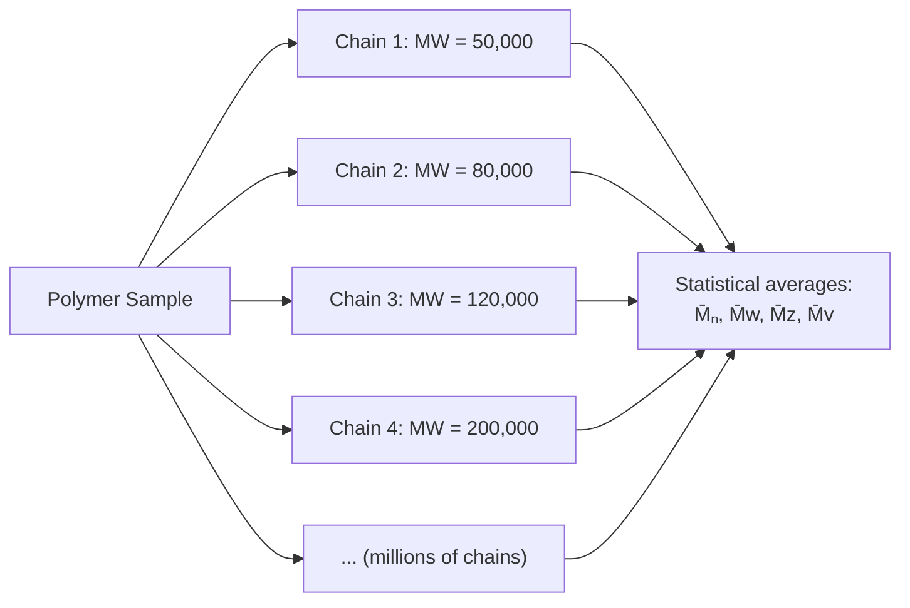
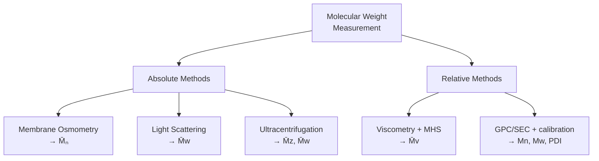

# 02. Basic Concepts of Polymer Science — Terms, Definitions, and Scope

> **Course:** Polymer and Textile Chemistry
> **Topic:** 02 — Basic Concepts (Terms, Definitions, Scope)
> **Date:** June 04, 2026
> **Repository:** [butex-notes](https://github.com/itachi-re/butex-notes)

---

## Table of Contents

1. [Fundamental Definitions](#1-fundamental-definitions)
   - [1.1 Monomer](#11-monomer)
   - [1.2 Polymer / Macromolecule](#12-polymer--macromolecule)
   - [1.3 Oligomer](#13-oligomer)
   - [1.4 Repeat Unit (Mer)](#14-repeat-unit-mer)
   - [1.5 End Groups](#15-end-groups)
2. [Degree of Polymerization (DP)](#2-degree-of-polymerization-dp)
3. [Molecular Weight of Polymers](#3-molecular-weight-of-polymers)
   - [3.1 Why Molecular Weight Matters](#31-why-molecular-weight-matters)
   - [3.2 Number-Average Molecular Weight (M̄ₙ)](#32-number-average-molecular-weight-m̄ₙ)
   - [3.3 Weight-Average Molecular Weight (M̄w)](#33-weight-average-molecular-weight-m̄w)
   - [3.4 Z-Average and Viscosity-Average Molecular Weight](#34-z-average-and-viscosity-average-molecular-weight)
   - [3.5 Polydispersity Index (PDI) and Dispersity (Đ)](#35-polydispersity-index-pdi-and-dispersity-đ)
   - [3.6 Most Probable Distribution](#36-most-probable-distribution)
4. [Functionality](#4-functionality)
   - [4.1 The Carothers Equation](#41-the-carothers-equation)
   - [4.2 Gel Point — Critical Functionality](#42-gel-point--critical-functionality)
5. [Polymerization Reaction Types](#5-polymerization-reaction-types)
   - [5.1 Addition (Chain-Growth) Polymerization](#51-addition-chain-growth-polymerization)
   - [5.2 Condensation (Step-Growth) Polymerization](#52-condensation-step-growth-polymerization)
   - [5.3 Comparison Table](#53-comparison-table)
6. [Configuration and Conformation](#6-configuration-and-conformation)
7. [Scope of Polymer Science](#7-scope-of-polymer-science)
8. [Key Terms Glossary](#8-key-terms-glossary)
9. [Practice Problems](#9-practice-problems)
10. [References](#10-references)

---

## 1. Fundamental Definitions

### 1.1 Monomer

> **Monomer** (from Greek *mono* = one, *meros* = part): A small, low-molecular-weight molecule capable of reacting with other monomers (same or different) to form a polymer through covalent bond formation.

**Requirements for a monomer:**
- Must have **at least two reactive functional groups** OR contain a **π-bond** (double/triple bond) that can open
- Functionality ($f$) ≥ 2

**Examples:**

| Monomer | Structure | Polymer Formed |
|---------|-----------|---------------|
| Ethylene | $\text{CH}_2=\text{CH}_2$ | Polyethylene (PE) |
| Styrene | $\text{CH}_2=\text{CH}-C_6H_5$ | Polystyrene (PS) |
| Vinyl chloride | $\text{CH}_2=\text{CHCl}$ | PVC |
| ε-Caprolactam | Cyclic amide ($C_6H_{11}NO$) | Nylon-6 |
| Ethylene glycol | $\text{HO}-CH_2CH_2-\text{OH}$ | PET (with terephthalic acid) |
| Adipic acid | $\text{HOOC}-(CH_2)_4-\text{COOH}$ | Nylon-6,6 (with hexamethylenediamine) |
| Hexamethylenediamine | $\text{H}_2\text{N}-(CH_2)_6-\text{NH}_2$ | Nylon-6,6 |

### 1.2 Polymer / Macromolecule

> **Polymer** (IUPAC): "A substance composed of macromolecules." A **macromolecule** is "a molecule of high relative molecular mass, the structure of which essentially comprises the multiple repetition of units derived from molecules of low relative molecular mass."

In practice, a polymer typically has:
- Molecular weight $\bar{M} > 10{,}000$ g/mol
- Degree of polymerization $\bar{X}_n > 100$

The molecular weight range of polymers compared to small molecules:

```
Low MW molecules:  100 – 1,000 g/mol   (sugars, amino acids, solvents)
Oligomers:       1,000 – 10,000 g/mol  (dimers, trimers, resins)
Polymers:       10,000 – 10⁷  g/mol   (plastics, fibers, rubber)
Biopolymers:    10⁴  – 10⁹   g/mol   (DNA, proteins, cellulose)
```

### 1.3 Oligomer

> **Oligomer** (from Greek *oligos* = few): A molecule intermediate in size between a monomer and a polymer, typically consisting of 2–100 repeat units.

Examples:
- **Dimer** (2 units), **Trimer** (3 units), **Tetramer** (4 units)
- PEG-400 (polyethylene glycol, MW ≈ 400) is technically an oligomer
- Epoxy prepolymers (DGEBA-based)

Oligomers lack the high-MW bulk properties of true polymers — they may be liquids or low-melting solids.

### 1.4 Repeat Unit (Mer)

> **Repeat unit (structural unit, mer):** The smallest constitutional repeating unit (CRU) in the polymer chain. The polymer is represented as $n$ repeat units.

The polymer chain is written as:

$$\text{Polymer} = [-M-]_n$$

where $M$ is the repeat unit and $n$ is the degree of polymerization.

**Examples:**

| Polymer | Monomer | Repeat Unit | Note |
|---------|---------|-------------|------|
| Polyethylene | $\text{CH}_2=\text{CH}_2$ | $-\text{CH}_2\text{CH}_2-$ | Identical to monomer (addition) |
| Nylon-6,6 | HMD + AA | $-\text{NH}(CH_2)_6\text{NH-CO}(CH_2)_4\text{CO}-$ | Two monomers → one repeat unit |
| PET | EG + TPA | $-\text{O}CH_2CH_2\text{O-CO-}C_6H_4\text{-CO}-$ | Two monomers → one repeat unit |
| Polypropylene | $\text{CH}_2=\text{CHCH}_3$ | $-\text{CH}_2\text{CH(CH}_3)-$ | |

> 🔑 **Key distinction:** In **addition polymers**, the repeat unit has the same molecular formula as the monomer (no atoms lost). In **condensation polymers**, a small molecule (usually $H_2O$) is lost, so the repeat unit ≠ monomer formula.

### 1.5 End Groups

The terminal units at each end of a polymer chain. For a chain-end analysis:

$$\text{End group} = \frac{1}{\bar{X}_n} \times 100\%$$

End groups can be:
- Initiator fragments (in radical polymerization)
- Functional groups (–OH, –COOH, –NH₂) used for further chemistry
- Used to determine molecular weight via **end-group analysis** (NMR, titration)

**End-group molecular weight calculation:**

If total repeat-unit moles = $N$, and each chain has 2 end groups, then:

$$\bar{M}_n = \frac{W_{\text{polymer}}}{\text{moles of end groups}/2} = \bar{X}_n \cdot M_0 + M_{EG}$$

where $M_0$ = repeat unit MW, $M_{EG}$ = end group MW.

---

## 2. Degree of Polymerization (DP)

> **Degree of Polymerization ($\bar{X}_n$):** The number of repeat units in an average polymer chain.

$$\boxed{\bar{X}_n = \frac{\bar{M}_n}{M_0}}$$

Where:
- $\bar{M}_n$ = number-average molecular weight (g/mol)
- $M_0$ = molecular weight of one repeat unit (g/mol)

**Example Calculations:**

> **Example 1:** A polyethylene sample has $\bar{M}_n = 140{,}000$ g/mol. Repeat unit: $-CH_2CH_2-$, $M_0 = 28$ g/mol.

$$\bar{X}_n = \frac{140{,}000}{28} = 5{,}000$$

This chain contains 5,000 ethylene repeat units (≈10,000 carbon atoms), with a fully extended length of about **1.3 μm** (1,300 nm) — yet the cross-section is only ~0.5 nm wide.

> **Example 2:** Nylon-6,6 fiber has $\bar{M}_n = 20{,}000$ g/mol. Repeat unit MW = 226.32 g/mol.

$$\bar{X}_n = \frac{20{,}000}{226.32} \approx 88$$

So approximately 88 repeat units (176 monomer molecules combined).

> **Example 3:** Calculate the MW of a polypropylene chain with $\bar{X}_n = 2500$.
> $M_0(\text{PP}) = 42$ g/mol.

$$\bar{M}_n = \bar{X}_n \times M_0 = 2500 \times 42 = 105{,}000 \text{ g/mol}$$

---

## 3. Molecular Weight of Polymers

### 3.1 Why Molecular Weight Matters

Unlike small molecules (exact MW), polymers are **polydisperse** — a sample contains chains of *varying* lengths. This necessitates statistical *averages*:



**Properties governed by molecular weight:**

| Property | Most relevant MW average |
|----------|------------------------|
| Tensile strength | $\bar{M}_n$, $\bar{M}_w$ |
| Melt viscosity | $\bar{M}_w$ (very sensitive!) |
| Dilute solution behavior | $\bar{M}_v$ |
| Sedimentation | $\bar{M}_z$ |
| Number of chains (osmometry) | $\bar{M}_n$ |

### 3.2 Number-Average Molecular Weight (M̄ₙ)

Defined as the total mass divided by the total number of molecules:

$$\boxed{\bar{M}_n = \frac{\sum_i N_i M_i}{\sum_i N_i} = \sum_i x_i M_i}$$

Where:
- $N_i$ = number of chains with molecular weight $M_i$
- $x_i = N_i / \sum N_i$ = mole fraction of species $i$

**Measurement methods:** Membrane osmometry, end-group analysis, cryoscopy (freezing point depression), ebulliometry

$\bar{M}_n$ is sensitive to **low-MW species** (many small chains count heavily in number).

**Worked Example:**

A polymer sample contains:

| Species | $N_i$ (chains) | $M_i$ (g/mol) |
|---------|----------------|----------------|
| A | 200 | 10,000 |
| B | 150 | 50,000 |
| C | 50 | 100,000 |

$$\sum N_i = 400 \text{ chains}$$

$$\bar{M}_n = \frac{200 \times 10{,}000 + 150 \times 50{,}000 + 50 \times 100{,}000}{400}$$

$$= \frac{2{,}000{,}000 + 7{,}500{,}000 + 5{,}000{,}000}{400} = \frac{14{,}500{,}000}{400}$$

$$\boxed{\bar{M}_n = 36{,}250 \text{ g/mol}}$$

### 3.3 Weight-Average Molecular Weight (M̄w)

Defined using mass fractions — heavier chains contribute proportionally more:

$$\boxed{\bar{M}_w = \frac{\sum_i N_i M_i^2}{\sum_i N_i M_i} = \frac{\sum_i w_i M_i}{\sum_i w_i} = \sum_i W_i M_i}$$

Where $W_i = N_i M_i / \sum_j N_j M_j$ = weight fraction of species $i$.

**Measurement methods:** Light scattering (static), ultracentrifugation

$\bar{M}_w$ is sensitive to **high-MW species** (heavy chains dominate by mass).

**Continuing Worked Example:**

$$\bar{M}_w = \frac{200 \times (10{,}000)^2 + 150 \times (50{,}000)^2 + 50 \times (100{,}000)^2}{200 \times 10{,}000 + 150 \times 50{,}000 + 50 \times 100{,}000}$$

Numerator: $= 200 \times 10^8 + 150 \times 25 \times 10^8 + 50 \times 100 \times 10^8$
$= 10^8(200 + 3750 + 5000) = 8950 \times 10^8$

Denominator: $= 14{,}500{,}000 = 1.45 \times 10^7$

$$\bar{M}_w = \frac{8950 \times 10^8}{1.45 \times 10^7} = \frac{8.95 \times 10^{11}}{1.45 \times 10^7}$$

$$\boxed{\bar{M}_w = 61{,}724 \text{ g/mol} \approx 61{,}700 \text{ g/mol}}$$

> Note: $\bar{M}_w > \bar{M}_n$ always (unless perfectly monodisperse).

### 3.4 Z-Average and Viscosity-Average Molecular Weight

**Z-average** (measured by ultracentrifugation):

$$\bar{M}_z = \frac{\sum_i N_i M_i^3}{\sum_i N_i M_i^2}$$

Extremely sensitive to very high-MW chains. Important for melt flow behavior.

**Viscosity-average** (measured by viscometry with MHS equation):

$$\bar{M}_v = \left(\frac{\sum_i N_i M_i^{1+a}}{\sum_i N_i M_i}\right)^{1/a}$$

where $a$ is the MHS exponent. For $a = 1$: $\bar{M}_v = \bar{M}_w$. For most systems: $\bar{M}_n < \bar{M}_v < \bar{M}_w$.

**Hierarchy of molecular weight averages:**

$$\boxed{\bar{M}_n \leq \bar{M}_v \leq \bar{M}_w \leq \bar{M}_z}$$

Equality holds only for perfectly **monodisperse** polymers (all chains same length, PDI = 1).

### 3.5 Polydispersity Index (PDI) and Dispersity (Đ)

$$\boxed{PDI = Đ = \frac{\bar{M}_w}{\bar{M}_n} \geq 1}$$

Đ (dispersity) is the modern IUPAC notation (replacing PDI).

**Interpretation:**

| Đ Value | System |
|---------|--------|
| 1.0 | Perfectly monodisperse (impossible in practice) |
| 1.01–1.10 | Living/controlled polymerization (RAFT, ATRP, anionic) |
| 1.5–2.0 | Free-radical polymerization (most probable distribution) |
| 2.0 | Condensation polymerization at high conversion |
| > 2.0 | Branched polymers, broad distribution |

**Continuing Worked Example:**

$$PDI = \frac{\bar{M}_w}{\bar{M}_n} = \frac{61{,}724}{36{,}250} = \boxed{1.70}$$

This is a moderately broad distribution, consistent with a free-radical polymerization.

**Measurement of molecular weight:**



### 3.6 Most Probable Distribution

For a **condensation polymer** at high conversion $p$, the Flory (most probable) distribution gives:

**Number fraction:**
$$x(n) = (1-p)^2 \cdot p^{n-1}$$

**Weight fraction:**
$$w(n) = n(1-p)^2 \cdot p^{n-1}$$

This distribution leads to:
$$\bar{M}_n = \frac{M_0}{1-p} \quad ; \quad \bar{M}_w = \frac{M_0(1+p)}{1-p}$$

$$PDI = \frac{\bar{M}_w}{\bar{M}_n} = 1 + p \xrightarrow{p \to 1} 2$$

**Proof:**

$$\bar{M}_n = M_0 \cdot \bar{X}_n = M_0 \cdot \frac{1}{1-p} \quad (\text{Carothers equation})$$

$$\bar{M}_w = M_0 \sum_n n \cdot w(n) = M_0 \sum_n n^2(1-p)^2 p^{n-1}$$

Using the identity $\sum_{n=1}^\infty n^2 r^{n-1} = \frac{1+r}{(1-r)^3}$ for $|r| < 1$:

$$\bar{X}_w = \sum_n n^2(1-p)^2 p^{n-1} = (1-p)^2 \cdot \frac{1+p}{(1-p)^3} = \frac{1+p}{1-p}$$

$$\therefore PDI = \frac{\bar{X}_w}{\bar{X}_n} = \frac{(1+p)/(1-p)}{1/(1-p)} = 1 + p$$

As $p \to 1$: $PDI \to 2$.

---

## 4. Functionality

> **Functionality ($f$):** The number of reactive groups (or reactive sites) per monomer molecule that can participate in polymerization.

| Functionality | Polymer structure | Example |
|--------------|-------------------|---------|
| $f = 1$ | No polymer (chain terminator) | Acetic acid (CH₃COOH) |
| $f = 2$ | Linear polymer | Adipic acid, HMD, ethylene glycol |
| $f = 3$ | Branched/cross-linked network | Glycerol, trimethylolpropane |
| $f = 4$ | Highly cross-linked network | Pentaerythritol, TETA |

**Average functionality** in a mixture:

$$\bar{f} = \frac{\sum_i N_i f_i}{\sum_i N_i}$$

**Example:** A mixture of 0.6 mol ethylene glycol ($f=2$) and 0.4 mol glycerol ($f=3$):

$$\bar{f} = \frac{0.6 \times 2 + 0.4 \times 3}{0.6 + 0.4} = \frac{1.2 + 1.2}{1.0} = 2.4$$

### 4.1 The Carothers Equation

Carothers (1936) derived the relationship between **degree of polymerization** and **extent of reaction** ($p$).

**Derivation:**

Let:
- $N_0$ = initial number of monomer molecules
- $N$ = number of molecules remaining after reaction
- $p$ = extent of reaction = fraction of functional groups reacted

The number of bonds formed = $N_0 - N$ (each bond formed reduces molecule count by 1):

$$p = \frac{N_0 - N}{N_0} \implies N = N_0(1-p)$$

Number-average degree of polymerization:

$$\bar{X}_n = \frac{N_0}{N} = \frac{N_0}{N_0(1-p)}$$

$$\boxed{\bar{X}_n = \frac{1}{1-p}}$$

This is the **Carothers equation** (for linear condensation polymers with stoichiometrically balanced functional groups).

**Critical Implications:**

| $p$ (Conversion) | $\bar{X}_n$ | Comment |
|:---:|:---:|---|
| 0.50 | 2 | Dimer! Barely polymerized |
| 0.90 | 10 | Oligomer range |
| 0.99 | 100 | Low polymer |
| 0.999 | 1,000 | Engineering polymer |
| 0.9999 | 10,000 | High performance fiber |

> ⚠️ **Key Insight:** Condensation polymerization requires **>99% conversion** ($p > 0.99$) to achieve useful polymer molecular weights. This is why condensation polymers are difficult to make — you must remove the condensate (water) to drive the reaction to completion (Le Chatelier's principle).

**Extended Carothers equation** (for multifunctional systems):

$$\bar{X}_n = \frac{2}{2 - p\bar{f}}$$

**Proof:**

For a mixture with average functionality $\bar{f}$:
- Total functional groups initially = $N_0 \bar{f}$
- Groups reacted = $p \cdot N_0 \bar{f}$
- Bonds formed = $\frac{p \cdot N_0 \bar{f}}{2}$ (each bond uses 2 groups)
- Molecules remaining: $N = N_0 - \frac{p N_0 \bar{f}}{2} = N_0\left(1 - \frac{p\bar{f}}{2}\right)$

$$\bar{X}_n = \frac{N_0}{N} = \frac{1}{1 - \frac{p\bar{f}}{2}} = \frac{2}{2 - p\bar{f}}$$

For $\bar{f} = 2$: reduces to $\bar{X}_n = \frac{1}{1-p}$ ✓

### 4.2 Gel Point — Critical Functionality

When $\bar{X}_n \to \infty$, the polymer network spans the entire sample — this is the **gel point** ($p_c$):

$$\bar{X}_n \to \infty \implies 2 - p_c\bar{f} = 0 \implies \boxed{p_c = \frac{2}{\bar{f}}}$$

**Example (Gel Point Calculation):**

A polymerization uses 0.50 mol phthalic acid ($f=2$), 0.25 mol glycerol ($f=3$), and 0.25 mol ethylene glycol ($f=2$):

$$\bar{f} = \frac{0.50 \times 2 + 0.25 \times 3 + 0.25 \times 2}{1.00} = \frac{1.00 + 0.75 + 0.50}{1.00} = 2.25$$

$$p_c = \frac{2}{2.25} = \boxed{0.889 = 88.9\%}$$

Gelation (infinite network formation) occurs at 88.9% conversion. Beyond this, the material is a gel/thermoset.

---

## 5. Polymerization Reaction Types

### 5.1 Addition (Chain-Growth) Polymerization

Monomers containing **double or triple bonds** (or strained rings) polymerize by sequential addition, with no by-product expelled.

**General mechanism:**

$$\text{Initiator} \rightarrow \text{Active center} (I^\bullet)$$
$$I^\bullet + M \rightarrow IM^\bullet \quad (\text{Initiation})$$
$$IM^\bullet + M \rightarrow IM_2^\bullet \quad (\text{Propagation})$$
$$\vdots$$
$$IM_n^\bullet + IM_m^\bullet \rightarrow IM_{n+m}I \quad (\text{Termination: coupling})$$

**Active center types:**
- **Free radical** (most common): peroxide or azo initiators
- **Cationic:** Lewis acid catalysts (BF₃, AlCl₃)
- **Anionic:** organolithium, Grignard reagents
- **Coordination:** Ziegler-Natta, metallocene

**Key features:**
- Monomer consumed throughout — MW builds quickly
- High MW achieved at low conversions
- Dead (terminated) chains accumulate throughout

**Rate of polymerization** (free-radical):

$$R_p = k_p \cdot [M] \cdot [M^\bullet] = k_p \sqrt{\frac{R_i}{2k_t}} \cdot [M]$$

where $R_i$ = initiation rate, $k_p$ = propagation rate constant, $k_t$ = termination rate constant.

**Kinetic chain length** $\bar\nu$ (average monomer units added per active center):

$$\bar\nu = \frac{R_p}{R_i} = \frac{k_p[M]}{\sqrt{2k_t R_i}}$$

**Example — Polymerization of Styrene:**

$$n\ \text{CH}_2=\text{CH}(C_6H_5) \xrightarrow{\text{AIBN, 60°C}} [-\text{CH}_2\text{-CH}(C_6H_5)-]_n$$

Styrene → Polystyrene (PS)

### 5.2 Condensation (Step-Growth) Polymerization

Monomers react through **bifunctional groups** (–OH, –COOH, –NH₂, –NCO, etc.), each reaction forming a small by-product molecule.

**General reaction:**

$$A-B + A-B \rightarrow A-B-A-B + \text{(by-product)}$$

or for two different monomers ($AA + BB$ type):

$$HO-R_1-OH + HOOC-R_2-COOH \rightarrow HO-R_1-OOC-R_2-COO...+ nH_2O$$

**Key condensation reactions:**

| Functional Groups | Linkage Formed | Example Polymer |
|----------------|----------------|----------------|
| –OH + –COOH | Ester (–COO–) | Polyesters (PET) |
| –NH₂ + –COOH | Amide (–CONH–) | Polyamides (Nylon) |
| –OH + –NCO | Urethane (–OCONH–) | Polyurethane |
| –OH + –OH (via HCl) | Carbonate (–OCOO–) | Polycarbonate |
| Phenol + Aldehyde | Methylene bridge | Phenol-formaldehyde (Bakelite) |

**Key features:**
- All monomers react at the *same rate* — step-by-step
- High MW achieved only at *very high* conversions ($p > 0.99$)
- PDI → 2 at high conversion
- By-product must be removed to shift equilibrium

### 5.3 Comparison Table

| Feature | Addition (Chain-Growth) | Condensation (Step-Growth) |
|---------|------------------------|---------------------------|
| **Monomer type** | Unsaturated (vinyl, etc.) | Bifunctional (–OH, –COOH, –NH₂) |
| **Mechanism** | Chain initiation, propagation, termination | Any two functional groups react |
| **By-product** | None | Small molecule (H₂O, HCl, MeOH) |
| **MW evolution** | High MW from start; builds chain by chain | MW grows slowly; many oligomers → polymer |
| **PDI at completion** | ~1.5–2.0 | ~2.0 |
| **Initiator needed?** | Yes | Usually not (or acid/base catalyst) |
| **High conversion needed?** | No (good polymer at low conversion) | Yes (>99% for high MW) |
| **Monomer in reaction** | Throughout (consumed gradually) | Consumed rapidly early on |
| **Examples** | PE, PP, PVC, PS, PMMA | Nylon, PET, PC, PU, Phenolic resins |

---

## 6. Configuration and Conformation

### 6.1 Configuration (Tacticity)

**Configuration** refers to the **fixed spatial arrangement** of substituents along the backbone — cannot be changed without breaking bonds.

For polymers with a chiral center (like polypropylene: $-CH_2-CH(CH_3)-$):

```
Isotactic:
    CH₃  CH₃  CH₃  CH₃
     |    |    |    |
---CH₂-CH-CH₂-CH-CH₂-CH-CH₂-CH---
     (all substituents same side)

Syndiotactic:
    CH₃       CH₃
     |          |
---CH₂-CH-CH₂-CH-CH₂-CH-CH₂-CH---
              |          |
             CH₃        CH₃
     (alternating sides)

Atactic:
    CH₃  CH₃       CH₃       CH₃
     |    |          |         |
---CH₂-CH-CH₂-CH-CH₂-CH-CH₂-CH---
              |          |
             CH₃        CH₃
     (random arrangement)
```

| Tacticity | Packing | Crystallinity | Properties |
|-----------|---------|--------------|------------|
| Isotactic | Regular | High (semi-crystalline) | High $T_m$, high strength |
| Syndiotactic | Regular | Moderate | Intermediate |
| Atactic | Random | None (amorphous) | Low $T_m$, rubber-like |

### 6.2 Conformation

**Conformation** refers to the **shape of the chain** through rotation about single bonds — changes without breaking bonds.

Common polymer conformations:
- **Extended (all-trans):** Fully stretched chain (maximum length)
- **Random coil:** Statistical coil in solution (most common)
- **Helix:** Regular spiral (α-helix in proteins, cellulose)
- **Gauche:** Local kinks in chain

**End-to-end distance** of a random coil:

$$\langle r^2 \rangle^{1/2} = l\sqrt{n}$$

where $l$ = bond length (~1.54 Å for C–C), $n$ = number of bonds.

For a freely jointed chain: $\langle r^2 \rangle = nl^2$

For real chains with bond angles ($\theta = 109.5°$): $\langle r^2 \rangle = nl^2 \cdot \frac{1-\cos\theta}{1+\cos\theta} \approx 2nl^2$

---

## 7. Scope of Polymer Science

```mermaid
graph TD
    PS[Polymer Science] --> Synthesis
    PS --> Structure
    PS --> Properties
    PS --> Processing
    PS --> Applications

    Synthesis --> S1[Chain-growth polymerization]
    Synthesis --> S2[Step-growth polymerization]
    Synthesis --> S3[Ring-opening polymerization]
    Synthesis --> S4[Controlled/living methods\nATRP, RAFT, NMP]
    Synthesis --> S5[Enzymatic polymerization]

    Structure --> ST1[Primary structure\nchain connectivity]
    Structure --> ST2[Microstructure\ntacticity, branching]
    Structure --> ST3[Morphology\ncrystalline/amorphous]
    Structure --> ST4[Supramolecular structure\nchain packing]

    Properties --> P1[Mechanical\nstrength, modulus, toughness]
    Properties --> P2[Thermal\nTg, Tm, HDT]
    Properties --> P3[Electrical\nconducting, insulating]
    Properties --> P4[Optical\ntransparency, birefringence]
    Properties --> P5[Chemical\nsolvent resistance, degradability]

    Processing --> PR1[Extrusion]
    Processing --> PR2[Injection molding]
    Processing --> PR3[Fiber spinning\nmelt, wet, dry, electrospinning]
    Processing --> PR4[Film blowing]

    Applications --> A1[Packaging]
    Applications --> A2[Textiles & Fibers]
    Applications --> A3[Biomedical]
    Applications --> A4[Electronics]
    Applications --> A5[Construction]
```



**Polymer science interfaces with:**
- **Biology:** DNA, RNA, proteins, polysaccharides — all natural polymers
- **Medicine:** Drug delivery, tissue engineering, bioresorbable implants
- **Energy:** Solar cells (conjugated polymers), battery electrolytes, fuel cells
- **Environment:** Biodegradable packaging, plastic recycling, waste management
- **Computing:** Photoresists (EUV lithography), flexible electronics, memory
- **Textiles:** Every fiber is a polymer — dyeing, finishing, functional textiles

---

## 8. Key Terms Glossary

| Term | Definition |
|------|-----------|
| **Monomer** | Small molecule that reacts to form a polymer |
| **Polymer** | Large molecule of repeat units linked covalently; $\bar{M}_n > 10{,}000$ |
| **Macromolecule** | Synonym for polymer (IUPAC preferred) |
| **Oligomer** | Intermediate 2–100 repeat units |
| **Repeat unit (CRU)** | Smallest constitutional repeating unit in a chain |
| **Degree of polymerization ($\bar{X}_n$)** | Average number of repeat units per chain |
| **$\bar{M}_n$** | Number-average molecular weight; sensitive to low-MW species |
| **$\bar{M}_w$** | Weight-average molecular weight; sensitive to high-MW species |
| **PDI / Đ** | Polydispersity index = $\bar{M}_w/\bar{M}_n$; breadth of MW distribution |
| **Functionality ($f$)** | Number of reactive groups per monomer |
| **Extent of reaction ($p$)** | Fraction of functional groups reacted (0 to 1) |
| **Gel point ($p_c$)** | Conversion at which infinite network forms |
| **Tacticity** | Spatial arrangement of substituents along backbone (iso/syndio/atactic) |
| **$T_g$** | Glass transition temperature — from glassy to rubbery |
| **$T_m$** | Melting point of crystalline regions |
| **End group** | Terminal unit at each chain end |
| **Crosslink** | Covalent bond connecting two different polymer chains |
| **Elastomer** | Rubbery polymer; $T_g$ below room temperature; extensible |
| **Thermoplastic** | Linear/branched polymer; softens on heating; remoldable |
| **Thermoset** | Cross-linked polymer; does not soften on heating; infusible |

---

## 9. Practice Problems

<details>
<summary>📝 Q1: A polyester sample was found to have M̄ₙ = 24,000 g/mol and M̄w = 48,600 g/mol. Calculate (a) PDI, (b) the degree of polymerization if the repeat unit is PET (M₀ = 192 g/mol).</summary>

**Solution:**

(a) $PDI = \frac{\bar{M}_w}{\bar{M}_n} = \frac{48{,}600}{24{,}000} = \boxed{2.025}$

This PDI ≈ 2.0 is consistent with a condensation polymer at high conversion (Flory most probable distribution).

(b) $\bar{X}_n = \frac{\bar{M}_n}{M_0} = \frac{24{,}000}{192} = \boxed{125}$

Each chain contains on average 125 repeat units (250 monomer molecules: 125 EG + 125 TPA).
</details>

<details>
<summary>📝 Q2: Derive the Carothers equation for a bifunctional AB monomer system, and calculate what conversion is needed to achieve a nylon-6,6 chain with X̄ₙ = 200.</summary>

**Derivation:**

Let $N_0$ = initial moles of monomer, $N$ = moles of molecules remaining.

Extent of reaction: $p = \frac{\text{groups reacted}}{\text{total groups}} = \frac{N_0 - N}{N_0}$

(Each bond formed uses one A and one B group, reducing molecule count by 1)

Therefore: $N = N_0(1-p)$

$$\bar{X}_n = \frac{N_0}{N} = \frac{1}{1-p} \quad \blacksquare$$

**Calculation:**

$$\bar{X}_n = 200 \implies \frac{1}{1-p} = 200 \implies 1-p = \frac{1}{200} = 0.005$$

$$\boxed{p = 0.995 = 99.5\%}$$

An extremely high conversion (99.5%) is required! This is why high-vacuum or nitrogen-blanketing conditions are used in industrial nylon production to drive water removal.
</details>

<details>
<summary>📝 Q3: A polymer sample contains the following distribution:
Species: n=1 (MW=10kDa, 300 chains), n=2 (MW=20kDa, 400 chains), n=3 (MW=30kDa, 200 chains), n=4 (MW=50kDa, 100 chains).
Calculate M̄ₙ, M̄w, and PDI.</summary>

**Solution:**

| $M_i$ (kDa) | $N_i$ | $N_i M_i$ | $N_i M_i^2$ |
|------------|-------|------------|--------------|
| 10 | 300 | 3,000 | 30,000 |
| 20 | 400 | 8,000 | 160,000 |
| 30 | 200 | 6,000 | 180,000 |
| 50 | 100 | 5,000 | 250,000 |
| **Total** | **1000** | **22,000** | **620,000** |

$$\bar{M}_n = \frac{\sum N_i M_i}{\sum N_i} = \frac{22{,}000}{1000} = \boxed{22.0 \text{ kDa}}$$

$$\bar{M}_w = \frac{\sum N_i M_i^2}{\sum N_i M_i} = \frac{620{,}000}{22{,}000} = \boxed{28.2 \text{ kDa}}$$

$$PDI = \frac{28.2}{22.0} = \boxed{1.28}$$

This narrow PDI (1.28) suggests a controlled polymerization process.
</details>

<details>
<summary>📝 Q4: A thermoset is made from a mixture: 0.5 mol trimellitic acid (f=3), 0.3 mol phthalic acid (f=2), and 0.2 mol glycerol (f=3). Calculate (a) average functionality, (b) gel-point conversion.</summary>

**Solution:**

Total moles = 0.5 + 0.3 + 0.2 = 1.0 mol

$$\bar{f} = \frac{0.5 \times 3 + 0.3 \times 2 + 0.2 \times 3}{1.0} = \frac{1.5 + 0.6 + 0.6}{1.0} = \boxed{2.7}$$

$$p_c = \frac{2}{\bar{f}} = \frac{2}{2.7} = \boxed{0.741 = 74.1\%}$$

Gelation (network formation) occurs at only 74.1% conversion — much earlier than a bifunctional system. Adding more trifunctional monomer lowers the gel point further.
</details>

---

## 10. References

1. **Flory, P. J.** (1953). *Principles of Polymer Chemistry*. Cornell University Press.
2. **Odian, G.** (2004). *Principles of Polymerization* (4th ed.). Wiley-Interscience.
3. **Carothers, W. H.** (1936). Polymers and polyfunctionality. *Transactions of the Faraday Society*, 32, 39–49.
4. **Flory, P. J.** (1940). Molecular Size Distribution in Three Dimensional Polymers. *Journal of the American Chemical Society*, 62(6), 1561–1565.
5. **Brandrup, J., Immergut, E. H., & Grulke, E. A.** (Eds.). (2003). *Polymer Handbook* (4th ed.). Wiley.
6. **Hiemenz, P. C., & Lodge, T. P.** (2007). *Polymer Chemistry* (2nd ed.). CRC Press.
7. **Rubinstein, M., & Colby, R. H.** (2003). *Polymer Physics*. Oxford University Press.
8. **LibreTexts — Molecular Weight:** https://chem.libretexts.org/Bookshelves/Polymer_Chemistry
9. **IUPAC Recommendations 2013 — Dispersity:** https://doi.org/10.1351/PAC-REC-12-06-06
10. **NIST Polymer Data Center:** https://polymer.nist.gov/
11. **Polymer Properties Database:** https://polymerdatabase.com/
12. **Khan Academy — Polymers:** https://www.khanacademy.org/science/chemistry/organic-chemistry/polymers

---

*Last updated: June 04, 2026 | Course: Polymer Chemistry | [butex-notes](https://github.com/itachi-re/butex-notes)*
