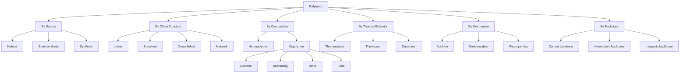
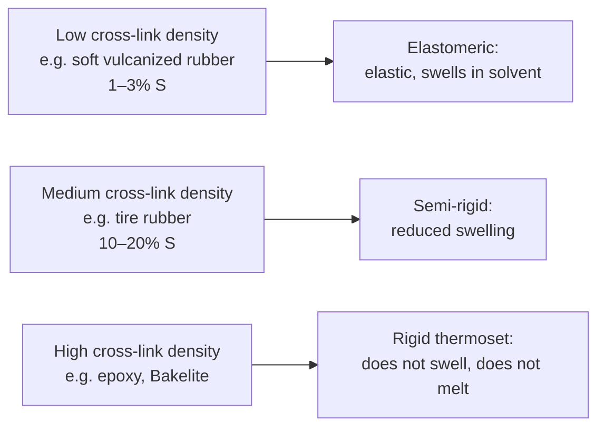
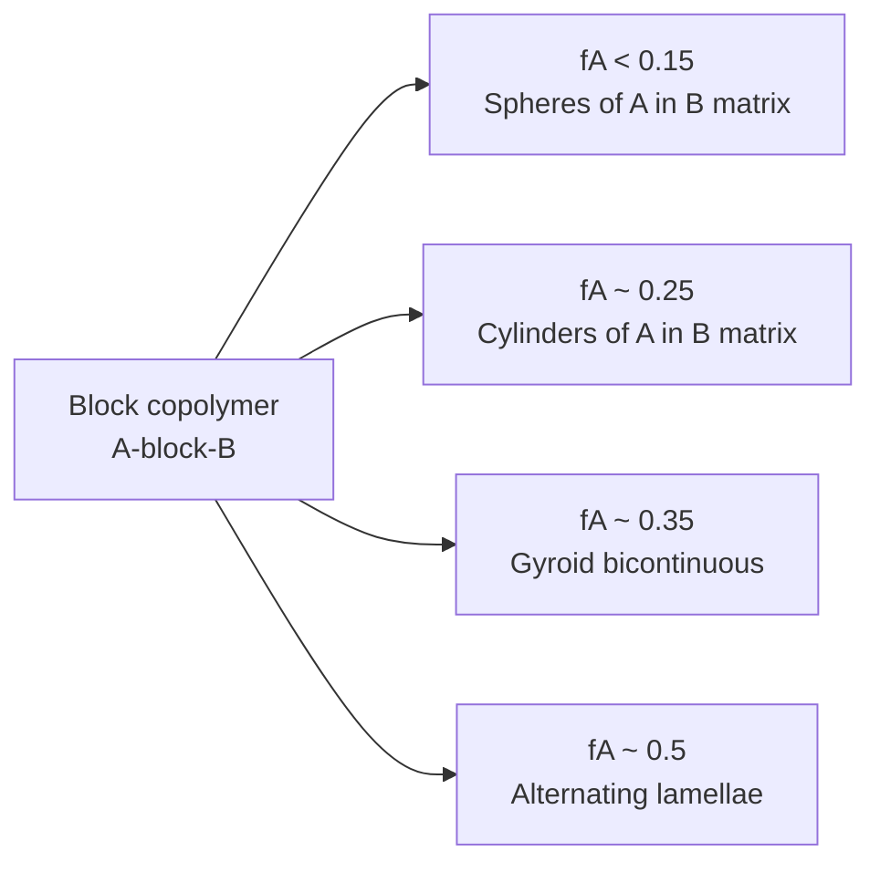
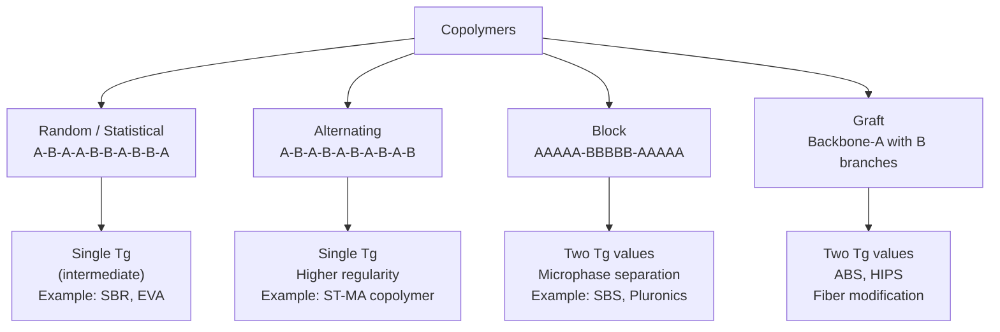
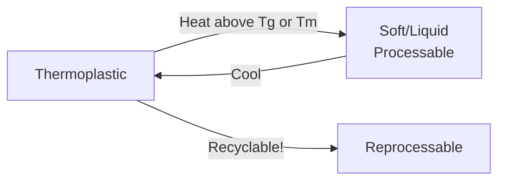
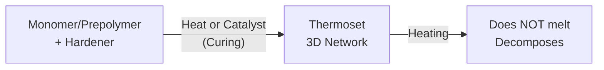
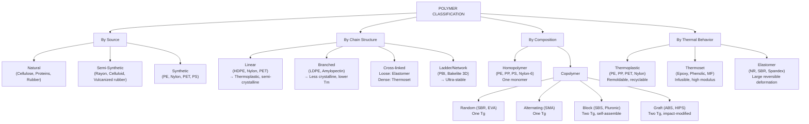

# 03. Classification of Polymers and Their Description

> **Course:** Polymer and Textile Chemistry
> **Topic:** 03 — Classification of Polymers
> **Date:** June 04, 2026
> **Repository:** [butex-notes](https://github.com/itachi-re/butex-notes)

---

## Table of Contents

1. [Overview of Polymer Classification](#1-overview-of-polymer-classification)
2. [Classification by Source / Origin](#2-classification-by-source--origin)
   - [2.1 Natural Polymers](#21-natural-polymers)
   - [2.2 Semi-Synthetic Polymers](#22-semi-synthetic-polymers)
   - [2.3 Synthetic Polymers](#23-synthetic-polymers)
3. [Classification by Chain Structure](#3-classification-by-chain-structure)
   - [3.1 Linear Polymers](#31-linear-polymers)
   - [3.2 Branched Polymers](#32-branched-polymers)
   - [3.3 Cross-Linked Polymers](#33-cross-linked-polymers)
   - [3.4 Network (Ladder and 3D) Polymers](#34-network-ladder-and-3d-polymers)
4. [Classification by Monomer Composition](#4-classification-by-monomer-composition)
   - [4.1 Homopolymers](#41-homopolymers)
   - [4.2 Copolymers](#42-copolymers)
5. [Classification by Thermal Behavior](#5-classification-by-thermal-behavior)
   - [5.1 Thermoplastics](#51-thermoplastics)
   - [5.2 Thermosets](#52-thermosets)
   - [5.3 Elastomers](#53-elastomers)
6. [Classification by Polymerization Mechanism](#6-classification-by-polymerization-mechanism)
7. [Classification by Backbone Chemistry](#7-classification-by-backbone-chemistry)
8. [Summary Diagram — All Classifications](#8-summary-diagram--all-classifications)
9. [Structure–Property Relationships](#9-structureproperty-relationships)
10. [Practice Problems](#10-practice-problems)
11. [References](#11-references)

---

## 1. Overview of Polymer Classification

Polymers can be classified by **multiple independent criteria** — a single polymer may belong to several categories simultaneously. A full characterization of a polymer requires specifying its classification under *all* relevant criteria.



> 📌 **Example:** Nylon-6,6 is:
> - Synthetic (by source)
> - Linear (by structure)
> - Homopolymer (by composition — one type of repeat unit)
> - Thermoplastic (by thermal behavior)
> - Condensation polymer (by mechanism)
> - Heteroatom backbone (C–N in chain)

---

## 2. Classification by Source / Origin

### 2.1 Natural Polymers

Polymers produced by living organisms (plants, animals, microbes) with no human synthesis involved.

**Sub-classes and examples:**

#### A. Polysaccharides (Carbohydrate polymers)

| Polymer | Repeat Unit | Source | Structure | Use |
|---------|------------|--------|-----------|-----|
| **Cellulose** | β-D-Glucose | Plant cell walls | Linear, β-1,4 linkage | Cotton, wood pulp, paper |
| **Starch** | α-D-Glucose | Cereals, tubers | Amylose (linear) + Amylopectin (branched) | Food, adhesive |
| **Chitin** | N-Acetyl-glucosamine | Shellfish exoskeleton | Linear, β-1,4 linkage | Antimicrobial, wound dressing |
| **Glycogen** | α-D-Glucose | Animal liver, muscle | Highly branched | Energy storage |
| **Hyaluronic acid** | GlcUA + GlcNAc | Connective tissue | Linear alternating | Joint lubrication, cosmetics |
| **Pectin** | Galacturonic acid | Fruit cell walls | Partially methyl-esterified | Gelling agent |

**Cellulose structure:**

```
       OH                OH
       |                  |
HO--C₁--C₄--O--C₁--C₄--O--C₁--...
    |    |        |    |
   C₂   C₃      C₂   C₃
    |    |        |    |
   OH   OH      OH   OH

β-1,4-glucosidic linkage (all equatorial → linear, flat ribbon)
Hydrogen bonding between chains → high crystallinity → insoluble in water
```

Cellulose DP = 300–10,000 (cotton); MW = 50,000–2,000,000 g/mol


*Fig. 1: Cellulose chain structure showing β-1,4-glucosidic linkages and hydroxyl groups. (Wikimedia Commons)*

#### B. Proteins (Polyamides from amino acids)

| Protein | Repeat units | Source | Structure | Use |
|---------|-------------|--------|-----------|-----|
| **Collagen** | Gly-Pro-Hyp tripeptide | Skin, tendon, bone | Triple helix | Leather, gelatin |
| **Keratin** | α-amino acids (Cys-rich) | Wool, hair, nails | α-helix → β-sheet | Textile fiber |
| **Fibroin** | Gly-Ala-Gly-Ala | Silk (*Bombyx mori*) | β-sheet | Luxury textile |
| **Elastin** | Val, Ala, Gly-rich | Arterial walls | Random coil/elastomeric | Elastic tissue |

**Peptide bond formation:**

$$-\text{NH}-\text{CHR}_1-\text{CO}-\ +\ H_2\text{N}-\text{CHR}_2-\text{COOH} \rightarrow -\text{NH}-\text{CHR}_1-\text{CO}-\text{NH}-\text{CHR}_2-\text{COOH}$$

The peptide ($-\text{CO-NH}-$) linkage is similar to an amide bond — the same linkage as in synthetic polyamides (nylons).

#### C. Polyisoprenes (Natural Rubber)

| Polymer | Configuration | Source | Property |
|---------|--------------|--------|---------|
| **Natural rubber** | *cis*-1,4-polyisoprene | *Hevea brasiliensis* | Elastic, tacky |
| **Gutta-percha** | *trans*-1,4-polyisoprene | *Palaquium gutta* | Rigid, leathery |

*cis* vs *trans* polyisoprene:
```
      CH₃             CH₃             CH₃
       |                |               |
~CH₂-C=CH-CH₂-CH₂-C=CH-CH₂-CH₂-C=CH-CH₂~
  (all double bonds cis → random coil, flexible) = Natural rubber

      CH₃        CH₂~                CH₃
       |          |                    |
~CH₂-C=CH    CH₂-C=CH          CH₂-C=CH~
           \  /
            CH₂
  (all double bonds trans → extended, crystallizable) = Gutta-percha
```

### 2.2 Semi-Synthetic Polymers

Chemically modified natural polymers — the backbone is natural, but functional groups have been altered.

| Semi-synthetic Polymer | Starting Material | Modification | Use |
|------------------------|-----------------|-------------|-----|
| **Viscose Rayon** | Cellulose (wood pulp) | Xanthate formation → dissolution → regeneration | Textile fiber |
| **Modal** | Cellulose | High-wet-modulus viscose process | Soft textile |
| **Lyocell (Tencel)** | Cellulose | Direct dissolution in NMMO | Premium textile |
| **Cellulose acetate** | Cellulose | Acetylation of –OH groups (2–3 acetate per ring) | Cigarette filters, film |
| **Nitrocellulose** | Cellulose | Nitration of –OH groups | Explosives, lacquers |
| **Carboxymethyl cellulose (CMC)** | Cellulose | Carboxymethylation | Detergent, food thickener |
| **Vulcanized rubber** | Natural rubber | Sulfur cross-linking | Tires, industrial goods |
| **Ebonite** | Natural rubber | High sulfur cross-linking | Bowling balls |

**Viscose rayon process:**

$$\text{Cell-OH} \xrightarrow{\text{CS}_2, \text{NaOH}} \text{Cell-O-CS}_2^-\text{Na}^+ \text{ (sodium cellulose xanthate)}$$
$$\xrightarrow{\text{H}_2\text{SO}_4\text{ bath (wet spinning)}} \text{Regenerated cellulose (Rayon)}$$

### 2.3 Synthetic Polymers

Entirely man-made polymers from low-MW monomers derived from petroleum, natural gas, or bio-based sources.

**Major categories:**

| Type | Examples | Properties |
|------|---------|------------|
| **Polyolefins** | PE, PP, PB | Light, chemical resistant, non-polar |
| **Vinyl polymers** | PVC, PS, PMMA, PAN | Versatile, tunable |
| **Polyesters** | PET, PBT, PC, PLA | Good mechanical properties |
| **Polyamides** | Nylon-6, Nylon-6,6, Kevlar | Strong, hydrogen-bonded |
| **Polyurethanes** | Spandex, foams | Flexible to rigid, segmented |
| **Epoxies** | DGEBA-based | Thermosets, adhesives |
| **Silicones** | PDMS | Flexible, heat-resistant |
| **Fluoropolymers** | PTFE (Teflon), PVDF | Chemical inertness, low friction |

---

## 3. Classification by Chain Structure

This is one of the most important structural classifications, directly determining physical properties.

### 3.1 Linear Polymers

Repeat units connected in a single continuous chain with no branches — a "spaghetti" architecture.

```
Schematic:
  ●—●—●—●—●—●—●—●—●—●—●—●—●—●—●—●—●
  (● = repeat unit; — = covalent bond)
```

**Characteristics:**
- Chains can pack closely → high **crystallinity** possible
- Strong **intermolecular forces** (van der Waals, H-bonds) hold chains together
- **Thermoplastic** behavior (soften on heating, can be reprocessed)
- High **viscosity** in melt state

**Prominent examples with structures:**

*High-Density Polyethylene (HDPE):*
$$[-CH_2-CH_2-]_n$$
Perfect linear chain, DP = 25,000–50,000, high crystallinity (85–95%), $T_m$ = 130–135°C

*Nylon-6,6:*
$$[-NH-(CH_2)_6-NH-CO-(CH_2)_4-CO-]_n$$
Hydrogen bonds between $-\text{NH}-$ and $-\text{CO}-$ groups hold chains together → high $T_m$ = 265°C, high tenacity

*Polyethylene terephthalate (PET):*
$$[-O-CH_2CH_2-O-CO-C_6H_4-CO-]_n$$
Linear, semi-crystalline, $T_m$ = 265°C, excellent fiber (Dacron, Terylene) and bottle material

| Property | Linear | Effect |
|----------|--------|--------|
| Packing efficiency | High | High density, high crystallinity |
| Chain entanglement | Significant | Good melt strength |
| Thermal behavior | Thermoplastic | Recyclable |
| Tensile strength | Moderate–High | Good fiber properties |
| Solubility | Possible (solvent-specific) | Processable in solution |

### 3.2 Branched Polymers

The main chain (backbone) has one or more side chains (branches) of varying length attached.

```
Short-chain branched (LDPE):
   ●—●—●—●—●—●—●—●—●—●—●—●—●
               |   |   |
               ●   ●   ●
               |   |
               ●   ●

Long-chain branched:
   ●—●—●—●—●—●—●—●—●—●—●
           |
           ●—●—●—●—●—●—●—●—●
                   |
                   ●—●—●—●

Star polymer:
           ●—●—●—●
           |
   ●—●—●—●—●—●—●—●—●
           |
           ●—●—●—●
           |
           ●—●—●—●—●

Comb polymer:
  ●—●—●—●—●—●—●—●—●—●—●
  |   |   |   |   |   |
  ●   ●   ●   ●   ●   ●
  |   |   |   |   |   |
  ●   ●   ●   ●   ●   ●
```

**Types of branching:**

| Type | Description | Example |
|------|-------------|---------|
| **Short-chain branching (SCB)** | 2–6 carbon side chains from backbone | LDPE (ethyl, butyl branches) |
| **Long-chain branching (LCB)** | Branches comparable in length to backbone | LDPE (some chains), LLDPE |
| **Star polymer** | Multiple arms radiating from central point | Polyisoprene stars (anionic) |
| **Comb polymer** | Many regularly spaced side chains | Brush copolymers |
| **Dendrimer** | Perfectly branched, tree-like | PAMAM (generation 0–10) |
| **Hyperbranched** | Randomly branched, dendrimer-like | HBP polyesters |

**Effect of branching on properties:**

| Effect | Explanation |
|--------|-------------|
| ↓ Crystallinity | Branches disrupt regular chain packing |
| ↓ Density | Less efficient packing |
| ↓ $T_m$ | Weaker intermolecular forces |
| ↑ Free volume | More space between chains |
| ↑ Melt elasticity (LCB) | Long branches entangle → elastic response |
| ↑ Impact strength | More chain mobility |

**Classic example — LDPE vs HDPE:**

| Property | HDPE (linear) | LDPE (branched) |
|----------|--------------|----------------|
| Density (g/cm³) | 0.94–0.97 | 0.91–0.94 |
| Crystallinity (%) | 70–90 | 40–60 |
| $T_m$ (°C) | 130–135 | 105–115 |
| Tensile strength (MPa) | 20–37 | 8–20 |
| Use | Pipes, bottles | Films, bags |


*Fig. 2: LDPE branched chain structure (schematic). (Wikimedia Commons)*

**Dendrimers — Perfect branching:**

Dendrimers are iteratively synthesized, perfectly monodisperse (PDI = 1.0) branched macromolecules:
- **Core** → **interior branches** → **surface functional groups**
- Synthesized generation by generation (G0, G1, G2, ... Gn)
- PAMAM G5 dendrimer: MW = 28,826 g/mol, 128 surface amine groups

Applications: drug delivery (carries drugs in interior cavities), MRI contrast agents, gene delivery.

### 3.3 Cross-Linked Polymers

Separate polymer chains are joined by **covalent bonds** (cross-links), forming a three-dimensional network.

```
Cross-linked network:

  ●—●—●—●—●—●—●—●
        |           |
  ●—●—●—●—●—●—●—●
  |           |
  ●—●—●—●—●—●—●—●
        |           |
  ●—●—●—●—●—●—●—●

  (| and ─ = cross-links between chains)
```

**How cross-links form:**
1. **Vulcanization:** Sulfur bridges between polyisoprene chains (rubber)
2. **Peroxide cross-linking:** Radical abstraction + coupling (polyolefins)
3. **Radiation cross-linking:** γ-ray or e-beam (XLPE cables)
4. **Bifunctional monomer:** Divinylbenzene in polystyrene synthesis
5. **Chemical reaction:** Epoxy + diamine, isocyanate + polyol (PU thermoset)

**Effect of cross-link density:**



**Quantifying cross-link density:**

Using **Flory-Rehner equation** (for rubbery networks):

$$\ln(1-v_p) + v_p + \chi v_p^2 = -V_1 \nu_e \left(v_p^{1/3} - \frac{v_p}{2}\right)$$

Where:
- $v_p$ = volume fraction of polymer in swollen state
- $\chi$ = Flory-Huggins interaction parameter
- $V_1$ = molar volume of solvent
- $\nu_e$ = cross-link density (mol/cm³)

Simplified: Higher $\nu_e$ → less swelling → more rigid network.

**Key properties of cross-linked polymers:**

| Property | Explanation |
|----------|-------------|
| Cannot dissolve | Network prevents chain extraction |
| Can swell (low cross-link) | Solvent penetrates but cannot extract chains |
| Cannot melt (thermoset) | Cross-links prevent chain flow |
| High dimensional stability | Covalent network resists deformation |
| Higher modulus | Chains restrained from slipping |

### 3.4 Network (Ladder and 3D) Polymers

**Ladder polymers** have two parallel backbone chains with regular rungs (cross-links) — like a molecular ladder:

```
Double-strand ladder polymer:
   ●═●═●═●═●═●═●
   |  |  |  |  |  |
   ●═●═●═●═●═●═●
```

Examples: Polybenzimidazole (PBI), polynaphthylene — extremely thermally stable.

**3D network polymers:** Every atom is part of a network — diamond, $SiO_2$ (quartz), silicon nitride — inorganic analogs with extreme hardness.

---

## 4. Classification by Monomer Composition

### 4.1 Homopolymers

> **Homopolymer:** A polymer composed of only **one type of repeat unit** derived from one monomer species.

```
Homopolymer chain:
  A—A—A—A—A—A—A—A—A—A—A—A—A—A—A
  (A = repeat unit; all identical)
```

**Examples:**

| Polymer | Monomer | Repeat Unit |
|---------|---------|-------------|
| Polyethylene (PE) | Ethylene | $-CH_2CH_2-$ |
| Polypropylene (PP) | Propylene | $-CH_2CH(CH_3)-$ |
| Polystyrene (PS) | Styrene | $-CH_2CH(C_6H_5)-$ |
| PTFE | TFE | $-CF_2CF_2-$ |
| Nylon-6 | ε-Caprolactam | $-NH(CH_2)_5CO-$ |
| PLA | L-lactic acid | $-O-CH(CH_3)-CO-$ |

> ⚠️ **Note:** Nylon-6 is a homopolymer (one monomer: caprolactam), while Nylon-6,6 is made from two different monomers (HMD + AA) — yet Nylon-6,6 is typically also classified as a homopolymer because the repeating unit is regularly defined. Strictly, it is an alternating *copolymer* of HMD and AA, but practically it is treated as a homopolymer with one CRU.

### 4.2 Copolymers

> **Copolymer:** A polymer derived from **two or more different monomer species**, incorporated into the same chain.

$$\text{Monomers: } A \text{ and } B \rightarrow \text{Copolymer: contains both } A \text{ and } B \text{ units}$$

#### A. Random Copolymer (Statistical Copolymer)

Monomers A and B are distributed **randomly** along the chain, according to the statistical probabilities determined by their reactivity ratios.

```
Sequence:  A—B—A—A—B—A—B—B—B—A—A—B—A—B—A—A—A—B
```

Governed by **Mayo-Lewis equation** (copolymer composition equation):

$$F_A = \frac{r_1 f_A^2 + f_A f_B}{r_1 f_A^2 + 2f_A f_B + r_2 f_B^2}$$

Where:
- $F_A$ = mole fraction of A in copolymer
- $f_A, f_B$ = mole fractions of A and B in feed
- $r_1 = k_{AA}/k_{AB}$, $r_2 = k_{BB}/k_{BA}$ = reactivity ratios

**Examples:**
- **SBR** (Styrene-Butadiene Rubber): 23% styrene, 77% butadiene, random → general-purpose rubber
- **LDPE-co-VA** (EVA): ethylene + vinyl acetate, random → flexible packaging, foams
- **Poly(acrylonitrile-co-styrene)**: SAN copolymer

**Properties:** Usually intermediate between the two homopolymers; single $T_g$ (intermediate value).

#### B. Alternating Copolymer

Monomers A and B alternate **strictly** along the chain — every A is followed by B and vice versa.

```
Sequence:  A—B—A—B—A—B—A—B—A—B—A—B—A—B
```

Occurs when $r_1 \approx 0$, $r_2 \approx 0$ (both monomers prefer to add the other) OR $r_1 \cdot r_2 \approx 0$.

**Examples:**
- **Poly(styrene-alt-maleic anhydride):** Styrene + maleic anhydride → perfect alternation (maleic anhydride cannot homopolymerize)
- **Poly(ethylene-alt-CO):** Ethylene + carbon monoxide (Pd catalyst) → perfectly alternating ketone polymer

**Properties:** Well-defined stoichiometry; one $T_g$; often higher regularity than random.

#### C. Block Copolymer

The chain consists of distinct **long sequences (blocks)** of each monomer:

```
Diblock:  A—A—A—A—A—A—B—B—B—B—B—B—B—B
         [——— Block A ———][——— Block B ———]

Triblock:  A—A—A—A | B—B—B—B—B | A—A—A—A
          [Block A ][  Block B  ][Block A ]
          SBS rubber (Kraton®)
```

**Synthesis:** Living polymerization (anionic, ATRP, RAFT) — polymerize A to completion, then add B.

**Examples:**

| Block Copolymer | Architecture | Use |
|----------------|-------------|-----|
| **SBS** (Styrene-Butadiene-Styrene) | A-B-A triblock | Thermoplastic elastomer (shoe soles) |
| **SIS** (Styrene-Isoprene-Styrene) | A-B-A triblock | Adhesives, sealants |
| **SEBS** (Hydrogenated SBS) | A-B-A | Automotive seals, wire insulation |
| **PEG-b-PCL** | Diblock | Drug delivery nanoparticles |
| **Pluronic® (PEO-PPO-PEO)** | A-B-A | Surfactants, drug delivery |

**Microphase separation:** Block copolymers self-assemble into **nanoscale morphologies** (20–100 nm):



(where $f_A$ = volume fraction of A block)

**Application in textiles:** Block copolymers used for softeners, antistatic agents, and microfiber production.

#### D. Graft Copolymer

One polymer chain (backbone A) has branches (grafts) of a different polymer B:

```
         B—B—B—B
         |
A—A—A—A—A—A—A—A—A—A—A
         |
         B—B—B—B—B
```

**Synthesis routes:**
1. **Grafting onto:** Reactive B chains attach to pre-formed A backbone
2. **Grafting from:** Initiation sites on A backbone initiate B monomer polymerization
3. **Grafting through:** B macromonomer co-polymerizes with A

**Examples:**

| Graft Copolymer | Description | Use |
|----------------|-------------|-----|
| **ABS** | Polybutadiene backbone + PS-co-AN grafts | Engineering plastic (phones, appliances) |
| **HIPS** | Polybutadiene backbone + PS grafts | High-impact polystyrene |
| **PVC-g-PMMA** | PVC backbone + PMMA grafts | Improved impact, clarity |
| **Cellulose-g-PAN** | Cellulose backbone + acrylonitrile grafts | Modified cotton for dyeing |
| **Wool-g-styrene** | Wool protein + polystyrene | Shrink-resist, improved performance |

**Textile application:** **Graft polymerization on fibers** (cotton, wool, synthetic) is a key technique to add functional groups (hydrophilicity, flame retardance, antimicrobial activity):

$$\text{Fiber-H} + n M \xrightarrow{\text{initiator}} \text{Fiber-CH}_2\text{CHR} \cdot \xrightarrow{n \to \infty} \text{Fiber-}[-CH_2CHR-]_n$$

**Copolymer Sequence Summary:**



**Glass transition of copolymers (Fox equation):**

For a random copolymer with weight fractions $w_A$ and $w_B$:

$$\frac{1}{T_g} = \frac{w_A}{T_{g,A}} + \frac{w_B}{T_{g,B}}$$

**Example:** SBR (23% styrene, 77% butadiene). $T_g$(PS) = 373 K, $T_g$(PB) = 190 K:

$$\frac{1}{T_g(\text{SBR})} = \frac{0.23}{373} + \frac{0.77}{190} = 6.17 \times 10^{-4} + 4.05 \times 10^{-3} = 4.667 \times 10^{-3}$$

$$T_g = \frac{1}{4.667 \times 10^{-3}} = \boxed{214 \text{ K} = -59°C}$$

Since $T_g$ < room temperature (295 K), SBR is rubbery at ambient — suitable as a rubber.

---

## 5. Classification by Thermal Behavior

### 5.1 Thermoplastics

Polymers that **soften on heating** and harden on cooling — **reversible** process. They can be repeatedly melted and reshaped.

**Structural basis:** Linear or branched chains held by **secondary forces** (van der Waals, hydrogen bonds). Heat overcomes these forces → flow; cooling restores them → solid.



**Sub-classes:**

| Type | $T_g$ vs RT | Example | Properties |
|------|-------------|---------|-----------|
| **Glassy** | $T_g$ > RT | PS, PMMA, PC | Rigid, transparent, brittle |
| **Semi-crystalline** | $T_m$ > RT | PE, PP, Nylon, PET | Strong, opaque, good chemical resistance |
| **Rubbery** | $T_g$ < RT | Polybutadiene, cis-PI | Elastomeric (without cross-links) |

**Examples:**

| Thermoplastic | $T_g$ (°C) | $T_m$ (°C) | Key Use |
|--------------|-----------|-----------|---------|
| HDPE | −120 | 130 | Pipes, containers |
| PP | −10 | 165 | Packaging, fibers |
| PET | 79 | 265 | Bottles, polyester fiber |
| Nylon-6,6 | 60 | 265 | Engineering fibers, gears |
| PVC | 87 | — (amorphous) | Pipes, window frames |
| PS | 100 | — | Packaging, food containers |
| PC | 145 | — | CDs, safety glasses |
| PEEK | 143 | 343 | High-performance engineering |

### 5.2 Thermosets

Polymers that undergo **irreversible chemical cross-linking** upon curing — they become infusible and insoluble.



**Common thermoset systems:**

| System | Monomers | Curing Agent | Use |
|--------|---------|-------------|-----|
| **Epoxy resin** | Diglycidyl ether of bisphenol A (DGEBA) | Amine (DETA, TETA) | Adhesives, aerospace composites |
| **Phenolic resin (Bakelite)** | Phenol + Formaldehyde | Heat/pressure | Electrical insulators, brake pads |
| **Unsaturated polyester** | UPE + styrene | Peroxide | Fiberglass, boat hulls |
| **Polyurethane thermoset** | Polyol + MDI/TDI | — | Rigid foam insulation |
| **Melamine-formaldehyde** | Melamine + HCHO | Heat | Laminates (Formica) |
| **Cyanate ester** | Bisphenol A cyanate | Heat | High-$T_g$ aerospace composites |

**Epoxy cure chemistry:**

$$\underbrace{\text{Epoxide}}_{\text{oxirane ring}} + \text{H}_2\text{N}-R \rightarrow \text{-CH(OH)-CH}_2\text{-NH}-R \text{ (β-hydroxy amine)}$$

Each amine reacts with 2 epoxide groups → network formation. Properties tunable by changing amine:epoxide ratio.

**Properties of thermosets:**

| Property | Value/Characteristic |
|----------|---------------------|
| Thermal stability | High (no melting) |
| Solvent resistance | Excellent (cross-linked network) |
| Dimensional stability | Excellent |
| Recyclability | ❌ Difficult (chemical recycling being developed) |
| Impact resistance | Low (brittle) — improved with elastomer tougheners |
| Modulus | Very high |

### 5.3 Elastomers

Polymers with **very large elastic deformation** (>100–1000% elongation) and **complete recovery** upon stress removal.

**Requirements for elastomeric behavior:**
1. $T_g$ **well below** use temperature → chains mobile (rubbery)
2. **Amorphous** (or quickly crystallizing under stress)
3. **Light cross-linking** to prevent chains from sliding permanently

```
Unstretched elastomer:   ~~C~~  ~~C~~  ~~C~~  (entangled coils, low entropy)

Stretched (high entropy):  ←—C—→  ←—C—→      (extended, low entropy)
                           ↑ Cross-links prevent permanent deformation

Release force:           ~~C~~  ~~C~~  ~~C~~  (chains return to high-entropy coil)
```

**Thermodynamics of rubber elasticity (entropy-driven):**

$$f = \frac{nRT}{V_0}\left(\lambda - \frac{1}{\lambda^2}\right)$$

Where:
- $f$ = retractive force
- $n$ = cross-link density (mol/cm³)
- $\lambda = L/L_0$ = stretch ratio (deformed/undeformed length)

Key insight: **Rubber elasticity is entropic** — the restoring force *increases* with temperature (unlike springs, which are enthalpic):

$$\left(\frac{\partial f}{\partial T}\right)_\lambda > 0 \quad \text{(thermoelastic inversion)}$$

**Examples of elastomers:**

| Elastomer | Chemical Type | $T_g$ (°C) | Key Property | Use |
|-----------|--------------|-----------|-------------|-----|
| **Natural rubber (NR)** | *cis*-polyisoprene | −70 | Excellent resilience | Tires, gloves |
| **SBR** | Styrene-butadiene | −59 | Good abrasion | Car tires |
| **NBR (Nitrile)** | Acrylonitrile-butadiene | −30 | Oil resistance | O-rings, fuel hoses |
| **EPDM** | Ethylene-propylene-diene | −55 | Weather/ozone resistance | Roofing, seals |
| **Silicone (PDMS)** | Poly(dimethylsiloxane) | −120 | Very wide $T$ range | Sealants, implants |
| **Neoprene (CR)** | Polychloroprene | −50 | Flame/chemical resistant | Wet suits, wires |
| **Spandex/Lycra** | Polyurethane-urea (segmented) | — | >600% elongation | Sportswear, swimwear |

**Segmented polyurethane elastomers (Spandex):**

Spandex consists of alternating **hard segments** (urethane from MDI + diol) and **soft segments** (polyether or polyester diol):

```
[—Hard segment (urethane)—]—[—Soft segment (polyether)—]—[—Hard—]—[—Soft—]—
     Crystallizes → physical cross-links        Amorphous, rubbery
     $T_g$ = 150°C                              $T_g$ = −70°C
```

The hard segments act as *physical cross-links*, giving the elastomeric behavior without covalent cross-linking — hence Spandex is **thermoplastic elastomer (TPE)**.

---

## 6. Classification by Polymerization Mechanism

| Mechanism | Polymer Examples | Chain Growth | By-product |
|-----------|----------------|-------------|-----------|
| **Free-radical addition** | PE (LDPE), PS, PVC, PMMA, PAN | Chain | None |
| **Cationic addition** | PIB, POM | Chain | None |
| **Anionic addition** | SBS, living PS | Chain | None |
| **Coordination (Z-N)** | iPP, HDPE, LLDPE | Chain | None |
| **Ring-opening (ROP)** | Nylon-6, PLA, PEO | Chain/Step | None/small |
| **Condensation (step-growth)** | Nylon-6,6, PET, PC, Epoxy | Step | H₂O, HCl, MeOH |
| **Metathesis (ROMP)** | Polydicyclopentadiene, polynorbornene | Chain | None |

---

## 7. Classification by Backbone Chemistry

| Backbone Type | Description | Examples |
|--------------|-------------|---------|
| **Carbon-chain (homochain)** | Only C–C in backbone | PE, PP, PS, PVC, PMMA |
| **Heterochain** | Non-carbon atoms in backbone | PET (C–O), Nylon (C–N), PC (C–O), PU (C–O, C–N) |
| **Inorganic backbone** | Si, P, S in main chain | Silicones (Si–O), polyphosphazenes (P=N) |
| **Conjugated** | Alternating single/double bonds | Polyacetylene, PPV, PEDOT |

---

## 8. Summary Diagram — All Classifications



---

## 9. Structure–Property Relationships

Understanding classification immediately predicts properties:

| Structural Feature | Property Effect | Design Rule |
|-------------------|----------------|------------|
| **High MW / long chains** | ↑ Tensile strength, ↑ toughness | Aim for $\bar{M}_n > 50$ kDa for structural use |
| **Linear chains** | High crystallinity, high $T_m$ | Good for fibers (Nylon, PET) |
| **Branching** | ↓ Crystallinity, ↓ $T_m$, ↑ toughness | LDPE for flexible film |
| **Cross-linking (dense)** | Thermoset: infusible, chemically resistant | Epoxy coatings, Bakelite |
| **Cross-linking (sparse)** | Elastomer: rubbery, elastic | Tires, gaskets |
| **Block structure** | Microphase separation, two $T_g$ | TPE (SBS), drug delivery |
| **Polar groups (–OH, –NH, –CN)** | ↑ Intermolecular forces, ↑ $T_g$, ↑ $T_m$ | Nylon vs PE: higher melting |
| **Stiff backbone (aromatic)** | High $T_g$, high modulus | Kevlar (lyotropic LC fiber) |
| **Atactic configuration** | Amorphous polymer | Transparent PS, PMMA |
| **Isotactic configuration** | Semi-crystalline polymer | iPP higher $T_m$ vs atactic PP |

---

## 10. Practice Problems

<details>
<summary>📝 Q1: Classify the following polymers by ALL relevant criteria: (a) Polyethylene terephthalate (PET), (b) Styrene-butadiene rubber (SBR), (c) Bakelite (phenol-formaldehyde resin)</summary>

**Answers:**

**(a) PET (Polyethylene terephthalate):**
- **Source:** Synthetic
- **Chain structure:** Linear
- **Composition:** Homopolymer (single CRU: –OCH₂CH₂OCO–C₆H₄–CO–)
- **Thermal behavior:** Thermoplastic (semi-crystalline; $T_g$ = 79°C, $T_m$ = 265°C)
- **Mechanism:** Condensation (step-growth): ethylene glycol + terephthalic acid
- **Backbone:** Heterochain (C–O–C ester linkages)

**(b) SBR (Styrene-Butadiene Rubber):**
- **Source:** Synthetic
- **Chain structure:** Linear (slightly branched depending on process)
- **Composition:** Random copolymer of styrene (23%) and butadiene (77%)
- **Thermal behavior:** Elastomer (cross-linked with sulfur in use; $T_g$ ≈ −59°C)
- **Mechanism:** Free-radical addition copolymerization
- **Backbone:** Carbon chain (homochain)

**(c) Bakelite:**
- **Source:** Synthetic
- **Chain structure:** 3D cross-linked network
- **Composition:** Alternating/network structure of phenol and formaldehyde
- **Thermal behavior:** Thermoset (does not melt; decomposes above 200°C)
- **Mechanism:** Condensation (step-growth), acid-catalyzed
- **Backbone:** Heterochain (aromatic rings linked by –CH₂– bridges)
</details>

<details>
<summary>📝 Q2: A random copolymer of acrylonitrile (Tg = 130°C) and butadiene (Tg = −85°C) is produced in an 80:20 molar ratio (AN:BD). Estimate the Tg of the copolymer using the Fox equation. (M(AN)=53, M(BD)=54 g/mol)</summary>

**Solution:**

First, convert molar fractions to weight fractions:
$$w_{AN} = \frac{0.80 \times 53}{0.80 \times 53 + 0.20 \times 54} = \frac{42.4}{42.4 + 10.8} = \frac{42.4}{53.2} = 0.797$$
$$w_{BD} = 1 - 0.797 = 0.203$$

Fox equation:
$$\frac{1}{T_g} = \frac{w_{AN}}{T_{g,AN}} + \frac{w_{BD}}{T_{g,BD}}$$
$$\frac{1}{T_g} = \frac{0.797}{403} + \frac{0.203}{188}$$
$$= 1.978 \times 10^{-3} + 1.080 \times 10^{-3} = 3.058 \times 10^{-3}$$
$$T_g = \frac{1}{3.058 \times 10^{-3}} = 327 \text{ K} = \boxed{54°C}$$

This copolymer ($T_g$ ≈ 54°C) would be glassy at room temperature but could be used as a thermoplastic above 54°C.

*Note: NBR (nitrile rubber) uses ~30% AN → $T_g$ ≈ −30°C → rubber at RT.*
</details>

<details>
<summary>📝 Q3: Why do branched polymers (like LDPE) have lower crystallinity than their linear counterparts (HDPE), even though both are polyethylene?</summary>

**Answer:** Crystallinity requires long-range **periodic packing** of polymer chains into a regular lattice. For HDPE, the perfectly linear $-CH_2CH_2-$ chains can align side-by-side in an extended all-trans zigzag conformation and pack efficiently into an orthorhombic unit cell.

In LDPE, short-chain branches (ethyl, n-butyl, 2-ethylhexyl, generated by back-biting intramolecular chain transfer during high-pressure radical polymerization) disrupt the regular packing. Wherever a branch point exists, the chain cannot fold into the crystalline lamellar and is instead expelled into the amorphous region. This increases amorphous content, reduces density (0.91–0.94 vs 0.94–0.97 g/cm³), reduces $T_m$ (105–115 vs 130–135°C), and produces a softer, more flexible material — desirable for plastic bags and flexible film.
</details>

<details>
<summary>📝 Q4: Block copolymers show "microphase separation" — what is this phenomenon and why does it not lead to macrophase separation as in simple polymer blends?</summary>

**Answer:** In a **block copolymer** (A-block-B), the two chemically different segments are covalently bonded in the same chain. At equilibrium, the thermodynamically unfavorable mixing enthalpy ($\Delta H_{mix} > 0$ for incompatible A and B) drives phase separation. However, because A and B blocks are covalently connected, complete **macro**-phase separation (as in an immiscible polymer blend) is impossible — the chains cannot move to separate bulk phases.

Instead, the system undergoes **microphase separation** — the A and B segments self-assemble into periodic nanoscale domains (typically 10–100 nm in size), whose geometry (spheres, cylinders, gyroids, lamellae) is dictated by the volume fraction of each block. The domain period ($d$) scales with the block's degree of polymerization: $d \propto \chi^{1/6} N^{2/3}$ (for strong segregation), where $\chi$ is the Flory-Huggins parameter.

**In a blend:** Macroscopic phase separation → large, unstable domains → poor mechanical properties.
**In a block copolymer:** Nanoscale ordered domains → both phases continuous (or well-distributed) → superior mechanical properties, e.g., in SBS triblock elastomers where glassy PS domains physically cross-link rubbery PB midblocks.
</details>

---

## 11. References

1. **Callister, W. D., & Rethwisch, D. G.** (2018). *Materials Science and Engineering: An Introduction* (10th ed.). Wiley. [Penn State MATSE 81 course notes]
2. **Odian, G.** (2004). *Principles of Polymerization* (4th ed.). Wiley-Interscience. Chapters 6, 7.
3. **Hiemenz, P. C., & Lodge, T. P.** (2007). *Polymer Chemistry* (2nd ed.). CRC Press. Chapters 1, 5.
4. **Young, R. J., & Lovell, P. A.** (2011). *Introduction to Polymers* (3rd ed.). CRC Press.
5. **Mayo, F. R., & Lewis, F. M.** (1944). Copolymerization. *Journal of the American Chemical Society*, 66(9), 1594–1601. [Mayo-Lewis equation]
6. **Fox, T. G.** (1956). Influence of diluent and copolymer composition. *Bulletin of the American Physical Society*, 1, 123.
7. **Leibler, L.** (1980). Theory of microphase separation in block copolymers. *Macromolecules*, 13(6), 1602–1617.
8. **LibreTexts — Polymer Classification:** https://chem.libretexts.org
9. **ACS — Polymer Science:** https://www.acs.org/education/resources/highschool/chemmatters/past-issues/archive-2014/polymers.html
10. **Fiveable — Polymer Architectures:** https://fiveable.me/polymer-chemistry/unit-1/polymer-architectures
11. **Sigma-Aldrich / MilliporeSigma — Polymer Reference:** https://www.sigmaaldrich.com/polymers
12. **PolymerDatabase.com:** https://polymerdatabase.com/

---

*Last updated: June 04, 2026 | Course: Polymer Chemistry | [butex-notes](https://github.com/itachi-re/butex-notes)*
