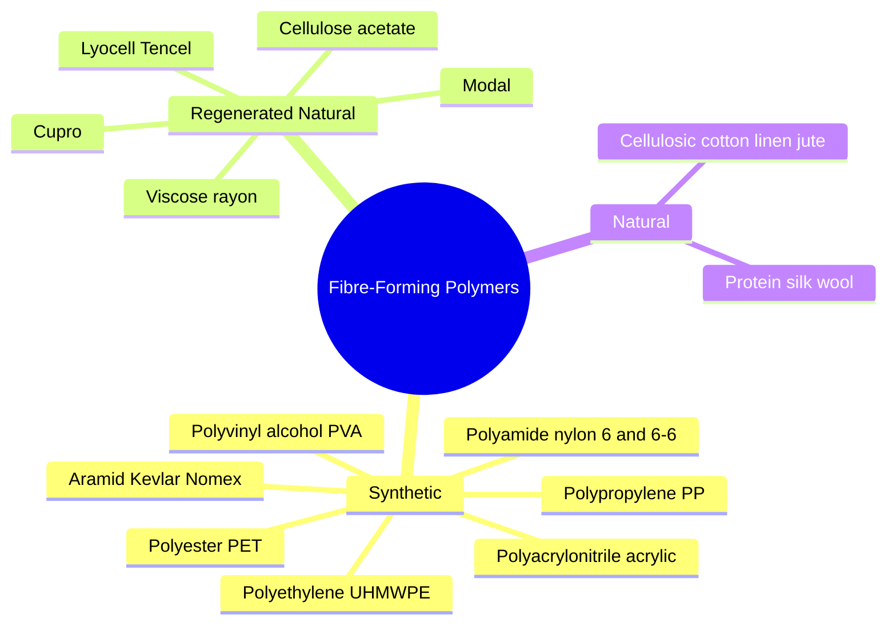
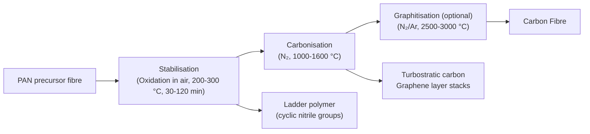

# 06 — Commonly Used Fibre-Forming Polymers

> **Syllabus Reference:** Topic 2 — Examples of commonly used fibre forming polymers, etc.

---

## Table of Contents

1. [What Makes a Polymer Fibre-Forming?](#1-what-makes-a-polymer-fibre-forming)
2. [Fibre Spinning Methods](#2-fibre-spinning-methods)
3. [Polyamides — Nylon 6 and Nylon 6,6](#3-polyamides--nylon-6-and-nylon-66)
4. [Polyesters — PET (Terylene / Dacron)](#4-polyesters--pet-terylene--dacron)
5. [Polyacrylonitrile — Acrylic Fibre](#5-polyacrylonitrile--acrylic-fibre)
6. [Polypropylene — PP Fibre](#6-polypropylene--pp-fibre)
7. [Polyvinyl Alcohol — Vinylon / Vinalon](#7-polyvinyl-alcohol--vinylon--vinalon)
8. [Regenerated Cellulosic Fibres](#8-regenerated-cellulosic-fibres)
9. [Natural Protein Fibres](#9-natural-protein-fibres)
10. [Specialty and High-Performance Fibres](#10-specialty-and-high-performance-fibres)
11. [Comparative Properties Table](#11-comparative-properties-table)
12. [Mathematical Examples](#12-mathematical-examples)
13. [References](#13-references)

---

## 1. What Makes a Polymer Fibre-Forming?

Not every polymer can be drawn into a continuous filament. Fibre formation requires a very specific combination of molecular and physical characteristics.

### 1.1 Essential Molecular Requirements

> **Definition (Fibre-forming polymer):** A polymer that can be drawn (spun) into a continuous filament with sufficient tensile strength, elongation at break, and thermal/chemical stability for practical textile use.

The requirements are:

1. **High molecular weight** ($\bar{M}_n \geq 15{,}000{-}30{,}000\,\text{g/mol}$; $\bar{X}_n > 100$)  
   Below this threshold, chains disentangle under drawing stress → filament breaks.

2. **Linear or near-linear chain architecture**  
   Highly branched or crosslinked chains cannot be drawn into aligned, crystalline fibre. Some controlled branching is acceptable (e.g., LLDPE for polyethylene fibre).

3. **Structural regularity for crystallinity**  
   Crystalline regions provide **tensile strength** and **dimensional stability**. Amorphous-only polymers are too weak or too plastic.

4. **Appropriate intermolecular forces**  
   - H-bonds (nylons, cellulose, PVA) → high tenacity
   - Dipole-dipole (polyester, PAN) → moderate cohesion
   - London dispersion (PP, PE) → weaker; requires high orientation

5. **Solubility or meltability** (for the spinning step)  
   The polymer must be either:
   - **Melt-spinnable:** $T_m < T_{\text{decomposition}}$ (nylon, PET, PP)
   - **Solution-spinnable:** dissolves in a suitable solvent (PAN in DMF; cellulose in NMMO)

6. **Stability to dyeing and finishing**  
   Must not degrade at processing temperatures (150–200 °C) or during alkaline/acid treatments.

### 1.2 Carothers' Criterion for Fibre Formation

Carothers established that for a flexible-chain polymer to form a useful fibre:

$$\bar{X}_n \geq 100 \quad \text{and preferably} \quad \bar{X}_n = 200{-}500$$

$$\text{Draw ratio (DR)} = \frac{L_{\text{drawn}}}{L_{\text{as-spun}}} \geq 3{-}6 \quad \text{(to achieve orientation)}$$

After drawing:
- Crystallinity increases from ~10–30 % (as-spun) to ~40–70 % (drawn)
- Birefringence increases (anisotropy indicator)
- Tenacity increases; elongation at break decreases

### 1.3 Classification of Fibre-Forming Polymers



---

## 2. Fibre Spinning Methods

Understanding the spinning method is inseparable from the polymer's properties:

### 2.1 Melt Spinning

**Applicable to:** Nylon 6, Nylon 6,6, PET, PP, PBT, PLA

```
Polymer chips/granules
       ↓ heat
Melt extruder (T = Tm + 30–80 °C)
       ↓
Spinneret (metal plate with holes, 100–500 μm dia.)
       ↓ quench air
Solidified filaments
       ↓
Take-up rolls
       ↓ draw (DR = 3–6×)
Drawn oriented fibre → winding
```

**Advantages:** No solvent; continuous; high throughput; lowest cost  
**Requirement:** $T_m < T_d$ (must melt before decomposing)

### 2.2 Wet Spinning

**Applicable to:** PAN (in DMF/NaSCN), viscose rayon, cupro, PVA, Spandex (PU)

```
Polymer solution (dope)
       ↓ pump
Spinneret submerged in coagulation bath
       ↓ solvent exchange
Gel filament coagulates
       ↓ wash / draw
Dried fibre
```

**Advantages:** Suitable for polymers that decompose before melting  
**Disadvantage:** Solvent recovery required; slower

### 2.3 Dry Spinning

**Applicable to:** Cellulose acetate (in acetone), PAN (in DMF), Spandex (Lycra)

```
Polymer solution (dope)
       ↓
Spinneret in heated chamber (100–300 °C)
       ↓ hot air evaporates solvent
Solid filament
       ↓ take-up
Fibre
```

### 2.4 Gel Spinning (Solution-Crystal Spinning)

**Applicable to:** UHMWPE (Spectra, Dyneema), PAN-based carbon fibre precursors

Semi-dissolved polymer → gel filament → ultra-drawing (DR up to 100×) → ultra-high modulus fibre

---

## 3. Polyamides — Nylon 6 and Nylon 6,6

### 3.1 Historical Background

- **W. H. Carothers** (DuPont) synthesised Nylon 6,6 in 1935; commercial production began 1939 (first toothbrush bristles; stockings 1940)
- **P. Schlack** (I.G. Farben, Germany) independently synthesised Nylon 6 from caprolactam in 1938
- Nylons remain the second-largest synthetic fibre group after polyesters

### 3.2 Nylon 6 — Polycaprolactam

**IUPAC name:** Poly(ε-caprolactam)  
**Repeating unit:** $[-\text{NH-(CH}_2)_5\text{-CO-}]_n$  
**Molecular formula of repeat:** $\text{C}_6\text{H}_{11}\text{NO}$; $M_0 = 113.16\,\text{g/mol}$

**Synthesis:** Hydrolytic ring-opening polymerisation of ε-caprolactam (see Topic 05):

$$n\,\varepsilon\text{-caprolactam} + \text{H}_2\text{O} \xrightarrow{250{-}270\,°\text{C},\, \text{VK tube}} [-\text{NH(CH}_2)_5\text{CO-}]_n + \text{H}_2\text{O}$$

**Industrial process (VK tube — Vereinfacht Kontinuierlich):**
1. Caprolactam + 0.3 % water + additives → top of VK tube
2. Temperature profile: 250–270 °C (top) → 255–260 °C (bottom)
3. Residence time: 10–12 hours
4. Exit melt: ~90 % conversion, $\bar{M}_n \approx 18{,}000\,\text{g/mol}$
5. Remaining monomer (8–10 %) extracted with hot water; recycled
6. Chip cut, dried, melt-spun at 260–280 °C

**Structure — hydrogen bonding:**

```
Nylon 6 chain:

    O   H   O   H   O
    ‖   |   ‖   |   ‖
─NH─C─(CH₂)₅─NH─C─(CH₂)₅─NH─C─
         ↕ H-bond ↕
─NH─C─(CH₂)₅─NH─C─(CH₂)₅─NH─C─
    ‖   H   ‖   H   ‖
    O       O       O
```

H-bonds between C=O and N–H of adjacent chains → stable, strong crystalline arrays

**Properties of Nylon 6:**

| Property | Typical Value |
|:---|:---:|
| $T_m$ | 215–220 °C |
| $T_g$ | 40–70 °C (dry) |
| Density | 1.14 g/cm³ |
| Tenacity (filament) | 3.5–7.0 cN/dtex |
| Elongation at break | 20–40 % |
| Moisture regain (65 % RH) | 4.0–4.5 % |
| Limiting oxygen index (LOI) | 20–22 % |

### 3.3 Nylon 6,6 — Polyhexamethylene Adipamide

**Repeating unit:** $[-\text{NH(CH}_2)_6\text{NHCO(CH}_2)_4\text{CO-}]_n$  
$M_0 = 226.32\,\text{g/mol}$

**Synthesis:** Melt condensation of Nylon salt at 270–280 °C:

$$n\,[\text{H}_3\overset{+}{\text{N}}(\text{CH}_2)_6\overset{+}{\text{NH}}_3][\overset{-}{\text{OOC}}(\text{CH}_2)_4\overset{-}{\text{COO}}] \xrightarrow{270{-}280\,°\text{C},\, \text{N}_2,\, \text{vacuum}} [\text{-NH(CH}_2)_6\text{NHCO(CH}_2)_4\text{CO-}]_n + 2n\,\text{H}_2\text{O}$$

**Commercial process:**
1. Salt dissolved in water (50 % solution, pH ≈ 7.3)
2. Concentration → evaporator → autoclave
3. Autoclave: heat to 270–280 °C, pressure 1.7 MPa (18 bar) → vent steam → vacuum finish
4. Target: $\bar{M}_n \approx 20{,}000{-}25{,}000\,\text{g/mol}$ for fibre grade
5. Melt-spin at 280–295 °C, quench, draw (DR = 4–5×)

**Crystal structure:** Nylon 6,6 has two hydrogen-bonded sheet directions:
- **α-form:** Triclinic; fully extended chains; more stable; H-bonds in two perpendicular planes → very high crystallinity (50–65 %)

**Properties of Nylon 6,6 vs Nylon 6:**

| Property | Nylon 6,6 | Nylon 6 |
|:---|:---:|:---:|
| $T_m$ | 265 °C | 215 °C |
| Density | 1.14 g/cm³ | 1.14 g/cm³ |
| Tenacity (filament) | 3.5–7.5 cN/dtex | 3.5–7.0 cN/dtex |
| Moisture regain | 4.2 % | 4.0 % |
| Ironing temperature | 200 °C | 170 °C |
| Abrasion resistance | Excellent | Excellent |
| UV resistance | Poor | Poor |

> 💡 **Nylon 6,6 has higher $T_m$ than Nylon 6** (265 vs 215 °C) because its symmetric chain allows denser H-bond packing. However, Nylon 6 is easier to recycle by simple depolymerisation back to monomer (caprolactam) — important for circular economy.

**Applications of Nylons:**
- Hosiery, lingerie (fine filament, 10–40 dtex)
- Carpets (BCF — bulk continuous filament)
- Technical textiles (industrial cord, airbag fabric, rope)
- Sportswear, swimwear

---

## 4. Polyesters — PET (Terylene / Dacron)

### 4.1 Historical Background

- **J. R. Whinfield** and **J. T. Dickson** (Calico Printers' Association, UK, 1941): patented PET and its fibre application
- Trade names: **Terylene** (ICI, UK), **Dacron** (DuPont, USA), **Trevira** (Hoechst, Germany), **Diolen**, **Lavsan** (USSR)
- PET is the **world's most produced synthetic polymer** (~100 million tonnes/year for all uses, 2024)
- Fibre accounts for ~60 % of PET use; bottle/packaging ~30 %

### 4.2 Chemical Structure

**Repeating unit:** $[-\text{O-CH}_2\text{CH}_2\text{-O-CO-C}_6\text{H}_4\text{-CO-}]_n$  
**Chemical name:** Poly(ethylene terephthalate)  
$M_0 = 192.17\,\text{g/mol}$

**Structural formula (one repeat):**

```
         O            O
         ‖            ‖
    ─O─CH₂─CH₂─O─C─⬡─C─
         (MEG unit) (TPA unit)
```

The **phenyl ring** confers:
- Rigidity (high $T_m$)
- Hydrophobicity (low moisture regain)
- UV resistance (modest)

### 4.3 Synthesis

**Commercial route 1 — Direct esterification (DA, modern preferred):**

**Stage 1: Esterification (EI)**
$$n\,\text{TPA} + n\,\text{MEG} \xrightarrow{240{-}260\,°\text{C},\, \text{Sb}_2\text{O}_3 \text{ (cat.)}} n\,\text{BHET} + n\,\text{H}_2\text{O} \uparrow$$

(BHET = bis(2-hydroxyethyl) terephthalate)

**Stage 2: Polycondensation (PC)**
$$n\,\text{BHET} \xrightarrow{270{-}290\,°\text{C},\, \text{vacuum} < 1\,\text{mmHg},\, \text{Sb}_2\text{O}_3} [\text{-O-CH}_2\text{CH}_2\text{-O-CO-C}_6\text{H}_4\text{-CO-}]_n + n\,\text{MEG} \uparrow$$

Water and MEG removed under vacuum to drive equilibrium toward high-MW polymer.

**Commercial route 2 — Transesterification (DMT route):**

$$n\,\text{CH}_3\text{OOC-C}_6\text{H}_4\text{-COOCH}_3 + 2n\,\text{MEG} \xrightarrow{150{-}200\,°\text{C},\, \text{Mn(OAc)}_2} n\,\text{BHET} + 2n\,\text{CH}_3\text{OH} \uparrow$$

Then polycondensation as above.

### 4.4 Solid-State Polymerisation (SSP) — Achieving High MW

For very high MW PET (IV > 0.80 dL/g, used in industrial yarns, tyre cord):

Melt-polymerised chips ($\bar{M}_n \approx 20{,}000$) are:
1. Crystallised at 160–180 °C (to prevent sintering)
2. Reacted in solid state at 200–220 °C under N₂ or vacuum for 8–24 h
3. End-group reaction continues at reduced mobility → MW increases to $\bar{M}_n \approx 50{,}000{-}100{,}000$

**Intrinsic viscosity (IV)** is the standard measure for PET MW:

$$[\eta] = K_a\,\bar{M}_v^{a}$$

Polymer in o-chlorophenol at 25 °C: $K_a = 4.68 \times 10^{-4}$, $a = 0.68$ (Mark-Houwink constants)

| Application | IV (dL/g) | $\bar{M}_v$ (approx.) |
|:---|:---:|:---:|
| Textile filament | 0.55–0.67 | 25,000–30,000 |
| Staple fibre | 0.60–0.70 | 28,000–33,000 |
| Tire cord | 0.85–0.95 | 50,000–65,000 |
| PET bottle | 0.74–0.80 | 40,000–48,000 |

### 4.5 Structure and Properties

**Crystal structure:** Triclinic unit cell; $T_m = 265\,°\text{C}$; $T_g = 67\,°\text{C}$ (dry)  
**Crystallinity:** As-spun ~10–15 %; after drawing + heat-setting → 40–60 %

**Properties of PET fibre:**

| Property | Typical Value |
|:---|:---:|
| $T_m$ | 255–265 °C |
| $T_g$ | 67–80 °C |
| Density (crystalline) | 1.455 g/cm³ |
| Tenacity (drawn) | 3.5–7.0 cN/dtex |
| Elongation at break | 15–35 % |
| Elastic recovery (5 % ext.) | ~95 % |
| Moisture regain (65 % RH) | **0.4 %** (very hydrophobic) |
| LOI | 20–21 % |
| Acid resistance | Good |
| Alkali resistance | Poor (hydrolysis) |

> ⚠️ **Alkali hydrolysis of PET:** NaOH attacks ester bonds → terephthalate + glycolate. Used industrially for **weight reduction finishing** (subtract) and **chemical recycling** (glycolysis, aminolysis).

**Disperse dyeing:** PET's low moisture regain and tight hydrophobic structure require **disperse dyes** applied at 125–130 °C under pressure, or using swelling carriers.

### 4.6 Applications

| Market Segment | Specific Use |
|:---|:---|
| Apparel | Shirts, suits, outerwear, sportswear |
| Home textiles | Curtains, upholstery, bedding |
| Technical | Tyre cord (high-tenacity), airbags, filtration |
| Filling | Polyester wadding, pillows |
| Nonwovens | Geotextiles, filtration media |

---

## 5. Polyacrylonitrile — Acrylic Fibre

### 5.1 Definition and Structure

**IUPAC name:** Poly(acrylonitrile) — PAN  
**Repeating unit:** $[-\text{CH}_2\text{-CH(CN)-}]_n$  
$M_0 = 53.06\,\text{g/mol}$

**Structural formula:**

```
         CN   CN   CN   CN
         |    |    |    |
─CH₂─CH─CH₂─CH─CH₂─CH─CH₂─CH─
```

The **nitrile (CN) groups** are highly polar, creating strong dipole-dipole interactions **within** each chain (intrachain) as well as between chains (interchain). This creates a near-helical conformation (pseudo-crystalline), sometimes called the **disordered lateral order** model.

### 5.2 Synthesis

**Free radical solution polymerisation (industrial):**

$$n\,\text{CH}_2{=}\text{CHCN} \xrightarrow{K_2\text{S}_2\text{O}_8\text{ or AIBN, DMF or DMSO, 50-70°C}} [-\text{CH}_2\text{-CHCN-}]_n$$

**Typical comonomer composition for fibre-grade PAN:**
- Acrylonitrile: 85–93 % (defines "acrylic" per ISO/BISFA)
- Comonomers improve solubility, dye-uptake, softness:

| Comonomer | Function | Level |
|:---|:---|:---:|
| Methyl acrylate (MA) | Reduce brittleness, improve hand | 5–10 % |
| Vinyl acetate (VAc) | Improve solubility | 3–8 % |
| Methacrylic acid (MAA) | Cationic dye sites | 0.5–2 % |
| Sodium allyl sulfonate | Cationic dye sites | 0.5–1 % |
| Itaconic acid | Anionic dye sites | 1–3 % |

> **If AN content < 85 %:** fibre is classified as **modacrylic** (modified acrylic). Examples: Verel, Dynel (Saran/Dynel copolymers with VCl₂ → inherently flame-retardant).

### 5.3 Wet Spinning of PAN

PAN decomposes at ~300 °C before melting → must be solution-spun.

**Solvents used industrially:**

| Solvent | Dope concentration | Coagulation bath |
|:---|:---:|:---|
| DMF (dimethylformamide) | 25–30 % | DMF/H₂O (20–40 % DMF) |
| DMSO (dimethyl sulfoxide) | 25–30 % | H₂O |
| NaSCN (51–55 wt % aq.) | 10–15 % | NaSCN/H₂O (dilute) |
| NaNO₃ (aq.) | 20 % | H₂O |
| Dimethylacetamide (DMAc) | 25 % | DMAc/H₂O |

**Steps:**
1. PAN dissolved in DMF at 50–60 °C → filtered dope
2. Extruded through spinneret into DMF/H₂O bath (30–40 °C)
3. Solvent diffuses out; water diffuses in → coagulation/gelation
4. Filaments stretched in hot water (90–98 °C; DR = 8–12×)
5. Washing, oil application, crimping (gear crimper), drying → **acrylic tow**
6. Cut to staple length (38–150 mm) → **acrylic staple**

### 5.4 Properties

| Property | Value |
|:---|:---:|
| $T_g$ | 85–100 °C |
| Decomposition temperature | ~300 °C (no $T_m$) |
| Density | 1.17–1.18 g/cm³ |
| Tenacity (staple) | 2.0–4.0 cN/dtex |
| Elongation at break | 25–50 % |
| Moisture regain | 1.5–2.0 % |
| LOI | 17–18 % (low — flammable) |
| UV resistance | Excellent (nitrile absorbs UV) |

**Appearance and handle:**  
PAN staple resembles wool — warm handle, good bulk, excellent dyeability with basic (cationic) dyes (using sulfonate/acid comonomer sites) or acid dyes.

### 5.5 PAN as Carbon Fibre Precursor

PAN-based carbon fibre (PAN-CF) is the dominant CF variety (>95 % of market):

**PAN → CF process:**



**Ladder polymer formation (oxidative stabilisation):**

$$[-\text{CH}_2\text{-CH(CN)-}]_n \xrightarrow{[\text{O}_2],\, 250\,°\text{C}} \text{cyclic imino structure (ladder polymer)} \xrightarrow{\Delta} \text{carbon structure}$$

The CN groups cyclise by electrophilic/radical process → fused 6-membered ring ladder structure → prevents chain fusion during carbonisation.

**Final CF properties (PAN-based T300 grade):**

| Property | Value |
|:---|:---:|
| Tensile modulus | 230 GPa |
| Tensile strength | 3,530 MPa |
| Density | 1.76 g/cm³ |
| Diameter | 6–8 μm |

---

## 6. Polypropylene — PP Fibre

### 6.1 Structure and Requirements

**IUPAC name:** Poly(propylene)  
**Repeating unit:** $[-\text{CH}_2\text{-CH(CH}_3\text{)-}]_n$  
$M_0 = 42.08\,\text{g/mol}$

**Only isotactic PP (iPP) is suitable for fibre!**

- Isotactic PP: $T_m = 165\,°\text{C}$; $T_g = 0\,°\text{C}$; crystallinity 55–65 %
- Atactic PP: amorphous; sticky; no fibre application
- Syndiotactic PP: $T_m = 130\,°\text{C}$; some fibre potential but limited

**Produced by:** Ziegler-Natta or metallocene coordination polymerisation (see Topic 05)

### 6.2 Synthesis Recap

$$n\,\text{CH}_2{=}\text{CHCH}_3 \xrightarrow{\text{TiCl}_4/\text{MgCl}_2 + \text{AlEt}_3,\, 70\,°\text{C},\, 2\,\text{MPa}} \underbrace{[-\text{CH}_2\text{-CH(CH}_3)-]_n}_{\textit{isotactic}\, \text{PP}} \quad \text{tacticity} > 97\,\%$$

### 6.3 Melt Spinning of PP Fibre

PP is melt-spun because $T_m = 165\,°\text{C}$ is well below $T_d \approx 350\,°\text{C}$:

**Process:**
1. Pellets dried (though PP is non-hygroscopic — mainly for uniformity)
2. Extruded at 225–260 °C
3. Quenched in air (or water ring)
4. Drawn at 120–140 °C (DR = 3–6×) → orientation of iPP helices
5. Annealed (heat-set) at 120–140 °C for dimensional stability

### 6.4 Helical Structure of iPP

In the crystalline state, isotactic PP adopts a **3₁ helix** (3 repeat units per turn):

```
Isotactic PP helix (side view):

     CH₃     CH₃     CH₃
      |        |        |
  ─CH₂─CH─CH₂─CH─CH₂─CH─
     ↗              ↗
  helix (3 units per turn, 0.65 nm pitch)
```

This helical packing (not flat zigzag as in nylon/PET) makes drawing more complex and limits achievable orientation compared to nylons.

### 6.5 Properties

| Property | Value |
|:---|:---:|
| $T_m$ (iPP) | 165 °C |
| $T_g$ | 0 °C |
| Density | 0.91 g/cm³ (**lightest commercial textile fibre**) |
| Tenacity (BCF) | 2.0–4.0 cN/dtex |
| Elongation at break | 30–80 % |
| Moisture regain | **0 %** (completely hydrophobic) |
| LOI | 17–18 % (flammable) |
| Chemical resistance | Excellent (acids, alkalis) |

### 6.6 Dyeability Problem and Solutions

PP has:
- No polar groups → no affinity for any conventional dye class
- $T_g = 0\,°\text{C}$ → no thermal relaxation above $T_g$ at room temperature

**Solutions:**
1. **Mass (dope) dyeing:** Pigments/dyes blended into melt before spinning → uniform colour; no subsequent dyeing; excellent lightfastness
2. **Chemical modification:** Graft copolymerisation of acrylic acid or maleic anhydride → introduces dye sites
3. **Bicomponent fibres:** PP core + acid-dyeable nylon or PET sheath

### 6.7 Applications

| Sector | Specific Use |
|:---|:---|
| Apparel | Lightweight sportswear, thermal underwear (moisture wicking) |
| Home textiles | BCF carpet (largest use, ~40 % of PP fibre) |
| Nonwovens | Spunbond/meltblown geotextiles, medical disposables |
| Ropes/cordage | Marine ropes, baling twine (cheap, rot-proof) |
| Technical | Filter fabrics, agricultural nets |

---

## 7. Polyvinyl Alcohol — Vinylon / Vinalon

### 7.1 Special Synthesis Route

**PVA cannot be made by direct polymerisation** — vinyl alcohol (CH₂=CHOH) does not exist as a stable molecule (tautomerises immediately to acetaldehyde):

$$\text{CH}_2{=}\text{CHOH} \rightleftharpoons \text{CH}_3\text{CHO} \quad (\text{thermodynamically strongly favoured})$$

**Indirect route via PVAc:**

**Step 1 — Polymerise vinyl acetate (VAc) by free radical mechanism:**
$$n\,\text{CH}_2{=}\text{CHOOCCH}_3 \xrightarrow{\text{BPO or AIBN, MeOH, 60°C}} [-\text{CH}_2\text{-CH(OOCCH}_3)\text{-}]_n \quad (\text{PVAc})$$

**Step 2 — Saponification (transesterification) in methanol/NaOH:**
$$[-\text{CH}_2\text{-CH(OOCCH}_3)-]_n + n\,\text{NaOH} \xrightarrow{\text{MeOH}} \underbrace{[-\text{CH}_2\text{-CH(OH)-}]_n}_{\text{PVA}} + n\,\text{CH}_3\text{COONa}$$

**Degree of hydrolysis (DH):**
- DH > 99 %: fully hydrolysed PVA → strong H-bonding → insoluble in cold water
- DH = 88 %: partially hydrolysed PVA → soluble in cold water

### 7.2 Fibre Spinning — Wet Spinning with Insolubilisation

PVA is wet-spun and then **acetalized** with formaldehyde to make it water-resistant:

```
PVA solution (10–15 % in H₂O)
       ↓ wet spinning into Na₂SO₄ (coagulation bath)
PVA filaments
       ↓ draw (hot; DR = 5–7×)
       ↓ acetalisation with HCHO / H₂SO₄ at 70°C
Cross-linked PVA (acetal bonds ─O─CH₂─O─ bridging OH groups)
       ↓
Vinylon / Vinalon fibre
```

**Acetalisation reaction:**

$$2\,(-\text{CH(OH)-}) + \text{HCHO} \xrightarrow{\text{H}^+} (-\text{CH-O-CH}_2\text{-O-CH-}) + \text{H}_2\text{O}$$

This **crosslinking** converts water-soluble PVA into a water-stable fibre.

### 7.3 Properties and Applications

| Property | Value |
|:---|:---:|
| $T_m$ | 220–240 °C (partially crystalline) |
| $T_g$ | 85 °C |
| Density | 1.26–1.30 g/cm³ |
| Tenacity | 5.0–8.0 cN/dtex (high!) |
| Elongation | 15–30 % |
| Moisture regain | 4.5–5.0 % |
| Chemical resistance | Excellent (acid and alkali) |
| Biodegradability | Moderate (enzymatic degradation) |

**Applications:**
- Rubber reinforcement (hoses, belts) — high tenacity
- Fishing nets, ropes (water resistance after acetalisation)
- Construction materials (asbestos substitute, cement reinforcement)
- Medical: PVA hydrogel for contact lenses, wound dressings

---

## 8. Regenerated Cellulosic Fibres

Regenerated (man-made cellulosic) fibres are produced by dissolving natural cellulose and regenerating it in fibre form. The polymer chain is the same, but the physical structure differs from native cellulose (Cellulose I → Cellulose II upon regeneration).

### 8.1 Viscose Rayon

**Process:** Xanthate process (see Topic 04 for reactions)

**Properties:**

| Property | Viscose Rayon | Cotton (reference) |
|:---|:---:|:---:|
| DP | 250–500 | 2,000–10,000 |
| Tenacity (dry) | 2.0–2.6 cN/dtex | 3.0–5.0 cN/dtex |
| Tenacity (wet) | 1.0–1.5 cN/dtex | 3.5–5.5 cN/dtex |
| Elongation (dry) | 15–30 % | 7–9 % |
| Moisture regain | 11–13 % | 7–8 % |
| LOI | 17–18 % | 17 % |

**Wet strength is markedly lower than dry** (viscose is characteristically weak when wet) — a major limitation compared to cotton.

**Variants:**
- **Modal:** Higher DP (500–600), higher draw ratio → higher wet strength (>2.5 cN/dtex wet), softer hand
- **High-wet-modulus (HWM) rayon (Polynosic):** Very high draw ratio; wet modulus comparable to cotton; dry cleaning possible

### 8.2 Lyocell (Tencel)

**Solvent:** N-methylmorpholine-N-oxide (NMMO) monohydrate — non-toxic, >99 % recovered  
**Process:** Direct dissolution → air-gap wet spinning (NMMO/H₂O coagulation)

**Properties vs Viscose:**

| Property | Lyocell (Tencel) | Viscose |
|:---|:---:|:---:|
| Tenacity (dry) | 4.0–5.0 cN/dtex | 2.0–2.6 cN/dtex |
| Tenacity (wet) | 3.3–4.0 cN/dtex | 1.0–1.5 cN/dtex |
| Elongation | 14–16 % | 15–30 % |
| Stiffness | Higher | Lower |
| Fibrillation tendency | High (controlled by enzyme) | Low |
| Sustainability | High (closed-loop solvent) | Lower (CS₂ toxic) |

**Lyocell's fibrillation:** Longitudinal splitting of fibre on wet abrasion → peach-skin/suede-like surface when controlled by enzymatic treatment. Can also be a fault if uncontrolled.

### 8.3 Cupro and Acetate (Brief)

**Cupro (Cupra):** Cellulose dissolved in Schweizer's reagent ([Cu(NH₃)₄](OH)₂) → wet-spun into H₂SO₄/H₂O → regenerated cellulose II; very fine filaments (1–2 dtex); silk-like; niche market for lining fabrics.

**Cellulose acetate:** DS ≈ 2.4; dissolved in acetone → **dry-spun**; inherently semidull; cigarette tow largest use. Biodegradable over months (not permanently synthetic).

---

## 9. Natural Protein Fibres

### 9.1 Silk (Silk Fibroin from *Bombyx mori*)

**Primary structure:** 
- Repeating hexapeptide: (Gly-Ala-Gly-Ala-Gly-Ser)ₙ
- ~43 % Glycine, ~30 % Alanine, ~12 % Serine
- Total MW of raw silk fibroin: ~300,000 g/mol (heavy chain ~350 kDa + light chain ~26 kDa, linked by SS bond)

**Secondary structure — β-pleated sheet:**

```
Antiparallel β-sheet (silk I → silk II on processing):

→ Gly-Ala-Gly-Ala-Gly-Ser →
        H-bond ↕↕
← reS-ylG-alA-ylG-alA-ylG ←
```

Flat β-sheets stack via van der Waals forces between Ala methyl groups.

**Degumming:** Removal of sericin (silk gum, ~25 % by mass) by boiling in soap/Na₂CO₃:

$$\text{Raw silk (fibroin + sericin)} \xrightarrow{\text{0.3 % Na}_2\text{CO}_3,\, 95\,°\text{C},\, 30\,\text{min}} \text{degummed fibroin (brilliant white)} + \text{sericin solution}$$

**Properties:**

| Property | Value |
|:---|:---:|
| Linear density | 1–4 dtex (filament) |
| Tenacity | 2.6–4.0 cN/dtex |
| Elongation | 15–25 % |
| Moisture regain | 9–11 % |
| Density | 1.34 g/cm³ |
| Birefringence | 0.058 (high crystalline orientation) |

**Dyeing:** Acid dyes (on –NH₂ and –OH groups); reactive dyes; natural dyes (good affinity).  
**Sensitivity:** Degraded by strong alkali (NaOH hydrolyses peptide bonds); damaged by prolonged UV; denatured by reducing agents.

### 9.2 Wool — Keratin Fibre

**Source:** Merino sheep fleece (~40 % of world wool production), cross-bred sheep, specialty wools (cashmere, mohair, angora, alpaca)

**Structure:**
- Polypeptide chains of α-amino acids; ~18 amino acids; MW ~45,000–65,000 g/mol per chain
- Rich in **cystine** (disulfide bond), proline, tyrosine
- **α-helical** secondary structure → coiled-coil → macrofibril → cortical cell → fibre

**Three types of intermolecular bonds in wool:**

| Bond Type | Location | Significance |
|:---|:---|:---|
| Disulfide (–S–S–) | Cystine crosslinks | Chemical resistance; controls setting |
| H-bonds (C=O···H–N) | Between helix turns | Mechanical stability; broken by water |
| Salt bridges (–NH₃⁺ ···⁻OOC–) | Ionic, pH-dependent | Dyeing sites; water solubility of zwitterion |

**Wool's unique mechanical property — rubber-like elasticity:**  
α-helices unfold to β-sheet under tension (Woolfox transformation), recovering on release. True rubber elasticity:

$$\text{Force} = NkT\left(\lambda - \frac{1}{\lambda^2}\right) \quad \text{(Gaussian network, }N\text{ = chain segments, }\lambda = L/L_0\text{)}$$

**Felting:** Wool fibres felt under heat, moisture, and mechanical action because of **directional friction effect (DFE)** — scale structure causes differential friction (root-to-tip vs tip-to-root). Can be suppressed by:
1. Chlorine-Hercosett treatment (permanent antifelt finish)
2. Plasma treatment
3. Biopolymer coating

**Properties:**

| Property | Wool |
|:---|:---:|
| Diameter | 15–40 μm (breed-dependent) |
| Tenacity | 1.0–2.0 cN/dtex (weakens wet) |
| Elongation | 25–50 % |
| Moisture regain | **14–16 %** (highest of all common fibres) |
| LOI | 25 % (inherently flame-resistant) |
| $T_g$ | 195 °C (bone-dry); 50 °C (wet) |

---

## 10. Specialty and High-Performance Fibres

### 10.1 Aramid Fibres — Para- and Meta-Aramid

**Para-aramid (Kevlar, Twaron):** Poly(p-phenylene terephthalamide) — PPTA

$$n\,\text{p-PPD} + n\,\text{TCl}\text{-C}_6\text{H}_4\text{-COCl} \xrightarrow{\text{NMP/CaCl}_2,\, 5\,°\text{C}} [-\text{NH-C}_6\text{H}_4\text{-NH-CO-C}_6\text{H}_4\text{-CO-}]_n + n\,\text{HCl}$$

Spun from **liquid crystal** solution in H₂SO₄ (dry-jet wet spinning) → rod-like chains align in flow → extraordinary fibre orientation without post-draw.

| Property | Kevlar 29 | Kevlar 49 |
|:---|:---:|:---:|
| Tenacity | 28 cN/dtex | 24 cN/dtex |
| Tensile modulus | 514 cN/dtex | 1050 cN/dtex |
| Elongation | 3.6 % | 2.4 % |
| Density | 1.44 g/cm³ | 1.44 g/cm³ |

**Application:** Bulletproof vests, cut-resistant gloves, aerospace composites, tyres (Kevlar 29).

**Meta-aramid (Nomex):** Poly(m-phenylene isophthalamide) — random chain; no LC spinning; solution-spun from DMAc/LiCl.  
**Application:** Flame-resistant protective workwear; aircraft interior; racing suits (Nomex suits, F1).

### 10.2 UHMWPE Fibre (Spectra, Dyneema)

**Ultra-high-molecular-weight polyethylene:** $\bar{M}_w = 3{-}6 \times 10^6\,\text{g/mol}$ ($\bar{X}_n \approx 100{,}000{-}200{,}000$)

**Gel spinning:** Dissolved in decalin (decahydronaphthalene) → gel filament → ultra-drawn (DR up to 100×) at 130 °C → chain extended crystals, near-theoretical crystal modulus:

$$E_{\text{crystal (PE)}} = 320\,\text{GPa} \quad (\text{theoretical C-C backbone})$$

| Property | UHMWPE Spectra 1000 |
|:---|:---:|
| Tenacity | 32 cN/dtex |
| Modulus | 1,200 cN/dtex |
| Density | 0.97 g/cm³ |
| Moisture regain | 0 % |
| Chemical resistance | Excellent |
| Max use temperature | 100–115 °C (limited) |

**Application:** Cut-resistant gloves (ANSI A9+), ballistic protection, mooring lines, medical prosthetics.

---

## 11. Comparative Properties Table

| Fibre | $T_m$ (°C) | Tenacity (cN/dtex) | Elongation (%) | Moisture regain (%) | Density (g/cm³) | LOI (%) | Dye class |
|:---|:---:|:---:|:---:|:---:|:---:|:---:|:---|
| **Nylon 6** | 215 | 3.5–7.0 | 20–40 | 4.0 | 1.14 | 20 | Acid, metal-complex |
| **Nylon 6,6** | 265 | 3.5–7.5 | 15–35 | 4.2 | 1.14 | 20 | Acid, metal-complex |
| **PET** | 265 | 3.5–7.0 | 15–35 | **0.4** | 1.38 | 21 | Disperse |
| **Acrylic (PAN)** | — (no $T_m$) | 2.0–4.0 | 25–50 | 1.5 | 1.18 | 17 | Basic (cationic) |
| **Polypropylene** | 165 | 2.0–5.0 | 30–80 | **0** | **0.91** | 17 | (pigment only) |
| **PVA (Vinylon)** | 220 | 5.0–8.0 | 15–30 | 5.0 | 1.28 | — | Reactive, direct |
| **Viscose rayon** | — | 2.0–2.6 | 15–30 | **11–13** | 1.52 | 17 | Direct, reactive, vat |
| **Lyocell** | — | 4.0–5.0 | 14–16 | 11 | 1.51 | 17 | Direct, reactive |
| **Cotton** | — | 3.0–5.0 | 7–9 | 7–8 | 1.52 | 17 | Direct, reactive, vat |
| **Wool** | — | 1.0–2.0 | 25–50 | **14–16** | 1.32 | **25** | Acid, reactive |
| **Silk** | — | 2.6–4.0 | 15–25 | 9–11 | 1.34 | 23 | Acid, reactive |
| **Kevlar 29** | >500 (decomposes) | **28** | 3.6 | 4.3 | 1.44 | **29** | (difficult) |
| **UHMWPE** | 150 | **32** | 3.5 | 0 | 0.97 | — | (pigment only) |

---

## 12. Mathematical Examples

### Example 1 — Mark-Houwink Equation for PET Molecular Weight

> **Problem:** A PET sample in o-chlorophenol at 25 °C has an intrinsic viscosity $[\eta] = 0.625\,\text{dL/g}$. Calculate the viscosity-average molecular weight $\bar{M}_v$. (For PET in o-chlorophenol at 25 °C: $K_a = 4.68 \times 10^{-4}\,\text{dL/g}$, $a = 0.68$)

**Using Mark-Houwink equation:** $[\eta] = K_a\,\bar{M}_v^a$

$$\bar{M}_v = \left(\frac{[\eta]}{K_a}\right)^{1/a} = \left(\frac{0.625}{4.68 \times 10^{-4}}\right)^{1/0.68}$$

$$= (1335.5)^{1.471} = (1335.5)^{1.471}$$

$$\log(\bar{M}_v) = \frac{1}{0.68} \times \log(1335.5) = 1.471 \times 3.1257 = 4.597$$

$$\bar{M}_v = 10^{4.597} = \boxed{39{,}540\,\text{g/mol} \approx 39.5\,\text{kDa}}$$

> This IV corresponds to **bottle-grade PET** ($[\eta] = 0.60{-}0.68\,\text{dL/g}$). Textile filament PET uses $[\eta] = 0.55{-}0.67\,\text{dL/g}$.

---

### Example 2 — Degree of Polymerisation and Number of Chain Repeat Units

> **Problem:** Commercial Nylon 6 for apparel has $\bar{M}_n = 18{,}000\,\text{g/mol}$. Calculate:  
> (a) $\bar{X}_n$  
> (b) The average length of one polymer chain (C–N bond = 0.147 nm, C–C bond = 0.154 nm; tetrahedral geometry, bond angle 109.5°; take backbone bonds per repeat unit = 6)

**Part (a):**
$$\bar{X}_n = \frac{\bar{M}_n}{M_0} = \frac{18{,}000}{113.16} = \boxed{159}$$

**Part (b) — Contour length (fully extended, all-trans):**

6 backbone bonds per repeat unit × average bond length:  
Backbone bonds: 5 × C–C + 1 × C–N per repeat (caprolactam derived: –NH–(CH₂)₅–CO–)  
Backbone bond length average: $(5 \times 0.154 + 1 \times 0.147)/6 \approx 0.153\,\text{nm}$

Length per repeat (fully extended, projection factor $\sin(109.5°/2) = 0.816$):

$$l_0 = 6 \times 0.153 \times \sin(54.75°) = 6 \times 0.153 \times 0.816 = 0.749\,\text{nm per repeat}$$

Total contour length:
$$L_{\text{contour}} = \bar{X}_n \times l_0 = 159 \times 0.749 = \boxed{119\,\text{nm} \approx 0.12\,\mu\text{m}}$$

Compare to a nylon fibre filament of 25 μm diameter → a single polymer chain is 200× shorter than the fibre is wide, yet thousands of chains arranged in crystalline + amorphous domains give the fibre its strength.

---

### Example 3 — Draw Ratio and Crystallinity Relationship (PET)

> **Problem:** As-spun PET filament has crystallinity $\chi_c = 12\,\%$ and density $\rho_0 = 1.336\,\text{g/cm}^3$. After drawing to DR = 4.5, crystallinity rises to $\chi_c = 45\,\%$. Densities: crystalline PET $\rho_c = 1.455\,\text{g/cm}^3$; amorphous PET $\rho_a = 1.335\,\text{g/cm}^3$.  
> Verify the crystallinity values using the density method.

**Density method for crystallinity:**

$$\chi_c = \frac{\rho_c(\rho - \rho_a)}{\rho(\rho_c - \rho_a)}$$

**As-spun:**

$$\chi_c = \frac{1.455 \times (1.336 - 1.335)}{1.336 \times (1.455 - 1.335)} = \frac{1.455 \times 0.001}{1.336 \times 0.120} = \frac{0.001455}{0.16032} = 0.0091 \approx \boxed{0.9\,\%}$$

> Note: The discrepancy from 12 % reflects that density measurement (solid-state) underestimates crystallinity vs. wide-angle X-ray diffraction (WAXD), which gives ~12 % for as-spun PET. The true $\rho$ at 12 % crystallinity would be:

$$\rho = \frac{\rho_a\,\rho_c}{\chi_c(\rho_a - \rho_c) + \rho_c} = \frac{1.335 \times 1.455}{0.12(1.335 - 1.455) + 1.455} = \frac{1.942}{0.12(-0.12) + 1.455} = \frac{1.942}{1.4406} \approx 1.348\,\text{g/cm}^3$$

This illustrates that density measurement is less sensitive at low crystallinity — WAXD is preferred for as-spun samples.

---

## 13. References

1. **Mather, R. R. & Wardman, R. H.** (2015). *The Chemistry of Textile Fibres* (2nd ed.). RSC. → [RSC Publishing](https://pubs.rsc.org/en/content/ebook/978-1-84973-887-8) — **Best single reference for this topic**
2. **Hearle, J. W. S. & Peters, R. H.** (Eds.) (1963). *Fibre Structure*. Butterworth. → Classic structural reference
3. **Morton, W. E. & Hearle, J. W. S.** (2008). *Physical Properties of Textile Fibres* (4th ed.). Woodhead/CRC Press. → [Publisher](https://www.sciencedirect.com/book/9781845692209/physical-properties-of-textile-fibres)
4. **Gupta, V. B. & Kothari, V. K.** (Eds.) (1997). *Manufactured Fibre Technology*. Chapman & Hall. → Nylon, PET, PAN, PP chapters
5. **Perepelkin, K. E.** (2002). "Polymeric fibres — general principles of production and fibre structure." *Fibre Chemistry*, 34(5), 319–342.
6. **Textile School** — Fibre properties database: <https://www.textileschool.com/textiles/fibre/>
7. **The Fiber Year** — Global fibre production statistics (annual report, 2024): <https://www.thefiberyear.com>
8. **LibreTexts** — Polymers in industry: <https://chem.libretexts.org/Bookshelves/Polymer_Chemistry/Polymer_Chemistry_(Suter)/07>
9. **Teijin** — Teijin fibre technology resources: <https://www.teijin.com/products/fibers/>
10. **DuPont** — Kevlar technical guide: <https://www.dupont.com/products/kevlar.html>
11. **Lenzing AG** — Lyocell / Tencel technology: <https://www.lenzing.com/products/tencel>
12. **Wikipedia** — Polyethylene terephthalate: <https://en.wikipedia.org/wiki/Polyethylene_terephthalate>
13. **Wikipedia** — Nylon (overview with chemistry): <https://en.wikipedia.org/wiki/Nylon>
14. **BISFA** (Bureau International pour la Standardisation des Fibres Artificielles) — Fibre classification rules: <https://www.bisfa.org>
15. **Elias, H.-G.** (2009). *Macromolecules Vol. 4: Applications of Polymers*. Wiley-VCH. → Fibre application chapters
16. **Wikimedia Commons** — Fibre structure diagrams: <https://commons.wikimedia.org/wiki/Category:Textile_fibres>

---

> 📅 **Last Updated:** June 06, 2026
> 🏫 **Course:** WPE-101 — Wet Processing Engineering | Bangladesh University of Textiles (BUTEX)
> ✍️ **Maintainer:** [itachi-re](https://github.com/itachi-re)
>
> **← Previous:** [05 — Synthesis of Polymers](./05-synthesis-of-polymers.md)
> **→ Back to:** [WPE-101 README](./README.md)
