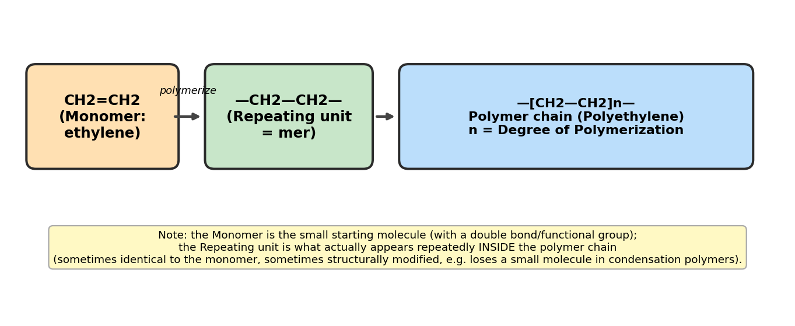
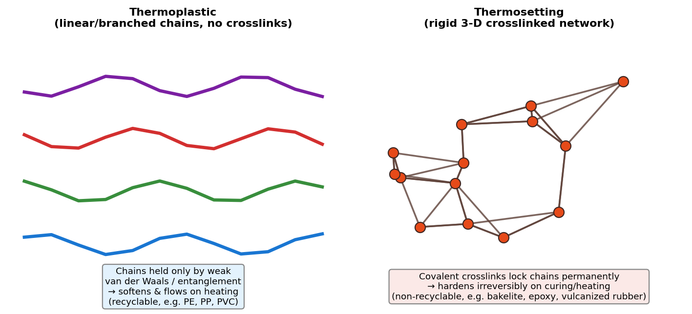
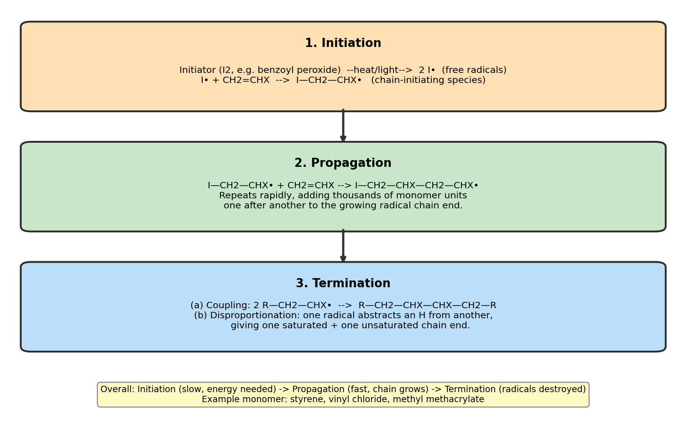

# WPE-101 Polymer Science — Classtest Notes (10 Marks)

## Q1. Distinguish between the following pairs (with examples)

### 1️⃣ Monomer vs Repeating Unit

| | Monomer | Repeating Unit |
|---|---|---|
| **Definition** | The small, simple molecule that undergoes polymerization | The structural unit that actually repeats *inside* the finished polymer chain |
| **State** | Free molecule, exists before reaction | Bonded unit, exists only within the chain |
| **Size vs polymer** | Building block, reacts to lose its double bond/functional group | May be identical to monomer (addition polymers) or smaller than it (condensation polymers, since small molecules like H₂O are eliminated) |
| **Example** | Ethylene, CH₂=CH₂ | —CH₂—CH₂— (in polyethylene) |

> **Key exam line:** In addition polymerization the repeating unit = monomer unit (just the double bond opens up), but in condensation polymerization the repeating unit ≠ monomer, because a small molecule (H₂O, HCl, etc.) is lost at each linkage — e.g., in Nylon-6,6 the repeating unit excludes the water eliminated during amide-bond formation.

---

### 2️⃣ Oligomer vs Degree of Polymerization (DP)

- **Oligomer:** A molecule made of only a *few* repeating units (typically 2–10), too short to show true "polymer" bulk properties. Example: a dimer or trimer of ethylene glycol formed as an intermediate before full-length polyester forms.
- **Degree of Polymerization (DP):** A *number*, not a molecule — it is the count "n" of repeating units in one polymer chain. 
$$DP = \frac{M_{polymer}}{M_{repeating\ unit}}$$
  Example: if polyethylene has molecular mass 280,000 g/mol and the repeat unit (—CH₂CH₂—) mass is 28 g/mol, DP = 10,000.

> **Key exam line:** Oligomer describes *how short* a molecule is (a category), while DP is the *numerical measure* of chain length used for any polymer, long or short.

---

### 3️⃣ Retarder vs Inhibitor

| | Retarder | Inhibitor |
|---|---|---|
| **Action** | Slows down the rate of polymerization throughout the reaction | Completely stops/blocks polymerization for an initial "induction period," then reaction proceeds normally |
| **Radical consumption** | Reacts with radicals *slower* than propagation — some polymerization still occurs simultaneously | Reacts with radicals *faster* than propagation — no polymer forms until inhibitor is fully consumed |
| **Rate-time curve** | Gradual, reduced rate from t = 0 | Zero rate initially (flat line), then normal rate after a delay |
| **Example** | Quinone (in small amount) | Hydroquinone, DPPH (used to prevent premature polymerization of styrene/MMA during storage) |

---

### 4️⃣ Network (Crosslinked) Polymer vs Graft Copolymer

- **Network polymer:** Formed when chains are joined by covalent crosslinks in **three dimensions**, producing one giant interconnected molecule. Rigid, infusible, insoluble. Example: **vulcanized rubber**, **epoxy resin**, **bakelite**.
- **Graft copolymer:** A **linear backbone** of one monomer (A) with **branches/side chains** of a different monomer (B) grafted onto it — the backbone and branches are chemically different but it is *not* a crosslinked 3-D network. Example: **ABS (Acrylonitrile-Butadiene-Styrene)** — polybutadiene backbone with grafted styrene-acrylonitrile branches.

> **Key exam line:** Both involve "extra" polymer chains attached to a main chain, but a network polymer forms a rigid interconnected 3-D solid via crosslinking, while a graft copolymer is still a soluble/moldable branched molecule made of two *different* monomer types.

---

### 5️⃣ Biological vs Non-biological Polymer

- **Biological (natural/bio) polymer:** Synthesized by living organisms, usually biodegradable. Examples: **cellulose, starch, proteins (keratin, silk fibroin), DNA, natural rubber (cis-1,4-polyisoprene)**.
- **Non-biological (synthetic) polymer:** Man-made in industry from petrochemical monomers, often non-biodegradable. Examples: **polyethylene, PVC, nylon, polyester (PET)**.

---

### 6️⃣ Homopolymer vs Copolymer

- **Homopolymer:** Made from **one single type** of monomer repeated. Example: Polyethylene (–CH₂–CH₂–)ₙ, PVC.
- **Copolymer:** Made from **two or more different** monomers in the same chain. Example: SBR (Styrene-Butadiene Rubber), Nylon-6,6 (from a diamine + a diacid).
  - Copolymers can be **random, alternating, block, or graft**, depending on monomer arrangement.

---

### 7️⃣ Organic vs Inorganic Polymer

- **Organic polymer:** Backbone built mainly of **carbon atoms** (with H, O, N, etc. attached). Examples: polyethylene, nylon, cellulose, rubber — the vast majority of commercial and textile polymers.
- **Inorganic polymer:** Backbone made of **non-carbon elements** such as Si, P, S, or B. Examples: **silicones** (–Si–O–Si– backbone), **polyphosphazenes**, glass (a network inorganic polymer of SiO₂).

---

### 8️⃣ Thermoplastic vs Thermosetting Polymer

| | Thermoplastic | Thermosetting |
|---|---|---|
| **Structure** | Linear or branched chains, no crosslinks | Heavily crosslinked 3-D network |
| **Effect of heat** | Softens/melts on heating, hardens on cooling — reversible | Hardens permanently ("cures") on heating/curing — irreversible |
| **Recyclability** | Recyclable, can be remolded | Not recyclable, cannot be remelted (chars/decomposes instead) |
| **Mechanical behavior** | Generally flexible, lower strength | Rigid, brittle, higher heat/chemical resistance |
| **Example** | Polyethylene, Polypropylene, PVC, Nylon | Bakelite, Epoxy resin, Melamine, Vulcanized rubber |

---

## Q2. Free Radical Polymerization

**Definition:** Free radical polymerization is a chain-growth (addition) polymerization mechanism in which the active center propagating the chain is a **free radical** — an atom/group with an unpaired electron. It is the most common industrial method for polymerizing vinyl monomers (CH₂=CHX).

It proceeds through **three main stages**:

### Step 1 — Initiation
Two sub-steps:
1. **Decomposition of initiator** into free radicals under heat, light, or a redox system:
$$I_2 \xrightarrow{\Delta \text{ or } h\nu} 2I^{\bullet}$$
   Common initiators: benzoyl peroxide, AIBN (azobisisobutyronitrile), persulfates.
2. **Addition of the radical to the first monomer**, generating a new, larger radical:
$$I^{\bullet} + CH_2=CHX \rightarrow I-CH_2-CHX^{\bullet}$$

### Step 2 — Propagation
The chain radical adds monomer after monomer, very rapidly, extending the chain while the radical "moves" to the newest chain end:
$$I-CH_2-CHX^{\bullet} + CH_2=CHX \rightarrow I-CH_2-CHX-CH_2-CHX^{\bullet}$$
This repeats thousands of times within a fraction of a second — this is the rate-determining "chain-building" stage responsible for high molecular weight.

### Step 3 — Termination
The reactive radical ends are destroyed by one of two paths:
- **Combination (coupling):** two growing radical chains join to form one dead chain.
- **Disproportionation:** one radical abstracts a hydrogen atom from another, producing one saturated and one unsaturated chain end.

Chain transfer (to monomer, solvent, or initiator) can also stop growth of one chain while starting another, affecting molecular weight without truly ending the kinetic chain.

### Overall Rate Behaviour
- Initiation is comparatively **slow** (needs energy input to break the initiator).
- Propagation is **fast** (chain grows almost instantaneously once started).
- Termination is fast and radical-radical, so the **rate of polymerization ∝ [Monomer][Initiator]^½**.

### Typical Examples
Polymerized industrially by free radical mechanism: **polyethylene (LDPE, high pressure process), polystyrene, PVC, PMMA (Perspex/acrylic), SBR rubber**.

---
*Prepared for WPE-101 (Polymer Science) classtest — BUTEX.*
