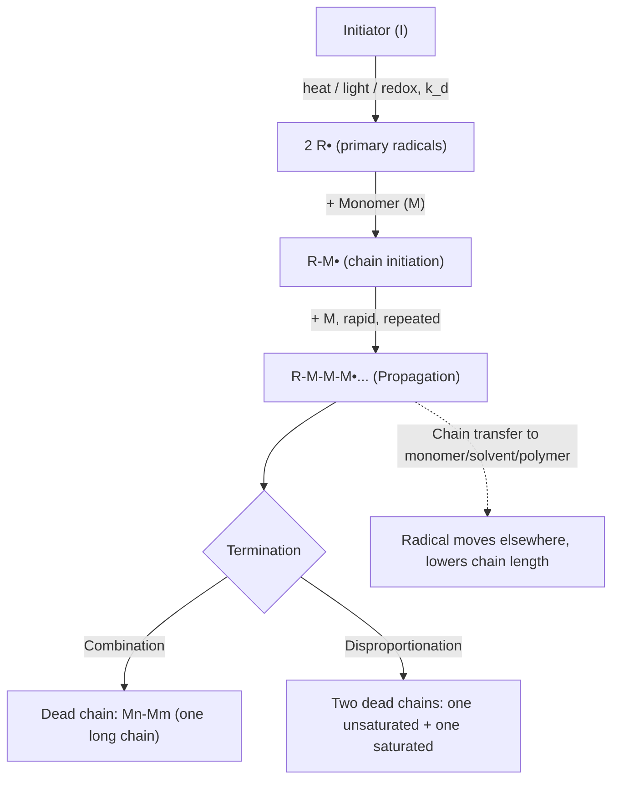

# Polymer Science & Engineering — Quick Revision (WPE-101)

> Covers: Q1 (terminology pairs), Q2 (polymerization mechanisms), plus extra practice questions with solutions.

---

## 0. Core Definitions (Warm-up)

| Term | Meaning |
|---|---|
| **Polymer** | Large molecule (macromolecule) built from many repeating small units joined by covalent bonds |
| **Monomer** | The small reactive molecule that links up to form the polymer |
| **Polymerization** | The chemical process of joining monomers into a polymer |
| **Degree of Polymerization (DP)** | Number of repeat units, *n*, in one polymer chain |

```
Monomer  →  Polymerization  →  Polymer
  M               →              (–M–)n
```

---

## Q1. Discuss the Following Pairs (with examples)

*(Note: the question says "five pairs" but lists eight — all eight are answered below to be safe.)*

### 1️⃣ Monomer vs Repeating Unit

| | Monomer | Repeating Unit |
|---|---|---|
| Definition | The free, unreacted small molecule before polymerization | The smallest structural unit that repeats along the finished chain |
| Same as each other? | **Addition polymers:** Yes, identical (just the π-bond opens) | **Condensation polymers:** usually *different*, because a small molecule (H₂O, HCl, etc.) is lost during linking |
| Example | Ethylene, CH₂=CH₂ | Repeat unit of polyethylene: –CH₂–CH₂– |
| Condensation example | Hexamethylenediamine + Adipic acid (Nylon 6,6 monomers) | Repeat unit: –NH–(CH₂)₆–NH–CO–(CH₂)₄–CO– (H₂O lost each linkage) |

```
Addition:      CH2=CH2   →   –CH2–CH2–  (monomer = repeat unit)
Condensation:  H2N-R-NH2 + HOOC-R'-COOH  →  –NH-R-NH-CO-R'-CO–  +  H2O
               (monomer ≠ repeat unit; small molecule eliminated)
```

---

### 2️⃣ Oligomer vs Degree of Polymerization (DP)

| | Oligomer | DP |
|---|---|---|
| Definition | A short polymer molecule made of only a **few** (≈2–20) monomer units — dimer, trimer, tetramer, etc. | The **number (n)** of repeat units in a polymer chain — a numeric parameter, not a molecule type |
| Molecular weight | Low (few hundred to a couple thousand g/mol) | Can range from very low (oligomer) to very high (true polymer, 1000s) |
| Formula | — | DP = (Molecular weight of polymer) ÷ (Molecular weight of repeat unit) |
| Example | Oligo(ethylene glycol), oligo(ethylene oxide) prepolymers | Commercial PE often has DP in the thousands |

**Relationship:** Oligomer = a polymer molecule *with low DP*. DP is simply the metric used to judge whether something counts as an oligomer or a true (high) polymer.

---

### 3️⃣ Retarder vs Inhibitor

Both are additives used to **slow down or stop free-radical polymerization**, but they act differently.

| | Inhibitor | Retarder |
|---|---|---|
| Action | Reacts very efficiently with **initiating radicals**, killing chains almost completely → creates a clear **induction period** with virtually no polymerization | Reacts with radicals but forms a **less reactive** radical that can still (slowly) reinitiate → reduces the **overall rate** without a sharp induction period |
| Effect on rate–time curve | Flat (no reaction) until inhibitor consumed, then normal rate resumes | Steady reduced rate throughout |
| Purpose | Prevent premature polymerization during storage/shipping of monomers | Control/moderate an overly fast, exothermic reaction |
| Examples | Hydroquinone, benzoquinone, DPPH, dissolved O₂ | Nitrobenzene, low-dose quinones, certain sulfur compounds |

```
Rate
 │                      ┌──── normal Rp (no additive)
 │                     ╱
 │        ┌──────────╱────  reduced Rp (retarder)
 │        │
 │────────┘                 (inhibitor: induction period, then rises)
 └───────────────────────────── time
```

---

### 4️⃣ Network Polymer vs Graft Copolymer

| | Network (Cross-linked) Polymer | Graft Copolymer |
|---|---|---|
| Structure | Chains joined by covalent cross-links in **all directions** → one giant 3-D molecule | A **backbone** of one monomer with **branches** of a *different* monomer attached at points along it |
| Monomer types | Can be one or more monomers, but defined by the cross-linking, not composition | Always **≥2 different monomers** (backbone type ≠ branch type) |
| Solubility/melting | Insoluble, infusible (doesn't melt) | Usually soluble/moldable — behaves like a modified thermoplastic |
| Example | Vulcanized rubber, epoxy resin, phenol-formaldehyde (Bakelite) | ABS (polybutadiene backbone grafted with styrene-acrylonitrile), starch-*g*-polyacrylonitrile |

```
Network:                         Graft copolymer:
  |   |   |                         AAAAAAAAAAAAAAAAAA   (backbone, monomer A)
--A---A---A--                            |        |
  |   |   |                              B         B     (branches, monomer B)
--A---A---A--                            B         B
  |   |   |
(cross-linked in 3-D, infinite network)
```

---

### 5️⃣ Biological vs Non-Biological Polymer

| | Biological Polymer (Biopolymer) | Non-Biological (Synthetic) Polymer |
|---|---|---|
| Origin | Produced **by living organisms** via biosynthesis | Produced in a **lab/industrial plant** by chemical synthesis |
| Examples | Proteins (amino acid units), DNA/RNA (nucleotide units), polysaccharides — cellulose, starch, natural rubber | Polyethylene, PVC, Nylon, Polyester (PET), Polystyrene |
| Biodegradability | Generally biodegradable | Often non-biodegradable (though biodegradable synthetics like PLA exist) |

---

### 6️⃣ Homopolymer vs Copolymer

| | Homopolymer | Copolymer |
|---|---|---|
| Monomer types | **One** type of monomer only | **Two or more** different monomers |
| Example | Polyethylene (from ethylene only), PP, PVC | SBR (styrene + butadiene), EVA (ethylene + vinyl acetate) |
| Sub-types | — | Random, Alternating, Block, Graft |

```
Homopolymer:  –A–A–A–A–A–A–A–
Copolymer (random):     –A–B–A–A–B–B–A–B–
Copolymer (alternating): –A–B–A–B–A–B–A–B–
Copolymer (block):       –A–A–A–A–B–B–B–B–
```

---

### 7️⃣ Organic vs Inorganic Polymer

| | Organic Polymer | Inorganic Polymer |
|---|---|---|
| Backbone | Mainly **carbon** atoms (with H, O, N…) | Backbone made of elements **other than carbon** |
| Examples | PE, PP, Nylon, Cellulose, Proteins | Silicones (–Si–O–Si–O– backbone), Polyphosphazenes (–P=N–), quartz/glass (SiO₂ network) |

---

### 8️⃣ Thermoplastic vs Thermosetting Polymer

| | Thermoplastic | Thermosetting |
|---|---|---|
| Structure | Linear/branched chains, weak intermolecular forces (van der Waals, sometimes H-bonds) | Heavily cross-linked 3-D network formed by curing |
| Heating behaviour | **Softens/melts reversibly** on heating, hardens again on cooling — can be reshaped/recycled | Cures **irreversibly**; does not re-melt — chars/decomposes if overheated |
| Example | PE, PP, PVC, PS, Nylon, PET | Bakelite (phenol-formaldehyde), epoxy, melamine-formaldehyde, vulcanized rubber |

```
Thermoplastic:  heat ⇌ melt ⇌ cool ⇌ solid   (repeatable)
Thermoset:      heat → cure (cross-link) → rigid solid   (one-way / irreversible)
```

---

## Q2. Free Radical Polymerization (chain-growth mechanism)

Free radical polymerization proceeds through **three main kinetic steps**, plus a common side reaction (chain transfer).



### Step-by-step

**a) Initiation** *(two sub-steps)*
1. Homolytic decomposition of initiator into two free radicals:
   `I → 2 R•`  (rate = kd[I])
   *Initiators:* benzoyl peroxide (BPO), AIBN, potassium persulfate.
2. Addition of a primary radical to the first monomer:
   `R• + M → RM•`

**b) Propagation**
The radical adds monomer after monomer very rapidly, regenerating the radical at the growing chain end each time:
`RM• + M → RM₂•`, `RM₂• + M → RM₃•`, … This step is fast and highly exothermic; it is what builds the chain length.

**c) Termination** — the radical character is destroyed, ending chain growth. Two routes:
- **Combination (coupling):** two growing chains join → one dead chain, `Mn• + Mm• → Mn+m`
- **Disproportionation:** an H atom transfers from one growing chain to another → two dead chains, one with a terminal C=C, the other saturated.

**d) Chain transfer** *(side reaction, not true termination)*
The growing radical abstracts an atom (usually H) from monomer, solvent, initiator, or another polymer chain. This stops growth of *that* molecule but generates a new radical elsewhere, so the overall polymerization rate is barely affected — only the average molecular weight drops.

### Kinetics (rate expression)
Using the steady-state approximation (rate of radical generation = rate of termination):

```
Rp = kp [M] ( 2 f kd [I] / kt )^0.5
```
So **Rp ∝ [M] × [I]^0.5** — rate is first-order in monomer, half-order in initiator.

---

### (Alternative answer, if asked) — Ionic Polymerization, briefly

| | Cationic | Anionic |
|---|---|---|
| Initiator | Proton donors / Lewis acids (BF₃·H₂O, H₂SO₄) | Strong bases/nucleophiles (n-BuLi, NaNH₂) |
| Propagating species | Carbocation | Carbanion |
| Suitable monomers | Electron-rich alkenes: isobutylene, vinyl ethers, styrene | Electron-poor alkenes: acrylonitrile, MMA, styrene, dienes |
| Special feature | Prone to chain transfer/rearrangement, hard to control MW | Can be **"living" polymerization** (no true termination) — used to make block copolymers by sequential monomer addition |

---

## Extra Practice Questions (with model solutions)

### Q3. Distinguish between Addition and Condensation (Step-growth) Polymerization, with examples.

| | Addition (Chain-growth) | Condensation (Step-growth) |
|---|---|---|
| Mechanism | Monomers add one-by-one to a reactive chain end (radical/ionic) | Any two reactive species (monomer, dimer, oligomer) can react together |
| By-product | None — monomer = repeat unit | Small molecule (H₂O, HCl, CH₃OH) usually eliminated |
| MW growth pattern | High MW achieved almost immediately; % conversion increases with time | MW rises slowly and only becomes high near ~100% conversion |
| Example | Polyethylene (from ethylene), PVC, PS | Nylon 6,6 (diamine + diacid), PET (diol + diacid), Bakelite |

---

### Q4. Distinguish between Linear, Branched, and Cross-linked (Network) Polymers.

```
Linear:      —A—A—A—A—A—A—A—A—

Branched:    —A—A—A—A—A—A—A—
                     |
                     A—A—A

Cross-linked (network):
              |    |    |
            —A—A—A—A—A—A—
              |    |    |
            —A—A—A—A—A—A—
              |    |    |
```
- **Linear:** single continuous chain, no side branches (e.g., HDPE).
- **Branched:** main chain with shorter side chains hanging off it (e.g., LDPE) — lower density/crystallinity than linear.
- **Cross-linked/Network:** chains connected by covalent bonds in 3 dimensions, forming one giant molecule (e.g., vulcanized rubber, thermosets).

---

### Q5. Distinguish between Isotactic, Syndiotactic, and Atactic polymers (stereoregularity).

| Type | Arrangement of substituent (R) groups along the chain | Property |
|---|---|---|
| **Isotactic** | All R groups on the **same side** | Highly crystalline, high strength/melting point |
| **Syndiotactic** | R groups **alternate sides regularly** | Also crystalline, ordered |
| **Atactic** | R groups arranged **randomly** | Amorphous, rubbery/soft, lower strength |

*Example:* Polypropylene — isotactic PP is a rigid, widely used plastic; atactic PP is a soft, tacky, low-value by-product.

---

### Q6. Distinguish between Number-average (Mn) and Weight-average (Mw) Molecular Weight.

| | Number-average, Mn | Weight-average, Mw |
|---|---|---|
| Formula | Mn = Σ(Ni Mi) / Σ(Ni) | Mw = Σ(Ni Mi²) / Σ(Ni Mi) |
| Weighting | Weights every chain **equally** (by number of molecules) | Weights **larger chains more heavily** (by mass) |
| Sensitivity | Sensitive to small chains | Sensitive to large chains |
| Ratio Mw/Mn | — | Called the **Polydispersity Index (PDI)**; PDI = 1 means perfectly uniform (monodisperse) chain lengths |

---

### Q7. Briefly discuss Emulsion Polymerization (a common industrial free-radical technique).

- Monomer is dispersed as droplets in water using a **surfactant** (forms micelles); a **water-soluble initiator** (e.g., potassium persulfate) generates radicals in the aqueous phase.
- Polymerization actually occurs **inside the micelles/growing polymer particles**, not in the monomer droplets themselves.
- Gives high molecular weight polymer at high rate, with easy heat dissipation (good for exothermic reactions) — used to make SBR, PVC latex, acrylic emulsions/paints.

---

## Summary Table — Quick Recall

| Pair | Key distinguishing word |
|---|---|
| Monomer vs Repeat unit | "before vs after linking (± small molecule loss)" |
| Oligomer vs DP | "molecule type vs numeric measure" |
| Retarder vs Inhibitor | "slows throughout vs stops completely (induction period)" |
| Network vs Graft copolymer | "3-D cross-linked everywhere vs backbone + branches" |
| Biological vs Non-biological | "made by life vs made in industry" |
| Homo vs Co-polymer | "one monomer vs two-or-more monomers" |
| Organic vs Inorganic | "C-backbone vs non-C backbone" |
| Thermoplastic vs Thermoset | "reversible melt vs irreversible cure" |

---

*Prepared as a WPE-101 (Polymer Science & Engineering) revision sheet — cross-check against your course slides/[butex-notes repo](https://github.com/itachi-re/butex-notes/tree/master/WPE-101) before an exam, as terminology emphasis can vary slightly by instructor.*
