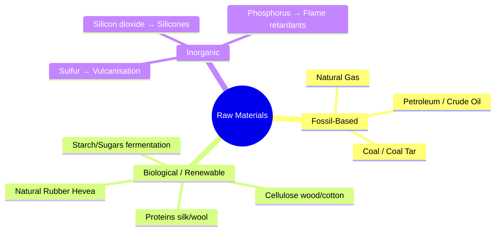
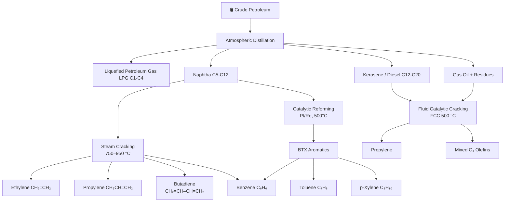
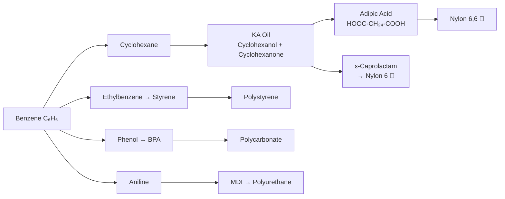
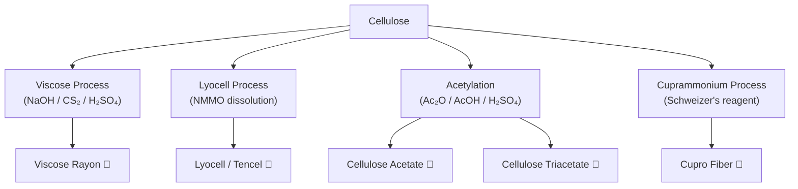

# 04 — Raw Materials: Sources and Their Derivatives

> **Syllabus Reference:** Topic 1 — Raw materials (sources and their derivatives)

---

## Table of Contents

1. [Introduction](#1-introduction)
2. [Petroleum-Based Raw Materials](#2-petroleum-based-raw-materials)
3. [Natural Gas Derivatives](#3-natural-gas-derivatives)
4. [Coal-Based Raw Materials](#4-coal-based-raw-materials)
5. [Agricultural and Biomass Sources](#5-agricultural-and-biomass-sources)
6. [Inorganic Raw Materials](#6-inorganic-raw-materials)
7. [Industrial Processing Pathways](#7-industrial-processing-pathways)
8. [Mathematical Examples](#8-mathematical-examples)
9. [Summary Table](#9-summary-table)
10. [References](#10-references)

---

## 1. Introduction

> **Definition:** Raw materials in polymer science are the *starting substances* — monomers, reagents, and bio-precursors — from which polymers are synthesised or naturally derived.

The selection of raw material governs:

1. **The monomer pool available** — determines which repeating unit forms the chain
2. **The polymerisation pathway** — addition, condensation, or ring-opening
3. **Final polymer properties** — thermal stability, crystallinity, solubility, strength
4. **Economics and sustainability** — cost of feedstock, carbon footprint, renewability

### 1.1 Broad Classification of Raw Material Sources



> 📌 **Key fact:** More than **90 %** of synthetic polymer raw materials worldwide originate from petroleum and natural gas (IEA, 2023).

---

## 2. Petroleum-Based Raw Materials

Crude petroleum (crude oil) is the dominant source of synthetic polymer feedstock. Refining and **cracking** break the complex mixture of hydrocarbons into useful low-molecular-weight olefins and aromatics.

### 2.1 Petroleum Refinery → Monomer Pathway



---

### 2.2 Ethylene — CH₂=CH₂

**Source:** Steam cracking of naphtha, ethane (from natural gas), or propane  
**Boiling point:** −104 °C  
**Global production (2024):** ~210 million tonnes/year — the **world's largest-volume organic chemical**

**Structural formula:**

```
    H   H
    |   |
H — C = C — H
```

**Key derivatives and polymers:**

| Derivative Monomer | Synthesis Route | Polymer | Textile/Industrial Use |
|:---|:---|:---|:---|
| Ethylene (direct) | — | Polyethylene (HDPE, LDPE, LLDPE) | Packaging, geotextiles |
| Vinyl chloride (VCM) | Chlorination + dehydrochlorination | PVC | Pipes, cable insulation |
| Vinyl acetate (VAc) | Addition of AcOH | PVAc → PVA | Adhesives, Vinylon fiber |
| Acrylonitrile (AN) | Indirect via propylene | PAN | Acrylic fiber (Orlon, Acrilan) |
| Styrene | Alkylation of benzene + dehydrogenation | Polystyrene, ABS | Engineering plastics |
| Ethylene glycol (MEG) | Oxidation → ethylene oxide → hydration | PET | Polyester fiber (Dacron, Terylene) |

**Key reaction — manufacture of vinyl chloride monomer (VCM):**

Step 1 — Ethylene chlorination:
$$\text{CH}_2{=}\text{CH}_2 + \text{Cl}_2 \xrightarrow{\text{FeCl}_3,\, 50\,°\text{C}} \text{CH}_2\text{Cl}{\text{–}}\text{CH}_2\text{Cl} \quad \text{(1,2-dichloroethane, EDC)}$$

Step 2 — Thermal cracking (pyrolysis):
$$\text{CH}_2\text{Cl}{\text{–}}\text{CH}_2\text{Cl} \xrightarrow{500\,°\text{C}} \underbrace{\text{CH}_2{=}\text{CHCl}}_{\text{VCM}} + \text{HCl}$$

**Ethylene oxide and MEG (for PET):**
$$\text{CH}_2{=}\text{CH}_2 + \frac{1}{2}\text{O}_2 \xrightarrow{\text{Ag cat.},\, 250\,°\text{C}} \underbrace{\text{C}_2\text{H}_4\text{O}}_{\text{ethylene oxide}} \xrightarrow{\text{H}_2\text{O},\, \text{H}^+} \underbrace{\text{HOCH}_2\text{CH}_2\text{OH}}_{\text{monoethylene glycol (MEG)}}$$

---

### 2.3 Propylene — CH₃CH=CH₂

**Source:** Co-product of steam cracking; also from fluid catalytic cracking (FCC)  
**Global production:** ~130 million tonnes/year (second to ethylene)

**Structural formula:**

```
    H   H   H
    |   |   |
H — C — C = C — H
    |
    H
```

**Derivatives:**

| Product | Route | Polymer | Application |
|:---|:---|:---|:---|
| Propylene → PP | Ziegler-Natta / metallocene | Polypropylene | Textile fiber, packaging |
| Acrylonitrile | Ammoxidation (Sohio) | PAN | Acrylic fiber |
| Propylene oxide | Chlorohydrin / HPPO process | Polyurethane polyols | Foam, elastomers |
| Acrylic acid | Oxidation | Polyacrylic acid | Superabsorbents |
| Isopropanol | Hydration | — | Solvent |

**Sohio/ammoxidation process for acrylonitrile:**
$$\text{CH}_3\text{CH{=}CH}_2 + \text{NH}_3 + \frac{3}{2}\text{O}_2 \xrightarrow{\text{Bi-Mo catalyst},\, 430{-}460\,°\text{C}} \underbrace{\text{CH}_2{=}\text{CHCN}}_{\text{acrylonitrile}} + 3\,\text{H}_2\text{O}$$

> 💡 **Textile relevance:** Acrylonitrile → Polyacrylonitrile (PAN) → **Acrylic fiber** — a major synthetic wool substitute. World production ~2 million tonnes/year.

---

### 2.4 Butadiene — CH₂=CH–CH=CH₂

**Source:** C₄ fraction from steam cracking; dehydrogenation of butane or butene  
**Key property:** Conjugated 1,3-diene — undergoes 1,4-addition polymerisation

**Structural formula:**
```
H   H   H   H
|   |   |   |
C = C — C = C
|           |
H           H
```

**Polymers from butadiene:**

| Polymer | Comonomers | Application |
|:---|:---|:---|
| Polybutadiene (BR) | None | Tire sidewalls |
| SBR (Styrene-Butadiene Rubber) | Styrene (23 %) | Tires, shoe soles |
| NBR (Nitrile Rubber) | Acrylonitrile | Oil-resistant seals |
| ABS | Acrylonitrile + Styrene | Engineering plastic |
| MBS | Methyl methacrylate + Styrene | Impact modifier |

---

### 2.5 Benzene — C₆H₆

**Source:** Catalytic reforming (primary modern source); steam cracking by-product; coal tar (historical)  
**Critical importance:** The aromatic hub for multiple key textile polymer precursors



**Adipic acid synthesis (key Nylon 6,6 precursor):**

$$\underbrace{\text{C}_6\text{H}_{12}}_{\text{cyclohexane}} \xrightarrow{\text{O}_2,\,\text{Co/Mn cat.}} \underbrace{\text{C}_6\text{H}_{11}\text{OH} + \text{C}_6\text{H}_{10}\text{O}}_{\text{KA oil}} \xrightarrow{\text{HNO}_3,\, 60\,°\text{C}} \underbrace{\text{HOOC}(\text{CH}_2)_4\text{COOH}}_{\text{adipic acid}}$$

**Beckmann rearrangement (caprolactam for Nylon 6):**
$$\underbrace{\text{C}_6\text{H}_{10}\text{O}}_{\text{cyclohexanone}} + \text{NH}_2\text{OH} \rightarrow \underbrace{\text{C}_6\text{H}_{10}{=}\text{NOH}}_{\text{cyclohexanone oxime}} \xrightarrow{\text{H}_2\text{SO}_4} \underbrace{\varepsilon\text{-caprolactam}}_{\text{7-membered ring}}$$

---

### 2.6 p-Xylene (para-Xylene) — C₈H₁₀

**Source:** Isomer separation (via simulated moving bed adsorption, SMB) from mixed C₈ aromatics produced by catalytic reforming  
**Crucial importance:** The **sole industrial precursor** to terephthalic acid (TPA) → PET

**Oxidation to TPA:**
$$\underbrace{\text{p-CH}_3\text{C}_6\text{H}_4\text{CH}_3}_{\text{p-xylene}} + \frac{3}{2}\text{O}_2 \xrightarrow{\text{Co/Mn/Br, AcOH},\, 200\,°\text{C}} \underbrace{\text{p-HOOC-C}_6\text{H}_4\text{-COOH}}_{\text{terephthalic acid (TPA)}}$$

> 📊 **Scale:** Global PET fibre production ≈ 60 million tonnes/year (2024), making p-xylene one of the strategically most important petrochemical feedstocks for the textile industry.

**PET synthesis overview:**
$$n\,\text{TPA} + n\,\text{MEG} \xrightarrow{\text{Sb}_2\text{O}_3,\, 250{-}280\,°\text{C},\, \text{vacuum}} [\text{-OC-C}_6\text{H}_4\text{-CO-O-CH}_2\text{CH}_2\text{-O-}]_n + n\,\text{H}_2\text{O}$$

---

### 2.7 Acrylonitrile — CH₂=CHCN

**Source:** Sohio propylene ammoxidation (Section 2.3)  
**Boiling point:** 77 °C; **polymerised** in aqueous solution  
**Polymer:** Polyacrylonitrile (PAN) — trade names: Orlon (DuPont), Acrilan (Monsanto), Courtelle (Courtaulds)

**Key fibre property target (Carothers criterion):**  
PAN for fibre must have $\bar{M}_w > 100{,}000$ g/mol and $< 15\%$ comonomer content (to preserve crystal regularity while ensuring wet-spinning solubility).

---

## 3. Natural Gas Derivatives

Natural gas is composed chiefly of methane (CH₄, ~90 %) with smaller amounts of ethane, propane, and butane (collectively: natural gas liquids, NGLs).

### 3.1 Steam Methane Reforming (SMR) → Syngas

$$\text{CH}_4 + \text{H}_2\text{O} \xrightarrow{\text{Ni cat.},\, 700{-}900\,°\text{C},\, \Delta H = +206\,\text{kJ/mol}} \text{CO} + 3\,\text{H}_2 \quad (\text{syngas})$$

**Water-gas shift:**
$$\text{CO} + \text{H}_2\text{O} \rightleftharpoons \text{CO}_2 + \text{H}_2$$

**Syngas derivatives relevant to polymer chemistry:**

| Product from Syngas | Further Reaction | Polymer |
|:---|:---|:---|
| Methanol | Oxidation → formaldehyde | Urea-formaldehyde (UF), phenol-formaldehyde (PF) resins |
| Ammonia (via Haber) | + CO₂ → urea | Urea-formaldehyde resins |
| Fischer-Tropsch hydrocarbons | Oligomerisation | Polyethylene waxes |

### 3.2 Ethane / Propane Cracking (NGLs)

$$\text{CH}_3\text{CH}_3 \xrightarrow{800{-}900\,°\text{C},\, \text{steam}} \text{CH}_2{=}\text{CH}_2 + \text{H}_2 \quad \Delta H = +137\,\text{kJ/mol}$$

Ethane cracking gives ~80 % ethylene yield — far higher than naphtha cracking — which is why US shale gas feedstocks (rich in ethane) have dramatically reshaped global ethylene economics since 2010.

---

## 4. Coal-Based Raw Materials

### 4.1 Historical Context

Before petroleum became dominant (pre-1950s), **coal tar distillation** was the primary source of aromatic organic chemicals. Today coal-derived feedstocks account for <5 % of global polymer raw materials in developed countries, but remain significant in **China** (coal-to-chemicals, CTC).

### 4.2 Coal Tar Distillation Fractions

| Fraction | Boiling Range | Key Compounds | Polymer Relevance |
|:---|:---:|:---|:---|
| Light oil | < 200 °C | Benzene, toluene, xylene (BTX), pyridine | Nylons, PET (via BTX) |
| Middle oil (carbolic) | 200–250 °C | Phenol, cresols, naphthalene | Phenolic resins, phthalate plasticisers |
| Heavy oil (creosote) | 250–300 °C | Cresols, xylenols | Phenolic resins |
| Anthracene oil | 300–350 °C | Anthracene, carbazole, fluoranthene | Carbon fibre pitch |
| Coal tar pitch | Residue (> 350 °C) | Polycyclic aromatics | Pitch-based carbon fibre |

### 4.3 Coal Tar Pitch → Carbon Fibre

High-performance **mesophase pitch-based carbon fibre** is produced from coal tar pitch. The pitch undergoes:

1. **Heat treatment** at 400–450 °C → mesophase (liquid crystal) pitch
2. **Melt spinning** → green fibre
3. **Stabilisation** in air at 250–350 °C (oxidative crosslinking)
4. **Carbonisation** in N₂ at 1000–1600 °C → carbon fibre
5. Optional **graphitisation** at 2500–3000 °C → graphite fibre

**Properties of pitch-based CF vs PAN-based CF:**

| Property | PAN-based CF | Pitch-based CF |
|:---|:---:|:---:|
| Tensile modulus | 230–400 GPa | 350–900 GPa |
| Tensile strength | 3.5–7 GPa | 2.5–4 GPa |
| Cost | Lower | Higher |
| Graphite content | Moderate | Very high |

---

## 5. Agricultural and Biomass Sources

These are the primary sources of **natural polymers** and increasingly of **bio-based synthetic monomers** (green chemistry).

### 5.1 Cellulose

> **Definition:** Cellulose is a linear, unbranched homopolymer of D-glucose units linked by β(1→4) glycosidic bonds. It is the most abundant organic polymer on Earth.

**Chemical formula:** $[\text{C}_6\text{H}_7\text{O}_2(\text{OH})_3]_n$ — i.e., each anhydroglucose unit (AGU) carries three free hydroxyl groups

**Sources and degree of polymerisation (DP):**

| Source | DP (approx.) | $\bar{M}_n$ (approx., g/mol) |
|:---|:---:|:---:|
| Cotton linters | 800–1,500 | 130,000 – 243,000 |
| Wood pulp (dissolving grade) | 300–900 | 49,000 – 146,000 |
| Bacterial cellulose | 2,000–8,000 | 324,000 – 1,296,000 |
| Native flax/hemp | 8,000–15,000 | 1.3 × 10⁶ – 2.4 × 10⁶ |

**Cellulose fibre derivatives (most important for textile processing):**



**Xanthate formation (key step in viscose process):**

Step 1 — Alkali cellulose formation:
$$\text{Cell-OH} + \text{NaOH} \rightarrow \text{Cell-O}^-\text{Na}^+ + \text{H}_2\text{O} \quad (\text{mercerisation})$$

Step 2 — Xanthation:
$$\text{Cell-O}^-\text{Na}^+ + \text{CS}_2 \rightarrow \underbrace{\text{Cell-O-CS}_2^-\text{Na}^+}_{\text{sodium cellulose xanthate}}$$

Step 3 — Dissolution in NaOH → spinning dope (viscose); then wet-spinning into acid bath:
$$\text{Cell-O-CS}_2\text{Na} + \text{H}_2\text{SO}_4 \rightarrow \text{regenerated cellulose} + \text{CS}_2 + \text{Na}_2\text{SO}_4$$

**Lyocell (Tencel) — greener alternative:**
- Solvent: **N-methylmorpholine-N-oxide (NMMO)** monohydrate — >99.5 % recovery in closed loop
- No toxic CS₂; fibre has higher tensile strength than viscose
- International standard: ISO 11537

**Degree of substitution (DS) for cellulose acetate:**

$$\text{DS} = \frac{\text{average number of acetyl groups per AGU}}{3}$$

- Cellulose diacetate: DS ≈ 2.4 (soluble in acetone → acetate fibre)
- Cellulose triacetate: DS ≈ 2.9 (soluble in CH₂Cl₂ → triacetate fibre)

---

### 5.2 Natural Rubber — cis-1,4-Polyisoprene

**Botanical source:** *Hevea brasiliensis* (rubber tree), native to Amazon basin; now cultivated in SE Asia (Thailand, Indonesia, Malaysia → >90 % world supply)  
**Latex:** 30–40 % polyisoprene by weight; MW ≈ 500,000 – 5,000,000 g/mol

**Repeating unit:**

$$[-\text{CH}_2-\overset{|}{\underset{|}{\text{C}}}(\text{CH}_3)\text{=CH-CH}_2-]_n \quad (\textit{cis}-\text{configuration})$$

**Properties:**
- Highly elastic (entropy-driven elasticity; $T_g = -70\,°\text{C}$)
- Soluble in nonpolar solvents (hexane, toluene)
- Crystallises on stretching → high tensile strength when stretched

**Vulcanisation (Goodyear, 1839):**
$$\text{Polyisoprene (NR)} + x\,\text{S} \xrightarrow{140{-}180\,°\text{C}} \text{Vulcanised rubber (crosslinked)}$$

One sulfur bridge per ~200 isoprene units (soft rubber); 25–55 sulfur atoms per 100 isoprene (hard rubber / ebonite).

> **Comparison — Gutta-percha** (also from *Palaquium* spp.) is the *trans*-1,4-polyisoprene isomer. It is hard and leathery at room temperature — used in golf balls and historical telegraph cable insulation.

---

### 5.3 Starch and Bio-Based Monomers

| Biological Source | Fermentation / Chemical Route | Monomer | Bio-Polymer |
|:---|:---|:---|:---|
| Corn starch / sugarcane | Fermentation → lactic acid | L-Lactic acid | Polylactic acid (PLA) — biodegradable |
| Sucrose (glucose/fructose) | Fermentation | Succinic acid | Polybutylene succinate (PBS) |
| Castor oil (*Ricinus communis*) | Pyrolysis of ricinoleic acid | 11-aminoundecanoic acid | Nylon 11 |
| Soybean / palm oil | Epoxidation / ring-opening | Polyols | Bio-based polyurethane |
| Cellulose hydrolysis | Fermentation | Ethanol → ethylene | Bio-polyethylene |

**PLA synthesis route:**
$$\underbrace{\text{Starch}}_{\text{corn}} \xrightarrow{\text{enzymatic hydrolysis}} \text{glucose} \xrightarrow{\text{fermentation}} \underbrace{\text{L-lactic acid}}_{\text{CH}_3\text{CH(OH)COOH}} \xrightarrow{\text{condensation → ring-close}} \underbrace{\text{L-lactide}}_{\text{cyclic dimer}} \xrightarrow{\text{ROP}} \underbrace{\text{PLA}}_{\overline{M}_n \approx 10^5\,\text{g/mol}}$$

---

### 5.4 Protein-Based Polymers

Natural fiber-forming proteins are among the most structurally sophisticated polymers in nature.

| Source | Protein | Secondary Structure | Fibre |
|:---|:---|:---|:---|
| *Bombyx mori* (silkworm) | Silk fibroin + sericin | β-sheet (antiparallel) | Mulberry silk |
| *Antheraea pernyi* (tussah) | Fibroin | β-sheet (mixed) | Tussah silk |
| Merino sheep | Keratin (α-helix, S–S crosslinks) | α-helical coiled coil | Wool |
| *Nephila* spp. (spider) | Spidroin MaSp1 & MaSp2 | β-nanocrystal + amorphous | Spider dragline silk |
| Bovine milk | Casein | Random coil | Lanital (historical, WW-II) |

**Silk fibroin composition:**
- Glycine (~43 %), Alanine (~30 %), Serine (~12 %) → forms flat β-pleated sheets giving high tensile strength (300–740 MPa)
- Sericin (gum): removed by **degumming** (boiling in soap/alkali solution) before dyeing

**Wool keratin disulfide bond:**
$$2\;\text{–CH}_2\text{–SH} \;\xrightarrow{[\text{O}]}\; \text{–CH}_2\text{–S–S–CH}_2\text{–} + \text{H}_2\text{O} \quad (\text{cystine crosslink})$$

These –S–S– bonds are broken/reformed in permanent waving of hair and wool setting.

---

## 6. Inorganic Raw Materials

### 6.1 Silicon Dioxide → Silicone Polymers

**Sequence:**

Step 1 — Carbothermal reduction:
$$\text{SiO}_2 + 2\,\text{C} \xrightarrow{\text{arc furnace},\, 2000\,°\text{C}} \text{Si} + 2\,\text{CO}$$

Step 2 — Rochow (Direct) process:
$$\text{Si} + 2\,\text{CH}_3\text{Cl} \xrightarrow{\text{Cu cat.},\, 250{-}350\,°\text{C}} (\text{CH}_3)_2\text{SiCl}_2 \quad \text{(dimethyldichlorosilane; main product)}$$

Step 3 — Hydrolysis and condensation:
$$n\,(\text{CH}_3)_2\text{SiCl}_2 + n\,\text{H}_2\text{O} \rightarrow [\underbrace{-\text{Si(CH}_3)_2\text{-O-}}_{\text{PDMS repeating unit}}]_n + 2n\,\text{HCl}$$

**Polydimethylsiloxane (PDMS):** flexible backbone ($T_g \approx -123\,°\text{C}$); thermally stable to 300 °C; water-repellent  
**Textile application:** Silicone softeners; durable water repellent (DWR) finish for technical textiles

### 6.2 Sulfur

- **Vulcanisation** of natural and synthetic rubber
- **Polysulfide polymers** (Thiokol) — fuel-resistant sealants in aircraft

### 6.3 Phosphorus Compounds

- **Phosphoric acid derivatives** → flame-retardant finishes for polyester and cotton fabrics (e.g., Proban, Pyrovatex)
- **Polyphosphazenes** — inorganic backbone polymers: $[\text{-N=PX}_2\text{-}]_n$ where X = organic substituent

---

## 7. Industrial Processing Pathways

### 7.1 Steam Cracking — Product Distribution

**Feed: naphtha (C₅–C₁₂) at 830 °C, 0.4 s residence time:**

| Product | Approximate Yield (wt %) |
|:---:|:---:|
| Ethylene | 28–32 % |
| Propylene | 14–18 % |
| Mixed C₄ (butadiene, butenes) | 8–12 % |
| Pyrolysis gasoline (C₅–C₉, BTX-rich) | 18–25 % |
| Fuel gas (CH₄ + H₂) | 12–18 % |

> **Note:** Ethane cracking gives ~80 % ethylene; heavier feeds (gas oil) give ~20 % ethylene but more propylene and aromatics.

### 7.2 Catalytic Reforming (Aromatics Production)

**Feed:** Straight-run naphtha (C₇–C₁₂)  
**Catalyst:** Pt-Re/Al₂O₃  
**Conditions:** 490–530 °C, 10–35 bar, H₂ atmosphere (prevents coking)

Key reactions:
1. Cyclohexane → Benzene + 3 H₂ (dehydrogenation)
2. Methylcyclohexane → Toluene + 3 H₂
3. n-Heptane → Toluene + 4 H₂ (dehydrocyclisation)

**RON (research octane number) improves from ~50 to ~95–100**, and BTX yield is 50–60 wt% of feed.

---

## 8. Mathematical Examples

### Example 1 — Degree of Polymerisation from Molecular Weight

> **Problem:** A PET sample has a number-average molecular weight $\bar{M}_n = 24{,}000\,\text{g/mol}$. The repeating unit is $[-\text{OC-C}_6\text{H}_4\text{-CO-O-CH}_2\text{CH}_2\text{-O-}]$. Calculate the number-average degree of polymerisation $\bar{X}_n$.

**Solution:**

Molecular formula of repeating unit: $\text{C}_{10}\text{H}_8\text{O}_4$

$$M_0 = 10(12) + 8(1) + 4(16) = 120 + 8 + 64 = 192\,\text{g/mol}$$

$$\bar{X}_n = \frac{\bar{M}_n}{M_0} = \frac{24{,}000}{192} = \boxed{125}$$

> This is a relatively **short** chain for fibre-grade PET; commercial fibre PET typically has $\bar{X}_n \approx 130{-}180$ ($\bar{M}_n \approx 25{,}000{-}35{,}000\,\text{g/mol}$).

---

### Example 2 — Mass of Monomer Required for a Given Output

> **Problem:** A polyester plant is designed to produce 500 tonnes/day of PET fibre with $\bar{X}_n = 150$. Assuming 100 % conversion and equimolar feed of TPA and MEG, and that each condensation step releases one molecule of water:  
> (a) Calculate the theoretical mass of TPA required.  
> (b) Calculate the mass of water produced as by-product.

**Data:**  
- $M(\text{TPA}) = 166\,\text{g/mol}$  
- $M(\text{MEG}) = 62\,\text{g/mol}$  
- $M(\text{PET repeating unit}) = 192\,\text{g/mol}$  
- $M(\text{H}_2\text{O}) = 18\,\text{g/mol}$

**Solution:**

Moles of PET repeating units in 500 t of PET:

$$n_{\text{repeat}} = \frac{500 \times 10^6\,\text{g}}{192\,\text{g/mol}} = 2.604 \times 10^9\,\text{mol}$$

Since each repeat unit requires 1 mol TPA:

$$m_{\text{TPA}} = 2.604 \times 10^9 \times 166 = 4.323 \times 10^{11}\,\text{g} = \boxed{432\,\text{tonnes/day}}$$

Water produced (1 mol H₂O per ester linkage, same as repeat units):

$$m_{\text{H}_2\text{O}} = 2.604 \times 10^9 \times 18 = 4.687 \times 10^{10}\,\text{g} = \boxed{46.9\,\text{tonnes/day}}$$

---

### Example 3 — Cellulose Degree of Polymerisation

> **Problem:** A dissolving-grade wood pulp has $\bar{M}_n = 182{,}000\,\text{g/mol}$. Calculate the average DP. (Anhydroglucose unit $M_0 = 162.14\,\text{g/mol}$)

$$\text{DP} = \frac{182{,}000}{162.14} \approx \boxed{1{,}123}$$

This corresponds to a cellulose chain that is about 560 nm long when fully extended — directly influencing fibre tensile strength and wet modulus.

---

## 9. Summary Table

| Raw Material Source | Key Compounds | Major Polymers | Textile Fibre |
|:---|:---|:---|:---|
| Petroleum — olefins | Ethylene, VCM, VAc, AN, styrene | PE, PVC, PVA, PAN, PS | PAN → acrylic; PVA → Vinylon |
| Petroleum — propylene | Propylene, AN | PP, PAN | PP → polypropylene fibre |
| Petroleum — C₄ | 1,3-Butadiene | SBR, NBR, BR, ABS | (rubber/elastomer) |
| Petroleum — aromatics | Benzene, p-xylene | Nylon 6,6, PET | Nylon 6,6 🧵, PET 🧵 (Dacron) |
| Natural gas — ethane | Ethylene | PE, PVC, PET | PE fibre (Spectra, Dyneema) |
| Coal tar | Phenol, BTX | Phenolic resins | Carbon fibre (pitch) |
| Cellulose (wood/cotton) | Cellulose biopolymer | Rayon, lyocell, acetate | Viscose 🧵, Lyocell 🧵 |
| Natural rubber (*Hevea*) | cis-Polyisoprene | NR, SBR | Latex thread |
| Castor oil | 11-aminoundecanoic acid | Nylon 11 | Nylon 11 🧵 |
| Corn/sugarcane | L-Lactic acid | PLA | PLA fibre (biodegradable) |
| Silica (SiO₂) | Dimethyldichlorosilane | PDMS (silicone) | Textile finish |
| Silk glands (*B. mori*) | Fibroin + sericin | Silk protein | Mulberry silk 🧵 |
| Wool (sheep keratin) | α-Keratin | Crosslinked protein | Wool 🧵 |

---

## 10. References

1. **Odian, G.** (2004). *Principles of Polymerization* (4th ed.). Wiley-Interscience. → Definitive text on polymer synthesis and raw materials.
2. **Stevens, M. P.** (1999). *Polymer Chemistry: An Introduction* (3rd ed.). Oxford University Press.
3. **Billmeyer, F. W.** (1984). *Textbook of Polymer Science* (3rd ed.). Wiley.
4. **Mark, H. F.** (Ed.) (2004). *Encyclopedia of Polymer Science and Technology* (3rd ed.). Wiley. → [Online](https://onlinelibrary.wiley.com/doi/book/10.1002/0471440264)
5. **ICIS Chemical Business** — Monomer market and production data: <https://www.icis.com/explore/resources/news/2023/03/14/10861124/ethylene-production/>
6. **LibreTexts Chemistry** — Polymer Chemistry Module: <https://chem.libretexts.org/Bookshelves/Polymer_Chemistry>
7. **American Chemistry Council** — Plastics & Polymer Education: <https://www.americanchemistry.com/better-policy-regulation/plastics>
8. **Royal Society of Chemistry** — Polymer resources: <https://www.rsc.org/learn-chemistry/resource/res00001388/polymers>
9. **NCBI PubChem** — Monomer property data (acrylonitrile, TPA, caprolactam, etc.): <https://pubchem.ncbi.nlm.nih.gov>
10. **Wikipedia** — Petrochemical (overview with sources): <https://en.wikipedia.org/wiki/Petrochemical>
11. **IEA (International Energy Agency)** — The Future of Petrochemicals (2023): <https://www.iea.org/reports/the-future-of-petrochemicals>
12. **Wikimedia Commons** — Polymer structure diagrams: <https://commons.wikimedia.org/wiki/Category:Polymers>
13. **Morton, M.** (1999). *Rubber Technology* (3rd ed.). Springer. → Natural rubber chapter.
14. **Zhang, Y. P.** (2014). "Cellulose dissolution and regeneration." *Progress in Polymer Science*, 39(2), 327–360.

---

> 📅 **Last Updated:** June 06, 2026
> 🏫 **Course:** WPE-101 — Wet Processing Engineering | Bangladesh University of Textiles (BUTEX)
> ✍️ **Maintainer:** [itachi-re](https://github.com/itachi-re)
>
> **← Previous:** [03 — Classification of Polymers](./03-classification-of-polymers.md)
> **→ Next:** [05 — Synthesis of Polymers](./05-synthesis-of-polymers.md)
