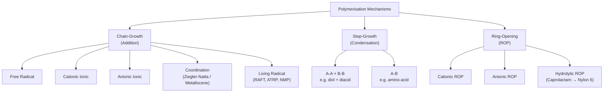
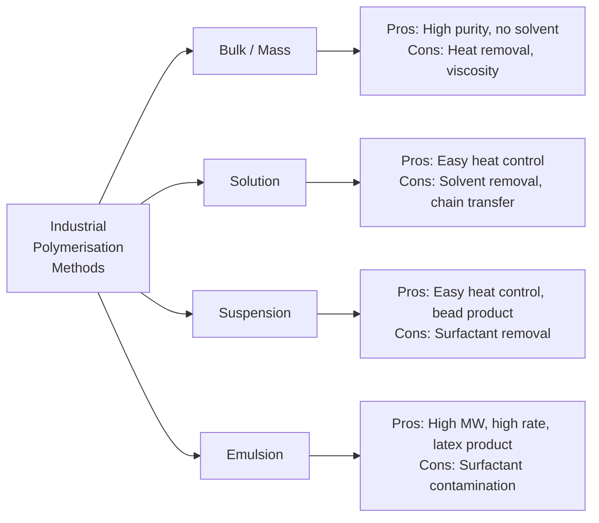
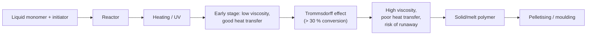
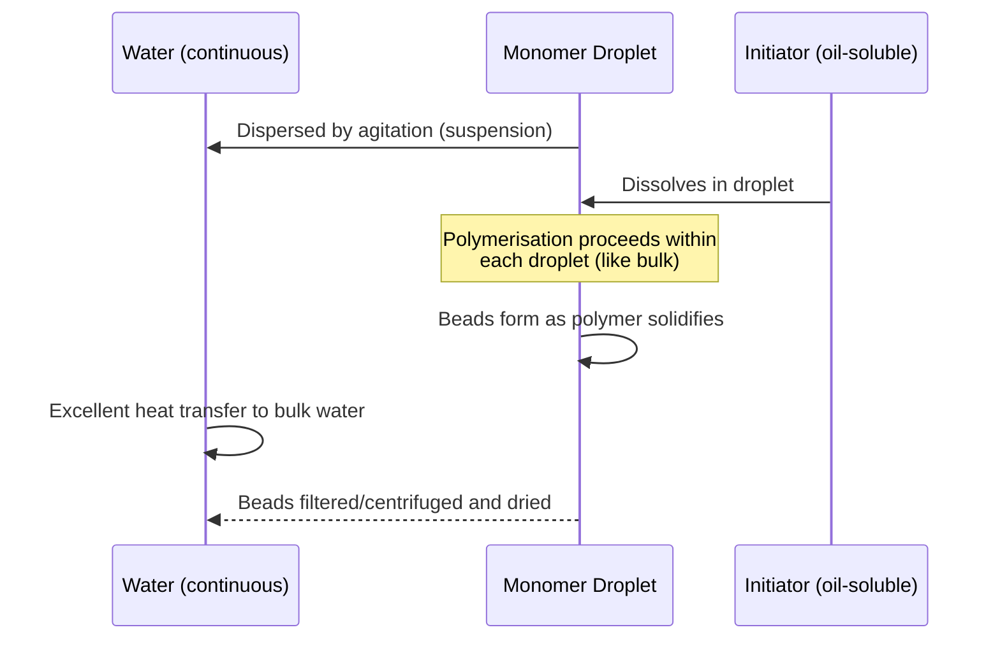

# 05 — Synthesis of Polymers: Mechanisms and Methods

> **Syllabus Reference:** Topic 2 — Synthesis of Polymers (Mechanism of polymerisation, Methods of polymerisation)

---

## Table of Contents

1. [Overview and Classification](#1-overview-and-classification)
2. [Chain-Growth Polymerisation (Addition Polymerisation)](#2-chain-growth-polymerisation-addition-polymerisation)
   - 2.1 [Free Radical Polymerisation](#21-free-radical-polymerisation)
   - 2.2 [Ionic Polymerisation — Cationic](#22-ionic-polymerisation--cationic)
   - 2.3 [Ionic Polymerisation — Anionic and Living Polymerisation](#23-ionic-polymerisation--anionic-and-living-polymerisation)
   - 2.4 [Coordination Polymerisation — Ziegler-Natta](#24-coordination-polymerisation--ziegler-natta)
   - 2.5 [Comparison of Chain-Growth Mechanisms](#25-comparison-of-chain-growth-mechanisms)
3. [Step-Growth Polymerisation (Condensation Polymerisation)](#3-step-growth-polymerisation-condensation-polymerisation)
   - 3.1 [Mechanism](#31-mechanism)
   - 3.2 [Carothers Equation and Kinetics](#32-carothers-equation-and-kinetics)
   - 3.3 [A-B vs A-A/B-B Systems](#33-a-b-vs-aa--bb-systems)
   - 3.4 [Key Condensation Polymers](#34-key-condensation-polymers)
4. [Ring-Opening Polymerisation (ROP)](#4-ring-opening-polymerisation-rop)
5. [Methods of Polymerisation (Industrial Techniques)](#5-methods-of-polymerisation-industrial-techniques)
6. [Comparison of Polymerisation Methods](#6-comparison-of-polymerisation-methods)
7. [Mathematical Examples](#7-mathematical-examples)
8. [References](#8-references)

---

## 1. Overview and Classification

> **Definition:** Polymerisation is the process by which monomer molecules are covalently joined together to form a high-molecular-weight polymer. The **mechanism** describes how bonds form at the molecular level; the **method** describes the physical conditions of the reaction.

### 1.1 Mechanistic Classification



### 1.2 Key Differences at a Glance

| Feature | Chain-Growth | Step-Growth |
|:---|:---:|:---:|
| Reaction species | Monomer + active chain end | Any two species react |
| Initiation required? | Yes (initiator) | No (or catalyst) |
| MW growth | Rapid (high MW from early stage) | Slow (high MW only at very high conversion) |
| Monomer consumed | Gradually | Rapidly (di/oligomers form first) |
| By-product | None (addition) | H₂O, HCl, CH₃OH, etc. |
| Example | PE, PAN, PS, PVC | Nylon, PET, polyurethane |

---

## 2. Chain-Growth Polymerisation (Addition Polymerisation)

> **Definition:** Chain-growth polymerisation involves the sequential addition of monomer units to an **active centre** (radical, cation, anion, or metal-coordinated species) at the end of a growing chain. The active centre is consumed only by termination, not by adding monomer.

**General scheme:**
$$\text{Initiator} \rightarrow \text{Active centre} \xrightarrow{+M} \text{Active dimer} \xrightarrow{+M} \cdots \xrightarrow{+M} \text{Polymer (dead)}$$

**Monomers:** Must contain a **double bond** (vinyl, vinylidene, diene) or **strained ring**.

Common monomers:

| Monomer | Structure | Polymer |
|:---|:---|:---|
| Ethylene | CH₂=CH₂ | Polyethylene (PE) |
| Propylene | CH₂=CH-CH₃ | Polypropylene (PP) |
| Vinyl chloride | CH₂=CHCl | PVC |
| Styrene | CH₂=CH-C₆H₅ | PS |
| Acrylonitrile | CH₂=CH-CN | PAN |
| Methyl methacrylate | CH₂=C(CH₃)-COOCH₃ | PMMA |
| Butadiene | CH₂=CH-CH=CH₂ | Polybutadiene |

---

### 2.1 Free Radical Polymerisation

**This is the most industrially important mechanism.** Applied to: PE (high pressure), PVC, PS, PAN, PMMA, SBR, PTFE.

#### 2.1.1 Mechanism — Step by Step

**Stage 1: Initiation (two sub-steps)**

Sub-step (a): Decomposition of initiator **(rate-determining)**
$$\text{I} \xrightarrow{k_d} 2\,\text{R}^{\bullet}$$

Common initiators and their decomposition temperatures (half-life $t_{1/2} = 10\,\text{h}$):

| Initiator | Abbreviation | $T$ for $t_{1/2} = 10\,\text{h}$ | $E_d$ (kJ/mol) |
|:---|:---:|:---:|:---:|
| Benzoyl peroxide | BPO | 74 °C | 125 |
| Azobisisobutyronitrile | AIBN | 64 °C | 130 |
| Di-tert-butyl peroxide | DTBP | 126 °C | 157 |
| Potassium persulfate | KPS | 70 °C (aq.) | 117 |

$$\text{Rate of initiator decomposition:} \quad -\frac{d[\text{I}]}{dt} = k_d[\text{I}]$$

Sub-step (b): Addition of primary radical to monomer
$$\text{R}^{\bullet} + \text{CH}_2{=}\text{CHX} \xrightarrow{k_i} \text{R-CH}_2-\dot{\text{C}}\text{HX}$$

**Initiator efficiency** $f$ (0.5–0.8 typically):  
$$R_i = 2\,f\,k_d[\text{I}]$$

**Stage 2: Propagation**

$$\underbrace{\text{R-(CH}_2\text{-CHX)}_n^{\bullet}}_{\text{growing radical}} + \text{CH}_2{=}\text{CHX} \xrightarrow{k_p} \text{R-(CH}_2\text{-CHX)}_{n+1}^{\bullet}$$

- $k_p$ is very fast: $10^2–10^4\,\text{L mol}^{-1}\text{s}^{-1}$
- Each propagation step adds one monomer to the chain
- Chain grows until termination

$$R_p = k_p[\text{M}][\text{M}^{\bullet}]$$

**Head-to-tail vs head-to-head addition:**

> In free radical polymerisation, **head-to-tail** addition predominates (~98–99 %) because it places the radical on the more substituted (more stable) carbon and minimises steric strain.

**Stage 3: Termination**

Two competing reactions — both consume two radical chains:

**(a) Combination (coupling):**
$$\text{M}_m^{\bullet} + \text{M}_n^{\bullet} \xrightarrow{k_{tc}} \text{M}_{m+n} \quad \text{(one dead polymer chain, degree = }m+n\text{)}$$

**(b) Disproportionation:**
$$\text{M}_m^{\bullet} + \text{M}_n^{\bullet} \xrightarrow{k_{td}} \text{M}_m + \text{M}_n \quad \text{(two dead chains — one saturated, one with terminal double bond)}$$

$$R_t = 2\,k_t[\text{M}^{\bullet}]^2 \quad \text{where } k_t = k_{tc} + k_{td}$$

**(c) Chain Transfer** (does not reduce radical count, but **limits MW**):

$$\text{M}_n^{\bullet} + \text{SH} \xrightarrow{k_{tr}} \text{M}_n\text{H} + \text{S}^{\bullet} \xrightarrow{k_i'} \text{new chain}$$

Transfer can occur to: solvent, monomer, polymer, added chain-transfer agent (CTA).  
**Chain-transfer constant:** $C_s = k_{tr}/k_p$  
For CCl₄ with styrene: $C_s \approx 92 \times 10^{-4}$; for benzene: $C_s \approx 0.023 \times 10^{-4}$

#### 2.1.2 Steady-State Kinetics

At **steady state**, the rate of initiation equals the rate of termination:

$$R_i = R_t \implies 2\,f\,k_d[\text{I}] = 2\,k_t[\text{M}^{\bullet}]^2$$

Solving for $[\text{M}^{\bullet}]$:

$$[\text{M}^{\bullet}]_{ss} = \left(\frac{f\,k_d[\text{I}]}{k_t}\right)^{1/2}$$

Substituting into $R_p$:

$$\boxed{R_p = k_p\,[\text{M}]\left(\frac{f\,k_d[\text{I}]}{k_t}\right)^{1/2}}$$

**Key result:** $R_p \propto [\text{M}]^1$ and $R_p \propto [\text{I}]^{1/2}$

> ✅ **Proof that $R_p \propto [\text{I}]^{1/2}$:** Doubling the initiator concentration increases $R_p$ by $\sqrt{2} \approx 1.41\times$, not $2\times$. This is a hallmark of free radical kinetics, experimentally confirmed.

#### 2.1.3 Kinetic Chain Length

The **kinetic chain length** $\bar{\nu}$ is the average number of monomer units added per radical before termination:

$$\bar{\nu} = \frac{R_p}{R_i} = \frac{k_p\,[\text{M}]}{2\left(f\,k_d\,k_t\,[\text{I}]\right)^{1/2}}$$

Thus: $\bar{\nu} \propto [\text{M}]/[\text{I}]^{1/2}$

Relation to degree of polymerisation $\bar{X}_n$:
- If termination is **all combination:** $\bar{X}_n = 2\bar{\nu}$
- If termination is **all disproportionation:** $\bar{X}_n = \bar{\nu}$
- Including chain transfer: $\frac{1}{\bar{X}_n} = \frac{1}{\bar{\nu}^*} + C_M + C_S\frac{[\text{S}]}{[\text{M}]} + C_I\frac{[\text{I}]}{[\text{M}]}$

#### 2.1.4 The Mayo Equation

$$\frac{1}{\bar{X}_n} = \frac{2\,k_t\,R_p}{k_p^2\,[\text{M}]^2} + C_M + C_S\frac{[\text{S}]}{[\text{M}]}$$

This allows calculation of the expected molecular weight from known kinetic constants and conditions.

#### 2.1.5 Gel Effect (Trommsdorff-Norrish Effect)

At high conversion (> ~20–40 %), polymer chains become entangled → **viscosity increases sharply** → diffusion of macroradicals is retarded → $k_t$ decreases while $k_p$ is relatively unaffected → **autoacceleration** (spike in $R_p$ and MW).

This is critical in **bulk** and **suspension** polymerisation of methyl methacrylate (MMA).

---

### 2.2 Ionic Polymerisation — Cationic

#### 2.2.1 Principle

The active centre is a **carbocation** (R⁺). The growing end of the chain carries a positive charge.

**Initiators:**
- Lewis acids: BF₃, AlCl₃, TiCl₄, SnCl₄ (require a **co-initiator** — a proton donor)
- Protic acids: H₂SO₄, HClO₄, CF₃SO₃H

**Example — BF₃ + H₂O (co-initiator):**
$$\text{BF}_3 + \text{H}_2\text{O} \rightleftharpoons \text{H}^+[\text{BF}_3\text{OH}]^-$$
$$\text{H}^+ + \text{CH}_2{=}\text{C(CH}_3)_2 \rightarrow (\text{CH}_3)_3\text{C}^+ [\text{BF}_3\text{OH}]^-$$

#### 2.2.2 Suitable Monomers

Monomers with **electron-donating substituents** stabilise carbocations:
- Isobutylene (2-methylpropene) → Polyisobutylene (PIB), butyl rubber
- Vinyl ethers (CH₂=CH-OR) → Polyvinyl ethers
- Styrene (weakly)
- Isoprene, α-methylstyrene

> ❌ **Not suitable:** Vinyl chloride, acrylonitrile, methyl acrylate — electron-withdrawing groups destabilise carbocations.

#### 2.2.3 Mechanism Summary

```mermaid
sequenceDiagram
    participant I as Initiator (BF₃/H₂O)
    participant M as Monomer
    participant C+ as Carbocation
    I->>C+: Initiation → R⁺
    M->>C+: Propagation (+M, +M, ...)
    C+-->>C+: Chain transfer (common)
    C+->>C+: Termination (counterion collapse or transfer)
```

- **Propagation:** $k_p$ very large ($10^6–10^9\,\text{L mol}^{-1}\text{s}^{-1}$) — very fast at low temperatures
- **Termination:** usually by **unimolecular rearrangement** or **chain transfer to monomer** — no combination
- **Typical conditions:** Very **low temperature** (−70 to −100 °C) to suppress chain transfer and achieve high MW

**Chain-transfer to monomer (most common termination pathway):**
$$\text{-CH}_2-\overset{+}{\text{C}}(\text{CH}_3)_2 \rightarrow \text{-CH=C(CH}_3)_2 + \text{H}^+ \xrightarrow{+\text{M}} \text{new chain}$$

#### 2.2.4 Industrial Example — Butyl Rubber (IIR)

Copolymerisation of isobutylene (~97 %) + isoprene (~3 %) at −100 °C in CH₂Cl₂/CH₃Cl with AlCl₃/H₂O:

- High MW ($\bar{M}_v \approx 300{,}000{-}500{,}000\,\text{g/mol}$)
- Extremely low gas permeability → **tyre inner tubes, stoppers**
- The small isoprene fraction provides double bonds for vulcanisation

---

### 2.3 Ionic Polymerisation — Anionic and Living Polymerisation

#### 2.3.1 Principle

The active centre is a **carbanion** (R⁻). Growing chain carries a negative charge.

**Initiators:**
- Organolithium: *n*-BuLi, *s*-BuLi (most widely used)
- Sodium and potassium naphthalene (radical-anion)
- Alkali metals dispersed in solvent

**Suitable monomers** — with **electron-withdrawing substituents** (stabilise carbanions):
- Styrene, butadiene, isoprene (weakly stabilised)
- Acrylonitrile, methyl methacrylate (strongly stabilised)
- Ethylene oxide (ring-opening)

#### 2.3.2 Mechanism

$$n\text{-BuLi} + \text{CH}_2{=}\text{CH-C}_6\text{H}_5 \rightarrow n\text{-Bu-CH}_2-\overset{-}{\text{C}}\text{H-C}_6\text{H}_5\,\text{Li}^+$$

Propagation (very fast in polar solvents like THF):
$$\text{R-CH}_2\overset{-}{\text{CH}}\text{C}_6\text{H}_5 + \text{CH}_2{=}\text{CH-C}_6\text{H}_5 \rightarrow \text{R-(CH}_2\text{CHPh)}_n^-$$

#### 2.3.3 Living Anionic Polymerisation

**This is the landmark discovery by Szwarc (1956).** Anionic polymerisation in purified, non-protic solvents has:

1. **No termination** — carbanions do not couple or disproportionate
2. **No chain transfer** — no H abstraction possible from non-protic solvent
3. **Living chains** — remain active indefinitely until quenched

**Consequences:**
- Narrow **molecular weight distribution** (PDI ≈ 1.0–1.1)  
  → Defined by Poisson statistics: $\frac{\bar{X}_w}{\bar{X}_n} \approx 1 + \frac{1}{\bar{X}_n}$
- **Controlled MW:** $\bar{X}_n = \frac{[\text{M}]_0}{[\text{I}]_0}$
- **Block copolymers** by sequential addition of a second monomer
- **Star polymers**, **graft polymers** by controlled architecture

**Block copolymer synthesis (SBS thermoplastic elastomer):**
$$\underbrace{n\text{-BuLi}}_{\text{initiator}} \xrightarrow{+\,x\text{St}} \underbrace{[\text{PS}]^-}_{\text{polystyryl anion}} \xrightarrow{+\,y\text{Bd}} \underbrace{[\text{PS-}b\text{-PB}]^-}_{\text{diblock}} \xrightarrow{+\,z\text{St}} \underbrace{\text{PS-}b\text{-PB-}b\text{-PS}}_{\text{SBS triblock}}$$

**SBS** (Kraton) has hard PS domains + soft PB midblock → thermoplastic elastomer used in shoe soles, bitumen modification.

#### 2.3.4 Modern Living Radical Polymerisation (Controlled Radical)

Combines **living** characteristics with **free radical** tolerance:

| Method | Acronym | Mechanism | Key Reagent |
|:---|:---|:---|:---|
| Atom Transfer Radical Polymerisation | ATRP | Metal-mediated reversible termination | CuBr / ligand |
| Reversible Addition-Fragmentation Chain Transfer | RAFT | Degenerative chain transfer | Thiocarbonylthio CTA |
| Nitroxide-Mediated Polymerisation | NMP | Reversible combination with stable radical | TEMPO or SG1 |

**RAFT equilibrium:**
$$\text{P}_m^{\bullet} + \text{S=C(Z)-S-P}_n \rightleftharpoons \text{P}_m\text{-S-C(Z)=S} + \text{P}_n^{\bullet}$$

This reversible exchange keeps radical concentration low → narrow PDI (1.1–1.3), controlled MW.

---

### 2.4 Coordination Polymerisation — Ziegler-Natta

#### 2.4.1 Historical Background

- **Karl Ziegler (Germany):** discovered that TiCl₄ + AlEt₃ polymerises ethylene at low pressure and temperature (1953)
- **Giulio Natta (Italy):** extended to propylene; discovered **stereoregular** (isotactic) polypropylene (1954)
- **Nobel Prize in Chemistry, 1963**

#### 2.4.2 Catalyst System

**Heterogeneous (classical):**
- **Transition metal component:** TiCl₃ or TiCl₄ (catalyst)
- **Organometallic co-catalyst (activator):** AlR₃, Al₂R₃Cl₃, or AlR₂Cl
- Supported on MgCl₂ in modern (3rd–5th generation) catalysts

**Overall activity:** >10,000,000 g polymer / g Ti — so no removal of catalyst residues needed.

#### 2.4.3 Mechanism — Cossee-Arlman Model

```
Active site model on TiCl₃ surface:

    Ti   □           Ti  □
    |              →  |  |
   Cl   Cl          Cl  Cl
    |              (vacant site fills with monomer)
(Cl-bridged to Al)
```

1. **Coordination:** Alkene coordinates to vacant site on Ti (Lewis acid)
2. **Insertion:** Alkene inserts into the Ti–C bond (2,1 or 1,2 regioselectivity governed by crystal face)
3. **Chain migration:** Polymer chain migrates; new vacant site generated for next monomer

$$\text{Ti–CH}_2\text{CH}_2\text{–P} + \text{CH}_2{=}\text{CH}_2 \rightarrow \text{Ti–CH}_2\text{CH}_2\text{–CH}_2\text{CH}_2\text{–P}$$

#### 2.4.4 Stereochemistry of Polypropylene

The catalyst surface controls the **enantioface** of propylene approach:

| Configuration | Description | Properties |
|:---|:---|:---|
| **Isotactic** (iPP) | All methyl groups on same side | Crystalline ($T_m = 165\,°\text{C}$); fibres, packaging |
| **Syndiotactic** (sPP) | Methyl groups alternate sides | Crystalline ($T_m = 130\,°\text{C}$); films, lower MW |
| **Atactic** (aPP) | Random methyl arrangement | Amorphous, tacky; adhesives, waxes |

```
Isotactic PP:    ...CH₂-CH-CH₂-CH-CH₂-CH...
                       |       |       |
                       CH₃     CH₃     CH₃   (all same face)

Syndiotactic PP: ...CH₂-CH-CH₂-CH-CH₂-CH...
                       |       |       |
                       CH₃     H       CH₃   (alternating)
```

**Commercial PP fibre** uses **isotactic** PP produced with MgCl₂-supported TiCl₄/AlEt₃ catalysts → $T_m = 165\,°\text{C}$, suitable for melt spinning at 230–270 °C.

#### 2.4.5 Metallocene Catalysts (Post-Ziegler)

- Single-site catalysts: $(\text{Cp})_2\text{ZrCl}_2$ / methylaluminoxane (MAO)
- Produce **narrow PDI** (1.0–2.0), precise stereocontrol
- Tailor-made PE and PP for medical/optical applications

---

### 2.5 Comparison of Chain-Growth Mechanisms

| Feature | Free Radical | Cationic | Anionic | Ziegler-Natta |
|:---|:---:|:---:|:---:|:---:|
| Active centre | Radical R• | Carbocation R⁺ | Carbanion R⁻ | Metal-C bond |
| Initiators | Peroxides, azo | Lewis acids + H⁺ | Organolithium | TiCl₄/AlR₃ |
| Temperature | 50–150 °C | −100 to 20 °C | −78 to 25 °C | 50–80 °C |
| Stereocontrol | None | Limited | Moderate | Excellent |
| PDI (Đ) | 2–5 | 2–10 | ~1.0 (living) | 5–8 |
| Tolerance to impurities | High | Very low | Very low | Low |
| Typical monomers | Vinyl monomers (most) | Electron-rich | Electron-poor | Ethylene, α-olefins |

---

## 3. Step-Growth Polymerisation (Condensation Polymerisation)

> **Definition:** Step-growth polymerisation involves the reaction between *any* two functional-group-bearing species (monomer, dimer, oligomer, or polymer), with the sequential release of a small-molecule **condensate** (H₂O, HCl, CH₃OH, etc.).

**Key distinction from chain-growth:** There is no distinct "active centre" — every molecule with unreacted functional groups can react.

---

### 3.1 Mechanism

**General reaction (A-B monomer; e.g., hydroxy-acid):**

$$n\,\text{HO-R-COOH} \xrightarrow{\text{catalyst},\,\Delta,\,\text{vacuum}} [\text{-O-R-CO-}]_n + n\,\text{H}_2\text{O}$$

**Stepwise oligomerisation:**

```
Step 1:  A–B + A–B → A–BB'–A + condensate   (dimer)
Step 2:  Dimer + Dimer → Tetramer + condensate
Step 3:  Tetramer + Tetramer → Octamer + condensate
...
Step k:  any two species combine
```

**Molecular weight growth:**

| Conversion $p$ | Average MW (relative) |
|:---:|:---:|
| 50 % | 2 × monomer |
| 90 % | 10 × monomer |
| 99 % | 100 × monomer |
| 99.9 % | 1000 × monomer |

> ✅ **Critical insight:** To achieve $\bar{X}_n = 200$ (fibre-grade nylon), conversion must reach **99.5 %**. This requires rigorous removal of condensate (water) by vacuum or inert gas purging.

---

### 3.2 Carothers Equation and Kinetics

#### 3.2.1 Carothers Equation (W. H. Carothers, DuPont, 1929–1936)

Let:
- $N_0$ = initial number of moles of monomer
- $N$ = number of molecules remaining at time $t$
- $p$ = fractional conversion of functional groups = $(N_0 - N)/N_0$

**Number-average degree of polymerisation:**

$$\boxed{\bar{X}_n = \frac{N_0}{N} = \frac{1}{1-p}}$$

**Number-average molecular weight:**

$$\bar{M}_n = M_0\,\bar{X}_n = \frac{M_0}{1-p}$$

where $M_0$ = molecular weight of repeating unit.

**Example — Nylon 6,6 synthesis:**

At $p = 0.995$ (99.5 % conversion):

$$\bar{X}_n = \frac{1}{1-0.995} = \frac{1}{0.005} = 200$$

$$\bar{M}_n = 226.32 \times 200 = 45{,}264\,\text{g/mol} \approx 45\,\text{kDa} \quad \checkmark \text{ (fibre-grade target)}$$

#### 3.2.2 Stoichiometric Imbalance

In A-A + B-B systems, if functional groups are not exactly equimolar, the maximum $\bar{X}_n$ is limited. Define stoichiometric ratio $r = N_{AA}/N_{BB} \leq 1$:

$$\bar{X}_n = \frac{1+r}{1+r-2rp}$$

At complete conversion ($p = 1$):

$$\bar{X}_{n,\text{max}} = \frac{1+r}{1-r}$$

**Example:** If $r = 0.99$ (1 % excess of one monomer):

$$\bar{X}_{n,\text{max}} = \frac{1.99}{0.01} = 199 \quad (\text{significant MW limitation!})$$

This is why **exact stoichiometry** is critical in step-growth polymerisation.

#### 3.2.3 Rate Equations (Self-catalysed esterification)

For polyesterification (–COOH as catalyst, i.e., self-catalysed, 3rd-order):

$$-\frac{d[\text{COOH}]}{dt} = k[\text{COOH}]^2[\text{OH}] = k[\text{C}]^3 \quad \text{(equimolar: [COOH]=[OH]=[C])}$$

$$\frac{1}{(1-p)^2} = 2k[\text{C}_0]^2\,t + 1$$

> A plot of $\frac{1}{(1-p)^2}$ vs. $t$ should be linear — confirmed experimentally for polyethylene adipate and similar systems.

**For acid-catalysed esterification** (catalyst concentration [C_A] constant, 2nd-order):

$$-\frac{d[\text{C}]}{dt} = k'[\text{C}]^2$$

$$\frac{1}{1-p} = k'[\text{C}_0]\,t + 1$$

---

### 3.3 A-B vs A-A / B-B Systems

| Feature | A-B system | A-A + B-B system |
|:---|:---|:---|
| Example | ε-aminocaproic acid → Nylon 6 (without ring) | Adipic acid + HMDA → Nylon 6,6 |
| Stoichiometry | Self-balanced (always equimolar A, B) | Requires precise 1:1 molar ratio |
| Cyclisation risk | Higher for small rings (n=3,4,5) | Lower |
| MW limitation | None from stoichiometry | Yes — from $r < 1$ |

---

### 3.4 Key Condensation Polymers

#### 3.4.1 Nylon 6,6 (Polyamide 6,6)

$$n\,\underbrace{\text{H}_2\text{N(CH}_2)_6\text{NH}_2}_{\text{hexamethylenediamine (HMDA)}} + n\,\underbrace{\text{HOOC(CH}_2)_4\text{COOH}}_{\text{adipic acid}} \xrightarrow{260{-}280\,°\text{C},\,\text{N}_2} [\underbrace{-\text{NH(CH}_2)_6\text{NHCO(CH}_2)_4\text{CO-}}_{\text{repeating unit, }M_0 = 226.32}]_n + n\,\text{H}_2\text{O}$$

**Salt formation (Nylon salt) — ensures stoichiometry:**
$$\text{HMDA} + \text{Adipic acid} \rightarrow [\text{H}_3\overset{+}{\text{N}}\text{(CH}_2)_6\overset{+}{\text{NH}}_3][\overset{-}{\text{OOC(CH}_2)_4\text{COO}^-}] \quad \text{(m.p. 196 °C)}$$

This 1:1 salt (called Nylon salt or 66 salt) crystallises selectively → guarantees exact stoichiometry.

#### 3.4.2 PET (Polyethylene Terephthalate)

**Route 1 — Direct esterification (DA):**
$$n\,\text{TPA} + n\,\text{MEG} \xrightarrow{230{-}250\,°\text{C},\,\text{Sb}_2\text{O}_3} \text{PET} + n\,\text{H}_2\text{O}$$

**Route 2 — Transesterification (DMT route):**
$$n\,\text{DMT} + 2n\,\text{MEG} \xrightarrow{150{-}200\,°\text{C},\,\text{Mn(OAc)}_2} n\,\text{BHET} + 2n\,\text{CH}_3\text{OH}$$
$$n\,\text{BHET} \xrightarrow{270{-}290\,°\text{C},\,\text{Sb}_2\text{O}_3,\,\text{vacuum}} \text{PET} + n\,\text{MEG}$$

(DMT = dimethyl terephthalate; BHET = bis-hydroxyethyl terephthalate)

#### 3.4.3 Polyurethane (PU)

No condensate released — technically an **addition step-growth**:

$$n\,\text{OCN-R-NCO} + n\,\text{HO-R'-OH} \rightarrow [\text{-O-R'-O-CO-NH-R-NH-CO-}]_n$$

Isocyanate (A-A) + polyol (B-B) → polyurethane. The urethane linkage $-\text{NH-CO-O-}$ is formed without loss of any molecule.

---

## 4. Ring-Opening Polymerisation (ROP)

> **Definition:** ROP involves the opening of a cyclic monomer (ring) to generate a linear polymer chain. The reaction proceeds via chain-growth kinetics but uses cyclic monomers (unlike vinyl addition). No condensate is formed.

### 4.1 Why Rings Polymerise

Cyclic monomers polymerise when the **ring strain** (enthalpic driving force) and/or the **translational entropy gained** on ring-opening outweighs the unfavourable entropy of polymer chain formation.

| Ring Size | Ring Strain | Tendency to Polymerise |
|:---:|:---:|:---:|
| 3 (oxirane, β-lactam) | Very high | Excellent |
| 4 (β-lactone, oxetane) | High | Good |
| 5 (THF, γ-butyrolactone) | Low | Moderate / poor |
| 6 (caprolactone, lactide) | Near-zero | Requires catalyst; thermodynamically marginal |
| 7 (ε-caprolactam) | Very low | Hydrolytic / anionic initiation needed |

### 4.2 Nylon 6 from ε-Caprolactam — Hydrolytic ROP

**This is the most important ROP in the textile industry.**

ε-Caprolactam is a 7-membered ring with an amide bond; $\Delta H_{\text{ring}} \approx -15\,\text{kJ/mol}$ — small but sufficient.

**Industrial process (VK tube, continuous):**

**Stage 1 — Initiation:** Water (~0.1–0.3 wt%) opens the ring (hydrolytic initiation):
$$\underbrace{\varepsilon\text{-CL}}_{\text{7-membered}} + \text{H}_2\text{O} \xrightarrow{250\,°\text{C}} \underbrace{\text{H}_2\text{N(CH}_2)_5\text{COOH}}_{\varepsilon\text{-aminocaproic acid}}$$

**Stage 2 — Polycondensation:** Aminocaproic acid undergoes self-condensation:
$$n\,\text{H}_2\text{N(CH}_2)_5\text{COOH} \rightarrow [\text{-NH(CH}_2)_5\text{CO-}]_n + n\,\text{H}_2\text{O}$$

**Stage 3 — Propagation by addition of monomer:**
$$\text{H-[NH(CH}_2)_5\text{CO-]}_n\text{OH} + \varepsilon\text{-CL} \rightarrow \text{H-[NH(CH}_2)_5\text{CO-]}_{n+1}\text{OH}$$

**Equilibrium:** The reaction is reversible. Residual monomer (8–12 %) must be extracted with hot water and recycled.

**Final product:** Nylon 6; $\bar{M}_n \approx 15{,}000{-}20{,}000\,\text{g/mol}$ for fibre; repeating unit $M_0 = 113.16\,\text{g/mol}$.

### 4.3 PLA from L-Lactide — Anionic / Metal-Catalysed ROP

$$2\,\text{L-lactic acid} \rightarrow \underbrace{\text{L-lactide}}_{\text{6-membered ring}} \xrightarrow{\text{Sn(Oct)}_2,\,140{-}180\,°\text{C}} \text{poly(L-lactic acid) PLLA}$$

PDI ≈ 1.1–1.5; $\bar{M}_n$ controllable by [lactide]/[initiator-OH] ratio.

**Biodegradable via hydrolysis:** $-[\text{O-CH(CH}_3)\text{-CO-}]_n + n\,\text{H}_2\text{O} \rightarrow n\,\text{CH}_3\text{CH(OH)COOH}$

### 4.4 Other Important ROP Systems

| Cyclic Monomer | Polymer | Application |
|:---|:---|:---|
| Ethylene oxide | Polyethylene oxide (PEO) | Hydrogels, surfactants |
| ε-Caprolactone | Poly(ε-caprolactone) PCL | Biodegradable scaffold |
| Hexamethylcyclotrisiloxane D₃ | PDMS (silicone) | Textile finish |
| Oxymethylene trimer | Polyoxymethylene (POM/Delrin) | Engineering plastic |

---

## 5. Methods of Polymerisation (Industrial Techniques)

> The **mechanism** determines how bonds form; the **method** (or **technique**) determines the *physical arrangement* of the reaction — particularly, how the monomer and polymer are distributed in the reaction medium.

### 5.1 Overview Comparison



---

### 5.2 Bulk (Mass) Polymerisation

**Definition:** Monomer is polymerised without any solvent or diluent; only initiator (and any additives) are present.

**Conditions:**

| Parameter | Typical Range |
|:---:|:---:|
| Monomer concentration | 100 % (neat) |
| Initiator level | 0.01–1.0 wt % of monomer |
| Temperature | 50–200 °C |
| Heat removal | Difficult (major challenge) |

**Process:**



**Advantages:**
1. No solvent → no residual solvent contamination → high-purity polymer
2. Simple recipe; easy product isolation
3. High yield per reactor volume

**Disadvantages:**
1. Very difficult heat removal (reaction is exothermic $\Delta H_p \approx 50{-}100\,\text{kJ/mol}$)
2. Trommsdorff (gel) effect → broad PDI, risk of thermal runaway
3. Viscosity increase impairs mixing and heat transfer

**Industrial examples:**

| Polymer | Bulk Process | Notes |
|:---|:---|:---|
| PMMA (Perspex/Plexiglass) | Cast bulk polymerisation in glass moulds | Sheet and rod production |
| PS | Continuous bulk tower process | Polystyrene moulding resin |
| PET | Melt polycondensation (solvent-free) | Polyester fibre |
| Nylon 6,6 | Melt polycondensation | Polyamide fibre |

---

### 5.3 Solution Polymerisation

**Definition:** Both monomer and polymer are soluble in the solvent used. Initiator is dissolved in the same medium.

**Process:**
1. Monomer + initiator dissolved in organic solvent (or water)
2. Heated to initiation temperature
3. Product is a **polymer solution** (used directly) or polymer is isolated by precipitation/drying

**Heat transfer:** Solvent acts as heat sink → much better thermal control than bulk.

**Advantages:**
1. Excellent heat control (solvent absorbs exothermic heat)
2. Lower viscosity at high conversion → better mixing
3. Product may be used directly as solution (coatings, adhesives, fibres by wet spinning)

**Disadvantages:**
1. Solvent recovery is expensive
2. Chain transfer to solvent → limits MW
3. Residual solvent in product → quality/safety concerns
4. Lower productivity per reactor volume

**Industrial examples:**

| Polymer | Solvent | Application |
|:---|:---|:---|
| PAN (acrylic) | DMF, DMSO, NaSCN (aq.) | Direct wet-spinning of acrylic fibre |
| Polyacrylate latex | Acetone / water | Paints, coatings (then stripped) |
| Cellulose acetate | Acetone | Acetate fibre by dry spinning |
| Ziegler-Natta PE | Hexane or heptane | HDPE slurry-type process |

**Chain transfer to solvent (limits $\bar{X}_n$):**

$$\frac{1}{\bar{X}_n} = \frac{1}{\bar{X}_{n,0}} + C_S\frac{[\text{S}]}{[\text{M}]}$$

For benzene with styrene: $C_S \approx 2.3 \times 10^{-6}$ (negligible)  
For CCl₄ with styrene: $C_S \approx 9.2 \times 10^{-4}$ (significant MW reduction)

---

### 5.4 Suspension Polymerisation

**Definition:** Water-insoluble monomer is dispersed as droplets (50–500 μm) in water by vigorous agitation and a suspension stabiliser. Each droplet is essentially a tiny bulk reactor.

**Key components:**

| Component | Role | Example |
|:---|:---|:---|
| Monomer | Dispersed phase | Vinyl chloride, styrene, MMA |
| Water | Continuous phase (heat sink) | — |
| Suspending agent | Prevents droplet coalescence | PVA, methylcellulose, gelatin |
| Initiator | Oil-soluble → in monomer droplets | BPO, AIBN |
| Agitator | Maintains dispersion | Paddle or anchor stirrer |

**Process:**



**Product form:** Polymer **beads** or **pearls** (hence called **pearl polymerisation** or **bead polymerisation**)

**Advantages:**
1. Excellent heat control (water removes exothermic heat)
2. Beads are easy to handle, wash, and dry
3. High product purity (no solvent to remove)
4. Simple scale-up

**Disadvantages:**
1. Requires surfactant/stabiliser → contamination possible
2. Batch process → lower throughput than continuous
3. Droplet size distribution → broad particle size

**Industrial examples:**

| Polymer | Notes |
|:---|:---|
| PVC (suspension-PVC, S-PVC) | Largest application; ~85 % of PVC made this way |
| Polystyrene beads | Ion-exchange resin supports; expandable PS (EPS) |
| PMMA beads | Moulding powder; controlled-release drug carriers |
| PAN (suspension) | Less common than solution for PAN |

---

### 5.5 Emulsion Polymerisation

**Definition:** Water-insoluble monomer is emulsified in water by a **surfactant** above the critical micelle concentration (CMC). The water-soluble initiator generates radicals in the aqueous phase, which enter **surfactant micelles** (where polymerisation occurs), not monomer droplets.

**Key components:**

| Component | Role | Example |
|:---|:---|:---|
| Monomer | Dispersed in micelles | Styrene, butadiene, acrylate |
| Water | Continuous phase | — |
| Emulsifier | Forms micelles; stabilises latex | Sodium dodecyl sulfate (SDS), soap |
| Initiator | **Water-soluble** | K₂S₂O₈ (potassium persulfate) |

**The Harkins-Smith-Ewart Theory (mechanism):**

```
Phase 1 — Particle nucleation (0–5 % conversion):
 Micellar nucleation (dominant):
   Radicals enter micelles (monomer-swollen) → polymerisation begins
   Monomer droplets: act only as reservoir

Phase 2 — Particle growth (5–80 % conversion):
   Monomer droplets disappear; droplets feed monomer to growing latex particles via aqueous diffusion
   N = constant (particle number set in Phase 1)
   Rp = constant and high

Phase 3 — Completion (> 80 % conversion):
   No monomer reservoir; Rp decreases as [M] falls
```

**Smith-Ewart Case 2 kinetics** (radical count $\bar{n} = 0.5$ per particle):

$$R_p = \frac{k_p\,[\text{M}]_p\,N}{2\,N_A}$$

where $N$ = number of latex particles per mL, $N_A$ = Avogadro's number.

**Why emulsion polymerisation achieves both high rate AND high MW simultaneously** (impossible in bulk/solution):

In bulk/solution: $R_p \propto [\text{I}]^{1/2}$; more initiator → faster $R_p$ but shorter chains  
In emulsion: Radicals are compartmentalised. Each particle typically contains **1 radical** → no termination until a second radical enters → very long kinetic chain → **high MW**. Particle count (controlled by surfactant) determines $R_p$ independently.

**Product form:** Polymer **latex** (colloidal dispersion, particle size 50–300 nm)

**Advantages:**
1. High MW *and* high reaction rate simultaneously
2. Low viscosity (latex ≈ water viscosity) → easy heat removal
3. Product latex can be used directly (paints, coatings, adhesives, carpet backing)
4. Water as solvent → environmentally benign

**Disadvantages:**
1. Surfactant contamination (affects clarity, electrical properties)
2. Isolation of solid polymer requires coagulation, drying, washing
3. Anionic surfactants sensitive to electrolytes (latex destabilised)

**Industrial examples:**

| Product | Polymer | Application |
|:---|:---|:---|
| SBR latex | Styrene/butadiene copolymer | Tyre rubber, carpet backing |
| Nitrile latex | Butadiene/acrylonitrile | Gloves, coatings |
| PVAc latex | Polyvinyl acetate | White glue, paints |
| Acrylic latex | Polyacrylate | Exterior architectural paints |
| PTFE dispersion | Polytetrafluoroethylene | Non-stick coatings, membranes |

---

## 6. Comparison of Polymerisation Methods

| Feature | Bulk | Solution | Suspension | Emulsion |
|:---|:---:|:---:|:---:|:---:|
| Solvent | None | Organic / H₂O | H₂O (continuous) | H₂O (continuous) |
| Initiator | Oil-soluble | Oil or H₂O soluble | Oil-soluble | **Water-soluble** |
| Monomer location | 100 % neat | In solution | Droplets (50–500 μm) | Micelles (nm–μm) |
| Heat control | **Poor** | Good | Good | Good |
| Molecular weight | High | Lower (CTA from solvent) | High | **Highest** |
| PDI | ~2 (termination) | ~2–5 | ~2 | ~2–5 |
| Product form | Solid block/granule | Polymer solution | Beads/pearls | **Latex** |
| Purity | **High** | Medium (solvent) | High | Lower (surfactant) |
| Rate | Moderate | Moderate | Moderate | **High** |
| Scale-up | Difficult | Moderate | Easy | Easy |

---

## 7. Mathematical Examples

### Example 1 — Carothers Equation: Conversion Required for Target MW

> **Problem:** Nylon 6,6 is synthesised from equimolar adipic acid and hexamethylenediamine ($M_0 = 226.32\,\text{g/mol}$). What fractional conversion $p$ is required to achieve $\bar{M}_n = 20{,}000\,\text{g/mol}$?

**Solution:**

$$\bar{X}_n = \frac{\bar{M}_n}{M_0} = \frac{20{,}000}{226.32} = 88.4$$

$$p = 1 - \frac{1}{\bar{X}_n} = 1 - \frac{1}{88.4} = 1 - 0.01131 = \boxed{0.9887 \approx 98.9\,\%}$$

> ⚠️ Commercial fibre-grade Nylon 6,6 requires $\bar{M}_n \approx 25{,}000{-}30{,}000$, corresponding to $p > 99.3\,\%$ — hence the high-vacuum, high-temperature conditions used industrially.

---

### Example 2 — Effect of Stoichiometric Imbalance

> **Problem:** In a Nylon 6,6 synthesis, adipic acid is 2 % in excess (molar ratio of HMDA to adipic acid $r = 0.980$). At complete conversion of HMDA, what is the maximum $\bar{X}_n$?

$$\bar{X}_{n,\text{max}} = \frac{1+r}{1-r} = \frac{1+0.980}{1-0.980} = \frac{1.980}{0.020} = \boxed{99}$$

> This shows that even a 2 % imbalance cuts the maximum possible $\bar{X}_n$ to ~99 — producing $\bar{M}_n \approx 22.4\,\text{kDa}$, which is acceptable but near the lower bound for fibre spinning. Exact stoichiometry is critical.

---

### Example 3 — Free Radical Kinetics: Rate of Polymerisation

> **Problem:** Styrene polymerisation at 60 °C with AIBN ($[\text{I}]_0 = 5 \times 10^{-3}\,\text{M}$). Given:
> - $f = 0.60$
> - $k_d = 1.6 \times 10^{-5}\,\text{s}^{-1}$
> - $k_p = 165\,\text{L mol}^{-1}\text{s}^{-1}$
> - $k_t = 3.6 \times 10^7\,\text{L mol}^{-1}\text{s}^{-1}$
> - $[\text{M}]_0 = 8.35\,\text{M}$ (bulk styrene density = 0.869 g/mL)
>
> Calculate (a) $[\text{M}^{\bullet}]_{ss}$ and (b) $R_p$.

**Solution:**

**(a) Steady-state radical concentration:**

$$[\text{M}^{\bullet}]_{ss} = \left(\frac{f\,k_d\,[\text{I}]}{k_t}\right)^{1/2} = \left(\frac{0.60 \times 1.6 \times 10^{-5} \times 5 \times 10^{-3}}{3.6 \times 10^7}\right)^{1/2}$$

$$= \left(\frac{4.8 \times 10^{-8}}{3.6 \times 10^7}\right)^{1/2} = \left(1.333 \times 10^{-15}\right)^{1/2} = \boxed{3.65 \times 10^{-8}\,\text{M}}$$

**(b) Rate of polymerisation:**

$$R_p = k_p\,[\text{M}]\,[\text{M}^{\bullet}] = 165 \times 8.35 \times 3.65 \times 10^{-8}$$

$$= \boxed{5.03 \times 10^{-5}\,\text{mol L}^{-1}\text{s}^{-1}}$$

Converting to fractional conversion per hour:

$$\frac{R_p}{[\text{M}]_0} = \frac{5.03 \times 10^{-5}}{8.35} = 6.0 \times 10^{-6}\,\text{s}^{-1} \times 3600 = \approx 2.2\,\%/\text{h}$$

> Typical free radical bulk polymerisation of styrene is indeed slow at early stages — consistent with industrial practice of operating at elevated temperature and/or higher initiator concentration.

---

### Example 4 — Kinetic Chain Length and PDI Calculation

> **Problem:** From Example 3, calculate the kinetic chain length $\bar{\nu}$ if termination is 60 % by combination and 40 % by disproportionation.

$$\bar{\nu} = \frac{R_p}{R_i} = \frac{R_p}{2\,f\,k_d\,[\text{I}]}$$

$$R_i = 2 \times 0.60 \times 1.6 \times 10^{-5} \times 5 \times 10^{-3} = 9.6 \times 10^{-8}\,\text{mol L}^{-1}\text{s}^{-1}$$

$$\bar{\nu} = \frac{5.03 \times 10^{-5}}{9.6 \times 10^{-8}} = \boxed{524}$$

**$\bar{X}_n$ with mixed termination:**

$$\bar{X}_n = (2 - \delta)\,\bar{\nu}$$

where $\delta = $ fraction of termination by disproportionation = 0.40

$$\bar{X}_n = (2 - 0.40) \times 524 = 1.60 \times 524 = \boxed{838}$$

$$\bar{M}_n(\text{PS}) = 838 \times 104.15 = 87{,}278\,\text{g/mol} \approx 87\,\text{kDa}$$

---

## 8. References

1. **Odian, G.** (2004). *Principles of Polymerization* (4th ed.). Wiley-Interscience. — [Publisher](https://www.wiley.com/en-us/Principles+of+Polymerization%2C+4th+Edition-p-9780471274001) — **Primary reference for all mechanisms**
2. **Flory, P. J.** (1953). *Principles of Polymer Chemistry*. Cornell University Press. — Original treatment of Carothers equation
3. **Szwarc, M.** (1956). "Living polymers." *Nature*, 178, 1168–1169. — [DOI](https://doi.org/10.1038/1781168a0) — Original living polymerisation paper
4. **Ziegler, K., et al.** (1955). "Consequences and development of an invention." *Angew. Chem.*, 67, 541–547. — Original Ziegler-Natta
5. **Matyjaszewski, K. & Xia, J.** (2001). "Atom transfer radical polymerization." *Chem. Rev.*, 101, 2921–3006. — [DOI](https://doi.org/10.1021/cr940534g)
6. **Smith, W. V. & Ewart, R. H.** (1948). "Kinetics of emulsion polymerization." *J. Chem. Phys.*, 16, 592. — Original Smith-Ewart theory
7. **LibreTexts** — Polymer Chemistry (free online): <https://chem.libretexts.org/Bookshelves/Polymer_Chemistry>
8. **Polymer Science Learning Center (PSLC)**, Univ. Southern Mississippi: <https://pslc.ws/macrog/index.htm>
9. **Royal Society of Chemistry** — Polymer synthesis overview: <https://www.rsc.org/learn-chemistry/resource/res00001388/polymers>
10. **Britannica** — Polymerization: <https://www.britannica.com/science/polymerization>
11. **NCBI/NIST WebBook** — Thermodynamic data for monomers: <https://webbook.nist.gov>
12. **Braun, D., et al.** (2013). *Polymer Synthesis: Theory and Practice* (5th ed.). Springer. — [DOI](https://doi.org/10.1007/978-3-642-28980-4)
13. **Billmeyer, F. W.** (1984). *Textbook of Polymer Science* (3rd ed.). Wiley.
14. **Wikipedia** — Emulsion polymerisation (well-sourced overview): <https://en.wikipedia.org/wiki/Emulsion_polymerization>

---

> 📅 **Last Updated:** June 06, 2026
> 🏫 **Course:** WPE-101 — Wet Processing Engineering | Bangladesh University of Textiles (BUTEX)
> ✍️ **Maintainer:** [itachi-re](https://github.com/itachi-re)
>
> **← Previous:** [04 — Raw Materials](./04-raw-materials.md)
> **→ Next:** [06 — Fiber-Forming Polymers](./06-fiber-forming-polymers.md)
