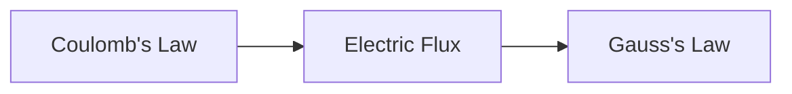

# BUTEX Notes Generator — `itachi-re/butex-notes`
> Repository: https://github.com/itachi-re/butex-notes

---

## How to Use

Attach your **syllabus** (PDF or image or text). Everything else is inferred automatically.

| Attachment | Role |
|---|---|
| Syllabus / topic list | **Required** — drives everything |
| Lecture slides / handwritten notes | Optional — scope, notation, emphasis check |
| `CONTRIBUTING.md` | Optional — overrides defaults if present |
| `CHANGELOG.md` | Optional — format reference only, never rewritten |

> **No syllabus → STOP.** Ask before proceeding.  
> **Ambiguous field** (missing credit/hours) → flag it, state your assumption, continue.

---

## Phase 0 — Syllabus Parsing

Parse the attached syllabus first. Display this block before writing a single file:

```
┌──────────────────────────────────────────────────┐
│  PARSED METADATA                                 │
├────────────────────┬─────────────────────────────┤
│ Course Code        │ e.g. PHY-103                │
│ Course Title       │ e.g. Physics – II           │
│ Department         │ e.g. Physics                │
│ Credit             │ e.g. 3.0                    │
│ Hours / Week       │ e.g. 3                      │
│ Total Hours        │ e.g. 45                     │
├────────────────────┼─────────────────────────────┤
│ COURSE NUMBER DECODED                            │
├────────────────────┼─────────────────────────────┤
│ Level (Year)       │ 1st digit of number         │
│ Term               │ 2nd digit of number         │
│ Type               │ Theory / Practical          │
├────────────────────┼─────────────────────────────┤
│ UNITS FOUND        │ N (listed below)            │
└────────────────────┴─────────────────────────────┘
```

### Course Number Decoding

```
[DEPT]-[L][T][S]
  DEPT  = department prefix
  L     = Level / Year  (1 = first year, 2 = second, …)
  T     = Term          (0 = first term, 1 = second, …)
  S     = Sequence      (4 = practical/sessional, else theory)
```

**BUTEX department prefixes**

| Code | Department |
|------|-----------|
| PHY | Physics |
| CHEM | Chemistry |
| MS / MATH | Mathematics & Statistics |
| YE | Yarn Engineering |
| WE | Weaving Engineering |
| WPE | Wet Processing Engineering |
| FE | Fashion Engineering |
| IPE | Industrial & Production Engineering |
| ME | Mechanical Engineering |
| EEE | Electrical & Electronic Engineering |
| CSE / MDM | Computer Science & Engineering |
| HSS | Humanities & Social Sciences |
| TE | Textile Engineering (general) |

> Unknown prefix → write `[PREFIX] (unresolved — verify against BUTEX curriculum)`.

### Unit Extraction

For every unit in the syllabus, output:

```
UNIT: [unit_name]
  Syllabus text (verbatim): "..."
  Topics (in syllabus order):
    01. ...
    02. ...
  File count: N
```

Preserve syllabus ordering exactly — no reordering, no merging topics.

---

## Phase 1 — Repository Layout

Emit the exact directory tree before generating any file.

### Structure (match existing repo conventions)

```
COURSE-CODE/
│
├── unit_name/               ← snake_case, no number prefix
│   ├── 01_topic_name.md     ← zero-padded, snake_case
│   ├── 02_topic_name.md
│   └── README.md
│
├── another_unit/
│   ├── 01_topic_name.md
│   └── README.md
│
├── qna/                     ← past questions & answers, class tests
├── quick_rev/               ← one-page exam cram sheets per unit
└── README.md                ← course index
```

**Naming rules (default to PHY-103 / CHEM-103 pattern):**

| Element | Convention | Example |
|---|---|---|
| Unit folder | `snake_case`, no number | `electricity/` |
| Topic file | `NN_snake_case.md` | `01_coulombs_law.md` |
| Support folders | lowercase | `qna/`, `quick_rev/` |
| Assets | Global `assets/` at repo root, named `COURSE-CODE_descriptor.svg` | `PHY-103_rlc_circuit.svg` |

> If `CONTRIBUTING.md` is attached and specifies different conventions, follow it and note the override.

---

## Phase 2 — Unit README

Each unit folder gets a `README.md` with:

1. Unit title and course reference line
2. Topic index table:

```markdown
| # | File | Topic |
|---|------|-------|
| 01 | [01_coulombs_law.md](01_coulombs_law.md) | Coulomb's Law |
| 02 | [02_electric_flux.md](02_electric_flux.md) | Electric Flux |
```

3. One Mermaid diagram showing the prerequisite/flow relationship between topics:



4. Formula cheat-sheet — one key equation per topic, LaTeX, no derivation
5. **Notation conventions** defined once here; topic files reference this section
---

## Phase 3 — Topic File Content

Every topic file follows this structure exactly.

---

### Frontmatter

Check `_templates/note_template.md` or `_templates/template.md` in the repo if attached.  
If not attached, use this schema:

```yaml
---
title: "<Topic Name>"
course: "<COURSE-CODE>"
course_title: "<Full Course Title>"
unit: "<unit_name>"
topic_number: <NN>
credit: <N>
hours_per_week: <N>
total_hours: <N>
level: <N>
term: <N>
course_type: "theory"    # or "practical"
date: "<YYYY-MM-DD>"     # today's date
tags:
  - <course-code-lowercase>
  - <unit-name>
  - <topic-keyword>
---
```

---

### Content Sections

#### 1. Overview

2–4 sentences:
- Why this topic exists here in the course flow
- What it builds on (with relative links to prior files: `[→ Coulomb's Law](01_coulombs_law.md)`)
- What it enables next

---

#### 2. Definitions & Key Terms

Numbered list. Each entry:

```
**N. Term** — *Formal definition (source-verified).*
> Plain-English: one sentence a first-year student could understand.
```

---

#### 3. Core Content

Adapt to course type:

**Physics / Experimental Science**
1. Statement of the law/principle in plain words
2. Experimental basis — who, how, conditions
3. Full mathematical derivation, every step labelled, no skipped algebra
4. Every symbol defined with SI unit at first use
5. Limits of validity — when does this break down?
6. Convention conflicts: `> ⚠️ Convention: Halliday uses … whereas Griffiths uses …`

**Mathematics**
1. Formal theorem statement
2. Complete proof — label technique: (Direct / Induction / Contradiction)
3. Geometric or intuitive interpretation
4. Counterexample if strict conditions apply

**Engineering / Applied**
1. Governing equation and physical meaning
2. Derivation or labelled sketch + reference link
3. Design parameter analysis
4. Dimensional analysis check

**Chemistry**
1. Mechanism or reaction (`$\ce{...}$`)
2. Step-by-step reasoning per elementary step
3. Thermodynamic / kinetic context
4. Industrial relevance

**CS / Programming**
1. Problem statement
2. Algorithm in pseudocode block
3. Correctness argument / invariant
4. Time `$O(\cdot)$`, space `$O(\cdot)$`
5. Known edge cases

---

#### 4. Worked Examples

Exactly **3 examples**, labelled by difficulty:

```markdown
### Example 1 — 🟢 Foundational
[Problem statement]
**Solution**
Step 1: …
Step 2: …
…
**Answer:** $x = …$ [units]
```

```
### Example 2 — 🟡 Intermediate
```

```
### Example 3 — 🔴 Advanced / Exam-level
```

- Show all algebra explicitly — no "it can be shown that"
- Box or bold the final numerical answer
- Include unit check for quantitative problems

---

#### 5. Applications

1–2 real-world or engineering applications. For each:
- **Name** — one-sentence description
- Which part of this topic it uses and why

---

#### 6. Diagram / Visual

Minimum **one visual** per file. Pick the right format:

| Format | When to use |
|--------|-------------|
| Mermaid `graph` / `flowchart` | Process flows, classification trees, concept relationships |
| Mermaid `sequenceDiagram` | Multi-step interactions |
| SVG (inline `<svg>` or linked) | Circuit diagrams, vector fields, geometric constructions |
| PNG in `../../assets/` | Plots generated with Python/matplotlib |
| `.ipynb` (linked) | Numerical simulations, interactive plots |

```markdown

*Figure 1: Caption explaining what the diagram shows and its significance.*
```

**alternatively use if not availavle:** PSD, BMP, TIFF, raw `.drawio`.  
try to Reuse openly-licensed diagrams (Wikimedia Commons, MIT OCW) with attribution; otherwise generate.

---

#### 7. Common Mistakes

3–5 entries:

```markdown
- ❌ **Mistake:** [what students typically get wrong]
  ✅ **Correct:** [the right way, with brief reason]
```

---

#### 8. Practice Problems

3–5 problems, solutions in `<details>`:

```markdown
**Problem N:** [Statement with all given values]

<details>
<summary>Solution</summary>

Step 1: ...

$$\text{Answer: } x = \text{value [unit]}$$

</details>
```

At least one must be multi-step with no scaffold (exam-style).

---

#### 9. Summary

Key-result table:

| Concept | Result | Condition / Limit |
|---------|--------|------------------|
| ... | ... | ... |

One sentence pointing forward to the next topic.

---

#### 10. References

3–5 entries:

```markdown
1. **Author, Title, Edition** — *What this source specifically adds.*
   [URL if freely accessible]
```

**Preferred sources by department:**

| Dept | Preferred References |
|---|---|
| PHY | Halliday & Resnick, Serway & Jewett, HyperPhysics, MIT OCW 8.02/8.03 |
| CHEM | Atkins, IUPAC Gold Book, LibreTexts Chemistry |
| MATH | Stewart, Apostol, Wolfram MathWorld, MIT OCW 18.01/18.06 |
| YE / WE / WPE / FE | Standard textile engineering textbooks, NPTEL |
| EEE | Hayt & Kemmerly, Sedra & Smith, MIT OCW 6.002 |
| CSE / MDM | CLRS, official docs, original papers |
| IPE / ME | Shigley, Beer & Johnston, NPTEL |

---

## Phase 4 — Support Files

After all topic files, generate these two:

### `qna/README.md`

Skeleton only — one-liner per past CT/exam topic found in the syllabus. Leave content blank for manual fill:

```markdown
# QnA — COURSE-CODE

| Year | Type | Topic |
|------|------|-------|
| — | CT-01 | Coulomb's Law, Gauss's Law |
```

### `quick_rev/NN_unit_name.md`

One quick-revision sheet per unit — exam-cram format:
- Key definitions: one line each
- Key formulae: LaTeX only, no derivation
- 2–3 most common exam question types with answer skeleton

---

## Phase 5 — Math & Notation Conventions

Apply everywhere, consistently:

- Inline math: `$...$`
- Display math: `$$...$$` on its own line
- Chemical equations: `$\ce{...}$`
- Units: SI by default — if non-SI, declare once per file at the top
- Vectors: bold `$\mathbf{F}$` OR arrow `$\vec{F}$` — pick one per file, stay consistent
- Every symbol defined at first use — never assume reader knows

---

## Phase 6 — Research Standard

- Verify every definition, law, formula, derivation against **2–3 authoritative sources** before writing
- **Paraphrase everything** — no source text copied verbatim
- Sources disagree on convention → add `⚠️ Convention note:` inline
- Lecture notes use non-standard notation → flag with:
  > ⚠️ Notation mismatch: lecture uses $X$; standard form (Halliday) is $Y$. This file follows standard.
- Derivation genuinely out of scope → labelled sketch + reference link; do not silently omit

---

## Phase 7 — Changelog Entry

Output **only** the new entries in a fenced block, ready to paste:

```
## [Unreleased]

### Added
- PHY-103/electricity/01_coulombs_law.md
- PHY-103/electricity/02_electric_flux.md
- PHY-103/electricity/README.md
- PHY-103/quick_rev/01_electricity.md
```

One line per file. No descriptions needed — path is self-documenting.

---

## Pre-Delivery Checklist

**Parsing**
- [ ] Metadata block shown before any file is generated
- [ ] Department decoded; flagged if unknown prefix
- [ ] Level, Term, Type inferred from course number
- [ ] All units extracted; order matches syllabus exactly

**Structure**
- [ ] Directory tree emitted before first file
- [ ] Unit folders: `snake_case`, no number prefix
- [ ] Topic files: `NN_snake_case.md`, zero-padded
- [ ] `qna/` and `quick_rev/` scaffolded
- [ ] Assets referenced from global `../../assets/`

**Per-file**
- [ ] Frontmatter complete; `date` = today
- [ ] Every definition/law checked against 2–3 sources
- [ ] Full derivation or sketch + reference — nothing silently skipped
- [ ] 3 worked examples: Foundational / Intermediate / Exam-Level
- [ ] At least one properly-embedded, alt-texted visual
- [ ] Common mistakes section present
- [ ] Practice problems: solutions in `<details>`
- [ ] Summary table with forward link to next topic
- [ ] 3–5 references with one-line annotations

**Final**
- [ ] Changelog block ready to paste
- [ ] No source text copied verbatim
