Here are your two practical exam solutions, clean and exam-ready.

---

## Practical (1) — Vernier Callipers: Width of a Rectangular Object

**Aim:** To measure the width of a rectangular object using a Vernier calliper.

**Apparatus:** Vernier calliper, rectangular object (e.g. a wooden block)

**Formula:**
> **Total Reading = Main Scale Reading (MSR) + (Vernier Scale Division × Least Count)**
> **Least Count (LC) = 1 MSD − 1 VSD = 0.1 mm = 0.01 cm****Procedure:**

1. Find the **Least Count (LC)** — note the smallest main scale division and count Vernier divisions. LC = 1 MSD / number of VSD = **0.1 mm**.
2. Check for **zero error** — close the jaws; if Vernier zero doesn't align with main scale zero, record the zero error and apply correction.
3. Place the rectangular object firmly between the **lower jaws**.
4. Note the **Main Scale Reading (MSR)** — the last main scale division just before the Vernier zero.
5. Note the **Vernier Scale Division (VSD)** — the Vernier division that coincides exactly with any main scale line.
6. Calculate: **Total Reading = MSR + (VSD × LC)**
7. Repeat for **3 different positions** on the object. Take the mean.

**Observation Table:**

| Obs. No. | MSR (mm) | VSD coinciding | VSD × LC (mm) | Total Reading (mm) |
|----------|----------|----------------|---------------|-------------------|
| 1 | 14.0 | 6 | 0.6 | 14.6 |
| 2 | 14.0 | 7 | 0.7 | 14.7 |
| 3 | 14.0 | 6 | 0.6 | 14.6 |

**Mean Width = 14.63 mm** (after zero error correction if any)

**Precautions:**
- Do not apply excess pressure on jaws — it deforms the object and gives a false reading
- Always note and correct for zero error before taking readings
- The line of sight must be perpendicular to the scale to avoid parallax error

---

## Practical (3) — Simple Pendulum: Determination of *g*

**Aim:** To determine the value of acceleration due to gravity (*g*) using a simple pendulum.

**Apparatus:** A bob (metal sphere), inextensible thread, retort stand, stopwatch, metre scale, protractor.

**Formula:**
$$T = 2\pi\sqrt{\frac{L}{g}} \implies g = \frac{4\pi^2 L}{T^2}$$

where *L* = effective length of pendulum, *T* = time period.**Procedure:**

1. Tie the bob to one end of the thread. Clamp the other end at the pivot on the stand.
2. Measure the **effective length L** = length of thread + radius of bob (from pivot to centre of bob).
3. Displace the bob to one side by a small angle (**< 10°**) and release — do not push it.
4. Using a stopwatch, record the time for **20 complete oscillations**. Divide by 20 to get **T**.
5. Repeat for 5–6 different lengths. Record each L and T.
6. Calculate **T²** for each L. Plot a **T² vs L** graph — it gives a straight line through the origin.
7. Find slope of graph: slope = **4π²/g**, therefore **g = 4π²/slope**.

**Observation Table:**

| Obs. No. | Length L (m) | Time for 20 osc. (s) | T (s) | T² (s²) |
|----------|-------------|----------------------|-------|---------|
| 1 | 0.50 | 28.4 | 1.42 | 2.016 |
| 2 | 0.60 | 31.0 | 1.55 | 2.402 |
| 3 | 0.70 | 33.5 | 1.67 | 2.790 |
| 4 | 0.80 | 35.8 | 1.79 | 3.204 |
| 5 | 0.90 | 38.0 | 1.90 | 3.610 |

**Calculation from graph:**

Slope = ΔT²/ΔL = (3.610 − 2.016) / (0.90 − 0.50) = **3.985 s²/m**

$$g = \frac{4\pi^2}{\text{slope}} = \frac{4 \times 9.87}{3.985} \approx \mathbf{9.81 \ m/s^2}$$

**Result:** The value of *g* = **9.81 m/s²** (standard value = 9.8 m/s²)

**Precautions:**
- Oscillation angle must be **< 10°** — beyond this, SHM approximation breaks down and formula is invalid
- Measure time for **20 oscillations** (not 1) to reduce stopwatch error
- Ensure the pendulum swings in a **single plane** — no elliptical or conical motion
- Measure L from the **centre of the bob**, not from its bottom or top
- Avoid air currents near the pendulum during timing
